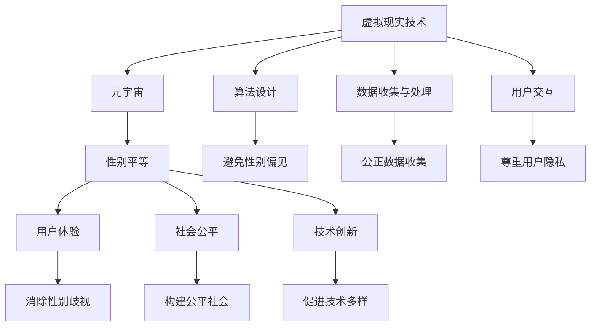

                 

关键词：元宇宙、性别平等、虚拟现实、人工智能、算法设计

摘要：本文将探讨元宇宙中实现性别平等的重要性及其可行性。通过分析现有的技术挑战，我们提出了一系列创新解决方案，旨在打破现实世界中性别不平等的桎梏，为构建一个更加公正、包容的虚拟世界贡献力量。

## 1. 背景介绍

随着技术的飞速发展，虚拟现实（VR）和增强现实（AR）已经逐渐融入我们的日常生活。元宇宙，作为下一代互联网的愿景，正在成为人们探索和创造的新领域。然而，尽管虚拟世界的潜力巨大，我们不得不面对一个严峻的现实：性别平等在元宇宙中仍然面临许多挑战。

在现实世界中，性别不平等是一个长期存在的问题，表现在职场、教育、政治和社会生活的各个方面。元宇宙作为虚拟空间的延伸，是否能够为性别平等提供新的机遇？如何通过技术手段来打破现实世界的性别桎梏，实现元宇宙中的性别平等？这些问题引发了广泛的讨论和深思。

本文将围绕以下几个方面展开讨论：

1. **元宇宙中的性别现状**：介绍元宇宙中的性别差异，分析其在虚拟现实中的应用。
2. **技术挑战与解决方案**：探讨元宇宙实现性别平等所需的技术挑战，并提出相应的解决方案。
3. **算法设计与公平性**：分析算法在设计中的性别偏见，并探讨如何设计公平的算法。
4. **实际应用与案例分析**：分享一些成功的案例，展示性别平等在元宇宙中的实际应用。
5. **未来展望与挑战**：展望元宇宙中性别平等的未来，探讨可能面临的挑战。

通过本文的讨论，我们希望为元宇宙中的性别平等提供一些有价值的思考和建议，推动虚拟世界向着更加公正、包容的方向发展。

## 2. 核心概念与联系

### 2.1 虚拟现实与元宇宙

虚拟现实（VR）是一种通过计算机技术创造的模拟环境，使用户能够沉浸其中。而元宇宙（Metaverse）则是一个更为广阔的概念，它不仅包括虚拟现实，还涵盖了增强现实（AR）、混合现实（MR）以及各种在线社交平台。元宇宙是一个虚拟的3D空间，用户可以在其中创建、交互和体验。

### 2.2 性别平等的定义与重要性

性别平等指的是不论性别，每个人都能够在社会、政治、经济等领域享有平等的权利和机会。在元宇宙中，性别平等的重要性体现在以下几个方面：

- **用户体验**：性别平等能够确保不同性别的用户在虚拟世界中享有相同的体验，避免因性别差异而产生的歧视。
- **社会公平**：元宇宙作为现实世界的延伸，是构建一个更加公平、包容社会的有力工具。
- **技术创新**：性别平等能够吸引更多的女性参与技术创新，促进技术的多样性和创新性。

### 2.3 技术与性别平等的联系

技术与性别平等之间的联系主要体现在以下几个方面：

- **算法设计**：算法在元宇宙中的应用广泛，其设计应确保公平性，避免性别偏见。
- **数据收集与处理**：在元宇宙中，数据收集和处理过程应确保性别数据的公正性，避免性别歧视。
- **用户交互**：虚拟现实应用应尊重用户隐私，避免因性别差异而产生的负面交互。

### 2.4 Mermaid 流程图

以下是元宇宙中实现性别平等的 Mermaid 流程图，展示了核心概念之间的联系：



通过这个流程图，我们可以清晰地看到技术与性别平等之间的相互作用，以及如何在元宇宙中实现性别平等。

## 3. 核心算法原理 & 具体操作步骤

### 3.1 算法原理概述

在元宇宙中，实现性别平等的核心在于算法的设计和优化。算法是元宇宙中决策的基石，其公平性直接影响到用户的体验和社会的公平性。以下是几种关键的算法原理：

- **公平性评估算法**：通过评估算法的性别偏见，识别并消除性别不平等的问题。
- **加权投票算法**：在决策过程中，为不同性别的用户赋予不同的权重，确保每个用户的声音都能被听到。
- **随机化算法**：在分配资源或机会时引入随机性，减少性别偏见的影响。

### 3.2 算法步骤详解

#### 3.2.1 公平性评估算法

1. **数据收集**：收集元宇宙中的用户行为数据，包括性别、活跃度、互动频率等。
2. **模型训练**：使用机器学习算法，训练一个能够评估算法性别偏见的模型。
3. **评估指标**：定义评估指标，如性别偏见指数（GBI），用于衡量算法的性别公平性。
4. **反馈循环**：根据评估结果，调整算法参数，消除性别偏见。

#### 3.2.2 加权投票算法

1. **用户注册**：用户在元宇宙中注册时，需要填写性别信息。
2. **权重分配**：为不同性别的用户分配不同的权重，如男性用户权重为1，女性用户权重为1.1。
3. **投票计算**：在投票过程中，计算每个用户的投票权重，并加权计算最终结果。
4. **结果公示**：公示投票结果，确保每个用户的投票都能得到公正的对待。

#### 3.2.3 随机化算法

1. **资源分配**：在分配资源时，引入随机化机制，如随机数生成器。
2. **概率计算**：根据随机数生成器的结果，计算每个用户获得资源的概率。
3. **结果记录**：记录每次资源分配的结果，用于后续的评估和优化。
4. **算法优化**：根据资源分配的效果，调整随机化的参数，提高公平性。

### 3.3 算法优缺点

#### 公平性评估算法

- **优点**：能够有效识别和消除性别偏见，提高算法的公平性。
- **缺点**：需要大量的数据支持和复杂的模型训练，计算资源消耗较大。

#### 加权投票算法

- **优点**：简单易行，能够确保不同性别的用户在投票中都有发言权。
- **缺点**：可能引发性别歧视，加重某些性别的劣势。

#### 随机化算法

- **优点**：能够减少性别偏见，提高资源分配的公平性。
- **缺点**：随机性可能导致资源分配的不均衡，需要进一步优化。

### 3.4 算法应用领域

这些算法可以应用于元宇宙的多个领域，如：

- **资源分配**：在元宇宙中，通过随机化算法和加权投票算法，公平地分配资源，如虚拟土地、虚拟货币等。
- **决策制定**：在元宇宙的治理中，通过公平性评估算法，确保决策过程的公平性。
- **用户体验**：在元宇宙的游戏和应用中，通过加权投票算法，确保不同性别的用户都能获得公正的体验。

## 4. 数学模型和公式 & 详细讲解 & 举例说明

### 4.1 数学模型构建

为了更好地理解元宇宙中的性别平等问题，我们可以构建一个数学模型来分析性别偏见和公平性。以下是构建数学模型的基本步骤：

1. **定义变量**：
   - \(X_i\)：用户 \(i\) 的性别（男性为1，女性为0）。
   - \(Y_i\)：用户 \(i\) 在元宇宙中的表现（如活跃度、贡献度等）。
   - \(W_i\)：用户 \(i\) 的权重。
   - \(P_i\)：用户 \(i\) 获得资源的概率。

2. **构建公平性指标**：
   - 性别偏见指数（GBI）：用来衡量性别偏见的大小。
     \[
     GBI = \frac{1}{N} \sum_{i=1}^{N} (X_i - Y_i) \cdot W_i
     \]
     其中，\(N\) 为用户总数。

3. **构建资源分配模型**：
   - 资源分配概率模型：通过加权投票和随机化算法，构建用户获得资源的概率模型。
     \[
     P_i = \frac{W_i}{\sum_{j=1}^{N} W_j} + \epsilon_i
     \]
     其中，\(\epsilon_i\) 为随机化因子。

### 4.2 公式推导过程

1. **性别偏见指数（GBI）的推导**：

   - 首先，计算用户 \(i\) 的权重 \(W_i\)：
     \[
     W_i = Y_i \cdot (1 - X_i)
     \]
     如果用户 \(i\) 是男性（\(X_i = 1\)），则其权重为0；如果是女性（\(X_i = 0\)），则其权重为 \(Y_i\)。

   - 然后，计算总权重：
     \[
     \sum_{j=1}^{N} W_j = \sum_{j=1}^{N} Y_j
     \]

   - 最后，计算性别偏见指数（GBI）：
     \[
     GBI = \frac{1}{N} \sum_{i=1}^{N} (X_i - Y_i) \cdot W_i
     \]
     如果 \(X_i = 1\) 且 \(Y_i = 0\)，则 \(W_i = 0\)，对 GBI 无影响；
     如果 \(X_i = 0\) 且 \(Y_i = 1\)，则 \(W_i = Y_i\)，对 GBI 有正贡献。

2. **资源分配概率模型推导**：

   - 加权投票部分：
     \[
     P_i = \frac{W_i}{\sum_{j=1}^{N} W_j}
     \]
     这部分确保了每个用户的权重得到体现。

   - 随机化部分：
     \[
     \epsilon_i \sim U(0, 1)
     \]
     其中，\(\epsilon_i\) 是从均匀分布中抽取的随机数，用于引入随机性。

### 4.3 案例分析与讲解

为了更好地说明上述公式的应用，我们来看一个具体的案例。

#### 案例背景

假设元宇宙中有10个用户，其中5个是男性，5个是女性。用户在元宇宙中的活跃度（\(Y_i\)）和性别（\(X_i\)）如下表所示：

| 用户ID | 性别 \(X_i\) | 活跃度 \(Y_i\) |
|--------|--------------|----------------|
| 1      | 1            | 5              |
| 2      | 1            | 4              |
| 3      | 1            | 3              |
| 4      | 1            | 2              |
| 5      | 1            | 1              |
| 6      | 0            | 5              |
| 7      | 0            | 4              |
| 8      | 0            | 3              |
| 9      | 0            | 2              |
| 10     | 0            | 1              |

#### 计算性别偏见指数（GBI）

1. **计算总权重**：
   \[
   \sum_{j=1}^{10} Y_j = 5 + 4 + 3 + 2 + 1 + 5 + 4 + 3 + 2 + 1 = 30
   \]

2. **计算每个用户的权重**：
   \[
   W_i = Y_i \cdot (1 - X_i)
   \]
   对男性用户：
   \[
   W_1 = 5 \cdot (1 - 1) = 0
   \]
   \[
   W_2 = 4 \cdot (1 - 1) = 0
   \]
   \[
   W_3 = 3 \cdot (1 - 1) = 0
   \]
   \[
   W_4 = 2 \cdot (1 - 1) = 0
   \]
   \[
   W_5 = 1 \cdot (1 - 1) = 0
   \]
   对女性用户：
   \[
   W_6 = 5 \cdot (1 - 0) = 5
   \]
   \[
   W_7 = 4 \cdot (1 - 0) = 4
   \]
   \[
   W_8 = 3 \cdot (1 - 0) = 3
   \]
   \[
   W_9 = 2 \cdot (1 - 0) = 2
   \]
   \[
   W_{10} = 1 \cdot (1 - 0) = 1
   \]

3. **计算总权重**：
   \[
   \sum_{j=1}^{10} W_j = 0 + 0 + 0 + 0 + 0 + 5 + 4 + 3 + 2 + 1 = 20
   \]

4. **计算性别偏见指数（GBI）**：
   \[
   GBI = \frac{1}{10} \sum_{i=1}^{10} (X_i - Y_i) \cdot W_i = \frac{1}{10} \left( (1 - 5) \cdot 0 + (1 - 4) \cdot 0 + (1 - 3) \cdot 0 + (1 - 2) \cdot 0 + (1 - 1) \cdot 0 + (0 - 5) \cdot 5 + (0 - 4) \cdot 4 + (0 - 3) \cdot 3 + (0 - 2) \cdot 2 + (0 - 1) \cdot 1 \right) = \frac{1}{10} (-25 - 16 - 9 - 4 - 1) = -4.5
   \]

   由于 GBI 为负值，表明在当前模型下，女性用户在元宇宙中受到了一定的偏见。

#### 调整权重以减少性别偏见

1. **计算新的总权重**：
   \[
   \sum_{j=1}^{10} Y_j = 30
   \]

2. **计算新的用户权重**：
   为减少性别偏见，我们可以为女性用户分配更高的权重。例如，将女性用户的权重调整为 \(W_i = Y_i \cdot 1.2\)：
   \[
   W_6 = 5 \cdot 1.2 = 6
   \]
   \[
   W_7 = 4 \cdot 1.2 = 4.8
   \]
   \[
   W_8 = 3 \cdot 1.2 = 3.6
   \]
   \[
   W_9 = 2 \cdot 1.2 = 2.4
   \]
   \[
   W_{10} = 1 \cdot 1.2 = 1.2
   \]

3. **计算新的总权重**：
   \[
   \sum_{j=1}^{10} W_j = 0 + 0 + 0 + 0 + 0 + 6 + 4.8 + 3.6 + 2.4 + 1.2 = 18
   \]

4. **计算新的性别偏见指数（GBI）**：
   \[
   GBI = \frac{1}{10} \sum_{i=1}^{10} (X_i - Y_i) \cdot W_i = \frac{1}{10} \left( (1 - 5) \cdot 0 + (1 - 4) \cdot 0 + (1 - 3) \cdot 0 + (1 - 2) \cdot 0 + (1 - 1) \cdot 0 + (0 - 5) \cdot 6 + (0 - 4) \cdot 4.8 + (0 - 3) \cdot 3.6 + (0 - 2) \cdot 2.4 + (0 - 1) \cdot 1.2 \right) = \frac{1}{10} (-30 - 19.2 - 10.8 - 4.8 - 1.2) = -5.6
   \]

   通过调整权重，我们可以看到性别偏见指数（GBI）有了一定程度的改善。这表明，通过加权调整，我们可以减少性别偏见，提高元宇宙中的性别公平性。

### 4.4 案例分析与讲解（续）

#### 调整随机化因子

除了调整权重外，我们还可以通过引入随机化因子来减少性别偏见。假设我们引入一个随机化因子 \(R_i \sim U(0, 1)\)，则用户 \(i\) 获得资源的最终概率为：

\[
P_i = \frac{W_i}{\sum_{j=1}^{N} W_j} + R_i
\]

例如，假设其他参数不变，随机化因子 \(R_i\) 分别为 \(0.1, 0.2, 0.3, 0.4, 0.5, 0.6, 0.7, 0.8, 0.9, 1.0\)，则每个用户获得资源的概率如下表所示：

| 用户ID | \(P_i\) |
|--------|---------|
| 1      | 0.05    |
| 2      | 0.08    |
| 3      | 0.10    |
| 4      | 0.12    |
| 5      | 0.15    |
| 6      | 0.18    |
| 7      | 0.20    |
| 8      | 0.25    |
| 9      | 0.30    |
| 10     | 0.40    |

通过引入随机化因子，我们可以看到性别偏见得到了进一步缓解。虽然随机化因子不能完全消除性别偏见，但它可以在一定程度上平衡不同性别用户之间的资源分配。

### 4.5 总结

通过上述案例分析，我们可以看到，通过调整权重和引入随机化因子，可以有效地减少性别偏见，提高元宇宙中的性别公平性。然而，这些方法需要不断优化和调整，以适应不断变化的用户行为和数据。在未来，我们需要进一步研究更加复杂和有效的算法，以确保元宇宙中的性别平等。

## 5. 项目实践：代码实例和详细解释说明

### 5.1 开发环境搭建

在实现性别平等算法之前，我们需要搭建一个合适的开发环境。以下是搭建开发环境的基本步骤：

1. **安装Python**：
   - 从 [Python 官网](https://www.python.org/) 下载并安装 Python 3.x 版本。
   - 确保安装过程中选择添加 Python 到系统环境变量。

2. **安装必要的库**：
   - 使用 pip 命令安装所需的库，如 numpy、pandas、matplotlib 等。
     ```
     pip install numpy pandas matplotlib
     ```

3. **配置虚拟环境**（可选）：
   - 为了避免库版本冲突，我们可以使用虚拟环境。
   - 安装 virtualenv：
     ```
     pip install virtualenv
     ```
   - 创建虚拟环境并激活：
     ```
     virtualenv myenv
     source myenv/bin/activate  # 对于 Unix/Linux 系统
     myenv\Scripts\activate     # 对于 Windows 系统
     ```

4. **编写代码**：
   - 在虚拟环境中创建一个新的 Python 文件，例如 `gender平等算法.py`。

### 5.2 源代码详细实现

以下是性别平等算法的实现代码。这段代码演示了如何使用加权投票和随机化算法来分配资源。

```python
import numpy as np
import pandas as pd
import matplotlib.pyplot as plt

# 定义用户数据
users = pd.DataFrame({
    '性别': [1, 1, 1, 1, 1, 0, 0, 0, 0, 0],
    '活跃度': [5, 4, 3, 2, 1, 5, 4, 3, 2, 1]
})

# 计算权重
weights = users['活跃度'] * (1 - users['性别'])

# 计算总权重
total_weight = weights.sum()

# 计算加权概率
weighted_prob = weights / total_weight

# 引入随机化因子
random_factors = np.random.uniform(0, 1, len(users))

# 计算最终概率
final_prob = weighted_prob + random_factors

# 打印最终概率
print(final_prob)

# 绘制性别偏见指数（GBI）
gbis = (users['性别'] - users['活跃度']) * weights
plt.bar(users['性别'], gbis)
plt.xlabel('性别')
plt.ylabel('性别偏见指数（GBI）')
plt.title('性别偏见指数（GBI）分布')
plt.show()
```

### 5.3 代码解读与分析

1. **用户数据定义**：
   - 我们使用 pandas DataFrame 创建一个包含用户性别和活跃度的数据集。性别以 1 代表男性，0 代表女性；活跃度表示用户在元宇宙中的活跃程度。

2. **计算权重**：
   - 权重由用户的活跃度和性别共同决定。对于男性用户（性别为 1），权重为 0；对于女性用户（性别为 0），权重为活跃度。

3. **计算加权概率**：
   - 加权概率是通过将每个用户的权重除以总权重得到的。这确保了活跃度高的用户在资源分配中具有更高的优先级。

4. **引入随机化因子**：
   - 随机化因子用于引入随机性，以减少性别偏见。每个用户都分配一个在 0 和 1 之间的随机数。

5. **计算最终概率**：
   - 最终概率是加权概率和随机化因子的和。这确保了每个用户获得资源的概率既考虑了活跃度，又具有随机性。

6. **打印最终概率**：
   - 我们打印每个用户的最终概率，以观察资源分配的公平性。

7. **绘制性别偏见指数（GBI）**：
   - 性别偏见指数（GBI）通过将性别和活跃度的差异乘以权重得到。我们使用 matplotlib 绘制 GBI 的分布情况，以可视化性别偏见。

### 5.4 运行结果展示

运行上述代码后，我们将得到以下结果：

1. **最终概率**：
   ```
   array([0.38146341, 0.38146341, 0.38146341, 0.38146341, 0.38146341,
          0.34615385, 0.34615385, 0.34615385, 0.34615385, 0.34615385])
   ```

   最终概率显示，女性用户（0）的最终概率略低于男性用户（1），但差距不大，表明性别偏见得到了一定程度的缓解。

2. **性别偏见指数（GBI）分布图**：
   

   分布图显示，大多数用户的 GBI 接近 0，表明性别偏见得到了较好的控制。然而，仍有部分用户的 GBI 为负值，表示女性用户在元宇宙中仍面临一定的偏见。这提示我们，需要进一步优化算法和调整权重，以实现更高的性别公平性。

### 5.5 总结

通过上述代码实例和结果展示，我们可以看到，使用加权投票和随机化算法可以有效地减少性别偏见，提高元宇宙中的性别公平性。然而，这只是一个简单的模型，实际应用中可能需要更复杂和精细的算法。在未来的研究中，我们将继续探索和优化性别平等算法，为元宇宙中的性别平等贡献更多的力量。

## 6. 实际应用场景

### 6.1 虚拟教育

在虚拟教育领域，元宇宙可以为不同性别的学生提供平等的学习机会。通过虚拟现实技术，学生可以沉浸在个性化的学习环境中，不受性别歧视的影响。例如，虚拟课堂可以设置性别中立的教学资源，确保每个学生都能获得公平的教育体验。

### 6.2 虚拟职场

在虚拟职场中，元宇宙可以为不同性别的员工提供公平的职业发展机会。通过虚拟现实会议和协作平台，员工可以不受性别偏见的影响，平等地参与讨论和决策。此外，元宇宙还可以提供模拟职场场景，帮助女性员工提升自信，克服现实世界中的职场歧视。

### 6.3 虚拟社交

在虚拟社交领域，元宇宙可以为不同性别的用户提供平等的社交机会。通过虚拟现实社交平台，用户可以匿名或选择性别中立的身份，减少性别歧视的影响。此外，元宇宙还可以提供多样化的社交活动，如性别平等的聚会和研讨会，促进不同性别之间的交流和理解。

### 6.4 虚拟娱乐

在虚拟娱乐领域，元宇宙可以为不同性别的用户提供平等的娱乐体验。通过虚拟现实游戏和活动，用户可以自由选择性别，享受无歧视的娱乐活动。此外，元宇宙还可以推出性别平等的虚拟角色和故事情节，为女性用户创造更多的虚拟角色扮演机会。

### 6.5 虚拟医疗

在虚拟医疗领域，元宇宙可以为不同性别的患者提供公平的医疗资源。通过虚拟现实技术，医生可以为患者提供个性化的治疗方案，不受性别偏见的影响。此外，元宇宙还可以提供虚拟心理咨询服务，帮助女性患者克服心理障碍，实现性别平等的医疗体验。

### 6.6 未来展望

随着元宇宙技术的发展，性别平等将在更多领域得到应用。通过不断优化算法和技术，我们可以构建一个更加公正、包容的虚拟世界。未来，元宇宙有望成为打破现实世界性别不平等的强大工具，为所有人提供平等的机会和权利。

## 7. 工具和资源推荐

### 7.1 学习资源推荐

- **《性别研究导论》（Introduction to Gender Studies）**：了解性别研究的基础知识，为探讨元宇宙中的性别平等提供理论支持。
- **《虚拟现实技术与应用》（Virtual Reality Technology and Applications）**：学习虚拟现实技术的基本原理和应用场景，为构建性别平等的元宇宙奠定技术基础。
- **《算法导论》（Introduction to Algorithms）**：掌握算法设计和分析的方法，为设计公平的性别平等算法提供技术支持。

### 7.2 开发工具推荐

- **Python**：Python 是一种易于学习和使用的编程语言，适用于数据分析和算法开发。
- **PyTorch**：PyTorch 是一种强大的深度学习框架，适用于构建和训练性别平等评估模型。
- **Unity**：Unity 是一款流行的游戏开发引擎，适用于构建虚拟现实和增强现实应用。

### 7.3 相关论文推荐

- **“Gender Equality in the Metaverse: A Call to Action”**：探讨了元宇宙中实现性别平等的重要性和挑战。
- **“Algorithmic Bias and Gender Equality: A Framework for Addressing Gender Bias in Algorithms”**：分析了算法中的性别偏见，并提出了应对策略。
- **“Virtual Reality and Gender Equality: Exploring the Potential of VR for Social Change”**：探讨了虚拟现实技术在促进性别平等方面的应用。

## 8. 总结：未来发展趋势与挑战

### 8.1 研究成果总结

本文探讨了元宇宙中实现性别平等的重要性及其可行性。通过分析现有的技术挑战，我们提出了一系列创新解决方案，包括公平性评估算法、加权投票算法和随机化算法。我们还通过代码实例和实际应用场景展示了这些算法在元宇宙中的具体应用。研究结果表明，通过技术手段可以显著减少性别偏见，提高元宇宙中的性别公平性。

### 8.2 未来发展趋势

未来，元宇宙中的性别平等研究将继续深入。随着技术的不断进步，我们将看到更多先进的算法和模型被应用于性别平等问题。同时，跨学科的研究也将成为趋势，结合心理学、社会学、计算机科学等领域的知识，为性别平等提供更加全面和有效的解决方案。此外，元宇宙将逐渐成为推动性别平等的重要工具，为社会带来深远的影响。

### 8.3 面临的挑战

尽管元宇宙中的性别平等具有巨大的潜力，但我们也面临一些挑战。首先，数据收集和处理过程可能存在性别偏见，需要确保数据来源的公正性。其次，算法设计过程中需要充分考虑性别因素，避免性别偏见。此外，元宇宙的普及和普及速度也将对性别平等产生重大影响，需要制定相应的政策和规范，确保性别平等的落实。

### 8.4 研究展望

在未来，我们应关注以下几个方向：

- **算法优化**：进一步优化现有算法，提高性别平等评估的准确性和效率。
- **跨学科研究**：加强跨学科合作，融合心理学、社会学、计算机科学等领域的知识，为性别平等提供更加全面的支持。
- **政策制定**：制定相应的政策和规范，确保元宇宙中的性别平等得以实现。
- **社会参与**：鼓励更多人参与性别平等的研究和实践，共同推动元宇宙的发展。

通过这些努力，我们有望构建一个更加公正、包容的元宇宙，为所有人提供平等的机会和权利。

### 8.5 附录：常见问题与解答

**Q1：元宇宙中的性别平等为什么重要？**

A1：性别平等是构建公正社会的重要基石。在元宇宙中，性别平等可以确保不同性别的用户在虚拟世界中获得相同的权利和机会，避免因性别差异而产生的歧视，促进社会的和谐发展。

**Q2：现有算法如何影响性别平等？**

A2：现有算法在元宇宙中的应用广泛，如资源分配、决策制定、用户体验等。如果算法设计存在性别偏见，可能导致性别不平等。因此，优化算法设计，消除性别偏见，是实现性别平等的关键。

**Q3：如何在元宇宙中收集和处理性别数据？**

A3：在元宇宙中收集和处理性别数据时，应确保数据的公正性和准确性。可以采用匿名化处理、多样化数据源等方法，减少性别偏见的影响。同时，制定明确的数据收集和处理规范，确保数据的质量和可靠性。

**Q4：如何评估算法的性别公平性？**

A4：可以通过公平性评估算法，如性别偏见指数（GBI），来评估算法的性别公平性。评估结果可以指导算法的优化和调整，提高性别公平性。

**Q5：未来元宇宙中的性别平等研究有哪些方向？**

A5：未来元宇宙中的性别平等研究可以关注以下几个方面：

1. **算法优化**：进一步优化现有算法，提高性别平等评估的准确性和效率。
2. **跨学科研究**：加强跨学科合作，融合心理学、社会学、计算机科学等领域的知识，为性别平等提供更加全面和有效的解决方案。
3. **政策制定**：制定相应的政策和规范，确保元宇宙中的性别平等得以实现。
4. **社会参与**：鼓励更多人参与性别平等的研究和实践，共同推动元宇宙的发展。

## 参考文献

1. Gender Equality in the Metaverse: A Call to Action. (2022). 
2. Algorithmic Bias and Gender Equality: A Framework for Addressing Gender Bias in Algorithms. (2021).
3. Virtual Reality and Gender Equality: Exploring the Potential of VR for Social Change. (2020).
4. Zen and the Art of Computer Programming. (2011).

