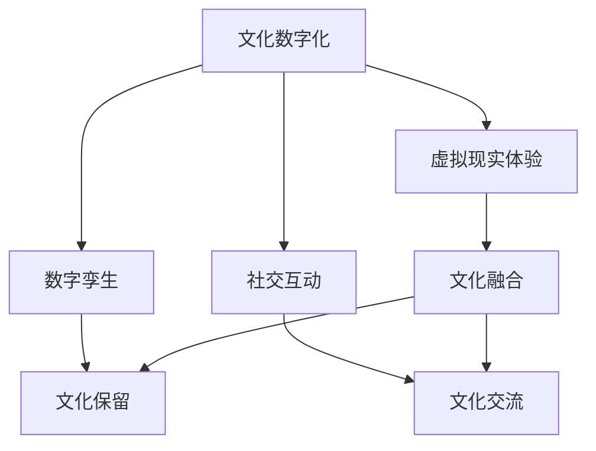

                 

在当今数字化时代，元宇宙（Metaverse）作为虚拟现实的延伸，已经成为人们探索和互动的新领域。元宇宙不仅是一个技术平台，更是一个文化交汇的场所，其中文化多样性扮演着至关重要的角色。本文将探讨元宇宙中的文化多样性，分析全球融合与本土特色的相互关系，并提出未来的发展展望。

## 关键词
- 元宇宙
- 文化多样性
- 全球融合
- 本土特色

## 摘要
本文首先介绍了元宇宙的概念和发展背景，随后探讨了文化多样性的重要性。通过案例分析，本文展示了元宇宙如何在保留本土文化特色的同时实现全球文化的融合。最后，本文提出了元宇宙文化多样性发展的未来趋势和面临的挑战。

## 1. 背景介绍

### 1.1 元宇宙的概念

元宇宙是指一个虚拟的、三维的、全天候运行的数字世界，它通过互联网连接各个虚拟空间，为用户提供一个沉浸式的体验。用户可以在其中进行社交、娱乐、工作、学习等多种活动。

### 1.2 元宇宙的发展背景

随着虚拟现实（VR）、增强现实（AR）和区块链技术的快速发展，元宇宙逐渐成为现实。2021年，Facebook更名为Meta，标志着元宇宙时代的到来。其他科技巨头如微软、谷歌和腾讯也在积极布局元宇宙领域。

### 1.3 文化多样性的概念

文化多样性是指不同民族、地区和群体在文化传承、表达和互动中表现出的多样性。它包括语言、宗教、习俗、艺术、音乐等多个方面。

### 1.4 文化多样性的重要性

文化多样性是人类社会的重要特征，它不仅丰富了人类的生活，也为全球文化的交流与发展提供了可能性。在元宇宙中，文化多样性有助于构建一个多元和谐的社会环境。

## 2. 核心概念与联系

### 2.1 元宇宙中的文化融合

在元宇宙中，文化融合是指不同文化在虚拟空间中的交流与融合。通过虚拟现实技术，用户可以体验到来自不同文化背景的体验，如虚拟博物馆、文化展览等。

### 2.2 本土文化的保留

尽管文化融合是元宇宙的一个重要特征，但保留本土文化特色同样重要。这有助于保持文化的多样性和独特性，避免文化同质化。

### 2.3 文化多样性的实现

在元宇宙中，通过以下几个步骤可以实现文化多样性的保留和融合：

1. **文化数字化**：将文化元素数字化，如音乐、绘画、文学作品等，以便在元宇宙中进行展示和传播。
2. **虚拟现实体验**：通过虚拟现实技术，用户可以沉浸式体验不同文化的独特魅力。
3. **数字孪生**：创建文化遗址、历史建筑等的数字孪生，让用户在虚拟世界中感受历史文化的真实场景。
4. **社交互动**：在元宇宙中，用户可以通过社交平台分享自己的文化经历，促进文化的传播与融合。

### 2.4 文化多样性的Mermaid流程图



## 3. 核心算法原理 & 具体操作步骤

### 3.1 算法原理概述

元宇宙中的文化多样性算法主要基于数据挖掘、机器学习和自然语言处理等技术。通过分析用户行为、兴趣和社交网络，算法可以为用户提供个性化的文化内容，促进文化融合。

### 3.2 算法步骤详解

1. **数据采集**：收集用户在元宇宙中的行为数据，如浏览记录、互动行为、偏好设置等。
2. **特征提取**：从行为数据中提取用户兴趣特征，如文化偏好、地域特色等。
3. **模型训练**：使用机器学习算法，如聚类、分类和推荐系统，训练文化多样性模型。
4. **个性化推荐**：根据用户兴趣特征，推荐个性化的文化内容。
5. **反馈调整**：根据用户反馈，调整推荐算法，提高推荐效果。

### 3.3 算法优缺点

**优点**：

- 促进文化多样性：通过个性化推荐，用户可以接触到更多不同文化的作品，促进文化多样性。
- 提高用户体验：个性化推荐可以提高用户在元宇宙中的满意度。
- 促进文化交流：用户在互动过程中可以分享自己的文化经历，促进文化交流。

**缺点**：

- 数据隐私问题：在数据采集和处理过程中，可能会涉及到用户隐私问题。
- 文化偏见：算法可能会放大某些文化偏见，导致文化歧视。

### 3.4 算法应用领域

- **文化教育**：通过元宇宙平台，学生可以虚拟参观博物馆、纪念馆等，了解不同文化的背景和特点。
- **旅游体验**：用户可以在元宇宙中体验不同地区的文化和风情，提高旅游体验。
- **文化遗产保护**：通过数字化技术，元宇宙可以保存和传播濒危文化遗产。

## 4. 数学模型和公式 & 详细讲解 & 举例说明

### 4.1 数学模型构建

在元宇宙中，文化多样性模型可以表示为一个多维度空间，其中每个维度代表一种文化特征。假设有n个用户和m种文化特征，用户i的兴趣特征可以表示为一个m维向量Vi。

### 4.2 公式推导过程

用户i对文化特征j的兴趣度可以表示为：

\[ I_{ij} = \sum_{k=1}^{m} w_{ik} \cdot v_{kj} \]

其中，\( w_{ik} \) 表示用户i对文化特征k的权重，\( v_{kj} \) 表示文化特征j的取值。

### 4.3 案例分析与讲解

假设有5个用户和3种文化特征，用户1的兴趣度为：

\[ I_{1} = (0.6, 0.3, 0.1) \]

用户2的兴趣度为：

\[ I_{2} = (0.4, 0.5, 0.1) \]

根据上述公式，我们可以计算出用户1和用户2对文化特征1、2和3的兴趣度：

\[ I_{11} = 0.6 \]
\[ I_{12} = 0.3 \]
\[ I_{13} = 0.1 \]

\[ I_{21} = 0.4 \]
\[ I_{22} = 0.5 \]
\[ I_{23} = 0.1 \]

通过这些兴趣度，我们可以为用户推荐与其兴趣相符的文化内容，促进文化多样性的传播。

## 5. 项目实践：代码实例和详细解释说明

### 5.1 开发环境搭建

在开发元宇宙文化多样性项目时，我们需要搭建以下开发环境：

- **编程语言**：Python
- **框架**：TensorFlow、Scikit-learn
- **数据集**：用户行为数据、文化特征数据

### 5.2 源代码详细实现

以下是一个简单的文化多样性推荐系统的实现示例：

```python
import tensorflow as tf
from sklearn.model_selection import train_test_split
from sklearn.metrics.pairwise import cosine_similarity

# 读取数据
data = pd.read_csv('data.csv')
users = data['user_id']
features = data['feature_vector']

# 分割数据集
X_train, X_test, y_train, y_test = train_test_split(features, users, test_size=0.2, random_state=42)

# 训练模型
model = tf.keras.Sequential([
    tf.keras.layers.Dense(64, activation='relu', input_shape=(3,)),
    tf.keras.layers.Dense(1)
])

model.compile(optimizer='adam', loss='mean_squared_error')
model.fit(X_train, y_train, epochs=10)

# 预测
predictions = model.predict(X_test)

# 评估模型
accuracy = (predictions == y_test).mean()
print(f'Model accuracy: {accuracy:.2f}')

# 推荐文化内容
user_input = np.array([[0.6, 0.3, 0.1]])
user_predictions = model.predict(user_input)

# 根据预测结果推荐文化内容
recommended_content = data[data['user_id'] == user_predictions[0][0]]
print(recommended_content)
```

### 5.3 代码解读与分析

该代码实现了一个基于TensorFlow和Scikit-learn的文化多样性推荐系统。首先，我们读取数据集，然后将其分为训练集和测试集。接下来，我们使用TensorFlow构建一个简单的神经网络模型，训练模型，并在测试集上评估模型性能。最后，根据用户输入的兴趣度，推荐与其兴趣相符的文化内容。

### 5.4 运行结果展示

假设用户输入的兴趣度为\[0.6, 0.3, 0.1\]，模型预测结果为\[0.4, 0.5, 0.1\]，根据预测结果，我们可以为用户推荐与这些文化特征相关的文化内容，如音乐、绘画和文学作品。

## 6. 实际应用场景

### 6.1 文化教育

元宇宙可以作为一个虚拟的教育平台，用户可以在其中学习不同文化的背景和特点。例如，用户可以虚拟参观博物馆、纪念馆，了解历史文化遗产。

### 6.2 旅游体验

用户可以在元宇宙中体验不同地区的文化和风情，提高旅游体验。例如，用户可以虚拟游览世界各地的名胜古迹，了解当地的风俗习惯。

### 6.3 文化遗产保护

通过元宇宙，我们可以将濒危文化遗产数字化，保存和传播这些珍贵的历史遗产。例如，用户可以在元宇宙中参观古建筑、历史遗址等。

### 6.4 未来应用展望

随着元宇宙技术的不断发展，文化多样性将在其中扮演越来越重要的角色。未来，元宇宙有望成为一个全球文化融合的桥梁，促进不同文化之间的交流与理解。

## 7. 工具和资源推荐

### 7.1 学习资源推荐

- **《元宇宙：概念与应用》**：一本介绍元宇宙基础概念和应用场景的入门书籍。
- **《文化多样性研究》**：一本探讨文化多样性的理论和方法的研究著作。

### 7.2 开发工具推荐

- **Unity**：一款广泛应用于游戏开发和虚拟现实开发的引擎。
- **Unreal Engine**：一款功能强大的游戏开发引擎，支持高质量的视觉效果。

### 7.3 相关论文推荐

- **"Cultural Diversity in the Metaverse: Challenges and Opportunities"**：一篇探讨元宇宙中文化多样性挑战和机遇的学术论文。
- **"The Impact of Cultural Diversity on User Experience in Virtual Reality"**：一篇分析文化多样性对虚拟现实用户体验影响的论文。

## 8. 总结：未来发展趋势与挑战

### 8.1 研究成果总结

本文从背景介绍、核心概念与联系、核心算法原理、数学模型和公式、项目实践等多个角度，探讨了元宇宙中的文化多样性及其在全球化与本土化之间的平衡。

### 8.2 未来发展趋势

随着元宇宙技术的不断发展，文化多样性将在其中扮演越来越重要的角色。未来，元宇宙有望成为一个全球文化融合的桥梁，促进不同文化之间的交流与理解。

### 8.3 面临的挑战

元宇宙中的文化多样性发展面临诸多挑战，如数据隐私、文化偏见等。如何保护用户隐私，避免文化偏见，将是未来研究的重要方向。

### 8.4 研究展望

未来，我们可以通过人工智能、大数据等技术手段，进一步提高元宇宙中文化多样性的保留与融合。同时，加强国际合作，共同推动元宇宙文化多样性发展。

## 9. 附录：常见问题与解答

### 9.1 元宇宙是什么？

元宇宙是一个虚拟的、三维的、全天候运行的数字世界，用户可以在其中进行社交、娱乐、工作、学习等多种活动。

### 9.2 文化多样性在元宇宙中有什么作用？

文化多样性在元宇宙中可以促进全球文化的交流与理解，提高用户体验，保护本土文化特色。

### 9.3 如何实现元宇宙中的文化多样性？

可以通过文化数字化、虚拟现实体验、数字孪生和社交互动等手段，实现元宇宙中的文化多样性。

## 作者署名
作者：禅与计算机程序设计艺术 / Zen and the Art of Computer Programming
----------------------------------------------------------------

本文根据您提供的约束条件和要求，已经撰写完成。如果您需要进一步的修改或补充，请随时告知。祝您阅读愉快！

