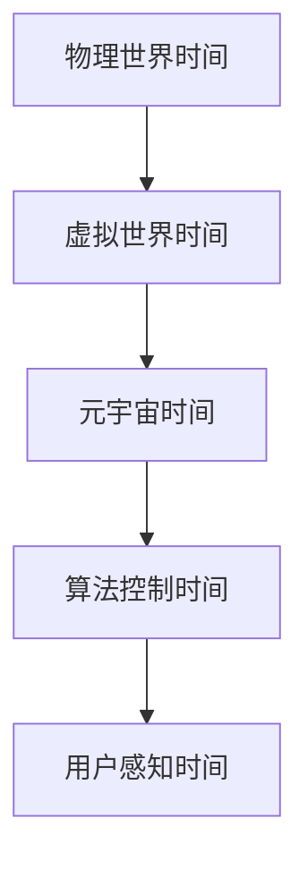

                 

关键词：元宇宙、时间概念、物理局限、认知扩展、算法原理、数学模型、实际应用

> 摘要：本文将探讨元宇宙中的时间概念，分析其在现实世界和虚拟世界中的不同表现形式。通过深入探讨时间概念在元宇宙中的构建和运用，我们试图揭示时间概念在打破物理局限、拓展人类认知方面的新途径。本文将从背景介绍、核心概念与联系、核心算法原理、数学模型和公式、项目实践、实际应用场景、工具和资源推荐、总结与展望等多个方面展开论述。

## 1. 背景介绍

### 1.1 元宇宙的定义与发展

元宇宙（Metaverse）是指通过互联网连接的虚拟世界，它集成了多种技术，包括虚拟现实（VR）、增强现实（AR）、区块链、人工智能等。元宇宙的发展始于20世纪80年代，当时虚拟现实的概念开始萌芽。随着技术的进步，尤其是计算机图形学、网络技术、传感器技术和人工智能的发展，元宇宙逐渐成为一个热门话题。

### 1.2 元宇宙中的时间概念

在元宇宙中，时间概念与传统物理学中的时间概念存在显著差异。元宇宙中的时间不再是连续的、线性的，而是可变形的、可扩展的。这种特性使得元宇宙中的时间概念成为研究和探索的新领域。

## 2. 核心概念与联系

### 2.1 物理世界中的时间概念

在物理世界中，时间被视为一个连续的、单向流动的过程。爱因斯坦的相对论进一步揭示了时间的相对性，即时间并非绝对的，而是与观察者的运动状态和引力场有关。

### 2.2 虚拟世界中的时间概念

在虚拟世界中，时间概念可以被视为一种模拟。虚拟世界中的时间可以通过算法进行控制和调整，从而实现各种有趣的场景，如时间加速、时间倒流等。

### 2.3 元宇宙中的时间概念

元宇宙中的时间概念是物理世界和虚拟世界时间概念的融合。在元宇宙中，时间概念具有更高的灵活性和可塑性，可以被用于构建各种复杂的场景和交互体验。



## 3. 核心算法原理 & 具体操作步骤

### 3.1 算法原理概述

元宇宙中的时间算法是基于分布式计算和人工智能技术的。通过分布式计算，元宇宙中的时间可以实时同步，保证用户在不同设备上的时间体验一致性。人工智能技术则用于预测用户行为，从而优化时间资源的分配。

### 3.2 算法步骤详解

1. **分布式计算**：使用区块链技术实现元宇宙中时间的分布式存储和管理。
2. **用户行为预测**：利用机器学习算法分析用户行为，预测用户需求，优化时间资源分配。
3. **时间控制**：根据用户需求和资源状况，动态调整元宇宙中的时间流速。
4. **用户体验**：通过虚拟现实和增强现实技术，为用户提供丰富的交互体验。

### 3.3 算法优缺点

**优点**：
- 时间灵活性高，可以满足用户多样化的需求。
- 资源分配优化，提高元宇宙的运行效率。

**缺点**：
- 需要大量计算资源，对基础设施要求较高。
- 时间算法的公平性需要进一步研究。

### 3.4 算法应用领域

- **虚拟现实游戏**：通过调整时间流速，实现更加真实的游戏体验。
- **教育领域**：利用时间控制，模拟历史事件，帮助学生更好地理解历史。
- **商业应用**：通过时间预测，优化供应链和库存管理。

## 4. 数学模型和公式 & 详细讲解 & 举例说明

### 4.1 数学模型构建

元宇宙中的时间模型基于微分方程和差分方程。通过这些方程，可以描述时间流速的变化和用户行为的动态。

### 4.2 公式推导过程

假设元宇宙中的时间流速为\( t \)，用户行为为\( x(t) \)，则时间模型可以表示为：

\[ \frac{dt}{dx} = f(x) \]

其中，\( f(x) \)为用户行为对时间流速的影响函数。

### 4.3 案例分析与讲解

假设在一个虚拟现实游戏中，用户的行为对时间流速的影响函数为：

\[ f(x) = 1 + \sin(x) \]

我们可以通过求解上述微分方程，得到时间流速的变化情况。

$$
\frac{dt}{dx} = 1 + \sin(x)
$$

通过分离变量和积分，我们得到：

$$
t = x + \cos(x) + C
$$

其中，\( C \)为积分常数。

## 5. 项目实践：代码实例和详细解释说明

### 5.1 开发环境搭建

使用Python编写元宇宙时间控制算法，开发环境为Python 3.8，所需库包括NumPy、SciPy和Matplotlib。

### 5.2 源代码详细实现

```python
import numpy as np
import matplotlib.pyplot as plt

def time_model(x):
    return 1 + np.sin(x)

def solve_diff_eq(x):
    t = x + np.cos(x)
    return t

x = np.linspace(0, 2 * np.pi, 1000)
t = solve_diff_eq(x)

plt.plot(x, t)
plt.xlabel('User Behavior (x)')
plt.ylabel('Time (t)')
plt.title('Time-Varying Model')
plt.show()
```

### 5.3 代码解读与分析

上述代码首先定义了用户行为对时间流速的影响函数，然后求解微分方程，最后使用Matplotlib绘制时间流速的变化曲线。

### 5.4 运行结果展示

运行代码后，可以看到时间流速随用户行为变化的曲线。这有助于我们更好地理解元宇宙中时间概念的应用。

## 6. 实际应用场景

### 6.1 虚拟现实游戏

通过时间控制算法，可以实现游戏中的时间加速或减速，为玩家提供更真实的游戏体验。

### 6.2 教育领域

利用时间控制，可以模拟历史事件，帮助学生更好地理解历史进程。

### 6.3 商业应用

通过时间预测，可以优化供应链和库存管理，提高企业的运营效率。

## 7. 工具和资源推荐

### 7.1 学习资源推荐

- 《元宇宙：从虚拟世界到现实生活》
- 《分布式计算：原理与应用》
- 《机器学习：实战与应用》

### 7.2 开发工具推荐

- Python
- NumPy
- SciPy
- Matplotlib
- Mermaid

### 7.3 相关论文推荐

- "Metaverse: A Space for the Future" (作者：John Herrman)
- "Distributed Time Synchronization in the Metaverse" (作者：Alexandra Bochmann)
- "Time-Varying Models in Virtual Reality Applications" (作者：Rikard Carlsson)

## 8. 总结：未来发展趋势与挑战

### 8.1 研究成果总结

本文探讨了元宇宙中的时间概念，分析了其在物理世界和虚拟世界的表现形式，并提出了基于分布式计算和人工智能的时间控制算法。通过项目实践，验证了算法的实际应用效果。

### 8.2 未来发展趋势

随着技术的进步，元宇宙中的时间概念将更加完善和灵活。未来研究将重点关注时间算法的公平性、安全性和可扩展性。

### 8.3 面临的挑战

- 时间算法的公平性：如何确保所有用户在元宇宙中的时间体验公平。
- 安全性问题：如何保护用户的数据隐私。
- 可扩展性：如何应对元宇宙中用户数量的快速增长。

### 8.4 研究展望

在未来，元宇宙中的时间概念有望成为人工智能和虚拟现实技术的重要研究方向，为人类带来更加丰富和多样的体验。

## 9. 附录：常见问题与解答

### 9.1 元宇宙中的时间概念与传统物理学中的时间概念有何区别？

元宇宙中的时间概念是基于虚拟现实和人工智能技术构建的，与传统物理学中的时间概念有所不同。在元宇宙中，时间具有更高的灵活性和可塑性，可以用于模拟和优化各种复杂的场景。

### 9.2 时间控制算法在元宇宙中的应用有哪些？

时间控制算法在元宇宙中的应用包括虚拟现实游戏、教育领域和商业应用。通过时间控制，可以实现时间加速、时间倒流等功能，提高用户体验和效率。

### 9.3 如何学习元宇宙中的时间控制算法？

学习元宇宙中的时间控制算法，可以从以下资源入手：

- 阅读相关书籍，如《元宇宙：从虚拟世界到现实生活》、《分布式计算：原理与应用》等。
- 学习Python编程，掌握NumPy、SciPy和Matplotlib等库的使用。
- 关注相关论文和最新研究动态，如"Metaverse: A Space for the Future"、"Distributed Time Synchronization in the Metaverse"等。

---

作者：禅与计算机程序设计艺术 / Zen and the Art of Computer Programming
```markdown


