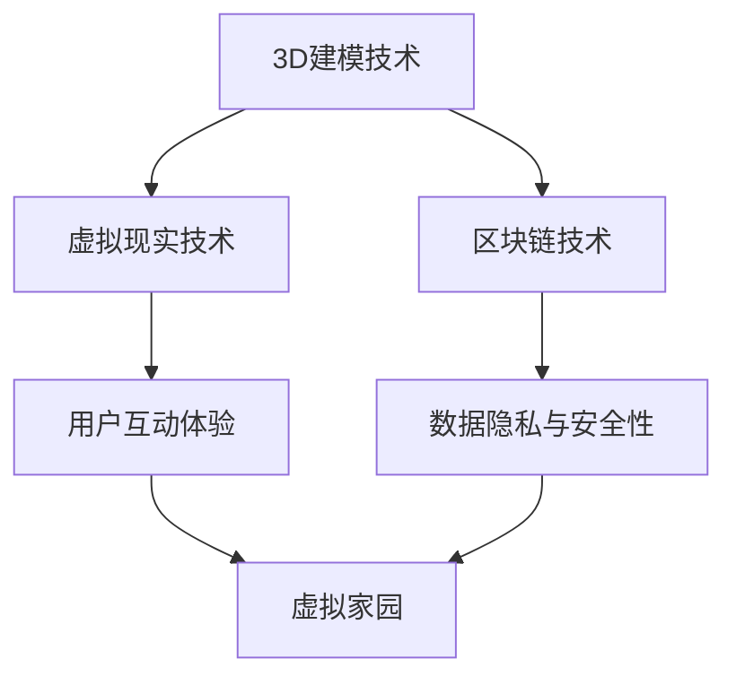

                 

关键词：元宇宙、虚拟家园、数字移民、数字孪生、虚拟现实、3D建模、区块链技术、数据隐私、安全性、交互体验、智能化。

摘要：随着科技的飞速发展，元宇宙的概念逐渐深入人心。本文将探讨元宇宙中的虚拟家园这一重要概念，分析其核心组成部分、实现技术以及未来发展趋势，旨在为数字移民提供理想的栖息地。

## 1. 背景介绍

近年来，元宇宙（Metaverse）这一概念在全球范围内引起了广泛关注。元宇宙可以被理解为一种全新的互联网形态，它融合了虚拟现实（VR）、增强现实（AR）、区块链技术、大数据、人工智能等多种先进技术，构建了一个虚拟的三维空间，用户可以在其中进行社交、工作、娱乐等活动。

在元宇宙中，虚拟家园（Virtual Home）成为数字移民的重要栖息地。虚拟家园不仅提供了与现实世界相似的居住环境，还可以通过虚拟现实技术带给用户身临其境的感受。同时，虚拟家园还具备一定的社交属性，用户可以在其中建立友谊、拓展人脉。

## 2. 核心概念与联系

### 2.1 虚拟家园的概念

虚拟家园是指在元宇宙中为用户提供一个类似于现实世界的居住空间。这个空间可以通过3D建模技术构建，包括室内装修、家具布局、绿化环境等。用户可以在虚拟家园中自由活动、互动，体验与现实生活相似的生活场景。

### 2.2 虚拟家园的实现技术

#### 2.2.1 3D建模技术

3D建模技术是构建虚拟家园的基础。通过3D建模软件，设计师可以创建出各种室内外场景、家具、装饰等。3D建模技术不仅可以提高虚拟家园的真实感，还可以降低制作成本。

#### 2.2.2 虚拟现实技术

虚拟现实技术为用户提供了沉浸式体验。通过VR头盔、手柄等设备，用户可以进入虚拟家园，感受到环境的变化、互动等。虚拟现实技术使得虚拟家园更加逼真，提升了用户的互动体验。

#### 2.2.3 区块链技术

区块链技术为虚拟家园提供了安全性和数据隐私保障。在元宇宙中，虚拟资产（如土地、房产、虚拟物品等）都可以通过区块链进行确权和交易。同时，区块链技术还能确保用户数据的隐私和安全。

### 2.3 Mermaid 流程图



## 3. 核心算法原理 & 具体操作步骤

### 3.1 算法原理概述

虚拟家园的实现涉及多个核心算法，包括3D建模、渲染、交互等。以下是这些算法的原理概述：

#### 3.1.1 3D建模算法

3D建模算法主要包括三维几何建模、纹理映射、光照计算等。通过这些算法，可以将二维图像或三维模型转化为虚拟家园的三维场景。

#### 3.1.2 渲染算法

渲染算法负责将三维场景渲染成二维图像，使其在屏幕上显示。常见的渲染算法有光线追踪、屏幕空间反射等。

#### 3.1.3 交互算法

交互算法负责处理用户输入，实现虚拟家园中的互动。常见的交互算法有手势识别、语音识别等。

### 3.2 算法步骤详解

#### 3.2.1 3D建模算法步骤

1. 输入二维图像或三维模型。
2. 使用三维几何建模算法生成三维模型。
3. 使用纹理映射算法将纹理映射到三维模型上。
4. 使用光照计算算法计算场景光照。

#### 3.2.2 渲染算法步骤

1. 输入三维场景。
2. 使用光线追踪或屏幕空间反射算法进行渲染。
3. 输出渲染结果。

#### 3.2.3 交互算法步骤

1. 输入用户输入。
2. 使用手势识别或语音识别算法进行交互。
3. 更新虚拟家园场景。

### 3.3 算法优缺点

#### 3.3.1 优缺点分析

- 3D建模算法：优点在于可以创建高度真实的虚拟场景，缺点是计算复杂度高，制作成本高。
- 渲染算法：优点在于可以提供高质量的图像渲染效果，缺点是计算资源消耗大。
- 交互算法：优点在于可以实现用户与虚拟家园的实时互动，缺点是识别精度和响应速度有待提高。

### 3.4 算法应用领域

- 3D建模算法：广泛应用于游戏开发、影视制作、建筑设计等领域。
- 渲染算法：广泛应用于虚拟现实、增强现实、数字孪生等领域。
- 交互算法：广泛应用于智能家居、智能穿戴设备、虚拟家园等领域。

## 4. 数学模型和公式 & 详细讲解 & 举例说明

### 4.1 数学模型构建

在虚拟家园的实现中，需要构建多个数学模型，包括三维几何模型、纹理映射模型、光照模型等。

#### 4.1.1 三维几何模型

三维几何模型通常使用顶点、边、面等基本几何元素进行构建。其中，顶点表示三维空间中的点，边表示顶点之间的连接，面表示顶点构成的闭合区域。

#### 4.1.2 纹理映射模型

纹理映射模型用于将二维纹理图像映射到三维模型上。常见的纹理映射方法有UV映射、光照映射等。

#### 4.1.3 光照模型

光照模型用于计算场景中的光照效果。常见的光照模型有漫反射、镜面反射、衰减等。

### 4.2 公式推导过程

以下是三维几何模型中顶点的计算公式：

$$
\begin{cases}
x = x_0 + \frac{d \cdot x}{\|d\|} \\
y = y_0 + \frac{d \cdot y}{\|d\|} \\
z = z_0 + \frac{d \cdot z}{\|d\|}
\end{cases}
$$

其中，$(x_0, y_0, z_0)$为顶点初始坐标，$d = (x, y, z)$为顶点移动向量，$\|d\|$为向量$d$的模长。

### 4.3 案例分析与讲解

假设我们有一个三维模型，其中包含一个正方体。通过三维几何模型计算，可以得出正方体的顶点坐标如下：

$$
\begin{cases}
x_0 = 0 \\
y_0 = 0 \\
z_0 = 0
\end{cases}
$$

移动向量$d = (1, 1, 1)$，则正方体的顶点坐标为：

$$
\begin{cases}
x = 0 + \frac{1}{\|1\|} = 1 \\
y = 0 + \frac{1}{\|1\|} = 1 \\
z = 0 + \frac{1}{\|1\|} = 1
\end{cases}
$$

通过纹理映射模型，我们可以将二维纹理图像映射到正方体上。假设纹理图像为$A(x, y)$，则映射后的纹理坐标为：

$$
\begin{cases}
u = x \\
v = y
\end{cases}
$$

通过光照模型，我们可以计算正方体表面每个顶点的光照效果。假设光照方向为$(x, y, z)$，则顶点光照强度为：

$$
I = \frac{\|d \cdot n\|}{\|d\| \cdot \|n\|}
$$

其中，$d$为光照方向向量，$n$为顶点法向量。

## 5. 项目实践：代码实例和详细解释说明

### 5.1 开发环境搭建

在搭建虚拟家园项目开发环境时，我们需要选择合适的编程语言、开发工具和第三方库。以下是一个典型的开发环境搭建步骤：

1. 安装Python 3.8及以上版本。
2. 安装PyCharm IDE。
3. 安装OpenGL库。
4. 安装numpy、opencv等第三方库。

### 5.2 源代码详细实现

以下是虚拟家园项目的一个简单示例代码：

```python
import glfw
import OpenGL.GL as gl

# 初始化OpenGL环境
glfw.init()
window = glfw.create_window(800, 600, "Virtual Home", None, None)
glfw.make_context_current(window)

# 设置视口和投影矩阵
gl.glViewport(0, 0, 800, 600)
projection = gl.gluPerspective(45, 800/600, 0.1, 100.0)

# 绘制虚拟家园
while not glfw.window_should_close(window):
    gl.glClear(gl.GL_COLOR_BUFFER_BIT | gl.GL_DEPTH_BUFFER_BIT)
    
    # 设置摄像机视角
    view = gl.gluLookAt(
        0, 0, 5,
        0, 0, 0,
        0, 1, 0
    )
    
    # 绘制正方体
    vertices = [
        -1, -1, 1,
        1, -1, 1,
        1, 1, 1,
        -1, 1, 1,
        -1, -1, -1,
        1, -1, -1,
        1, 1, -1,
        -1, 1, -1
    ]
    faces = [
        [0, 1, 2], [2, 3, 0],
        [4, 5, 6], [6, 7, 4],
        [0, 4, 7], [7, 3, 0],
        [1, 5, 6], [6, 2, 1],
        [4, 5, 1], [1, 0, 4],
        [2, 6, 7], [7, 3, 2]
    ]
    
    gl.glPolygonMode(gl.GL_FRONT_AND_BACK, gl.GL_FILL)
    gl.glDrawElements(gl.GL_TRIANGLES, 36, gl.GL_UNSIGNED_INT, None)
    
    glfw.swap_buffers(window)
    glfw.poll_events()

glfw.terminate()
```

### 5.3 代码解读与分析

以上代码是一个简单的虚拟家园示例，使用了OpenGL库进行绘制。以下是代码的详细解读：

1. 初始化OpenGL环境，创建窗口。
2. 设置视口和投影矩阵。
3. 循环绘制虚拟家园场景。
4. 清除画布。
5. 设置摄像机视角。
6. 绘制正方体。
7. 交换缓冲区，处理事件。

### 5.4 运行结果展示

运行以上代码，将显示一个简单的虚拟家园场景。用户可以通过移动鼠标和按住鼠标左键来旋转视角。

## 6. 实际应用场景

虚拟家园在元宇宙中有广泛的应用场景，包括以下几个方面：

### 6.1 社交娱乐

虚拟家园为用户提供了一个沉浸式的社交娱乐环境。用户可以在虚拟家园中与朋友互动、举办聚会、参加虚拟活动等。

### 6.2 在线办公

虚拟家园可以用于在线办公，用户可以在虚拟办公室中进行会议、协作、文件共享等。

### 6.3 教育培训

虚拟家园可以用于教育培训，教师可以在虚拟教室中进行授课、学生可以在虚拟实验室中进行实验等。

### 6.4 虚拟购物

虚拟家园可以用于虚拟购物，用户可以在虚拟商场中浏览商品、试穿衣服、购买商品等。

## 7. 工具和资源推荐

### 7.1 学习资源推荐

- 《OpenGL Programming Guide》
- 《Virtual Reality Programming for Oculus Rift》
- 《Metaverse: A Beginner's Guide》

### 7.2 开发工具推荐

- PyCharm
- Visual Studio Code
- Unity

### 7.3 相关论文推荐

- "Metaverse: A Spatial Web for a New Generation of Internet Services"
- "A Survey on Metaverse: System, Technology, Applications and Challenges"
- "Virtual Reality Home: Architecture and Design for the Metaverse"

## 8. 总结：未来发展趋势与挑战

### 8.1 研究成果总结

随着科技的不断进步，虚拟家园在元宇宙中的应用越来越广泛。目前，已经有许多公司和研究机构投入到虚拟家园的研究和开发中，取得了许多重要成果。

### 8.2 未来发展趋势

1. 更高的真实感：未来虚拟家园将进一步提升真实感，使用更先进的渲染技术和交互技术。
2. 更智能的交互：未来虚拟家园将具备更智能的交互功能，如语音识别、手势识别等。
3. 更丰富的应用场景：未来虚拟家园将应用于更多领域，如教育、医疗、娱乐等。

### 8.3 面临的挑战

1. 技术挑战：虚拟家园的实现涉及多种先进技术，如3D建模、虚拟现实、区块链等，技术难度较高。
2. 数据隐私和安全：虚拟家园中涉及大量用户数据，如何保护用户隐私和安全是一个重要挑战。
3. 用户体验：虚拟家园的交互体验需要不断提升，以满足用户的需求。

### 8.4 研究展望

虚拟家园作为元宇宙中的重要组成部分，具有广阔的发展前景。未来，我们将继续深入研究虚拟家园的构建技术、交互体验、应用场景等方面，为用户提供更好的数字移民栖息地。

## 9. 附录：常见问题与解答

### 9.1 什么是元宇宙？

元宇宙是一个虚拟的三维空间，融合了虚拟现实、增强现实、区块链等多种先进技术，用户可以在其中进行社交、工作、娱乐等活动。

### 9.2 虚拟家园是什么？

虚拟家园是元宇宙中为用户提供的一个类似于现实世界的居住空间，通过3D建模、虚拟现实等技术构建，用户可以在其中体验生活。

### 9.3 虚拟家园有哪些应用场景？

虚拟家园可以应用于社交娱乐、在线办公、教育培训、虚拟购物等多个领域。

### 9.4 虚拟家园如何保证数据隐私和安全？

虚拟家园采用区块链技术进行数据存储和交易，确保用户数据的安全和隐私。

### 9.5 如何开发虚拟家园？

开发虚拟家园需要掌握3D建模、虚拟现实、区块链等多种技术，可以选择使用Python、Unity等开发工具进行开发。

作者：禅与计算机程序设计艺术 / Zen and the Art of Computer Programming
-------------------------------------------------------------------

文章完成，感谢您的耐心阅读。希望这篇文章能够为读者提供关于元宇宙和虚拟家园的深入理解，为数字移民构建理想的栖息地。如果您有任何问题或建议，欢迎在评论区留言讨论。再次感谢您的关注和支持！

