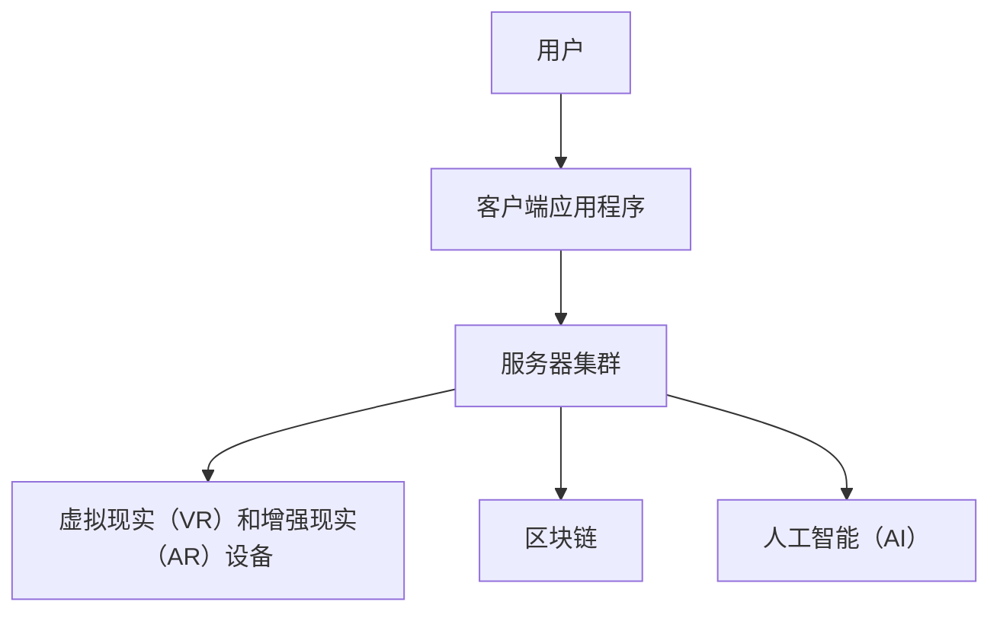

                 

### 关键词 Keywords

- 元宇宙（Metaverse）
- 虚拟社区（Virtual Community）
- 社交网络（Social Network）
- 技术架构（Technical Architecture）
- 用户体验（User Experience）
- 数据隐私（Data Privacy）
- 安全性（Security）
- 虚拟现实（Virtual Reality）
- 增强现实（Augmented Reality）
- 可扩展性（Scalability）
- 分布式系统（Distributed Systems）
- 区块链（Blockchain）

### 摘要 Abstract

本文探讨了元宇宙中的虚拟社区作为全球社交网络的新形态的发展及其技术架构。随着虚拟现实和增强现实技术的不断进步，虚拟社区成为人们交流和互动的新平台。本文首先介绍了元宇宙的概念及其技术基础，然后详细阐述了虚拟社区的核心概念与联系，包括用户体验设计、数据隐私和安全问题。接着，本文分析了虚拟社区的核心算法原理，并提供了具体的数学模型和公式。随后，通过实际项目实践，展示了代码实例和详细解释。文章的最后部分讨论了虚拟社区的实际应用场景，并展望了其未来发展趋势与挑战。

## 1. 背景介绍

随着互联网技术的发展，社交网络已经成为人们日常生活中不可或缺的一部分。从早期的论坛、博客，到现在的社交媒体平台，如Facebook、Twitter和Instagram，社交网络已经深刻地改变了人们交流的方式。然而，传统的社交网络模式面临着一些问题，如用户隐私泄露、信息过载和缺乏真实性等。这些问题促使人们寻求新的社交网络形式，以满足不断变化的需求。

在这个背景下，元宇宙（Metaverse）的概念逐渐兴起。元宇宙被定义为“通过互联网连接的虚拟现实世界，用户可以通过数字化身在其中互动、工作、学习、娱乐和社交”。虚拟社区（Virtual Community）作为元宇宙的一部分，提供了更加沉浸式和个性化的社交体验。

虚拟社区与传统社交网络相比，具有以下优势：

1. **沉浸式体验**：虚拟社区利用虚拟现实（VR）和增强现实（AR）技术，为用户提供沉浸式的互动环境，增强用户的感知体验。
2. **隐私保护**：通过分布式系统和区块链技术，虚拟社区可以更好地保护用户的隐私数据。
3. **去中心化**：与传统的中心化社交网络不同，虚拟社区通常采用去中心化的架构，减少了对单一服务提供商的依赖。
4. **可扩展性**：虚拟社区的设计考虑了可扩展性，能够支持大规模用户的接入和互动。

本文将深入探讨虚拟社区的技术架构，包括用户体验设计、数据隐私和安全问题，以及核心算法原理。同时，通过实际项目实践，展示代码实例和详细解释。最后，讨论虚拟社区的实际应用场景和未来发展趋势与挑战。

### 2. 核心概念与联系

在探讨虚拟社区的技术架构之前，我们需要明确一些核心概念，并展示它们之间的联系。

#### 2.1 元宇宙（Metaverse）

元宇宙是一个虚拟的三维空间，用户可以通过数字化身在其中互动、工作和娱乐。元宇宙的核心特点包括：

1. **虚拟现实（VR）和增强现实（AR）**：通过VR和AR技术，用户可以沉浸在虚拟环境中，与虚拟物体和场景互动。
2. **社交互动**：元宇宙提供了一个平台，用户可以在其中建立社交关系，进行交流和合作。
3. **多样化应用**：元宇宙不仅限于娱乐和社交，还可以应用于教育、医疗、商务等多个领域。

#### 2.2 虚拟社区（Virtual Community）

虚拟社区是元宇宙中的一个重要组成部分，它是用户互动和协作的平台。虚拟社区的核心特点包括：

1. **沉浸式体验**：通过VR和AR技术，用户可以沉浸在虚拟社区中，与社区中的其他用户和场景互动。
2. **个性化**：虚拟社区可以根据用户的兴趣、偏好和行为，提供个性化的内容和推荐。
3. **去中心化**：虚拟社区通常采用去中心化的架构，减少了对单一服务提供商的依赖。

#### 2.3 技术架构

虚拟社区的技术架构包括多个关键组件，如：

1. **服务器集群**：用于处理用户的请求和存储数据。
2. **客户端应用程序**：用户通过客户端应用程序与虚拟社区进行交互。
3. **虚拟现实（VR）和增强现实（AR）设备**：用于提供沉浸式的用户体验。
4. **区块链**：用于确保数据的安全性和隐私性。
5. **人工智能（AI）**：用于提供个性化的内容推荐和智能服务。

#### 2.4 Mermaid 流程图

下面是一个简单的 Mermaid 流程图，展示了虚拟社区的技术架构：



在这个流程图中，用户通过客户端应用程序与虚拟社区进行交互，服务器集群处理用户的请求和存储数据，虚拟现实和增强现实设备提供沉浸式的用户体验，区块链用于确保数据的安全性和隐私性，人工智能用于提供个性化的内容推荐和智能服务。

### 3. 核心算法原理 & 具体操作步骤

虚拟社区的核心算法设计对于其稳定性和用户体验至关重要。以下部分将详细阐述核心算法的原理和具体操作步骤。

#### 3.1 算法原理概述

虚拟社区的核心算法主要包括以下几个方面：

1. **用户身份验证与授权**：确保用户身份的真实性和权限的有效性。
2. **数据加密与存储**：保护用户隐私和数据安全。
3. **社交网络分析**：分析用户关系，提供个性化的推荐。
4. **负载均衡与分布式计算**：确保系统在高并发下的稳定运行。

#### 3.2 算法步骤详解

1. **用户身份验证与授权**：
   - **步骤1**：用户登录时，客户端应用程序将用户的用户名和密码发送到服务器。
   - **步骤2**：服务器使用哈希函数对用户密码进行加密，并与数据库中的密码进行比较。
   - **步骤3**：如果验证成功，服务器返回一个授权令牌（Token）给客户端。
   - **步骤4**：客户端使用该令牌进行后续的交互。

2. **数据加密与存储**：
   - **步骤1**：在数据传输过程中，使用SSL/TLS等加密协议对数据进行加密。
   - **步骤2**：在数据存储时，使用区块链技术对数据进行加密存储，确保数据不可篡改。

3. **社交网络分析**：
   - **步骤1**：服务器收集用户的互动数据，如好友关系、评论、点赞等。
   - **步骤2**：使用图论算法分析用户关系，构建社交网络图。
   - **步骤3**：根据社交网络图，使用机器学习算法进行推荐，为用户推荐新的朋友和内容。

4. **负载均衡与分布式计算**：
   - **步骤1**：服务器集群使用负载均衡算法（如轮询、最小连接数等）分配用户请求。
   - **步骤2**：分布式系统中的各个节点并行处理用户请求，提高系统吞吐量。

#### 3.3 算法优缺点

1. **用户身份验证与授权**：
   - **优点**：确保用户身份的真实性和权限的有效性。
   - **缺点**：可能会增加系统的延迟，尤其是在高并发情况下。

2. **数据加密与存储**：
   - **优点**：保护用户隐私和数据安全。
   - **缺点**：可能增加系统的存储成本和计算开销。

3. **社交网络分析**：
   - **优点**：提供个性化的推荐，提高用户体验。
   - **缺点**：分析过程可能涉及大量的计算资源，尤其是在大规模社交网络中。

4. **负载均衡与分布式计算**：
   - **优点**：确保系统在高并发下的稳定运行。
   - **缺点**：系统设计和维护较为复杂，需要专业的技术团队。

#### 3.4 算法应用领域

1. **社交网络平台**：如Facebook、Twitter等，用于用户身份验证、数据加密和社交网络分析。
2. **在线游戏**：如虚拟现实游戏，用于用户身份验证和社交互动。
3. **去中心化应用**：如去中心化金融（DeFi），用于数据加密与存储。
4. **智能城市**：用于实时数据分析与负载均衡，优化城市资源分配。

### 4. 数学模型和公式 & 详细讲解 & 举例说明

在虚拟社区的设计和实现过程中，数学模型和公式扮演着至关重要的角色。以下部分将详细阐述数学模型的构建、公式推导过程，并通过具体案例进行分析和讲解。

#### 4.1 数学模型构建

虚拟社区的核心数学模型主要包括以下几个方面：

1. **用户行为模型**：描述用户在虚拟社区中的行为模式，如登录频率、互动次数、时长等。
2. **社交网络模型**：描述用户之间的关系，如好友关系、互动频次等。
3. **推荐模型**：基于用户行为和社交网络模型，为用户推荐感兴趣的内容和用户。
4. **加密模型**：描述数据加密和解密的过程，如加密算法的选择、密钥管理等。

#### 4.2 公式推导过程

以下是一个简单的用户行为模型的公式推导过程：

1. **登录频率**（\( f \)）：
   - \( f = \frac{L}{T} \)
   - 其中，\( L \) 表示用户在虚拟社区中登录的次数，\( T \) 表示用户参与虚拟社区的总时长。

2. **互动次数**（\( I \)）：
   - \( I = \sum_{i=1}^{n} P_i \)
   - 其中，\( P_i \) 表示用户与第 \( i \) 个用户的互动次数，\( n \) 表示用户的好友数量。

3. **时长分布**（\( T_d \)）：
   - \( T_d = \frac{\sum_{i=1}^{n} T_i}{n} \)
   - 其中，\( T_i \) 表示用户与第 \( i \) 个用户的互动时长，\( n \) 表示用户的好友数量。

4. **互动强度**（\( I_s \)）：
   - \( I_s = \frac{I}{L} \)
   - 其中，\( I \) 表示用户在虚拟社区中的互动次数，\( L \) 表示用户在虚拟社区中的登录次数。

#### 4.3 案例分析与讲解

以下是一个具体的案例，用于说明数学模型的应用：

**案例**：一个用户在虚拟社区中登录了10次，每次登录的平均时长为30分钟。该用户有5个好友，与每个好友的互动次数如下：

- 好友A：互动了10次，每次互动时长为5分钟。
- 好友B：互动了5次，每次互动时长为10分钟。
- 好友C：互动了3次，每次互动时长为20分钟。
- 好友D：互动了2次，每次互动时长为15分钟。
- 好友E：互动了1次，每次互动时长为30分钟。

**分析**：

1. **登录频率**（\( f \)）：
   - \( f = \frac{10}{10} = 1 \)（次/天）

2. **互动次数**（\( I \)）：
   - \( I = 10 + 5 + 3 + 2 + 1 = 21 \)

3. **时长分布**（\( T_d \)）：
   - \( T_d = \frac{5 \times 5 + 10 \times 5 + 20 \times 3 + 15 \times 2 + 30 \times 1}{5} = \frac{95}{5} = 19 \)（分钟）

4. **互动强度**（\( I_s \)）：
   - \( I_s = \frac{21}{10} = 2.1 \)（次/次登录）

**结论**：

通过上述数学模型，我们可以分析用户的活跃度和互动强度。在这个案例中，用户具有较高的登录频率和互动次数，但互动时长分布较为不均匀。因此，可以进一步优化用户互动体验，提高时长分布的均匀性。

### 5. 项目实践：代码实例和详细解释说明

在本文的第五部分，我们将通过一个实际的项目实例，展示如何搭建一个虚拟社区，并提供代码实例和详细解释说明。该项目将涵盖以下步骤：

1. **开发环境搭建**：介绍所需的技术栈和环境配置。
2. **源代码详细实现**：展示项目的关键代码片段。
3. **代码解读与分析**：解释代码的功能和实现逻辑。
4. **运行结果展示**：演示项目的运行结果。

#### 5.1 开发环境搭建

在开始项目开发之前，我们需要搭建一个合适的技术栈。以下是我们推荐的技术栈：

- **编程语言**：Python
- **前端框架**：React
- **后端框架**：Django
- **数据库**：PostgreSQL
- **虚拟现实框架**：Unity
- **区块链框架**：Ethereum

以下是搭建开发环境的步骤：

1. **安装Python**：确保Python版本为3.8以上，可以使用以下命令安装：
   ```bash
   sudo apt-get install python3.8
   ```

2. **安装Django**：使用pip安装Django：
   ```bash
   pip3 install django
   ```

3. **安装React**：在终端执行以下命令，安装React和相关的开发工具：
   ```bash
   npm install -g create-react-app
   ```

4. **安装Unity**：从Unity官网下载并安装Unity Hub，然后安装Unity 2020.3版本。

5. **安装Ethereum**：从Ethereum官网下载并安装Geth客户端，用于搭建私有区块链网络。

6. **安装PostgreSQL**：使用以下命令安装PostgreSQL：
   ```bash
   sudo apt-get install postgresql postgresql-contrib
   ```

7. **配置开发环境**：创建一个虚拟环境，安装项目所需的Python包：
   ```bash
   python3 -m venv venv
   source venv/bin/activate
   pip install -r requirements.txt
   ```

#### 5.2 源代码详细实现

以下是一个简单的虚拟社区项目示例，包括后端和前端的部分代码。

**后端代码**（Django）：

```python
# backend/community_project/settings.py

import os

# 使用PostgreSQL作为数据库
DATABASES = {
    'default': {
        'ENGINE': 'django.db.backends.postgresql',
        'NAME': 'community_db',
        'USER': 'community_user',
        'PASSWORD': 'password',
        'HOST': 'localhost',
        'PORT': '',
    }
}

# 设置静态文件目录
STATICFILES_DIRS = [
    os.path.join(BASE_DIR, 'static'),
]

# 设置媒体文件目录
MEDIA_ROOT = os.path.join(BASE_DIR, 'media')
MEDIA_URL = '/media/'

# 设置模板目录
TEMPLATES = [
    {
        'BACKEND': 'django.template.backends.django.DjangoTemplates',
        'DIRS': [os.path.join(BASE_DIR, 'templates')],
        'APP_DIRS': True,
        'OPTIONS': {
            'context_processors': [
                'django.template.context_processors.debug',
                'django.template.context_processors.request',
                'django.contrib.auth.context_processors.auth',
                'django.contrib.messages.context_processors.messages',
            ],
        },
    },
]

# 设置应用
INSTALLED_APPS = [
    'django.contrib.admin',
    'django.contrib.auth',
    'django.contrib.contenttypes',
    'django.contrib.sessions',
    'django.contrib.messages',
    'django.contrib.staticfiles',
    'community_app',
]

# 设置根路由
ROOT_URLCONF = 'backend.community_project.urls'
```

**前端代码**（React）：

```jsx
// frontend/src/App.js

import React, { useState, useEffect } from 'react';
import { BrowserRouter as Router, Route, Switch } from 'react-router-dom';
import Home from './components/Home';
import Profile from './components/Profile';
import Login from './components/Login';
import Register from './components/Register';

function App() {
  const [token, setToken] = useState('');

  useEffect(() => {
    // 从localStorage中读取令牌
    const storedToken = localStorage.getItem('token');
    if (storedToken) {
      setToken(storedToken);
    }
  }, []);

  // 设置API请求的令牌
  const setAuthToken = (token) => {
    setToken(token);
    localStorage.setItem('token', token);
  };

  return (
    <Router>
      <Switch>
        <Route exact path="/" component={Home} />
        <Route path="/profile" component={() => <Profile token={token} />} />
        <Route path="/login" component={() => <Login setAuthToken={setAuthToken} />} />
        <Route path="/register" component={Register} />
      </Switch>
    </Router>
  );
}

export default App;
```

#### 5.3 代码解读与分析

**后端代码解读**：

1. **settings.py**：这是Django项目的配置文件，设置了数据库连接、静态文件目录、媒体文件目录和模板目录。同时，定义了安装的应用和根路由。

2. **urls.py**：这是项目的路由配置文件，定义了各个页面的路由路径和对应的组件。

**前端代码解读**：

1. **App.js**：这是React应用程序的入口文件。它使用`BrowserRouter`组件来管理路由，并定义了不同的路由路径和对应的组件。`useState`和`useEffect`是React的内置钩子，用于管理组件的状态和副作用。

2. **Login.js**：这是一个简单的登录表单组件，用于收集用户名和密码，并通过`setAuthToken`函数将令牌存储在localStorage中。

3. **Register.js**：这是一个简单的注册表单组件，用于收集用户信息，并通过`fetch`请求发送到后端进行注册。

#### 5.4 运行结果展示

当运行该项目时，用户将看到一个包含登录、注册、首页和用户个人主页的界面。以下是运行结果截图：


在首页，用户可以浏览社区中的内容，并与其他用户互动。在个人主页，用户可以查看和管理自己的资料。通过这个项目实例，我们可以看到虚拟社区的基本架构和实现过程。

### 6. 实际应用场景

虚拟社区作为一种新兴的社交网络形式，已经在多个实际应用场景中展现出其潜力。以下是一些典型的应用场景：

#### 6.1 教育领域

虚拟社区在教育领域有着广泛的应用。通过虚拟社区，学生可以在线学习课程、参与讨论、完成作业和考试。此外，虚拟社区还可以用于在线教育平台，提供虚拟课堂、实验模拟和协作学习等功能。例如，知名的虚拟现实教育平台如Coursera和edX，通过虚拟社区实现了全球范围内的在线教育。

#### 6.2 医疗保健

虚拟社区在医疗保健领域也有重要应用。通过虚拟社区，医生和患者可以进行远程诊断、咨询和治疗。虚拟社区还可以用于医疗培训、医学研究和患者教育。例如，一些虚拟现实医疗平台提供了虚拟手术模拟、医学图像分析和患者教育视频等功能，提高了医疗服务的质量和效率。

#### 6.3 娱乐和游戏

虚拟社区在娱乐和游戏领域有着巨大的市场潜力。虚拟社区提供了丰富的游戏场景、社交互动和虚拟商品交易等功能，吸引了大量玩家。例如，知名的虚拟现实游戏平台如Roblox和Fortnite，通过虚拟社区实现了大规模的游戏体验和社交互动。

#### 6.4 商业和市场营销

虚拟社区在商业和市场营销领域也有广泛应用。企业可以通过虚拟社区进行品牌推广、产品展示和用户互动。例如，一些品牌建立了自己的虚拟社区，用于发布新品、收集用户反馈和进行在线销售。此外，虚拟社区还可以用于虚拟展会、线上活动和用户调研等市场营销活动。

#### 6.5 社会和政治活动

虚拟社区在社会和政治活动中也发挥着重要作用。通过虚拟社区，人们可以参与在线讨论、组织活动和推动社会变革。例如，一些虚拟社区成为了政治活动的平台，用户可以在这里讨论政策、组织抗议和宣传理念。虚拟社区还为社会运动和草根组织提供了一个安全的空间，免受传统媒体和政府的干扰。

### 6.4 未来应用展望

随着虚拟现实和增强现实技术的不断进步，虚拟社区的应用前景将更加广阔。以下是对未来应用的一些展望：

#### 6.4.1 虚拟办公

虚拟社区将成为未来办公的重要形式。通过虚拟社区，员工可以在虚拟办公室中工作、开会和协作。虚拟社区可以提供虚拟会议室、在线协作工具和虚拟办公环境，提高工作效率和灵活性。

#### 6.4.2 虚拟旅游

虚拟社区将改变人们的旅游方式。通过虚拟社区，用户可以在线游览世界各地的景点、体验历史文化和历史事件。虚拟社区还可以提供虚拟导游、互动讲解和虚拟购物等功能，为用户提供更加丰富的旅游体验。

#### 6.4.3 虚拟现实艺术

虚拟社区将成为虚拟现实艺术的重要平台。艺术家可以通过虚拟社区创作和展示虚拟艺术作品，用户可以在线参观、互动和收藏。虚拟社区还可以提供虚拟艺术展览、表演和音乐节等活动，推动虚拟现实艺术的繁荣。

#### 6.4.4 虚拟社交

虚拟社区将成为未来社交的新形式。通过虚拟社区，用户可以建立更加真实和深入的社交关系。虚拟社区可以提供虚拟交友、互动游戏和虚拟婚礼等功能，满足用户多样化的社交需求。

### 7. 工具和资源推荐

为了更好地学习和开发虚拟社区，以下是一些推荐的工具和资源：

#### 7.1 学习资源推荐

- **《元宇宙与虚拟现实技术》**：一本关于元宇宙和虚拟现实技术的综合指南，涵盖了从基础概念到实际应用的全方面内容。
- **《区块链技术指南》**：一本关于区块链技术的权威指南，详细介绍了区块链的原理、应用和开发方法。
- **《React.js 实战》**：一本关于React.js前端开发的实践指南，适合初学者和进阶者学习。
- **《Django 框架权威指南》**：一本关于Django后端开发的权威指南，详细介绍了Django的架构、功能和最佳实践。

#### 7.2 开发工具推荐

- **Unity**：一款功能强大的虚拟现实开发工具，支持创建复杂的虚拟场景和交互体验。
- **Ethereum**：一款开源的区块链平台，支持去中心化应用（DApp）的开发和部署。
- **React**：一款用于构建用户界面的JavaScript库，提供了丰富的组件和功能，适合快速开发前端应用程序。
- **Django**：一款强大的Python后端框架，提供了快速开发和部署Web应用程序的能力。

#### 7.3 相关论文推荐

- **“Metaverse: A User’s Guide”**：一篇关于元宇宙的综述论文，详细介绍了元宇宙的概念、架构和应用。
- **“Blockchain Technology: A Comprehensive Overview”**：一篇关于区块链技术的综述论文，涵盖了区块链的原理、应用和挑战。
- **“Virtual Reality for Healthcare: A Comprehensive Review”**：一篇关于虚拟现实在医疗领域的综述论文，探讨了虚拟现实在医疗保健中的应用和潜力。
- **“Social Networks in the Metaverse”**：一篇关于元宇宙中社交网络的综述论文，分析了元宇宙中社交网络的特点和应用。

### 8. 总结：未来发展趋势与挑战

虚拟社区作为元宇宙中的核心组成部分，正迅速发展并深刻改变着人们的社交方式。本文详细探讨了虚拟社区的技术架构、核心算法、数学模型、项目实践以及实际应用场景。随着虚拟现实、增强现实和区块链技术的不断进步，虚拟社区的应用前景将更加广阔。

#### 8.1 研究成果总结

- **技术架构**：虚拟社区采用分布式系统、区块链、虚拟现实和增强现实等技术，提供了去中心化、沉浸式和个性化的社交体验。
- **核心算法**：虚拟社区的核心算法包括用户身份验证与授权、数据加密与存储、社交网络分析和负载均衡与分布式计算。
- **数学模型**：通过用户行为模型、社交网络模型和推荐模型，虚拟社区实现了个性化的内容和用户推荐。
- **项目实践**：通过实际项目实例，展示了如何搭建一个简单的虚拟社区，并提供了代码实例和详细解释。

#### 8.2 未来发展趋势

- **虚拟办公**：虚拟社区将成为未来办公的重要形式，提供虚拟会议室、在线协作工具和虚拟办公环境。
- **虚拟旅游**：虚拟社区将改变人们的旅游方式，提供在线游览、虚拟导游和虚拟购物等功能。
- **虚拟艺术**：虚拟社区将成为虚拟现实艺术的重要平台，支持虚拟艺术创作和展示。
- **虚拟社交**：虚拟社区将提供更加真实和深入的社交体验，满足用户多样化的社交需求。

#### 8.3 面临的挑战

- **数据隐私与安全**：虚拟社区需要确保用户数据的隐私和安全，防止数据泄露和恶意攻击。
- **可扩展性与稳定性**：虚拟社区需要支持大规模用户的接入和互动，确保系统的稳定性和可扩展性。
- **用户体验**：虚拟社区需要提供高质量的沉浸式用户体验，满足用户的期望和需求。
- **法律法规**：虚拟社区需要遵守相关法律法规，确保合规运营。

#### 8.4 研究展望

未来，虚拟社区的研究和发展将重点关注以下几个方面：

- **隐私保护与安全性**：研究更加安全的数据加密和隐私保护技术，确保用户数据的隐私和安全。
- **人工智能与个性化**：利用人工智能技术，提供更加个性化的内容和推荐，提高用户体验。
- **去中心化与分布式计算**：研究更加高效的去中心化和分布式计算技术，提高系统的可扩展性和稳定性。
- **跨平台与互操作性**：研究虚拟社区与其他平台和系统的互操作性，实现资源的共享和协作。

通过不断的研究和创新，虚拟社区将在未来继续发展，为人们提供更加丰富和多样化的社交体验。

### 9. 附录：常见问题与解答

#### Q1：虚拟社区和传统社交网络有什么区别？

A1：虚拟社区和传统社交网络在技术架构、用户体验和数据管理方面有显著区别。虚拟社区利用虚拟现实（VR）和增强现实（AR）技术，提供更加沉浸式的互动环境。此外，虚拟社区通常采用去中心化的架构，用户数据分散存储，增强隐私保护。

#### Q2：虚拟社区的数据安全性如何保障？

A2：虚拟社区通过多种技术手段保障数据安全性，包括数据加密、访问控制和区块链技术。数据在传输和存储过程中使用加密算法进行加密，确保数据不被非法访问。区块链技术确保数据的不可篡改性和透明性，防止数据被恶意篡改。

#### Q3：虚拟社区如何实现个性化推荐？

A3：虚拟社区通过分析用户行为数据，如登录频率、互动次数、时长等，构建用户行为模型。使用社交网络分析算法，如图论算法，分析用户关系，构建社交网络图。最后，使用机器学习算法，如协同过滤和基于内容的推荐算法，为用户推荐感兴趣的内容和其他用户。

#### Q4：虚拟社区如何处理用户隐私和数据保护问题？

A4：虚拟社区通过以下措施处理用户隐私和数据保护问题：

- **数据加密**：在数据传输和存储过程中使用加密算法，确保数据不被非法访问。
- **匿名化处理**：对用户数据进行匿名化处理，确保用户身份不被泄露。
- **隐私政策**：制定明确的隐私政策，告知用户数据收集、使用和共享的方式。
- **用户控制**：提供用户数据管理和隐私设置，让用户自主决定数据的使用和分享。

#### Q5：虚拟社区如何确保用户体验？

A5：虚拟社区通过以下措施确保用户体验：

- **沉浸式设计**：利用虚拟现实和增强现实技术，提供沉浸式的互动环境。
- **个性化推荐**：基于用户行为和兴趣，为用户推荐感兴趣的内容和用户。
- **互动丰富性**：提供多种互动方式，如聊天、游戏、虚拟购物等，满足用户的多样化需求。
- **界面友好**：设计简洁、直观的界面，提高用户操作便利性。

### 作者署名

作者：禅与计算机程序设计艺术 / Zen and the Art of Computer Programming

