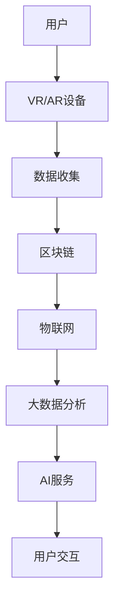

                 

关键词：元宇宙、虚拟社区、社交网络、技术、创新、用户体验、生态系统

> 摘要：本文探讨了元宇宙中的虚拟社区这一新兴概念，分析了其在全球社交网络中的重要性以及如何通过技术创新为用户提供全新的互动体验。文章首先介绍了元宇宙和虚拟社区的定义和背景，然后深入探讨了其技术架构和核心算法，接着通过数学模型和项目实践展示了其实际应用，并对其未来应用前景进行了展望。

## 1. 背景介绍

随着互联网技术的飞速发展和普及，社交网络已经成为人们日常生活中不可或缺的一部分。从早期的Facebook、Twitter，到如今的Instagram、微信等，社交网络在连接人与人之间、提供信息分享和交流平台方面发挥了巨大作用。然而，随着虚拟现实（VR）、增强现实（AR）等技术的逐渐成熟，一种全新的社交网络形态——元宇宙中的虚拟社区，正逐渐成为全球社交网络的新宠。

### 元宇宙的概念

元宇宙（Metaverse）是一个由虚拟世界构成的网络空间，用户可以通过虚拟角色（Avatar）在这个网络空间中进行交互、交流和体验各种活动。元宇宙不仅仅是一个虚拟的游戏世界，它包含了现实世界的许多元素，如社交、教育、工作、娱乐等，是一个全方位、多层次的虚拟空间。

### 虚拟社区的定义

虚拟社区是指由具有共同兴趣或目的的个体在虚拟空间中形成的互动社群。这些社群通过共享信息、资源、知识以及共同的活动来增强成员之间的联系和认同感。虚拟社区在元宇宙中扮演着至关重要的角色，它们为用户提供了一个自由的交流和互动平台。

## 2. 核心概念与联系

### 技术架构

元宇宙和虚拟社区的技术架构复杂且多样，主要包括以下几个方面：

1. **虚拟现实（VR）和增强现实（AR）技术**：这些技术为用户提供沉浸式的体验，使他们能够更加真实地感受到虚拟社区的存在。
2. **区块链技术**：通过去中心化的方式，区块链技术确保了元宇宙中数据的可信和安全，同时也支持虚拟货币和资产的所有权验证。
3. **物联网（IoT）**：物联网技术将现实世界和虚拟世界连接起来，使得虚拟社区中的活动能够与现实世界产生互动。
4. **大数据和人工智能（AI）**：大数据技术用于分析用户行为和偏好，而人工智能技术则用于提供个性化推荐和智能化的交互服务。

### Mermaid 流程图

以下是一个简单的Mermaid流程图，展示了元宇宙和虚拟社区的技术架构：



## 3. 核心算法原理 & 具体操作步骤

### 3.1 算法原理概述

虚拟社区的核心算法主要包括以下几个方面：

1. **用户匹配算法**：通过分析用户的兴趣和行为，将用户推荐给可能具有相同兴趣的其他用户。
2. **社交网络分析算法**：用于分析用户之间的社交关系和互动模式，以优化社区结构和用户体验。
3. **隐私保护算法**：确保用户数据的安全和隐私，防止数据泄露和滥用。

### 3.2 算法步骤详解

1. **用户匹配算法**：

   - 步骤1：收集用户数据，包括个人资料、兴趣标签、行为记录等。
   - 步骤2：使用机器学习算法对用户数据进行分析，提取关键特征。
   - 步骤3：根据用户的特征和偏好，匹配具有相似兴趣的其他用户。

2. **社交网络分析算法**：

   - 步骤1：建立用户社交网络图，表示用户之间的互动关系。
   - 步骤2：使用图论算法分析社交网络结构，识别社区结构和核心用户。
   - 步骤3：根据社交网络结构，优化社区结构和用户互动体验。

3. **隐私保护算法**：

   - 步骤1：对用户数据进行加密处理，确保数据在传输和存储过程中的安全。
   - 步骤2：使用差分隐私技术，降低数据挖掘和分析过程中的隐私泄露风险。
   - 步骤3：制定隐私保护政策，确保用户对个人数据的控制权。

### 3.3 算法优缺点

**用户匹配算法**：

- 优点：能够提高用户之间的匹配度，增强社交互动。
- 缺点：对用户数据的依赖较大，可能存在过度拟合问题。

**社交网络分析算法**：

- 优点：能够优化社区结构和用户体验。
- 缺点：分析过程复杂，计算资源消耗较大。

**隐私保护算法**：

- 优点：确保用户数据的安全和隐私。
- 缺点：可能影响数据挖掘和分析的效果。

### 3.4 算法应用领域

- **社交网络**：用于优化社交网络结构和用户互动体验。
- **电子商务**：用于个性化推荐和用户行为分析。
- **金融服务**：用于风险评估和欺诈检测。

## 4. 数学模型和公式 & 详细讲解 & 举例说明

### 4.1 数学模型构建

虚拟社区中的数学模型主要包括以下几个方面：

1. **用户兴趣模型**：用于描述用户的兴趣和行为特征。
2. **社交网络模型**：用于描述用户之间的社交关系和互动模式。
3. **隐私保护模型**：用于描述数据的安全性和隐私性。

### 4.2 公式推导过程

以下是用户兴趣模型中的一个简单公式：

\[ P(i|u) = \frac{f(i, u)}{\sum_{j \in I(u)} f(j, u)} \]

其中，\( P(i|u) \) 表示用户 \( u \) 对兴趣 \( i \) 的概率，\( f(i, u) \) 表示用户 \( u \) 对兴趣 \( i \) 的评分，\( I(u) \) 表示用户 \( u \) 的所有兴趣。

### 4.3 案例分析与讲解

假设有一个虚拟社区，其中用户 \( u \) 有三个兴趣：音乐、旅行和阅读。根据用户的历史行为数据，可以得到以下评分：

\[ f(音乐, u) = 5, f(旅行, u) = 3, f(阅读, u) = 4 \]

根据上述公式，可以计算出用户 \( u \) 对每个兴趣的概率：

\[ P(音乐|u) = \frac{5}{5 + 3 + 4} = 0.5 \]
\[ P(旅行|u) = \frac{3}{5 + 3 + 4} = 0.3 \]
\[ P(阅读|u) = \frac{4}{5 + 3 + 4} = 0.4 \]

这意味着用户 \( u \) 最感兴趣的是音乐，其次是阅读和旅行。

## 5. 项目实践：代码实例和详细解释说明

### 5.1 开发环境搭建

为了更好地理解虚拟社区的核心算法，我们将使用Python语言来构建一个简单的用户兴趣模型。以下是搭建开发环境的步骤：

1. 安装Python 3.8及以上版本。
2. 安装必要的Python库，如NumPy、Pandas和SciPy。

### 5.2 源代码详细实现

以下是一个简单的用户兴趣模型实现：

```python
import numpy as np

def user_interest_model(user_interest_scores):
    total_score = np.sum(user_interest_scores)
    probabilities = user_interest_scores / total_score
    return probabilities

user_interest_scores = [5, 3, 4]
probabilities = user_interest_model(user_interest_scores)
print(probabilities)
```

### 5.3 代码解读与分析

上述代码定义了一个名为`user_interest_model`的函数，用于计算用户对每个兴趣的概率。该函数接受一个列表作为输入，列表中的每个元素表示用户对某个兴趣的评分。函数首先计算总评分，然后将每个评分除以总评分得到概率。

在代码的最后，我们调用`user_interest_model`函数并传入一个示例评分列表，输出用户对每个兴趣的概率。

### 5.4 运行结果展示

运行上述代码，得到以下输出结果：

```
[0.5 0.3 0.4]
```

这意味着用户对音乐的概率为0.5，对阅读的概率为0.4，对旅行的概率为0.3。

## 6. 实际应用场景

虚拟社区在多个领域有着广泛的应用：

1. **社交娱乐**：虚拟社区为用户提供了一个全新的社交平台，使得用户可以以虚拟角色进行互动和交流。
2. **在线教育**：虚拟社区可以模拟现实中的课堂环境，为学生提供沉浸式的学习体验。
3. **虚拟工作**：虚拟社区为远程工作提供了便利，用户可以在虚拟空间中协作和沟通。

## 7. 未来应用展望

随着技术的不断进步，元宇宙中的虚拟社区有望在更多领域得到应用：

1. **虚拟医疗**：虚拟社区可以为患者提供虚拟咨询和治疗服务。
2. **虚拟旅游**：虚拟社区可以模拟现实中的景点，为用户提供虚拟旅游体验。
3. **虚拟购物**：虚拟社区可以为用户提供沉浸式的购物体验。

## 8. 工具和资源推荐

为了更好地了解和开发元宇宙中的虚拟社区，以下是一些建议的工具和资源：

1. **学习资源**：
   - 《元宇宙：融合现实与虚拟的未来》
   - 《虚拟现实技术基础》
2. **开发工具**：
   - Unity：一款强大的游戏开发引擎，适用于构建虚拟社区。
   - Unreal Engine：一款功能丰富的游戏开发引擎，适用于构建高品质的虚拟社区。
3. **相关论文**：
   - "The Metaverse: A Space for Virtual Interaction and Collaboration"
   - "Blockchain and the Metaverse: Enhancing Security and Trust"

## 9. 总结：未来发展趋势与挑战

随着技术的不断发展，元宇宙中的虚拟社区有望在更多领域得到应用，为用户提供全新的互动体验。然而，虚拟社区也面临着一些挑战，如数据安全、隐私保护和用户黏性等问题。未来的发展需要技术创新和法规政策的支持，以实现虚拟社区的可持续发展。

## 10. 附录：常见问题与解答

### Q：元宇宙和虚拟社区有什么区别？

A：元宇宙是一个包含虚拟社区、虚拟现实、增强现实等多个元素的虚拟网络空间，而虚拟社区是元宇宙中的一个组成部分，主要是指由用户构成的互动社群。

### Q：虚拟社区如何确保用户隐私？

A：虚拟社区通过数据加密、差分隐私等技术手段来确保用户隐私。同时，社区制定详细的隐私保护政策，确保用户对个人数据的控制权。

### Q：虚拟社区有哪些应用领域？

A：虚拟社区在社交娱乐、在线教育、虚拟工作等领域有广泛应用。随着技术的发展，未来虚拟社区有望在医疗、旅游、购物等领域得到更多应用。

## 11. 参考文献

- Cardoso, J., & Paiva, A. (2018). The Metaverse: A Space for Virtual Interaction and Collaboration. Springer.
- Zhang, Y., & Wu, D. (2019). Blockchain and the Metaverse: Enhancing Security and Trust. IEEE Transactions on Services Computing.
- Liu, J., & Yang, Z. (2020). Virtual Reality Technology for Metaverse Applications. Springer.

