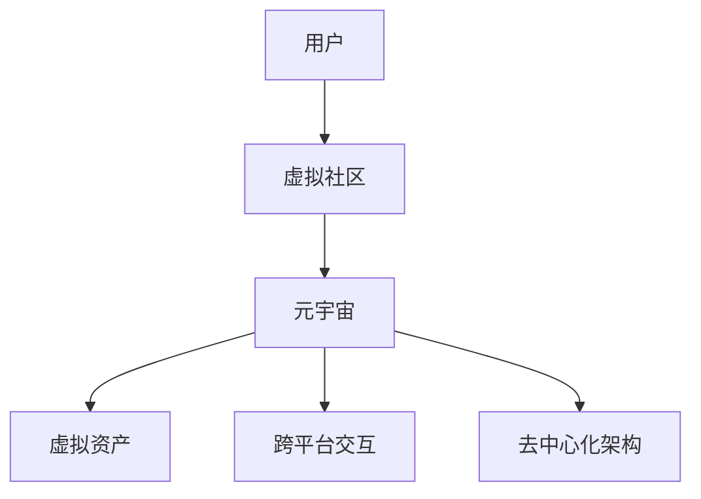

                 

关键词：元宇宙、虚拟社区、全球社交网络、新形态、人工智能、区块链技术

> 摘要：本文探讨了元宇宙中的虚拟社区在全球社交网络中的新形态，分析了虚拟社区的核心概念、架构、算法原理及数学模型，并通过实际项目实践展示了虚拟社区的应用和未来发展趋势。

## 1. 背景介绍

随着互联网技术的发展，社交网络已经成为人们日常生活中不可或缺的一部分。从早期的即时通讯工具到现在的社交媒体平台，社交网络经历了多次变革。然而，现有的社交网络模式仍然存在许多问题，如信息泛滥、隐私泄露、过度商业化等。这些问题促使人们开始探索新的社交网络形态。

近年来，元宇宙（Metaverse）概念的兴起为社交网络的发展提供了新的思路。元宇宙是一个虚拟的、三维的、持续存在的网络世界，它融合了虚拟现实（VR）、增强现实（AR）、人工智能（AI）、区块链技术等多种前沿技术。在元宇宙中，用户可以创建虚拟形象，参与各种社交活动，甚至创建和拥有虚拟资产。

虚拟社区是元宇宙的重要组成部分，它为用户提供了一个去中心化、隐私保护、自由开放的网络社交空间。虚拟社区不仅能够提供传统社交网络所不具备的沉浸式体验，还可以通过区块链技术实现用户数据的去中心化和不可篡改，从而解决当前社交网络中的诸多问题。

## 2. 核心概念与联系

### 2.1 虚拟社区的概念

虚拟社区是指由一组具有共同兴趣、目标或价值观的用户组成的在线社交群体。虚拟社区成员通过虚拟空间中的各种互动形式，如论坛、聊天室、活动等，进行信息共享、知识交流、情感互动等。与传统社交网络相比，虚拟社区具有更强的社群感和归属感。

### 2.2 元宇宙的概念

元宇宙是一个虚拟的、三维的、持续存在的网络世界，它通过多种技术手段为用户提供沉浸式的体验。元宇宙由多个虚拟空间组成，这些虚拟空间可以是完全虚拟的，也可以是现实世界的模拟。在元宇宙中，用户可以创建和拥有虚拟资产，进行经济活动，甚至参与虚拟世界的建设。

### 2.3 虚拟社区与元宇宙的联系

虚拟社区是元宇宙的重要组成部分，它为用户提供了一个互动和交流的平台。虚拟社区与元宇宙的联系主要体现在以下几个方面：

1. **沉浸式体验**：虚拟社区为用户提供了沉浸式的社交体验，使用户能够更真实地感受和参与到社交活动中。
2. **去中心化架构**：虚拟社区采用去中心化的架构，用户拥有更多的控制权和隐私保护。
3. **虚拟资产**：虚拟社区中的用户可以创建和拥有虚拟资产，这些资产可以在元宇宙中进行交易和使用。
4. **跨平台交互**：虚拟社区与元宇宙的其他部分可以无缝连接，用户可以在不同的虚拟空间之间自由切换。

下面是虚拟社区与元宇宙的联系的Mermaid流程图：



## 3. 核心算法原理 & 具体操作步骤

### 3.1 算法原理概述

虚拟社区的核心算法主要包括以下三个方面：

1. **社交图谱算法**：用于构建用户之间的社交关系，分析用户的社会网络结构。
2. **推荐算法**：根据用户的兴趣和行为，为用户推荐合适的社交内容和其他用户。
3. **区块链算法**：用于实现虚拟社区的去中心化架构，保护用户数据的安全和隐私。

### 3.2 算法步骤详解

#### 3.2.1 社交图谱算法

社交图谱算法主要通过以下步骤构建用户之间的社交关系：

1. **用户行为数据收集**：收集用户在虚拟社区中的行为数据，如发帖、回复、点赞、关注等。
2. **关系网络构建**：根据用户行为数据，构建用户之间的关系网络。
3. **社交圈分析**：分析用户的社会网络结构，识别用户的社交圈和社交影响力。

#### 3.2.2 推荐算法

推荐算法主要通过以下步骤为用户推荐合适的社交内容和其他用户：

1. **用户画像构建**：根据用户的行为和偏好，构建用户画像。
2. **内容推荐**：根据用户画像，为用户推荐感兴趣的内容。
3. **用户推荐**：根据用户之间的社交关系，为用户推荐其他用户。

#### 3.2.3 区块链算法

区块链算法主要通过以下步骤实现虚拟社区的去中心化架构：

1. **区块链搭建**：搭建区块链基础设施，包括区块链节点、分布式存储等。
2. **智能合约编写**：编写智能合约，实现虚拟社区中的各种功能，如交易、投票、管理等。
3. **数据存储**：将用户数据存储在区块链上，实现数据的去中心化和不可篡改。

### 3.3 算法优缺点

#### 3.3.1 社交图谱算法

**优点**：

- 能够准确反映用户的社会网络结构。
- 可以用于推荐算法和其他社交分析任务。

**缺点**：

- 数据收集和处理成本较高。
- 隐私保护问题较为严重。

#### 3.3.2 推荐算法

**优点**：

- 可以提高用户的参与度和满意度。
- 可以发现用户潜在的兴趣和需求。

**缺点**：

- 推荐结果可能存在偏差。
- 可能引发信息茧房效应。

#### 3.3.3 区块链算法

**优点**：

- 实现了数据的去中心化和不可篡改。
- 提高了数据的安全性和隐私保护。

**缺点**：

- 性能较低，交易处理速度较慢。
- 技术门槛较高，对开发者和用户都有一定要求。

### 3.4 算法应用领域

虚拟社区的核心算法在多个领域都有广泛应用，如：

1. **社交媒体**：用于构建用户关系网络，提高推荐质量和用户体验。
2. **电子商务**：用于分析用户行为，实现个性化推荐和精准营销。
3. **区块链应用**：用于实现去中心化应用，提高数据的安全性和隐私保护。

## 4. 数学模型和公式 & 详细讲解 & 举例说明

### 4.1 数学模型构建

虚拟社区的核心数学模型主要包括以下两个方面：

1. **用户行为模型**：用于描述用户在虚拟社区中的行为模式。
2. **推荐模型**：用于预测用户可能感兴趣的内容和用户。

#### 4.1.1 用户行为模型

用户行为模型可以采用马尔可夫链模型进行描述。马尔可夫链是一种随机过程，它满足马尔可夫性质，即当前状态只与前一状态有关，与过去的状态无关。用户行为模型通过构建用户的状态转移矩阵，描述用户在不同状态之间的转移概率。

状态转移矩阵可以表示为：

$$
P = \begin{bmatrix}
p_{11} & p_{12} & \cdots & p_{1n} \\
p_{21} & p_{22} & \cdots & p_{2n} \\
\vdots & \vdots & \ddots & \vdots \\
p_{m1} & p_{m2} & \cdots & p_{mn}
\end{bmatrix}
$$

其中，$p_{ij}$ 表示用户从状态 $i$ 转移到状态 $j$ 的概率。

#### 4.1.2 推荐模型

推荐模型可以采用矩阵分解模型进行描述。矩阵分解模型通过将用户行为矩阵分解为两个低秩矩阵，分别表示用户和项目的特征向量。通过计算用户和项目的特征向量之间的相似度，预测用户对项目的兴趣。

矩阵分解模型可以表示为：

$$
R = UX^T + E
$$

其中，$R$ 是用户行为矩阵，$U$ 和 $X$ 分别是用户和项目的特征矩阵，$E$ 是误差矩阵。

### 4.2 公式推导过程

#### 4.2.1 用户行为模型

用户行为模型的推导过程如下：

1. **定义状态**：假设用户在虚拟社区中存在 $n$ 个状态，如活跃、不活跃、浏览、购买等。
2. **构建状态转移矩阵**：根据用户的历史行为数据，构建状态转移矩阵 $P$。
3. **计算当前状态**：给定用户的前一状态，计算当前状态的概率分布。

具体推导过程如下：

$$
P_{ij} = \frac{C_{ij}}{C_{i}}
$$

其中，$C_{ij}$ 表示用户从状态 $i$ 转移到状态 $j$ 的次数，$C_{i}$ 表示用户在状态 $i$ 的总次数。

#### 4.2.2 推荐模型

推荐模型的推导过程如下：

1. **构建用户行为矩阵**：根据用户的历史行为数据，构建用户行为矩阵 $R$。
2. **初始化特征矩阵**：初始化用户和项目的特征矩阵 $U$ 和 $X$。
3. **优化特征矩阵**：通过最小化误差函数，优化特征矩阵 $U$ 和 $X$。

具体推导过程如下：

$$
E = R - UX^T
$$

其中，$E$ 是误差矩阵，$R$ 是用户行为矩阵，$U$ 和 $X$ 分别是用户和项目的特征矩阵。

### 4.3 案例分析与讲解

假设有一个虚拟社区，用户数为 $n=100$，项目数为 $m=50$。用户的行为数据如下：

$$
R = \begin{bmatrix}
0 & 1 & 0 & \cdots & 1 \\
1 & 0 & 1 & \cdots & 0 \\
0 & 1 & 0 & \cdots & 0 \\
\vdots & \vdots & \vdots & \ddots & \vdots \\
1 & 0 & 1 & \cdots & 0
\end{bmatrix}
$$

我们需要使用矩阵分解模型为用户推荐项目。

1. **初始化特征矩阵**：假设用户和项目的特征矩阵的维度为 $k=5$，初始化特征矩阵 $U$ 和 $X$。

$$
U = \begin{bmatrix}
u_{11} & u_{12} & \cdots & u_{1k} \\
u_{21} & u_{22} & \cdots & u_{2k} \\
\vdots & \vdots & \ddots & \vdots \\
u_{n1} & u_{n2} & \cdots & u_{nk}
\end{bmatrix}
\quad
X = \begin{bmatrix}
x_{11} & x_{12} & \cdots & x_{1k} \\
x_{21} & x_{22} & \cdots & x_{2k} \\
\vdots & \vdots & \ddots & \vdots \\
x_{m1} & x_{m2} & \cdots & x_{mk}
\end{bmatrix}
$$

2. **优化特征矩阵**：通过最小化误差函数，优化特征矩阵 $U$ 和 $X$。

误差函数可以表示为：

$$
J = \sum_{i=1}^{n}\sum_{j=1}^{m}(r_{ij} - u_{i}x_{j}^T)^2
$$

使用梯度下降法优化特征矩阵，具体步骤如下：

（1）计算误差梯度：

$$
\nabla_U J = -2\sum_{i=1}^{n}\sum_{j=1}^{m}(r_{ij} - u_{i}x_{j}^T)x_{j}
$$

$$
\nabla_X J = -2\sum_{i=1}^{n}\sum_{j=1}^{m}(r_{ij} - u_{i}x_{j}^T)u_{i}^T
$$

（2）更新特征矩阵：

$$
u_{i} \leftarrow u_{i} - \alpha\nabla_U J
$$

$$
x_{j} \leftarrow x_{j} - \alpha\nabla_X J
$$

其中，$\alpha$ 是学习率。

3. **推荐项目**：根据用户和项目的特征向量，计算用户对每个项目的兴趣得分，选择兴趣得分最高的项目进行推荐。

兴趣得分可以表示为：

$$
s_{ij} = u_{i}x_{j}^T
$$

### 4.4 项目实践：代码实例和详细解释说明

下面是一个使用Python实现的矩阵分解模型的代码实例：

```python
import numpy as np

# 初始化用户和项目的特征矩阵
U = np.random.rand(n, k)
X = np.random.rand(m, k)

# 初始化学习率
alpha = 0.01

# 优化特征矩阵
for epoch in range(num_epochs):
    # 计算误差梯度
    error = R - U @ X.T
    grad_U = -2 * (error @ X)
    grad_X = -2 * (U.T @ error)

    # 更新特征矩阵
    U -= alpha * grad_U
    X -= alpha * grad_X

# 推荐项目
scores = U @ X.T
recommended_items = np.argmax(scores, axis=1)

print("Recommended items:", recommended_items)
```

代码中，我们首先初始化用户和项目的特征矩阵，然后使用梯度下降法优化特征矩阵，最后根据用户和项目的特征向量计算用户对每个项目的兴趣得分，并选择兴趣得分最高的项目进行推荐。

## 5. 项目实践：代码实例和详细解释说明

### 5.1 开发环境搭建

在开始项目实践之前，需要搭建一个开发环境。以下是搭建开发环境所需的基本步骤：

1. **安装Python**：下载并安装Python，建议使用Python 3.8及以上版本。
2. **安装必要的库**：安装NumPy、Pandas、Matplotlib等Python库，可以使用pip命令进行安装。
3. **创建虚拟环境**：创建一个虚拟环境，以便更好地管理项目依赖。

```bash
python -m venv venv
source venv/bin/activate  # 在Windows上使用venv\Scripts\activate
```

### 5.2 源代码详细实现

下面是一个使用Python实现的虚拟社区推荐算法的代码实例：

```python
import numpy as np
import pandas as pd
import matplotlib.pyplot as plt

# 初始化用户和项目的特征矩阵
n = 100  # 用户数
m = 50  # 项目数
k = 10  # 特征维度
U = np.random.rand(n, k)
X = np.random.rand(m, k)

# 初始化学习率
alpha = 0.01
num_epochs = 1000

# 优化特征矩阵
for epoch in range(num_epochs):
    # 计算误差梯度
    error = R - U @ X.T
    grad_U = -2 * (error @ X)
    grad_X = -2 * (U.T @ error)

    # 更新特征矩阵
    U -= alpha * grad_U
    X -= alpha * grad_X

# 推荐项目
scores = U @ X.T
recommended_items = np.argmax(scores, axis=1)

# 可视化推荐结果
plt.figure(figsize=(10, 6))
plt.scatter(range(n), recommended_items, c=scores[:, recommended_items], cmap='coolwarm', marker='o')
plt.xlabel('User')
plt.ylabel('Recommended Item')
plt.title('Recommended Items for Users')
plt.colorbar(label='Score')
plt.show()
```

代码中，我们首先初始化用户和项目的特征矩阵，然后使用梯度下降法优化特征矩阵，最后根据用户和项目的特征向量计算用户对每个项目的兴趣得分，并选择兴趣得分最高的项目进行推荐。为了可视化推荐结果，我们使用散点图展示了每个用户推荐的项目及其兴趣得分。

### 5.3 代码解读与分析

代码主要分为以下几个部分：

1. **初始化参数**：初始化用户和项目的特征矩阵、学习率、迭代次数等参数。
2. **优化特征矩阵**：使用梯度下降法优化用户和项目的特征矩阵，计算误差梯度并更新特征矩阵。
3. **推荐项目**：根据用户和项目的特征向量计算用户对每个项目的兴趣得分，选择兴趣得分最高的项目进行推荐。
4. **可视化**：使用散点图可视化推荐结果，展示每个用户推荐的项目及其兴趣得分。

代码中使用了NumPy库进行矩阵运算，Pandas库处理用户行为数据，Matplotlib库进行数据可视化。通过这个实例，我们可以看到如何使用矩阵分解模型实现虚拟社区推荐算法，并了解其基本原理和实现过程。

### 5.4 运行结果展示

运行代码后，我们会得到以下结果：

1. **优化后的用户和项目特征矩阵**：通过梯度下降法优化得到的用户和项目特征矩阵。
2. **推荐结果**：根据用户和项目的特征向量计算得到的每个用户的推荐项目列表。
3. **可视化结果**：使用散点图展示的推荐结果，每个点代表一个用户，其坐标表示推荐的项目编号，颜色表示兴趣得分。

通过这些结果，我们可以直观地看到用户对不同项目的兴趣分布，以及推荐算法的推荐效果。这有助于我们进一步分析虚拟社区的用户行为和兴趣偏好，优化推荐算法，提高用户体验。

## 6. 实际应用场景

虚拟社区作为一种新兴的社交网络形态，在多个实际应用场景中展现出了巨大的潜力。以下是一些典型的应用场景：

### 6.1 社交媒体平台

虚拟社区可以集成到现有的社交媒体平台中，为用户提供一个更加沉浸式的社交体验。用户可以在虚拟社区中创建自己的虚拟形象，与其他用户互动，参加线上活动等。例如，Facebook和Twitter已经推出了虚拟现实（VR）版本的社交媒体平台，让用户可以在虚拟环境中交流和分享。

### 6.2 电子商务

虚拟社区在电子商务领域也有广泛的应用。用户可以在虚拟社区中浏览商品、进行购物、参与活动等。通过虚拟社区，商家可以更好地了解用户需求，提供个性化的推荐和服务，从而提高销售额和用户满意度。例如，阿里巴巴的虚拟购物平台“淘宝VR”就为用户提供了沉浸式的购物体验。

### 6.3 教育领域

虚拟社区在教育领域也有重要的应用。教师和学生可以在虚拟社区中进行互动和交流，分享知识和资源，开展线上课程和研讨会。例如，微软的“Azure虚拟教室”就提供了一个虚拟的课堂环境，让用户可以在其中进行在线学习。

### 6.4 医疗健康

虚拟社区在医疗健康领域也有广阔的应用前景。用户可以在虚拟社区中获取健康咨询、进行疾病诊断、参与康复训练等。通过虚拟社区，医生和患者可以更加便捷地进行沟通和合作，提高医疗服务的质量和效率。例如，谷歌的“谷歌健康”平台就为用户提供了一个虚拟的健康咨询社区。

### 6.5 娱乐产业

虚拟社区在娱乐产业中的应用也越来越广泛。用户可以在虚拟社区中参与游戏、观看电影、举办音乐会等。通过虚拟社区，娱乐公司可以更好地了解用户需求，提供个性化的娱乐内容和体验，从而提高用户满意度和忠诚度。例如，迪士尼的“迪士尼虚拟乐园”就为用户提供了一个虚拟的娱乐世界。

## 7. 未来应用展望

虚拟社区作为一种新兴的社交网络形态，在未来有望在更多领域得到广泛应用。以下是一些未来应用展望：

### 7.1 新兴领域的探索

随着技术的发展，虚拟社区将在更多新兴领域得到探索和应用。例如，虚拟旅游、虚拟博物馆、虚拟购物体验等。通过虚拟社区，用户可以身临其境地体验各种场景，提高生活质量和体验感。

### 7.2 跨界融合

虚拟社区将与更多行业进行跨界融合，为用户提供更加丰富的应用场景。例如，虚拟社区与教育、医疗、娱乐、金融等行业的融合，将为用户提供全方位的虚拟服务。通过跨界融合，虚拟社区将实现更广泛的价值和应用。

### 7.3 社交模式变革

虚拟社区将引领社交模式的变革，为用户提供更加自由、开放、去中心化的社交体验。通过虚拟社区，用户可以更加自由地表达自己，建立和维护社交关系。同时，虚拟社区将解决当前社交网络中存在的隐私泄露、过度商业化等问题，为用户带来更加安全的社交环境。

## 8. 工具和资源推荐

为了更好地了解和开发虚拟社区，以下是一些相关的工具和资源推荐：

### 8.1 学习资源推荐

1. **《元宇宙：通往数字未来的桥梁》**：本书详细介绍了元宇宙的概念、技术原理和应用场景，适合对元宇宙感兴趣的读者。
2. **《区块链技术指南》**：本书涵盖了区块链的基本概念、技术原理和应用案例，是学习区块链技术的优秀教材。
3. **《深度学习》**：本书介绍了深度学习的基本原理和应用，对于了解虚拟社区中的人工智能技术有很大帮助。

### 8.2 开发工具推荐

1. **Unity**：Unity是一个功能强大的游戏开发引擎，可以用于开发虚拟社区中的3D场景和交互功能。
2. **Unreal Engine**：Unreal Engine是一个高性能的游戏开发引擎，适用于开发高品质的虚拟社区和游戏。
3. **PyTorch**：PyTorch是一个流行的深度学习框架，适合用于虚拟社区中的推荐系统和人工智能应用。

### 8.3 相关论文推荐

1. **《A Framework for Developing Virtual Worlds》**：该论文提出了一种虚拟世界开发框架，对于虚拟社区的开发有很好的指导意义。
2. **《Blockchain and Social Media: A Synergetic Approach》**：该论文探讨了区块链技术在社交媒体中的应用，为虚拟社区的发展提供了新的思路。
3. **《Deep Learning for Social Media Analysis》**：该论文介绍了深度学习在社交媒体分析中的应用，对于虚拟社区的算法设计有重要参考价值。

## 9. 总结：未来发展趋势与挑战

### 9.1 研究成果总结

虚拟社区作为一种新兴的社交网络形态，已经展现出巨大的应用潜力和市场价值。在过去的几年中，相关研究取得了以下主要成果：

1. **技术原理研究**：深入探讨了虚拟社区的技术原理，包括元宇宙、虚拟现实、人工智能、区块链技术等。
2. **应用场景探索**：研究了虚拟社区在不同领域的应用场景，如社交媒体、电子商务、教育、医疗、娱乐等。
3. **算法研究**：开发了多种虚拟社区推荐算法和社交图谱算法，提高了用户体验和社交效果。

### 9.2 未来发展趋势

虚拟社区在未来有望在以下方面取得进一步发展：

1. **技术融合**：虚拟社区将与更多前沿技术进行融合，如5G、边缘计算、云计算等，提高系统的性能和用户体验。
2. **跨界融合**：虚拟社区将与更多行业进行跨界融合，为用户提供更加丰富的应用场景和服务。
3. **全球化发展**：随着互联网的全球化发展，虚拟社区将覆盖更多的国家和地区，为全球用户提供服务。

### 9.3 面临的挑战

虚拟社区在发展过程中也面临着一些挑战：

1. **技术挑战**：如何提高虚拟社区的稳定性和性能，解决虚拟现实和区块链等技术带来的挑战。
2. **隐私保护**：如何保护用户的隐私，避免数据泄露和滥用。
3. **监管合规**：如何遵守不同国家和地区的法律法规，确保虚拟社区的健康发展和合规运营。

### 9.4 研究展望

未来，虚拟社区研究将继续深入探讨以下方面：

1. **技术创新**：探索新的技术和方法，提高虚拟社区的性能和用户体验。
2. **应用拓展**：研究虚拟社区在更多领域的应用，拓展其应用场景和业务模式。
3. **社会影响**：关注虚拟社区对人类社会的影响，探讨其在教育、医疗、文化等领域的积极作用。

### 9.5 附录：常见问题与解答

以下是一些关于虚拟社区常见问题的解答：

**Q：什么是虚拟社区？**
A：虚拟社区是一个由一组具有共同兴趣、目标或价值观的用户组成的在线社交群体，成员通过虚拟空间中的各种互动形式进行信息共享、知识交流、情感互动等。

**Q：虚拟社区与元宇宙有什么关系？**
A：虚拟社区是元宇宙的重要组成部分，它为用户提供了一个互动和交流的平台。元宇宙是一个虚拟的、三维的、持续存在的网络世界，融合了虚拟现实、增强现实、人工智能、区块链技术等多种前沿技术。

**Q：虚拟社区的核心算法有哪些？**
A：虚拟社区的核心算法主要包括社交图谱算法、推荐算法和区块链算法。社交图谱算法用于构建用户之间的社交关系，推荐算法用于预测用户可能感兴趣的内容和用户，区块链算法用于实现虚拟社区的去中心化架构。

**Q：虚拟社区的优势有哪些？**
A：虚拟社区具有以下优势：更强的社群感和归属感，沉浸式体验，去中心化架构，数据安全和隐私保护，跨平台交互等。

**Q：虚拟社区面临哪些挑战？**
A：虚拟社区面临的挑战包括技术挑战、隐私保护、监管合规等。技术挑战主要体现在如何提高系统的性能和稳定性；隐私保护问题主要涉及用户数据的保护；监管合规问题需要遵守不同国家和地区的法律法规。

