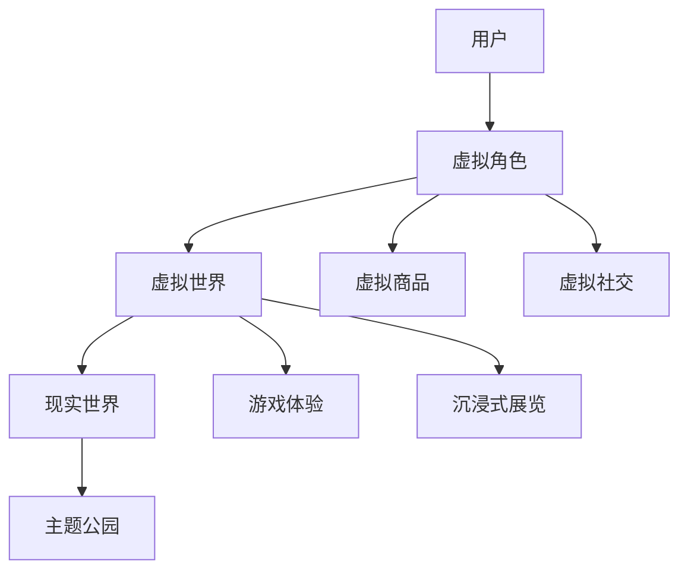

                 

关键词：元宇宙，主题公园，虚拟现实，人机交互，娱乐体验

摘要：随着技术的不断进步，元宇宙正逐渐成为现实世界与虚拟世界交融的新兴领域。本文将探讨元宇宙主题公园的概念、核心技术与未来发展，旨在为读者提供对这一新兴娱乐体验的深入了解。

## 1. 背景介绍

### 1.1 元宇宙的概念

元宇宙（Metaverse）是指通过互联网连接的虚拟世界，用户可以在其中进行各种活动，如社交、娱乐、购物和工作。元宇宙的核心特点是沉浸式体验、交互性和广泛连接性。它不仅仅是一个虚拟空间，而是一个跨越不同平台、设备和地理位置的生态系统。

### 1.2 主题公园的发展

主题公园作为传统的娱乐场所，一直以来都是人们享受欢乐的重要去处。随着虚拟现实（VR）和增强现实（AR）技术的成熟，主题公园逐渐开始融合元宇宙的概念，为游客提供更加沉浸和互动的娱乐体验。

## 2. 核心概念与联系

### 2.1 元宇宙主题公园架构



### 2.2 技术联系

虚拟角色与虚拟世界通过VR和AR技术进行互动，用户可以在虚拟世界中体验各种活动。虚拟商品和虚拟社交则通过区块链技术实现所有权和社交互动。游戏体验和沉浸式展览通过高性能计算和图像渲染技术实现。

## 3. 核心算法原理 & 具体操作步骤

### 3.1 算法原理概述

元宇宙主题公园的核心算法主要包括：

- **空间定位算法**：确定用户在虚拟世界中的位置和方向。
- **渲染算法**：生成逼真的虚拟场景和角色。
- **交互算法**：处理用户与虚拟环境的互动。

### 3.2 算法步骤详解

1. **用户登录**：用户通过账号密码或生物识别技术进入元宇宙主题公园。
2. **空间定位**：使用GPS或室内定位技术确定用户位置。
3. **渲染场景**：根据用户位置和视角，实时渲染虚拟场景。
4. **用户互动**：用户可以通过虚拟角色进行游戏、购物和社交。

### 3.3 算法优缺点

- **优点**：提供沉浸式体验，增强互动性。
- **缺点**：技术要求高，设备依赖性强。

### 3.4 算法应用领域

元宇宙主题公园算法主要应用于娱乐、教育和社交领域。

## 4. 数学模型和公式 & 详细讲解 & 举例说明

### 4.1 数学模型构建

元宇宙主题公园的数学模型包括：

- **空间坐标系**：定义虚拟世界中的坐标系统。
- **渲染模型**：描述虚拟场景的生成和渲染过程。
- **交互模型**：描述用户与虚拟世界的互动。

### 4.2 公式推导过程

假设用户在虚拟世界中的位置为\( (x, y, z) \)，则空间坐标系可以表示为：

\[ x = r \cdot \cos(\theta) \]
\[ y = r \cdot \sin(\theta) \]
\[ z = h \]

其中，\( r \) 是用户到虚拟世界中心的距离，\( \theta \) 是用户在水平面的角度，\( h \) 是用户的高度。

### 4.3 案例分析与讲解

以虚拟角色在主题公园中的互动为例，假设用户想要与虚拟角色拍照，可以通过以下步骤实现：

1. **空间定位**：确定用户和虚拟角色的位置。
2. **渲染场景**：根据用户位置和视角渲染虚拟角色。
3. **交互处理**：用户与虚拟角色进行拍照互动。

## 5. 项目实践：代码实例和详细解释说明

### 5.1 开发环境搭建

使用Unity引擎和Unreal Engine进行虚拟世界和渲染的搭建。

### 5.2 源代码详细实现

以下是Unity引擎中虚拟角色互动的代码示例：

```csharp
using UnityEngine;

public class VirtualRoleInteraction : MonoBehaviour
{
    public Transform user;
    public Transform role;

    void Update()
    {
        // 确定用户与虚拟角色的相对位置
        Vector3 relativePosition = role.position - user.position;

        // 调整虚拟角色位置
        role.position = user.position + relativePosition.normalized * 5;

        // 渲染虚拟角色
        Renderer renderer = role.GetComponent<Renderer>();
        Material material = renderer.material;
        material.SetColor("_Color", Color.blue);
    }
}
```

### 5.3 代码解读与分析

该代码实现了一个虚拟角色的位置跟随和颜色渲染功能。用户和虚拟角色之间的相对位置通过Vector3变量计算，并根据此位置调整虚拟角色位置。同时，通过Material设置虚拟角色的颜色。

### 5.4 运行结果展示

当用户在虚拟世界中移动时，虚拟角色会跟随用户移动，并且颜色变为蓝色。

## 6. 实际应用场景

### 6.1 娱乐行业

元宇宙主题公园为娱乐行业带来了全新的体验模式，如VR游戏、AR购物和虚拟演唱会等。

### 6.2 教育行业

元宇宙主题公园可用于教育领域的虚拟实验和互动教学。

### 6.3 社交行业

元宇宙主题公园为用户提供了一个全新的社交平台，通过虚拟角色进行交流和互动。

## 7. 工具和资源推荐

### 7.1 学习资源推荐

- 《元宇宙：概念、技术与应用》
- 《Unity 2021游戏开发实战》

### 7.2 开发工具推荐

- Unity引擎
- Unreal Engine

### 7.3 相关论文推荐

- 《元宇宙：下一代互联网的探索》
- 《基于AR/VR的虚拟现实教育应用研究》

## 8. 总结：未来发展趋势与挑战

### 8.1 研究成果总结

元宇宙主题公园的研究成果主要体现在虚拟现实技术的应用和用户体验的优化方面。

### 8.2 未来发展趋势

元宇宙主题公园将在娱乐、教育和社交等领域得到更广泛的应用，同时技术将不断优化和升级。

### 8.3 面临的挑战

元宇宙主题公园面临的主要挑战包括技术实现难度、设备依赖性和用户体验一致性。

### 8.4 研究展望

未来研究将重点关注虚拟现实技术的融合、交互体验的优化和隐私保护等方面。

## 9. 附录：常见问题与解答

### 9.1 元宇宙主题公园是什么？

元宇宙主题公园是一个结合了虚拟现实和增强现实技术的娱乐场所，用户可以在其中体验各种虚拟活动。

### 9.2 元宇宙主题公园的技术基础是什么？

元宇宙主题公园的技术基础主要包括虚拟现实、增强现实、区块链和人工智能等技术。

### 9.3 元宇宙主题公园有哪些应用领域？

元宇宙主题公园主要应用于娱乐、教育和社交等领域。

### 9.4 如何在元宇宙主题公园中实现沉浸式体验？

通过虚拟现实和增强现实技术，结合高性能计算和图像渲染，实现沉浸式体验。

----------------------------------------------------------------

作者：禅与计算机程序设计艺术 / Zen and the Art of Computer Programming


