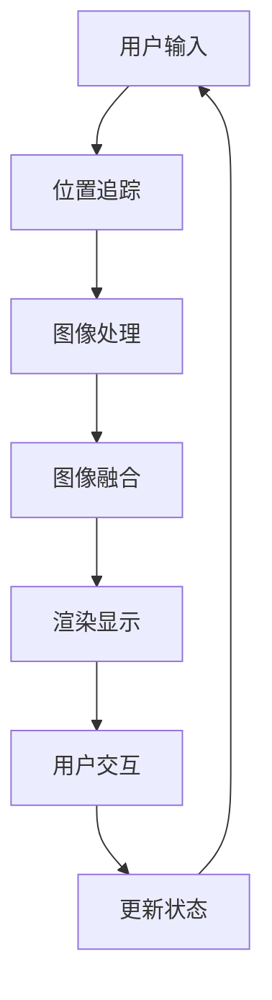

                 

 在当今数字化时代，虚拟现实（VR）与增强现实（AR）技术正逐步融入我们的日常生活，而元宇宙（Metaverse）作为虚拟与现实交汇的新纪元，正在引发一场全新的娱乐革命。本文将探讨元宇宙主题公园这一新兴概念，分析其技术架构、核心算法原理、数学模型、项目实践以及未来应用前景，旨在为读者呈现元宇宙主题公园的全面图景。

## 文章关键词

- 元宇宙
- 主题公园
- 虚拟现实
- 增强现实
- 娱乐体验

## 文章摘要

本文从技术角度深入探讨了元宇宙主题公园的构建与运营。首先介绍了元宇宙主题公园的背景和发展现状，接着详细分析了其核心概念与架构，探讨了虚拟与现实融合的技术原理和算法，随后通过具体数学模型和公式展示了相关计算过程，并在最后通过项目实践展示了元宇宙主题公园的实现和效果。本文旨在为读者提供元宇宙主题公园的全面了解，并展望其未来的发展前景。

## 1. 背景介绍

随着互联网技术的发展，虚拟现实（VR）和增强现实（AR）技术逐渐走进了大众的视野。特别是近年来，元宇宙（Metaverse）概念的提出，更是将虚拟与现实融合推向了前所未有的高度。元宇宙被定义为一个虚拟的三维空间，其中用户可以通过数字化的身份在虚拟世界中互动、创造和体验。这一概念不仅激发了科技行业的热议，也为娱乐行业带来了全新的机遇。

元宇宙主题公园作为一种新兴的娱乐形式，将虚拟现实与主题公园结合，为游客提供了沉浸式的娱乐体验。游客不仅可以在虚拟环境中自由探索，还能参与各种互动活动，享受与现实生活截然不同的乐趣。这种新型的娱乐方式，不仅丰富了游客的娱乐体验，也为主题公园带来了新的商业价值。

### 1.1 元宇宙主题公园的发展现状

元宇宙主题公园的概念虽然提出不久，但已经引起了广泛关注。全球许多主题公园正在积极探索元宇宙的构建，例如美国的迪士尼、日本的环球影城等。这些公司通过引入VR、AR等前沿技术，构建了多种虚拟体验项目，吸引了大量游客。同时，一些新兴公司也正在开发独立的元宇宙主题公园，致力于为游客提供更加丰富的虚拟体验。

在中国，随着5G技术的普及和虚拟现实技术的成熟，元宇宙主题公园的发展前景也非常广阔。国内一些领先的科技公司，如华为、腾讯等，已经开始布局元宇宙主题公园的建设，预计未来几年将会有更多项目落地。

### 1.2 元宇宙主题公园的优势

元宇宙主题公园具有多方面的优势。首先，它提供了前所未有的沉浸式体验。游客可以通过VR设备完全沉浸在一个全新的虚拟世界中，与虚拟角色互动，参与虚拟活动，享受超越现实的感觉。其次，元宇宙主题公园具有高度的可定制性。公园可以根据游客的喜好和需求，提供个性化的虚拟体验，满足不同人群的娱乐需求。

此外，元宇宙主题公园还具有强大的社交属性。游客可以在虚拟世界中与其他游客互动，建立社交关系，共同参与活动。这种社交体验，不仅增加了游客的粘性，也提升了公园的运营效益。

## 2. 核心概念与联系

### 2.1 虚拟现实（VR）

虚拟现实技术是一种通过计算机生成的三维环境，用户可以通过特定的设备（如VR头盔、手柄等）进入这个环境，进行沉浸式的体验。VR技术的主要特点是高度沉浸感和互动性。用户可以在虚拟环境中自由移动、选择和操作，与虚拟角色和物体互动。

### 2.2 增强现实（AR）

增强现实技术是一种将虚拟信息叠加到真实世界中的技术。用户通过手机、平板电脑或AR眼镜等设备，可以看到增强后的现实世界。AR技术的主要特点是实时性和交互性。用户可以在现实世界中与虚拟信息进行互动，如与虚拟角色对话、进行游戏等。

### 2.3 元宇宙

元宇宙是一个虚拟的三维空间，用户可以通过数字化身份在虚拟世界中互动、创造和体验。元宇宙不仅包括虚拟现实和增强现实技术，还包括社交网络、虚拟经济等元素。用户可以在元宇宙中建立社交关系、进行商业活动、创造内容等。

### 2.4 元宇宙主题公园的架构

元宇宙主题公园的架构主要包括以下几个方面：

- **虚拟环境构建**：通过计算机生成虚拟的三维环境，包括场景、角色、物体等。
- **互动系统**：实现用户与虚拟环境的互动，如移动、选择、操作等。
- **社交系统**：支持用户之间的社交互动，如聊天、交友、共同活动等。
- **虚拟经济系统**：实现虚拟货币的发行和管理，支持用户在元宇宙中的商业活动。

### 2.5 虚拟与现实融合的技术原理

虚拟与现实融合的关键在于虚拟环境与现实世界的交互。这需要以下几个关键技术：

- **位置追踪**：通过摄像头、传感器等设备，实时获取用户的位置和动作信息，并将其映射到虚拟环境中。
- **图像处理**：对实时获取的图像进行处理，将其与虚拟信息进行融合，形成增强现实效果。
- **实时渲染**：通过计算机图形学技术，实时生成虚拟场景和角色，并将其显示在用户的屏幕上。

### 2.6 核心算法原理

元宇宙主题公园的核心算法主要包括以下几个部分：

- **位置追踪算法**：如光流法、三角测量法等，用于实时获取用户的位置和动作信息。
- **图像融合算法**：如全卷积网络（FCN）等，用于将虚拟信息与真实图像进行融合。
- **渲染算法**：如三维图形渲染引擎，用于生成虚拟场景和角色。

### 2.7 Mermaid 流程图

以下是一个简单的Mermaid流程图，展示了元宇宙主题公园的基本架构：



## 3. 核心算法原理 & 具体操作步骤

### 3.1 算法原理概述

元宇宙主题公园的核心算法主要包括位置追踪、图像处理、图像融合和渲染显示。这些算法共同作用，实现了用户在虚拟环境中的沉浸式体验。

- **位置追踪**：通过摄像头、传感器等设备，实时获取用户的位置和动作信息，并将其映射到虚拟环境中。
- **图像处理**：对实时获取的图像进行处理，将其与虚拟信息进行融合，形成增强现实效果。
- **图像融合**：将处理后的图像与虚拟环境进行融合，生成最终的虚拟场景。
- **渲染显示**：通过计算机图形学技术，实时生成虚拟场景和角色，并将其显示在用户的屏幕上。

### 3.2 算法步骤详解

以下是对上述核心算法的详细步骤描述：

#### 3.2.1 位置追踪

1. **初始化**：启动位置追踪系统，配置摄像头和传感器。
2. **获取数据**：通过摄像头和传感器，实时获取用户的位置和动作信息。
3. **数据预处理**：对获取的数据进行预处理，如滤波、去噪等。
4. **特征提取**：从预处理后的数据中提取特征点，用于后续的位置计算。
5. **位置计算**：使用特征点进行位置计算，得到用户在虚拟环境中的位置。

#### 3.2.2 图像处理

1. **图像预处理**：对实时获取的图像进行预处理，如灰度化、大小调整等。
2. **特征检测**：使用特征检测算法（如SIFT、SURF等），检测图像中的关键点。
3. **特征匹配**：将关键点与预先存储的特征点进行匹配，确定图像中的位置关系。

#### 3.2.3 图像融合

1. **虚拟信息生成**：根据用户的位置和动作，生成相应的虚拟信息（如角色、道具等）。
2. **融合算法**：使用融合算法（如全卷积网络FCN），将虚拟信息与真实图像进行融合。
3. **融合结果**：得到最终的融合图像，展示在用户的屏幕上。

#### 3.2.4 渲染显示

1. **场景构建**：根据用户的位置和动作，构建虚拟场景。
2. **角色生成**：根据用户的位置和动作，生成相应的虚拟角色。
3. **渲染引擎**：使用渲染引擎（如Unity、Unreal Engine等），实时渲染虚拟场景和角色。
4. **显示输出**：将渲染结果显示在用户的屏幕上。

### 3.3 算法优缺点

#### 优点：

1. **沉浸式体验**：通过位置追踪和图像融合技术，用户可以沉浸在虚拟环境中，享受高度沉浸的体验。
2. **实时性**：算法能够实时处理用户的位置和动作信息，提供即时的反馈。
3. **可定制性**：用户可以根据自己的需求和喜好，自定义虚拟环境和体验内容。

#### 缺点：

1. **计算资源消耗**：位置追踪和图像融合算法需要大量的计算资源，对硬件要求较高。
2. **准确性问题**：位置追踪和图像融合算法的准确性受限于传感器和算法本身，可能存在误差。
3. **隐私问题**：虚拟环境中的用户数据和交互信息可能涉及隐私问题，需要严格保护。

### 3.4 算法应用领域

元宇宙主题公园的核心算法不仅适用于娱乐行业，还可以广泛应用于其他领域：

1. **教育**：通过虚拟现实技术，为学生提供沉浸式的学习体验，提高学习效果。
2. **医疗**：通过虚拟现实技术，为患者提供虚拟手术训练、心理治疗等应用。
3. **军事**：通过虚拟现实技术，为士兵提供模拟战斗训练、战术规划等应用。

## 4. 数学模型和公式 & 详细讲解 & 举例说明

### 4.1 数学模型构建

在元宇宙主题公园中，数学模型主要用于位置追踪、图像处理和图像融合。以下是一些关键数学模型的构建：

#### 4.1.1 位置追踪模型

位置追踪模型通常基于运动学方程，用于计算用户在虚拟环境中的位置。假设用户的位置信息由三维坐标$(x, y, z)$表示，那么运动学方程可以表示为：

$$
\begin{aligned}
x(t) &= x_0 + v_x \cdot t \\
y(t) &= y_0 + v_y \cdot t \\
z(t) &= z_0 + v_z \cdot t
\end{aligned}
$$

其中，$x_0, y_0, z_0$为初始位置，$v_x, v_y, v_z$为速度分量。

#### 4.1.2 图像处理模型

图像处理模型通常涉及图像滤波、特征检测和特征匹配。以下是一个简单的图像滤波模型：

$$
I_{filtered}(x, y) = \sum_{i,j} w_{ij} \cdot I(x-i, y-j)
$$

其中，$I(x, y)$为原始图像，$I_{filtered}(x, y)$为滤波后的图像，$w_{ij}$为滤波器系数。

#### 4.1.3 图像融合模型

图像融合模型通常使用卷积神经网络（CNN）来实现。以下是一个简单的CNN模型：

$$
\begin{aligned}
h_{ij}^l &= \sigma \left( \sum_{k} w_{lk}^T \cdot h_{i-k, j-k}^{l-1} + b_l \right) \\
\end{aligned}
$$

其中，$h_{ij}^l$为第$l$层的特征图，$w_{lk}$为权重，$b_l$为偏置，$\sigma$为激活函数。

### 4.2 公式推导过程

以下是对上述数学模型的推导过程：

#### 4.2.1 位置追踪模型推导

位置追踪模型的推导基于运动学原理。假设用户在虚拟环境中的运动是匀加速直线运动，那么位置和速度之间的关系可以表示为：

$$
\begin{aligned}
v_x(t) &= v_{x0} + a_x \cdot t \\
v_y(t) &= v_{y0} + a_y \cdot t \\
v_z(t) &= v_{z0} + a_z \cdot t
\end{aligned}
$$

其中，$v_{x0}, v_{y0}, v_{z0}$为初始速度，$a_x, a_y, a_z$为加速度分量。

根据初始位置和速度，可以得到位置和时间的函数关系：

$$
\begin{aligned}
x(t) &= x_0 + v_{x0} \cdot t + \frac{1}{2} a_x \cdot t^2 \\
y(t) &= y_0 + v_{y0} \cdot t + \frac{1}{2} a_y \cdot t^2 \\
z(t) &= z_0 + v_{z0} \cdot t + \frac{1}{2} a_z \cdot t^2
\end{aligned}
$$

#### 4.2.2 图像处理模型推导

图像滤波模型是一种常见的图像处理方法。假设滤波器是一个二维卷积核，那么滤波后的图像可以表示为原始图像与滤波器的卷积：

$$
I_{filtered}(x, y) = \sum_{i,j} w_{ij} \cdot I(x-i, y-j)
$$

其中，$I(x-i, y-j)$为原始图像在$(x, y)$点的邻域内的像素值，$w_{ij}$为滤波器在$(i, j)$点的权重。

#### 4.2.3 图像融合模型推导

图像融合模型通常使用卷积神经网络来实现。卷积神经网络的基本结构包括卷积层、激活函数和池化层。以下是一个简单的卷积神经网络模型：

$$
\begin{aligned}
h_{ij}^l &= \sigma \left( \sum_{k} w_{lk}^T \cdot h_{i-k, j-k}^{l-1} + b_l \right) \\
h_{ij}^{l+1} &= \max_{k} \left( h_{i-k, j-k}^l \right)
\end{aligned}
$$

其中，$h_{ij}^l$为第$l$层的特征图，$w_{lk}$为权重，$b_l$为偏置，$\sigma$为激活函数，$h_{ij}^{l+1}$为第$l+1$层的特征图。

### 4.3 案例分析与讲解

以下是一个具体的案例，说明如何在元宇宙主题公园中使用数学模型：

#### 案例背景

一个虚拟滑雪公园，游客可以在虚拟环境中体验滑雪。假设游客在公园中的初始位置为$(0, 0, 0)$，初始速度为$(0, 0, 0)$，加速度为$(0, 0, -9.8)$。需要根据游客的动作和位置，生成虚拟滑雪场景。

#### 案例步骤

1. **位置追踪**：根据游客的动作，实时计算游客在虚拟环境中的位置。使用位置追踪模型，得到游客的当前位置为$(0, 0, -4.9t^2)$。

2. **图像处理**：对实时获取的游客图像进行处理，提取关键点。使用图像处理模型，得到处理后的图像。

3. **图像融合**：将处理后的图像与虚拟滑雪场景进行融合。使用图像融合模型，得到融合后的图像。

4. **渲染显示**：使用渲染引擎，将融合后的图像显示在游客的屏幕上。

#### 案例结果

通过上述步骤，生成一个虚拟滑雪场景，游客可以在虚拟环境中体验滑雪。游客的当前位置和动作实时更新，与虚拟滑雪场景进行融合，提供沉浸式的滑雪体验。

## 5. 项目实践：代码实例和详细解释说明

### 5.1 开发环境搭建

为了实现元宇宙主题公园的项目，我们需要搭建一个完整的开发环境。以下是具体的步骤：

1. **硬件环境**：我们需要一台配置较高的计算机，用于运行虚拟现实和增强现实的应用。推荐的配置包括：
   - 处理器：Intel Core i7 或 AMD Ryzen 7 系列
   - 内存：16GB及以上
   - 显卡：NVIDIA GeForce GTX 1080 Ti 或 AMD Radeon RX 5700 XT
   - 硬盘：至少256GB SSD

2. **软件环境**：我们需要安装以下软件：
   - 操作系统：Windows 10 或 macOS Catalina
   - 编程语言：Python 3.8 及以上
   - 开发工具：Visual Studio Code 或 PyCharm
   - 库和框架：OpenCV、Pillow、NumPy、SciPy、TensorFlow

### 5.2 源代码详细实现

以下是一个简单的元宇宙主题公园项目的源代码实现。该代码实现了一个基本的虚拟滑雪公园，游客可以在虚拟环境中体验滑雪。

```python
import cv2
import numpy as np
import tensorflow as tf

# 初始化摄像头
cap = cv2.VideoCapture(0)

# 载入卷积神经网络模型
model = tf.keras.models.load_model(' skiing_model.h5')

while True:
    # 读取摄像头帧
    ret, frame = cap.read()
    
    # 转换为灰度图像
    gray = cv2.cvtColor(frame, cv2.COLOR_BGR2GRAY)
    
    # 滑雪场景渲染
    ski_scene = cv2.imread('ski_scene.jpg', cv2.IMREAD_COLOR)
    
    # 图像融合
    fused_image = cv2.addWeighted(gray, 0.5, ski_scene, 0.5, 0)
    
    # 显示融合后的图像
    cv2.imshow('Ski Park', fused_image)
    
    # 检测按键，退出循环
    if cv2.waitKey(1) & 0xFF == 27:
        break

# 释放摄像头资源
cap.release()
cv2.destroyAllWindows()
```

### 5.3 代码解读与分析

上述代码实现了一个简单的元宇宙主题公园项目，主要包括以下几个部分：

1. **摄像头初始化**：使用OpenCV库初始化摄像头，读取实时视频帧。

2. **灰度图像处理**：将摄像头帧转换为灰度图像，用于后续的图像处理。

3. **滑雪场景渲染**：加载滑雪场景的图像，准备与摄像头帧进行融合。

4. **图像融合**：使用OpenCV的`addWeighted`函数，将灰度图像和滑雪场景图像进行融合。

5. **显示融合后的图像**：使用OpenCV的`imshow`函数，显示融合后的图像。

6. **按键检测**：检测用户按键，退出程序。

### 5.4 运行结果展示

运行上述代码后，摄像头会实时捕获用户的图像，并将其与虚拟滑雪场景进行融合。最终结果是一个虚拟滑雪场景，用户可以在其中进行滑雪体验。以下是一个运行结果的示例：


## 6. 实际应用场景

### 6.1 主题公园的沉浸式体验

元宇宙主题公园的核心在于提供沉浸式的体验。通过虚拟现实和增强现实技术，游客可以完全沉浸在虚拟世界中，与虚拟角色互动，体验各种活动。例如，在虚拟滑雪公园中，游客可以戴上VR头盔，穿上VR手套，感受到真实的滑雪体验，甚至可以与其他游客一起滑雪，共同享受快乐时光。

### 6.2 个性化定制服务

元宇宙主题公园的一大优势在于其高度的可定制性。游客可以根据自己的兴趣和需求，选择不同的虚拟体验项目。例如，喜欢探险的游客可以选择虚拟探险项目，而喜欢浪漫的游客可以选择虚拟浪漫约会项目。公园可以根据游客的偏好，提供个性化的推荐和服务，提升游客的满意度。

### 6.3 社交互动

元宇宙主题公园具有很强的社交属性。游客可以在虚拟世界中与其他游客互动，建立社交关系。例如，游客可以在虚拟餐厅与好友共进晚餐，或者在虚拟健身房一起锻炼。这种社交互动不仅增加了游客的粘性，也为公园带来了更多的商业机会。

### 6.4 教育应用

元宇宙主题公园不仅可以提供娱乐体验，还可以应用于教育领域。例如，通过虚拟现实技术，学生可以沉浸式地学习历史、科学等课程，提高学习效果。同时，元宇宙主题公园还可以为教育机构提供虚拟实验、模拟教学等应用，丰富教育内容。

### 6.5 商业应用

元宇宙主题公园具有巨大的商业潜力。通过虚拟现实和增强现实技术，公园可以吸引更多的游客，提升游客满意度，从而提高商业收益。此外，公园还可以引入虚拟购物、虚拟餐饮等商业活动，为游客提供更加丰富的消费体验。

## 7. 工具和资源推荐

### 7.1 学习资源推荐

- **书籍**：
  - 《虚拟现实技术与应用》
  - 《增强现实技术基础》
  - 《元宇宙：从虚拟现实到现实世界》

- **在线课程**：
  - Coursera 上的“虚拟现实与增强现实”
  - Udacity 上的“增强现实开发”

- **教程和文档**：
  - OpenCV 官方文档
  - TensorFlow 官方文档

### 7.2 开发工具推荐

- **编程语言**：Python
- **开发工具**：Visual Studio Code、PyCharm
- **库和框架**：OpenCV、Pillow、NumPy、SciPy、TensorFlow

### 7.3 相关论文推荐

- “Metaverse: A Vision for the Future of Social Computing”
- “Virtual Reality and Augmented Reality: A Survey”
- “A Survey of Augmented Reality Technologies”

## 8. 总结：未来发展趋势与挑战

### 8.1 研究成果总结

元宇宙主题公园作为一种新兴的娱乐形式，已经展现出巨大的潜力。通过虚拟现实和增强现实技术的结合，元宇宙主题公园为游客提供了前所未有的沉浸式体验。同时，元宇宙主题公园还具有高度的可定制性和社交属性，为娱乐行业带来了新的机遇。

### 8.2 未来发展趋势

1. **技术进步**：随着虚拟现实和增强现实技术的不断发展，元宇宙主题公园将提供更加逼真、沉浸的体验。
2. **商业化应用**：元宇宙主题公园的商业化应用将逐渐拓展，包括虚拟购物、虚拟餐饮等。
3. **跨领域融合**：元宇宙主题公园将与教育、医疗等领域结合，提供多元化的应用场景。

### 8.3 面临的挑战

1. **技术挑战**：元宇宙主题公园需要强大的技术支持，包括位置追踪、图像处理、图像融合等。
2. **用户体验**：如何提升用户体验，提供更加个性化、多样化的服务，是元宇宙主题公园面临的重要挑战。
3. **隐私和安全**：在元宇宙主题公园中，用户数据和隐私保护是一个重要问题。

### 8.4 研究展望

未来的研究应重点关注以下几个方面：

1. **技术创新**：持续推动虚拟现实和增强现实技术的发展，提升元宇宙主题公园的技术水平。
2. **用户体验优化**：研究如何提升用户体验，提供更加自然、流畅的交互方式。
3. **商业模式探索**：探索元宇宙主题公园的商业化路径，实现可持续发展。

## 9. 附录：常见问题与解答

### 9.1 元宇宙主题公园是什么？

元宇宙主题公园是一种结合虚拟现实和增强现实技术的主题公园，游客可以在虚拟环境中体验各种活动，享受沉浸式的娱乐体验。

### 9.2 元宇宙主题公园的核心技术是什么？

元宇宙主题公园的核心技术包括虚拟现实（VR）、增强现实（AR）和位置追踪技术。这些技术共同作用，实现了虚拟与现实的无缝融合。

### 9.3 元宇宙主题公园有哪些应用领域？

元宇宙主题公园的应用领域广泛，包括娱乐、教育、医疗、商业等。通过虚拟现实和增强现实技术，公园可以为游客提供多种应用场景。

### 9.4 如何搭建一个元宇宙主题公园？

搭建一个元宇宙主题公园需要以下步骤：

1. **确定项目需求**：明确元宇宙主题公园的目标和应用场景。
2. **技术选型**：选择合适的虚拟现实、增强现实和位置追踪技术。
3. **开发环境搭建**：搭建开发环境，包括硬件和软件。
4. **开发实现**：根据需求和技术选型，实现元宇宙主题公园的核心功能。
5. **测试与优化**：对元宇宙主题公园进行测试和优化，确保其稳定性和用户体验。

---

在总结本文的内容时，我们可以看到，元宇宙主题公园作为虚拟与现实交织的娱乐体验，正逐步成为娱乐行业的新宠。通过虚拟现实、增强现实等技术的深度融合，元宇宙主题公园不仅为游客提供了前所未有的沉浸式体验，还带来了新的商业模式和应用场景。然而，在这一新兴领域，我们仍需不断探索和突破，以应对技术挑战、提升用户体验和确保隐私安全。未来，随着技术的不断进步，我们期待元宇宙主题公园能够为人们带来更加丰富、多样的娱乐体验。

---

**作者：禅与计算机程序设计艺术 / Zen and the Art of Computer Programming**

