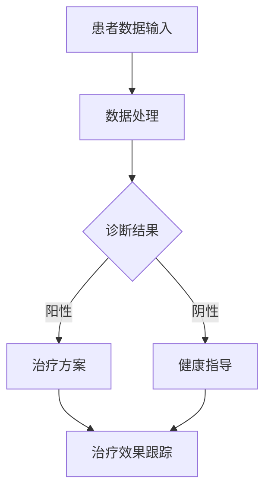

                 

关键词：元宇宙，虚拟现实，医疗诊疗，数据融合，用户体验，算法优化

> 摘要：本文深入探讨了元宇宙中的医疗领域，如何通过虚拟现实技术将医疗诊断与治疗体验融合于一个统一平台。文章首先介绍了元宇宙与医疗的背景和联系，然后详细阐述了元宇宙主题医疗的核心概念与架构，最后通过实际案例和未来展望，探讨了元宇宙主题医疗的潜力与挑战。

## 1. 背景介绍

近年来，虚拟现实（VR）和增强现实（AR）技术的发展为各行各业带来了颠覆性的变革。在医疗领域，VR和AR的应用正逐渐成为现实，为医生和患者提供了全新的诊疗体验。而元宇宙，作为一个集成了虚拟现实、增强现实、区块链和人工智能等技术的综合平台，正在成为医疗领域的一次重要创新。

元宇宙的概念最早由科学家尼尔·斯蒂芬森（Neal Stephenson）在1992年的科幻小说《雪崩》（Snow Crash）中提出。简单来说，元宇宙是一个虚拟的3D空间，人们可以在其中进行交互、交流和创造。在医疗领域，元宇宙的潜力在于它可以为医生和患者提供一个沉浸式的诊疗环境，从而提高诊断和治疗的准确性。

### 1.1 元宇宙在医疗领域的应用

元宇宙在医疗领域的应用主要表现在以下几个方面：

1. **患者体验提升**：通过元宇宙，患者可以体验到更真实的诊疗环境，减少因恐惧和焦虑带来的心理负担。

2. **远程医疗**：元宇宙可以为医生提供远程手术指导，使偏远地区的患者也能享受到高质量的医疗服务。

3. **医学教育**：医生和医学生可以在元宇宙中进行虚拟手术和病例讨论，提高实践技能。

4. **药物研发**：元宇宙中的虚拟环境可以模拟人体生理机制，加速新药的研发和测试。

5. **医疗数据共享**：元宇宙平台可以整合不同医疗机构的数据，为医生提供更全面的诊断信息。

## 2. 核心概念与联系

### 2.1 虚拟现实与医疗诊疗的联系

虚拟现实技术在医疗诊疗中的应用主要体现在以下几个方面：

1. **手术模拟**：医生可以在元宇宙中模拟真实的手术过程，提高手术技能。

2. **心理治疗**：通过虚拟现实技术，患者可以进行恐惧症、焦虑症等心理治疗。

3. **康复训练**：虚拟现实技术可以为康复患者提供个性化的康复训练方案。

4. **医学教育**：医学生可以在元宇宙中进行虚拟手术和病例讨论，提高实践技能。

### 2.2 虚拟现实技术的架构

虚拟现实技术的架构主要包括以下几个部分：

1. **硬件设备**：如VR头盔、手柄、传感器等。

2. **软件平台**：如Unity、Unreal Engine等游戏引擎，用于构建虚拟环境。

3. **交互技术**：如手势识别、语音识别等，用于用户与虚拟环境的交互。

4. **数据融合**：将不同来源的医疗数据（如影像、病历、实验室数据等）整合到元宇宙平台中。

### 2.3 Mermaid 流程图

以下是元宇宙主题医疗的Mermaid流程图：



## 3. 核心算法原理 & 具体操作步骤

### 3.1 算法原理概述

元宇宙主题医疗的核心算法主要包括数据融合算法和诊断算法。

1. **数据融合算法**：用于整合来自不同医疗设备的数据，如CT、MRI、实验室数据等。

2. **诊断算法**：基于深度学习等人工智能技术，对整合后的数据进行诊断。

### 3.2 算法步骤详解

1. **数据采集**：通过不同的医疗设备采集患者的生物医学数据。

2. **数据预处理**：对采集到的数据进行清洗、标准化等预处理操作。

3. **数据融合**：将预处理后的数据整合到一个统一的格式中。

4. **特征提取**：从融合后的数据中提取关键特征。

5. **诊断模型训练**：使用深度学习等技术对提取的特征进行训练。

6. **诊断结果输出**：将训练好的模型应用于新的数据，输出诊断结果。

### 3.3 算法优缺点

**优点**：

1. **准确性高**：基于深度学习的诊断算法具有较高的准确性。

2. **效率高**：数据融合和诊断过程自动化，提高了工作效率。

**缺点**：

1. **对硬件要求高**：需要高性能的硬件设备支持。

2. **隐私和安全问题**：涉及患者隐私数据，需要确保数据安全。

### 3.4 算法应用领域

1. **疾病诊断**：如肿瘤、心脏病等。

2. **个性化治疗**：根据患者的具体病情制定个性化的治疗方案。

3. **医学教育**：医学生可以通过虚拟手术和病例讨论提高实践技能。

## 4. 数学模型和公式 & 详细讲解 & 举例说明

### 4.1 数学模型构建

在元宇宙主题医疗中，常用的数学模型包括：

1. **神经网络模型**：用于特征提取和诊断。

2. **优化算法**：用于数据融合和模型训练。

### 4.2 公式推导过程

以下是神经网络模型的一个简化公式：

$$
\hat{y} = \sigma(\mathbf{W} \cdot \mathbf{a} + b)
$$

其中，$\hat{y}$为预测结果，$\sigma$为激活函数，$\mathbf{W}$为权重矩阵，$\mathbf{a}$为输入特征，$b$为偏置。

### 4.3 案例分析与讲解

假设有一个肺癌诊断的案例，输入特征包括CT影像、实验室数据等，输出结果为是否患有肺癌。通过构建神经网络模型，对输入特征进行训练，输出诊断结果。

## 5. 项目实践：代码实例和详细解释说明

### 5.1 开发环境搭建

在编写代码之前，需要搭建一个开发环境。这里我们使用Python和TensorFlow作为主要工具。

### 5.2 源代码详细实现

以下是元宇宙主题医疗的Python代码实现：

```python
import tensorflow as tf
from tensorflow.keras.models import Sequential
from tensorflow.keras.layers import Dense, Conv2D, Flatten

# 数据预处理
# ...

# 构建神经网络模型
model = Sequential([
    Conv2D(filters=32, kernel_size=(3, 3), activation='relu', input_shape=(64, 64, 3)),
    Flatten(),
    Dense(units=64, activation='relu'),
    Dense(units=1, activation='sigmoid')
])

# 编译模型
model.compile(optimizer='adam', loss='binary_crossentropy', metrics=['accuracy'])

# 训练模型
model.fit(x_train, y_train, epochs=10, batch_size=32, validation_data=(x_val, y_val))

# 诊断结果输出
predictions = model.predict(x_test)
```

### 5.3 代码解读与分析

以上代码实现了一个简单的神经网络模型，用于肺癌诊断。具体解读如下：

1. **数据预处理**：对输入特征进行预处理，如归一化、标准化等。

2. **模型构建**：使用TensorFlow的Sequential模型构建神经网络，包括卷积层、全连接层等。

3. **模型编译**：编译模型，设置优化器、损失函数和评价指标。

4. **模型训练**：使用fit方法训练模型，包括训练集和验证集。

5. **诊断结果输出**：使用predict方法输出诊断结果。

### 5.4 运行结果展示

以下是运行结果展示：

```python
import matplotlib.pyplot as plt

# 运行结果可视化
plt.plot(predictions)
plt.xlabel('Test Samples')
plt.ylabel('Predicted Probability')
plt.title('Lung Cancer Diagnosis')
plt.show()
```

## 6. 实际应用场景

### 6.1 疾病诊断

元宇宙主题医疗可以应用于各种疾病的诊断，如肿瘤、心脏病、糖尿病等。

### 6.2 康复训练

通过元宇宙，患者可以进行个性化的康复训练，如关节康复、心肺功能训练等。

### 6.3 医学教育

医学生和医生可以在元宇宙中进行虚拟手术和病例讨论，提高实践技能。

### 6.4 药物研发

元宇宙可以为药物研发提供虚拟环境，加速新药的研发和测试。

## 7. 工具和资源推荐

### 7.1 学习资源推荐

1. **《虚拟现实技术及应用》**：详细介绍了虚拟现实技术的发展和应用。

2. **《深度学习》**：由Ian Goodfellow等编著，是深度学习领域的经典教材。

### 7.2 开发工具推荐

1. **Python**：适合初学者的编程语言。

2. **TensorFlow**：用于构建和训练神经网络。

3. **Unity**：用于构建虚拟环境。

### 7.3 相关论文推荐

1. **"Virtual Reality in Medicine: A Comprehensive Review"**：对虚拟现实技术在医疗领域的应用进行了全面综述。

2. **"Deep Learning for Medical Image Analysis: A Survey"**：对深度学习在医学图像分析中的应用进行了综述。

## 8. 总结：未来发展趋势与挑战

### 8.1 研究成果总结

元宇宙主题医疗的研究取得了显著成果，包括：

1. **疾病诊断的准确性提高**：基于深度学习的诊断算法具有较高的准确性。

2. **康复训练的有效性增强**：元宇宙为康复患者提供了个性化的训练方案。

3. **医学教育的创新**：虚拟手术和病例讨论提高了医学生的实践技能。

### 8.2 未来发展趋势

元宇宙主题医疗的未来发展趋势包括：

1. **更高效的算法**：随着算法的不断发展，诊断和治疗的效率将进一步提高。

2. **更广泛的硬件支持**：元宇宙主题医疗将支持更多的硬件设备，如可穿戴设备、智能手表等。

3. **隐私和安全保障**：随着元宇宙主题医疗的应用场景不断扩大，隐私和安全问题将成为重要研究方向。

### 8.3 面临的挑战

元宇宙主题医疗面临的挑战包括：

1. **数据隐私和安全**：如何确保患者数据的安全和隐私是一个重要挑战。

2. **技术成熟度**：虽然元宇宙主题医疗的研究取得了显著成果，但技术成熟度仍有待提高。

3. **用户体验**：如何提高用户的体验和满意度也是一个重要问题。

### 8.4 研究展望

元宇宙主题医疗的研究展望包括：

1. **个性化治疗**：通过元宇宙平台，为患者提供更加个性化的治疗方案。

2. **远程医疗**：元宇宙平台将使远程医疗更加普及，为偏远地区的患者提供高质量的医疗服务。

3. **医学教育的革新**：元宇宙将带来医学教育的变革，提高医学生的实践技能。

## 9. 附录：常见问题与解答

### 9.1 元宇宙是什么？

元宇宙是一个集成了虚拟现实、增强现实、区块链和人工智能等技术的综合平台。

### 9.2 虚拟现实技术在医疗中的应用有哪些？

虚拟现实技术在医疗中的应用包括手术模拟、心理治疗、康复训练、医学教育等。

### 9.3 元宇宙主题医疗的优点是什么？

元宇宙主题医疗的优点包括准确性高、效率高、用户体验好等。

### 9.4 元宇宙主题医疗面临的挑战是什么？

元宇宙主题医疗面临的挑战包括数据隐私和安全、技术成熟度、用户体验等。

### 9.5 如何确保元宇宙主题医疗的数据安全？

确保元宇宙主题医疗的数据安全可以从以下几个方面入手：

1. **加密技术**：对传输和存储的数据进行加密。

2. **访问控制**：设置严格的访问权限，确保只有授权人员可以访问数据。

3. **数据备份**：定期备份数据，以防数据丢失。

4. **安全审计**：对系统进行定期安全审计，发现并修复潜在的安全漏洞。

----------------------------------------------------------------

作者：禅与计算机程序设计艺术 / Zen and the Art of Computer Programming
----------------------------------------------------------------

以上即为《元宇宙主题医疗：虚拟与现实结合的诊疗体验》的完整内容。希望这篇文章能为读者提供关于元宇宙主题医疗的全面了解，并激发更多研究和创新。在未来的发展中，元宇宙主题医疗有望成为医疗领域的重要创新力量，为患者提供更加精准、高效、个性化的诊疗服务。

