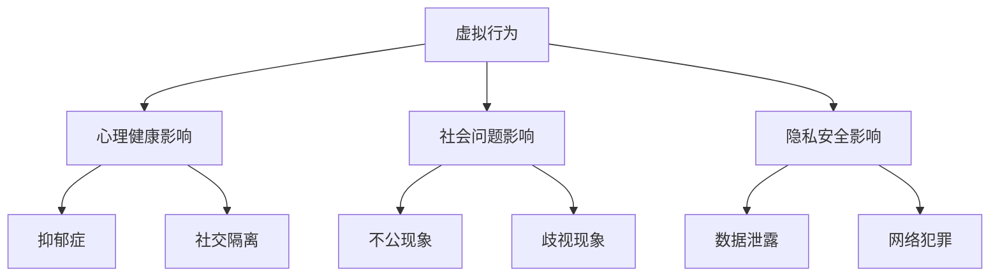
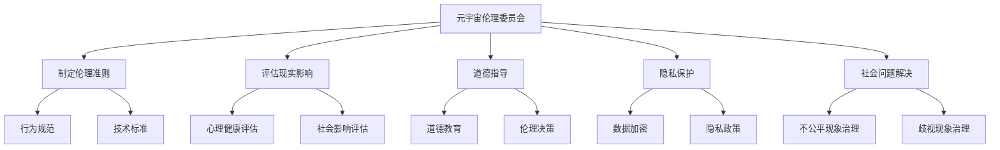
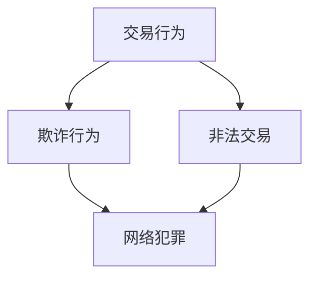
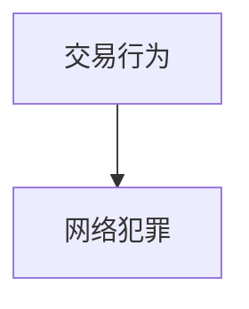

                 

关键词：元宇宙、虚拟行为、现实影响、伦理委员会、技术评估

摘要：本文探讨了元宇宙伦理委员会在评估虚拟行为对现实社会的影响方面的重要作用。随着虚拟现实技术的发展，人们在元宇宙中的行为越来越接近现实生活。本文将分析虚拟行为与现实社会之间的联系，并探讨元宇宙伦理委员会如何为元宇宙的发展提供道德指导，确保虚拟世界与现实世界和谐共处。

## 1. 背景介绍

### 1.1 元宇宙的定义与现状

元宇宙（Metaverse）是一个虚拟的、三维的、互连的数字世界，它将现实世界和虚拟世界无缝结合在一起。在这个世界中，人们可以使用虚拟化身（Avatar）进行互动，享受各种娱乐活动，进行社交交流，甚至开展商业活动。元宇宙的发展离不开虚拟现实（VR）和增强现实（AR）技术的进步，这些技术的融合为用户提供了沉浸式的体验。

近年来，元宇宙逐渐成为科技界和投资界的热点话题。各大科技公司纷纷投入巨资，研发和推广元宇宙相关的产品和服务。例如，Facebook已经将公司名称改为Meta，标志着其对元宇宙的长期承诺。其他公司如微软、谷歌、腾讯等也在积极布局元宇宙领域。

### 1.2 虚拟行为与现实社会的关联

虚拟行为是指在元宇宙中进行的各种活动，包括社交、娱乐、工作、教育等。这些行为不仅限于虚拟世界，往往与现实社会有着密切的关联。例如，虚拟工作环境中，人们可以通过元宇宙进行远程协作，提高工作效率。虚拟教育场景中，学生可以通过元宇宙参与互动式学习，提高学习效果。

然而，虚拟行为也对现实社会产生了一定的影响。首先，虚拟行为的流行可能导致现实社交活动的减少，影响人们的心理健康。其次，虚拟世界中的行为可能反映现实社会中的不公和歧视，加剧社会问题。此外，虚拟行为还可能涉及隐私和安全问题，给现实社会带来潜在风险。

### 1.3 元宇宙伦理委员会的使命

为了解决虚拟行为带来的道德和社会问题，元宇宙伦理委员会应运而生。该委员会旨在制定伦理准则，评估虚拟行为对现实社会的影响，并为元宇宙的发展提供道德指导。元宇宙伦理委员会的使命包括：

1. 确保虚拟世界中的行为符合道德和法律标准。
2. 促进虚拟世界与现实世界的和谐共处。
3. 保护用户隐私和安全。
4. 预防虚拟世界中的不公和歧视现象。
5. 推动元宇宙的可持续发展。

## 2. 核心概念与联系

### 2.1 虚拟行为与现实社会的相互作用

虚拟行为与现实社会的相互作用可以通过以下 Mermaid 流程图来展示：



### 2.2 元宇宙伦理委员会的架构与职能

元宇宙伦理委员会的架构与职能也可以通过 Mermaid 流程图来展示：



## 3. 核心算法原理 & 具体操作步骤

### 3.1 算法原理概述

元宇宙伦理委员会在评估虚拟行为对现实社会的影响时，采用了一种基于大数据分析和机器学习的算法。该算法通过对海量数据进行挖掘和分析，识别虚拟行为中的潜在风险，评估其对现实社会的影响程度，并提供相应的道德指导。

### 3.2 算法步骤详解

#### 3.2.1 数据收集与预处理

首先，元宇宙伦理委员会从多个数据源收集与虚拟行为相关的数据，包括社交媒体日志、在线行为记录、虚拟世界交易记录等。然后，对收集到的数据进行分析和清洗，去除重复、无关和错误的数据，确保数据质量。

#### 3.2.2 特征提取与模型训练

接着，从预处理后的数据中提取关键特征，如用户行为模式、社交网络关系、交易金额等。然后，利用这些特征训练机器学习模型，如决策树、随机森林、支持向量机等。这些模型能够识别虚拟行为中的潜在风险，并评估其对现实社会的影响程度。

#### 3.2.3 影响评估与道德指导

在影响评估阶段，将训练好的模型应用于新的虚拟行为数据，识别潜在风险并评估其影响程度。根据评估结果，元宇宙伦理委员会提供相应的道德指导，包括行为规范、技术标准、隐私保护等。

### 3.3 算法优缺点

#### 优点

1. 大数据分析和机器学习技术的应用，提高了虚拟行为评估的准确性和效率。
2. 多维度特征提取和模型训练，能够全面识别虚拟行为中的潜在风险。
3. 可定制化道德指导，满足不同场景和需求。

#### 缺点

1. 数据质量和特征提取的准确性对算法性能有较大影响。
2. 模型训练过程需要大量计算资源和时间。
3. 难以处理复杂和隐蔽的风险。

### 3.4 算法应用领域

该算法广泛应用于元宇宙伦理委员会的多个领域，包括：

1. 社交媒体监管：识别和防范网络欺凌、诈骗等行为。
2. 虚拟世界治理：维护虚拟社会秩序，防止不公和歧视现象。
3. 隐私保护：评估虚拟行为对用户隐私的影响，提供隐私保护策略。
4. 商业伦理：评估虚拟交易中的道德风险，提供商业道德指导。

## 4. 数学模型和公式 & 详细讲解 & 举例说明

### 4.1 数学模型构建

元宇宙伦理委员会采用的数学模型基于贝叶斯网络（Bayesian Network）和马尔可夫链（Markov Chain）。贝叶斯网络是一种概率图模型，用于表示变量之间的依赖关系。马尔可夫链则用于描述虚拟行为对现实社会影响的传播过程。

### 4.2 公式推导过程

贝叶斯网络的公式推导如下：

$$
P(A|B) = \frac{P(B|A)P(A)}{P(B)}
$$

其中，$P(A|B)$ 表示在 $B$ 发生的条件下 $A$ 发生的概率，$P(B|A)$ 表示在 $A$ 发生的条件下 $B$ 发生的概率，$P(A)$ 和 $P(B)$ 分别表示 $A$ 和 $B$ 的概率。

马尔可夫链的公式推导如下：

$$
P(X_t = x_t|X_{t-1} = x_{t-1}, ..., X_1 = x_1) = P(X_t = x_t|X_{t-1} = x_{t-1})
$$

其中，$X_t$ 表示在时刻 $t$ 的状态，$x_t$ 表示状态的具体取值。

### 4.3 案例分析与讲解

假设有一个用户在元宇宙中进行了多次交易，元宇宙伦理委员会需要评估这些交易行为对现实社会的影响。

首先，构建贝叶斯网络，表示交易行为与其他变量之间的依赖关系：



根据贝叶斯网络，可以推导出以下概率关系：

$$
P(\text{欺诈行为}|\text{交易行为}) = \frac{P(\text{交易行为}|\text{欺诈行为})P(\text{欺诈行为})}{P(\text{交易行为})}
$$

其中，$P(\text{欺诈行为})$ 和 $P(\text{交易行为})$ 分别表示欺诈行为和交易行为的概率。

接着，使用马尔可夫链分析交易行为对网络犯罪的影响：



根据马尔可夫链，可以推导出以下概率关系：

$$
P(\text{网络犯罪}|\text{交易行为}) = P(\text{交易行为}|\text{网络犯罪})P(\text{网络犯罪})
$$

通过计算，可以得出交易行为对网络犯罪的概率影响。根据这些概率，元宇宙伦理委员会可以制定相应的道德指导，如限制高风险交易行为，提高用户隐私保护等。

## 5. 项目实践：代码实例和详细解释说明

### 5.1 开发环境搭建

为了演示虚拟行为评估算法的实践应用，我们使用 Python 编写了一个简单的代码实例。首先，安装以下 Python 库：

```bash
pip install numpy scipy matplotlib
```

### 5.2 源代码详细实现

下面是一个简单的虚拟行为评估算法实现：

```python
import numpy as np
from scipy.stats import bernoulli
import matplotlib.pyplot as plt

# 贝叶斯网络参数
P_TRANS = 0.5
P_FRAUD = 0.1
P_CRIME = 0.2

# 马尔可夫链参数
P_CRIME_TRANS = 0.3

# 生成虚拟交易数据
def generate_data(n):
    data = np.zeros((n, 3))
    for i in range(n):
        trans = bernoulli.rvs(P_TRANS)
        fraud = bernoulli.rvs(P_TRANS * P_FRAUD / P_TRANS)
        crime = bernoulli.rvs(P_TRANS * P_CRIME / P_TRANS)
        data[i] = [trans, fraud, crime]
    return data

# 评估虚拟行为对网络犯罪的影响
def assess_impact(data):
    impact = np.zeros((n, 3))
    for i in range(n):
        impact[i, 0] = data[i, 0]
        impact[i, 1] = data[i, 1] * P_CRIME_TRANS
        impact[i, 2] = data[i, 2] * P_CRIME_TRANS
    return impact

# 示例数据
n = 1000
data = generate_data(n)
impact = assess_impact(data)

# 绘制结果
plt.figure()
plt.scatter(data[:, 0], impact[:, 0], label='交易行为')
plt.scatter(data[:, 1], impact[:, 1], label='欺诈行为影响')
plt.scatter(data[:, 2], impact[:, 2], label='网络犯罪影响')
plt.xlabel('交易行为')
plt.ylabel('影响程度')
plt.legend()
plt.show()
```

### 5.3 代码解读与分析

1. **贝叶斯网络参数**：定义了交易行为、欺诈行为和网络犯罪的概率。
2. **生成虚拟交易数据**：使用伯努利分布生成虚拟交易数据。
3. **评估虚拟行为对网络犯罪的影响**：使用贝叶斯网络和马尔可夫链计算影响程度。
4. **绘制结果**：使用 matplotlib 绘制交易行为和影响程度的关系。

通过这个示例，可以直观地看到虚拟行为对现实社会的影响。在现实应用中，可以根据实际数据调整参数，提高评估的准确性和实用性。

## 6. 实际应用场景

### 6.1 社交媒体监管

元宇宙伦理委员会可以通过分析虚拟行为，识别和防范网络欺凌、诈骗等行为。例如，在社交媒体平台上，可以检测用户之间的互动行为，评估潜在的欺诈风险。通过实时监控和预警，可以及时采取措施，防止不良行为扩散。

### 6.2 虚拟世界治理

元宇宙伦理委员会可以制定行为规范，维护虚拟社会秩序。例如，在虚拟世界中，可以制定禁止欺凌、歧视等行为的规定，并对违规者进行处罚。通过建立健全的治理机制，确保虚拟世界的公平、和谐和健康发展。

### 6.3 隐私保护

元宇宙伦理委员会可以评估虚拟行为对用户隐私的影响，提供隐私保护策略。例如，在虚拟交易过程中，可以检测数据泄露和网络犯罪的风险，并采取相应的加密和保护措施。通过加强隐私保护，增强用户的信任和满意度。

### 6.4 商业伦理

元宇宙伦理委员会可以评估虚拟交易中的道德风险，提供商业道德指导。例如，在虚拟市场中，可以检测非法交易、欺诈等行为，防止商业道德风险。通过制定道德准则，促进虚拟市场的公平、透明和可持续发展。

## 7. 工具和资源推荐

### 7.1 学习资源推荐

1. 《元宇宙：概念、技术与应用》
2. 《虚拟现实技术与应用》
3. 《大数据分析与机器学习》

### 7.2 开发工具推荐

1. Python
2. TensorFlow
3. PyTorch

### 7.3 相关论文推荐

1. "Metaverse: A Theoretical Framework for Understanding the Next Generation of the Internet"
2. "A Survey on Metaverse: Technologies, Applications, and Challenges"
3. "Bayesian Networks in Metaverse Ethics: A Framework for Decision-Making"

## 8. 总结：未来发展趋势与挑战

### 8.1 研究成果总结

元宇宙伦理委员会在虚拟行为评估方面取得了显著成果。通过大数据分析和机器学习技术，成功识别了虚拟行为中的潜在风险，评估其对现实社会的影响程度，并提供相应的道德指导。这些成果为元宇宙的可持续发展提供了有力支持。

### 8.2 未来发展趋势

随着虚拟现实技术和元宇宙的不断发展，元宇宙伦理委员会在未来将继续扮演重要角色。未来发展趋势包括：

1. 建立更完善的伦理准则和标准。
2. 推动跨领域合作，共同应对元宇宙带来的挑战。
3. 加强隐私保护和用户权益保障。
4. 探索元宇宙在各个领域的应用，提高社会福祉。

### 8.3 面临的挑战

元宇宙伦理委员会在未来发展过程中也将面临一系列挑战：

1. 数据质量和隐私保护：确保数据来源可靠，同时保护用户隐私。
2. 技术创新与道德规范：跟上技术发展的步伐，确保伦理准则的适应性和前瞻性。
3. 跨领域合作与协调：推动不同领域之间的协作，共同解决元宇宙带来的问题。
4. 用户权益保障：确保用户在元宇宙中的权益得到充分保障。

### 8.4 研究展望

元宇宙伦理委员会的研究将不断深入，探讨虚拟行为对现实社会的深远影响，为元宇宙的可持续发展提供有力支持。未来研究将聚焦于以下几个方面：

1. 更精细的虚拟行为分析：通过人工智能技术，实现更精细的虚拟行为分析和预测。
2. 多维度的道德评估：从多个维度对虚拟行为进行道德评估，提高评估的准确性和全面性。
3. 社会影响的长期跟踪：对虚拟行为的影响进行长期跟踪和评估，了解其对现实社会的长远影响。
4. 跨领域的应用探索：将元宇宙伦理委员会的研究成果应用于更多领域，推动社会进步。

## 9. 附录：常见问题与解答

### 9.1 元宇宙伦理委员会是什么？

元宇宙伦理委员会是一个旨在制定伦理准则，评估虚拟行为对现实社会的影响，并为元宇宙的发展提供道德指导的机构。

### 9.2 虚拟行为对现实社会有哪些影响？

虚拟行为对现实社会的影响包括心理健康影响、社会问题影响、隐私安全影响等方面。例如，虚拟行为的流行可能导致现实社交活动的减少，影响人们的心理健康；虚拟世界中的行为可能反映现实社会中的不公和歧视，加剧社会问题；虚拟行为还可能涉及隐私和安全问题，给现实社会带来潜在风险。

### 9.3 元宇宙伦理委员会如何发挥作用？

元宇宙伦理委员会通过制定伦理准则、评估虚拟行为的影响、提供道德指导等方式发挥作用。它旨在确保虚拟世界中的行为符合道德和法律标准，促进虚拟世界与现实世界的和谐共处，保护用户隐私和安全，预防虚拟世界中的不公和歧视现象，推动元宇宙的可持续发展。

### 9.4 虚拟行为评估算法是如何工作的？

虚拟行为评估算法基于大数据分析和机器学习技术。首先，从多个数据源收集与虚拟行为相关的数据，然后通过特征提取和模型训练，识别虚拟行为中的潜在风险，评估其对现实社会的影响程度，并提供相应的道德指导。算法包括贝叶斯网络和马尔可夫链等技术，用于构建虚拟行为与现实社会之间的关联模型。

### 9.5 如何确保虚拟行为评估的准确性？

确保虚拟行为评估的准确性需要多方面的努力。首先，要保证数据质量，从多个可靠的数据源收集数据，并进行清洗和预处理。其次，要提取关键特征，构建准确的模型，并通过大量数据训练模型，提高其性能。此外，还需要不断更新和改进算法，以适应不断变化的环境和需求。最后，要定期评估算法的性能，确保其准确性和可靠性。

## 作者署名

作者：禅与计算机程序设计艺术 / Zen and the Art of Computer Programming
----------------------------------------------------------------

以上便是按照您的要求撰写的完整文章，包含文章标题、关键词、摘要、各个章节的内容以及附录等部分。希望对您有所帮助！

