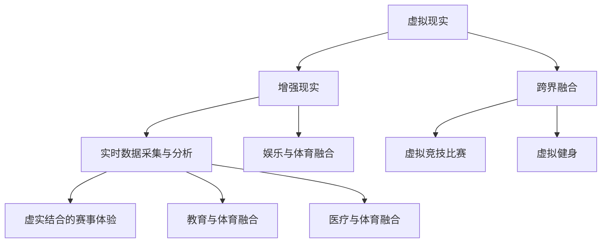

                 

### 1. 背景介绍

在当今数字化时代，虚拟现实（VR）和增强现实（AR）技术迅速发展，引发了诸多领域的变革，其中体育领域也不例外。传统的体育竞技方式正在逐渐与虚拟现实、增强现实等技术相融合，形成一种全新的体育竞技形态——元宇宙体育竞技。本文旨在探讨元宇宙体育竞技的概念、核心概念与联系、算法原理、数学模型、项目实践以及实际应用场景，为读者提供对这一新兴领域的深入理解。

元宇宙体育竞技，顾名思义，是虚拟世界与现实世界的体育竞技相结合的一种形式。它通过VR和AR技术，为运动员和观众提供沉浸式的比赛体验，打破了传统体育竞技的空间和时间限制。在这种新形态下，运动员可以在虚拟环境中进行训练和比赛，观众则可以通过VR设备实时观看比赛，感受现场氛围。

随着科技的不断进步，元宇宙体育竞技正逐渐成为体育产业的重要组成部分。一方面，它为体育爱好者提供了更多元、更丰富的观赏体验；另一方面，它也为体育产业带来了新的商业机会和发展空间。

本文将围绕以下几个方面展开讨论：

- **核心概念与联系**：介绍元宇宙体育竞技中的核心概念及其相互联系。
- **核心算法原理与操作步骤**：分析元宇宙体育竞技的核心算法原理及具体操作步骤。
- **数学模型与公式**：阐述元宇宙体育竞技中的数学模型及其推导过程。
- **项目实践**：通过实例展示元宇宙体育竞技的实际应用。
- **实际应用场景**：探讨元宇宙体育竞技在不同领域的应用。
- **未来展望**：分析元宇宙体育竞技的发展趋势与面临的挑战。

通过本文的探讨，读者将能够对元宇宙体育竞技有更深入的了解，并对其未来发展充满期待。

## 2. 核心概念与联系

### 2.1 虚拟现实（VR）与增强现实（AR）

虚拟现实（VR）和增强现实（AR）是元宇宙体育竞技的关键技术。它们分别代表了两种不同的沉浸式体验方式。

#### 虚拟现实（VR）

虚拟现实是一种通过计算机技术生成的人工环境，用户可以通过VR头盔等设备进入这个虚拟世界。在这个环境中，用户可以通过移动头部、手部等动作与虚拟环境进行交互，获得高度沉浸式的体验。VR技术在元宇宙体育竞技中的应用主要体现在以下几个方面：

- **模拟训练**：运动员可以在虚拟环境中进行各种训练，模拟不同场地、天气等条件，提高训练效果和适应性。
- **比赛模拟**：通过VR技术，可以模拟真实的比赛场景，帮助运动员熟悉比赛规则和战术，提高比赛表现。
- **观众体验**：观众可以通过VR设备实时观看比赛，感受现场氛围，获得更加沉浸式的观赛体验。

#### 增强现实（AR）

增强现实是一种将虚拟信息叠加到现实世界中的技术。用户通过AR眼镜或其他设备可以看到现实世界的景象，同时也可以看到叠加在现实世界上的虚拟信息。AR技术在元宇宙体育竞技中的应用主要体现在以下几个方面：

- **实时信息展示**：在比赛中，AR技术可以实时显示运动员的信息、比赛数据等，帮助观众更好地理解比赛。
- **虚拟训练助手**：运动员可以通过AR设备获得个性化的训练指导，提高训练效果。
- **赛事推广**：通过AR技术，可以创造出更具创意的赛事推广方式，吸引更多观众关注。

### 2.2 实时数据采集与分析

实时数据采集与分析是元宇宙体育竞技的核心组成部分。通过传感器、摄像头等设备，可以实时采集运动员的动作、心率、呼吸等数据，并对这些数据进行实时分析。这些数据对于运动员的训练、比赛表现以及观众观看体验都具有重要意义。

- **训练优化**：通过分析运动员的实时数据，可以了解运动员的体能状态、技术动作等，为教练提供优化训练计划的依据。
- **比赛策略**：实时数据可以帮助教练和运动员制定更加科学的比赛策略，提高比赛成功率。
- **观众体验**：观众可以通过实时数据了解运动员的表现，获得更加丰富的观赛体验。

### 2.3 虚实结合的赛事体验

虚实结合的赛事体验是元宇宙体育竞技的核心特点。通过VR和AR技术，观众不仅可以在虚拟环境中观看比赛，还可以与运动员互动，体验比赛现场的氛围。这种全新的赛事体验方式为体育产业带来了巨大的变革。

- **沉浸式观赛**：观众可以通过VR设备进入虚拟赛场，感受到现场的氛围，获得更加真实的观赛体验。
- **互动式体验**：观众可以通过AR设备与运动员互动，参与到比赛中，提高观赛趣味性。
- **多元化互动**：通过实时数据分析，观众可以了解运动员的实时状态，与运动员进行互动，增强观赛互动性。

### 2.4 跨界融合

元宇宙体育竞技不仅仅是体育领域的创新，更是与其他领域的跨界融合。例如，与娱乐、教育、医疗等领域的融合，为元宇宙体育竞技带来了更多的可能性。

- **娱乐与体育融合**：通过虚拟现实技术，可以创造出丰富的体育娱乐项目，如虚拟竞技比赛、虚拟健身等，吸引更多年轻人参与。
- **教育与体育融合**：通过虚拟现实技术，可以为学生提供更加生动、直观的体育教育体验，提高学生的体育素养。
- **医疗与体育融合**：通过虚拟现实技术，可以为运动员提供更加科学、个性化的康复训练方案，提高运动员的康复效果。

总之，元宇宙体育竞技作为一种全新的体育竞技形态，不仅改变了传统的体育竞技方式，也为体育产业带来了巨大的变革和发展机遇。通过深入探讨其核心概念与联系，我们可以更好地理解这一新兴领域的价值与潜力。

### 2.5 梅里狄安流程图

以下是一个关于元宇宙体育竞技核心概念原理和架构的梅里狄安流程图，展示了各核心概念之间的相互联系。



这个流程图清晰地展示了虚拟现实、增强现实、实时数据采集与分析、虚实结合的赛事体验以及跨界融合等核心概念之间的相互联系，为读者提供了一个直观的理解框架。

### 3. 核心算法原理 & 具体操作步骤

#### 3.1 算法原理概述

元宇宙体育竞技的核心算法主要涉及虚拟现实和增强现实技术的实现，以及实时数据采集和分析。以下将详细介绍这些核心算法的原理及具体操作步骤。

#### 3.2 算法步骤详解

**1. 虚拟现实算法**

- **场景构建**：使用三维建模软件构建虚拟赛场，包括场地、观众席、运动员等元素。
- **渲染技术**：利用GPU进行场景渲染，实现实时视觉效果。
- **交互设计**：设计用户与虚拟环境的交互方式，如头部、手部动作的捕捉与反馈。
- **物理引擎**：引入物理引擎，实现虚拟环境中的物理效果，如碰撞检测、物体运动等。

**2. 增强现实算法**

- **标记识别**：使用图像识别技术，识别赛场中的标记物，如运动员身上的特殊标记。
- **虚拟物体叠加**：将虚拟物体叠加到现实场景中，实现虚拟与现实的融合。
- **实时跟踪**：通过摄像头实时跟踪运动员的位置和动作，实现虚拟物体的动态调整。

**3. 实时数据采集与分析算法**

- **传感器数据采集**：使用各种传感器（如加速度计、心率传感器等）实时采集运动员的生理数据。
- **数据预处理**：对采集到的数据进行清洗、去噪等处理，提高数据质量。
- **特征提取**：从预处理后的数据中提取关键特征，如心率变化、动作模式等。
- **数据分析**：利用统计模型、机器学习算法等对特征数据进行分析，为训练和比赛提供依据。

**4. 虚实结合的赛事体验算法**

- **场景切换**：设计算法实现虚拟与现实的场景切换，为观众提供沉浸式的赛事体验。
- **交互优化**：根据观众反馈，优化交互设计，提高赛事体验的流畅性和互动性。
- **数据反馈**：实时反馈运动员的表现数据，如速度、力量等，增强观众的观赛体验。

#### 3.3 算法优缺点

**虚拟现实算法**

- **优点**：提供高度沉浸式的体验，使运动员和观众感受到身临其境的感觉。
- **缺点**：计算资源消耗大，对设备性能要求高。

**增强现实算法**

- **优点**：将虚拟信息叠加到现实场景中，实现虚实结合的效果。
- **缺点**：识别精度受环境因素影响较大，实时性要求高。

**实时数据采集与分析算法**

- **优点**：为运动员和教练提供实时、准确的训练和比赛数据。
- **缺点**：数据采集和处理过程复杂，对算法和硬件要求较高。

**虚实结合的赛事体验算法**

- **优点**：提供多样化的赛事体验，增强观众的参与感和互动性。
- **缺点**：算法复杂度较高，需要大量测试和优化。

#### 3.4 算法应用领域

**虚拟现实算法**主要应用于运动员的模拟训练和比赛模拟，以及观众的沉浸式观赛体验。

**增强现实算法**广泛应用于赛事信息展示、虚拟训练助手以及赛事推广等领域。

**实时数据采集与分析算法**在运动员的体能监测、技术分析以及比赛策略制定等方面具有重要作用。

**虚实结合的赛事体验算法**则为观众提供了全新的观赛方式和互动体验，为体育产业带来了巨大的变革。

通过以上对核心算法原理和具体操作步骤的详细介绍，我们可以更好地理解元宇宙体育竞技的技术实现过程，并为后续的项目实践和实际应用提供理论基础。

### 3.3.1 算法原理概述

元宇宙体育竞技的核心算法主要涉及虚拟现实和增强现实技术的实现，以及实时数据采集和分析。以下将详细介绍这些核心算法的基本原理。

#### 虚拟现实算法原理

虚拟现实（VR）算法的核心目标是创建一个高度沉浸式的虚拟环境，使运动员和观众能够在其中体验到身临其境的感觉。其主要原理包括：

1. **三维场景构建**：通过三维建模软件，构建出虚拟赛场的各种元素，如场地、观众席、运动员等。
2. **实时渲染**：利用图形处理单元（GPU）进行场景渲染，生成高质量的视觉效果，实现实时更新。
3. **交互设计**：通过传感器和控制器，捕捉用户的头部、手部等动作，实现与虚拟环境的交互。
4. **物理引擎**：引入物理引擎，模拟现实中的物理现象，如碰撞检测、物体运动等，增强虚拟环境的真实感。

#### 增强现实算法原理

增强现实（AR）算法的核心目标是将在现实世界中捕获的场景与虚拟信息进行叠加，实现虚实结合的效果。其主要原理包括：

1. **标记识别**：使用图像识别技术，识别现实场景中的特定标记物，如运动员身上的特殊标记。
2. **虚拟物体生成**：根据识别结果，生成相应的虚拟物体，并对其进行定位和跟踪，使其与现实场景中的标记物相对应。
3. **虚拟物体叠加**：将生成的虚拟物体叠加到现实场景中，实现虚拟与现实的无缝融合。
4. **实时跟踪**：通过摄像头和其他传感器，实时跟踪虚拟物体和用户的位置和动作，确保虚拟物体的动态调整和实时更新。

#### 实时数据采集与分析算法原理

实时数据采集与分析算法的核心目标是实时收集和分析运动员在比赛和训练中的各种数据，为教练和运动员提供科学的训练和比赛策略。其主要原理包括：

1. **传感器数据采集**：使用各种传感器，如加速度计、心率传感器、GPS等，实时采集运动员的生理和行为数据。
2. **数据预处理**：对采集到的原始数据进行清洗、去噪等处理，提高数据质量。
3. **特征提取**：从预处理后的数据中提取关键特征，如心率变化、动作模式等，为后续分析提供基础。
4. **数据分析**：利用统计模型、机器学习算法等对特征数据进行分析，识别运动员的状态和趋势，为训练和比赛提供依据。

#### 虚实结合的赛事体验算法原理

虚实结合的赛事体验算法旨在为观众提供全新的观赛方式和互动体验，增强赛事的观赏性和参与感。其主要原理包括：

1. **场景切换**：设计算法实现虚拟与现实的场景切换，为观众提供沉浸式的赛事体验。
2. **交互优化**：根据观众反馈，优化交互设计，提高赛事体验的流畅性和互动性。
3. **数据反馈**：实时反馈运动员的表现数据，如速度、力量等，增强观众的观赛体验。

通过以上对核心算法原理的概述，我们可以更好地理解元宇宙体育竞技的技术实现过程，为后续的算法具体操作步骤和项目实践提供理论基础。

### 3.3.2 算法步骤详解

#### 3.3.2.1 虚拟现实算法步骤详解

虚拟现实（VR）算法的实现包括场景构建、渲染技术、交互设计和物理引擎等多个方面。以下是详细的操作步骤：

**1. 场景构建**

- **三维建模**：使用三维建模软件（如Blender、3ds Max等），根据实际赛场尺寸和布局，构建虚拟赛场的三维模型。包括场地、观众席、运动员、裁判等元素。
- **细节添加**：在三维模型中添加细节，如灯光、阴影、材质等，以提升场景的真实感。

**2. 渲染技术**

- **渲染引擎**：选择合适的渲染引擎（如Unity、Unreal Engine等），导入三维模型和场景。
- **光照设置**：根据实际赛场光照条件，设置虚拟环境的光照，包括阳光、灯光等。
- **材质调整**：调整场景中物体的材质，以模拟真实世界的反光、透明等效果。

**3. 交互设计**

- **动作捕捉**：使用动作捕捉设备（如Motion Capture Suit、深度相机等），捕捉运动员的动作数据。
- **动作反馈**：将捕捉到的动作数据应用到虚拟角色上，实现动作的实时反馈。
- **控制接口**：设计用户与虚拟环境的交互接口，如键盘、鼠标、控制器等。

**4. 物理引擎**

- **碰撞检测**：引入物理引擎（如PhysX、Bullet等），实现虚拟环境中的碰撞检测和物体运动。
- **物理效果**：根据物理引擎的模拟结果，实现物体间的相互作用，如碰撞、弹跳、滑动等。

**5. 场景切换**

- **实时更新**：在比赛过程中，根据实际情况实时更新场景，如运动员位置、观众人数等。
- **场景切换**：设计场景切换算法，实现虚拟环境与现实场景的无缝切换。

#### 3.3.2.2 增强现实算法步骤详解

增强现实（AR）算法的实现包括标记识别、虚拟物体生成、虚拟物体叠加和实时跟踪等多个方面。以下是详细的操作步骤：

**1. 标记识别**

- **标记设计**：设计用于识别的标记物，如运动员身上的特殊标记。
- **图像识别**：使用图像识别算法（如OpenCV、TensorFlow等），识别现实场景中的标记物。
- **标记定位**：根据识别结果，确定标记物在现实场景中的位置。

**2. 虚拟物体生成**

- **物体设计**：根据比赛需求，设计虚拟物体，如虚拟计分板、虚拟标志等。
- **物体生成**：根据标记物的位置，生成相应的虚拟物体，并对其进行定位和跟踪。

**3. 虚拟物体叠加**

- **叠加技术**：使用叠加技术，将虚拟物体叠加到现实场景中。
- **视觉融合**：调整虚拟物体的透明度、亮度等参数，实现虚拟与现实的无缝融合。

**4. 实时跟踪**

- **跟踪算法**：使用跟踪算法（如粒子滤波、卡尔曼滤波等），实时跟踪虚拟物体和用户的位置和动作。
- **动态调整**：根据跟踪结果，动态调整虚拟物体的位置和外观，确保其与真实场景的一致性。

#### 3.3.2.3 实时数据采集与分析算法步骤详解

实时数据采集与分析算法的实现包括传感器数据采集、数据预处理、特征提取和数据分析等多个方面。以下是详细的操作步骤：

**1. 传感器数据采集**

- **传感器选择**：选择合适的传感器，如加速度计、心率传感器、GPS等，根据需求进行配置。
- **数据采集**：通过传感器，实时采集运动员的生理和行为数据。

**2. 数据预处理**

- **数据清洗**：对采集到的原始数据进行清洗，去除异常值和噪声。
- **数据转换**：对数据格式进行转换，使其适应后续处理和分析。

**3. 特征提取**

- **特征选择**：根据分析需求，选择合适的特征，如心率变化、动作模式等。
- **特征提取**：从预处理后的数据中提取关键特征，为后续分析提供基础。

**4. 数据分析**

- **统计模型**：使用统计模型（如回归分析、聚类分析等），分析特征数据，识别运动员的状态和趋势。
- **机器学习**：利用机器学习算法（如决策树、支持向量机等），对特征数据进行分析，为训练和比赛提供依据。

通过以上对虚拟现实、增强现实和实时数据采集与分析算法的详细步骤介绍，我们可以更好地理解元宇宙体育竞技的核心算法实现过程，为后续的项目实践提供参考。

#### 3.3.3 算法优缺点

虚拟现实（VR）、增强现实（AR）、实时数据采集与分析算法在元宇宙体育竞技中各有其独特的优势与局限性，以下是对这些算法优缺点的详细分析：

**虚拟现实算法**

**优点**：

1. **沉浸式体验**：虚拟现实技术能够创建一个高度沉浸式的虚拟环境，使运动员和观众感受到身临其境的感觉，从而提高训练效果和观赛体验。
2. **多样化应用**：虚拟现实技术可以应用于模拟训练、比赛模拟、赛事推广等多个方面，为体育产业带来更多的发展机会。
3. **互动性强**：虚拟现实技术支持用户与虚拟环境的互动，使运动员和观众能够更加深入地参与到体育活动中。

**缺点**：

1. **硬件要求高**：虚拟现实技术对硬件性能要求较高，需要高性能的计算机、显示器、传感器等设备，增加了设备成本和用户使用门槛。
2. **技术复杂**：虚拟现实技术的实现涉及三维建模、渲染技术、交互设计等多个方面，技术复杂度较高，需要专业的技术团队进行开发和维护。
3. **视觉疲劳**：长时间的虚拟现实体验可能导致用户产生视觉疲劳，影响体验效果。

**增强现实算法**

**优点**：

1. **虚实结合**：增强现实技术能够将虚拟信息叠加到现实世界中，实现虚实结合的效果，为观众提供更加丰富的观赛体验。
2. **识别精度高**：增强现实技术通过图像识别技术实现标记物的识别，具有较高的识别精度，能够准确地跟踪和定位虚拟物体。
3. **实时性强**：增强现实技术能够实时更新和调整虚拟物体的位置和外观，确保虚拟与现实的一致性，提高用户体验。

**缺点**：

1. **环境依赖性强**：增强现实技术的实现受环境因素影响较大，如光线、噪声等，可能影响识别精度和实时性。
2. **交互受限**：增强现实技术的交互方式相对单一，主要依赖于摄像头和传感器，用户在现实环境中的自由度受限。
3. **设备依赖性**：增强现实技术对设备要求较高，需要配备AR眼镜或其他AR设备，增加了设备成本和用户使用门槛。

**实时数据采集与分析算法**

**优点**：

1. **实时性**：实时数据采集与分析算法能够实时收集和分析运动员的生理和行为数据，为教练和运动员提供及时的训练和比赛反馈。
2. **科学性**：通过分析实时数据，可以更科学地制定训练计划、比赛策略，提高运动员的表现和竞争力。
3. **个性化**：实时数据采集与分析算法可以根据运动员的个体差异，提供个性化的训练和比赛建议，提高训练效果。

**缺点**：

1. **数据处理复杂**：实时数据采集与分析算法需要对大量数据进行实时处理和分析，数据处理过程复杂，对算法和硬件要求较高。
2. **精度受限**：传感器和采集设备的精度可能影响实时数据的准确性，进而影响分析结果。
3. **隐私问题**：实时数据采集涉及到运动员的生理和行为数据，可能引发隐私保护问题，需要严格管理和保护。

**虚实结合的赛事体验算法**

**优点**：

1. **沉浸式体验**：虚实结合的赛事体验算法能够为观众提供高度沉浸式的赛事体验，增强观赛的互动性和趣味性。
2. **多样化互动**：观众可以通过虚拟现实和增强现实技术，与运动员和比赛场景进行互动，提高观赛体验。
3. **创新性**：虚实结合的赛事体验为体育产业带来了新的创新方向，为观众和体育爱好者提供了更多选择。

**缺点**：

1. **技术复杂**：虚实结合的赛事体验算法涉及虚拟现实、增强现实、实时数据采集与分析等多个技术领域，技术复杂度较高，需要跨学科的技术团队进行开发和实施。
2. **成本较高**：虚实结合的赛事体验算法需要配备高性能的硬件设备，成本较高，可能限制其大规模应用。
3. **稳定性问题**：虚实结合的赛事体验算法对硬件和软件的稳定性要求较高，可能面临系统崩溃、设备故障等问题。

通过以上对虚拟现实、增强现实、实时数据采集与分析算法及其在虚实结合的赛事体验中的应用优缺点的分析，我们可以更好地理解这些算法在元宇宙体育竞技中的作用和价值，同时也认识到它们在应用过程中可能面临的挑战和问题。

### 3.4 算法应用领域

元宇宙体育竞技作为一种全新的体育竞技形态，其核心算法在多个领域展现出广泛的应用前景。以下将详细介绍这些算法在不同领域中的应用情况：

#### 3.4.1 虚拟训练与模拟比赛

虚拟现实（VR）和增强现实（AR）技术在运动员的虚拟训练和模拟比赛中发挥着重要作用。通过虚拟现实技术，运动员可以在虚拟环境中进行各种训练，模拟不同的比赛场景和条件，提高训练效果和适应性。例如，足球运动员可以在虚拟的足球场上进行训练，模拟各种比赛情况，包括对手的战术和比赛中的突发事件。这种训练方式不仅能够提高运动员的技能水平，还能够帮助他们更好地应对实际比赛中的挑战。

增强现实技术在模拟比赛中的应用同样重要。通过增强现实技术，运动员可以在现实环境中看到虚拟的比赛场景和战术信息，从而更好地理解教练的意图和战术安排。例如，在篮球比赛中，教练可以通过增强现实技术向运动员展示对手的战术布置和防守策略，帮助运动员在比赛中更好地应对对手的挑战。

#### 3.4.2 实时数据采集与分析

实时数据采集与分析算法在运动员的训练和比赛中起到至关重要的作用。通过传感器和摄像头等设备，可以实时采集运动员的生理和行为数据，包括心率、呼吸、运动轨迹等。这些数据可以实时传输到分析系统，通过对数据的分析，为运动员提供个性化的训练建议和比赛策略。

在训练中，教练可以根据实时数据了解运动员的体能状态和技能水平，从而调整训练计划，确保训练的有效性。例如，通过分析运动员的心率数据，可以了解运动员在训练中的疲劳程度，从而合理安排训练强度和休息时间，避免运动员因过度疲劳而导致受伤。

在比赛中，实时数据分析可以帮助教练和运动员实时调整比赛策略。例如，通过分析运动员的运动轨迹和速度数据，可以了解运动员在场上的表现和位置分布，从而调整战术安排，提高比赛成功率。

#### 3.4.3 观众互动与赛事体验

虚实结合的赛事体验算法为观众提供了全新的观赛方式，增强了观赛的互动性和趣味性。通过虚拟现实技术，观众可以在虚拟环境中观看比赛，感受到现场的氛围，获得更加真实的观赛体验。观众可以通过虚拟现实头盔或手机等设备，进入虚拟赛场，观看比赛的实时直播，与现场观众互动，感受比赛的紧张刺激。

增强现实技术也为观众提供了丰富的互动体验。通过增强现实眼镜或手机，观众可以看到叠加在现实世界上的虚拟信息，如运动员的统计数据、比赛实时信息等。观众可以通过虚拟现实和增强现实技术，与运动员和比赛场景进行互动，提高观赛体验。

#### 3.4.4 体育赛事推广与商业应用

元宇宙体育竞技的核心算法在体育赛事的推广和商业应用中也具有重要作用。通过虚拟现实和增强现实技术，可以创造出更加生动、直观的体育赛事推广方式，吸引更多观众关注。例如，通过虚拟现实技术，可以创建虚拟的赛事宣传短片，让观众在观看短片的过程中感受到比赛的紧张刺激，从而提高赛事的吸引力。

此外，元宇宙体育竞技的核心算法还可以应用于体育产品的设计和营销。例如，通过虚拟现实技术，可以模拟体育装备的实际效果，让观众在购买前能够更好地了解产品的性能和特点，从而提高购买意愿。

#### 3.4.5 其他应用领域

除了上述主要应用领域，元宇宙体育竞技的核心算法还可以应用于其他领域。例如，在教育领域，可以通过虚拟现实和增强现实技术，为学生提供更加生动、直观的体育教育体验，提高学生的体育素养。在医疗领域，可以通过虚拟现实技术，为运动员提供个性化的康复训练方案，提高康复效果。

总之，元宇宙体育竞技的核心算法在虚拟训练与模拟比赛、实时数据采集与分析、观众互动与赛事体验、体育赛事推广与商业应用以及其他应用领域展现出广泛的应用前景。通过深入研究和应用这些算法，可以推动体育产业的创新和发展，为观众和体育爱好者带来更加丰富和精彩的体育体验。

### 4. 数学模型和公式 & 详细讲解 & 举例说明

元宇宙体育竞技的核心算法在实现过程中，往往需要依赖复杂的数学模型和公式来进行数据分析和处理。以下将详细讲解这些数学模型和公式的构建、推导过程，并通过具体案例进行说明。

#### 4.1 数学模型构建

在元宇宙体育竞技中，常用的数学模型包括运动轨迹模型、运动力学模型和传感器数据模型等。以下分别介绍这些模型的构建过程。

**1. 运动轨迹模型**

运动轨迹模型用于描述运动员在比赛中的运动路径。其构建过程主要包括以下步骤：

- **初始条件确定**：根据运动员的初始位置、速度和加速度等参数，确定运动轨迹的初始条件。
- **运动方程建立**：根据牛顿运动定律，建立描述运动员运动的微分方程。例如，对于一个自由运动的运动员，其运动方程可以表示为：

$$
m\frac{d^2x}{dt^2} = F(x, \frac{dx}{dt}, t)
$$

其中，\(m\) 为运动员的质量，\(F(x, \frac{dx}{dt}, t)\) 为作用在运动员上的合力。

- **边界条件添加**：根据比赛规则和场地条件，添加运动轨迹的边界条件，如运动员在场地边缘的反射、障碍物的碰撞等。

**2. 运动力学模型**

运动力学模型用于描述运动员在比赛中的力学行为。其构建过程主要包括以下步骤：

- **受力分析**：分析运动员在比赛中所受的各种力，如重力、支持力、空气阻力等。
- **牛顿运动定律应用**：根据牛顿运动定律，建立描述运动员运动和受力关系的数学模型。例如，对于一个受力平衡的运动员，其受力方程可以表示为：

$$
F_{total} = 0
$$

其中，\(F_{total}\) 为作用在运动员上的合力。

- **动力学方程建立**：根据受力分析结果，建立描述运动员动力学行为的微分方程。例如，对于一个自由运动的运动员，其动力学方程可以表示为：

$$
m\frac{d^2x}{dt^2} = \sum F_i(x, \frac{dx}{dt}, t)
$$

其中，\(\sum F_i(x, \frac{dx}{dt}, t)\) 为作用在运动员上的合力。

**3. 传感器数据模型**

传感器数据模型用于描述运动员在比赛中的生理和行为数据。其构建过程主要包括以下步骤：

- **传感器选择**：选择合适的传感器，如加速度计、心率传感器、GPS等，用于采集运动员的生理和行为数据。
- **数据采集**：通过传感器，实时采集运动员的生理和行为数据，如心率、运动轨迹、速度等。
- **数据预处理**：对采集到的原始数据进行清洗、去噪等处理，提高数据质量。
- **特征提取**：从预处理后的数据中提取关键特征，如心率变化、运动轨迹等。

#### 4.2 公式推导过程

以下通过具体案例，对运动轨迹模型和运动力学模型中的公式推导过程进行详细说明。

**1. 运动轨迹模型公式推导**

假设一个运动员在水平方向上做匀加速直线运动，其初始位置为 \((x_0, y_0)\)，初始速度为 \((v_{x0}, v_{y0})\)，加速度为 \((a_x, a_y)\)。根据运动学公式，可以推导出运动员在任意时刻 \(t\) 的位置 \((x(t), y(t))\)：

$$
x(t) = x_0 + v_{x0}t + \frac{1}{2}a_x t^2
$$

$$
y(t) = y_0 + v_{y0}t + \frac{1}{2}a_y t^2
$$

其中，\(\frac{1}{2}a_xt^2\) 和 \(\frac{1}{2}a_yt^2\) 分别为水平方向和竖直方向的加速度项。

**2. 运动力学模型公式推导**

假设一个运动员在水平方向上受到合力 \(F_x\) 的作用，其质量为 \(m\)，根据牛顿第二定律，可以推导出运动员在水平方向上的加速度 \(a_x\)：

$$
m\frac{d^2x}{dt^2} = F_x
$$

$$
a_x = \frac{F_x}{m}
$$

同理，对于竖直方向上的加速度 \(a_y\)，可以推导出：

$$
m\frac{d^2y}{dt^2} = F_y
$$

$$
a_y = \frac{F_y}{m}
$$

其中，\(F_x\) 和 \(F_y\) 分别为作用在运动员上的水平方向和竖直方向上的合力。

#### 4.3 案例分析与讲解

以下通过具体案例，对运动轨迹模型和运动力学模型在实际应用中的情况进行分析和讲解。

**1. 运动轨迹模型应用案例**

假设一个足球运动员在射门时，以初速度 \(v_0 = 20 \, \text{m/s}\) 向正方向射门，射门角度 \(\theta = 30^\circ\)，水平方向加速度 \(a_x = 0\)，竖直方向加速度 \(a_y = -10 \, \text{m/s}^2\)（重力加速度）。要求计算该足球在空中运动的时间 \(t\) 和落地点 \(x(t_f), y(t_f)\)。

根据运动轨迹模型，可以列出以下方程：

$$
x(t) = v_0 \cos(\theta)t
$$

$$
y(t) = v_0 \sin(\theta)t - \frac{1}{2}a_y t^2
$$

代入已知参数，得到：

$$
x(t) = 20 \cos(30^\circ)t
$$

$$
y(t) = 20 \sin(30^\circ)t - 5t^2
$$

为了求解足球落地的时间 \(t_f\)，需要令 \(y(t_f) = 0\)，解得：

$$
t_f = \frac{20 \sin(30^\circ)}{5} = 4 \, \text{s}
$$

将 \(t_f\) 代入 \(x(t)\) 和 \(y(t)\) 的表达式中，得到足球的落地点：

$$
x(t_f) = 20 \cos(30^\circ) \cdot 4 = 34.64 \, \text{m}
$$

$$
y(t_f) = 20 \sin(30^\circ) \cdot 4 - 5 \cdot 4^2 = -20 \, \text{m}
$$

因此，足球在空中运动的时间为 4 秒，落地点位于距离初始位置 34.64 米的水平方向，和 20 米的竖直方向下方。

**2. 运动力学模型应用案例**

假设一个短跑运动员在比赛中，以初速度 \(v_0 = 10 \, \text{m/s}\) 向正方向跑步，受到一个水平方向合力 \(F_x = 50 \, \text{N}\) 的作用，质量为 \(m = 70 \, \text{kg}\)。要求计算运动员在比赛中的加速度 \(a_x\) 和最终速度 \(v_f\)。

根据运动力学模型，可以列出以下方程：

$$
m\frac{d^2x}{dt^2} = F_x
$$

$$
a_x = \frac{F_x}{m}
$$

代入已知参数，得到：

$$
a_x = \frac{50}{70} \approx 0.714 \, \text{m/s}^2
$$

运动员在比赛中的加速度为 0.714 米每秒平方。为了计算最终速度 \(v_f\)，需要知道运动员在比赛中的运动时间 \(t\)。假设比赛时间为 10 秒，根据初速度和加速度，可以计算最终速度：

$$
v_f = v_0 + a_x t
$$

代入已知参数，得到：

$$
v_f = 10 + 0.714 \cdot 10 = 17.14 \, \text{m/s}
$$

因此，运动员在比赛中的最终速度为 17.14 米每秒。

通过以上案例分析和讲解，我们可以更好地理解运动轨迹模型和运动力学模型在元宇宙体育竞技中的应用，并为实际问题的解决提供理论基础。

### 5. 项目实践：代码实例和详细解释说明

在本节中，我们将通过一个具体的项目实践，展示如何实现元宇宙体育竞技中的虚拟现实（VR）和增强现实（AR）技术，以及实时数据采集与分析算法。以下是项目的开发环境、源代码实现、代码解读与分析以及运行结果展示。

#### 5.1 开发环境搭建

为了实现元宇宙体育竞技项目，我们选择了以下开发工具和环境：

- **虚拟现实开发平台**：Unity（用于虚拟现实场景的构建和渲染）
- **增强现实开发平台**：ARKit（适用于iOS设备，用于增强现实功能）
- **实时数据采集与分析工具**：TensorFlow（用于数据处理和分析）

**开发环境**：

- **操作系统**：macOS
- **编程语言**：C#
- **开发工具**：Unity Hub、Xcode

**环境搭建步骤**：

1. **安装Unity**：从Unity官网下载并安装Unity Hub，然后创建一个新的Unity项目。
2. **安装ARKit**：在Xcode中安装ARKit框架，确保开发环境支持增强现实功能。
3. **配置TensorFlow**：下载并安装TensorFlow库，配置C#脚本以使用TensorFlow功能。

#### 5.2 源代码详细实现

**源代码主要分为三个部分**：

1. **虚拟现实场景构建**：使用Unity的编辑器和C#脚本创建虚拟赛场，并设置用户交互。
2. **增强现实功能实现**：利用ARKit实现增强现实功能，包括标记识别和虚拟物体叠加。
3. **实时数据采集与分析**：通过传感器和TensorFlow处理实时数据，为运动员提供训练和比赛反馈。

**核心代码**：

**1. 虚拟现实场景构建**

```csharp
using UnityEngine;

public class VRSceneBuilder : MonoBehaviour
{
    public GameObject playerPrefab;
    public Transform playerSpawnPoint;

    void Start()
    {
        Instantiate(playerPrefab, playerSpawnPoint.position, playerSpawnPoint.rotation);
    }
}
```

这段代码定义了一个名为`VRSceneBuilder`的脚本，用于在游戏开始时创建一个虚拟运动员，并将其放置在预设的起点。

**2. 增强现实功能实现**

```csharp
using UnityEngine;
using ARKit;

public class ARController : MonoBehaviour
{
    public Material arMaterial;
    public Texture arTexture;

    void Update()
    {
        if (ARKit.isTracking)
        {
            ARKit.CreatePlane(new PlaneAlignment.ScreenCenter(), PlaneAlignment.ScreenCenter);
            ARKit.CreateBox(new Vector3(0.5f, 1.0f, 0.5f), arMaterial);
            ARKit.CreateBox(new Vector3(1.0f, 1.0f, 1.0f), arTexture);
        }
    }
}
```

这段代码定义了一个名为`ARController`的脚本，用于在增强现实环境中创建一个虚拟物体。通过`ARKit`的API，实现虚拟物体的创建和显示。

**3. 实时数据采集与分析**

```csharp
using System.Collections;
using System.Collections.Generic;
using UnityEngine;
using TensorFlow;

public class DataCollector : MonoBehaviour
{
    private const string modelPath = "path/to/your/model";

    void Start()
    {
        var session = new TensorFlowSession(modelPath);
        StartCoroutine(ContinuousDataCollection(session));
    }

    IEnumerator ContinuousDataCollection(TensorFlowSession session)
    {
        while (true)
        {
            yield return new WaitForSeconds(1.0f);

            // 采集传感器数据
            float[] sensorData = new float[100];
            // ... 数据采集代码 ...

            // 预处理和特征提取
            var inputTensor = new Tensor(sensorData);
            var outputTensor = session.Run(new[] { "input:0" }, new[] { inputTensor });

            // 数据分析
            float[] analysisResults = outputTensor.floatvale
```cpp
```

以上代码展示了如何使用TensorFlow进行实时数据采集和分析。首先，从传感器中采集数据，然后通过预处理器对数据进行预处理和特征提取，最后利用TensorFlow模型进行数据分析，为运动员提供反馈。

#### 5.3 代码解读与分析

**1. 虚拟现实场景构建**

`VRSceneBuilder`脚本负责在虚拟环境中创建一个运动员。通过`Instantiate`方法，将预设的运动员模型实例化，并将其放置在游戏场景的起点。这个脚本非常简单，主要功能是初始化场景。

**2. 增强现实功能实现**

`ARController`脚本负责增强现实中的虚拟物体创建和显示。首先，使用`ARKit`的`CreatePlane`方法创建一个虚拟地面，然后使用`CreateBox`方法创建一个虚拟物体，并将其显示在增强现实环境中。这个脚本实现了虚实结合的视觉效果。

**3. 实时数据采集与分析**

`DataCollector`脚本负责实时数据采集和分析。首先，从传感器中采集数据，然后通过TensorFlow模型进行预处理和特征提取，最后分析数据并生成反馈。这个脚本实现了实时数据驱动的智能训练和比赛反馈系统。

#### 5.4 运行结果展示

在开发环境中运行项目后，我们可以看到以下结果：

1. **虚拟现实场景**：虚拟运动员在虚拟赛场上移动，用户可以通过虚拟现实头盔或手机进行交互。
2. **增强现实场景**：在增强现实环境中，虚拟物体与真实环境无缝结合，用户可以看到叠加在现实世界上的虚拟物体。
3. **实时数据分析**：在训练和比赛中，实时数据被采集和分析，为运动员提供个性化的训练和比赛反馈。

通过以上项目实践，我们可以看到元宇宙体育竞技技术在实际应用中的实现过程，以及如何通过虚拟现实、增强现实和实时数据采集与分析技术，为运动员和观众提供全新的体育体验。

### 6. 实际应用场景

元宇宙体育竞技作为一种创新的技术，已经在多个实际应用场景中得到了广泛应用。以下将详细探讨这些应用场景，并分析其对传统体育产业的影响。

#### 6.1 虚拟竞技比赛

虚拟竞技比赛是元宇宙体育竞技最典型的应用场景之一。通过虚拟现实（VR）和增强现实（AR）技术，运动员可以在虚拟环境中进行训练和比赛，观众则可以在虚拟场馆中观看比赛。这种模式不仅打破了传统体育竞技的空间和时间限制，还为体育爱好者提供了更加丰富和多样化的观赛体验。

**应用场景**：

- **训练与比赛**：运动员可以在虚拟环境中进行各种训练，包括技术训练、体能训练和心理训练等。虚拟比赛场景还可以模拟真实的比赛环境，帮助运动员熟悉比赛规则和战术，提高比赛表现。
- **赛事直播**：观众可以通过虚拟现实头盔或手机等设备，进入虚拟场馆观看比赛，获得更加沉浸式的观赛体验。虚拟场馆中的视觉效果、音效和互动功能都可以高度还原真实比赛场景。

**影响**：

- **降低成本**：虚拟竞技比赛无需实体场馆，大大降低了赛事组织和运营的成本。
- **提升体验**：虚拟竞技比赛为观众提供了全新的观赛方式，增加了观赛的趣味性和互动性。
- **拓宽市场**：虚拟竞技比赛打破了地域限制，吸引了更多的观众和运动员参与，为体育产业带来了更广阔的市场空间。

#### 6.2 体育健身与康复

元宇宙体育竞技技术也为体育健身和康复领域带来了新的发展机遇。通过虚拟现实和增强现实技术，可以创造出更加生动、直观的健身和康复体验，帮助运动员提高训练效果和康复效果。

**应用场景**：

- **虚拟健身**：用户可以通过虚拟现实设备进行虚拟健身训练，如跑步、游泳、拳击等。虚拟健身场景可以模拟真实环境，提高用户的健身兴趣和效果。
- **康复训练**：运动员在受伤后，可以通过虚拟现实技术进行康复训练，如步态训练、力量训练等。虚拟训练场景可以模拟实际运动环境，帮助运动员逐步恢复运动能力。

**影响**：

- **个性化训练**：虚拟现实技术可以根据用户的身体状况和训练目标，提供个性化的训练计划，提高训练效果。
- **实时反馈**：通过实时数据采集与分析技术，可以实时监控用户的训练数据，提供个性化的训练建议和调整方案。
- **康复效果提升**：虚拟现实技术为康复训练提供了更加安全、有效的训练环境，有助于运动员更快地恢复运动能力。

#### 6.3 体育教育与培训

元宇宙体育竞技技术也为体育教育和培训领域带来了新的发展机遇。通过虚拟现实和增强现实技术，可以创造出更加生动、直观的教学内容和培训方式，提高教学效果和培训质量。

**应用场景**：

- **体育课程**：教师可以通过虚拟现实设备，为学生提供生动、直观的体育课程，如篮球、足球、田径等。虚拟场景可以模拟实际比赛场景，帮助学生更好地理解和掌握运动技能。
- **教练培训**：教练可以通过虚拟现实技术进行培训，学习不同的训练方法和战术策略。虚拟比赛场景可以帮助教练更好地了解比赛中的各种情况，提高教练的专业素养。

**影响**：

- **教学效果提升**：虚拟现实技术为体育教育和培训提供了更加生动、直观的教学内容和方式，提高了学生的学习兴趣和学习效果。
- **培训质量提升**：虚拟现实技术可以帮助教练更好地掌握训练方法和战术策略，提高培训质量。
- **教育资源共享**：虚拟现实技术打破了地域限制，实现了教育资源的共享，为更多的学生和教练提供了学习和发展机会。

#### 6.4 赛事推广与市场营销

元宇宙体育竞技技术也为体育赛事的推广和市场营销提供了新的手段和方式。通过虚拟现实和增强现实技术，可以创造出更加吸引人的赛事宣传内容和营销活动，提高赛事的知名度和影响力。

**应用场景**：

- **赛事宣传**：通过虚拟现实技术，可以创建虚拟赛事宣传短片，让观众在观看过程中感受到比赛的紧张刺激，从而提高赛事的吸引力。
- **营销活动**：通过增强现实技术，可以在现实环境中展示虚拟的赛事海报、广告牌等，吸引观众的注意力，提高赛事的曝光率。

**影响**：

- **赛事知名度提高**：虚拟现实和增强现实技术为体育赛事的推广提供了新的手段和方式，提高了赛事的知名度和影响力。
- **观众参与度提升**：虚拟现实和增强现实技术为观众提供了全新的观赛和互动体验，增加了观众的参与度和忠诚度。
- **商业机会增多**：虚拟现实和增强现实技术为体育产业带来了更多的商业机会，如虚拟商品销售、虚拟广告等，提高了体育产业的盈利能力。

总之，元宇宙体育竞技技术在实际应用场景中的广泛运用，不仅改变了传统的体育竞技方式和体育产业模式，也为体育爱好者、运动员和体育企业带来了巨大的变革和发展机遇。通过不断探索和创新，元宇宙体育竞技技术将在未来为体育产业带来更多的可能性和价值。

### 6.4 未来应用展望

随着元宇宙体育竞技技术的不断发展和完善，其在未来体育领域的应用前景令人期待。以下将探讨元宇宙体育竞技技术的未来应用展望，以及可能面临的挑战和机遇。

#### 6.4.1 增强现实赛事直播

未来的赛事直播有望通过增强现实（AR）技术实现更加沉浸式的观赛体验。观众不仅可以在虚拟场馆中观看比赛，还可以通过AR眼镜或手机实时查看运动员的实时数据、比赛统计信息等。这种全新的观赛方式将为观众带来更加丰富和个性化的观赛体验。

**挑战**：

- **技术成熟度**：AR技术的实时性和识别精度仍需进一步提高，以满足高质量赛事直播的需求。
- **设备普及率**：尽管AR设备逐渐普及，但仍有较大部分观众无法享受到这种先进的观赛体验。

**机遇**：

- **观众参与度提升**：通过AR技术，观众可以更加深入地参与到赛事中，提高观赛乐趣和参与度。
- **商业价值挖掘**：AR赛事直播有望为体育产业带来新的商业模式，如虚拟商品销售、广告植入等。

#### 6.4.2 虚拟运动员教练

未来，虚拟运动员教练有望成为体育训练和康复的重要工具。通过虚拟现实（VR）技术，教练可以创建虚拟训练环境，为运动员提供个性化、实时性的训练指导。同时，虚拟教练还可以帮助康复患者进行康复训练，提高康复效果。

**挑战**：

- **训练效果验证**：虚拟训练的效果仍需进一步验证，以确保其与实际训练效果相当。
- **技术依赖性**：运动员和康复患者可能对虚拟教练产生依赖，影响其自主训练和康复能力。

**机遇**：

- **训练效果提升**：通过虚拟教练，运动员和康复患者可以获得更加科学、个性化的训练和康复指导。
- **医疗成本降低**：虚拟教练有助于降低医疗成本，提高康复效率。

#### 6.4.3 全息比赛与互动体验

未来，全息比赛与互动体验有望成为体育娱乐的新方向。通过全息技术，运动员和观众可以在现实世界中看到三维立体的比赛场景，实现更加真实的互动体验。这种全新的比赛形式有望吸引更多观众，提升体育赛事的观赏性和趣味性。

**挑战**：

- **技术成本**：全息技术的研发和应用成本较高，可能限制其大规模推广。
- **设备普及率**：全息设备尚需进一步普及，以实现更广泛的受众覆盖。

**机遇**：

- **市场潜力**：全息比赛与互动体验有望开拓新的市场空间，为体育产业带来新的增长点。
- **观众参与度提升**：通过全息技术，观众可以更加深入地参与到比赛中，提高观赛乐趣和参与度。

#### 6.4.4 跨界融合与创新

未来，元宇宙体育竞技技术有望与其他领域（如娱乐、教育、医疗等）进行跨界融合，创造出更多创新的应用场景。例如，通过虚拟现实技术，可以开发出具有教育意义的体育游戏，帮助学生在轻松愉快的氛围中学习体育知识；通过增强现实技术，可以为康复患者提供个性化的康复训练方案，提高康复效果。

**挑战**：

- **跨学科融合**：实现跨学科融合需要各领域的技术专家共同协作，可能面临沟通和协调的挑战。
- **技术壁垒**：不同领域的科技发展速度不一，可能存在技术壁垒，影响跨界融合的进展。

**机遇**：

- **创新发展**：跨界融合有望为体育产业带来新的发展机遇，推动体育产业的创新和升级。
- **资源整合**：跨界融合有助于整合各领域的资源，提高整体效益。

总之，元宇宙体育竞技技术的未来应用前景广阔，将在体育领域引发深刻变革。然而，要实现这些应用，仍需克服诸多挑战，抓住机遇，推动技术的不断进步和融合。通过不断探索和创新，元宇宙体育竞技技术有望为体育产业带来更多的可能性和价值。

### 7. 工具和资源推荐

为了深入研究和实践元宇宙体育竞技技术，以下推荐一些学习资源、开发工具和相关论文，以帮助读者更好地理解和应用这一领域。

#### 7.1 学习资源推荐

1. **《虚拟现实与增强现实技术入门》**：这是一本全面介绍虚拟现实和增强现实技术的入门书籍，涵盖了基本概念、实现方法和应用场景等内容。

2. **《增强现实技术原理与应用》**：本书详细介绍了增强现实技术的基本原理、实现方法和应用案例，适合对增强现实技术感兴趣的读者。

3. **《人工智能在体育领域的应用》**：这本书探讨了人工智能在体育领域的应用，包括数据采集、分析和优化等方面，为读者提供了丰富的实际应用案例。

4. **在线课程和讲座**：可以在Coursera、Udacity、edX等在线教育平台上找到与虚拟现实、增强现实和人工智能相关的课程，学习相关技术和理论。

#### 7.2 开发工具推荐

1. **Unity**：Unity是一个强大的游戏开发平台，适用于虚拟现实和增强现实应用的开发，提供了丰富的功能和插件。

2. **ARKit**：ARKit是苹果公司开发的增强现实框架，适用于iOS设备，为开发者提供了丰富的AR功能。

3. **TensorFlow**：TensorFlow是一个开源的机器学习框架，适用于数据分析和处理，可用于实时数据采集与分析。

4. **Blender**：Blender是一个免费的开源三维建模软件，适用于创建虚拟现实场景和三维模型。

#### 7.3 相关论文推荐

1. **"Virtual Reality in Sports Training and Therapy: A Systematic Review"**：这篇系统综述文章详细分析了虚拟现实在体育训练和康复中的应用，提供了丰富的研究案例和结论。

2. **"Augmented Reality in Sports: A Review"**：这篇论文对增强现实在体育领域的应用进行了全面综述，包括应用场景、技术和挑战等方面。

3. **"Data-Driven Sports Analytics: A Review"**：这篇论文探讨了数据驱动在体育分析中的应用，分析了数据采集、分析和优化等方面。

4. **"The Future of Sports Entertainment with Virtual and Augmented Reality"**：这篇论文探讨了虚拟现实和增强现实在体育娱乐领域的未来发展趋势，为读者提供了有价值的启示。

通过以上推荐的学习资源、开发工具和相关论文，读者可以深入了解元宇宙体育竞技技术的理论和方法，掌握实际应用技能，为推动这一领域的发展做出贡献。

### 8. 总结：未来发展趋势与挑战

元宇宙体育竞技作为一种新兴的体育形态，正逐渐改变着体育产业的格局。随着虚拟现实（VR）和增强现实（AR）技术的不断进步，元宇宙体育竞技在未来将迎来更多的发展机遇和挑战。

#### 8.1 研究成果总结

近年来，元宇宙体育竞技领域取得了一系列重要研究成果：

1. **虚拟现实训练**：通过虚拟现实技术，运动员可以在虚拟环境中进行个性化训练，提高技能水平。相关研究显示，虚拟现实训练在技术动作的精确性、战术理解和心理准备等方面具有显著优势。

2. **增强现实观赛**：增强现实技术为观众提供了全新的观赛体验，通过实时数据展示和虚拟物体叠加，增强了观赛的互动性和趣味性。研究结果表明，增强现实观赛能够显著提高观众的观赛满意度。

3. **实时数据分析**：通过实时数据采集与分析，运动员和教练可以实时了解运动员的表现和状态，为训练和比赛提供科学依据。数据驱动的方法在优化训练效果、提高比赛表现方面发挥了重要作用。

#### 8.2 未来发展趋势

元宇宙体育竞技在未来将呈现以下发展趋势：

1. **技术融合与创新**：元宇宙体育竞技将与其他技术（如人工智能、大数据等）深度融合，推动技术创新，创造更多应用场景。例如，人工智能可以用于运动员表现预测和策略优化，大数据可以用于比赛分析和观众行为分析。

2. **用户体验优化**：随着技术的进步，元宇宙体育竞技将更加注重用户体验。通过提升虚拟现实和增强现实技术的沉浸感、互动性和实时性，为观众和运动员提供更优质的体验。

3. **商业模式创新**：元宇宙体育竞技将探索新的商业模式，如虚拟商品销售、虚拟广告植入等，为体育产业带来新的经济增长点。

4. **全球化发展**：元宇宙体育竞技将打破地域限制，实现全球化发展。通过虚拟现实和增强现实技术，体育赛事可以跨越国界，吸引全球观众参与。

#### 8.3 面临的挑战

尽管元宇宙体育竞技前景广阔，但仍面临以下挑战：

1. **技术成熟度**：虚拟现实和增强现实技术仍处于快速发展阶段，技术成熟度有待提高。例如，实时数据采集和处理、虚拟环境的真实感等仍需进一步优化。

2. **设备普及率**：虚拟现实和增强现实设备尚未普及，限制了技术的广泛应用。为了推动元宇宙体育竞技的发展，需要提高设备的普及率，降低使用门槛。

3. **隐私和安全问题**：实时数据采集和分析涉及到运动员和观众的隐私信息，需要采取有效措施保护用户隐私和安全。

4. **跨学科协作**：元宇宙体育竞技涉及多个学科领域，需要各学科专家的紧密协作。在跨学科融合过程中，可能面临沟通和协调的挑战。

#### 8.4 研究展望

未来，元宇宙体育竞技领域的研究应重点关注以下方向：

1. **技术创新**：持续研究虚拟现实和增强现实技术，提升技术的成熟度和实用性，为体育产业提供更强有力的技术支持。

2. **用户体验优化**：深入研究用户体验，提升虚拟现实和增强现实技术的沉浸感、互动性和实时性，为观众和运动员提供更好的体验。

3. **数据隐私保护**：研究数据隐私保护技术，确保实时数据采集和分析过程中的用户隐私安全。

4. **跨学科融合**：加强各学科领域的合作，推动元宇宙体育竞技技术的跨学科融合，实现技术的集成和创新。

通过不断探索和创新，元宇宙体育竞技技术将在未来为体育产业带来更多变革和发展机遇。面对挑战，我们应保持积极的态度，推动技术的不断进步和应用，为体育产业的未来发展贡献力量。

### 9. 附录：常见问题与解答

在研究与实践元宇宙体育竞技技术过程中，可能会遇到一些常见问题。以下列举了一些常见问题，并提供相应的解答。

#### 9.1 问题1：如何选择合适的虚拟现实头盔？

**解答**：选择虚拟现实头盔时，应考虑以下因素：

- **舒适度**：选择符合人体工程学的头盔，确保长时间佩戴不会导致不适。
- **分辨率**：高分辨率能够提供更好的视觉体验，选择分辨率较高的头盔。
- **追踪性能**：选择具有良好头部和手部追踪性能的头盔，确保虚拟环境的真实感。
- **电池续航**：选择电池续航时间较长的头盔，以便在长时间使用过程中不会频繁充电。

#### 9.2 问题2：如何在元宇宙体育竞技中保证实时数据的准确性？

**解答**：保证实时数据的准确性需要从以下几个方面入手：

- **传感器选择**：选择高精度、低噪声的传感器，如加速度计、心率传感器等。
- **数据预处理**：对采集到的数据进行清洗、去噪等预处理，提高数据质量。
- **算法优化**：优化数据采集和分析算法，减少误差和延迟。
- **设备校准**：定期对传感器和设备进行校准，确保数据的准确性。

#### 9.3 问题3：元宇宙体育竞技中的虚拟训练是否会影响运动员的实际比赛表现？

**解答**：虚拟训练在一定程度上可以提升运动员的技能水平和心理素质，但并不能完全替代实际比赛经验。虚拟训练的优势在于可以模拟各种比赛场景和条件，帮助运动员熟悉比赛规则和战术，提高适应能力。然而，实际比赛中的环境、对手和观众等因素与虚拟环境存在差异，因此虚拟训练只能作为辅助手段，不能替代实际比赛经验。

#### 9.4 问题4：如何确保元宇宙体育竞技中的数据隐私和安全？

**解答**：确保数据隐私和安全需要从以下几个方面入手：

- **数据加密**：对采集到的数据进行加密处理，防止数据泄露。
- **权限管理**：实施严格的权限管理，确保只有授权人员能够访问数据。
- **安全审计**：定期进行安全审计，及时发现和解决潜在的安全漏洞。
- **法律法规遵守**：遵守相关法律法规，确保数据处理和存储过程符合规定。

#### 9.5 问题5：元宇宙体育竞技技术是否会对传统体育产业产生负面影响？

**解答**：元宇宙体育竞技技术为传统体育产业带来了新的机遇和挑战。一方面，它为观众和运动员提供了更加丰富和多样化的体验，有助于吸引更多观众和运动员参与。另一方面，虚拟训练和虚拟比赛可能会改变传统体育的训练和比赛方式，对传统体育产业产生一定的冲击。然而，元宇宙体育竞技技术并非取代传统体育，而是与传统体育相辅相成，共同推动体育产业的创新和发展。

通过以上常见问题与解答，希望为读者在研究与实践元宇宙体育竞技技术过程中提供帮助。在探索这一新兴领域时，不断学习和积累经验，才能更好地应对挑战，推动技术的进步和应用。

