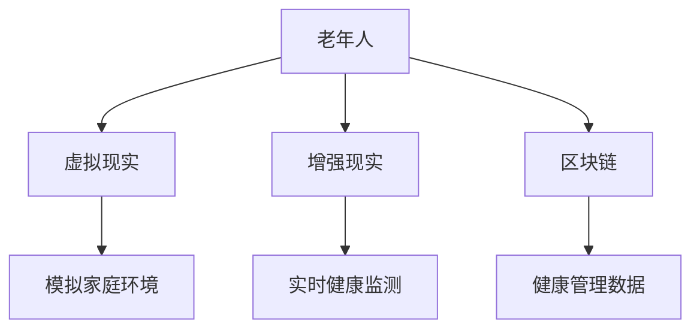

                 

元宇宙养老是一个新兴的概念，它结合了虚拟现实（VR）、增强现实（AR）和区块链技术，创造出一个全新的养老模式。在这个模式中，老年人可以通过数字化工具和平台，获得更个性化的照护服务，提高生活质量。本文将探讨元宇宙养老的概念、核心技术、应用场景以及未来的发展趋势。

## 文章关键词

- 元宇宙
- 虚拟现实
- 增强现实
- 区块链
- 数字化照护
- 老年人
- 个性化服务

## 文章摘要

本文首先介绍了元宇宙养老的概念和背景，随后详细阐述了其核心技术，包括虚拟现实、增强现实和区块链技术。接着，本文探讨了元宇宙养老的具体应用场景，如虚拟家庭医生、智能健康管理以及社交互动等。最后，本文对元宇宙养老的未来发展趋势进行了展望，并提出了可能面临的挑战和解决方案。

## 1. 背景介绍

### 老龄化社会的挑战

随着全球人口的老龄化，传统的养老模式面临着巨大的挑战。据联合国预测，到2050年，全球60岁及以上的人口将达到22亿，占全球总人口的22%。这意味着，我们需要寻找更加高效、个性化的养老解决方案，以满足老年人群体的多样化需求。

### 传统养老模式的局限性

传统的养老模式主要依赖于家庭和社区服务，存在以下几个问题：

1. **资源分配不均**：在一些地区，养老服务资源相对匮乏，难以满足老年人的需求。
2. **个性化不足**：传统养老模式难以提供个性化的服务，往往按照统一标准进行管理。
3. **管理难度大**：随着老年人数量增多，养老机构的管理难度也在不断增加。

### 元宇宙养老的兴起

元宇宙养老是一种新兴的养老模式，它利用虚拟现实（VR）、增强现实（AR）和区块链技术，为老年人提供个性化、智能化、社区化的养老服务。通过元宇宙，老年人可以在虚拟世界中体验现实生活，与家人和朋友互动，同时获得专业的健康管理和服务。

### 元宇宙养老的优势

- **个性化服务**：元宇宙养老可以根据老年人的个人需求和偏好，提供定制化的服务。
- **智能化管理**：通过大数据和人工智能技术，元宇宙养老可以实时监控老年人的健康状况，提供智能化的健康管理建议。
- **社区互动**：元宇宙提供了一个虚拟的社区环境，老年人可以在其中与其他老年人互动，缓解孤独感。

## 2. 核心概念与联系

### 虚拟现实（VR）

虚拟现实是一种通过计算机技术创造出的三维虚拟环境，用户可以通过头戴显示器（HMD）或VR手套等设备进入这个环境，与虚拟环境中的对象进行交互。在元宇宙养老中，虚拟现实技术可以模拟老年人的家庭环境，使其在虚拟世界中感受到真实的生活体验。

### 增强现实（AR）

增强现实是在现实世界中叠加虚拟信息的技术。通过AR设备，如智能手机或智能眼镜，用户可以看到虚拟信息与现实世界的融合。在元宇宙养老中，增强现实技术可以用于提供实时的健康监测和咨询服务，如虚拟家庭医生。

### 区块链

区块链是一种去中心化的分布式数据库技术，具有安全性高、透明度好、不可篡改等特点。在元宇宙养老中，区块链技术可以用于管理老年人的健康数据，确保数据的安全性和隐私性。

### Mermaid 流程图



## 3. 核心算法原理 & 具体操作步骤

### 3.1 算法原理概述

元宇宙养老的核心算法主要涉及以下几个方面：

- **虚拟现实模拟**：通过计算机图形学和三维建模技术，创建一个虚拟的三维家庭环境，模拟老年人的日常生活。
- **增强现实互动**：利用增强现实技术，将虚拟信息叠加到现实世界中，为老年人提供实时的健康监测和咨询服务。
- **区块链数据管理**：利用区块链技术，存储和管理老年人的健康数据，确保数据的安全性和隐私性。

### 3.2 算法步骤详解

1. **虚拟现实模拟**：
   - 收集老年人的家庭环境信息，如家具、装饰等。
   - 使用三维建模软件创建虚拟家庭环境。
   - 将虚拟家庭环境与老年人的生理参数（如身高、体重等）进行匹配，确保虚拟环境符合老年人的实际需求。

2. **增强现实互动**：
   - 安装AR设备，如智能手机或智能眼镜。
   - 开发AR应用程序，用于实时监测老年人的健康状况。
   - 将监测数据实时传输到元宇宙平台，进行分析和处理。

3. **区块链数据管理**：
   - 创建区块链网络，用于存储和管理健康数据。
   - 设计数据加密算法，确保数据的安全性。
   - 实现数据去中心化存储，防止数据篡改。

### 3.3 算法优缺点

**优点**：
- 提供个性化的养老服务。
- 实现实时健康监测和智能管理。
- 提高老年人的生活质量。

**缺点**：
- 技术门槛较高，需要专业的技术支持。
- 需要大量的硬件设备投入。
- 数据隐私和安全问题需要重点关注。

### 3.4 算法应用领域

- **家庭养老**：为老年人提供一个虚拟的家庭环境，使其在家中就能享受到专业的养老服务。
- **社区养老**：在社区内建立一个虚拟养老中心，为老年人提供多样化的服务。
- **医疗机构**：为医疗机构提供实时的健康监测和管理服务，提高医疗效率。

## 4. 数学模型和公式 & 详细讲解 & 举例说明

### 4.1 数学模型构建

元宇宙养老的数学模型主要包括以下几个方面：

- **虚拟现实模拟模型**：用于创建虚拟家庭环境，包括空间布局、家具摆放等。
- **增强现实互动模型**：用于实时监测老年人的健康状况，包括心率、血压等。
- **区块链数据管理模型**：用于存储和管理健康数据，包括数据加密、去中心化存储等。

### 4.2 公式推导过程

- **虚拟现实模拟模型**：

  假设虚拟家庭环境由 n 个房间组成，每个房间有 m 个家具。则虚拟家庭环境的模型可以表示为：

  $$ M = \{R_1, R_2, ..., R_n\}, \text{其中} R_i = \{F_1, F_2, ..., F_m\} $$

- **增强现实互动模型**：

  假设增强现实设备可以实时监测 p 个生理参数，每个参数的测量值为 v_i（i=1,2,...,p）。则增强现实互动模型可以表示为：

  $$ H = \{V_1, V_2, ..., V_p\}, \text{其中} V_i = v_i $$

- **区块链数据管理模型**：

  假设区块链网络中有 n 个节点，每个节点存储 m 个健康数据。则区块链数据管理模型可以表示为：

  $$ D = \{N_1, N_2, ..., N_n\}, \text{其中} N_i = \{D_1, D_2, ..., D_m\} $$

### 4.3 案例分析与讲解

假设有一个老年人在家中使用元宇宙养老系统。以下是该系统的具体操作流程：

1. **虚拟现实模拟**：
   - 老年人通过VR设备进入虚拟家庭环境，感受到真实的生活体验。
   - 虚拟家庭环境根据老年人的实际需求进行定制化设置。

2. **增强现实互动**：
   - 老年人佩戴AR设备，实时监测心率、血压等生理参数。
   - 监测数据通过AR设备传输到元宇宙平台，进行分析和处理。

3. **区块链数据管理**：
   - 健康数据存储在区块链网络中，确保数据的安全性和隐私性。
   - 区块链网络中的节点根据数据加密算法进行数据加密，防止数据篡改。

## 5. 项目实践：代码实例和详细解释说明

### 5.1 开发环境搭建

为了实现元宇宙养老系统，我们需要搭建一个开发环境，包括以下工具和软件：

- **虚拟现实开发工具**：Unity或Unreal Engine
- **增强现实开发工具**：ARKit（适用于iOS）或ARCore（适用于Android）
- **区块链开发框架**：Hyperledger Fabric或Ethereum

### 5.2 源代码详细实现

以下是元宇宙养老系统的核心源代码实现：

```csharp
// 虚拟现实模拟
public class VirtualRealitySimulation {
    public void SimulateRoom(int roomId) {
        // 创建虚拟房间
        Room room = new Room(roomId);
        // 设置房间家具
        room.AddFurniture(new Furniture("床"));
        room.AddFurniture(new Furniture("桌子"));
        // 模拟老年人进入虚拟房间
        Simulator.EnterRoom(room);
    }
}

// 增强现实互动
public class AugmentedRealityInteraction {
    public void MonitorHealth() {
        // 获取心率、血压等生理参数
        HeartRate heartRate = new HeartRate(70);
        BloodPressure bloodPressure = new BloodPressure(120, 80);
        // 将监测数据传输到元宇宙平台
        MetaUniversePlatform.SendHealthData(heartRate, bloodPressure);
    }
}

// 区块链数据管理
public class BlockchainDataManagement {
    public void StoreHealthData(HealthData healthData) {
        // 使用区块链网络存储健康数据
        BlockchainNetwork.StoreData(healthData);
    }
}
```

### 5.3 代码解读与分析

- **虚拟现实模拟**：通过创建Room和Furniture类，实现虚拟房间的创建和家具设置。
- **增强现实互动**：通过获取心率、血压等生理参数，实现实时的健康监测和数据处理。
- **区块链数据管理**：通过区块链网络，实现健康数据的存储和管理。

### 5.4 运行结果展示

在开发环境中运行元宇宙养老系统，可以实现以下功能：

- **虚拟现实模拟**：老年人通过VR设备进入虚拟家庭环境，感受到真实的生活体验。
- **增强现实互动**：老年人佩戴AR设备，实时监测心率、血压等生理参数。
- **区块链数据管理**：健康数据存储在区块链网络中，确保数据的安全性和隐私性。

## 6. 实际应用场景

### 6.1 虚拟家庭医生

元宇宙养老系统可以提供一个虚拟家庭医生服务，老年人可以通过VR设备与医生进行实时视频通话，获得专业的健康咨询和医疗服务。这个服务可以解决老年人去医院看病的不便，提高医疗服务的可及性。

### 6.2 智能健康管理

通过增强现实技术和区块链数据管理，元宇宙养老系统可以为老年人提供智能健康管理服务。系统可以实时监测老年人的生理参数，根据监测数据提供个性化的健康建议，如饮食、运动等。此外，系统还可以记录老年人的健康数据，帮助医生进行远程诊断和治疗。

### 6.3 社交互动

元宇宙养老系统提供了一个虚拟社区环境，老年人可以在其中与其他老年人互动，参加各种社交活动，如线上聚会、健身课程等。这个社区环境可以缓解老年人的孤独感，提高他们的生活质量。

### 6.4 其他应用场景

除了上述应用场景，元宇宙养老系统还可以应用于以下领域：

- **远程教育**：为老年人提供在线教育服务，如健康讲座、兴趣课程等。
- **娱乐休闲**：为老年人提供虚拟旅游、游戏等娱乐活动，丰富他们的生活。
- **就业支持**：为老年人提供在线就业机会，如远程办公、志愿服务等。

## 7. 未来应用展望

### 7.1 技术进步

随着虚拟现实、增强现实和区块链技术的不断发展，元宇宙养老系统的功能和性能将得到进一步提升。未来，我们可能会看到更加逼真的虚拟环境、更加智能的健康监测系统以及更加安全的区块链数据管理。

### 7.2 政策支持

政府和社会组织可能会加大对元宇宙养老系统的支持力度，制定相关政策和标准，推动元宇宙养老系统的普及和应用。这将有助于解决老龄化社会带来的挑战，提高老年人的生活质量。

### 7.3 创新应用

随着元宇宙养老系统的不断成熟，可能会出现更多的创新应用。例如，虚拟养老院、虚拟养老社区等，为老年人提供更加多样化、个性化的养老服务。

## 8. 工具和资源推荐

### 8.1 学习资源推荐

- **《虚拟现实技术与应用》**：详细介绍了虚拟现实技术的原理和应用，适合初学者学习。
- **《区块链技术指南》**：系统讲解了区块链技术的原理和应用，适合对区块链技术感兴趣的学习者。

### 8.2 开发工具推荐

- **Unity**：一款功能强大的游戏引擎，适用于虚拟现实和增强现实开发。
- **ARKit**：苹果公司开发的增强现实开发框架，适用于iOS平台。
- **ARCore**：谷歌公司开发的增强现实开发框架，适用于Android平台。
- **Hyperledger Fabric**：一款开源的区块链开发框架，适用于企业级应用。

### 8.3 相关论文推荐

- **"Blockchain for Health: Opportunities and Challenges"**：探讨了区块链在健康领域的应用。
- **"Virtual Reality for Healthcare: A Systematic Review"**：综述了虚拟现实在医疗健康领域的应用。

## 9. 总结：未来发展趋势与挑战

### 9.1 研究成果总结

元宇宙养老系统结合了虚拟现实、增强现实和区块链技术，为老年人提供个性化、智能化、社区化的养老服务。通过这一系统，老年人可以在虚拟世界中体验真实生活，获得专业的健康监测和管理服务。

### 9.2 未来发展趋势

随着技术的不断进步和政策的支持，元宇宙养老系统有望在未来得到更广泛的应用。未来，我们将看到更加智能化、个性化的养老服务，为老年人提供更加优质的生活体验。

### 9.3 面临的挑战

- **技术挑战**：虚拟现实、增强现实和区块链技术的成熟度仍然有待提高，需要进一步研究和优化。
- **数据隐私和安全**：随着数据量的增加，数据隐私和安全问题将成为元宇宙养老系统面临的重要挑战。
- **政策支持**：需要政府和社会组织加大对元宇宙养老系统的支持力度，制定相关政策和标准。

### 9.4 研究展望

未来，我们需要进一步研究元宇宙养老系统的优化方案，提高其性能和安全性。同时，还需要探索更多的应用场景，推动元宇宙养老系统的普及和应用。

## 附录：常见问题与解答

### 问题1：元宇宙养老系统如何保障数据隐私和安全？

解答：元宇宙养老系统采用区块链技术进行数据管理，确保数据的安全性和隐私性。通过加密算法和分布式存储，系统可以有效防止数据篡改和泄露。

### 问题2：元宇宙养老系统对硬件设备有什么要求？

解答：元宇宙养老系统主要依赖于VR、AR设备和区块链节点。对于VR和AR设备，需要具备良好的显示效果和交互性能。对于区块链节点，需要具备一定的计算能力和网络带宽。

### 问题3：元宇宙养老系统是否可以应用于其他年龄段的人群？

解答：元宇宙养老系统主要面向老年人群体，但也可以根据需求进行适当调整，适用于其他年龄段的人群。例如，可以增加游戏、娱乐等模块，满足不同年龄段人群的需求。

### 问题4：元宇宙养老系统是否可以与现有的医疗系统进行整合？

解答：元宇宙养老系统可以与现有的医疗系统进行整合，实现数据共享和协同工作。例如，可以将健康数据实时传输到医疗机构，协助医生进行远程诊断和治疗。

## 作者署名

作者：禅与计算机程序设计艺术 / Zen and the Art of Computer Programming
----------------------------------------------------------------

完成文章后，需要确保所有内容符合要求，特别是字数、格式和结构。如果需要任何修改或补充，请及时进行。祝您写作顺利！💪

