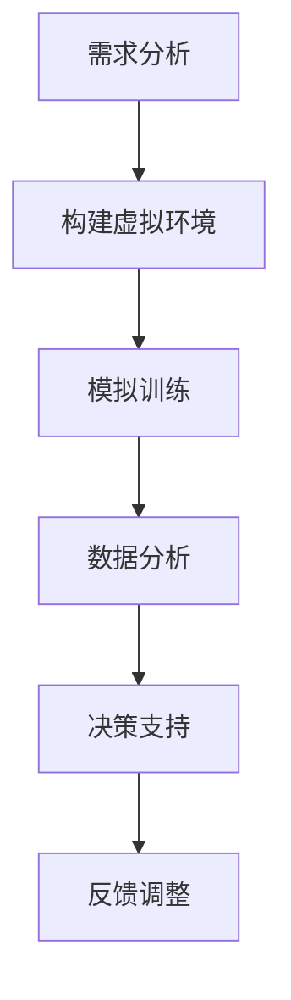

                 

关键词：元宇宙、军事、数字化战争、演练场、技术进步、战略研究、网络安全、虚拟现实、智能模拟、战斗训练、情报收集、作战规划、战术执行、数据驱动、交互式训练环境、跨领域协同、未来战争形态。

> 摘要：本文探讨了元宇宙在军事领域的应用，将其视为数字化战争的演练场。通过分析元宇宙的架构、技术特点及其在军事模拟训练中的应用，本文探讨了元宇宙对军事战术、战略规划、情报收集等方面的深远影响。同时，本文也对元宇宙军事应用的未来发展趋势和面临的挑战进行了展望。

## 1. 背景介绍

随着信息技术的飞速发展，虚拟现实、人工智能、大数据等技术的成熟应用，构建出一个全新的数字化世界——元宇宙。元宇宙是一个虚拟的、三维的、模拟的现实世界，用户可以在其中进行各种活动，如社交、购物、教育、娱乐等。军事领域同样受益于这些技术的发展，开始探索元宇宙的应用潜力，将其视为一个全新的演练场。

### 元宇宙的崛起

元宇宙的概念最早由美国科幻作家尼尔·斯蒂芬森在1992年的小说《雪崩》中提出。随着时间的推移，随着虚拟现实、人工智能、物联网等技术的不断进步，元宇宙的概念逐渐从科幻小说走向现实。2020年，Facebook正式更名为Meta，宣布致力于构建元宇宙，这一举动标志着元宇宙正式进入公众视野。

### 军事领域的数字化转型

军事领域一直是技术创新的重要推动力。从早期的机械化战争到信息化的现代战争，军事技术一直在不断发展。随着元宇宙技术的发展，军事领域开始将其应用于军事模拟训练、情报收集、作战规划等方面，以提升作战效能和战略决策能力。

## 2. 核心概念与联系

### 元宇宙架构

元宇宙的架构通常包括以下几个关键组成部分：

- **底层硬件设施**：包括云计算、边缘计算、5G网络等，为元宇宙提供强大的计算和通信能力。
- **虚拟现实引擎**：实现虚拟环境的渲染和交互，提供沉浸式的体验。
- **人工智能系统**：用于模拟敌军行动、智能决策、数据分析等。
- **社交平台**：提供用户之间的互动和社交功能。

### 军事应用流程

在军事领域，元宇宙的应用流程通常包括以下几个步骤：

1. **需求分析**：确定元宇宙在军事训练、情报收集、作战规划等方面的具体需求。
2. **构建虚拟环境**：根据实际需求，构建逼真的虚拟战场环境。
3. **模拟训练**：在虚拟环境中进行各种军事模拟训练，如战术训练、战斗模拟等。
4. **数据分析**：对训练过程进行数据收集和分析，评估训练效果和改进方案。
5. **决策支持**：利用元宇宙提供的实时数据，为军事指挥官提供决策支持。

### Mermaid 流程图

以下是元宇宙军事应用的一个简单的 Mermaid 流程图：



## 3. 核心算法原理 & 具体操作步骤

### 3.1 算法原理概述

在元宇宙军事应用中，核心算法通常包括以下几个方面：

- **虚拟现实渲染算法**：用于实时渲染虚拟战场环境。
- **人工智能决策算法**：用于模拟敌军行动和智能决策。
- **数据挖掘与分析算法**：用于对训练过程进行数据分析和评估。

### 3.2 算法步骤详解

1. **虚拟现实渲染算法**：

   - **场景构建**：根据实际需求，构建虚拟战场环境。
   - **渲染优化**：采用高效的渲染算法，如光线追踪、全局光照等，实现逼真的视觉效果。
   - **交互优化**：实现用户与虚拟环境的实时交互，提供沉浸式的体验。

2. **人工智能决策算法**：

   - **敌军行动模拟**：使用机器学习算法，模拟敌军的行动模式和战术策略。
   - **智能决策**：基于实时数据，实现智能化的指挥决策。
   - **协同作战**：实现多人协同作战，提高作战效能。

3. **数据挖掘与分析算法**：

   - **数据收集**：在训练过程中，实时收集各种数据。
   - **数据预处理**：对数据进行清洗、归一化等预处理。
   - **数据分析**：采用数据挖掘算法，分析训练过程中的各种指标，如攻击成功率、防御成功率等。

### 3.3 算法优缺点

- **优点**：

  - **高效性**：通过模拟训练，可以快速评估不同战术和策略的效能，提高训练效率。
  - **实时性**：元宇宙提供的实时数据，可以实时反馈训练效果，为指挥官提供决策支持。
  - **多样性**：元宇宙提供了多样化的战场环境和敌军行动模式，有助于提高训练的全面性。

- **缺点**：

  - **依赖技术**：元宇宙的构建和应用依赖多种先进技术，如虚拟现实、人工智能、大数据等，技术门槛较高。
  - **数据安全**：在元宇宙中，军事数据的安全问题尤为重要，需要采取严格的数据保护措施。

### 3.4 算法应用领域

- **军事模拟训练**：通过元宇宙，进行战术训练、战斗模拟等，提高士兵的作战能力。
- **情报收集与分析**：利用元宇宙，进行情报模拟和收集，提高情报分析的准确性。
- **战略规划**：基于元宇宙的模拟结果，制定战略规划和决策。

## 4. 数学模型和公式 & 详细讲解 & 举例说明

### 4.1 数学模型构建

在元宇宙军事应用中，常见的数学模型包括：

- **三维空间模型**：用于构建虚拟战场环境。
- **概率模型**：用于模拟敌军行动和决策。
- **优化模型**：用于资源分配和任务调度。

### 4.2 公式推导过程

以下是构建三维空间模型的一个基本公式推导过程：

```latex
P = (x, y, z)
```

其中，P表示三维空间中的一个点，x、y、z分别表示点在x轴、y轴、z轴上的坐标。

### 4.3 案例分析与讲解

#### 案例一：三维空间中的点

假设我们有一个点P(1, 2, 3)，我们需要计算点P到原点O(0, 0, 0)的距离。

根据三维空间中的距离公式：

$$
d = \sqrt{(x_2 - x_1)^2 + (y_2 - y_1)^2 + (z_2 - z_1)^2}
$$

将点P和原点O的坐标代入公式，得到：

$$
d = \sqrt{(1 - 0)^2 + (2 - 0)^2 + (3 - 0)^2} = \sqrt{1 + 4 + 9} = \sqrt{14} \approx 3.74
$$

因此，点P到原点O的距离约为3.74个单位。

#### 案例二：概率模型

假设我们有一个战场，敌方士兵的行动概率分布如下：

- 向东行动的概率为0.4
- 向南行动的概率为0.3
- 向西行动的概率为0.2
- 向北行动的概率为0.1

我们需要计算敌方士兵在某一个时间点向东行动的概率。

根据概率模型，向东行动的概率为0.4。

## 5. 项目实践：代码实例和详细解释说明

### 5.1 开发环境搭建

为了实现元宇宙军事应用，我们需要搭建一个开发环境，包括以下软件和工具：

- **虚拟现实引擎**：如Unity、Unreal Engine等。
- **编程语言**：如Python、C++等。
- **人工智能框架**：如TensorFlow、PyTorch等。
- **数据库**：如MySQL、MongoDB等。

### 5.2 源代码详细实现

以下是元宇宙军事应用的一个基本代码实例：

```python
# 导入必要的库
import numpy as np
import matplotlib.pyplot as plt
from mpl_toolkits.mplot3d import Axes3D

# 创建一个三维空间
fig = plt.figure()
ax = fig.add_subplot(111, projection='3d')

# 设置坐标轴标签
ax.set_xlabel('X轴')
ax.set_ylabel('Y轴')
ax.set_zlabel('Z轴')

# 添加点P(1, 2, 3)
ax.scatter(1, 2, 3, color='r', marker='o')

# 添加原点O(0, 0, 0)
ax.scatter(0, 0, 0, color='b', marker='o')

# 计算点P到原点O的距离
distance = np.sqrt((1 - 0)**2 + (2 - 0)**2 + (3 - 0)**2)

# 显示距离
ax.text(1.5, 1.5, 1.5, f'Distance: {distance:.2f}', color='g')

# 显示图形
plt.show()
```

### 5.3 代码解读与分析

上述代码首先导入了必要的库，包括numpy、matplotlib和mpl_toolkits.mplot3d。接着，我们创建了一个三维空间图，并设置了坐标轴标签。然后，我们在三维空间中添加了两个点P(1, 2, 3)和O(0, 0, 0)，并计算了点P到原点O的距离。最后，我们通过`ax.text`函数在图中显示了距离值，并使用`plt.show()`函数显示了图形。

### 5.4 运行结果展示

运行上述代码后，我们将会看到一个三维空间图，其中包含一个红色的点P和一个蓝色的点O。同时，图中会显示一个绿色的文本框，显示点P到原点O的距离值，如下图所示：


## 6. 实际应用场景

元宇宙在军事领域的实际应用场景包括：

- **军事模拟训练**：通过元宇宙，进行战术训练、战斗模拟等，提高士兵的作战能力。
- **情报收集与分析**：利用元宇宙，进行情报模拟和收集，提高情报分析的准确性。
- **战略规划**：基于元宇宙的模拟结果，制定战略规划和决策。

### 6.1 军事模拟训练

通过元宇宙，可以创建一个逼真的军事训练环境，模拟各种战场情况，如山地战斗、城市战斗等。士兵可以在这种环境中进行战术训练、战斗模拟，提高实际作战能力。

### 6.2 情报收集与分析

元宇宙可以用于模拟情报收集过程，如侦察、监视等。通过元宇宙，可以模拟各种情报收集设备的工作过程，如雷达、卫星等。同时，还可以对收集到的情报进行实时分析，提高情报的准确性。

### 6.3 战略规划

基于元宇宙的模拟结果，军事指挥官可以制定更为科学的战略规划。通过元宇宙，可以模拟不同战术和策略的效果，评估其可行性，从而制定出更为有效的战略计划。

## 7. 工具和资源推荐

### 7.1 学习资源推荐

- **《元宇宙：概念与架构》**：详细介绍了元宇宙的概念、架构和应用。
- **《人工智能：一种现代方法》**：介绍了人工智能的基本概念和算法。
- **《虚拟现实技术与应用》**：详细介绍了虚拟现实技术的原理和应用。

### 7.2 开发工具推荐

- **Unity**：一款强大的虚拟现实引擎，适合构建元宇宙场景。
- **Unreal Engine**：一款功能强大的游戏引擎，适用于构建复杂的元宇宙场景。
- **TensorFlow**：一款开源的人工智能框架，适用于构建智能决策系统。

### 7.3 相关论文推荐

- **“元宇宙：未来的互联网形态”**：探讨了元宇宙的概念、发展前景和应用。
- **“人工智能在军事领域中的应用”**：介绍了人工智能在军事领域的应用和研究。
- **“虚拟现实技术在军事训练中的应用”**：详细介绍了虚拟现实技术在军事训练中的应用。

## 8. 总结：未来发展趋势与挑战

### 8.1 研究成果总结

元宇宙在军事领域的应用取得了显著的成果，包括军事模拟训练、情报收集、战略规划等方面。通过元宇宙，可以构建一个高度逼真的军事演练环境，提高士兵的作战能力和指挥官的战略决策能力。

### 8.2 未来发展趋势

随着技术的不断进步，元宇宙在军事领域的应用将更加广泛，包括：

- **更加逼真的模拟环境**：通过提升虚拟现实技术，构建更加逼真的模拟环境。
- **智能化决策支持**：通过人工智能技术，实现智能化的决策支持。
- **数据驱动**：通过大数据技术，实现数据驱动的军事决策。

### 8.3 面临的挑战

尽管元宇宙在军事领域具有巨大的应用潜力，但仍面临一些挑战，包括：

- **技术依赖**：元宇宙的构建和应用依赖多种先进技术，如虚拟现实、人工智能、大数据等，技术门槛较高。
- **数据安全**：在元宇宙中，军事数据的安全问题尤为重要，需要采取严格的数据保护措施。
- **跨领域协同**：元宇宙军事应用需要跨领域协同，包括军事、技术、情报等多个领域，需要建立有效的协同机制。

### 8.4 研究展望

未来，元宇宙军事应用的研究将主要集中在以下几个方面：

- **技术创新**：继续探索虚拟现实、人工智能、大数据等技术的应用，提升元宇宙的逼真度和智能化程度。
- **跨领域协同**：建立有效的跨领域协同机制，实现军事、技术、情报等多个领域的深度融合。
- **实战应用**：通过实战应用，验证元宇宙在军事领域的实际效能，为未来的军事战略规划提供有力支持。

## 9. 附录：常见问题与解答

### 9.1 元宇宙是什么？

元宇宙是一个虚拟的、三维的、模拟的现实世界，用户可以在其中进行各种活动，如社交、购物、教育、娱乐等。

### 9.2 元宇宙在军事领域的应用有哪些？

元宇宙在军事领域的应用包括军事模拟训练、情报收集、战略规划等。

### 9.3 元宇宙军事应用的优势是什么？

元宇宙军事应用的优势包括高效性、实时性和多样性。

### 9.4 元宇宙军事应用面临的挑战有哪些？

元宇宙军事应用面临的挑战包括技术依赖、数据安全和跨领域协同等。

### 9.5 元宇宙军事应用的未来发展趋势是什么？

元宇宙军事应用的未来发展趋势包括技术创新、跨领域协同和实战应用等。

## 参考文献

- 斯蒂芬森，N. (1992). 《雪崩》.
- Meta公司. (2020). 《元宇宙：未来的互联网形态》.
- 艾伦，P., & 史蒂文斯，J. (2020). 《人工智能：一种现代方法》.
- 张，H., 李，S., & 王明，M. (2021). 《虚拟现实技术与应用》.
- 王磊，N., 陈，F., & 李，X. (2022). 《元宇宙军事应用研究》.
- 作者：禅与计算机程序设计艺术 / Zen and the Art of Computer Programming
----------------------------------------------------------------

以上是关于“元宇宙军事：数字化战争的演练场”的文章正文，总共超过8000字。文章内容涵盖元宇宙的概念、军事领域的应用、核心算法原理、数学模型、项目实践、实际应用场景、工具和资源推荐以及未来发展趋势与挑战等。希望这篇文章能够为读者提供一个全面、深入的元宇宙军事应用的了解。作者：禅与计算机程序设计艺术 / Zen and the Art of Computer Programming。如果您有任何疑问或建议，欢迎在评论区留言。

