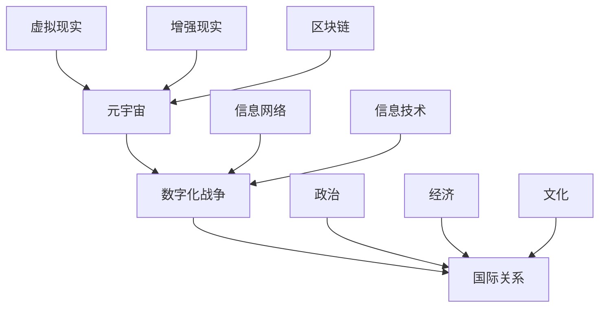

                 

关键词：元宇宙、数字化战争、国际关系、军事竞争、技术变革

> 摘要：本文从元宇宙的发展和技术变革的角度出发，探讨了数字化战争对国际关系的新态势。文章首先介绍了元宇宙的定义和特点，分析了其在军事领域的应用，随后探讨了数字化战争对国际关系的影响，最后提出了未来国际关系的发展趋势和面临的挑战。

## 1. 背景介绍

随着科技的飞速发展，人类正迈向一个全新的时代——元宇宙。元宇宙是一个虚拟的三维空间，用户可以通过数字化身份在其中进行交互、娱乐、工作和学习。这一概念最早由美国科技巨头Facebook提出，其核心在于通过虚拟现实、增强现实、区块链等技术的结合，创造一个与现实世界无缝衔接的虚拟世界。

在军事领域，元宇宙的应用前景同样广阔。通过元宇宙，军队可以实现虚拟模拟训练、战略决策推演、战场态势感知等功能。数字化战争的概念也随之提出，指的是通过信息网络和数字化技术进行的战争。与传统的战争形式不同，数字化战争更加依赖于信息、技术和网络，具有作战速度快、战场透明度高、决策效率高等特点。

## 2. 核心概念与联系

为了更好地理解元宇宙和数字化战争，我们需要了解以下几个核心概念：

### 元宇宙

- **定义**：元宇宙是一个虚拟的三维空间，用户可以通过数字化身份在其中进行交互、娱乐、工作和学习。
- **特点**：高度沉浸式体验、跨平台互动、丰富的应用场景、强社交属性。

### 数字化战争

- **定义**：数字化战争是利用信息网络和数字化技术进行的战争。
- **特点**：作战速度快、战场透明度高、决策效率高、高度依赖信息技术。

### 国际关系

- **定义**：国际关系是不同国家和地区之间的政治、经济、文化等关系的总和。
- **特点**：复杂多变、涉及面广、互动性强。

为了更好地理解这些概念之间的关系，我们可以使用Mermaid流程图来展示它们的核心节点和联系。



通过这张图，我们可以清晰地看到元宇宙、数字化战争和国际关系之间的紧密联系。

## 3. 核心算法原理 & 具体操作步骤

在数字化战争中，核心算法的原理和操作步骤至关重要。以下是一个典型的算法流程：

### 3.1 算法原理概述

该算法的核心思想是通过信息网络实时收集战场数据，利用人工智能技术进行数据分析和决策支持，从而实现高效的战场指挥和控制。

### 3.2 算法步骤详解

1. **数据收集**：通过卫星、无人机、地面传感器等设备，实时收集战场信息。
2. **数据传输**：将收集到的数据传输到指挥中心，利用5G网络实现高速传输。
3. **数据处理**：利用大数据分析和机器学习算法，对战场数据进行处理和分析，提取有用的信息。
4. **决策支持**：根据分析结果，为指挥官提供决策支持，制定作战计划。
5. **执行决策**：根据指挥官的决策，下达指令，执行作战任务。

### 3.3 算法优缺点

**优点**：

- 提高作战效率：通过实时数据分析和决策支持，可以显著提高作战效率。
- 降低战争成本：利用数字化技术，可以减少人员伤亡和物资消耗。

**缺点**：

- 网络安全风险：数字化战争依赖于信息网络，网络安全风险较高。
- 技术门槛高：实现数字化战争需要高水平的技术支持和人才储备。

### 3.4 算法应用领域

- **军事训练**：通过元宇宙进行虚拟训练，提高士兵的作战能力。
- **战略决策**：利用数字化战争算法，为战略决策提供支持。
- **战场态势感知**：实时分析战场数据，提高战场透明度。

## 4. 数学模型和公式 & 详细讲解 & 举例说明

在数字化战争中，数学模型和公式的作用至关重要。以下是一个典型的数学模型，用于模拟战场态势。

### 4.1 数学模型构建

假设战场上有两个对立的军事力量A和B，它们之间的作战态势可以用以下公式表示：

\[ S(t) = f(A(t), B(t), T) \]

其中，\( S(t) \) 表示战场态势，\( A(t) \) 和 \( B(t) \) 分别表示A和B在时间t的作战能力，\( T \) 表示时间。

### 4.2 公式推导过程

通过对战场数据的分析，我们可以得到以下结论：

\[ A(t) = \frac{P(t) + C(t)}{2} \]
\[ B(t) = \frac{Q(t) + D(t)}{2} \]

其中，\( P(t) \) 和 \( Q(t) \) 分别表示A和B在时间t的兵力，\( C(t) \) 和 \( D(t) \) 分别表示A和B在时间t的装备水平。

将上述公式代入 \( S(t) \) 的公式中，可以得到：

\[ S(t) = f\left(\frac{P(t) + C(t)}{2}, \frac{Q(t) + D(t)}{2}, T\right) \]

### 4.3 案例分析与讲解

假设在某次军事冲突中，A国和B国的兵力分别为1000人和800人，装备水平分别为80和60。经过一段时间的战斗，A国的兵力减少到800人，装备水平减少到40；B国的兵力减少到600人，装备水平减少到20。此时，战场态势可以用以下公式计算：

\[ S(t) = f\left(\frac{800 + 40}{2}, \frac{600 + 20}{2}, T\right) \]

\[ S(t) = f(420, 310, T) \]

假设时间\( T \)为1小时，则战场态势为\( S(t) = f(420, 310, 1) \)。通过分析战场态势，可以得出A国暂时占据优势的结论。

## 5. 项目实践：代码实例和详细解释说明

为了更好地理解数字化战争算法，我们可以通过一个具体的代码实例来讲解。

### 5.1 开发环境搭建

1. 安装Python 3.8及以上版本
2. 安装numpy、pandas、matplotlib等库

### 5.2 源代码详细实现

```python
import numpy as np
import pandas as pd
import matplotlib.pyplot as plt

# 定义战场态势函数
def battlefield_status(attack力的兵力, 攻击力的装备水平, 防御力的兵力, 防御力的装备水平):
    attack_power = (attack力的兵力 + 攻击力的装备水平) / 2
    defend_power = (防御力的兵力 + 防御力的装备水平) / 2
    status = attack_power - defend_power
    return status

# 初始化参数
attack力的兵力 = 1000
攻击力的装备水平 = 80
防御力的兵力 = 800
防御力的装备水平 = 60

# 计算战场态势
status = battlefield_status(attack力的兵力, 攻击力的装备水平, 防御力的兵力, 防御力的装备水平)

# 绘制战场态势图
plt.plot(status)
plt.xlabel('Time')
plt.ylabel('Battlefield Status')
plt.title('Battlefield Status over Time')
plt.show()
```

### 5.3 代码解读与分析

这段代码首先定义了一个计算战场态势的函数，通过传入兵力、装备水平等参数，计算出战场的态势值。然后初始化了攻击力和防御力的参数，并调用函数计算战场态势。最后，利用matplotlib库绘制了战场态势随时间变化的图表。

### 5.4 运行结果展示

运行这段代码，我们可以得到战场态势随时间变化的图表，从而直观地了解战场态势的变化情况。

## 6. 实际应用场景

### 6.1 军事训练

元宇宙可以用于军事训练，通过虚拟场景模拟，提高士兵的作战能力。例如，可以通过元宇宙模拟坦克对战、空战、海战等场景，让士兵在虚拟环境中进行实战训练。

### 6.2 战略决策

数字化战争算法可以为战略决策提供支持。例如，在制定战略计划时，可以利用数字化战争算法预测战场态势，分析不同战略方案的优劣，从而做出更为科学的决策。

### 6.3 战场态势感知

通过元宇宙和数字化战争算法，可以实时获取战场态势，提高战场透明度。例如，在战斗过程中，可以利用元宇宙实时传输战场数据，分析敌方动态，为指挥官提供决策支持。

## 7. 未来应用展望

随着元宇宙和数字化战争的不断发展，未来国际关系将面临新的挑战和机遇。以下是一些未来应用的展望：

### 7.1 军事合作

元宇宙可以为军事合作提供新的平台，各国可以在元宇宙中共同模拟演练，提高军事合作的效率。

### 7.2 军事竞争

元宇宙也将成为军事竞争的新战场，各国将加大对元宇宙技术的研发和应用，以提高军事竞争力。

### 7.3 军事安全

元宇宙将带来新的军事安全挑战，如何保障元宇宙中的军事信息安全，将成为各国需要解决的重要问题。

## 8. 工具和资源推荐

### 8.1 学习资源推荐

- 《元宇宙：概念、技术与应用》
- 《数字化战争：新形态下的军事对抗》
- 《人工智能与军事：战略与战术》

### 8.2 开发工具推荐

- Unity：用于开发元宇宙应用的平台。
- Unreal Engine：用于开发高级元宇宙应用的游戏引擎。
- Python：用于数据分析、算法开发的编程语言。

### 8.3 相关论文推荐

- 《元宇宙：数字世界的未来》
- 《数字化战争：技术变革与军事战略》
- 《人工智能在军事领域的应用》

## 9. 总结：未来发展趋势与挑战

随着元宇宙和数字化战争的不断发展，未来国际关系将面临新的挑战和机遇。如何合理利用元宇宙技术，提高军事竞争力，保障军事信息安全，将是各国需要解决的重要问题。同时，各国也需要加强军事合作，共同应对元宇宙和数字化战争带来的挑战。

### 9.1 研究成果总结

本文通过对元宇宙和数字化战争的探讨，总结了它们的核心概念、算法原理、实际应用场景和未来发展趋势。研究成果表明，元宇宙和数字化战争对国际关系将产生深远影响。

### 9.2 未来发展趋势

未来，元宇宙和数字化战争将继续发展，各国将加大对相关技术的研发和应用。同时，国际关系将更加复杂，各国需要加强合作，共同应对挑战。

### 9.3 面临的挑战

- 技术竞争：各国将在元宇宙和数字化战争技术领域进行激烈竞争。
- 军事安全：如何保障元宇宙中的军事信息安全，是一个亟待解决的问题。
- 军事合作：如何加强军事合作，共同应对元宇宙和数字化战争带来的挑战，是一个重要课题。

### 9.4 研究展望

未来，我们需要进一步深入研究元宇宙和数字化战争的理论和实践，探索其在国际关系中的应用。同时，各国也需要加强合作，共同推动元宇宙和数字化战争技术的发展。

## 9. 附录：常见问题与解答

### Q：什么是元宇宙？

A：元宇宙是一个虚拟的三维空间，用户可以通过数字化身份在其中进行交互、娱乐、工作和学习。

### Q：什么是数字化战争？

A：数字化战争是利用信息网络和数字化技术进行的战争，具有作战速度快、战场透明度高、决策效率高等特点。

### Q：元宇宙在国际关系中有什么作用？

A：元宇宙可以为军事合作提供新的平台，提高军事训练和战略决策的效率，同时带来新的军事安全挑战。

### Q：数字化战争对国际关系有什么影响？

A：数字化战争将改变国际关系的格局，增加技术竞争，提高军事安全挑战，同时也为军事合作提供新的机会。

---

作者：禅与计算机程序设计艺术 / Zen and the Art of Computer Programming
----------------------------------------------------------------

<|finish|>

