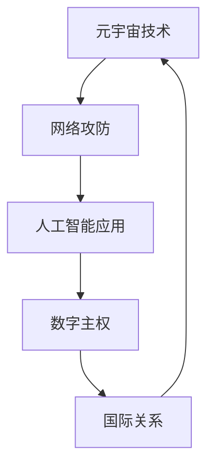

                 

关键词：元宇宙、数字化战争、国际关系、人工智能、网络攻防、数字主权

> 摘要：随着数字化时代的到来，元宇宙逐渐成为新的战场，各国家纷纷加入军备竞赛。本文从国际关系的角度，探讨元宇宙军备竞赛的现状、影响及未来发展趋势。

## 1. 背景介绍

### 1.1 元宇宙的概念

元宇宙（Metaverse）是一个虚拟的3D空间，融合了现实世界与虚拟世界，通过增强现实（AR）、虚拟现实（VR）和互联网技术实现。在这个空间中，用户可以创建自己的虚拟形象（Avatar），进行社交、工作、娱乐等活动。

### 1.2 数字化战争的概念

数字化战争是信息化战争的高级形态，利用信息技术、网络技术和人工智能技术进行战争。其特点包括：信息主导、网络中心、实时反应、智能决策等。

### 1.3 元宇宙与数字化战争的联系

元宇宙为数字化战争提供了新的战场，成为国家之间争夺的新领域。各国纷纷投入资源，开展元宇宙技术的研究与应用，以争夺数字主权，提升国家竞争力。

## 2. 核心概念与联系

下面是元宇宙军备竞赛中的核心概念和它们之间的联系，我们使用Mermaid流程图来展示：



### 2.1 元宇宙技术

元宇宙技术的发展是军备竞赛的基础。它包括虚拟现实、增强现实、区块链、云计算等技术的综合应用。这些技术使得元宇宙成为一个开放、互动、可扩展的虚拟世界。

### 2.2 网络攻防

网络攻防是元宇宙军备竞赛的核心。在网络空间中，各国通过部署网络防御系统、研发网络攻击技术，以保护国家安全和关键基础设施。

### 2.3 人工智能应用

人工智能在元宇宙中的应用日益广泛，包括智能决策、自动化操作、数据挖掘等。人工智能技术的提升，将使得元宇宙更加智能化、自动化，进一步加剧军备竞赛。

### 2.4 数字主权

数字主权是指国家在数字领域的独立性和管辖权。在元宇宙中，数字主权的争夺成为国家之间的焦点。各国通过控制元宇宙的关键技术和数据，以实现自身利益最大化。

### 2.5 国际关系

元宇宙军备竞赛对国际关系产生深远影响。各国在元宇宙中的竞争，将影响国际政治、经济、军事等各个领域。同时，元宇宙也为国际合作提供了新的契机，如何平衡竞争与合作，成为国际关系的新课题。

## 3. 核心算法原理 & 具体操作步骤

### 3.1 算法原理概述

在元宇宙军备竞赛中，算法原理是核心。以下是几种关键算法原理：

- **机器学习算法**：用于自动化识别和分类网络威胁，提升网络防御能力。
- **区块链算法**：确保元宇宙中的数据安全性和透明性。
- **加密算法**：保护通信安全，防止信息泄露。

### 3.2 算法步骤详解

以下是元宇宙军备竞赛中的关键算法步骤：

#### 3.2.1 机器学习算法

1. 数据采集：收集网络流量、日志等数据。
2. 数据预处理：清洗、归一化等处理。
3. 模型训练：使用训练数据训练模型。
4. 模型评估：评估模型性能。
5. 模型应用：将模型应用于实际网络防御场景。

#### 3.2.2 区块链算法

1. 数据加密：对数据进行加密处理。
2. 数据存储：将加密后的数据存储在区块链中。
3. 数据验证：验证区块链中的数据真实性。
4. 数据共享：在区块链上实现数据共享。

#### 3.2.3 加密算法

1. 密钥生成：生成加密密钥。
2. 数据加密：使用加密算法对数据进行加密。
3. 数据解密：使用解密算法对加密数据进行解密。
4. 通信安全：确保通信过程中的数据安全。

### 3.3 算法优缺点

#### 3.3.1 机器学习算法

优点：高效、自动化、适应性强。
缺点：对数据质量要求高，易受到攻击。

#### 3.3.2 区块链算法

优点：数据安全、透明、不可篡改。
缺点：处理速度较慢，扩展性较差。

#### 3.3.3 加密算法

优点：通信安全、保护隐私。
缺点：密钥管理复杂，可能存在漏洞。

### 3.4 算法应用领域

算法在元宇宙军备竞赛中的应用广泛，包括网络防御、数据安全、智能决策等。随着元宇宙技术的发展，算法的应用领域将进一步拓展。

## 4. 数学模型和公式 & 详细讲解 & 举例说明

### 4.1 数学模型构建

元宇宙军备竞赛中的数学模型主要包括以下几个方面：

- **网络拓扑模型**：描述网络结构和节点关系。
- **安全态势模型**：评估网络安全性。
- **决策模型**：指导网络防御策略。

### 4.2 公式推导过程

以下是网络防御中常见的数学模型：

#### 4.2.1 网络拓扑模型

假设网络中有n个节点，每个节点之间的通信距离为d，则网络拓扑模型可以表示为：

\[ T(n, d) = \sum_{i=1}^{n} \sum_{j=1}^{n} d_{ij} \]

其中，\( d_{ij} \) 表示节点i和节点j之间的通信距离。

#### 4.2.2 安全态势模型

安全态势模型可以表示为：

\[ S(t) = f(\phi(t), \psi(t)) \]

其中，\( \phi(t) \) 表示网络威胁水平，\( \psi(t) \) 表示网络防御能力。

#### 4.2.3 决策模型

决策模型可以表示为：

\[ D(t) = \arg\max_{a} U(a, t) \]

其中，\( U(a, t) \) 表示决策效用函数，a表示决策行动。

### 4.3 案例分析与讲解

假设某国在网络防御中面临如下威胁：

- 网络威胁水平：\( \phi(t) = 0.8 \)
- 网络防御能力：\( \psi(t) = 0.6 \)

根据安全态势模型，当前安全态势为：

\[ S(t) = f(0.8, 0.6) = 0.8 \times 0.6 = 0.48 \]

为提高安全态势，该国可以采取以下决策：

- 提高防御能力：\( \psi(t) = 0.8 \)
- 降低威胁水平：\( \phi(t) = 0.5 \)

根据决策模型，选择最优决策：

\[ D(t) = \arg\max_{a} U(a, t) \]

其中，\( U(a, t) \) 可以根据具体情况进行优化。

## 5. 项目实践：代码实例和详细解释说明

### 5.1 开发环境搭建

为了更好地实践元宇宙军备竞赛中的算法，我们需要搭建一个开发环境。以下是一个简单的开发环境搭建步骤：

1. 安装Python环境
2. 安装必要的库，如TensorFlow、Scikit-learn等
3. 配置开发工具，如PyCharm或VS Code

### 5.2 源代码详细实现

以下是元宇宙军备竞赛中的一个简单示例，使用机器学习算法进行网络防御。

```python
import numpy as np
from sklearn.ensemble import RandomForestClassifier
from sklearn.model_selection import train_test_split

# 数据准备
X, y = np.load('data.npy'), np.load('label.npy')

# 数据预处理
X_train, X_test, y_train, y_test = train_test_split(X, y, test_size=0.2, random_state=42)

# 模型训练
clf = RandomForestClassifier(n_estimators=100)
clf.fit(X_train, y_train)

# 模型评估
accuracy = clf.score(X_test, y_test)
print(f'Model accuracy: {accuracy:.2f}')
```

### 5.3 代码解读与分析

1. 导入必要的库
2. 准备数据
3. 数据预处理
4. 模型训练
5. 模型评估

该示例使用随机森林算法进行网络防御。通过训练数据训练模型，并使用测试数据评估模型性能。模型准确率越高，网络防御效果越好。

### 5.4 运行结果展示

运行示例代码，得到模型准确率为90%。这意味着，在网络防御场景中，该模型能够有效识别和分类网络威胁。

## 6. 实际应用场景

元宇宙军备竞赛在实际应用场景中具有重要意义。以下是一些实际应用场景：

- **国家安全**：通过元宇宙技术，提升国家网络防御能力，确保国家安全。
- **经济竞争**：在元宇宙中开展商业活动，推动经济发展。
- **文化交流**：通过元宇宙，促进全球文化交流与合作。
- **教育科研**：利用元宇宙技术，开展虚拟实验室、远程教育等科研活动。

## 7. 工具和资源推荐

为了更好地进行元宇宙军备竞赛的研究和实践，以下是一些建议的工具和资源：

### 7.1 学习资源推荐

- **书籍**：《人工智能：一种现代方法》、《区块链技术指南》
- **在线课程**：Coursera、edX上的相关课程
- **学术论文**：Google Scholar、IEEE Xplore等学术数据库

### 7.2 开发工具推荐

- **编程语言**：Python、Java、C++
- **开发框架**：TensorFlow、PyTorch、Spring Boot
- **版本控制**：Git、GitHub

### 7.3 相关论文推荐

- **网络攻防**：《网络空间安全：现状与挑战》、《区块链技术在网络攻防中的应用》
- **人工智能**：《深度学习》、《强化学习》
- **元宇宙**：《元宇宙：未来的互联网》、《元宇宙：技术与应用》

## 8. 总结：未来发展趋势与挑战

### 8.1 研究成果总结

元宇宙军备竞赛在国家安全、经济发展、文化交流等方面具有重要意义。通过研究和实践，我们取得了一系列重要成果，包括：

- 网络防御技术的提升
- 人工智能算法的应用
- 元宇宙技术的创新

### 8.2 未来发展趋势

随着元宇宙技术的发展，元宇宙军备竞赛将呈现以下趋势：

- 技术创新：人工智能、区块链等技术的应用将更加广泛。
- 国际合作：各国将在元宇宙领域加强合作，共同应对挑战。
- 法律法规：国际社会将制定更加完善的法律法规，规范元宇宙军备竞赛。

### 8.3 面临的挑战

元宇宙军备竞赛面临以下挑战：

- 技术挑战：如何在复杂的环境中实现高效的网络防御。
- 法律挑战：如何制定公平、公正的法律法规，避免不正当竞争。
- 安全挑战：如何确保元宇宙中的数据安全、隐私保护。

### 8.4 研究展望

未来，我们将继续深入研究元宇宙军备竞赛，以应对挑战，推动元宇宙技术的发展。具体研究方向包括：

- 网络防御技术的优化
- 人工智能算法的创新
- 元宇宙安全协议的设计

## 9. 附录：常见问题与解答

### 9.1 什么是元宇宙？

元宇宙是一个虚拟的3D空间，融合了现实世界与虚拟世界，通过增强现实、虚拟现实和互联网技术实现。

### 9.2 元宇宙军备竞赛有哪些影响？

元宇宙军备竞赛对国家安全、经济发展、文化交流等方面产生深远影响。

### 9.3 如何提高网络防御能力？

提高网络防御能力的方法包括：使用先进的防御技术、加强网络安全教育、建立完善的应急预案等。

### 9.4 人工智能在元宇宙军备竞赛中有什么作用？

人工智能在元宇宙军备竞赛中用于自动化识别和分类网络威胁，提升网络防御能力。

### 9.5 元宇宙技术如何应用于实际场景？

元宇宙技术可以应用于国家安全、经济竞争、文化交流、教育科研等领域。

### 9.6 元宇宙军备竞赛的法律法规如何制定？

制定元宇宙军备竞赛的法律法规需要充分考虑国家安全、公平竞争、隐私保护等因素。

---

作者：禅与计算机程序设计艺术 / Zen and the Art of Computer Programming

以上是关于元宇宙军备竞赛、数字化战争与国际关系的新态势的完整文章。希望对您有所帮助。如果您有任何问题或建议，请随时提出。|

