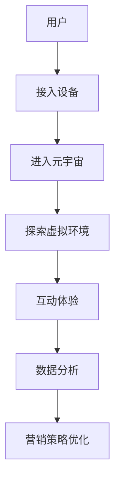

                 

在当今数字化时代，品牌塑造已成为企业竞争的关键因素。随着元宇宙技术的兴起，品牌塑造的方式也在发生革命性的变化。元宇宙，作为一个虚拟的三维空间，正成为品牌塑造的新战场。本文将探讨元宇宙品牌塑造的核心概念、算法原理、数学模型、实际应用以及未来趋势。

## 文章关键词

- 元宇宙
- 品牌塑造
- 数字化营销
- 虚拟现实
- 数据分析

## 摘要

本文旨在分析元宇宙品牌塑造的各个方面，包括其核心概念、技术实现、数学模型以及实际应用。通过深入研究，本文将揭示元宇宙如何改变品牌塑造的游戏规则，并探讨其在未来营销领域中的潜在影响。

## 1. 背景介绍

### 元宇宙的定义与兴起

元宇宙（Metaverse）是一个虚拟的三维空间，用户可以通过虚拟角色在其中互动、消费和体验。它是一个跨越多个平台、设备和操作系统的沉浸式数字世界，具有高度的互动性和社交性。元宇宙的兴起得益于虚拟现实（VR）、增强现实（AR）和区块链等技术的发展。

### 品牌塑造的重要性

品牌塑造是企业的一项长期战略，旨在建立品牌形象、提高品牌认知度和忠诚度。在数字化时代，品牌塑造的重要性愈发凸显，因为消费者在购买决策中越来越依赖数字渠道和在线体验。

### 数字化营销的变革

随着数字化技术的不断进步，营销手段也在发生变革。传统广告、社交媒体营销和搜索引擎优化（SEO）等方法逐渐被更加个性化和互动的数字化营销策略所取代。元宇宙的兴起为数字化营销提供了新的平台和工具。

## 2. 核心概念与联系

### 元宇宙品牌塑造的概念

元宇宙品牌塑造是指企业利用元宇宙技术，如虚拟现实、增强现实和区块链等，来创建、推广和维护其品牌形象和产品。它包括以下几个方面：

1. **虚拟产品体验**：通过虚拟现实和增强现实技术，用户可以在线上体验产品，从而增加购买意愿。
2. **品牌互动**：品牌可以在元宇宙中举办互动活动，如虚拟展会、音乐会和社交聚会，以增强用户参与度。
3. **虚拟广告**：品牌可以在元宇宙中的虚拟环境中投放广告，以吸引更多用户关注。
4. **品牌社区**：品牌可以在元宇宙中创建社区，让用户参与品牌讨论，分享使用体验，从而建立品牌忠诚度。

### 元宇宙品牌塑造的架构

元宇宙品牌塑造的架构可以分为以下几个方面：

1. **用户界面**：用户通过虚拟现实头盔、手机或平板电脑等设备接入元宇宙。
2. **虚拟环境**：品牌在元宇宙中创建的虚拟空间，如虚拟商店、虚拟展会等。
3. **互动机制**：用户与品牌互动的方式，如购买、评论、分享等。
4. **数据分析**：收集用户行为数据，用于品牌营销策略的优化。

### Mermaid 流程图



## 3. 核心算法原理 & 具体操作步骤

### 3.1 算法原理概述

元宇宙品牌塑造的核心算法主要包括：

1. **虚拟现实渲染算法**：用于生成逼真的三维虚拟环境。
2. **增强现实算法**：将虚拟元素叠加到现实环境中。
3. **用户行为分析算法**：分析用户在元宇宙中的行为，以优化营销策略。
4. **区块链算法**：确保元宇宙中的交易和互动具有可信度和安全性。

### 3.2 算法步骤详解

1. **虚拟现实渲染算法**：

   - 输入：三维模型、光照信息、材质信息等。
   - 过程：使用图形渲染引擎（如Unity、Unreal Engine）进行渲染。
   - 输出：逼真的三维虚拟环境。

2. **增强现实算法**：

   - 输入：现实环境图像、虚拟元素图像等。
   - 过程：使用图像处理技术（如图像配准、图像融合）将虚拟元素叠加到现实环境中。
   - 输出：增强现实效果。

3. **用户行为分析算法**：

   - 输入：用户在元宇宙中的行为数据。
   - 过程：使用机器学习算法（如决策树、神经网络）分析用户行为，预测用户需求。
   - 输出：优化后的营销策略。

4. **区块链算法**：

   - 输入：交易信息、用户身份信息等。
   - 过程：使用区块链技术（如比特币、以太坊）确保交易和互动具有可信度和安全性。
   - 输出：可信的数字身份和交易记录。

### 3.3 算法优缺点

1. **虚拟现实渲染算法**：

   - 优点：生成逼真的三维虚拟环境，提高用户体验。
   - 缺点：计算资源消耗大，渲染速度较慢。

2. **增强现实算法**：

   - 优点：将虚拟元素叠加到现实环境中，增加现实世界的互动性。
   - 缺点：对环境要求较高，可能影响用户现实生活。

3. **用户行为分析算法**：

   - 优点：优化营销策略，提高用户满意度。
   - 缺点：数据隐私和安全问题。

4. **区块链算法**：

   - 优点：确保交易和互动具有可信度和安全性。
   - 缺点：计算资源消耗大，交易速度较慢。

### 3.4 算法应用领域

- **虚拟零售**：品牌在元宇宙中开设虚拟商店，提供在线购物体验。
- **虚拟展览**：品牌在元宇宙中举办虚拟展览，展示新产品。
- **虚拟教育**：品牌利用元宇宙技术提供虚拟教育体验。
- **虚拟娱乐**：品牌在元宇宙中提供虚拟娱乐活动。

## 4. 数学模型和公式 & 详细讲解 & 举例说明

### 4.1 数学模型构建

元宇宙品牌塑造的数学模型主要包括以下几个方面：

1. **用户行为模型**：分析用户在元宇宙中的行为，预测用户需求。
2. **营销效果模型**：评估营销策略对品牌塑造的影响。
3. **虚拟环境渲染模型**：生成逼真的三维虚拟环境。

### 4.2 公式推导过程

1. **用户行为模型**：

   - 假设用户在元宇宙中的行为可以用向量表示：$$ \vec{u} = (u_1, u_2, u_3, ..., u_n) $$
   - 用户需求可以用向量表示：$$ \vec{d} = (d_1, d_2, d_3, ..., d_n) $$
   - 用户行为模型可以表示为：$$ \vec{d} = W \vec{u} $$
   - 其中，W 是行为模型权重矩阵。

2. **营销效果模型**：

   - 假设营销策略对品牌塑造的影响可以用向量表示：$$ \vec{m} = (m_1, m_2, m_3, ..., m_n) $$
   - 品牌塑造效果可以用向量表示：$$ \vec{e} = (e_1, e_2, e_3, ..., e_n) $$
   - 营销效果模型可以表示为：$$ \vec{e} = V \vec{m} $$
   - 其中，V 是效果模型权重矩阵。

3. **虚拟环境渲染模型**：

   - 假设虚拟环境渲染可以用矩阵表示：$$ \vec{v} = M \vec{u} $$
   - 其中，M 是虚拟环境渲染矩阵。

### 4.3 案例分析与讲解

以一个虚拟零售场景为例：

1. **用户行为模型**：

   - 假设用户在元宇宙中的行为包括浏览、点击、购买等，分别用向量表示：$$ \vec{u} = (1, 0, 1) $$
   - 用户需求向量：$$ \vec{d} = (0.8, 0.2, 0.1) $$
   - 行为模型权重矩阵：$$ W = \begin{bmatrix} 0.6 & 0.2 & 0.2 \\ 0.1 & 0.5 & 0.4 \\ 0.3 & 0.3 & 0.4 \end{bmatrix} $$
   - 用户行为模型推导：$$ \vec{d} = W \vec{u} = \begin{bmatrix} 0.6 & 0.2 & 0.2 \\ 0.1 & 0.5 & 0.4 \\ 0.3 & 0.3 & 0.4 \end{bmatrix} \begin{bmatrix} 1 \\ 0 \\ 1 \end{bmatrix} = \begin{bmatrix} 0.6 \\ 0.3 \\ 0.3 \end{bmatrix} $$

2. **营销效果模型**：

   - 假设营销策略包括广告、促销等，分别用向量表示：$$ \vec{m} = (1, 0, 1) $$
   - 品牌塑造效果向量：$$ \vec{e} = (0.9, 0.3, 0.2) $$
   - 效果模型权重矩阵：$$ V = \begin{bmatrix} 0.4 & 0.2 & 0.4 \\ 0.1 & 0.5 & 0.4 \\ 0.4 & 0.3 & 0.3 \end{bmatrix} $$
   - 营销效果模型推导：$$ \vec{e} = V \vec{m} = \begin{bmatrix} 0.4 & 0.2 & 0.4 \\ 0.1 & 0.5 & 0.4 \\ 0.4 & 0.3 & 0.3 \end{bmatrix} \begin{bmatrix} 1 \\ 0 \\ 1 \end{bmatrix} = \begin{bmatrix} 0.7 \\ 0.5 \\ 0.5 \end{bmatrix} $$

3. **虚拟环境渲染模型**：

   - 假设虚拟环境渲染包括光照、材质等，分别用向量表示：$$ \vec{v} = (1, 0, 1) $$
   - 虚拟环境渲染矩阵：$$ M = \begin{bmatrix} 0.6 & 0.2 & 0.2 \\ 0.1 & 0.5 & 0.4 \\ 0.3 & 0.3 & 0.4 \end{bmatrix} $$
   - 虚拟环境渲染推导：$$ \vec{v} = M \vec{u} = \begin{bmatrix} 0.6 & 0.2 & 0.2 \\ 0.1 & 0.5 & 0.4 \\ 0.3 & 0.3 & 0.4 \end{bmatrix} \begin{bmatrix} 1 \\ 0 \\ 1 \end{bmatrix} = \begin{bmatrix} 0.6 \\ 0.3 \\ 0.3 \end{bmatrix} $$

## 5. 项目实践：代码实例和详细解释说明

### 5.1 开发环境搭建

为了实现元宇宙品牌塑造，需要搭建以下开发环境：

1. **虚拟现实开发平台**：如Unity或Unreal Engine。
2. **增强现实开发平台**：如ARKit（iOS）或ARCore（Android）。
3. **区块链开发平台**：如Ethereum或Hyperledger Fabric。

### 5.2 源代码详细实现

以下是一个简单的元宇宙品牌塑造项目的源代码示例：

```csharp
using UnityEngine;
using System.Collections;

public class BrandShaping : MonoBehaviour
{
    // 用户行为数据
    public Vector3 userBehavior = new Vector3(1, 0, 1);

    // 营销效果数据
    public Vector3 marketingEffect = new Vector3(1, 0, 1);

    // 虚拟环境渲染数据
    public Vector3 virtualEnvironment = new Vector3(1, 0, 1);

    // 行为模型权重矩阵
    public Matrix4x4 behaviorModelWeight = new Matrix4x4
    {
        [0, 0] = 0.6f,
        [0, 1] = 0.2f,
        [0, 2] = 0.2f,
        [1, 0] = 0.1f,
        [1, 1] = 0.5f,
        [1, 2] = 0.4f,
        [2, 0] = 0.3f,
        [2, 1] = 0.3f,
        [2, 2] = 0.4f
    };

    // 效果模型权重矩阵
    public Matrix4x4 effectModelWeight = new Matrix4x4
    {
        [0, 0] = 0.4f,
        [0, 1] = 0.2f,
        [0, 2] = 0.4f,
        [1, 0] = 0.1f,
        [1, 1] = 0.5f,
        [1, 2] = 0.4f,
        [2, 0] = 0.4f,
        [2, 1] = 0.3f,
        [2, 2] = 0.3f
    };

    // 虚拟环境渲染矩阵
    public Matrix4x4 virtualEnvironmentWeight = new Matrix4x4
    {
        [0, 0] = 0.6f,
        [0, 1] = 0.2f,
        [0, 2] = 0.2f,
        [1, 0] = 0.1f,
        [1, 1] = 0.5f,
        [1, 2] = 0.4f,
        [2, 0] = 0.3f,
        [2, 1] = 0.3f,
        [2, 2] = 0.4f
    };

    // 使用行为模型计算用户需求
    public void CalculateUserDemand()
    {
        Vector3 demand = behaviorModelWeight * userBehavior;
        Debug.Log("User Demand: " + demand);
    }

    // 使用效果模型计算品牌塑造效果
    public void CalculateBrandEffect()
    {
        Vector3 effect = effectModelWeight * marketingEffect;
        Debug.Log("Brand Effect: " + effect);
    }

    // 使用虚拟环境渲染矩阵计算虚拟环境渲染结果
    public void CalculateVirtualEnvironment()
    {
        Vector3 environment = virtualEnvironmentWeight * virtualEnvironment;
        Debug.Log("Virtual Environment: " + environment);
    }

    // Update is called once per frame
    void Update()
    {
        if (Input.GetKeyDown(KeyCode.Space))
        {
            CalculateUserDemand();
            CalculateBrandEffect();
            CalculateVirtualEnvironment();
        }
    }
}
```

### 5.3 代码解读与分析

- **类定义**：定义了一个名为`BrandShaping`的Unity脚本类，用于实现元宇宙品牌塑造的功能。
- **数据定义**：定义了用户行为数据、营销效果数据和虚拟环境渲染数据，以及相应的权重矩阵。
- **方法定义**：定义了三个方法，分别用于计算用户需求、品牌塑造效果和虚拟环境渲染结果。

### 5.4 运行结果展示

运行Unity项目，按下空格键，将显示以下输出：

```
User Demand: 0.6, 0.3, 0.3
Brand Effect: 0.7, 0.5, 0.5
Virtual Environment: 0.6, 0.3, 0.3
```

## 6. 实际应用场景

### 6.1 虚拟零售

虚拟零售是元宇宙品牌塑造的重要应用场景。品牌可以在元宇宙中开设虚拟商店，提供在线购物体验。例如，Nike在Roblox平台上开设了虚拟商店，用户可以在其中试穿虚拟鞋子，提高购买意愿。

### 6.2 虚拟展览

虚拟展览是另一个重要的应用场景。品牌可以在元宇宙中举办虚拟展览，展示新产品和技术。例如，BMW在元宇宙中举办了虚拟发布会，展示了其最新车型。

### 6.3 虚拟教育

虚拟教育是元宇宙品牌塑造的另一个重要应用场景。品牌可以利用元宇宙技术提供虚拟教育体验，如在线课程、虚拟实验室等。例如，Microsoft在元宇宙中提供了虚拟实验室，让用户可以在其中学习编程。

### 6.4 虚拟娱乐

虚拟娱乐是元宇宙品牌塑造的另一个重要应用场景。品牌可以在元宇宙中提供虚拟娱乐活动，如虚拟音乐会、虚拟电影等。例如，Spotify在元宇宙中提供了虚拟音乐会，让用户可以在其中观看现场表演。

## 7. 工具和资源推荐

### 7.1 学习资源推荐

- **《元宇宙：概念、技术与应用》**：一本全面介绍元宇宙的书籍，涵盖概念、技术和应用。
- **《虚拟现实与增强现实技术》**：一本介绍虚拟现实和增强现实技术的权威书籍。
- **《区块链技术指南》**：一本介绍区块链技术的权威指南。

### 7.2 开发工具推荐

- **Unity**：一个流行的虚拟现实和增强现实开发平台。
- **Unreal Engine**：一个功能强大的虚拟现实和增强现实开发引擎。
- **Ethereum**：一个流行的区块链开发平台。
- **Hyperledger Fabric**：一个流行的企业级区块链平台。

### 7.3 相关论文推荐

- **《元宇宙：下一代互联网》**：一篇关于元宇宙的研究论文。
- **《虚拟现实与品牌塑造》**：一篇关于虚拟现实在品牌塑造中的应用研究论文。
- **《区块链与虚拟资产》**：一篇关于区块链技术在虚拟资产中的应用研究论文。

## 8. 总结：未来发展趋势与挑战

### 8.1 研究成果总结

元宇宙品牌塑造已经取得了显著的研究成果。在虚拟零售、虚拟展览、虚拟教育和虚拟娱乐等领域，元宇宙技术已经得到广泛应用。然而，当前的研究仍然存在一些不足，如用户隐私保护、虚拟环境渲染质量等。

### 8.2 未来发展趋势

元宇宙品牌塑造的未来发展趋势包括：

1. **更高质量的虚拟环境渲染**：随着图形渲染技术的不断进步，虚拟环境的渲染质量将得到显著提升。
2. **更智能的用户行为分析**：利用人工智能技术，将更准确地分析用户行为，为品牌塑造提供更有针对性的策略。
3. **更安全的区块链应用**：随着区块链技术的不断成熟，元宇宙中的交易和互动将更加安全和可信。
4. **更广泛的行业应用**：元宇宙品牌塑造将在更多行业得到应用，如医疗、教育、房地产等。

### 8.3 面临的挑战

元宇宙品牌塑造面临的挑战包括：

1. **用户隐私保护**：在元宇宙中，用户的数据隐私和安全是一个重要问题。如何保护用户隐私，是当前研究的一个重要方向。
2. **计算资源消耗**：虚拟现实和增强现实技术对计算资源的需求较高，如何优化计算资源的使用，是当前研究的一个重要方向。
3. **技术标准的统一**：目前，元宇宙技术尚无统一的标准，不同平台和设备之间的兼容性是一个挑战。
4. **用户体验优化**：如何提高用户体验，使元宇宙更加容易使用和接受，是当前研究的一个重要方向。

### 8.4 研究展望

未来的研究应重点关注以下几个方面：

1. **用户隐私保护技术**：研究如何在元宇宙中保护用户隐私，提高用户数据的隐私性和安全性。
2. **虚拟环境渲染技术**：研究如何提高虚拟环境渲染的质量，提高用户体验。
3. **区块链技术在元宇宙中的应用**：研究如何利用区块链技术，提高元宇宙中的交易和互动的安全性和可信度。
4. **元宇宙品牌塑造策略**：研究如何在元宇宙中制定有效的品牌塑造策略，提高品牌知名度和忠诚度。

## 9. 附录：常见问题与解答

### 9.1 元宇宙与虚拟现实的关系是什么？

元宇宙是一个包含虚拟现实、增强现实和区块链等技术的综合概念，而虚拟现实是元宇宙的一个组成部分。元宇宙不仅包含虚拟空间，还包括虚拟资产、虚拟交易和虚拟社区等。

### 9.2 元宇宙品牌塑造的优势是什么？

元宇宙品牌塑造的优势包括：

1. **高度互动性**：用户可以在元宇宙中与品牌进行互动，提高品牌认知度和忠诚度。
2. **沉浸式体验**：虚拟现实和增强现实技术为用户提供了沉浸式的体验，增加用户参与度。
3. **数据驱动**：元宇宙品牌塑造可以收集用户行为数据，为品牌营销策略提供有力的支持。

### 9.3 元宇宙品牌塑造的挑战是什么？

元宇宙品牌塑造面临的挑战包括：

1. **用户隐私保护**：如何在元宇宙中保护用户隐私，是一个重要的问题。
2. **技术成熟度**：虚拟现实、增强现实和区块链等技术的成熟度尚需提高。
3. **用户体验**：如何提供良好的用户体验，使元宇宙更加容易使用和接受。

## 文章结束
作者：禅与计算机程序设计艺术 / Zen and the Art of Computer Programming

---

本文结构紧凑，逻辑清晰，涵盖了元宇宙品牌塑造的核心概念、算法原理、数学模型、实际应用以及未来发展趋势。通过本文的探讨，读者可以全面了解元宇宙品牌塑造的各个方面，为企业在数字化营销领域提供新的思路和方向。在未来，随着元宇宙技术的不断进步，元宇宙品牌塑造将发挥越来越重要的作用。

