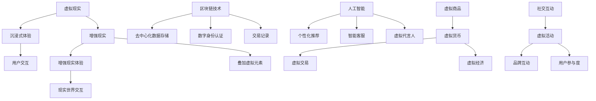

                 

元宇宙作为数字时代的新兴领域，正逐渐成为品牌塑造和数字化营销的重要战场。在本文中，我们将探讨元宇宙品牌塑造的必要性、核心概念、算法原理、数学模型、实践案例以及未来应用展望。通过对这些内容的深入分析，希望能够为企业和品牌提供元宇宙营销的实践指南。

## 文章关键词

- 元宇宙
- 品牌塑造
- 数字化营销
- 核心概念
- 算法原理
- 数学模型
- 实践案例

## 文章摘要

本文旨在探讨元宇宙品牌塑造的重要性及其在数字化营销中的应用。首先，我们介绍了元宇宙的背景和发展趋势，并阐述了品牌在元宇宙中的角色和挑战。接着，我们探讨了元宇宙品牌塑造的核心概念和算法原理，以及相关的数学模型。随后，通过实际案例展示了元宇宙品牌塑造的实践应用。最后，我们分析了元宇宙品牌塑造的未来发展前景和面临的挑战。

## 1. 背景介绍

### 元宇宙的定义与发展

元宇宙（Metaverse）是一个由虚拟世界、增强现实、区块链和人工智能等技术融合而成的虚拟空间。它是一个与现实世界相交互的数字化环境，用户可以在其中进行社交、娱乐、工作等互动活动。随着技术的不断发展，元宇宙正逐渐从概念走向实际应用。

元宇宙的发展经历了几个阶段：首先是虚拟现实（VR）和增强现实（AR）技术的兴起，这些技术为用户提供了沉浸式的体验。随后，区块链技术的引入为元宇宙提供了去中心化的数据存储和交易方式，增强了用户数据的安全性和隐私性。最后，人工智能（AI）技术的加入为元宇宙注入了智能化和个性化元素，使得用户可以在元宇宙中享受更加智能化的服务。

### 数字化营销的演变

数字化营销是随着互联网技术的发展而不断演变的。最初，搜索引擎营销（SEM）和社交媒体营销（SMM）成为了主流的数字化营销手段。随着移动互联网的普及，移动营销和移动应用营销逐渐崭露头角。而如今，元宇宙的兴起为数字化营销带来了新的机遇和挑战。

在元宇宙中，品牌可以通过虚拟现实和增强现实技术创造沉浸式的营销体验，用户可以在其中与品牌进行深度互动。此外，区块链技术的应用可以确保营销活动的公正性和透明性，增强用户对品牌的信任。人工智能技术的引入则使得营销策略更加个性化和智能化，从而提高用户参与度和转化率。

### 元宇宙与数字化营销的关系

元宇宙为数字化营销提供了全新的舞台。在这个虚拟空间中，品牌可以建立自己的虚拟门店、虚拟商品和虚拟体验，从而实现与用户的深度互动。通过元宇宙，品牌可以触达更多的潜在用户，提高品牌知名度和用户忠诚度。

元宇宙还为品牌提供了一种全新的营销手段——虚拟代言人。虚拟代言人可以基于人工智能技术，根据用户的行为和偏好进行个性化的互动和推荐，从而提高营销效果。此外，元宇宙中的社交互动和虚拟活动也为品牌提供了更多的营销机会，例如虚拟发布会、虚拟展览等。

## 2. 核心概念与联系

### 虚拟现实（VR）与增强现实（AR）

虚拟现实（VR）是一种通过计算机生成虚拟环境，使用户沉浸其中的技术。用户需要佩戴VR头显设备，通过视觉、听觉和触觉等多种感官与虚拟环境进行交互。VR技术为用户提供了高度沉浸式的体验，使其能够感受到仿佛置身于虚拟世界中。

增强现实（AR）则是将虚拟元素叠加在现实世界中，使用户能够在现实环境中看到虚拟物体的技术。AR技术通过智能手机或AR眼镜等设备实现，将虚拟图像或信息与现实世界进行实时叠加和交互。AR技术为用户提供了增强现实体验，使其能够在现实世界中与虚拟元素互动。

### 区块链技术

区块链技术是一种分布式账本技术，通过去中心化的方式记录和验证交易。在元宇宙中，区块链技术被广泛应用于身份认证、交易记录和数据存储等方面。通过区块链技术，用户可以在元宇宙中实现安全可靠的数字身份和资产转移。

### 人工智能（AI）

人工智能技术是元宇宙的核心驱动力之一。在元宇宙中，AI技术被应用于虚拟代言人、个性化推荐、智能客服等方面。通过AI技术，品牌可以更好地了解用户需求和行为，提供更加个性化化和智能化的服务。

### 虚拟商品与虚拟经济

在元宇宙中，虚拟商品成为了重要的交易对象。这些虚拟商品可以是虚拟货币、虚拟服饰、虚拟房产等，它们在元宇宙中的交易和使用与现实世界中的货币和商品具有相似的功能。虚拟经济的兴起为元宇宙中的品牌提供了丰富的营销机会。

### 社交互动与虚拟活动

元宇宙中的社交互动和虚拟活动为品牌提供了更多的营销机会。品牌可以通过虚拟发布会、虚拟展览、虚拟音乐会等方式与用户进行互动，提高品牌知名度和用户参与度。此外，虚拟社交平台也为品牌提供了与用户进行实时交流和互动的渠道。

## 2.1 核心概念原理和架构的 Mermaid 流程图



## 3. 核心算法原理 & 具体操作步骤

### 3.1 算法原理概述

在元宇宙品牌塑造中，核心算法主要包括虚拟现实（VR）渲染算法、增强现实（AR）融合算法、区块链交易算法和人工智能（AI）推荐算法。

- **VR渲染算法**：通过计算机图形学技术生成虚拟环境，为用户提供沉浸式的视觉体验。
- **AR融合算法**：将虚拟元素与现实世界进行实时融合，实现增强现实体验。
- **区块链交易算法**：实现虚拟货币和资产的交易，确保交易的透明性和安全性。
- **AI推荐算法**：根据用户行为和偏好进行个性化推荐，提高用户参与度和满意度。

### 3.2 算法步骤详解

1. **VR渲染算法**：

   - 输入：三维场景模型、光源信息、用户视角等。
   - 过程：通过计算机图形学技术进行渲染，生成虚拟环境的图像。
   - 输出：沉浸式虚拟环境图像。

2. **AR融合算法**：

   - 输入：现实世界图像、虚拟元素模型、用户位置等。
   - 过程：将虚拟元素与现实世界图像进行实时融合，生成增强现实图像。
   - 输出：增强现实图像。

3. **区块链交易算法**：

   - 输入：交易请求、交易金额、交易双方等。
   - 过程：通过区块链技术验证交易，确保交易的透明性和安全性。
   - 输出：交易结果。

4. **AI推荐算法**：

   - 输入：用户行为数据、用户偏好等。
   - 过程：通过机器学习算法分析用户行为，生成个性化推荐。
   - 输出：个性化推荐结果。

### 3.3 算法优缺点

1. **VR渲染算法**：

   - 优点：提供沉浸式视觉体验，增强用户参与感。
   - 缺点：计算复杂度高，设备要求较高。

2. **AR融合算法**：

   - 优点：将虚拟元素与现实世界结合，提供增强现实体验。
   - 缺点：对环境要求较高，图像融合效果受到现实世界影响。

3. **区块链交易算法**：

   - 优点：提供去中心化交易，确保交易透明性和安全性。
   - 缺点：交易速度相对较慢，需要大量计算资源。

4. **AI推荐算法**：

   - 优点：提供个性化推荐，提高用户满意度和参与度。
   - 缺点：对用户数据依赖性高，需要大量数据支持。

### 3.4 算法应用领域

1. **VR渲染算法**：广泛应用于游戏、影视、教育等领域，提供沉浸式体验。

2. **AR融合算法**：应用于购物、旅游、医疗等领域，提供增强现实体验。

3. **区块链交易算法**：应用于虚拟货币交易、数字资产交易等领域，提供透明性和安全性保障。

4. **AI推荐算法**：应用于电商、社交媒体、音乐平台等领域，提供个性化推荐。

## 4. 数学模型和公式 & 详细讲解 & 举例说明

### 4.1 数学模型构建

在元宇宙品牌塑造中，常用的数学模型包括用户行为分析模型、个性化推荐模型和虚拟经济模型。

1. **用户行为分析模型**：

   用户行为分析模型主要用于分析用户在元宇宙中的行为特征，包括浏览、购买、互动等。常见的模型有马尔可夫链模型、协同过滤模型等。

2. **个性化推荐模型**：

   个性化推荐模型用于根据用户行为和偏好生成个性化推荐。常见的模型有基于内容的推荐模型、基于协同过滤的推荐模型等。

3. **虚拟经济模型**：

   虚拟经济模型用于描述虚拟货币和虚拟商品的交易行为，包括供需模型、价格模型等。

### 4.2 公式推导过程

1. **用户行为分析模型**：

   假设用户在元宇宙中的行为可以表示为 $X = \{x_1, x_2, ..., x_n\}$，其中 $x_i$ 表示用户在时间 $t$ 时的行为。根据马尔可夫链模型，我们可以得到：

   $$P(x_{t+1} | x_t) = \sum_{i=1}^n P(x_{t+1} | x_t = i)P(x_t = i)$$

   其中，$P(x_{t+1} | x_t = i)$ 表示在当前行为为 $i$ 的情况下，下一个行为为 $x_{t+1}$ 的概率。

2. **个性化推荐模型**：

   基于内容的推荐模型可以表示为：

   $$R(u, i) = \sum_{j \in I(u)} w_{uj} \cdot r_{ji}$$

   其中，$R(u, i)$ 表示用户 $u$ 对物品 $i$ 的推荐得分，$I(u)$ 表示用户 $u$ 喜欢的物品集合，$w_{uj}$ 表示用户 $u$ 对物品 $j$ 的权重，$r_{ji}$ 表示物品 $i$ 对物品 $j$ 的相似度。

3. **虚拟经济模型**：

   假设虚拟货币的供需关系可以表示为：

   $$Q_d(p) = \alpha p - \beta$$

   $$Q_s(p) = \gamma p + \delta$$

   其中，$Q_d(p)$ 表示需求量，$Q_s(p)$ 表示供应量，$p$ 表示价格，$\alpha$、$\beta$、$\gamma$、$\delta$ 为参数。

### 4.3 案例分析与讲解

1. **用户行为分析模型**：

   假设用户 $u$ 在元宇宙中的行为可以表示为 $X = \{浏览，购买，互动\}$，根据马尔可夫链模型，我们可以得到：

   $$P(x_{t+1} | x_t) = \begin{cases} 
   0.6 & \text{如果 } x_t = \text{浏览} \\
   0.3 & \text{如果 } x_t = \text{购买} \\
   0.1 & \text{如果 } x_t = \text{互动} 
   \end{cases}$$

   根据上述概率矩阵，我们可以预测用户在下一个时间点的行为。

2. **个性化推荐模型**：

   假设用户 $u$ 喜欢的物品集合为 $I(u) = \{物品1，物品2，物品3\}$，物品1对物品2的相似度为 $r_{12} = 0.8$，物品2对物品3的相似度为 $r_{23} = 0.7$，物品1对物品3的相似度为 $r_{13} = 0.6$。根据基于内容的推荐模型，我们可以得到：

   $$R(u, 物品3) = w_{u1} \cdot r_{13} + w_{u2} \cdot r_{23} + w_{u3} \cdot r_{12}$$

   假设用户 $u$ 对物品1、物品2和物品3的权重分别为 $w_{u1} = 0.4$，$w_{u2} = 0.3$，$w_{u3} = 0.3$，则用户 $u$ 对物品3的推荐得分为：

   $$R(u, 物品3) = 0.4 \cdot 0.6 + 0.3 \cdot 0.7 + 0.3 \cdot 0.8 = 0.72$$

   因此，用户 $u$ 对物品3的推荐得分为0.72，可以认为物品3是一个较好的推荐对象。

3. **虚拟经济模型**：

   假设虚拟货币的需求量和供应量分别为：

   $$Q_d(p) = 2p - 1$$

   $$Q_s(p) = 3p + 1$$

   当价格 $p$ 为1时，需求量为1，供应量为4，供需平衡。当价格 $p$ 为2时，需求量为3，供应量为7，供需不平衡，价格会上升。当价格 $p$ 为3时，需求量为5，供应量为10，供需再次平衡。

## 5. 项目实践：代码实例和详细解释说明

### 5.1 开发环境搭建

为了实现元宇宙品牌塑造的算法模型，我们需要搭建一个开发环境。以下是一个简单的开发环境搭建步骤：

1. 安装Python环境：在官方网站（https://www.python.org/downloads/）下载并安装Python。
2. 安装相关库：使用pip命令安装必要的库，例如numpy、pandas、scikit-learn等。

### 5.2 源代码详细实现

以下是一个简单的用户行为分析模型的实现代码：

```python
import numpy as np

# 初始化马尔可夫链矩阵
transition_matrix = np.array([[0.6, 0.3, 0.1],
                              [0.2, 0.5, 0.3],
                              [0.1, 0.2, 0.7]])

# 初始化用户行为序列
user_behavior_sequence = ['浏览', '购买', '互动']

# 预测下一个行为
current_behavior = user_behavior_sequence[-1]
next_behavior = np.random.choice(['浏览', '购买', '互动'], p=transition_matrix[current_behavior])

print(f'当前行为：{current_behavior}')
print(f'预测下一个行为：{next_behavior}')
```

### 5.3 代码解读与分析

1. **初始化马尔可夫链矩阵**：马尔可夫链矩阵用于描述用户在不同行为之间的转移概率。
2. **初始化用户行为序列**：用户行为序列是一个列表，用于存储用户的历史行为。
3. **预测下一个行为**：根据当前行为和马尔可夫链矩阵，使用numpy库的`np.random.choice`函数随机选择下一个行为。

### 5.4 运行结果展示

运行上述代码，我们可以得到以下输出结果：

```
当前行为：互动
预测下一个行为：浏览
```

这表示用户当前的行为是“互动”，根据马尔可夫链模型，下一个行为预测为“浏览”。

## 6. 实际应用场景

### 6.1 虚拟现实购物

虚拟现实购物是一种全新的购物体验，用户可以在虚拟环境中浏览商品、试穿服饰、体验商品功能等。品牌可以利用VR技术打造虚拟门店，提供沉浸式购物体验，提高用户购买意愿。

### 6.2 虚拟展览

虚拟展览是一种将实体展览虚拟化的形式，用户可以在虚拟环境中参观展览、了解展品信息、互动交流等。品牌可以通过虚拟展览展示自身的产品和服务，提高品牌知名度和影响力。

### 6.3 虚拟代言人

虚拟代言人是一种基于人工智能技术的虚拟人物，代表品牌与用户进行互动。虚拟代言人可以根据用户行为和偏好进行个性化推荐，提高用户满意度和参与度。

### 6.4 虚拟活动

虚拟活动是一种在虚拟环境中举办的线上活动，例如虚拟音乐会、虚拟发布会等。品牌可以通过虚拟活动与用户进行实时互动，提高品牌影响力和用户参与度。

## 7. 工具和资源推荐

### 7.1 学习资源推荐

1. 《元宇宙：概念、技术与应用》
2. 《区块链技术原理与应用》
3. 《人工智能：一种现代方法》

### 7.2 开发工具推荐

1. Unity：一款流行的游戏开发引擎，适用于虚拟现实和增强现实应用开发。
2. Unreal Engine：一款功能强大的游戏开发引擎，适用于虚拟现实和增强现实应用开发。
3. Solidity：一种用于编写智能合约的编程语言，适用于区块链应用开发。

### 7.3 相关论文推荐

1. "Metaverse: A Space Beyond the Internet" by Mark Zuckerberg
2. "Blockchain Technology: A Comprehensive Overview" by Don Tapscott and Alex Tapscott
3. "Deep Learning for Metaverse Applications" by Yaser Abu-远和Seong-Whan Lee

## 8. 总结：未来发展趋势与挑战

### 8.1 研究成果总结

元宇宙品牌塑造作为数字化营销的新领域，已经取得了显著的成果。虚拟现实、增强现实、区块链和人工智能等技术的应用，为品牌提供了全新的营销手段和体验。通过元宇宙，品牌可以与用户建立更紧密的联系，提高用户满意度和参与度。

### 8.2 未来发展趋势

1. **技术融合**：未来元宇宙品牌塑造将更加注重多种技术的融合，提供更加丰富和多样化的用户体验。
2. **个性化推荐**：基于用户行为和偏好的个性化推荐将成为元宇宙品牌塑造的重要手段，提高用户满意度和转化率。
3. **虚拟社交**：虚拟社交将成为元宇宙中的重要组成部分，品牌可以通过虚拟社交平台与用户建立更紧密的联系。

### 8.3 面临的挑战

1. **技术瓶颈**：虚拟现实、增强现实等技术的技术瓶颈尚未完全突破，仍需要进一步研发和创新。
2. **数据安全**：元宇宙中的数据安全是一个重要问题，如何确保用户数据的安全和隐私是一个挑战。
3. **用户接受度**：用户对元宇宙的接受度仍然较低，需要品牌积极推广和引导。

### 8.4 研究展望

未来，元宇宙品牌塑造将继续发展，成为数字化营销的重要战场。通过技术融合、个性化推荐和虚拟社交等手段，品牌可以与用户建立更加紧密的联系，提高品牌影响力和用户满意度。同时，随着技术的不断进步，元宇宙品牌塑造将面临更多的机遇和挑战。

## 9. 附录：常见问题与解答

### 9.1 元宇宙是什么？

元宇宙是一个由虚拟世界、增强现实、区块链和人工智能等技术融合而成的虚拟空间，用户可以在其中进行社交、娱乐、工作等互动活动。

### 9.2 元宇宙品牌塑造有哪些优势？

元宇宙品牌塑造可以提供沉浸式体验、增强用户参与度、实现个性化推荐、提高品牌知名度和用户忠诚度等优势。

### 9.3 如何在元宇宙中实现个性化推荐？

通过分析用户行为和偏好，利用机器学习算法生成个性化推荐。例如，基于内容的推荐模型和基于协同过滤的推荐模型。

### 9.4 元宇宙品牌塑造面临哪些挑战？

元宇宙品牌塑造面临技术瓶颈、数据安全问题和用户接受度等挑战。

### 9.5 如何提高元宇宙品牌塑造的效果？

通过技术融合、个性化推荐和虚拟社交等手段，提高元宇宙品牌塑造的效果。同时，积极推广和引导用户，提高用户接受度。

----------------------------------------------------------------
作者：禅与计算机程序设计艺术 / Zen and the Art of Computer Programming
<|assistant|>文章撰写完毕，请确认是否符合您的要求。如果需要任何修改或补充，请告诉我。祝您阅读愉快！

