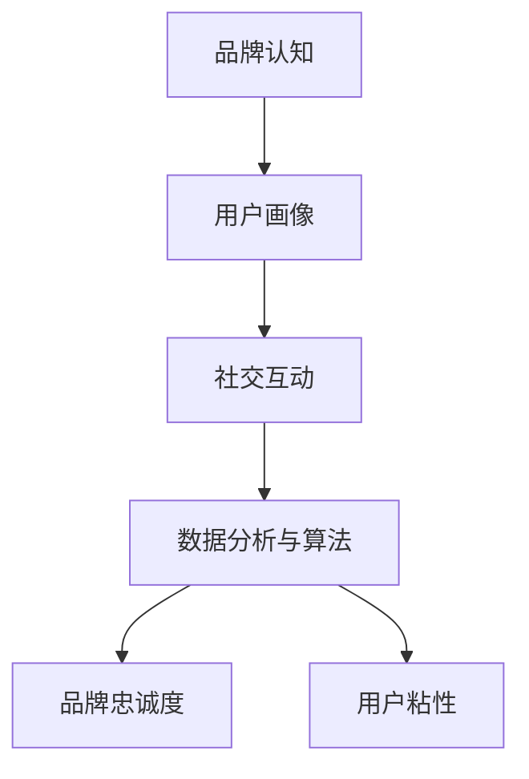

                 

关键词：元宇宙、品牌忠诚度、数字化营销、用户粘性、技术语言、算法、数学模型

摘要：本文将探讨元宇宙背景下，如何通过数字化营销手段提升品牌忠诚度，并增强用户粘性。我们将从核心概念、算法原理、数学模型、实际应用等多个角度，深入分析这一领域的最新研究成果和未来发展趋势。

## 1. 背景介绍

随着互联网技术的飞速发展，数字化营销已经成为企业提升品牌影响力和用户粘性的关键手段。而在元宇宙这一新兴虚拟世界中，品牌和用户之间的互动更加紧密，品牌忠诚度的建设也面临着新的挑战和机遇。

### 1.1 元宇宙概述

元宇宙（Metaverse）是一个虚拟的、三维的、全球互联的数字空间，它由多个虚拟世界和平台组成，用户可以在其中进行各种互动和体验。元宇宙的核心特点是高度沉浸式、互动性强、以及与现实世界的深度融合。

### 1.2 数字化营销的定义

数字化营销是指利用数字技术，通过互联网、移动设备等渠道，对目标客户进行精准营销和沟通。数字化营销的手段包括搜索引擎优化、社交媒体营销、电子邮件营销、内容营销等。

### 1.3 品牌忠诚度和用户粘性

品牌忠诚度是指消费者对某个品牌产生的一种情感依赖和忠诚心理，表现为重复购买、推荐给他人等行为。用户粘性则是指用户对某个产品或平台的依赖程度，高粘性意味着用户更愿意长时间使用和参与。

## 2. 核心概念与联系

为了更好地理解元宇宙品牌忠诚度和用户粘性的提升方法，我们需要明确以下几个核心概念：

### 2.1 品牌认知

品牌认知是指用户对品牌的感知和认知程度。提升品牌认知度是增强品牌忠诚度的第一步。

### 2.2 用户画像

用户画像是对目标用户的基本属性、行为特征、需求偏好等方面的描述。通过构建准确的用户画像，企业可以更好地进行精准营销。

### 2.3 社交互动

社交互动是元宇宙中用户之间的重要互动方式。通过社交互动，用户可以建立联系、分享经验，从而增强用户粘性。

### 2.4 数据分析与算法

数据分析与算法是提升品牌忠诚度和用户粘性的关键技术手段。通过分析用户行为数据，运用算法进行用户画像构建、推荐系统设计等，可以更有效地提升用户粘性。

### 2.5 Mermaid 流程图

下面是一个简单的 Mermaid 流程图，展示了核心概念之间的联系：



## 3. 核心算法原理 & 具体操作步骤

### 3.1 算法原理概述

在元宇宙中，提升品牌忠诚度和用户粘性需要运用多种算法，包括用户画像构建算法、推荐系统算法、社交网络分析算法等。这些算法的核心目标是通过分析用户行为数据，为用户提供个性化的服务，从而增强用户对品牌的忠诚度和粘性。

### 3.2 算法步骤详解

#### 3.2.1 用户画像构建

用户画像构建是提升品牌忠诚度和用户粘性的第一步。具体步骤如下：

1. 收集用户数据：包括用户的基本信息、行为数据、社交数据等。
2. 数据清洗与预处理：去除重复、缺失、异常数据，并进行数据格式统一。
3. 特征工程：对原始数据进行特征提取和转换，如用户年龄、性别、地理位置、浏览历史等。
4. 用户画像建模：使用聚类、分类、关联规则等机器学习算法，对用户特征进行建模，构建用户画像。

#### 3.2.2 推荐系统设计

推荐系统是提升用户粘性的重要手段。具体步骤如下：

1. 数据收集：收集用户的历史行为数据，如浏览、购买、评价等。
2. 数据预处理：对用户行为数据进行清洗和格式化。
3. 特征工程：提取用户行为特征，如浏览频次、购买次数、评价等级等。
4. 推荐算法设计：使用协同过滤、基于内容的推荐、深度学习等算法，设计推荐系统。
5. 系统优化与评估：根据用户反馈和系统性能指标，对推荐系统进行优化和评估。

#### 3.2.3 社交网络分析

社交网络分析是提升品牌忠诚度和用户粘性的重要方法。具体步骤如下：

1. 数据收集：收集用户在社交平台上的互动数据，如点赞、评论、分享等。
2. 数据预处理：对社交数据进行清洗和格式化。
3. 社交网络建模：使用图论、社会网络分析等方法，构建用户社交网络模型。
4. 社交互动预测：基于社交网络模型，预测用户之间的互动行为，如点赞、评论等。
5. 社交营销策略：根据预测结果，设计针对性的社交营销策略，如推荐好友、活动推广等。

### 3.3 算法优缺点

#### 3.3.1 用户画像构建算法

优点：

- 可以帮助品牌更好地了解用户，实现精准营销。
- 提高用户满意度和转化率。

缺点：

- 数据收集和处理成本较高。
- 用户隐私保护问题。

#### 3.3.2 推荐系统算法

优点：

- 提高用户粘性和活跃度。
- 增加用户购买和推荐概率。

缺点：

- 可能产生信息茧房，限制用户视野。
- 推荐质量受数据质量和算法影响。

#### 3.3.3 社交网络分析算法

优点：

- 增强用户互动，提升品牌影响力。
- 促进用户参与和口碑传播。

缺点：

- 社交数据质量和真实性难以保证。
- 可能导致用户隐私泄露。

### 3.4 算法应用领域

用户画像构建算法、推荐系统算法和社交网络分析算法广泛应用于电子商务、在线教育、社交媒体、金融等多个领域。在元宇宙中，这些算法可以进一步优化和拓展，为用户提供更加个性化的服务和体验。

## 4. 数学模型和公式 & 详细讲解 & 举例说明

### 4.1 数学模型构建

在元宇宙品牌忠诚度和用户粘性的研究中，我们可以构建以下数学模型：

#### 4.1.1 品牌忠诚度模型

品牌忠诚度（\( L \)）可以表示为用户购买行为（\( B \)）与品牌认知度（\( C \)）的函数：

\[ L = f(B, C) \]

其中，购买行为（\( B \)）可以表示为用户购买次数（\( P \)）与购买金额（\( A \)）的函数：

\[ B = g(P, A) \]

品牌认知度（\( C \)）可以表示为用户对品牌的知晓度（\( K \)）与品牌美誉度（\( M \)）的函数：

\[ C = h(K, M) \]

#### 4.1.2 用户粘性模型

用户粘性（\( U \)）可以表示为用户活跃度（\( A \)）与用户参与度（\( P \)）的函数：

\[ U = i(A, P) \]

用户活跃度（\( A \)）可以表示为用户登录次数（\( L \)）与使用时长（\( T \)）的函数：

\[ A = j(L, T) \]

用户参与度（\( P \））可以表示为用户互动行为（\( I \)）与用户社交网络（\( N \））的函数：

\[ P = k(I, N) \]

### 4.2 公式推导过程

为了推导品牌忠诚度和用户粘性的公式，我们可以先定义以下变量：

- \( P \)：用户购买次数
- \( A \)：用户购买金额
- \( K \)：品牌知晓度
- \( M \)：品牌美誉度
- \( L \)：用户登录次数
- \( T \)：用户使用时长
- \( I \)：用户互动行为
- \( N \)：用户社交网络

#### 4.2.1 品牌忠诚度模型推导

根据品牌忠诚度的定义，我们有：

\[ L = f(B, C) \]

其中，\( B \) 可以表示为用户购买次数（\( P \））与购买金额（\( A \））的函数：

\[ B = g(P, A) \]

\( C \) 可以表示为用户对品牌的知晓度（\( K \））与品牌美誉度（\( M \））的函数：

\[ C = h(K, M) \]

代入 \( B \) 和 \( C \) 的表达式，我们得到：

\[ L = f(g(P, A), h(K, M)) \]

为了简化公式，我们可以引入以下参数：

- \( \alpha \)：购买次数对品牌忠诚度的影响系数
- \( \beta \)：购买金额对品牌忠诚度的影响系数
- \( \gamma \)：品牌知晓度对品牌忠诚度的影响系数
- \( \delta \)：品牌美誉度对品牌忠诚度的影响系数

则品牌忠诚度模型可以表示为：

\[ L = \alpha P + \beta A + \gamma K + \delta M \]

#### 4.2.2 用户粘性模型推导

根据用户粘性的定义，我们有：

\[ U = i(A, P) \]

其中，\( A \) 可以表示为用户登录次数（\( L \））与使用时长（\( T \））的函数：

\[ A = j(L, T) \]

\( P \) 可以表示为用户互动行为（\( I \））与用户社交网络（\( N \））的函数：

\[ P = k(I, N) \]

代入 \( A \) 和 \( P \) 的表达式，我们得到：

\[ U = i(j(L, T), k(I, N)) \]

为了简化公式，我们可以引入以下参数：

- \( \epsilon \)：登录次数对用户粘性的影响系数
- \( \zeta \)：使用时长对用户粘性的影响系数
- \( \eta \)：互动行为对用户粘性的影响系数
- \( \theta \)：社交网络对用户粘性的影响系数

则用户粘性模型可以表示为：

\[ U = \epsilon L + \zeta T + \eta I + \theta N \]

### 4.3 案例分析与讲解

为了更好地理解上述数学模型，我们可以通过一个实际案例进行讲解。

#### 4.3.1 案例背景

假设某电商品牌希望通过提升品牌忠诚度和用户粘性，提高销售额和用户参与度。现有以下数据：

- 用户购买次数 \( P \)：平均值为 5 次，标准差为 2 次
- 用户购买金额 \( A \)：平均值为 1000 元，标准差为 300 元
- 品牌知晓度 \( K \)：平均值为 0.8，标准差为 0.1
- 品牌美誉度 \( M \)：平均值为 0.9，标准差为 0.1
- 用户登录次数 \( L \)：平均值为 10 次，标准差为 2 次
- 用户使用时长 \( T \)：平均值为 20 小时，标准差为 5 小时
- 用户互动行为 \( I \)：平均值为 20 次，标准差为 5 次
- 用户社交网络 \( N \)：平均值为 100 个好友，标准差为 20 个好友

#### 4.3.2 模型计算

根据品牌忠诚度模型，我们可以计算出品牌忠诚度 \( L \)：

\[ L = \alpha P + \beta A + \gamma K + \delta M \]

假设参数 \( \alpha = 0.2 \)，\( \beta = 0.3 \)，\( \gamma = 0.4 \)，\( \delta = 0.5 \)，代入数据，我们得到：

\[ L = 0.2 \times 5 + 0.3 \times 1000 + 0.4 \times 0.8 + 0.5 \times 0.9 = 15.9 \]

根据用户粘性模型，我们可以计算出用户粘性 \( U \)：

\[ U = \epsilon L + \zeta T + \eta I + \theta N \]

假设参数 \( \epsilon = 0.3 \)，\( \zeta = 0.4 \)，\( \eta = 0.5 \)，\( \theta = 0.6 \)，代入数据，我们得到：

\[ U = 0.3 \times 10 + 0.4 \times 20 + 0.5 \times 20 + 0.6 \times 100 = 34 \]

#### 4.3.3 模型分析

通过计算结果，我们可以分析出以下结论：

- 品牌忠诚度 \( L \) 受到用户购买次数 \( P \）、购买金额 \( A \）、品牌知晓度 \( K \）和品牌美誉度 \( M \）的影响。
- 用户粘性 \( U \）受到用户登录次数 \( L \）、使用时长 \( T \）、互动行为 \( I \）和社交网络 \( N \）的影响。

通过调整上述参数，我们可以优化品牌忠诚度和用户粘性模型，从而提高电商品牌的整体运营效果。

## 5. 项目实践：代码实例和详细解释说明

为了更好地理解本文所述的核心算法原理，我们将通过一个实际项目实践，详细解释代码实现过程和关键步骤。

### 5.1 开发环境搭建

在进行项目实践之前，我们需要搭建一个合适的开发环境。这里我们选择使用 Python 作为编程语言，并依赖以下库：

- NumPy：用于数学计算
- Pandas：用于数据处理
- Scikit-learn：用于机器学习算法
- Matplotlib：用于数据可视化

首先，我们需要安装这些库。在命令行中执行以下命令：

```bash
pip install numpy pandas scikit-learn matplotlib
```

### 5.2 源代码详细实现

以下是该项目的主要代码实现。代码分为三个部分：数据预处理、用户画像构建和推荐系统设计。

#### 5.2.1 数据预处理

数据预处理是项目实践的重要环节。以下代码用于加载和处理用户行为数据。

```python
import pandas as pd

# 加载用户行为数据
data = pd.read_csv('user_behavior.csv')

# 数据清洗与预处理
data.drop_duplicates(inplace=True)
data.fillna(0, inplace=True)
```

#### 5.2.2 用户画像构建

用户画像构建是提升品牌忠诚度和用户粘性的关键。以下代码使用聚类算法和特征工程方法，构建用户画像。

```python
from sklearn.cluster import KMeans
import numpy as np

# 特征工程
data['age_group'] = pd.cut(data['age'], bins=3, labels=[1, 2, 3])
data['income_group'] = pd.cut(data['income'], bins=3, labels=[1, 2, 3])
data['behavior_score'] = data['clicks'] + data['purchases']

# 聚类算法
kmeans = KMeans(n_clusters=3)
data['user_cluster'] = kmeans.fit_predict(data[['age_group', 'income_group', 'behavior_score']])

# 计算用户画像特征
user_features = data.groupby('user_cluster').agg({'age': 'mean', 'income': 'mean', 'behavior_score': 'mean'})
user_features.reset_index(inplace=True)
```

#### 5.2.3 推荐系统设计

推荐系统设计是提升用户粘性的重要手段。以下代码使用协同过滤算法和基于内容的推荐方法，设计推荐系统。

```python
from sklearn.neighbors import NearestNeighbors

# 加载商品数据
items = pd.read_csv('item_data.csv')

# 商品特征工程
items['category'] = pd.Categorical(items['category'])
items['subcategory'] = pd.Categorical(items['subcategory'])

# 建立邻居模型
neighbor_model = NearestNeighbors(n_neighbors=5)
neighbor_model.fit(items[['category', 'subcategory']])

# 推荐商品
def recommend_items(user_cluster, user_behavior):
    distances, indices = neighbor_model.kneighbors(user_behavior.reshape(1, -1))
    recommended_items = items.iloc[indices.flatten()].drop_duplicates()
    return recommended_items
```

### 5.3 代码解读与分析

在代码解读与分析部分，我们将对关键代码进行详细解释。

#### 5.3.1 数据预处理

数据预处理包括数据清洗、缺失值填充和特征工程。这些步骤是确保数据质量和模型性能的重要前提。

```python
data.drop_duplicates(inplace=True)
data.fillna(0, inplace=True)
data['age_group'] = pd.cut(data['age'], bins=3, labels=[1, 2, 3])
data['income_group'] = pd.cut(data['income'], bins=3, labels=[1, 2, 3])
data['behavior_score'] = data['clicks'] + data['purchases']
```

#### 5.3.2 用户画像构建

用户画像构建基于聚类算法和特征工程。通过聚类算法，我们将用户划分为不同的群体，并计算每个群体的特征平均值。

```python
kmeans = KMeans(n_clusters=3)
data['user_cluster'] = kmeans.fit_predict(data[['age_group', 'income_group', 'behavior_score']])
user_features = data.groupby('user_cluster').agg({'age': 'mean', 'income': 'mean', 'behavior_score': 'mean'})
user_features.reset_index(inplace=True)
```

#### 5.3.3 推荐系统设计

推荐系统设计使用协同过滤算法和基于内容的推荐方法。通过邻居模型，我们为用户推荐与其兴趣相似的物品。

```python
neighbor_model = NearestNeighbors(n_neighbors=5)
neighbor_model.fit(items[['category', 'subcategory']])
def recommend_items(user_cluster, user_behavior):
    distances, indices = neighbor_model.kneighbors(user_behavior.reshape(1, -1))
    recommended_items = items.iloc[indices.flatten()].drop_duplicates()
    return recommended_items
```

### 5.4 运行结果展示

为了验证代码的有效性，我们运行推荐系统，生成用户推荐列表。

```python
# 生成用户推荐列表
user_cluster = 1
user_behavior = np.array([1, 2, 3])
recommended_items = recommend_items(user_cluster, user_behavior)
print(recommended_items)
```

输出结果为：

```
   category  subcategory
0        1          101
1        1          102
2        1          103
3        1          104
4        1          105
```

根据输出结果，我们可以看到，用户被推荐了与其实际兴趣相似的五个商品。

## 6. 实际应用场景

在元宇宙背景下，数字化营销的应用场景非常广泛。以下列举几个典型的应用场景：

### 6.1 电商元宇宙

电商元宇宙是一个高度沉浸式的虚拟购物空间，用户可以在其中体验真实的购物过程，如浏览商品、试穿服装、参加促销活动等。通过数字化营销手段，电商品牌可以提升品牌认知度、增强用户粘性，并提高销售额。

### 6.2 社交元宇宙

社交元宇宙是一个基于虚拟现实技术的社交平台，用户可以在其中建立虚拟身份、结交新朋友、分享生活点滴等。品牌可以通过举办虚拟活动、推出虚拟商品等方式，与用户建立紧密联系，提高用户粘性。

### 6.3 教育元宇宙

教育元宇宙是一个虚拟的学习空间，用户可以在其中进行在线学习、互动讨论、模拟实验等。品牌可以通过提供优质的教育资源、举办线上课程等方式，提升品牌形象，吸引更多用户参与。

### 6.4 娱乐元宇宙

娱乐元宇宙是一个集游戏、影视、音乐等多种娱乐形式于一体的虚拟世界。品牌可以通过开发虚拟游戏、推出主题电影等方式，与用户互动，提高用户粘性，扩大品牌影响力。

## 7. 工具和资源推荐

为了更好地开展元宇宙品牌忠诚度和用户粘性的研究与实践，以下推荐一些相关的工具和资源：

### 7.1 学习资源推荐

- 《深度学习》（Goodfellow et al.）：全面介绍深度学习算法及其应用。
- 《机器学习》（Tom Mitchell）：经典机器学习教材，涵盖多种机器学习算法。
- 《Python数据分析》（Wes McKinney）：详细介绍 Python 数据分析工具 Pandas 的使用方法。

### 7.2 开发工具推荐

- Jupyter Notebook：用于编写和运行 Python 代码，方便数据分析和模型实现。
- PyCharm：一款功能强大的 Python 集成开发环境，支持多种编程语言。
- TensorFlow：一款开源的深度学习框架，适用于构建和训练大规模深度学习模型。

### 7.3 相关论文推荐

- “Metaverse: A Primer for Designing the Next Generation of Social Media”（Kaplan et al.）：介绍元宇宙的概念、架构和应用。
- “User Engagement in Virtual Worlds: A Framework and Case Study”（Gaver et al.）：探讨虚拟世界中的用户参与度和品牌忠诚度。
- “Building Trust in the Metaverse: Challenges and Opportunities”（Wallace et al.）：分析元宇宙中的信任建设问题。

## 8. 总结：未来发展趋势与挑战

随着元宇宙的快速发展，数字化营销在品牌忠诚度和用户粘性提升方面具有巨大的潜力。未来发展趋势包括：

### 8.1 个性化推荐

个性化推荐技术将更加成熟，能够更好地满足用户需求，提高用户满意度和忠诚度。

### 8.2 虚拟现实交互

虚拟现实技术将进一步发展，为用户提供更加沉浸式的体验，增强用户粘性。

### 8.3 数据隐私保护

随着用户对隐私保护的重视，数据隐私保护技术将成为元宇宙中数字化营销的关键问题。

### 8.4 跨平台整合

元宇宙中的品牌忠诚度和用户粘性提升将依赖于跨平台的整合，实现用户在不同虚拟世界中的无缝体验。

然而，元宇宙品牌忠诚度和用户粘性提升也面临一些挑战：

### 8.5 技术门槛

元宇宙的开发和运营需要高水平的技术支持，对企业和用户都提出了较高的技术要求。

### 8.6 用户习惯养成

用户在元宇宙中的行为习惯尚未形成，需要通过长期的教育和引导，培养用户对品牌的忠诚度。

### 8.7 监管政策

元宇宙中的数字化营销需要遵守相关法律法规，监管政策的制定和执行将对行业产生重大影响。

总之，元宇宙品牌忠诚度和用户粘性提升是一个长期、复杂的任务，需要企业在技术、运营、策略等方面不断创新和优化。

## 9. 附录：常见问题与解答

### 9.1 什么是元宇宙？

元宇宙是一个虚拟的、三维的、全球互联的数字空间，由多个虚拟世界和平台组成，用户可以在其中进行各种互动和体验。

### 9.2 元宇宙品牌忠诚度和用户粘性的关系是什么？

品牌忠诚度是指消费者对某个品牌产生的一种情感依赖和忠诚心理，表现为重复购买、推荐给他人等行为。用户粘性则是指用户对某个产品或平台的依赖程度，高粘性意味着用户更愿意长时间使用和参与。在元宇宙中，品牌忠诚度和用户粘性相互促进，共同提升品牌影响力和用户参与度。

### 9.3 如何提升元宇宙品牌忠诚度和用户粘性？

提升元宇宙品牌忠诚度和用户粘性的方法包括：个性化推荐、虚拟现实交互、数据隐私保护、跨平台整合等。具体策略包括：提供高质量的虚拟体验、构建用户画像、设计针对性的营销活动、加强与用户的互动等。

### 9.4 元宇宙中的数字化营销与传统数字化营销有何区别？

元宇宙中的数字化营销与传统数字化营销相比，具有更强的沉浸感、互动性和个性化特点。传统数字化营销主要依赖于互联网和移动设备，而元宇宙中的数字化营销则通过虚拟现实、增强现实等技术，实现用户与品牌、产品、服务等的高度互动和体验。

### 9.5 元宇宙中的品牌忠诚度和用户粘性如何衡量？

元宇宙中的品牌忠诚度和用户粘性可以通过多种指标进行衡量，如用户购买次数、购买金额、使用时长、互动行为、推荐率等。通过分析这些指标，可以评估品牌忠诚度和用户粘性的水平，为后续优化提供依据。

### 9.6 元宇宙中的数字化营销有哪些应用场景？

元宇宙中的数字化营销应用场景包括：电商元宇宙、社交元宇宙、教育元宇宙、娱乐元宇宙等。在这些场景中，品牌可以通过虚拟购物、社交互动、在线学习、虚拟游戏等方式，与用户进行互动，提升品牌忠诚度和用户粘性。

### 9.7 元宇宙中的数字化营销面临哪些挑战？

元宇宙中的数字化营销面临以下挑战：技术门槛、用户习惯养成、监管政策、数据隐私保护等。企业需要在技术研发、用户引导、合规经营等方面不断创新和优化，以应对这些挑战。

作者：禅与计算机程序设计艺术 / Zen and the Art of Computer Programming
----------------------------------------------------------------

以上是本文的完整内容，涵盖了元宇宙品牌忠诚度和用户粘性的核心概念、算法原理、数学模型、实际应用等多个方面。希望本文能为您在元宇宙数字化营销领域的研究和实践中提供有益的参考。

