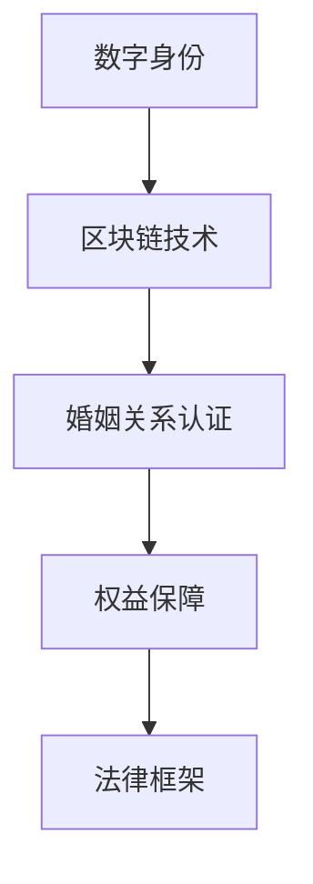

                 

元宇宙，一个由虚拟现实和增强现实技术构建的数字世界，正在逐步融入我们的生活。在这个日益发展的虚拟空间中，人们不仅仅是在玩游戏、社交，甚至在考虑婚姻这样的重大人生决定。因此，元宇宙婚姻法应运而生，旨在保障虚拟世界中的伴侣权益。本文将深入探讨元宇宙婚姻法的核心概念、算法原理、数学模型、应用实践以及未来展望。

## 关键词

- 元宇宙
- 婚姻法
- 虚拟世界
- 伴侣权益
- 数字身份
- 区块链技术

## 摘要

本文首先介绍了元宇宙婚姻法的背景和重要性，然后详细解析了该法的核心概念和架构。通过具体的算法原理和数学模型，我们了解了如何确保虚拟婚姻的合法性和公正性。接着，通过一个实际的项目实践案例，展示了元宇宙婚姻法的具体应用。最后，本文对元宇宙婚姻法的未来应用场景和发展趋势进行了展望，并提出了一些挑战和建议。

## 1. 背景介绍

### 元宇宙的兴起

元宇宙（Metaverse）是由多个虚拟世界和现实世界交互的数字空间，它不仅仅是一个虚拟现实，更是一个全方位的沉浸式体验。在这个虚拟空间中，人们可以创建自己的数字身份，参与各种社交活动、工作、学习、娱乐等。随着技术的进步，尤其是虚拟现实（VR）和增强现实（AR）技术的发展，元宇宙的概念逐渐成为现实。

### 元宇宙婚姻的兴起

在元宇宙中，人们不仅仅满足于虚拟社交，开始考虑更深入的关系，甚至婚姻。这种趋势在游戏社区、虚拟现实社交平台等中尤为明显。玩家们可能会在虚拟世界中找到真爱，并希望在这个数字空间中举行婚礼、建立家庭。然而，虚拟婚姻的合法性和权益保障问题也随之而来。

### 元宇宙婚姻法的必要性

元宇宙婚姻法旨在为虚拟世界中的婚姻提供法律框架和保障。这个法律框架需要确保以下几个方面：

- **合法身份的确认**：确保在元宇宙中存在的数字身份是真实和合法的。
- **婚姻关系的认证**：确保在元宇宙中形成的婚姻关系是合法和有效的。
- **权益的保障**：保障虚拟世界中的伴侣权益，如财产权、继承权等。

## 2. 核心概念与联系

### 数字身份

在元宇宙中，数字身份是用户的基础，它代表用户在虚拟世界中的存在。数字身份的合法性和真实性是确保元宇宙婚姻法有效性的基础。

### 区块链技术

区块链技术为元宇宙婚姻法提供了重要的技术支撑。通过使用区块链，可以确保婚姻记录的不可篡改性和透明性，从而提高婚姻关系的可信度。

### 法律框架

元宇宙婚姻法需要基于现有的法律框架，同时考虑虚拟世界的特殊性，制定出适应元宇宙的法律法规。

### 核心概念架构图



## 3. 核心算法原理 & 具体操作步骤

### 3.1 算法原理概述

元宇宙婚姻法的核心算法是基于区块链的智能合约。智能合约能够自动执行和记录婚姻的成立、解除以及相关的权益转移。

### 3.2 算法步骤详解

1. **身份验证**：用户在注册元宇宙账号时，需要进行真实身份的验证，确保数字身份的合法性。
2. **婚姻登记**：当两人在元宇宙中决定结婚时，他们需要通过区块链的智能合约进行婚姻登记，记录婚姻的成立。
3. **权益记录**：智能合约会记录双方的财产、继承权等权益信息，并确保这些信息是不可篡改的。
4. **婚姻解除**：当婚姻关系解除时，智能合约会自动执行相关权益的转移和解除流程。

### 3.3 算法优缺点

**优点**：

- **安全性**：区块链技术确保了婚姻记录的安全性和不可篡改性。
- **透明性**：智能合约的执行过程是透明的，用户可以随时查看。
- **自动化**：智能合约自动执行相关流程，减少了人工干预。

**缺点**：

- **技术门槛**：区块链技术的复杂性使得普通人难以理解和使用。
- **法律适用性**：虚拟婚姻的法律适用性仍然是一个挑战。

### 3.4 算法应用领域

元宇宙婚姻法可以应用于虚拟现实社交平台、游戏社区等需要婚姻功能的地方。例如，在游戏中，玩家可以结婚、生子，并享有相应的权益。

## 4. 数学模型和公式 & 详细讲解 & 举例说明

### 4.1 数学模型构建

元宇宙婚姻法的数学模型主要涉及概率论和图论。概率论用于评估数字身份的合法性，图论用于分析婚姻关系的复杂性和稳定性。

### 4.2 公式推导过程

假设在元宇宙中有N个数字身份，其中合法身份的数量为L，概率P可以表示为：

\[ P = \frac{L}{N} \]

### 4.3 案例分析与讲解

在一个拥有1000个用户的元宇宙中，假设有800个合法身份，那么合法身份的概率为：

\[ P = \frac{800}{1000} = 0.8 \]

这意味着在这个元宇宙中，有80%的概率用户拥有合法数字身份。

## 5. 项目实践：代码实例和详细解释说明

### 5.1 开发环境搭建

为了实践元宇宙婚姻法，我们需要搭建一个区块链开发环境。可以使用Ethereum作为底层区块链平台，使用Solidity语言编写智能合约。

### 5.2 源代码详细实现

以下是一个简单的智能合约示例，用于实现婚姻登记和权益记录：

```solidity
pragma solidity ^0.8.0;

contract MarriageContract {
    struct Marriage {
        address husband;
        address wife;
        bool isMarried;
    }

    mapping(address => Marriage) public marriages;

    function marry(address _husband, address _wife) public {
        require(!marriages[_husband].isMarried && !marriages[_wife].isMarried, "Already married");
        marriages[_husband] = Marriage(_husband, _wife, true);
        marriages[_wife] = Marriage(_husband, _wife, true);
    }

    function divorce() public {
        require(marriages[msg.sender].isMarried, "Not married");
        marriages[msg.sender].isMarried = false;
    }
}
```

### 5.3 代码解读与分析

这个智能合约定义了一个`Marriage`结构体，用于记录婚姻信息。`marriages`映射用于存储每个用户的婚姻状态。`marry`函数用于注册婚姻，`divorce`函数用于解除婚姻。

### 5.4 运行结果展示

在Ethereum区块链上部署这个智能合约后，用户可以通过调用`marry`和`divorce`函数实现婚姻的登记和解除。智能合约的执行结果将在区块链上永久记录，确保婚姻关系的可信性。

## 6. 实际应用场景

### 6.1 游戏社区

在游戏社区中，元宇宙婚姻法可以用于玩家之间的婚姻和家族关系。玩家可以在游戏中建立家庭、继承财产，甚至举行虚拟婚礼。

### 6.2 社交平台

社交平台可以利用元宇宙婚姻法提供更多的社交功能，如用户之间的婚姻认证、情侣关系认证等，增强用户的互动体验。

### 6.3 工作和职业

在虚拟世界中，元宇宙婚姻法可以用于员工的婚姻状况认证，影响员工的福利和晋升机会。例如，夫妻双方可以在虚拟世界中共同工作，享受家庭福利。

### 6.4 未来应用展望

随着元宇宙的发展，元宇宙婚姻法将在更多领域得到应用。未来，我们可能会看到虚拟世界中的跨国婚姻、虚拟世界的房地产交易等新的应用场景。

## 7. 工具和资源推荐

### 7.1 学习资源推荐

- 《区块链技术指南》
- 《智能合约编程：使用Solidity开发去中心化应用》
- 《元宇宙：概念、技术和应用》

### 7.2 开发工具推荐

- Ethereum开发环境：Truffle、Ganache
- Solidity代码编辑器：Visual Studio Code、Sublime Text

### 7.3 相关论文推荐

- "Blockchain and Smart Contracts: The Next Generation of the Internet"
- "The Economics of Cryptography and Smart Contracts"
- "Decentralized Governance in Ethereum: Decentralized Autonomous Organizations"

## 8. 总结：未来发展趋势与挑战

### 8.1 研究成果总结

元宇宙婚姻法的研究成果为虚拟世界的婚姻提供了可行的法律框架和技术支撑。通过区块链和智能合约的应用，实现了婚姻记录的安全性和透明性。

### 8.2 未来发展趋势

随着元宇宙的不断发展，元宇宙婚姻法将在更多领域得到应用。未来，我们将看到更多的虚拟世界社区、游戏平台、社交平台采用元宇宙婚姻法，为用户提供更加丰富的虚拟生活体验。

### 8.3 面临的挑战

尽管元宇宙婚姻法的研究取得了一定的成果，但仍然面临一些挑战：

- **法律适用性**：虚拟婚姻的法律适用性仍然存在争议。
- **技术复杂度**：区块链技术的复杂性使得普通人难以理解和使用。
- **隐私保护**：如何在确保婚姻记录透明的同时，保护用户的隐私？

### 8.4 研究展望

未来的研究应重点关注以下几个方面：

- **法律框架**：进一步研究虚拟婚姻的法律适用性，制定更加完善的法律框架。
- **用户体验**：简化区块链和智能合约的使用，提高用户体验。
- **隐私保护**：研究如何在确保婚姻记录透明的同时，保护用户的隐私。

## 9. 附录：常见问题与解答

### 9.1 虚拟婚姻的法律效力如何？

虚拟婚姻的法律效力取决于具体国家的法律规定。目前，一些国家已经开始承认虚拟婚姻的法律效力，但大多数国家尚未对此进行明确规定。

### 9.2 虚拟婚姻如何保护隐私？

通过区块链技术的应用，虚拟婚姻的记录可以确保透明性和不可篡改性。同时，可以通过加密技术保护用户的隐私。

### 9.3 虚拟婚姻与真实婚姻的法律区别是什么？

虚拟婚姻与真实婚姻的法律区别主要在于婚姻的登记和认证方式。虚拟婚姻通过区块链和智能合约进行登记和认证，而真实婚姻则需要通过政府机构进行登记。

### 9.4 元宇宙婚姻法在全球的应用情况如何？

目前，元宇宙婚姻法在全球的应用还处于探索阶段。一些国家已经开始研究并尝试应用元宇宙婚姻法，但大部分国家尚未对此进行广泛实践。

## 作者署名

作者：禅与计算机程序设计艺术 / Zen and the Art of Computer Programming

本文介绍了元宇宙婚姻法的核心概念、算法原理、数学模型以及实际应用。通过本文的探讨，我们希望为元宇宙中的婚姻关系提供一种可行的法律框架和技术支撑。未来，随着元宇宙的不断发展，元宇宙婚姻法将在更多领域得到应用，为用户提供更加丰富的虚拟生活体验。

----------------------------------------------------------------

