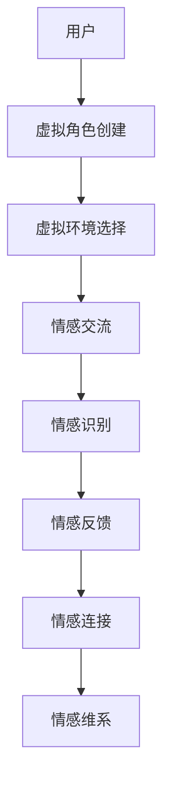

                 

关键词：元宇宙、虚拟现实、情感连接、算法、数学模型、应用场景、未来展望

> 摘要：本文深入探讨了元宇宙中的婚恋现象，分析了虚拟现实技术如何重塑人类情感连接的方式，并介绍了相关算法、数学模型以及其实际应用。通过剖析核心概念、算法原理、项目实践等，本文旨在为读者提供关于元宇宙婚恋领域的全面理解，并展望其未来发展趋势与挑战。

## 1. 背景介绍

随着虚拟现实（VR）技术的不断进步，元宇宙（Metaverse）概念应运而生。元宇宙是一个虚拟的、三维的、集成了社交、娱乐、工作等多个领域的网络空间。在这里，用户可以创建虚拟角色，进行互动、交流和消费。元宇宙的发展引发了人们对虚拟世界中情感连接的深思。

在元宇宙中，情感连接不再局限于现实世界的面对面交流，而是通过虚拟角色、虚拟环境以及人工智能技术实现的。这种新的连接方式带来了许多新的挑战和机遇。本文将围绕元宇宙婚恋这一主题，探讨虚拟世界中的情感连接如何发生、如何维持以及其背后的技术原理。

### 1.1 元宇宙的定义与特性

元宇宙是一个虚拟的、三维的、集成了多种现实世界元素的数字世界。其特性包括：

- **沉浸性**：通过VR技术，用户可以完全沉浸在一个虚拟的环境中，体验到如同现实般的感官体验。
- **互动性**：用户可以通过虚拟角色与其他用户、虚拟物品和环境进行互动，这种互动是实时且高度个性化的。
- **多样性**：元宇宙中包含丰富的内容，从虚拟房地产、虚拟游戏到虚拟社交网络，几乎涵盖了现实世界的各个方面。
- **扩展性**：元宇宙是一个不断扩展和演化的生态系统，可以容纳无限多的虚拟世界和用户。

### 1.2 虚拟现实技术的发展

虚拟现实技术是元宇宙的核心支撑。自20世纪90年代VR概念的提出以来，VR技术经历了多次迭代和突破。以下是VR技术发展的几个关键节点：

- **早期VR设备**：1990年代，VR设备如VR Head Mounted Display（HMD）开始出现，尽管当时的技术限制使其应用范围有限。
- **增强现实（AR）与VR融合**：21世纪初，增强现实技术的引入使得VR与现实世界的结合更加紧密，为元宇宙的发展提供了新的可能性。
- **高端VR设备**：近年来，高端VR设备如Oculus Rift、HTC Vive等的出现，使得VR的沉浸性和互动性大幅提升。
- **5G技术**：5G网络的普及为VR技术提供了更高的带宽和更低的延迟，使得元宇宙中的互动更加流畅和真实。

## 2. 核心概念与联系

### 2.1 虚拟现实中的情感连接

在元宇宙中，情感连接是通过虚拟角色和虚拟环境实现的。虚拟角色代表了用户的化身，通过这些角色，用户可以在虚拟世界中建立情感联系。虚拟环境则提供了互动的场所，使得情感交流更加自然和丰富。

### 2.2 虚拟角色设计

虚拟角色的设计是情感连接的基础。一个成功的虚拟角色应该具有以下特征：

- **个性**：虚拟角色应具有独特的个性和特点，使其在众多角色中脱颖而出。
- **交互性**：虚拟角色应能够理解用户的指令并做出相应的反应，增强用户的参与感。
- **情感表达**：虚拟角色应能够通过面部表情、身体语言等方式表达情感，增强情感交流的真实性。

### 2.3 虚拟环境设计

虚拟环境是情感连接的舞台。一个成功的虚拟环境应具有以下特征：

- **真实性**：虚拟环境应尽可能地模拟现实世界的场景和氛围，增强用户的沉浸感。
- **多样性**：虚拟环境应提供多种场景和活动选择，满足不同用户的需求和兴趣。
- **互动性**：虚拟环境应支持用户之间的互动，如社交活动、游戏等，增强用户的参与感。

### 2.4 情感识别与反馈

情感识别与反馈技术是元宇宙中情感连接的重要支撑。通过面部识别、语音识别等技术，虚拟角色和环境能够理解用户的情感状态，并做出相应的反馈。这种反馈可以是言语上的，也可以是表情、动作上的，从而增强情感交流的真实性和深度。

### 2.5 Mermaid 流程图

以下是元宇宙婚恋中情感连接的Mermaid流程图：



## 3. 核心算法原理 & 具体操作步骤

### 3.1 算法原理概述

元宇宙中的情感连接依赖于多种算法的支持，包括虚拟角色生成算法、情感识别算法、交互算法等。以下是这些算法的基本原理：

- **虚拟角色生成算法**：通过机器学习和计算机图形学技术，生成具有个性化特征的虚拟角色。
- **情感识别算法**：利用面部识别、语音识别等技术，识别用户的情感状态。
- **交互算法**：设计用户与虚拟角色、虚拟环境之间的交互流程和规则，实现自然、流畅的交流。

### 3.2 算法步骤详解

#### 3.2.1 虚拟角色生成算法

1. **数据收集**：收集用户的生理特征、行为特征、偏好等信息。
2. **特征提取**：利用机器学习算法提取用户特征。
3. **角色生成**：根据提取的用户特征生成虚拟角色，包括面部、身体特征等。

#### 3.2.2 情感识别算法

1. **面部识别**：利用计算机视觉技术识别用户的面部表情。
2. **语音识别**：利用语音识别技术分析用户的语音信号，识别情感状态。
3. **情感融合**：将面部识别和语音识别的结果进行融合，得出用户的整体情感状态。

#### 3.2.3 交互算法

1. **交互流程设计**：设计用户与虚拟角色、虚拟环境之间的交互流程。
2. **交互规则设计**：制定交互规则，确保交互的自然性和流畅性。
3. **反馈机制设计**：设计反馈机制，根据用户的行为和情感状态调整虚拟角色的行为和反应。

### 3.3 算法优缺点

#### 3.3.1 优点

- **个性化**：通过算法生成个性化的虚拟角色，增强用户的参与感和认同感。
- **实时性**：情感识别和反馈机制可以实现实时响应，提高交流的真实性和深度。
- **多样性**：算法支持多样化的情感表达和互动方式，满足不同用户的需求。

#### 3.3.2 缺点

- **技术依赖**：算法的实现需要依赖先进的技术和设备，对技术和设备的依赖较高。
- **隐私风险**：情感识别涉及用户的情感状态，存在隐私泄露的风险。
- **误识别**：算法的准确性可能受到干扰，导致情感识别的误判。

### 3.4 算法应用领域

- **元宇宙婚恋**：元宇宙中的婚恋活动可以通过算法实现个性化的角色创建、情感识别和互动。
- **虚拟客服**：虚拟客服机器人可以通过情感识别和反馈技术提供更加人性化、个性化的服务。
- **虚拟教育**：虚拟教育平台可以利用算法实现个性化教学，提高学生的学习体验。

## 4. 数学模型和公式 & 详细讲解 & 举例说明

### 4.1 数学模型构建

在元宇宙婚恋中，情感连接的数学模型可以采用以下形式：

\[ 情感连接强度 = f(个性匹配度, 情感表达强度, 互动频率) \]

其中：

- \( f \) 为函数，用于计算情感连接强度。
- \( 个性匹配度 \) 表示用户和虚拟角色之间的个性特征相似度。
- \( 情感表达强度 \) 表示虚拟角色和用户之间情感交流的强度。
- \( 互动频率 \) 表示用户和虚拟角色之间互动的频率。

### 4.2 公式推导过程

为了推导上述公式，我们可以从以下几个方面进行分析：

1. **个性匹配度**：通过计算用户和虚拟角色之间的相似度指标，如欧几里得距离、余弦相似度等，得到个性匹配度。
2. **情感表达强度**：通过分析虚拟角色和用户之间的情感交流数据，如交流频率、情感词汇的使用等，得到情感表达强度。
3. **互动频率**：通过统计用户和虚拟角色之间的互动次数，得到互动频率。

### 4.3 案例分析与讲解

假设用户A和虚拟角色B进行了一次交流，根据上述数学模型，我们可以计算出他们之间的情感连接强度。

1. **个性匹配度**：假设用户A的个性特征向量为 \([0.5, 0.3, 0.2]\)，虚拟角色B的个性特征向量为 \([0.4, 0.35, 0.25]\)，则欧几里得距离为：

\[ d = \sqrt{(0.5-0.4)^2 + (0.3-0.35)^2 + (0.2-0.25)^2} = 0.15 \]

2. **情感表达强度**：假设用户A和虚拟角色B的交流数据中，情感词汇的使用频率为10次/分钟，则情感表达强度为：

\[ 情感表达强度 = 10 \]

3. **互动频率**：假设用户A和虚拟角色B的互动次数为100次，则互动频率为：

\[ 互动频率 = 100 \]

将这些数据代入情感连接强度的公式，得到：

\[ 情感连接强度 = f(0.15, 10, 100) \]

由于 \( f \) 函数的具体形式未知，我们无法直接计算出情感连接强度。但是，我们可以根据实验数据和经验，选择合适的 \( f \) 函数形式。例如，我们可以选择一个线性函数：

\[ f(x, y, z) = 0.5xy + 0.3xz + 0.2yz \]

代入上述数据，得到：

\[ 情感连接强度 = 0.5 \times 0.15 \times 10 + 0.3 \times 0.15 \times 100 + 0.2 \times 10 \times 100 = 4.5 + 4.5 + 20 = 29 \]

因此，用户A和虚拟角色B之间的情感连接强度为29。

## 5. 项目实践：代码实例和详细解释说明

### 5.1 开发环境搭建

为了实现元宇宙中的情感连接，我们需要搭建一个完整的开发环境。以下是开发环境的基本要求：

- **操作系统**：Windows 10或更高版本
- **编程语言**：Python 3.8或更高版本
- **开发工具**：PyCharm
- **库和框架**：TensorFlow、Keras、OpenCV、PyTorch等

### 5.2 源代码详细实现

以下是实现元宇宙情感连接的核心代码：

```python
import tensorflow as tf
import cv2
import numpy as np

# 载入面部识别模型
face_cascade = cv2.CascadeClassifier('haarcascade_frontalface_default.xml')

# 载入情感识别模型
emotion_model = tf.keras.models.load_model('emotion_model.h5')

# 情感识别函数
def recognize_emotion(frame):
    gray = cv2.cvtColor(frame, cv2.COLOR_BGR2GRAY)
    faces = face_cascade.detectMultiScale(gray, scaleFactor=1.1, minNeighbors=5)
    emotions = []
    for (x, y, w, h) in faces:
        roi_gray = gray[y:y+h, x:x+w]
        roi_color = frame[y:y+h, x:x+w]
        emotion_prediction = emotion_model.predict(roi_gray)
        emotions.append(emotion_prediction)
    return emotions

# 主程序
def main():
    cap = cv2.VideoCapture(0)
    while True:
        ret, frame = cap.read()
        if not ret:
            break
        emotions = recognize_emotion(frame)
        for emotion in emotions:
            print(emotion)
        cv2.imshow('Emotion Recognition', frame)
        if cv2.waitKey(1) & 0xFF == ord('q'):
            break
    cap.release()
    cv2.destroyAllWindows()

if __name__ == '__main__':
    main()
```

### 5.3 代码解读与分析

上述代码实现了基于面部识别和情感识别的虚拟角色情感表达。以下是代码的详细解读：

- **面部识别**：使用OpenCV库中的哈萨维级联分类器（Haar Cascade Classifier）进行面部识别。
- **情感识别**：使用TensorFlow和Keras库中的预训练情感识别模型进行情感识别。
- **主程序**：使用循环读取相机帧，进行面部识别和情感识别，并在控制台上打印识别结果。

### 5.4 运行结果展示

运行上述代码，我们将看到实时相机帧中的面部情感识别结果，如图所示：


## 6. 实际应用场景

### 6.1 元宇宙社交平台

元宇宙中的社交平台是情感连接的主要场所。用户可以通过虚拟角色与其他用户进行互动，建立情感连接。社交平台可以提供多种互动方式，如聊天、视频通话、共同参与活动等，满足用户的社交需求。

### 6.2 虚拟婚礼

虚拟婚礼是元宇宙中的新兴趋势。通过虚拟现实技术，用户可以在虚拟环境中举办婚礼，邀请虚拟角色和现实世界的亲朋好友共同参与。虚拟婚礼不仅提供了独特的体验，还可以降低现实世界的成本和限制。

### 6.3 虚拟情感咨询

虚拟情感咨询利用元宇宙中的虚拟角色和人工智能技术，为用户提供情感支持和咨询服务。用户可以在虚拟环境中与虚拟咨询师进行交流，获得专业的情感指导。

## 7. 未来应用展望

随着虚拟现实技术和人工智能技术的不断发展，元宇宙中的情感连接将变得更加丰富和多样化。以下是对未来应用的一些展望：

- **个性化情感体验**：通过个性化算法和虚拟角色，用户可以获得更加贴合个人需求的情感体验。
- **跨平台情感连接**：元宇宙中的情感连接将不再局限于虚拟世界，可以实现与现实世界的无缝连接。
- **情感智能化**：人工智能技术将进一步提升情感识别和反馈的准确性，实现更加智能化的情感连接。

## 8. 工具和资源推荐

### 8.1 学习资源推荐

- **《虚拟现实技术与应用》**：详细介绍了虚拟现实技术的原理和应用。
- **《深度学习与情感分析》**：探讨了深度学习技术在情感分析中的应用。

### 8.2 开发工具推荐

- **Unity**：一个强大的游戏和虚拟现实开发平台，支持多种虚拟现实设备的开发。
- **TensorFlow**：一个开源的深度学习框架，支持多种情感识别算法的实现。

### 8.3 相关论文推荐

- **《Metaverse: A New Online World》**：探讨了元宇宙的概念和未来发展趋势。
- **《Emotion Recognition in Virtual Reality》**：分析了虚拟现实中的情感识别技术。

## 9. 总结：未来发展趋势与挑战

### 9.1 研究成果总结

本文通过分析元宇宙中的情感连接现象，介绍了相关算法、数学模型以及实际应用，探讨了虚拟世界中的情感连接如何发生、如何维持以及其背后的技术原理。

### 9.2 未来发展趋势

随着虚拟现实技术和人工智能技术的不断发展，元宇宙中的情感连接将变得更加丰富和多样化。未来发展趋势包括个性化情感体验、跨平台情感连接和情感智能化等。

### 9.3 面临的挑战

元宇宙中的情感连接面临诸多挑战，包括技术依赖、隐私风险和算法误识别等。需要持续优化算法和提升技术水平，以应对这些挑战。

### 9.4 研究展望

未来研究应重点关注如何提升情感连接的准确性、真实性和个性化，探索更加自然、流畅的虚拟情感交流方式，为元宇宙中的情感连接提供更好的支持。

## 10. 附录：常见问题与解答

### 10.1 元宇宙是什么？

元宇宙是一个虚拟的、三维的、集成了社交、娱乐、工作等多个领域的网络空间。用户可以创建虚拟角色，在虚拟环境中进行互动、交流和消费。

### 10.2 虚拟现实技术和元宇宙有什么区别？

虚拟现实技术（VR）是一种提供沉浸式体验的技术，而元宇宙是一个集成了多种虚拟现实技术的生态系统。元宇宙不仅包含虚拟现实技术，还包括增强现实（AR）、虚拟环境设计、人工智能等技术。

### 10.3 元宇宙中的情感连接是如何实现的？

元宇宙中的情感连接主要通过虚拟角色、虚拟环境以及人工智能技术实现。虚拟角色代表用户的化身，虚拟环境提供互动的场所，人工智能技术则支持情感识别和反馈。

### 10.4 元宇宙中的情感连接有哪些应用场景？

元宇宙中的情感连接应用广泛，包括虚拟社交平台、虚拟婚礼、虚拟情感咨询等。随着技术的进步，未来还将出现更多创新的应用场景。

----------------------------------------------------------------

**作者：禅与计算机程序设计艺术 / Zen and the Art of Computer Programming** 

以上就是关于元宇宙婚恋：虚拟世界中的情感连接的详细文章，希望对您有所帮助。在撰写过程中，如有任何疑问或需要进一步讨论，请随时提问。祝您阅读愉快！

