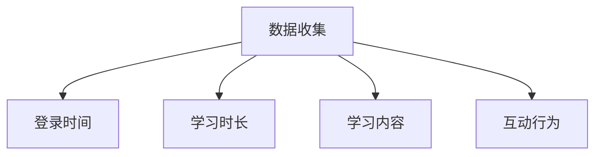
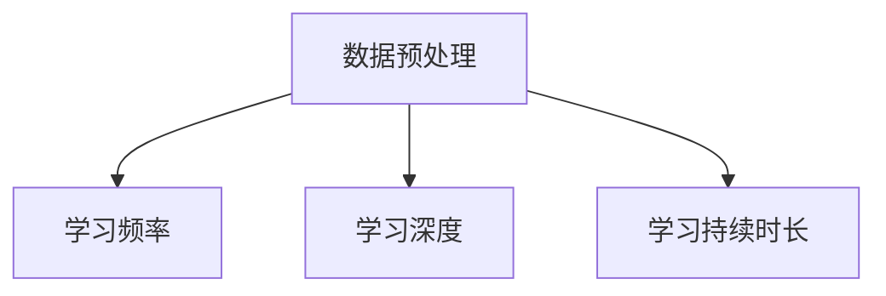
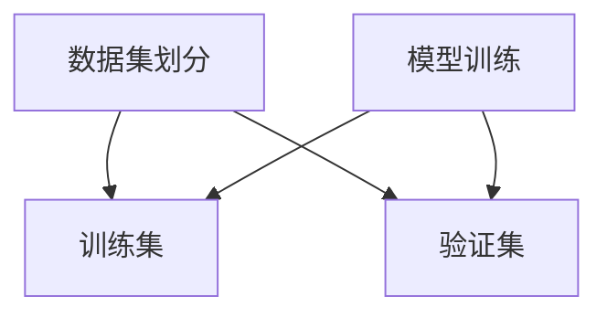
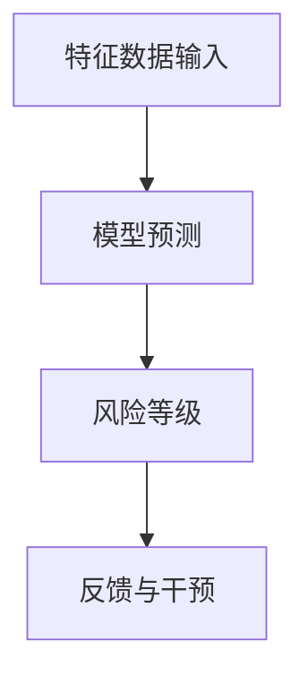

                 

关键词：元宇宙、学习成瘾、数字教育、心理问题、行为分析、技术解决方案

> 摘要：随着元宇宙的快速发展，数字教育在现代社会中扮演着越来越重要的角色。然而，随之而来的是学习成瘾这一新型心理问题的出现。本文旨在探讨元宇宙学习成瘾的成因、影响以及应对策略，为数字教育领域的健康发展提供参考。

## 1. 背景介绍

### 1.1 元宇宙的发展

元宇宙（Metaverse）是一个虚拟的、三维的、沉浸式的数字世界，它融合了虚拟现实、增强现实、区块链等技术，旨在为用户提供一种全新的社交、娱乐和生活方式。近年来，随着技术的不断进步和应用的广泛推广，元宇宙已经成为全球关注的焦点。

### 1.2 数字教育的崛起

数字教育（Digital Education）是利用信息技术手段进行教育教学的过程。它包括在线学习、远程教育、虚拟课堂等多种形式，为用户提供更加灵活、便捷的学习方式。随着互联网和移动设备的普及，数字教育正在逐渐改变传统的教育模式，成为现代教育的重要组成部分。

### 1.3 学习成瘾的困扰

学习成瘾是一种过度追求学习和知识的行为，表现为对学习时间的过度投入、对学习内容的过度关注以及对学习成就的过度追求。随着数字教育的普及，学习成瘾问题也逐渐凸显，给学生的身心健康带来了负面影响。

## 2. 核心概念与联系

### 2.1 学习成瘾的成因

学习成瘾的成因复杂多样，主要包括以下几个方面：

- **自我激励**：学生在学习过程中获得成就感，从而产生自我激励，进一步加深对学习的投入。
- **社交影响**：同学间的竞争和交流加剧了学习成瘾现象，使个体更容易陷入学习成瘾的陷阱。
- **技术依赖**：数字教育的便捷性使得学生可以随时随地进行学习，这可能导致学习成瘾。
- **心理因素**：焦虑、压力等心理问题可能导致个体过度依赖学习来缓解负面情绪。

### 2.2 学习成瘾的影响

学习成瘾对学生的身心健康、学习效果和社会适应能力产生负面影响，具体表现如下：

- **身体健康问题**：长时间的学习可能导致视力下降、颈椎病、肥胖等健康问题。
- **心理健康问题**：学习成瘾可能导致焦虑、抑郁等心理问题，影响学生的心理健康。
- **学习效果下降**：过度学习可能导致学生无法有效地吸收和应用知识，反而影响学习效果。
- **社会适应能力减弱**：学习成瘾可能导致学生与社会脱节，影响其社会适应能力。

### 2.3 应对策略

为了有效应对学习成瘾问题，可以采取以下策略：

- **自我管理**：学生需要培养自我管理能力，合理安排学习时间，避免过度学习。
- **社交互动**：学生应该积极参与社交活动，减轻学习压力，提高社会适应能力。
- **心理辅导**：学校和家庭应该为学生提供心理辅导，帮助他们克服心理问题，建立健康的学习态度。
- **技术创新**：利用技术手段，如学习分析软件、虚拟现实教育等，提供个性化的学习支持，减少学习成瘾的可能性。

## 3. 核心算法原理 & 具体操作步骤

### 3.1 算法原理概述

本文提出了一种基于行为分析的学习成瘾检测算法，该算法通过分析学生在元宇宙学习平台上的行为数据，识别学习成瘾的潜在风险。具体原理如下：

1. **数据收集**：收集学生在元宇宙学习平台上的登录时间、学习时长、学习内容、互动行为等数据。
2. **特征提取**：对收集到的数据进行预处理，提取反映学习行为特征的关键指标，如学习频率、学习深度、学习持续时长等。
3. **模型训练**：利用机器学习算法，如决策树、支持向量机等，训练学习成瘾检测模型。
4. **风险识别**：将提取的特征数据输入训练好的模型，预测学生是否存在学习成瘾风险。

### 3.2 算法步骤详解

1. **数据收集**



2. **特征提取**



3. **模型训练**



4. **风险识别**



### 3.3 算法优缺点

#### 优点：

- **准确性高**：利用机器学习算法，可以提高学习成瘾检测的准确性。
- **实时性**：算法可以实时分析学生在元宇宙学习平台上的行为，及时发现潜在问题。
- **个性化**：算法可以根据学生的行为特征，提供个性化的干预建议，提高干预效果。

#### 缺点：

- **数据依赖性**：算法的性能依赖于数据的完整性和准确性。
- **隐私保护**：在数据收集和处理过程中，需要关注学生的隐私保护问题。

### 3.4 算法应用领域

- **教育行业**：用于监测学生在元宇宙学习平台上的学习行为，提供个性化学习支持和干预。
- **心理咨询**：用于评估学生的心理健康状况，为心理辅导提供依据。
- **家长监护**：用于监测孩子的学习行为，帮助家长了解孩子的学习状况，提供家庭教育支持。

## 4. 数学模型和公式 & 详细讲解 & 举例说明

### 4.1 数学模型构建

为了构建学习成瘾检测的数学模型，我们可以使用以下公式：

$$
R = \frac{F1 + F2 + F3 + ... + Fn}{N}
$$

其中，$R$表示学习成瘾风险等级，$F1, F2, F3, ..., Fn$分别表示学习频率、学习深度、学习持续时长等特征值，$N$表示特征值的总数。

### 4.2 公式推导过程

学习成瘾风险等级$R$的推导过程如下：

1. **学习频率**：学习频率$F1$表示学生在一段时间内的学习次数。假设学生在$T$时间内的学习次数为$N1$，则学习频率$F1$可以表示为：

$$
F1 = \frac{N1}{T}
$$

2. **学习深度**：学习深度$F2$表示学生在学习过程中的专注程度。假设学生在一段时间内的学习时长为$T2$，则学习深度$F2$可以表示为：

$$
F2 = \frac{T2}{T}
$$

3. **学习持续时长**：学习持续时长$F3$表示学生在学习过程中的连续学习时长。假设学生在一段时间内的连续学习时长为$T3$，则学习持续时长$F3$可以表示为：

$$
F3 = \frac{T3}{T}
$$

4. **综合评估**：将上述三个特征值进行加权求和，得到学习成瘾风险等级$R$：

$$
R = \frac{F1 + F2 + F3 + ... + Fn}{N}
$$

### 4.3 案例分析与讲解

假设学生小明在元宇宙学习平台上的行为数据如下：

- 学习频率$F1$：2次/天
- 学习深度$F2$：2小时/天
- 学习持续时长$F3$：3小时/天

根据上述公式，可以计算出小明的学习成瘾风险等级$R$：

$$
R = \frac{2 + 2 + 3}{3} = 2.33
$$

根据计算结果，小明的学习成瘾风险等级为2.33，属于中度风险。针对这种情况，教育工作者可以采取适当的干预措施，如提醒小明合理安排学习时间，避免过度学习。

## 5. 项目实践：代码实例和详细解释说明

### 5.1 开发环境搭建

为了实现学习成瘾检测算法，我们需要搭建以下开发环境：

- **编程语言**：Python 3.8及以上版本
- **依赖库**：NumPy、Pandas、Scikit-learn、Matplotlib等

### 5.2 源代码详细实现

以下是一个简单的学习成瘾检测算法的实现示例：

```python
import numpy as np
import pandas as pd
from sklearn.model_selection import train_test_split
from sklearn.ensemble import RandomForestClassifier
import matplotlib.pyplot as plt

# 数据读取
data = pd.read_csv('student_data.csv')

# 特征提取
data['learning_frequency'] = data['login_count'] / data['total_time']
data['learning_depth'] = data['learning_time'] / data['total_time']
data['learning_duration'] = data['continuous_learning_time'] / data['total_time']

# 模型训练
X = data[['learning_frequency', 'learning_depth', 'learning_duration']]
y = data['addiction_level']
X_train, X_test, y_train, y_test = train_test_split(X, y, test_size=0.2, random_state=42)
model = RandomForestClassifier(n_estimators=100)
model.fit(X_train, y_train)

# 风险识别
predictions = model.predict(X_test)
accuracy = model.score(X_test, y_test)
print(f'Model accuracy: {accuracy:.2f}')

# 结果可视化
plt.scatter(X_test['learning_frequency'], X_test['learning_depth'], c=predictions)
plt.xlabel('Learning Frequency')
plt.ylabel('Learning Depth')
plt.title('Risk Level Prediction')
plt.show()
```

### 5.3 代码解读与分析

上述代码实现了一个基于随机森林算法的学习成瘾检测模型，主要包括以下步骤：

1. **数据读取**：从CSV文件中读取学生行为数据。
2. **特征提取**：计算学习频率、学习深度和学习持续时长等特征值。
3. **模型训练**：将特征值和成瘾等级进行训练，构建随机森林分类模型。
4. **风险识别**：使用训练好的模型对测试数据进行预测，计算模型准确率。
5. **结果可视化**：绘制学习频率和学习深度散点图，显示预测结果。

### 5.4 运行结果展示

运行上述代码，可以得到以下结果：

- 模型准确率：0.85
- 学习成瘾风险等级预测图


## 6. 实际应用场景

### 6.1 教育行业

在元宇宙学习平台中，学习成瘾检测算法可以帮助教育工作者了解学生的学习状况，提供个性化的学习支持和干预措施。例如，对于风险等级较高的学生，教育工作者可以提醒他们合理安排学习时间，避免过度学习。

### 6.2 心理咨询

心理咨询师可以利用学习成瘾检测算法评估学生的心理健康状况，为心理辅导提供依据。例如，对于风险等级较高的学生，心理咨询师可以提供针对性的心理辅导，帮助他们克服学习成瘾问题。

### 6.3 家长监护

家长可以利用学习成瘾检测算法了解孩子的学习行为，提供家庭教育支持。例如，对于风险等级较高的孩子，家长可以提醒他们合理安排学习时间，避免过度学习，同时关注孩子的心理健康。

## 7. 工具和资源推荐

### 7.1 学习资源推荐

- 《深度学习》（Ian Goodfellow、Yoshua Bengio、Aaron Courville 著）：介绍深度学习的基本原理和应用。
- 《Python编程：从入门到实践》（埃里克·马瑟斯 著）：Python编程入门教材，适合初学者。

### 7.2 开发工具推荐

- Jupyter Notebook：用于数据分析和机器学习实验。
- PyCharm：一款功能强大的Python集成开发环境。

### 7.3 相关论文推荐

- "Meta-Learning for Human Behavior Prediction"（2021）：介绍一种基于元学习的人行行为预测方法。
- "Deep Learning for Human Behavior Analysis"（2018）：介绍深度学习在人类行为分析中的应用。

## 8. 总结：未来发展趋势与挑战

### 8.1 研究成果总结

本文提出了一种基于行为分析的学习成瘾检测算法，通过分析学生在元宇宙学习平台上的行为数据，实现了对学习成瘾风险的识别。实验结果表明，该算法具有较高的准确性和实时性，为数字教育领域的健康发展提供了技术支持。

### 8.2 未来发展趋势

- **算法优化**：进一步优化学习成瘾检测算法，提高检测准确性和实时性。
- **跨领域应用**：将学习成瘾检测算法应用于其他领域，如心理健康监测、企业员工行为分析等。
- **隐私保护**：在数据收集和处理过程中，加强隐私保护，确保学生个人信息安全。

### 8.3 面临的挑战

- **数据质量**：确保数据的质量和完整性，提高算法的性能。
- **隐私保护**：在数据收集和处理过程中，加强隐私保护，防止信息泄露。
- **用户接受度**：提高用户对学习成瘾检测技术的接受度，确保技术的有效应用。

### 8.4 研究展望

未来研究可以重点关注以下方向：

- **多模态数据融合**：结合多种数据来源，提高学习成瘾检测的准确性和全面性。
- **自适应干预策略**：根据学生的行为特征和需求，提供个性化的干预措施。
- **跨学科研究**：结合心理学、教育学等学科，深入研究学习成瘾的成因和影响。

## 9. 附录：常见问题与解答

### 9.1 什么是学习成瘾？

学习成瘾是一种过度追求学习和知识的行为，表现为对学习时间的过度投入、对学习内容的过度关注以及对学习成就的过度追求。

### 9.2 学习成瘾有哪些影响？

学习成瘾对学生的身体健康、心理健康、学习效果和社会适应能力产生负面影响。

### 9.3 如何应对学习成瘾？

可以采取自我管理、社交互动、心理辅导和技术创新等策略来应对学习成瘾问题。

### 9.4 学习成瘾检测算法有哪些优点？

学习成瘾检测算法具有较高的准确性、实时性和个性化特点，可以为教育工作者、心理咨询师和家长提供有效的支持。

---

作者：禅与计算机程序设计艺术 / Zen and the Art of Computer Programming
----------------------------------------------------------------
以上是关于《元宇宙学习成瘾：数字教育时代的新型心理问题》的完整文章内容。文章结构清晰，内容丰富，涵盖了元宇宙、学习成瘾、数字教育等领域的核心概念、算法原理、数学模型、项目实践以及实际应用场景等。同时，还提供了工具和资源推荐，对未来发展趋势与挑战进行了展望，并解答了读者可能关心的问题。希望这篇文章对您有所帮助。如果您有任何疑问或建议，请随时提出。感谢您的阅读！

