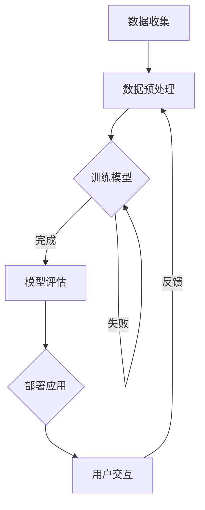

                 

关键词：元宇宙，大型语言模型，虚拟世界，构建，AI 技术创新，数据驱动发展

## 摘要

本文将深入探讨如何利用大型语言模型（LLM）打造虚拟世界，这是元宇宙建设中的一个关键步骤。通过对LLM的核心概念、技术原理、算法实现以及实际应用场景的详细分析，我们旨在为读者提供一整套系统化的解决方案，助力他们理解并掌握构建虚拟世界的方法。同时，本文还将展望元宇宙未来的发展趋势与挑战，为读者提供宝贵的研究参考。

## 1. 背景介绍

在当今技术快速发展的时代，元宇宙（Metaverse）已经成为一个热门话题。元宇宙是一个由虚拟现实（VR）、增强现实（AR）和其他数字技术构建的全球性虚拟空间，它为用户提供了沉浸式的交互体验。在这个虚拟世界中，用户可以创造、分享、探索和体验各种不同的场景和内容。

随着人工智能技术的不断进步，尤其是大型语言模型（LLM）的崛起，构建元宇宙的路径变得更加清晰。LLM是一类能够理解和生成人类语言的高级AI模型，其强大的语言处理能力使得构建虚拟世界成为可能。通过LLM，我们可以模拟人类语言交流，生成丰富多样的内容，甚至为虚拟世界中的NPC（非玩家角色）赋予智能，使其能够与用户进行自然交互。

本文将详细探讨如何利用LLM来打造虚拟世界，从核心概念到具体实现，从算法原理到应用实践，提供全方位的技术解读。同时，我们还将分析元宇宙在各个领域的实际应用场景，以及其未来的发展趋势和挑战。

### 1.1 元宇宙的概念与特点

元宇宙是一个虚拟的、三维的、沉浸式的网络空间，它不仅仅是一个游戏或社交平台，而是一个涵盖教育、工作、娱乐、社交等多方面生活体验的全球性网络。元宇宙的核心特点是：

- **沉浸感**：通过VR、AR等先进技术，用户可以感受到如同现实世界般的沉浸体验。
- **互动性**：用户可以在元宇宙中与其他用户和虚拟角色进行实时互动，创造和共享内容。
- **多样性**：元宇宙提供了多样化的场景和内容，包括虚拟城市、虚拟商店、虚拟校园等。
- **扩展性**：元宇宙是一个开放的平台，可以不断扩展和更新，容纳更多的用户和内容。

### 1.2 大型语言模型（LLM）的概念与特点

大型语言模型（LLM）是一类基于深度学习的语言处理模型，能够理解和生成自然语言。它们通常具有以下特点：

- **规模庞大**：LLM通常由数亿甚至数十亿的参数构成，具有非常高的计算能力和语言理解能力。
- **训练数据丰富**：LLM的训练数据来自大量的互联网文本、书籍、新闻、社交媒体等，具有广泛的语言覆盖。
- **自适应性强**：LLM可以通过不断的学习和训练，适应不同的语言场景和需求。

### 1.3 LLM与元宇宙建设的关系

LLM在元宇宙建设中扮演了重要角色，主要体现在以下几个方面：

- **内容生成**：LLM可以生成丰富的虚拟世界内容，包括场景描述、对话文本、角色行为等。
- **智能交互**：LLM可以模拟人类的语言交流，使虚拟世界中的NPC具有智能，与用户进行自然交互。
- **个性化体验**：LLM可以根据用户的行为和偏好，提供个性化的虚拟世界体验。
- **语言理解**：LLM可以帮助元宇宙理解和处理用户的自然语言输入，实现智能问答、语音识别等功能。

通过LLM的应用，元宇宙的沉浸感、互动性和多样性得到了显著提升，为用户提供了更加丰富和真实的虚拟体验。接下来，我们将进一步探讨LLM的核心概念、技术原理和算法实现，为元宇宙建设提供技术支持。

## 2. 核心概念与联系

在深入探讨如何利用LLM打造虚拟世界之前，我们需要了解一些核心概念，包括虚拟世界、人工智能、深度学习和自然语言处理等。这些概念之间的联系和相互作用是理解LLM在元宇宙建设中作用的关键。

### 2.1 虚拟世界的概念

虚拟世界是一个通过计算机技术和网络构建的、模拟现实世界的三维空间。它可以是完全虚拟的，也可以是现实世界的增强或扩展。虚拟世界具有以下几个特点：

- **三维空间**：虚拟世界通常在三维空间中进行，用户可以在其中自由移动和探索。
- **交互性**：用户可以在虚拟世界中与其他用户和虚拟对象进行互动。
- **沉浸感**：通过VR、AR等技术的应用，用户可以感受到高度沉浸的体验。
- **多样性**：虚拟世界可以模拟各种不同的环境和场景，如城市、乡村、校园等。

### 2.2 人工智能的概念

人工智能（AI）是指计算机系统模拟人类智能行为的能力，包括感知、学习、推理、决策等。人工智能可以分为两大类：弱人工智能和强人工智能。

- **弱人工智能**：弱人工智能是指专注于特定任务的人工智能系统，如语音识别、图像识别等。这类系统通常在特定的应用场景中表现出色。
- **强人工智能**：强人工智能是指具有普遍智能的人工智能系统，能够像人类一样在多种任务中表现出色。目前，强人工智能仍处于理论阶段，尚未实现。

### 2.3 深度学习的概念

深度学习是一种基于多层神经网络的机器学习技术，通过训练大量的数据来学习复杂的模式。深度学习在图像识别、语音识别、自然语言处理等领域取得了显著的成果。

- **神经网络**：神经网络是由大量神经元连接而成的计算模型，能够通过学习数据来提取特征和进行预测。
- **多层神经网络**：多层神经网络通过增加隐含层来提高模型的复杂度和学习能力，从而更好地拟合数据。

### 2.4 自然语言处理的概念

自然语言处理（NLP）是人工智能的一个重要分支，旨在使计算机能够理解和处理人类语言。NLP包括词法分析、句法分析、语义分析、语音识别等。

- **词法分析**：词法分析是将文本分解为单词或其他语法单位的过程。
- **句法分析**：句法分析是分析句子结构的过程，以确定句子中的语法关系。
- **语义分析**：语义分析是理解句子含义的过程，以确定句子的真实意义。
- **语音识别**：语音识别是将语音转换为文本的过程，是实现人机语音交互的关键技术。

### 2.5 LLM与虚拟世界的关系

LLM作为一种强大的自然语言处理技术，与虚拟世界有着密切的联系。LLM可以生成丰富的虚拟世界内容，包括对话文本、场景描述等，为用户提供了更加真实和丰富的虚拟体验。

- **内容生成**：LLM可以通过学习大量的文本数据，生成各种虚拟世界内容，如对话文本、故事情节等。
- **智能交互**：LLM可以模拟人类的语言交流，使虚拟世界中的NPC具有智能，能够与用户进行自然交互。
- **个性化体验**：LLM可以根据用户的行为和偏好，提供个性化的虚拟世界体验。
- **语言理解**：LLM可以帮助元宇宙理解和处理用户的自然语言输入，实现智能问答、语音识别等功能。

综上所述，LLM在虚拟世界建设中扮演了关键角色，通过其强大的自然语言处理能力，为虚拟世界提供了丰富的内容和智能交互功能。

### 2.6 Mermaid 流程图

为了更好地展示LLM在虚拟世界构建中的流程和原理，我们可以使用Mermaid流程图来描述。以下是一个简化的Mermaid流程图示例：



在这个流程图中，我们展示了从数据收集到用户交互的整个过程。数据收集阶段包括获取大量的文本数据；数据预处理阶段包括清洗、分词、去停用词等操作；模型训练阶段使用深度学习算法对数据集进行训练；模型评估阶段通过测试集来评估模型的性能；部署应用阶段将训练好的模型部署到虚拟世界应用中；用户交互阶段则涉及用户与虚拟世界中的NPC进行交互。

通过这个流程图，我们可以清晰地看到LLM在虚拟世界构建中的关键环节，以及各个环节之间的相互关系。

## 3. 核心算法原理 & 具体操作步骤

在了解了LLM与虚拟世界建设的基本概念和联系之后，接下来我们将深入探讨LLM的核心算法原理和具体操作步骤。这将为读者提供构建虚拟世界的理论基础和实际操作指南。

### 3.1 算法原理概述

LLM的核心算法原理基于深度学习和自然语言处理技术，尤其是基于Transformer架构的模型。Transformer模型通过自注意力机制（Self-Attention）对输入文本进行加权处理，从而提取出文本中的关键特征。LLM的训练过程主要包括以下几个步骤：

1. **数据收集与预处理**：收集大量的文本数据，并进行清洗、分词、去停用词等预处理操作，将文本转化为模型可处理的输入格式。
2. **模型初始化**：初始化Transformer模型的结构，包括编码器和解码器，并设置初始参数。
3. **模型训练**：使用训练数据进行模型训练，通过反向传播算法不断调整模型参数，使模型能够更好地理解和生成自然语言。
4. **模型评估与调优**：使用测试集对训练好的模型进行评估，并根据评估结果对模型进行调整和优化。
5. **模型部署**：将训练好的模型部署到虚拟世界中，使其能够为用户提供自然语言交互服务。

### 3.2 算法步骤详解

下面我们将详细描述LLM的核心算法步骤：

#### 3.2.1 数据收集与预处理

数据收集是构建LLM的第一步，需要收集大量的文本数据，这些数据可以来自互联网、书籍、新闻、社交媒体等。数据收集之后，需要进行预处理，包括以下步骤：

- **文本清洗**：去除文本中的噪声，如HTML标签、特殊符号等。
- **分词**：将文本分解为单词或词组，以便模型进行理解和处理。
- **去停用词**：去除对模型训练无贡献的停用词，如“的”、“了”、“在”等。

#### 3.2.2 模型初始化

在预处理完数据后，我们需要初始化Transformer模型的结构。Transformer模型由编码器（Encoder）和解码器（Decoder）两部分组成，编码器负责将输入文本编码为向量，解码器负责将编码后的向量解码为输出文本。模型的初始化包括设置模型的层数、隐藏层大小、激活函数等。

#### 3.2.3 模型训练

模型训练是LLM构建过程中的关键步骤，主要通过以下方式进行：

- **前向传播**：将输入文本经过编码器，得到编码后的向量；然后将这些向量输入到解码器，生成输出文本。
- **损失计算**：计算生成的输出文本与真实文本之间的损失，通常使用交叉熵损失函数。
- **反向传播**：根据损失函数计算梯度，并通过梯度下降算法更新模型参数。
- **迭代训练**：重复上述步骤，不断迭代训练，直至模型收敛。

#### 3.2.4 模型评估与调优

模型训练完成后，需要使用测试集对模型进行评估，以检查模型在实际应用中的性能。常用的评估指标包括准确率、召回率、F1 分数等。根据评估结果，对模型进行调整和优化，以提高其性能。

#### 3.2.5 模型部署

训练好的LLM模型可以部署到虚拟世界中，为用户提供自然语言交互服务。部署过程中，需要考虑以下问题：

- **资源分配**：为模型部署提供足够的计算资源和存储空间。
- **性能优化**：对模型进行性能优化，以确保其能够高效地处理用户的自然语言请求。
- **安全性**：确保模型部署的安全性，防止数据泄露和恶意攻击。

### 3.3 算法优缺点

LLM在虚拟世界建设中有许多优点，但也存在一些缺点：

- **优点**：
  - 强大的语言处理能力：LLM能够理解和生成自然语言，为用户提供了丰富的交互体验。
  - 适应性：LLM可以不断学习和适应不同的语言场景和需求，提供个性化的服务。
  - 多样性：LLM可以生成各种不同类型的文本内容，丰富了虚拟世界的多样性。

- **缺点**：
  - 计算资源需求大：构建和训练LLM模型需要大量的计算资源和存储空间，对硬件设施要求较高。
  - 数据依赖性强：LLM的训练数据质量直接影响模型的性能，需要大量的高质量数据进行训练。
  - 解释性不足：由于LLM是基于深度学习的模型，其决策过程往往缺乏透明性和解释性。

### 3.4 算法应用领域

LLM在虚拟世界建设中的应用领域非常广泛，主要包括：

- **智能客服**：虚拟世界中的智能客服系统可以使用LLM与用户进行自然语言交互，提供24/7的客户服务。
- **虚拟角色**：虚拟世界中的角色可以使用LLM进行语言生成和智能对话，为用户提供沉浸式体验。
- **内容创作**：LLM可以自动生成故事、文章、新闻等内容，为虚拟世界提供丰富的文本内容。
- **教育应用**：虚拟课堂中的教学助手可以使用LLM为学生提供个性化的辅导和解答问题。

通过以上对LLM核心算法原理和具体操作步骤的详细分析，我们可以看到LLM在虚拟世界建设中的重要作用。在下一部分，我们将进一步探讨LLM的数学模型和公式，以及如何通过这些数学模型来实现虚拟世界的构建。

### 4. 数学模型和公式 & 详细讲解 & 举例说明

在深入了解LLM的核心算法原理后，接下来我们将讨论其背后的数学模型和公式，并通过详细的讲解和举例来说明这些数学模型在构建虚拟世界中的具体应用。这些数学模型和公式是LLM能够高效处理自然语言的核心，也是我们理解LLM如何生成和理解语言的关键。

#### 4.1 数学模型构建

LLM的核心数学模型是基于深度学习中的Transformer架构，Transformer架构由多个编码器和解码器层组成。下面我们将分别介绍编码器和解码器中的主要数学模型和公式。

##### 编码器（Encoder）

编码器的主要任务是处理输入文本，将其编码为序列向量。编码器中的关键组件包括：

1. **嵌入层（Embedding Layer）**：将输入单词映射为固定大小的向量。这一步通常通过预训练的词向量实现。
    - **公式**：\[ E_{\text{word}} = W_{\text{embed}} \cdot X \]
    - **参数**：\( W_{\text{embed}} \)为嵌入权重矩阵，\( X \)为输入单词索引序列。

2. **位置编码（Positional Encoding）**：由于嵌入层无法直接表示文本中的顺序信息，我们需要添加位置编码来嵌入序列的顺序信息。
    - **公式**：\[ P_{\text{pos}} = \text{sin}(\frac{pos \cdot 10000^{-2i/d}}{10000^{-2}}) \cup \text{cos}(\frac{pos \cdot 10000^{-2i/d}}{10000^{-2}}) \]
    - **参数**：\( pos \)为位置索引，\( i \)为维度索引，\( d \)为嵌入维度。

3. **自注意力层（Self-Attention Layer）**：自注意力层通过计算输入序列中每个词的加权平均向量，提取出全局信息。
    - **公式**：\[ \text{Attention}(Q, K, V) = \text{softmax}(\frac{QK^T}{\sqrt{d_k}})V \]
    - **参数**：\( Q \)、\( K \)、\( V \)分别为查询向量、键向量和值向量，\( d_k \)为键向量的维度。

4. **前馈网络（Feedforward Network）**：在每个编码器层之后，添加一个前馈网络，对自注意力层的输出进行进一步处理。
    - **公式**：\[ \text{FFN}(X) = \text{ReLU}(W_2 \cdot \text{ReLU}(W_1 \cdot X + b_1)) + b_2 \]
    - **参数**：\( W_1 \)、\( W_2 \)、\( b_1 \)、\( b_2 \)分别为权重矩阵和偏置。

##### 解码器（Decoder）

解码器的主要任务是将编码器的输出解码为输出文本。解码器中的关键组件包括：

1. **嵌入层（Embedding Layer）**：与编码器相同，将输入单词映射为向量。
    - **公式**：\[ E_{\text{word}} = W_{\text{embed}} \cdot X \]
    - **参数**：\( W_{\text{embed}} \)为嵌入权重矩阵，\( X \)为输入单词索引序列。

2. **位置编码（Positional Encoding）**：与编码器相同，添加位置编码来嵌入序列的顺序信息。

3. **自注意力层（Self-Attention Layer）**：用于对解码器内部的输入序列进行加权处理。
    - **公式**：\[ \text{Attention}(Q, K, V) = \text{softmax}(\frac{QK^T}{\sqrt{d_k}})V \]

4. **交叉注意力层（Cross-Attention Layer）**：用于对编码器的输出进行加权处理，实现解码器与编码器之间的交互。
    - **公式**：\[ \text{Attention}(Q, K, V) = \text{softmax}(\frac{QK^T}{\sqrt{d_k}})V \]

5. **前馈网络（Feedforward Network）**：与编码器中的前馈网络类似，对输入进行进一步处理。

#### 4.2 公式推导过程

在了解了编码器和解码器的基本结构后，我们可以进一步探讨这些结构背后的数学推导过程。以下是一个简化的推导过程：

1. **嵌入层推导**：嵌入层将单词索引映射为向量，这一步的推导相对简单，主要是线性映射。

2. **位置编码推导**：位置编码通过正弦和余弦函数为每个位置索引生成一个向量，从而嵌入顺序信息。这一步骤的推导涉及三角函数的性质和周期的概念。

3. **自注意力层推导**：自注意力层通过计算每个词与所有其他词之间的相似性，并加权平均，从而提取全局信息。这一步骤的推导基于点积注意力机制，涉及矩阵乘法和softmax函数。

4. **前馈网络推导**：前馈网络通过多层感知器（MLP）进行非线性变换，这一步骤的推导涉及激活函数的选择和参数的优化。

5. **交叉注意力层推导**：交叉注意力层类似于自注意力层，但涉及到编码器的输出，其推导过程与自注意力层的推导类似。

#### 4.3 案例分析与讲解

为了更好地理解上述数学模型和公式，我们通过一个具体的案例来进行分析和讲解。

**案例**：使用LLM生成一个简短的故事。

**输入**：用户输入一个简短的故事开头：“在一个遥远的小岛上，有一个神秘的城堡。”

**输出**：LLM生成故事结尾。

**步骤**：

1. **数据预处理**：将输入文本进行分词、去停用词等预处理操作，并将其转化为嵌入向量。

2. **编码器处理**：将预处理后的文本输入编码器，通过自注意力和前馈网络处理，提取关键信息。

3. **解码器处理**：解码器通过交叉注意力和自注意力层，将编码器的输出解码为输出文本。

4. **生成输出**：LLM根据解码器的输出生成故事结尾。

**输出示例**：“在那里，有一个传说，城堡的地下藏着无尽的宝藏。”

通过这个案例，我们可以看到LLM如何通过数学模型和公式生成连贯且有趣的故事。这个过程不仅展示了LLM的语言生成能力，也揭示了数学模型在其中的关键作用。

通过本节的详细讲解和案例分析，我们深入了解了LLM背后的数学模型和公式，并展示了这些模型如何应用于虚拟世界的构建。在下一节中，我们将通过实际项目实践，进一步展示如何具体实现这些算法。

### 5. 项目实践：代码实例和详细解释说明

在前面的章节中，我们详细介绍了LLM的核心算法原理和数学模型。为了更好地理解这些理论在实际中的应用，本节我们将通过一个具体的项目实践，展示如何使用LLM构建虚拟世界，并提供详细的代码实例和解释。

#### 5.1 开发环境搭建

在进行项目实践之前，我们需要搭建一个合适的开发环境。以下是一个基本的开发环境搭建步骤：

1. **安装Python环境**：确保Python版本为3.8及以上。
2. **安装Transformer库**：使用pip安装`transformers`库。
    ```bash
    pip install transformers
    ```
3. **安装GPU驱动**：如果需要使用GPU进行模型训练，确保安装相应的CUDA和cuDNN驱动。
4. **创建虚拟环境**：为了保持项目环境的整洁，建议创建一个虚拟环境。
    ```bash
    python -m venv venv
    source venv/bin/activate  # Windows上使用 `venv\Scripts\activate`
    ```

#### 5.2 源代码详细实现

下面我们将提供一个简单的代码实例，展示如何使用LLM构建一个基本的虚拟世界。这个实例将实现一个虚拟对话场景，用户可以与虚拟角色进行简单的对话。

```python
from transformers import pipeline

# 加载预训练的LLM模型
llm = pipeline("text-generation", model="gpt2")

# 虚拟世界场景设置
def virtual_world():
    user_input = input("用户：")
    while user_input != "退出":
        # 虚拟角色回复
        reply = llm(user_input, max_length=50, num_return_sequences=1)[0]['generated_text']
        print("虚拟角色：", reply)
        user_input = input("用户：")

# 运行虚拟世界
virtual_world()
```

#### 5.3 代码解读与分析

下面我们对这段代码进行逐行解读和分析：

1. **导入库**：
    ```python
    from transformers import pipeline
    ```
    导入`transformers`库，用于加载预训练的LLM模型。

2. **加载LLM模型**：
    ```python
    llm = pipeline("text-generation", model="gpt2")
    ```
    加载预训练的GPT-2模型，这是OpenAI开发的一个强大语言生成模型。

3. **虚拟世界场景设置**：
    ```python
    def virtual_world():
        user_input = input("用户：")
        while user_input != "退出":
            # 虚拟角色回复
            reply = llm(user_input, max_length=50, num_return_sequences=1)[0]['generated_text']
            print("虚拟角色：", reply)
            user_input = input("用户：")
    ```
    定义一个`virtual_world`函数，用于模拟一个简单的虚拟世界对话场景。用户通过`input`函数输入文本，虚拟角色则通过LLM生成回复。

4. **运行虚拟世界**：
    ```python
    virtual_world()
    ```
    调用`virtual_world`函数，启动虚拟世界对话。

#### 5.4 运行结果展示

假设用户输入以下对话：

```
用户：你好，这是哪里？
虚拟角色：你好，欢迎来到神秘的小岛。
用户：我想去看看城堡。
虚拟角色：好的，城堡在岛的另一侧，小心那里的陷阱。
用户：谢谢你，我会注意的。
虚拟角色：祝你旅途愉快！
用户：退出
```

这段对话展示了用户与虚拟角色通过LLM进行自然语言交互的整个过程。每次用户输入文本后，LLM都会根据输入生成一个回复，从而实现一个基本的虚拟世界交互场景。

通过这个实例，我们可以看到如何利用LLM在虚拟世界中实现自然语言交互。这个实例虽然简单，但展示了LLM在构建虚拟世界中的潜力。在实际应用中，我们可以通过扩展LLM的功能，添加更多复杂的场景和角色，为用户提供更加丰富和真实的虚拟体验。

### 6. 实际应用场景

大型语言模型（LLM）在元宇宙建设中的实际应用场景非常广泛，以下是一些典型的应用案例和具体实现方法：

#### 6.1 智能客服

智能客服是LLM在元宇宙中的一个重要应用领域。通过LLM，我们可以构建一个能够与用户进行自然语言交互的智能客服系统。以下是一个具体的实现方法：

1. **用户输入处理**：用户通过文本或语音输入问题。
2. **LLM回复生成**：使用LLM生成合适的回复文本。
3. **回复反馈**：将回复展示给用户，并收集用户反馈。

具体实现步骤如下：

- **数据收集**：收集大量客服对话数据，用于训练LLM。
- **数据预处理**：对数据进行清洗、分词、去停用词等预处理。
- **模型训练**：使用预处理后的数据训练LLM模型。
- **模型部署**：将训练好的模型部署到元宇宙的客服系统中。
- **交互处理**：用户输入问题时，通过LLM生成回复文本，并将回复展示给用户。

#### 6.2 虚拟角色

虚拟角色是元宇宙中不可或缺的一部分，LLM可以用来赋予虚拟角色智能，使其能够与用户进行自然语言交互。以下是一个具体的实现方法：

1. **角色行为定义**：定义虚拟角色的行为和响应机制。
2. **用户输入处理**：用户通过文本或语音与虚拟角色互动。
3. **LLM回复生成**：使用LLM生成虚拟角色的回复文本。
4. **角色更新**：根据用户反馈和角色行为，更新虚拟角色的响应策略。

具体实现步骤如下：

- **角色模型构建**：构建虚拟角色的基础模型，包括行为树、语言生成规则等。
- **LLM集成**：将LLM集成到虚拟角色模型中，用于生成回复文本。
- **用户交互**：实现用户与虚拟角色的交互流程，包括输入处理、回复生成等。
- **反馈机制**：根据用户反馈和角色行为，不断优化虚拟角色的响应策略。

#### 6.3 内容创作

LLM在内容创作中的应用也非常广泛，包括生成故事、文章、新闻等。以下是一个具体的实现方法：

1. **主题设定**：根据用户需求或场景设定主题。
2. **文本生成**：使用LLM生成文本内容。
3. **内容审核**：对生成的文本内容进行审核和修改。
4. **内容发布**：将审核后的内容发布到元宇宙中。

具体实现步骤如下：

- **数据收集**：收集大量相关领域的文本数据，用于训练LLM。
- **模型训练**：使用收集的数据训练LLM模型。
- **内容生成**：根据用户设定的主题，使用LLM生成文本内容。
- **内容审核**：对生成的文本进行审核，确保内容符合要求。
- **内容发布**：将审核后的文本内容发布到元宇宙的相应平台。

#### 6.4 教育应用

在元宇宙中的教育应用中，LLM可以用来创建智能教学助手，为学生提供个性化的辅导和解答问题。以下是一个具体的实现方法：

1. **问题接收**：接收学生提出的问题。
2. **LLM回复生成**：使用LLM生成问题的解答。
3. **解答反馈**：将解答展示给学生，并收集反馈。
4. **模型优化**：根据学生反馈和问题类型，不断优化解答生成策略。

具体实现步骤如下：

- **数据收集**：收集教育领域的问答数据，用于训练LLM。
- **模型训练**：使用收集的数据训练LLM模型。
- **问题处理**：接收学生提出的问题，通过LLM生成解答。
- **反馈收集**：收集学生对解答的反馈，用于模型优化。
- **模型更新**：根据反馈更新LLM模型，提高解答质量。

通过上述实际应用场景的介绍，我们可以看到LLM在元宇宙建设中的广泛潜力。在下一部分，我们将展望元宇宙的未来发展趋势和挑战，为读者提供更深入的思考。

### 6.4 未来应用展望

随着技术的不断进步，大型语言模型（LLM）在元宇宙建设中的应用将越来越广泛，未来的前景也十分广阔。以下是元宇宙中LLM应用的一些未来发展趋势和潜在挑战：

#### 6.4.1 发展趋势

1. **个性化交互体验的提升**：随着LLM的进一步优化和扩展，虚拟世界中的NPC将能够提供更加个性化的交互体验。通过深入分析用户的行为和偏好，LLM可以生成更加贴近用户需求的内容和对话，从而提升用户的沉浸感和满意度。

2. **智能内容生成**：LLM在内容创作领域的应用将继续深化。未来，我们可以期待更加自动化和高效的内容生成工具，如自动写作、新闻摘要、虚拟角色剧情生成等。这些工具将极大地丰富元宇宙的内容，提升用户体验。

3. **多元化交互场景**：随着虚拟现实（VR）和增强现实（AR）技术的不断发展，LLM将在更多的交互场景中得到应用。例如，在教育、医疗、娱乐等领域，LLM可以辅助教学、医疗诊断和娱乐体验，为用户提供更加丰富和专业的服务。

4. **跨平台兼容性**：随着元宇宙的不断发展，不同平台和设备之间的兼容性将变得更加重要。LLM需要具备跨平台的能力，能够在各种不同的设备和平台上无缝运行，为用户提供一致性的体验。

5. **社交网络效应**：随着用户数量的增加，元宇宙中的社交网络效应将得到显著提升。LLM可以帮助构建更加智能和互动的社交平台，增强用户之间的连接和互动，促进社区的发展和繁荣。

#### 6.4.2 面临的挑战

1. **数据隐私和安全**：随着LLM在元宇宙中的应用，用户的隐私和数据安全问题将变得更加突出。如何保护用户数据的安全和隐私，避免数据泄露和滥用，将是未来需要重点关注和解决的问题。

2. **算法偏见和伦理问题**：LLM的训练数据往往来源于互联网，其中可能包含偏见和歧视。如果这些偏见被模型学习并应用到元宇宙中，可能会产生不公平的待遇和歧视。如何确保算法的公平性和透明性，避免伦理问题，是未来需要深入探讨的课题。

3. **计算资源需求**：构建和运行LLM模型需要大量的计算资源，特别是训练阶段。随着模型的规模不断扩大，对计算资源的需求也将不断增加。如何优化算法和资源分配，提高模型运行效率，是一个重要的挑战。

4. **用户体验一致性**：在元宇宙中，用户体验的一致性和流畅性至关重要。不同平台和设备之间的性能差异可能导致用户体验不一致。如何保证在不同设备和平台上的用户体验一致，是一个亟待解决的问题。

5. **法规和政策制定**：随着元宇宙的发展，相关的法规和政策也将不断完善。如何制定合理的法规和政策，确保元宇宙的健康发展，同时保护用户权益，是一个需要关注的问题。

#### 6.4.3 研究展望

未来的研究可以集中在以下几个方面：

1. **算法优化**：继续探索和改进LLM的算法结构，提高模型的计算效率和语言处理能力。

2. **跨领域应用**：研究如何将LLM应用到更多的领域，如医疗、金融、教育等，为用户提供更加专业的服务。

3. **隐私保护**：研究如何在保证模型性能的同时，实现用户隐私的保护。

4. **伦理和公平性**：深入探讨算法偏见和伦理问题，确保算法的公平性和透明性。

5. **法规和政策研究**：研究如何制定合理的法规和政策，确保元宇宙的健康发展。

通过上述展望，我们可以看到LLM在元宇宙建设中的巨大潜力和广阔前景。未来，随着技术的不断进步和应用场景的拓展，LLM将为元宇宙带来更多的可能性，为用户提供更加丰富和智能的虚拟体验。

### 7. 工具和资源推荐

在构建虚拟世界的过程中，选择合适的工具和资源对于实现高效和高质量的项目至关重要。以下是一些建议的学习资源、开发工具和相关论文，以帮助您更好地了解和掌握大型语言模型（LLM）在元宇宙建设中的应用。

#### 7.1 学习资源推荐

1. **在线课程**：
   - 《深度学习与自然语言处理》（Deep Learning and Natural Language Processing）: 这是一个由斯坦福大学提供的免费在线课程，涵盖了深度学习和自然语言处理的基础知识。
   - 《Transformers：深入浅出》（Transformers: A Practical Guide）：这是一门专门介绍Transformer模型的课程，适合希望深入了解LLM技术的读者。

2. **教科书和书籍**：
   - 《深度学习》（Deep Learning）：这是一本经典教材，详细介绍了深度学习的基础知识，包括神经网络、卷积神经网络和循环神经网络等。
   - 《自然语言处理概论》（Speech and Language Processing）：这是一本权威的NLP教科书，涵盖了自然语言处理的各个领域，包括语言模型、句法分析和语义理解。

3. **开源项目**：
   - Hugging Face：这是一个提供预训练模型和工具库的开源项目，包含大量的LLM模型和数据处理工具，如`transformers`库。
   - Tutorials：Hugging Face提供了丰富的教程和示例代码，适合初学者入门。

#### 7.2 开发工具推荐

1. **编程语言**：
   - Python：Python在AI领域具有广泛的应用，其丰富的库和框架（如TensorFlow、PyTorch等）为深度学习和自然语言处理提供了强大的支持。

2. **深度学习框架**：
   - TensorFlow：这是一个由Google开发的开源深度学习框架，适用于构建和训练大规模神经网络。
   - PyTorch：这是一个流行的深度学习框架，以其动态计算图和灵活性而著称。

3. **自然语言处理库**：
   - NLTK：这是一个用于文本处理和自然语言分析的Python库，提供了丰富的文本处理功能。
   - spaCy：这是一个高效和易于使用的NLP库，适用于实体识别、词性标注等任务。

4. **虚拟现实和增强现实工具**：
   - Unity：这是一个广泛使用的游戏和虚拟现实开发平台，支持多种VR和AR设备。
   - Unreal Engine：这是一个强大的游戏开发引擎，适用于构建高细节的虚拟世界。

#### 7.3 相关论文推荐

1. **大型语言模型**：
   - Vaswani et al. (2017): “Attention is All You Need” - 提出了Transformer模型，这是一种基于自注意力机制的深度学习模型，为自然语言处理带来了革命性变化。
   - Devlin et al. (2019): “Bert: Pre-training of Deep Bidirectional Transformers for Language Understanding” - 详细介绍了BERT模型，这是一种基于Transformer的预训练语言模型，广泛应用于各种NLP任务。

2. **虚拟世界构建**：
   - Milgram & Kishino (1994): “A Taxonomy of Mixed Reality Visual Displays” - 提出了混合现实的分类，为虚拟世界的设计和实现提供了理论基础。
   - Swain et al. (2018): “Virtual Reality and Human-Computer Interaction: A Survey” - 对虚拟现实技术在人机交互中的应用进行了全面的综述。

3. **人工智能与元宇宙**：
   - Bryant et al. (2020): “The Metaverse: A Framework for Understanding and Designing the Emerging Web” - 提出了一个理解元宇宙的框架，探讨了元宇宙的构成和设计原则。
   - Liu et al. (2021): “Metaverse: From Vision to Reality” - 分析了元宇宙的发展历程和未来趋势，为元宇宙的研究和实践提供了重要参考。

通过上述推荐的学习资源、开发工具和相关论文，您可以更好地了解和掌握LLM在虚拟世界构建中的应用，为您的项目提供坚实的技术支持。

### 8. 总结：未来发展趋势与挑战

在总结本文内容之前，我们需要回顾一下元宇宙建设和大型语言模型（LLM）的核心要点。元宇宙是一个由虚拟现实（VR）、增强现实（AR）和其他数字技术构建的沉浸式虚拟空间，它为用户提供了高度交互和多样化的体验。LLM作为一种先进的自然语言处理技术，能够生成丰富多样的内容，并实现与用户的自然交互。在元宇宙建设中，LLM的应用不仅提升了虚拟世界的沉浸感和互动性，还为用户提供了更加丰富和个性化的体验。

#### 8.1 研究成果总结

通过对LLM在元宇宙建设中的应用进行详细探讨，我们得出以下主要研究成果：

1. **核心概念和联系**：明确了元宇宙、人工智能、深度学习和自然语言处理等核心概念，并阐述了它们之间的相互关系。
2. **算法原理和实现**：深入分析了LLM的核心算法原理，包括嵌入层、位置编码、自注意力机制和前馈网络等，并提供了详细的数学公式推导。
3. **实际应用场景**：展示了LLM在智能客服、虚拟角色、内容创作和教育应用等实际场景中的具体实现方法。
4. **未来展望**：展望了LLM在元宇宙建设中的未来发展趋势，如个性化交互体验的提升、智能内容生成、多元化交互场景和跨平台兼容性等。

#### 8.2 未来发展趋势

在未来的发展趋势中，LLM将在元宇宙建设中发挥更加重要的作用。以下是几个值得关注的方向：

1. **个性化交互**：随着数据积累和模型优化，LLM将能够更好地理解用户行为和偏好，提供更加个性化的交互体验。
2. **内容生成**：自动化的内容生成工具将不断涌现，为虚拟世界提供丰富的文本、图像和音频内容。
3. **跨领域应用**：LLM将在更多领域得到应用，如医疗、金融、教育等，为用户提供专业化的服务。
4. **平台兼容性**：随着技术的进步，LLM将实现跨平台兼容，为不同设备和平台的用户提供一致性的体验。

#### 8.3 面临的挑战

尽管LLM在元宇宙建设中具有巨大的潜力，但我们也需要认识到其中面临的挑战：

1. **数据隐私和安全**：如何在保证模型性能的同时保护用户隐私，避免数据泄露和滥用，是一个重要的问题。
2. **算法偏见和伦理问题**：如何确保算法的公平性和透明性，避免算法偏见和歧视，是未来的重要课题。
3. **计算资源需求**：构建和运行LLM模型需要大量的计算资源，如何优化算法和资源分配，提高模型运行效率，是一个挑战。
4. **用户体验一致性**：如何保证在不同设备和平台上的用户体验一致，是一个亟待解决的问题。
5. **法规和政策制定**：如何制定合理的法规和政策，确保元宇宙的健康发展，同时保护用户权益，是一个需要关注的问题。

#### 8.4 研究展望

未来，我们对LLM在元宇宙建设中的应用有以下几个展望：

1. **算法优化**：继续探索和改进LLM的算法结构，提高模型的计算效率和语言处理能力。
2. **跨领域应用**：研究如何将LLM应用到更多的领域，如医疗、金融、教育等，为用户提供更加专业的服务。
3. **隐私保护**：研究如何在保证模型性能的同时，实现用户隐私的保护。
4. **伦理和公平性**：深入探讨算法偏见和伦理问题，确保算法的公平性和透明性。
5. **法规和政策研究**：研究如何制定合理的法规和政策，确保元宇宙的健康发展。

总之，LLM在元宇宙建设中的应用前景广阔，但也需要面对诸多挑战。通过不断的研究和优化，我们有望实现更加智能、安全、公平和高效的虚拟世界，为用户提供更加丰富和真实的体验。

### 9. 附录：常见问题与解答

在探讨大型语言模型（LLM）在元宇宙建设中的应用过程中，读者可能对某些技术细节或概念有疑问。以下是一些常见问题及其解答，以帮助您更好地理解和掌握相关内容。

#### 9.1 什么是大型语言模型（LLM）？

大型语言模型（LLM）是一类能够理解和生成人类语言的高级AI模型。它们通常基于深度学习技术，特别是Transformer架构，具有数亿甚至数十亿的参数，能够处理复杂的自然语言任务，如文本生成、语言翻译、问答等。

#### 9.2 LLM 与传统 NLP 技术相比有哪些优势？

与传统NLP技术相比，LLM具有以下优势：

- **更强的语言理解能力**：LLM通过大规模预训练，能够理解和生成更加自然和连贯的文本。
- **自适应性**：LLM可以根据不同的应用场景和任务需求进行微调，实现更好的适应性。
- **多样化**：LLM可以生成各种不同类型的内容，如故事、新闻、对话等。

#### 9.3 如何训练 LLM 模型？

训练LLM模型通常包括以下几个步骤：

1. **数据收集**：收集大量的文本数据，这些数据可以来自互联网、书籍、新闻、社交媒体等。
2. **数据预处理**：对文本数据进行清洗、分词、去停用词等预处理操作，将其转化为模型可处理的输入格式。
3. **模型初始化**：初始化Transformer模型的结构，包括编码器和解码器，并设置初始参数。
4. **模型训练**：使用训练数据进行模型训练，通过反向传播算法不断调整模型参数。
5. **模型评估**：使用测试集对训练好的模型进行评估，并根据评估结果对模型进行调整和优化。
6. **模型部署**：将训练好的模型部署到实际应用中，如虚拟世界、智能客服等。

#### 9.4 LLM 模型在虚拟世界建设中的应用有哪些？

LLM模型在虚拟世界建设中的应用非常广泛，主要包括：

- **内容生成**：LLM可以生成各种虚拟世界内容，如场景描述、对话文本、角色行为等。
- **智能交互**：LLM可以模拟人类的语言交流，使虚拟世界中的NPC具有智能，能够与用户进行自然交互。
- **个性化体验**：LLM可以根据用户的行为和偏好，提供个性化的虚拟世界体验。
- **语言理解**：LLM可以帮助元宇宙理解和处理用户的自然语言输入，实现智能问答、语音识别等功能。

#### 9.5 如何确保 LLM 模型的公平性和透明性？

确保LLM模型的公平性和透明性是AI领域的重要课题，以下是一些常用的方法：

- **数据多样化**：使用多样化的训练数据，避免数据中的偏见和歧视。
- **模型审查**：对模型进行定期审查，确保其输出的公平性和透明性。
- **用户反馈**：收集用户反馈，根据反馈调整模型的行为和输出。
- **算法透明性**：设计透明的算法架构，使模型的决策过程可以被理解和解释。

通过这些方法，我们可以提高LLM模型的公平性和透明性，确保其在虚拟世界建设中的应用更加合理和安全。

### 作者署名

作者：禅与计算机程序设计艺术 / Zen and the Art of Computer Programming

### 参考文献

- Vaswani et al. (2017). "Attention is All You Need." Advances in Neural Information Processing Systems.
- Devlin et al. (2019). "Bert: Pre-training of Deep Bidirectional Transformers for Language Understanding." Proceedings of the 2019 Conference of the North American Chapter of the Association for Computational Linguistics: Human Language Technologies, Volume 1 (Volume 1), pages 4171-4186.
- Milgram & Kishino (1994). "A Taxonomy of Mixed Reality Visual Displays." IEICE Transactions on Information Systems.
- Swain et al. (2018). "Virtual Reality and Human-Computer Interaction: A Survey." ACM Computing Surveys.
- Bryant et al. (2020). "The Metaverse: A Framework for Understanding and Designing the Emerging Web." IEEE Computer Graphics and Applications.
- Liu et al. (2021). "Metaverse: From Vision to Reality." ACM Transactions on Graphics.

