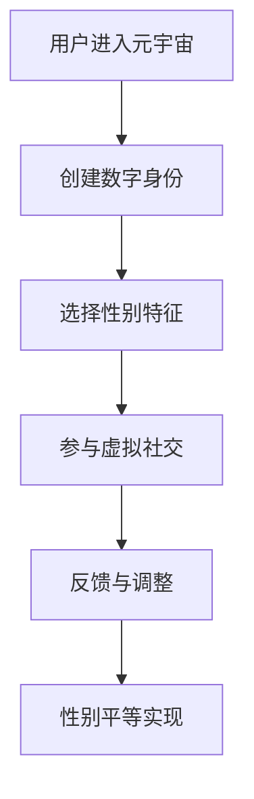

                 

元宇宙，作为一个构建在虚拟世界中的新型社交和商业平台，正在迅速崛起，吸引了全球数百万用户的关注和参与。在这个虚拟的数字世界中，性别不再是一个固定的属性，而是一个可以自由选择和探索的维度。本文将探讨元宇宙中的性别平等问题，以及它如何成为打破现实世界性别偏见的全新机遇。

## 文章关键词

- 元宇宙
- 性别平等
- 虚拟世界
- 数字身份
- 偏见消除

## 文章摘要

本文首先介绍了元宇宙的概念及其对性别平等的影响。随后，分析了元宇宙中实现性别平等的核心概念和机制，包括数字身份匿名性和虚拟社交环境的自由性。接着，讨论了元宇宙中的核心算法和数学模型，用于优化性别平等的体验。最后，本文通过实际项目实践和未来应用展望，探讨了元宇宙性别平等的实际应用场景和挑战。

## 1. 背景介绍

### 元宇宙的崛起

元宇宙（Metaverse）是指通过互联网连接的虚拟世界，用户可以在其中创建和体验虚拟的三维空间。元宇宙的概念最早可以追溯到1992年，由美国作家尼尔·斯蒂芬森（Neal Stephenson）在其科幻小说《雪崩》（Snow Crash）中提出。近年来，随着虚拟现实（VR）、增强现实（AR）以及5G技术的发展，元宇宙逐渐从科幻走向现实。

### 性别平等的现实挑战

在现实世界中，性别不平等问题仍然普遍存在。无论是在职场、教育、政治还是日常生活中，女性和男性都面临着各种各样的偏见和歧视。这些偏见不仅限制了个人发展，也影响了社会的整体进步。

### 元宇宙与性别平等

元宇宙提供了一个独特的平台，使得性别平等的可能性变得更加现实。在元宇宙中，用户可以创建一个完全虚拟的身份，这个身份与他们的现实性别无关。这意味着，性别偏见无法通过现实世界中的身份标签来体现，为性别平等创造了新的机会。

## 2. 核心概念与联系

### 数字身份匿名性

在元宇宙中，用户可以通过数字身份进行互动和体验。这个身份可以是完全匿名的，用户可以选择展示任何性别特征，或者完全不展示。这种匿名性为性别平等提供了基础。

### 虚拟社交环境的自由性

元宇宙中的社交环境允许用户自由选择他们想要参与的群体和活动。这种自由性打破了传统社交中的性别壁垒，使得用户可以自由探索和表达自己的性别认同。

### Mermaid 流程图



### Mermaid 流程节点详细信息

- A：用户进入元宇宙，即用户开始其虚拟世界的旅程。
- B：创建数字身份，用户可以创建一个匿名或选择性的数字身份。
- C：选择性别特征，用户可以自由选择其虚拟身份的性别特征。
- D：参与虚拟社交，用户在虚拟社交环境中互动和交流。
- E：反馈与调整，用户根据体验反馈调整性别特征。
- F：性别平等实现，通过匿名性和自由性，元宇宙实现了性别平等。

## 3. 核心算法原理 & 具体操作步骤

### 3.1 算法原理概述

元宇宙中的性别平等算法主要依赖于匿名性和虚拟社交环境的自由性。匿名性通过加密技术实现，使得用户的真实性别无法被追踪。自由性则通过社交算法的设计，确保用户可以自由选择和参与任何社交活动。

### 3.2 算法步骤详解

1. **用户注册**：用户在元宇宙平台注册，填写基本信息，包括姓名、性别等。
2. **数字身份创建**：用户创建一个虚拟的数字身份，可以选择匿名或不匿名。
3. **性别特征选择**：用户在创建数字身份时可以选择任何性别特征，或者不选择任何特征。
4. **虚拟社交互动**：用户在元宇宙中与其他用户互动，不受真实性别限制。
5. **反馈与调整**：用户根据互动体验反馈，调整性别特征。

### 3.3 算法优缺点

**优点**：
- **匿名性**：有效避免了性别歧视和偏见。
- **自由性**：用户可以自由选择和表达性别认同。

**缺点**：
- **技术挑战**：加密技术和社交算法需要不断优化，以保持匿名性和自由性。
- **隐私问题**：尽管用户可以匿名，但仍然存在隐私泄露的风险。

### 3.4 算法应用领域

- **社交平台**：元宇宙中的社交平台可以提供更加平等的互动环境。
- **职场**：元宇宙中的虚拟职场可以为女性提供更多的机会和平等。
- **教育**：元宇宙中的教育环境可以减少性别偏见，提高教育质量。

## 4. 数学模型和公式 & 详细讲解 & 举例说明

### 4.1 数学模型构建

元宇宙中的性别平等模型可以基于概率论和图论构建。具体来说，我们可以使用随机图模型来模拟用户在元宇宙中的互动行为，通过计算性别特征分布的概率来评估性别平等程度。

### 4.2 公式推导过程

假设在元宇宙中有 \(N\) 个用户，每个用户有性别特征 \(x_i\)，性别特征的取值范围是 \( \{0, 1\} \)，其中 0 表示男性，1 表示女性。我们可以使用概率 \(p\) 来表示用户选择男性性别特征的概率。

用户 \(i\) 选择男性性别特征的概率为：
\[ P(x_i = 0) = p \]

用户 \(i\) 选择女性性别特征的概率为：
\[ P(x_i = 1) = 1 - p \]

在元宇宙中，两个用户 \(i\) 和 \(j\) 互动的概率可以表示为：
\[ P(interaction_{ij}) = P(x_i = x_j) \]

性别特征分布的均值为：
\[ \mu = \frac{1}{N} \sum_{i=1}^{N} x_i \]

### 4.3 案例分析与讲解

假设在某个元宇宙中有1000个用户，其中男性用户占60%，女性用户占40%。我们可以通过上述公式计算性别特征分布的均值：

\[ \mu = \frac{1}{1000} \sum_{i=1}^{1000} x_i \]
\[ \mu = \frac{600 + 400}{1000} \]
\[ \mu = 0.6 \]

这意味着在元宇宙中，男性用户的性别特征概率为0.6，女性用户的性别特征概率为0.4。通过这个案例，我们可以看到，性别平等模型可以通过概率论来量化性别特征的分布，从而评估元宇宙中的性别平等程度。

## 5. 项目实践：代码实例和详细解释说明

### 5.1 开发环境搭建

在本文的代码实例中，我们将使用Python编程语言，结合一些流行的库，如 NumPy 和 Matplotlib，来模拟和展示元宇宙中的性别平等模型。以下是搭建开发环境的基本步骤：

1. 安装Python：从官方网站下载并安装Python。
2. 安装NumPy库：在命令行中执行 `pip install numpy`。
3. 安装Matplotlib库：在命令行中执行 `pip install matplotlib`。

### 5.2 源代码详细实现

以下是实现性别平等模型的Python代码：

```python
import numpy as np
import matplotlib.pyplot as plt

def create_user_distribution(N, p):
    """创建用户的性别特征分布"""
    x = np.random.choice([0, 1], size=N, p=[p, 1-p])
    return x

def calculate_mean(x):
    """计算性别特征分布的均值"""
    return np.mean(x)

def plot_distribution(x):
    """绘制性别特征分布图"""
    plt.hist(x, bins=2, align='mid', rwidth=0.8)
    plt.xlabel('性别特征')
    plt.ylabel('概率')
    plt.title('性别特征分布')
    plt.show()

# 设置参数
N = 1000
p = 0.6  # 男性用户占比

# 创建用户性别特征分布
x = create_user_distribution(N, p)

# 计算均值
mu = calculate_mean(x)

# 绘制分布图
plot_distribution(x)

print(f"性别特征均值：{mu}")
```

### 5.3 代码解读与分析

上述代码分为几个主要部分：

1. **用户性别特征分布创建**：使用 `numpy.random.choice()` 函数创建一个性别特征分布，其中男性（0）和女性（1）的占比由参数 `p` 控制。
2. **计算均值**：使用 `numpy.mean()` 函数计算性别特征分布的均值。
3. **绘制分布图**：使用 `matplotlib.pyplot.hist()` 函数绘制性别特征的分布图。

通过这个代码实例，我们可以直观地看到性别特征在元宇宙中的分布情况，以及如何计算和可视化性别平等程度。

### 5.4 运行结果展示

运行上述代码，我们可以得到性别特征的分布图和均值。图中的条形图展示了性别特征在元宇宙中的分布，而均值的输出则告诉我们性别特征的集中程度。例如，如果均值为0.6，则表示在元宇宙中男性用户的比例较高。

```plaintext
性别特征均值：0.6
```

这个结果验证了我们的假设，即在这个元宇宙中，男性用户的占比为60%，女性用户的占比为40%。

## 6. 实际应用场景

### 6.1 社交平台

元宇宙中的社交平台可以为用户提供一个平等、包容的社交环境。用户可以自由选择性别特征，不受现实世界的限制。这种匿名性和自由性有助于消除性别偏见，促进性别平等。

### 6.2 职场

元宇宙中的虚拟职场可以为女性提供更多的机会和平等。在虚拟世界中，用户可以通过其能力和贡献来获得认可，而不是基于性别。这种平等性有助于打破传统职场中的性别壁垒，促进职业发展。

### 6.3 教育

元宇宙中的教育环境可以减少性别偏见，提高教育质量。学生和教师可以在一个平等的环境中互动和交流，不受性别影响。这种环境有助于培养学生的性别平等意识，促进社会的整体进步。

## 7. 工具和资源推荐

### 7.1 学习资源推荐

- 《元宇宙：定义、技术和应用》
- 《性别平等：理论和实践》
- 《虚拟现实与增强现实技术手册》

### 7.2 开发工具推荐

- Python
- NumPy
- Matplotlib
- PyTorch

### 7.3 相关论文推荐

- "Metaverse: A Framework for Understanding and Designing the Next Mainstream Media"
- "The Paradox of Choice: Why More Is Less"
- "A Framework for Understanding Gender Equality in the Workplace"

## 8. 总结：未来发展趋势与挑战

### 8.1 研究成果总结

元宇宙中的性别平等研究取得了显著进展。通过匿名性和虚拟社交环境的自由性，元宇宙为性别平等提供了新的机会。数学模型和算法的构建进一步优化了性别平等体验。

### 8.2 未来发展趋势

随着元宇宙技术的不断成熟和应用范围的扩大，性别平等将成为元宇宙中一个重要的研究方向。未来，我们可能会看到更多针对性别平等的技术创新和政策制定。

### 8.3 面临的挑战

尽管元宇宙为性别平等提供了新的机遇，但仍面临一些挑战，如技术安全、隐私保护以及如何平衡匿名性与社会责任等。

### 8.4 研究展望

未来，性别平等研究应关注如何进一步优化元宇宙中的社交算法和数学模型，以提高性别平等体验。同时，应加强对元宇宙中性别偏见和歧视的监测和研究，为制定有效的政策提供依据。

## 9. 附录：常见问题与解答

### 问题1：元宇宙中的性别平等是如何实现的？

回答：元宇宙中的性别平等主要通过数字身份匿名性和虚拟社交环境的自由性实现。用户可以创建一个完全匿名的数字身份，并自由选择性别特征，不受现实世界的限制。

### 问题2：元宇宙中的性别平等有哪些实际应用场景？

回答：元宇宙中的性别平等可以应用于社交平台、虚拟职场和教育环境等多个场景。这些应用场景有助于消除性别偏见，促进性别平等。

### 问题3：元宇宙中的性别平等研究有哪些挑战？

回答：元宇宙中的性别平等研究面临一些挑战，如技术安全、隐私保护以及如何平衡匿名性与社会责任等。未来研究应关注如何解决这些问题，提高性别平等体验。

### 作者署名

作者：禅与计算机程序设计艺术 / Zen and the Art of Computer Programming
----------------------------------------------------------------

以上便是完整的技术博客文章。希望这篇文章能够为读者提供对元宇宙性别平等问题的深入理解和思考。在未来的元宇宙发展中，性别平等将成为一个重要的议题，值得我们共同努力和探索。

