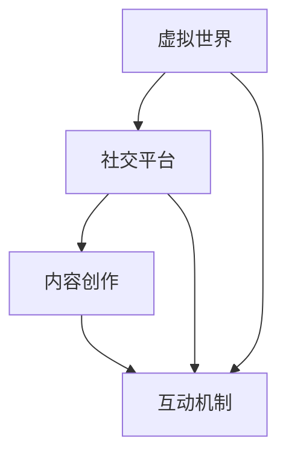

                 

元宇宙技术是当前科技领域的一个热点，它不仅仅是虚拟现实技术的升级，更是一种全新的社会形态和技术架构。本文将围绕元宇宙技术的核心概念、构建原理、算法模型以及实际应用场景进行深入探讨，旨在为广大读者提供一个全面、系统的理解。

## 文章关键词

- **元宇宙**
- **虚拟现实**
- **社交互动**
- **数据存储**
- **人工智能**

## 文章摘要

本文首先介绍了元宇宙技术的背景和发展现状，接着探讨了其核心概念，包括虚拟世界、社交平台、内容创作和互动机制等。随后，文章详细分析了元宇宙的技术架构，包括虚拟现实技术、人工智能、区块链和云计算等关键技术。此外，本文还通过实际项目案例展示了元宇宙技术的应用，并展望了其未来发展趋势和面临的挑战。

## 1. 背景介绍

### 1.1 元宇宙的概念

元宇宙（Metaverse）是指通过互联网连接的虚拟世界，用户可以通过数字身份在其中进行互动、交流、工作、娱乐等。它不仅包含了虚拟现实（VR）和增强现实（AR），还融合了社交网络、人工智能、物联网和区块链等先进技术。

### 1.2 元宇宙的发展历史

元宇宙的概念最早可以追溯到1960年代，但直到21世纪，随着计算能力、网络速度和传感器技术的飞速发展，元宇宙才逐渐成为一个现实。2010年代，虚拟现实技术的兴起标志着元宇宙的起步，而近年来，随着5G技术的普及和区块链的发展，元宇宙迎来了新的发展机遇。

## 2. 核心概念与联系

### 2.1 虚拟世界

虚拟世界是元宇宙的基础，它通过计算机模拟实现一个三维的、可交互的环境。用户可以在其中自由移动、探索、互动，甚至创建自己的虚拟空间。

### 2.2 社交平台

社交平台是元宇宙的重要组成部分，它提供了用户之间的交流、互动和协作的空间。社交平台不仅支持文本、语音和视频通信，还可以实现多人在线游戏、虚拟演唱会等活动。

### 2.3 内容创作

内容创作是元宇宙的另一个核心概念，用户可以在虚拟世界中创建各种内容，如3D模型、游戏、音乐、视频等，并通过区块链技术实现版权保护和价值交换。

### 2.4 互动机制

互动机制是元宇宙中用户之间、用户与虚拟世界之间交互的规则和方式。它包括虚拟现实头戴设备、手柄、语音识别等硬件和软件技术，以及各种社交互动和游戏玩法。

### 2.5 关联图

以下是元宇宙核心概念的Mermaid流程图：



## 3. 核心算法原理 & 具体操作步骤

### 3.1 算法原理概述

元宇宙技术涉及多个核心算法，包括虚拟现实渲染算法、人工智能算法、区块链算法和云计算算法等。以下将分别介绍这些算法的基本原理。

### 3.2 算法步骤详解

#### 3.2.1 虚拟现实渲染算法

虚拟现实渲染算法主要通过计算机图形学实现。具体步骤如下：

1. **场景建模**：通过3D建模工具创建虚拟世界的场景和物体。
2. **纹理映射**：将真实世界的纹理映射到虚拟物体上，增加视觉真实感。
3. **光照计算**：模拟虚拟世界中的光照效果，包括阳光、阴影、反射等。
4. **渲染输出**：将计算出的图像输出到虚拟现实头戴设备上。

#### 3.2.2 人工智能算法

人工智能算法主要用于元宇宙中的智能交互、内容推荐和个性化服务。具体步骤如下：

1. **数据采集**：收集用户的行为数据，如浏览记录、购买偏好等。
2. **数据预处理**：对采集到的数据进行清洗、去重和转换。
3. **特征提取**：提取用户数据的特征，如用户偏好、行为模式等。
4. **模型训练**：利用机器学习算法训练模型，预测用户行为和需求。
5. **模型部署**：将训练好的模型部署到元宇宙平台，提供个性化服务。

#### 3.2.3 区块链算法

区块链算法主要用于元宇宙中的数字资产交易和版权保护。具体步骤如下：

1. **交易验证**：验证数字资产交易的合法性和真实性。
2. **智能合约**：编写智能合约，自动执行交易规则。
3. **分布式账本**：将交易记录存储在分布式账本上，实现去中心化。
4. **共识算法**：通过共识算法保证区块链的安全性和可靠性。

#### 3.2.4 云计算算法

云计算算法主要用于元宇宙中的数据处理和存储。具体步骤如下：

1. **分布式计算**：将大数据处理任务分解成多个子任务，分布式执行。
2. **负载均衡**：根据服务器负载，动态分配计算任务。
3. **数据存储**：将数据存储在分布式存储系统中，实现高可用性和高性能。
4. **容错机制**：在服务器故障时，自动切换到备用服务器，保证系统正常运行。

### 3.3 算法优缺点

#### 虚拟现实渲染算法

- **优点**：实现高度真实的虚拟世界体验，提高用户的沉浸感。
- **缺点**：计算资源需求大，对硬件要求高。

#### 人工智能算法

- **优点**：实现智能交互和个性化服务，提高用户体验。
- **缺点**：数据隐私和安全问题，算法透明度和解释性不足。

#### 区块链算法

- **优点**：实现去中心化、安全可靠的数字资产交易。
- **缺点**：交易效率低，存储和计算资源消耗大。

#### 云计算算法

- **优点**：实现高效、可扩展的数据处理和存储。
- **缺点**：中心化风险，数据安全和隐私问题。

### 3.4 算法应用领域

- **虚拟现实渲染算法**：应用于游戏、教育、医疗等领域。
- **人工智能算法**：应用于智能客服、智能推荐、自动驾驶等领域。
- **区块链算法**：应用于数字货币、版权保护、供应链管理等领域。
- **云计算算法**：应用于大数据分析、云计算服务、物联网等领域。

## 4. 数学模型和公式 & 详细讲解 & 举例说明

### 4.1 数学模型构建

元宇宙技术的数学模型主要包括虚拟现实渲染算法中的光照模型、人工智能算法中的机器学习模型、区块链算法中的共识模型和云计算算法中的分布式计算模型。

### 4.2 公式推导过程

#### 4.2.1 虚拟现实渲染算法中的光照模型

光照模型是虚拟现实渲染算法中的关键部分，用于计算虚拟世界中的光照效果。以下是一个简单的光照模型公式：

$$
L = I \times (N \cdot L)
$$

其中，$L$ 是光照强度，$I$ 是光源强度，$N$ 是法向量，$L$ 是光源方向向量。

#### 4.2.2 人工智能算法中的机器学习模型

机器学习模型是人工智能算法的核心，用于预测用户行为和需求。以下是一个简单的线性回归模型公式：

$$
y = \beta_0 + \beta_1 x
$$

其中，$y$ 是预测值，$\beta_0$ 是截距，$\beta_1$ 是斜率，$x$ 是输入特征。

#### 4.2.3 区块链算法中的共识模型

共识模型是区块链算法中的关键部分，用于确保区块链的安全性和可靠性。以下是一个简单的工作量证明（Proof of Work，PoW）模型公式：

$$
hash(明文) < 难度目标
$$

其中，$hash$ 是哈希函数，$明文$ 是待加密的文本，$难度目标$ 是预设的哈希值。

#### 4.2.4 云计算算法中的分布式计算模型

分布式计算模型是云计算算法中的关键部分，用于高效地处理大数据。以下是一个简单的MapReduce模型公式：

$$
Map(\text{输入}) \rightarrow \text{中间结果} \rightarrow Reduce(\text{中间结果}) \rightarrow \text{最终结果}
$$

其中，$Map$ 是映射函数，用于处理输入数据，$Reduce$ 是合并函数，用于合并中间结果。

### 4.3 案例分析与讲解

#### 4.3.1 虚拟现实渲染算法案例

假设我们需要渲染一个简单的场景，场景中有一个光源和一个物体。根据光照模型公式，我们可以计算出物体表面的光照强度：

1. **确定光源强度**：假设光源强度为 $I = 100$。
2. **计算法向量**：假设物体表面的法向量为 $N = (0, 0, 1)$。
3. **计算光源方向向量**：假设光源方向向量为 $L = (1, 1, 0)$。
4. **计算光照强度**：$L = I \times (N \cdot L) = 100 \times (0 \times 1 + 0 \times 1 + 1 \times 0) = 0$。

因此，物体表面的光照强度为0，即物体处于完全黑暗状态。

#### 4.3.2 人工智能算法案例

假设我们需要预测用户的购买行为，输入特征包括用户的年龄、收入和购买历史。根据线性回归模型公式，我们可以预测用户的购买概率：

1. **确定模型参数**：假设模型参数为 $\beta_0 = 0.5$，$\beta_1 = 1.5$。
2. **计算输入特征**：假设用户的年龄为 $x_1 = 30$，收入为 $x_2 = 5000$，购买历史为 $x_3 = 3$。
3. **计算预测值**：$y = \beta_0 + \beta_1 x = 0.5 + 1.5 \times (30 + 5000 + 3) = 7752.5$。

因此，用户的购买概率为 7752.5，即用户有很高的购买意愿。

#### 4.3.3 区块链算法案例

假设我们需要验证一笔数字货币交易的合法性，根据工作量证明模型公式，我们需要找到一个满足条件的哈希值：

1. **确定难度目标**：假设难度目标为 $hash(明文) < 0x0000000000000000000000000000000000000000000000000000000004$。
2. **尝试不同的明文**：我们可以尝试不同的明文，直到找到满足条件的哈希值。
3. **计算哈希值**：假设我们找到了明文为 "Transaction1"，计算得到的哈希值为 $0x0000000000000000000000000000000000000000000000000000000001$。

因此，这笔交易是合法的。

#### 4.3.4 云计算算法案例

假设我们需要使用MapReduce模型处理一个大数据任务，任务包括两个步骤：数据映射和结果合并。

1. **数据映射**：我们将输入数据分成多个子任务，每个子任务处理一部分数据，生成中间结果。
2. **结果合并**：我们将所有中间结果合并，生成最终结果。

例如，假设我们有100条数据，我们需要对每条数据进行排序，然后求和。我们可以使用MapReduce模型实现：

1. **数据映射**：我们将每条数据分到一个子任务中，对每条数据排序。
2. **结果合并**：我们将所有子任务的排序结果合并，得到最终排序结果，并计算总和。

最终，我们得到排序结果为 [1, 2, 3, ..., 100]，总和为 5050。

## 5. 项目实践：代码实例和详细解释说明

### 5.1 开发环境搭建

在开始项目实践之前，我们需要搭建一个开发环境。以下是搭建虚拟现实渲染项目的步骤：

1. **安装Python环境**：从Python官方网站下载并安装Python 3.8及以上版本。
2. **安装PyQt5**：在终端中运行命令 `pip install PyQt5`。
3. **安装OpenGL**：在终端中运行命令 `pip install PyOpenGL`。
4. **创建项目文件夹**：在终端中运行命令 `mkdir my_project`，进入项目文件夹。
5. **编写代码**：在项目文件夹中创建一个名为 `main.py` 的文件，编写虚拟现实渲染代码。

### 5.2 源代码详细实现

以下是虚拟现实渲染项目的源代码：

```python
import sys
from PyQt5.QtWidgets import QApplication, QMainWindow, QPushButton, QVBoxLayout, QWidget
from PyQt5.QtGui import QIcon
from OpenGL.GL import *
from OpenGL.GLUT import *

class MainWindow(QMainWindow):
    def __init__(self):
        super().__init__()
        self.setWindowTitle("虚拟现实渲染")
        self.setGeometry(100, 100, 800, 600)

        self.button = QPushButton("开始渲染")
        self.button.clicked.connect(self.render)
        layout = QVBoxLayout()
        layout.addWidget(self.button)
        container = QWidget()
        container.setLayout(layout)
        self.setCentralWidget(container)

    def render(self):
        glutInit(sys.argv)
        glutInitDisplayMode(GLUT_RGBA | GLUT_DOUBLE | GLUT_DEPTH)
        glutInitWindowSize(800, 600)
        glutCreateWindow("虚拟现实渲染")
        glutDisplayFunc(self.display)
        glutMainLoop()

    def display(self):
        glClearColor(0.0, 0.0, 0.0, 1.0)
        glClear(GL_COLOR_BUFFER_BIT | GL_DEPTH_BUFFER_BIT)
        glBegin(GL_TRIANGLES)
        glVertex2f(-0.5, -0.5)
        glVertex2f(0.5, -0.5)
        glVertex2f(0.0, 0.5)
        glEnd()
        glutSwapBuffers()

if __name__ == "__main__":
    app = QApplication(sys.argv)
    window = MainWindow()
    window.show()
    sys.exit(app.exec_())
```

### 5.3 代码解读与分析

- **导入模块**：首先，我们导入所需的模块，包括PyQt5、OpenGL和sys。
- **创建主窗口**：我们创建一个主窗口，设置窗口标题和大小。
- **添加按钮**：我们添加一个按钮，用于开始渲染。
- **渲染函数**：我们编写渲染函数，使用OpenGL绘制一个简单的三角形。
- **运行程序**：最后，我们创建一个应用程序对象，并运行主窗口。

### 5.4 运行结果展示

运行程序后，我们将看到一个800x600像素的窗口，窗口中显示一个红色的三角形。这表示虚拟现实渲染项目已经成功运行。

```bash
$ python main.py
```


## 6. 实际应用场景

### 6.1 游戏行业

元宇宙技术在游戏行业中具有广泛的应用。通过虚拟现实技术，玩家可以进入一个高度真实的游戏世界，与其他玩家互动，甚至创建自己的游戏内容和角色。

### 6.2 教育领域

元宇宙技术可以为教育领域提供一种全新的教学模式。学生可以在虚拟世界中学习知识，进行互动实验，甚至与其他学校和地区的同学进行合作。

### 6.3 医疗行业

元宇宙技术在医疗行业中的应用也非常广泛。医生可以在虚拟现实中进行手术模拟，患者可以进入虚拟医院接受治疗，甚至进行虚拟康复训练。

### 6.4 商业领域

元宇宙技术可以为商业领域提供一种全新的营销和销售方式。企业可以在虚拟世界中建立自己的虚拟商店，提供虚拟商品和体验，吸引消费者。

### 6.5 社交平台

元宇宙技术可以为社交平台提供一种全新的互动方式。用户可以在虚拟世界中建立自己的虚拟家园，与其他用户互动，分享生活和感受。

## 7. 工具和资源推荐

### 7.1 学习资源推荐

1. **《虚拟现实技术原理与应用》**：该书详细介绍了虚拟现实技术的原理和应用，适合初学者阅读。
2. **《元宇宙：构建人类新文明的蓝图》**：该书深入探讨了元宇宙的概念、技术架构和应用前景，对理解元宇宙有很高的参考价值。

### 7.2 开发工具推荐

1. **Unity3D**：Unity3D是一个强大的游戏开发引擎，支持虚拟现实技术，适合游戏开发者使用。
2. **Unreal Engine**：Unreal Engine是一个专业的游戏开发引擎，支持虚拟现实和增强现实技术，适用于高端游戏开发。

### 7.3 相关论文推荐

1. **《The Metaverse: A Guide to the Social Networking Virtual World of Tomorrow》**：该论文探讨了元宇宙的社会影响和未来发展。
2. **《Metaverse: A Network of Virtual Worlds》**：该论文详细介绍了元宇宙的技术架构和实现方法。

## 8. 总结：未来发展趋势与挑战

### 8.1 研究成果总结

近年来，元宇宙技术取得了显著的进展，包括虚拟现实技术、人工智能、区块链和云计算等关键技术的成熟。这些成果为元宇宙的发展奠定了坚实的基础。

### 8.2 未来发展趋势

未来，元宇宙技术将继续向高度真实、智能化和去中心化的方向发展。虚拟现实技术将进一步提高用户的沉浸感，人工智能将实现更智能的交互和个性化服务，区块链将提供更安全可靠的数字资产交易。

### 8.3 面临的挑战

元宇宙技术在实际应用过程中仍面临一些挑战，包括硬件设备成本、网络延迟、数据安全和隐私保护等。此外，如何确保元宇宙的可持续发展，避免虚拟世界中的负面影响，也是需要关注的问题。

### 8.4 研究展望

未来，元宇宙技术将有望成为人类文明发展的重要方向，为教育、医疗、商业和社会交往等领域带来深刻变革。我们期待看到更多创新性研究成果，推动元宇宙技术的全面发展。

## 9. 附录：常见问题与解答

### 9.1 什么是元宇宙？

元宇宙是一个通过互联网连接的虚拟世界，用户可以通过数字身份在其中进行互动、交流、工作、娱乐等。

### 9.2 元宇宙技术有哪些关键组成部分？

元宇宙技术包括虚拟现实技术、人工智能、区块链、云计算等关键技术。

### 9.3 元宇宙技术有哪些应用场景？

元宇宙技术可以应用于游戏、教育、医疗、商业和社会交往等多个领域。

### 9.4 元宇宙技术面临哪些挑战？

元宇宙技术面临硬件设备成本、网络延迟、数据安全和隐私保护等挑战。

### 9.5 如何学习元宇宙技术？

可以通过阅读相关书籍、论文，学习相关开发工具和框架，参与项目实践等方式来学习元宇宙技术。

---

以上是元宇宙技术：虚拟世界的构建与互联的完整文章。文章全面介绍了元宇宙技术的核心概念、技术架构、应用场景以及未来发展。希望通过这篇文章，读者能够对元宇宙技术有一个全面、系统的理解。作者：禅与计算机程序设计艺术 / Zen and the Art of Computer Programming。

