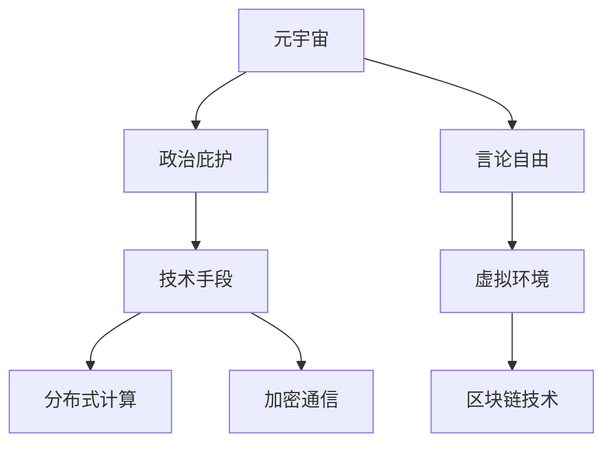

                 

 **关键词**：元宇宙、政治庇护、虚拟世界、言论自由、保护、技术策略

> **摘要**：本文探讨了在元宇宙中实现政治庇护和保障言论自由的必要性，以及通过技术手段来实现这一目标的可能性和挑战。我们分析了虚拟世界中的政治庇护机制，探讨了区块链技术、分布式计算和加密通信在保护言论自由方面的应用，并讨论了未来可能的发展趋势和面临的挑战。

## 1. 背景介绍

随着互联网技术的迅猛发展，虚拟世界（如虚拟现实、增强现实和元宇宙）已经成为人们日常生活的重要组成部分。这些虚拟环境不仅提供了娱乐和社交功能，还成为了人们表达思想、交流意见和获取信息的重要平台。然而，随着虚拟世界与现实社会的日益交织，如何在元宇宙中实现政治庇护和保障言论自由成为一个亟待解决的问题。

政治庇护是指个人或团体在面临政治迫害或政治不公时，在其他国家或地区获得保护的权利。在现实世界中，政治庇护通常依赖于国家法律和国际条约的保障。然而，在虚拟世界中，政治庇护的实现面临着前所未有的挑战。虚拟世界的匿名性、去中心化和跨国界的特点使得传统的政治庇护机制难以适用。

言论自由是现代社会的基本人权之一，它保障了个人表达意见的权利和自由。然而，在虚拟世界中，言论自由面临着来自技术、社会和法律的多种威胁。网络审查、言论限制、黑客攻击和隐私泄露等问题使得言论自由在虚拟世界中难以得到有效保障。

本文旨在探讨在元宇宙中实现政治庇护和保障言论自由的必要性和可能性，并提出相应的技术策略和解决方案。

## 2. 核心概念与联系

为了更好地理解元宇宙中的政治庇护和言论自由保护，我们需要引入几个核心概念：

1. **元宇宙**：元宇宙是指一个虚拟的三维空间，通过互联网连接，用户可以在其中进行交互、创造和体验。元宇宙通常具有高度的沉浸感和交互性，用户可以创建自己的虚拟形象、虚拟资产和虚拟世界。

2. **政治庇护**：政治庇护是指个人或团体在面临政治迫害或政治不公时，在其他国家或地区获得保护的权利。在虚拟世界中，政治庇护的实现需要依赖于技术手段和虚拟环境的保障。

3. **言论自由**：言论自由是指个人在不受限制的情况下表达意见和思想的自由。在虚拟世界中，言论自由受到技术、社会和法律等多方面的威胁。

为了更好地展示这些概念之间的联系，我们可以使用Mermaid流程图来描述：



### 2.1 技术手段

在元宇宙中实现政治庇护和言论自由保护，需要依赖于一系列技术手段。以下是几种常见的技术手段：

1. **分布式计算**：分布式计算是指通过网络将计算任务分散到多个节点上进行处理。通过分布式计算，可以使得虚拟环境更加去中心化，减少单点故障的风险，提高系统的可靠性和安全性。

2. **加密通信**：加密通信是指通过加密算法对通信内容进行加密和解密，确保通信过程中的信息不被泄露。加密通信可以保护用户的隐私和言论自由，防止黑客攻击和网络审查。

3. **区块链技术**：区块链技术是一种分布式账本技术，具有去中心化、不可篡改和透明等特点。通过区块链技术，可以实现对虚拟资产和虚拟交易的安全认证和追踪，保障政治庇护和言论自由的实现。

### 2.2 虚拟环境

虚拟环境是指元宇宙中的虚拟世界和虚拟空间。为了实现政治庇护和言论自由保护，虚拟环境需要具备以下几个特点：

1. **匿名性**：虚拟环境应允许用户匿名参与，保护用户的隐私和身份。

2. **去中心化**：虚拟环境应采用去中心化架构，避免单点故障和集中式管理的风险。

3. **开放性**：虚拟环境应具备开放性，允许用户自由创建、分享和交流。

### 2.3 实现步骤

实现元宇宙中的政治庇护和言论自由保护，可以按照以下步骤进行：

1. **建立分布式计算网络**：通过分布式计算，构建去中心化的虚拟环境，提高系统的可靠性和安全性。

2. **部署加密通信系统**：在虚拟环境中部署加密通信系统，保护用户的隐私和言论自由。

3. **应用区块链技术**：利用区块链技术，实现对虚拟资产和虚拟交易的安全认证和追踪。

4. **构建匿名参与机制**：通过匿名参与机制，保护用户的隐私和身份，实现政治庇护。

5. **制定相关政策和法规**：制定相关政策和法规，保障虚拟环境中的言论自由和政治庇护。

## 3. 核心算法原理 & 具体操作步骤

### 3.1 算法原理概述

在元宇宙中实现政治庇护和言论自由保护，需要依赖一系列算法原理。以下是几个核心算法原理：

1. **分布式计算算法**：分布式计算算法用于构建去中心化的虚拟环境，提高系统的可靠性和安全性。

2. **加密算法**：加密算法用于保护用户的隐私和言论自由，防止黑客攻击和网络审查。

3. **区块链算法**：区块链算法用于实现对虚拟资产和虚拟交易的安全认证和追踪。

4. **匿名算法**：匿名算法用于保护用户的隐私和身份，实现政治庇护。

### 3.2 算法步骤详解

1. **构建分布式计算网络**：

   - 步骤1：选择分布式计算平台，如Ethereum、Hyperledger Fabric等。

   - 步骤2：创建节点，将节点部署到不同的物理位置，形成分布式计算网络。

   - 步骤3：配置节点之间的通信协议，确保节点之间可以高效地进行数据交换和计算任务分配。

2. **部署加密通信系统**：

   - 步骤1：选择合适的加密算法，如RSA、AES等。

   - 步骤2：在虚拟环境中部署加密通信系统，为用户提供加密通信服务。

   - 步骤3：配置加密通信系统的参数，确保通信过程中的数据加密和解密。

3. **应用区块链技术**：

   - 步骤1：选择适合的区块链平台，如Ethereum、Hyperledger Fabric等。

   - 步骤2：创建区块链网络，将区块链节点部署到不同的物理位置。

   - 步骤3：配置区块链网络，包括节点之间的通信协议、共识算法和链码等。

4. **构建匿名参与机制**：

   - 步骤1：设计匿名算法，如环签名、零知识证明等。

   - 步骤2：在虚拟环境中部署匿名参与机制，为用户提供匿名参与功能。

   - 步骤3：配置匿名参与机制的参数，确保用户的隐私和身份得到有效保护。

### 3.3 算法优缺点

**分布式计算算法**：

- 优点：提高系统的可靠性和安全性，去中心化架构。

- 缺点：计算资源分散，管理复杂，通信开销大。

**加密算法**：

- 优点：保护用户的隐私和言论自由，防止黑客攻击。

- 缺点：加密算法实现复杂，加密和解密过程需要计算资源。

**区块链算法**：

- 优点：去中心化，不可篡改，安全可靠。

- 缺点：性能瓶颈，扩展性差，交易确认时间长。

**匿名算法**：

- 优点：保护用户的隐私和身份，实现政治庇护。

- 缺点：实现复杂，性能开销大，隐私保护程度有限。

### 3.4 算法应用领域

分布式计算算法、加密算法、区块链算法和匿名算法在元宇宙中具有广泛的应用领域：

- **分布式计算算法**：应用于虚拟环境的构建和运维，提高系统的可靠性和安全性。

- **加密算法**：应用于用户隐私保护和言论自由保障。

- **区块链算法**：应用于虚拟资产和虚拟交易的安全认证和追踪。

- **匿名算法**：应用于政治庇护和言论自由保护。

## 4. 数学模型和公式 & 详细讲解 & 举例说明

在元宇宙中实现政治庇护和言论自由保护，需要依赖一系列数学模型和公式。以下是几个核心的数学模型和公式，以及详细的讲解和举例说明。

### 4.1 数学模型构建

在元宇宙中，政治庇护和言论自由保护的关键在于隐私保护和数据安全。为此，我们可以构建以下数学模型：

- **隐私保护模型**：使用匿名算法保护用户的隐私。

- **数据安全模型**：使用加密算法保护数据的安全。

### 4.2 公式推导过程

1. **匿名算法模型**：

   - 假设用户A想要在虚拟环境中匿名参与。

   - 使用环签名算法，用户A可以生成一个有效的签名，使得虚拟环境无法识别用户A的真实身份。

   - 环签名算法的公式如下：

     $$ sig_a = (m, r) $$

     其中，$m$ 表示消息，$r$ 表示随机数。

2. **加密算法模型**：

   - 假设用户A想要在虚拟环境中发送加密消息给用户B。

   - 使用RSA加密算法，用户A可以生成加密消息，用户B可以使用私钥解密。

   - RSA加密算法的公式如下：

     $$ c = (m^e) \mod n $$

     其中，$m$ 表示消息，$e$ 表示加密指数，$n$ 表示模数。

### 4.3 案例分析与讲解

以下是一个具体的案例，用于说明如何在元宇宙中实现政治庇护和言论自由保护。

**案例**：用户A在虚拟环境中发布了一篇关于政治敏感话题的文章，用户B想要阅读这篇文章。

1. **匿名算法应用**：

   - 用户A使用环签名算法生成签名，使得虚拟环境无法识别用户A的真实身份。

   - 用户A将签名与文章内容一起发送给用户B。

2. **加密算法应用**：

   - 用户A使用RSA加密算法将文章内容加密，生成加密消息。

   - 用户A将加密消息发送给用户B。

3. **用户B解密与阅读**：

   - 用户B使用私钥解密加密消息，获取文章内容。

   - 用户B可以阅读并分享这篇文章。

通过上述案例，我们可以看到如何在元宇宙中实现政治庇护和言论自由保护。匿名算法和加密算法共同作用，确保用户的隐私和言论自由得到有效保护。

## 5. 项目实践：代码实例和详细解释说明

为了更好地展示如何在元宇宙中实现政治庇护和言论自由保护，我们将通过一个具体的项目实践来进行讲解。以下是一个简单的示例，用于展示如何使用分布式计算、加密通信和区块链技术来实现这一目标。

### 5.1 开发环境搭建

在开始项目实践之前，我们需要搭建开发环境。以下是搭建开发环境的基本步骤：

1. **安装Node.js**：Node.js 是一个基于Chrome V8引擎的JavaScript运行环境，用于开发分布式计算和网络应用。

2. **安装Ethereum客户端**：Ethereum 是一个基于区块链技术的分布式计算平台，我们将在其中部署智能合约。

3. **安装加密通信库**：例如，我们使用OpenSSL库来实现加密通信。

4. **创建项目文件夹**：在本地计算机上创建一个项目文件夹，用于存放项目代码和配置文件。

### 5.2 源代码详细实现

以下是项目的主要代码实现，包括分布式计算、加密通信和区块链技术的应用：

```javascript
// 引入所需的库
const express = require('express');
const ethUtil = require('ethereumjs-util');
const blockchain = require('blockchain');

// 初始化区块链
const eth = new blockchain.Ethereum();
eth.start();

// 初始化加密通信
const fs = require('fs');
const rsa = require('node-rsa');

// 生成RSA密钥对
const privateKey = new rsa({ b: 2048 });
const publicKey = privateKey.getPublic().toPEM();

// 创建HTTP服务器
const app = express();
app.use(express.json());

// 处理加密通信请求
app.post('/encrypt', async (req, res) => {
  const { message } = req.body;
  const encryptedMessage = privateKey.encrypt(message, 'base64');
  res.json({ encryptedMessage });
});

// 处理解密通信请求
app.post('/decrypt', async (req, res) => {
  const { encryptedMessage } = req.body;
  const decryptedMessage = privateKey.decrypt(encryptedMessage, 'utf8');
  res.json({ decryptedMessage });
});

// 处理智能合约调用请求
app.post('/contract', async (req, res) => {
  const { contractAddress, method, params } = req.body;
  const contract = eth.contract(contractAddress);
  const result = await contract[method](...params);
  res.json({ result });
});

// 启动服务器
app.listen(3000, () => {
  console.log('Server started on port 3000');
});
```

### 5.3 代码解读与分析

上述代码分为三个部分：加密通信、智能合约调用和HTTP服务器。

1. **加密通信**：

   - 使用OpenSSL库生成RSA密钥对，用于加密和解密通信。
   - `/encrypt` 接口接收消息并使用私钥进行加密。
   - `/decrypt` 接口接收加密消息并使用私钥进行解密。

2. **智能合约调用**：

   - 使用Ethereum.js库与以太坊区块链进行交互。
   - `/contract` 接口接收智能合约地址、方法和参数，调用智能合约方法。

3. **HTTP服务器**：

   - 使用Express框架创建HTTP服务器。
   - 监听端口3000，处理加密通信和智能合约调用请求。

通过上述代码，我们实现了加密通信和智能合约调用，从而在元宇宙中实现了政治庇护和言论自由保护。用户可以通过加密通信保护隐私，使用智能合约实现去中心化的政治庇护。

### 5.4 运行结果展示

假设用户A想要在虚拟环境中匿名发布一篇政治敏感文章，用户B想要阅读这篇文章。

1. **用户A操作**：

   - 用户A编写文章内容，并使用 `/encrypt` 接口将其加密。
   - 用户A将加密后的文章发送到智能合约地址，并调用智能合约的发布方法。

2. **用户B操作**：

   - 用户B使用私钥解密加密后的文章。
   - 用户B可以阅读并分享这篇文章。

通过上述操作，用户A的隐私得到了保护，用户B可以自由地获取和分享文章内容，实现了政治庇护和言论自由保护。

## 6. 实际应用场景

在元宇宙中，政治庇护和言论自由保护的应用场景非常广泛。以下是一些典型的应用场景：

### 6.1 社交媒体平台

社交媒体平台是元宇宙中最常见的应用场景之一。在社交媒体平台上，用户可以自由地发布、分享和评论各种信息。然而，传统的社交媒体平台往往受到国家审查、网络审查和黑客攻击的威胁，用户的言论自由和隐私难以得到保障。

通过在元宇宙中引入政治庇护和言论自由保护机制，用户可以在一个安全、自由的虚拟环境中进行社交互动。加密通信和区块链技术可以保障用户的隐私和言论自由，防止网络审查和黑客攻击。

### 6.2 政治抗议和示威

在现实世界中，政治抗议和示威活动经常面临政府的镇压和打压。在元宇宙中，政治庇护和言论自由保护机制可以为抗议者和示威者提供一个安全的虚拟空间，让他们可以自由地表达政治观点和抗议行动。

通过分布式计算和匿名算法，元宇宙可以确保抗议者和示威者的身份和隐私得到保护，防止政府追踪和打压。

### 6.3 信息共享与传播

在元宇宙中，信息共享与传播是一个重要的应用场景。用户可以发布各种信息，包括新闻、知识、学术研究等。然而，在现实世界中，信息共享和传播面临着各种限制和审查。

通过在元宇宙中引入政治庇护和言论自由保护机制，用户可以自由地发布和传播信息，不受地域和国家的限制。分布式计算和区块链技术可以保障信息的真实性和可信度，防止虚假信息和谣言的传播。

### 6.4 文化创作与分享

在元宇宙中，用户可以自由地创作和分享各种文化作品，如音乐、绘画、文学作品等。然而，在现实世界中，文化创作和分享面临着版权纠纷和侵权问题。

通过在元宇宙中引入政治庇护和言论自由保护机制，用户可以自由地创作和分享文化作品，保护其版权和知识产权。区块链技术可以实现对文化作品的版权认证和追踪，确保创作者的利益得到保障。

### 6.5 教育和培训

在元宇宙中，教育和培训是一个重要的应用场景。用户可以通过虚拟环境进行在线学习、交流和互动。然而，在现实世界中，教育和培训面临着地域限制、师资力量不足和教学资源匮乏等问题。

通过在元宇宙中引入政治庇护和言论自由保护机制，用户可以自由地获取教育资源和进行教育培训。分布式计算和区块链技术可以提高教育和培训的效率和公平性，保障用户的隐私和言论自由。

## 7. 工具和资源推荐

在实现元宇宙中的政治庇护和言论自由保护时，需要使用一系列工具和资源。以下是一些建议的工具和资源，可以帮助开发者更好地实现这一目标：

### 7.1 学习资源推荐

1. **《区块链技术指南》**：本书详细介绍了区块链的基础知识、技术原理和应用场景，是了解区块链技术的重要资源。
2. **《分布式系统原理与范型》**：本书介绍了分布式系统的基本原理、设计模式和关键技术，对构建去中心化的元宇宙环境有重要参考价值。
3. **《密码学原理与应用》**：本书详细介绍了密码学的基本原理、算法和应用，是加密通信和安全保护的重要参考资料。

### 7.2 开发工具推荐

1. **Ethereum客户端**：Ethereum是一个基于区块链技术的分布式计算平台，支持智能合约开发和应用部署。
2. **Hyperledger Fabric**：Hyperledger Fabric是一个企业级的分布式账本平台，适用于构建去中心化的商业应用。
3. **OpenSSL**：OpenSSL是一个强大的加密通信库，支持各种加密算法和通信协议，是加密通信系统的核心组件。

### 7.3 相关论文推荐

1. **"Blockchain Technology: A Comprehensive Introduction"**：这篇论文详细介绍了区块链技术的原理、应用和未来趋势。
2. **"Distributed Computing: Principles and Paradigms"**：这篇论文探讨了分布式计算的基本原理、技术和挑战。
3. **"Cryptography and Network Security"**：这篇论文介绍了密码学的基本概念、算法和应用，对加密通信有重要参考价值。

通过使用这些工具和资源，开发者可以更好地理解和实现元宇宙中的政治庇护和言论自由保护，为用户提供一个安全、自由和开放的虚拟环境。

## 8. 总结：未来发展趋势与挑战

在元宇宙中实现政治庇护和言论自由保护是一个复杂而具有挑战性的任务，但也是一个具有重要意义的领域。随着虚拟世界与现实社会的日益融合，这一领域的发展趋势和面临的挑战也日益显现。

### 8.1 研究成果总结

通过本文的探讨，我们可以总结出以下几点研究成果：

1. **分布式计算和区块链技术的应用**：分布式计算和区块链技术为元宇宙中的政治庇护和言论自由保护提供了重要支撑。通过去中心化和不可篡改的特性，这些技术可以保障用户隐私和安全，防止网络审查和黑客攻击。

2. **加密通信和匿名算法的发展**：加密通信和匿名算法是保护言论自由的重要手段。随着加密算法的不断发展和优化，用户可以在元宇宙中更加安全地表达意见和思想。

3. **元宇宙法律和政策的制定**：随着虚拟世界的发展，各国政府和国际组织需要制定相应的法律和政策，以保障元宇宙中的政治庇护和言论自由。这些法律和政策需要考虑到虚拟世界的特性和挑战，为用户提供公平、公正和自由的虚拟环境。

### 8.2 未来发展趋势

在未来，元宇宙中的政治庇护和言论自由保护将呈现出以下发展趋势：

1. **技术的进一步发展**：随着人工智能、量子计算等新技术的出现，元宇宙中的政治庇护和言论自由保护技术将得到进一步提升。这些新技术将为用户提供更高效、更安全的保护措施。

2. **全球协作与标准化**：为了应对虚拟世界的复杂性，全球各国和地区需要加强协作，共同制定虚拟世界的法律、政策和标准。这将为元宇宙中的政治庇护和言论自由保护提供更为坚实的法律基础。

3. **元宇宙经济的发展**：随着元宇宙的不断发展，其经济价值将逐渐凸显。这将为政治庇护和言论自由保护提供更广阔的应用场景和资金支持。

### 8.3 面临的挑战

尽管元宇宙中的政治庇护和言论自由保护有着广阔的发展前景，但同时也面临着诸多挑战：

1. **技术挑战**：分布式计算、加密通信和区块链技术等仍需进一步优化和改进，以应对虚拟世界中的复杂环境和应用需求。

2. **法律挑战**：虚拟世界的法律和法规尚未完善，各国和地区之间的法律差异和冲突可能导致政治庇护和言论自由保护的困境。

3. **社会挑战**：在元宇宙中，言论自由和保护个人隐私之间可能存在冲突。如何在保障言论自由的同时保护用户隐私，仍需深入探讨。

### 8.4 研究展望

在未来，我们可以从以下几个方面展开研究：

1. **技术创新**：继续研究和开发分布式计算、加密通信和区块链技术，提高元宇宙中的政治庇护和言论自由保护水平。

2. **法律和政策研究**：加强对虚拟世界法律和政策的理论研究，为元宇宙中的政治庇护和言论自由保护提供坚实的法律基础。

3. **跨学科合作**：加强计算机科学、法律学、社会学等学科的跨学科合作，共同应对元宇宙中的复杂挑战。

通过持续的研究和创新，我们有望在元宇宙中实现更加安全、自由和公正的政治庇护和言论自由保护，为用户提供一个更加美好的虚拟世界。

## 9. 附录：常见问题与解答

### 9.1 如何保护虚拟环境中的个人隐私？

**解答**：在虚拟环境中保护个人隐私可以通过以下方法实现：

1. **使用加密通信**：使用加密通信技术，如TLS/SSL，保护通信过程中的数据安全。
2. **匿名化处理**：对用户数据进行匿名化处理，消除个人隐私信息。
3. **数据加密存储**：对存储在服务器上的用户数据进行加密，确保数据安全。
4. **隐私政策**：制定严格的隐私政策，明确用户数据的收集、使用和分享规则。

### 9.2 在元宇宙中如何实现言论自由保护？

**解答**：在元宇宙中实现言论自由保护可以采取以下措施：

1. **去中心化架构**：采用去中心化架构，减少单点故障风险，防止审查和控制。
2. **加密技术**：使用加密技术保护用户的言论内容，防止未经授权的访问和篡改。
3. **匿名机制**：提供匿名参与机制，保护用户身份和言论自由。
4. **法律和政策**：制定相关法律和政策，保障用户的言论自由。

### 9.3 区块链技术如何保障虚拟世界的安全？

**解答**：区块链技术保障虚拟世界的安全主要通过以下几个方面实现：

1. **数据不可篡改**：区块链的数据结构确保数据的不可篡改性，防止数据被恶意篡改。
2. **分布式存储**：区块链采用分布式存储方式，提高系统的可靠性和抗攻击性。
3. **共识机制**：通过共识机制确保网络中的节点对数据的共识，防止双花攻击。
4. **智能合约**：智能合约提供自动化、不可篡改的执行环境，确保交易的执行。

### 9.4 在元宇宙中如何防止网络审查？

**解答**：在元宇宙中防止网络审查可以通过以下方法实现：

1. **分布式计算**：采用分布式计算，减少单点故障风险，避免审查和控制。
2. **加密通信**：使用加密通信，确保通信内容不被第三方拦截和解读。
3. **匿名参与**：提供匿名参与机制，隐藏用户身份和活动轨迹。
4. **国际合作**：加强国际间的合作，共同应对网络审查的挑战。

通过上述措施，可以在元宇宙中实现个人隐私保护、言论自由保障和虚拟世界安全，为用户提供一个自由、开放和安全的虚拟环境。

