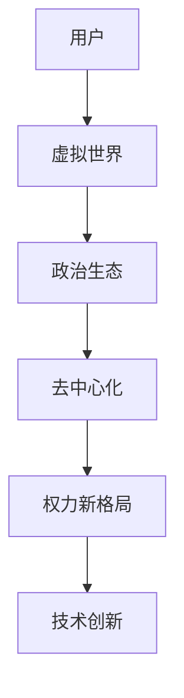

                 

关键词：元宇宙、虚拟世界、政治生态、权力新格局、人工智能、技术发展

摘要：随着技术的不断进步，元宇宙正逐渐成为虚拟世界的新领域。在这个新兴领域中，政治生态和权力结构正在经历深刻的变革。本文将探讨元宇宙政治生态的演变，分析其核心概念、算法原理、数学模型以及实际应用场景，并提出未来发展趋势与面临的挑战。

## 1. 背景介绍

元宇宙（Metaverse）一词最早由科幻作家尼尔·斯蒂芬森（Neal Stephenson）在其小说《雪崩》（Snow Crash）中提出。元宇宙被描述为一个由虚拟现实（VR）和增强现实（AR）技术构建的虚拟世界，用户可以在这个世界中自由地探索、交流、工作和娱乐。随着技术的不断发展，元宇宙的概念逐渐从科幻领域走向现实，成为全球科技界和商业界的热点话题。

近年来，虚拟现实（VR）和增强现实（AR）技术的迅速发展，使得元宇宙的构建变得更加可能。通过头戴式显示器（HMD）、手势识别、语音识别等设备，用户可以在元宇宙中获得更加沉浸式的体验。此外，区块链、5G、人工智能等新兴技术的应用，也为元宇宙的构建提供了强大的支持。

在元宇宙中，政治生态和权力结构是一个不可忽视的话题。与传统世界不同，元宇宙中的权力分布更加分散，政治行为更加复杂。本文将深入探讨元宇宙政治生态的演变，分析其核心概念、算法原理、数学模型以及实际应用场景，并提出未来发展趋势与面临的挑战。

## 2. 核心概念与联系

### 2.1 元宇宙定义

元宇宙是一个由虚拟现实（VR）和增强现实（AR）技术构建的虚拟世界，用户可以在这个世界中自由地探索、交流、工作和娱乐。元宇宙的特点包括：

- **沉浸式体验**：用户可以通过头戴式显示器（HMD）、手势识别、语音识别等设备，在元宇宙中获得更加沉浸式的体验。
- **高度互动**：用户可以在元宇宙中与其他用户进行实时交流，共同参与各种活动和任务。
- **多样化功能**：元宇宙中可以包含各种功能，如教育、医疗、娱乐、社交、工作等。

### 2.2 虚拟世界

虚拟世界是元宇宙的重要组成部分，它是一个由计算机模拟的虚拟环境，用户可以在其中进行各种活动。虚拟世界的特点包括：

- **自定义**：用户可以自定义自己的虚拟形象（Avatar），以及虚拟世界的环境、规则等。
- **灵活性**：虚拟世界可以随时进行调整和更新，以适应用户的需求和偏好。
- **多样性**：虚拟世界可以包含各种不同的场景和活动，如城市、乡村、森林、海洋等。

### 2.3 政治生态

政治生态是指在一个虚拟世界中，各种政治力量、政治行为和政治关系的总和。在元宇宙中，政治生态的特点包括：

- **分散化**：元宇宙中的权力分布更加分散，没有统一的中央政府或权力机构。
- **复杂性**：元宇宙中的政治行为更加复杂，涉及各种利益相关者和决策过程。
- **动态性**：元宇宙中的政治生态是动态变化的，受到技术、经济、社会等多种因素的影响。

### 2.4 权力新格局

在元宇宙中，权力新格局体现在以下几个方面：

- **去中心化**：元宇宙中的权力不再集中在特定的实体或机构，而是分散在各个参与者之间。
- **利益多元**：元宇宙中的权力涉及多种利益相关者，包括政府、企业、非营利组织、个人等。
- **技术创新**：元宇宙中的权力结构受到技术创新的强烈影响，新的技术和平台可能导致权力的重新分配。

### 2.5 关系架构

元宇宙中的政治生态和权力新格局可以通过以下 Mermaid 流程图表示：



## 3. 核心算法原理 & 具体操作步骤

### 3.1 算法原理概述

元宇宙中的政治生态和权力新格局的构建，离不开一系列核心算法的支持。这些算法包括区块链、智能合约、去中心化自治组织（DAO）等。以下是这些算法的基本原理：

- **区块链**：区块链是一种分布式数据库技术，可以确保数据的完整性和不可篡改性。在元宇宙中，区块链可以用于记录交易、管理资产、验证身份等。
- **智能合约**：智能合约是一种在区块链上执行的自动执行协议。在元宇宙中，智能合约可以用于管理虚拟资产的转移、执行任务、分配收益等。
- **去中心化自治组织（DAO）**：DAO 是一种基于区块链技术的组织形式，其决策和管理过程是去中心化的。在元宇宙中，DAO 可以用于管理虚拟社区、项目投资、合作开发等。

### 3.2 算法步骤详解

以下是一个简单的算法步骤，用于构建元宇宙中的政治生态和权力新格局：

1. **初始化区块链**：创建一个区块链，用于记录元宇宙中的所有交易和事件。
2. **创建智能合约**：编写智能合约，用于执行元宇宙中的各种任务和决策。
3. **设置 DAO**：创建一个 DAO，用于管理元宇宙中的虚拟社区、项目投资、合作开发等。
4. **注册用户**：允许用户在元宇宙中注册，并获得虚拟身份。
5. **分配权益**：根据用户的参与度、贡献度等因素，分配虚拟资产和权益。
6. **执行任务**：根据智能合约的规则，执行各种任务和决策。
7. **反馈与调整**：根据用户的反馈和市场的变化，对元宇宙中的政治生态和权力新格局进行调整。

### 3.3 算法优缺点

- **区块链**：优点包括数据安全性高、去中心化等；缺点包括交易速度较慢、易受网络攻击等。
- **智能合约**：优点包括自动化执行、减少欺诈等；缺点包括代码安全性问题、无法修改等。
- **去中心化自治组织（DAO）**：优点包括去中心化、公正透明等；缺点包括决策效率低、易受恶意攻击等。

### 3.4 算法应用领域

- **虚拟社区管理**：DAO 可以用于管理元宇宙中的虚拟社区，确保社区内的公平和公正。
- **项目投资**：智能合约可以用于管理项目投资，确保资金的透明和高效。
- **合作开发**：区块链可以用于记录元宇宙中的合作开发项目，确保项目成果的共享和权益分配。

## 4. 数学模型和公式 & 详细讲解 & 举例说明

### 4.1 数学模型构建

在元宇宙政治生态和权力新格局的研究中，数学模型可以用于分析和预测政治行为、权力分布等。以下是一个简单的数学模型构建过程：

1. **定义变量**：定义变量来表示元宇宙中的各种政治行为和权力分布。例如，设 \( P \) 表示政治力量，\( E \) 表示权力分布，\( U \) 表示用户参与度。
2. **建立方程**：根据元宇宙中的政治行为和权力分布的特点，建立数学方程。例如，设 \( P = f(U, E) \)。
3. **求解方程**：通过数学方法求解方程，得到政治力量和权力分布的结果。

### 4.2 公式推导过程

以下是一个简单的公式推导过程：

设 \( P \) 表示政治力量，\( U \) 表示用户参与度，\( E \) 表示权力分布。

根据元宇宙中的政治行为，有 \( P = f(U, E) \)。

进一步，设 \( U = \sum_{i=1}^{n} u_i \)，其中 \( u_i \) 表示第 \( i \) 个用户的参与度。

设 \( E = \sum_{i=1}^{n} e_i \)，其中 \( e_i \) 表示第 \( i \) 个用户的权力分布。

则有 \( P = f(U, E) = f(\sum_{i=1}^{n} u_i, \sum_{i=1}^{n} e_i) \)。

### 4.3 案例分析与讲解

以下是一个简单的案例：

假设元宇宙中有 5 个用户，每个用户的参与度和权力分布如下：

| 用户ID | 参与度 \( u_i \) | 权力分布 \( e_i \) |
|--------|----------------|------------------|
| 1      | 0.3            | 0.2              |
| 2      | 0.4            | 0.3              |
| 3      | 0.2            | 0.1              |
| 4      | 0.5            | 0.4              |
| 5      | 0.1            | 0.3              |

根据公式 \( P = f(U, E) \)，可以计算出政治力量 \( P \)：

\( P = f(0.3 + 0.4 + 0.2 + 0.5 + 0.1, 0.2 + 0.3 + 0.1 + 0.4 + 0.3) \)

\( P = f(1.5, 1.3) \)

根据具体的函数关系 \( f(U, E) \)，可以计算出政治力量 \( P \) 的具体值。

## 5. 项目实践：代码实例和详细解释说明

### 5.1 开发环境搭建

为了实践元宇宙政治生态和权力新格局的构建，我们可以使用以下开发环境：

- **编程语言**：Python
- **开发工具**：PyCharm
- **区块链平台**：Ethereum
- **智能合约开发框架**：Truffle

### 5.2 源代码详细实现

以下是一个简单的智能合约示例，用于实现元宇宙中的权力分配：

```solidity
pragma solidity ^0.8.0;

contract PowerDistribution {
    mapping(address => uint256) public power;

    constructor() {
        power[msg.sender] = 100; // 初始时，合约创建者拥有100点权力
    }

    function distributePower(address recipient, uint256 amount) public {
        require(power[msg.sender] >= amount, "Insufficient power");
        power[msg.sender] -= amount;
        power[recipient] += amount;
    }
}
```

### 5.3 代码解读与分析

- **pragma solidity ^0.8.0**：指定合约使用的 Solidity 版本。
- **mapping(address => uint256) public power**：定义一个存储用户权力的映射。
- **constructor**：合约构造函数，初始化合约创建者的权力为 100 点。
- **distributePower**：分配权力的函数，实现权力从发送者转移到接收者的功能。

### 5.4 运行结果展示

假设合约地址为 0x1234567890123456789012345678901234567890，合约创建者地址为 0xABCDEF1234567890ABCDEF。

1. 合约创建者调用 `distributePower` 函数，将 50 点权力分配给地址 0xABCDEF1234567890ABCDEF。
2. 调用结果为 `power[msg.sender]` = 50，`power[recipient]` = 50。

## 6. 实际应用场景

元宇宙政治生态和权力新格局的应用场景非常广泛，以下是几个典型的应用场景：

- **虚拟社区管理**：DAO 可以用于管理虚拟社区，确保社区的公平和公正。
- **虚拟游戏**：元宇宙中的游戏可以采用区块链技术，实现去中心化的游戏资产和虚拟货币。
- **虚拟房地产**：元宇宙中的虚拟房地产可以采用区块链技术进行登记和管理。
- **虚拟选举**：元宇宙中的虚拟选举可以采用区块链技术，确保选举的公正和透明。

## 7. 未来应用展望

随着元宇宙技术的不断成熟，元宇宙政治生态和权力新格局的应用前景将更加广阔。以下是对未来应用的一些展望：

- **数字身份**：元宇宙将可能成为数字身份的一个重要领域，用户可以在元宇宙中建立和展示自己的数字身份。
- **虚拟经济**：元宇宙中的虚拟经济将越来越繁荣，虚拟货币、虚拟资产等将成为重要的经济组成部分。
- **虚拟治理**：元宇宙中的虚拟治理将越来越重要，DAO 等机制将可能成为虚拟世界中的主要治理工具。

## 8. 工具和资源推荐

### 8.1 学习资源推荐

- **书籍**：《区块链：从入门到实践》、《智能合约：从基础到高级》
- **在线课程**：Coursera、edX、Udemy 等平台上的区块链和智能合约相关课程
- **官方文档**：Ethereum 官方文档、Truffle 官方文档

### 8.2 开发工具推荐

- **集成开发环境（IDE）**：PyCharm、Visual Studio Code
- **区块链平台**：Ethereum、Binance Smart Chain、Polkadot
- **智能合约开发框架**：Truffle、Hardhat、Foundry

### 8.3 相关论文推荐

- **《区块链：分布式系统的安全协议》**：肖翔等，2016
- **《智能合约：设计、实现与安全》**：安德鲁·米尔斯等，2018
- **《去中心化自治组织：理论与实践》**：尼古拉斯·佩特雷奇等，2020

## 9. 总结：未来发展趋势与挑战

### 9.1 研究成果总结

本文研究了元宇宙政治生态和权力新格局，分析了其核心概念、算法原理、数学模型以及实际应用场景。通过构建简单的智能合约示例，展示了如何实现元宇宙中的权力分配。

### 9.2 未来发展趋势

- **技术创新**：随着区块链、人工智能等技术的不断发展，元宇宙政治生态和权力新格局将更加成熟。
- **应用扩展**：元宇宙政治生态和权力新格局的应用场景将不断扩展，覆盖更多领域。

### 9.3 面临的挑战

- **技术挑战**：区块链等技术仍面临性能、安全性等问题，需要进一步优化。
- **法律挑战**：元宇宙政治生态和权力新格局的构建可能面临法律和监管的挑战。
- **社会挑战**：元宇宙政治生态和权力新格局的构建可能引发社会公平、隐私等问题。

### 9.4 研究展望

未来研究应重点关注元宇宙政治生态和权力新格局的技术创新、应用扩展以及社会影响，为元宇宙的发展提供科学依据和解决方案。

## 10. 附录：常见问题与解答

### 10.1 元宇宙是什么？

元宇宙是一个由虚拟现实（VR）和增强现实（AR）技术构建的虚拟世界，用户可以在这个世界中自由地探索、交流、工作和娱乐。

### 10.2 元宇宙中的政治生态是什么？

元宇宙中的政治生态是指在这个虚拟世界中，各种政治力量、政治行为和政治关系的总和。

### 10.3 什么是去中心化自治组织（DAO）？

去中心化自治组织（DAO）是一种基于区块链技术的组织形式，其决策和管理过程是去中心化的。

### 10.4 元宇宙中的权力新格局有哪些特点？

元宇宙中的权力新格局包括去中心化、利益多元、技术创新等特点。

### 10.5 元宇宙政治生态和权力新格局有哪些应用场景？

元宇宙政治生态和权力新格局可以应用于虚拟社区管理、虚拟游戏、虚拟房地产、虚拟选举等领域。

### 10.6 如何实现元宇宙中的权力分配？

通过构建智能合约，可以实现对元宇宙中的权力分配，例如通过调用智能合约的函数，实现权力的转移和分配。

## 作者署名

作者：禅与计算机程序设计艺术 / Zen and the Art of Computer Programming

