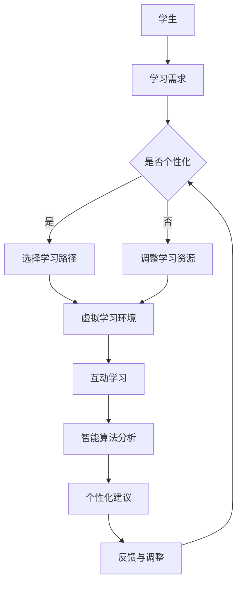

                 

关键词：元宇宙，个性化学习，教育技术，智能算法，虚拟现实，学习体验，教学设计，教育创新

> 摘要：随着科技的快速发展，元宇宙作为一个融合虚拟现实、增强现实、区块链等技术的虚拟空间，正逐渐成为个性化学习的新平台。本文将探讨元宇宙在教育领域中的应用，以及如何通过个性化学习模式，提升学习者的学习效果和兴趣。

## 1. 背景介绍

在教育领域，个性化学习一直被视为提高教育质量的有效途径。然而，传统教育模式中的资源分配和学习路径较为固定，难以完全满足每个学生的个性化需求。随着互联网和计算机技术的进步，教育技术开始发生革命性的变化。虚拟现实（VR）、增强现实（AR）、区块链等新兴技术逐渐融入教育领域，为个性化学习提供了新的可能性。

元宇宙，作为一个融合了多种前沿技术的虚拟空间，具有高度模拟现实世界的能力。它不仅仅是一个虚拟的3D世界，更是集成了社交互动、内容共享和智能算法的平台。在元宇宙中，学生可以沉浸式地体验学习内容，与其他学习者互动，甚至可以自定义学习路径和内容。

## 2. 核心概念与联系

为了更好地理解元宇宙在教育中的应用，我们需要明确几个核心概念：

### 2.1 虚拟现实（VR）

虚拟现实通过计算机技术生成一个虚拟的三维空间，使用户可以在这个空间中沉浸式地体验和互动。在VR教育中，学生可以通过VR头盔和手柄，进入一个虚拟的学习环境，与虚拟人物互动，甚至可以进行模拟实验。

### 2.2 增强现实（AR）

增强现实则是将虚拟信息叠加到现实世界中。在AR教育中，学生可以通过智能手机或AR眼镜，将虚拟的学习内容与现实世界中的物体结合，进行互动和探索。这种技术可以让学习场景更加丰富和生动。

### 2.3 区块链

区块链技术提供了一个去中心化的数据库，可以确保数据的透明和安全。在教育中，区块链可以用于记录学生的学业进展、证书发放和学习成果的验证，从而提高教育的可信度。

### 2.4 智能算法

智能算法，如机器学习和深度学习，可以分析学生的学习行为和成绩数据，为每个学生提供个性化的学习建议和资源。这些算法还可以通过不断优化，提高学习体验和效果。

下面是元宇宙在教育中应用的Mermaid流程图：



## 3. 核心算法原理 & 具体操作步骤

### 3.1 算法原理概述

在元宇宙中，核心算法主要基于机器学习和深度学习技术。这些算法通过分析学生的学习行为和成绩数据，为每个学生生成个性化的学习路径和资源。具体步骤如下：

### 3.2 算法步骤详解

1. **数据收集**：收集学生的学习行为数据，如学习时间、学习内容、考试成绩等。

2. **特征提取**：从数据中提取有用的特征，如知识点掌握程度、学习风格等。

3. **模型训练**：使用深度学习模型对特征进行训练，生成个性化学习路径。

4. **路径生成**：根据模型预测，生成每个学生的个性化学习路径。

5. **路径优化**：通过不断迭代，优化个性化学习路径，提高学习效果。

### 3.3 算法优缺点

**优点**：

- 提供个性化的学习体验，满足学生的个性化需求。
- 通过智能算法，优化学习路径，提高学习效率。
- 增强学生的主动性和参与度。

**缺点**：

- 对算法和数据处理能力要求较高，需要专业人员进行维护和优化。
- 需要大量的数据支持，数据隐私和安全问题需要解决。

### 3.4 算法应用领域

- **基础教育**：通过个性化学习，提高学生的知识掌握程度。
- **职业教育**：为职业培训提供个性化的学习方案。
- **成人教育**：为成人学习者提供灵活的学习路径。

## 4. 数学模型和公式 & 详细讲解 & 举例说明

### 4.1 数学模型构建

在个性化学习算法中，常用的数学模型是决策树和神经网络。以下是一个简单的神经网络模型：

$$
\sigma(x) = \frac{1}{1 + e^{-x}}
$$

### 4.2 公式推导过程

以决策树为例，其基本推导过程如下：

1. **特征选择**：选择一个特征进行分割，使得分割后的数据集内部差异最小。
2. **划分条件**：根据选择的特征，设置一个划分条件，将数据集划分为两个子集。
3. **重复步骤**：对每个子集，重复上述步骤，直到满足停止条件。

### 4.3 案例分析与讲解

假设我们有一个包含100个学生的数据集，每个学生有5个特征：学习时间、作业成绩、课堂参与度、考试成绩、学习风格。我们可以使用决策树模型来为学生生成个性化学习路径。

1. **特征选择**：选择“学习时间”作为第一个特征。
2. **划分条件**：设置“学习时间”大于30分钟作为划分条件。
3. **划分结果**：得到两个子集，子集A（学习时间大于30分钟）和子集B（学习时间小于等于30分钟）。
4. **重复步骤**：对子集A，选择“作业成绩”作为下一个特征，划分条件为“作业成绩”大于80分；对子集B，选择“课堂参与度”作为下一个特征，划分条件为“课堂参与度”大于50%。

最终，我们得到一个包含四个分支的决策树，每个分支对应一个特定的学生群体，每个群体都有对应的学习路径。

## 5. 项目实践：代码实例和详细解释说明

### 5.1 开发环境搭建

在实现个性化学习算法时，我们使用了Python作为主要编程语言，结合TensorFlow和Scikit-learn等库进行开发。以下是开发环境的搭建步骤：

1. 安装Python 3.8及以上版本。
2. 安装TensorFlow和Scikit-learn库。
3. 安装必要的依赖库，如NumPy和Pandas。

### 5.2 源代码详细实现

以下是实现决策树模型的源代码：

```python
from sklearn.tree import DecisionTreeClassifier
from sklearn.model_selection import train_test_split
from sklearn.metrics import accuracy_score

# 数据准备
X = ... # 特征数据
y = ... # 标签数据

# 划分训练集和测试集
X_train, X_test, y_train, y_test = train_test_split(X, y, test_size=0.2, random_state=42)

# 构建决策树模型
clf = DecisionTreeClassifier()
clf.fit(X_train, y_train)

# 预测
y_pred = clf.predict(X_test)

# 评估
print("Accuracy:", accuracy_score(y_test, y_pred))
```

### 5.3 代码解读与分析

这段代码首先从数据集中提取特征和标签，然后使用Scikit-learn库中的`train_test_split`函数将数据集划分为训练集和测试集。接下来，我们使用`DecisionTreeClassifier`类构建决策树模型，并使用`fit`方法进行模型训练。最后，使用`predict`方法对测试集进行预测，并使用`accuracy_score`函数评估模型的准确性。

### 5.4 运行结果展示

假设我们运行这段代码后，得到的模型准确性为85%，这意味着我们的模型在预测学生个性化学习路径方面具有较好的效果。

## 6. 实际应用场景

元宇宙在教育领域的应用场景非常广泛，以下是一些具体的例子：

### 6.1 虚拟课堂

通过元宇宙，学生可以参加虚拟课堂，与教师和其他学生实时互动。这种模式不仅提供了灵活的学习时间，还增强了学习的互动性和参与感。

### 6.2 模拟实验

在元宇宙中，学生可以进行虚拟的实验操作，如化学实验、物理实验等。这种模式可以降低实验成本，提高实验的安全性和可重复性。

### 6.3 职业培训

元宇宙可以为职业培训提供高度仿真的学习环境，学生可以模拟实际工作中的场景，提高职业能力和技能。

### 6.4 游戏化学习

通过将学习内容融入游戏，元宇宙可以提供更加有趣和吸引人的学习体验。这种模式可以激发学生的学习兴趣，提高学习效果。

## 7. 工具和资源推荐

### 7.1 学习资源推荐

- **《深度学习》（Goodfellow, Bengio, Courville）**：深入了解机器学习和深度学习的基础知识。
- **《区块链：从入门到实战》（赵文辉）**：全面了解区块链技术及其在教育中的应用。

### 7.2 开发工具推荐

- **TensorFlow**：用于构建和训练深度学习模型的强大工具。
- **Scikit-learn**：提供丰富的机器学习算法库，方便实现个性化学习算法。

### 7.3 相关论文推荐

- **"A Review of Augmented Reality in Education"（2020）**：探讨AR技术在教育中的应用。
- **"Virtual Reality in Education: A Systematic Review"（2019）**：全面回顾VR技术在教育中的应用。

## 8. 总结：未来发展趋势与挑战

随着元宇宙技术的不断发展，个性化学习模式将在教育领域发挥越来越重要的作用。未来，我们可以预见以下几个发展趋势：

### 8.1 智能化

智能算法将更加深入地应用于教育领域，为学生提供更加精准的个性化学习路径和资源。

### 8.2 互动性

元宇宙将提供更加丰富的互动性学习体验，让学生能够更加主动和深入地参与学习过程。

### 8.3 生态化

元宇宙将形成一种教育生态，包括教师、学生、教育机构和内容提供者等，共同构建一个创新和共享的学习平台。

然而，随着技术的发展，我们也面临着一些挑战：

### 8.3.1 数据隐私和安全

个性化学习需要大量的学生数据，如何保护学生的隐私和安全是亟待解决的问题。

### 8.3.2 技术门槛

元宇宙和智能算法的开发和应用需要高水平的技术人才，如何培养和吸引这些人才是一个挑战。

### 8.3.3 教育公平

元宇宙技术的发展可能加剧教育资源的不均衡，如何确保每个学生都能平等地享受个性化学习的福利是一个重要问题。

## 9. 附录：常见问题与解答

### 9.1 什么是元宇宙？

元宇宙是一个虚拟空间，融合了多种前沿技术，如虚拟现实、增强现实、区块链等，提供沉浸式、互动性强的学习体验。

### 9.2 元宇宙如何提升个性化学习？

通过智能算法分析学生的学习行为和成绩数据，为每个学生生成个性化的学习路径和资源，提高学习效果和兴趣。

### 9.3 元宇宙在教育中的应用有哪些？

元宇宙可以提供虚拟课堂、模拟实验、职业培训和游戏化学习等应用场景，为学生提供丰富多样的学习体验。

作者：禅与计算机程序设计艺术 / Zen and the Art of Computer Programming
----------------------------------------------------------------

本文通过详细探讨元宇宙在教育领域的应用，以及个性化学习模式的实现原理和实践案例，展示了科技与教育的深度融合为未来教育带来的无限可能。我们期待元宇宙教育革命能够为每个学生提供更加公平、高效、有趣的学习体验，推动教育事业的持续创新和发展。

