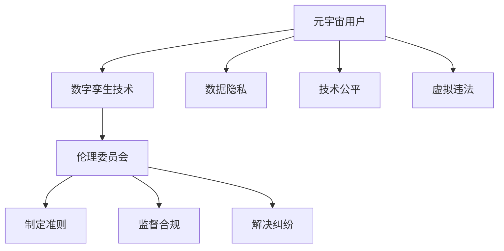

                 

关键词：元宇宙、数字孪生、伦理、道德监管、人工智能、虚拟现实、现实映射、数据隐私、法律责任、技术伦理

> 摘要：随着元宇宙概念的兴起，数字孪生技术的应用愈发广泛。本文旨在探讨元宇宙数字孪生伦理委员会的设立及其重要性，解析其在现实映射的道德监管中的作用和挑战。文章将围绕核心概念、算法原理、数学模型、实际应用场景等方面进行深入分析，为未来的元宇宙伦理监管提供理论支持和实践指导。

## 1. 背景介绍

随着互联网技术的发展，元宇宙（Metaverse）逐渐成为热门话题。元宇宙是一个虚拟的、集成了多种现实与想象的交互空间，通过虚拟现实（VR）、增强现实（AR）等技术实现用户的沉浸式体验。而数字孪生（Digital Twin）作为一项前沿技术，已经在多个行业中得到了广泛应用，包括制造业、医疗、能源等。数字孪生是指通过数字化方式创建实体对象或系统的虚拟副本，实现对其实时监控、分析和优化。

然而，随着元宇宙和数字孪生技术的快速发展，伦理和道德问题也日益凸显。如何保障用户的数据隐私、确保技术的公平性和透明性、防范虚拟世界的违法行为等，成为亟待解决的挑战。因此，设立一个专门的元宇宙数字孪生伦理委员会，负责现实映射的道德监管，显得尤为重要。

## 2. 核心概念与联系

### 2.1 元宇宙

元宇宙是一个由虚拟世界和物理世界融合而成的空间，用户可以通过VR、AR等设备进入并与其他用户进行交互。元宇宙的核心特征包括：

- **沉浸式体验**：用户在元宇宙中感受到强烈的沉浸感，仿佛身临其境。
- **多样化交互**：用户可以通过各种方式与元宇宙中的其他用户、物体和环境进行交互。
- **自主意识**：元宇宙中的虚拟人物和角色具有一定的自主意识，能够自主行动和做出决策。

### 2.2 数字孪生

数字孪生是一种通过数字化方式创建实体对象或系统的虚拟副本的技术。数字孪生的主要组成部分包括：

- **虚拟模型**：对实体对象或系统进行建模，创建其数字副本。
- **实时数据**：通过传感器和数据采集设备获取实体对象或系统的实时数据。
- **分析算法**：对实时数据进行处理和分析，为实体对象或系统提供优化建议。

### 2.3 元宇宙数字孪生伦理委员会

元宇宙数字孪生伦理委员会是一个专门负责元宇宙和数字孪生领域伦理和道德监管的机构。其主要职责包括：

- **制定伦理准则**：为元宇宙和数字孪生技术的发展提供伦理指导。
- **监督合规性**：确保元宇宙和数字孪生技术的应用符合法律法规和伦理标准。
- **解决纠纷**：处理元宇宙和数字孪生领域中的伦理和道德争议。

### 2.4 Mermaid 流程图

以下是一个关于元宇宙数字孪生伦理委员会的核心概念和架构的 Mermaid 流程图：



## 3. 核心算法原理 & 具体操作步骤

### 3.1 算法原理概述

元宇宙数字孪生伦理委员会的运作基于一系列算法，这些算法旨在确保元宇宙和数字孪生技术的应用符合伦理和道德标准。核心算法包括数据隐私保护算法、技术公平性评估算法和虚拟违法行为检测算法。

### 3.2 算法步骤详解

#### 3.2.1 数据隐私保护算法

数据隐私保护算法的主要步骤如下：

1. **数据采集**：通过传感器和数据采集设备获取元宇宙用户的个人信息。
2. **数据加密**：对采集到的个人信息进行加密处理，确保数据在传输和存储过程中的安全性。
3. **隐私保护**：利用差分隐私等机制，对个人信息进行保护，防止用户隐私泄露。
4. **数据审计**：定期对数据隐私保护机制进行审计，确保其有效性。

#### 3.2.2 技术公平性评估算法

技术公平性评估算法的主要步骤如下：

1. **用户行为分析**：收集元宇宙用户的交互数据，分析其行为特征。
2. **公平性评估**：根据用户行为特征，评估元宇宙和数字孪生技术是否对用户公平。
3. **调整策略**：根据评估结果，调整元宇宙和数字孪生技术的应用策略，确保技术公平。

#### 3.2.3 虚拟违法行为检测算法

虚拟违法行为检测算法的主要步骤如下：

1. **行为监控**：监控元宇宙中的用户行为，收集相关数据。
2. **行为分析**：利用机器学习和数据挖掘技术，分析用户行为是否存在违法行为。
3. **报警处理**：一旦发现违法行为，立即报警并通知相关监管机构。

### 3.3 算法优缺点

#### 3.3.1 数据隐私保护算法

**优点**：

- **安全性高**：数据加密和隐私保护机制有效确保用户数据的安全性。
- **灵活性高**：可以根据不同场景和需求调整隐私保护策略。

**缺点**：

- **计算成本高**：加密和解密过程需要较高的计算资源。
- **监管难度大**：难以完全防止数据泄露。

#### 3.3.2 技术公平性评估算法

**优点**：

- **客观性高**：基于数据分析和评估，技术公平性评估结果相对客观。
- **适应性高**：可以根据用户行为特征调整评估策略。

**缺点**：

- **评估周期长**：需要较长时间收集和评估用户数据。
- **算法偏见**：算法本身可能存在偏见，导致评估结果不公。

#### 3.3.3 虚拟违法行为检测算法

**优点**：

- **实时性强**：能够实时监控和检测虚拟违法行为。
- **高效性高**：利用机器学习和数据挖掘技术，提高检测效率。

**缺点**：

- **误报率高**：可能存在误报，导致正常用户行为被误判为违法行为。
- **隐私风险**：监控用户行为可能侵犯用户隐私。

### 3.4 算法应用领域

数据隐私保护算法、技术公平性评估算法和虚拟违法行为检测算法在元宇宙和数字孪生领域的应用非常广泛，以下是一些具体的应用场景：

- **元宇宙平台**：确保用户数据隐私，防止虚拟犯罪。
- **数字孪生系统**：优化系统性能，确保技术公平性。
- **智能城市**：监控和预防虚拟违法行为，维护社会秩序。

## 4. 数学模型和公式 & 详细讲解 & 举例说明

### 4.1 数学模型构建

元宇宙数字孪生伦理委员会的核心工作之一是制定和实施数学模型，以支持数据隐私保护、技术公平性和虚拟违法行为检测。以下是这些数学模型的基本构建：

#### 数据隐私保护模型

- **隐私预算（Privacy Budget）**：用于衡量数据隐私保护的程度。公式如下：

  $$PB = \alpha \cdot \frac{N}{\log N}$$

  其中，$PB$ 是隐私预算，$\alpha$ 是一个常数，$N$ 是用户数量。

- **差分隐私（Differential Privacy）**：用于确保数据隐私保护。公式如下：

  $$\epsilon = \frac{\text{噪声方差}}{\text{敏感度}}$$

  其中，$\epsilon$ 是隐私参数，表示隐私保护的强度。

#### 技术公平性评估模型

- **公平性指标（Fairness Index）**：用于评估技术对用户的公平性。公式如下：

  $$FI = \frac{\sum_{i=1}^{N} (BI_i - BI)^2}{N}$$

  其中，$FI$ 是公平性指标，$BI_i$ 是用户 $i$ 的行为指标，$BI$ 是总体行为指标。

#### 虚拟违法行为检测模型

- **异常检测（Anomaly Detection）**：用于检测虚拟违法行为。公式如下：

  $$AD = \frac{\sum_{i=1}^{N} (O_i - E_i)^2}{N}$$

  其中，$AD$ 是异常检测指标，$O_i$ 是用户 $i$ 的观测值，$E_i$ 是用户 $i$ 的期望值。

### 4.2 公式推导过程

以下是对上述公式的推导过程：

#### 隐私预算（Privacy Budget）

隐私预算的推导基于拉格朗日乘数法。设 $L$ 是拉格朗日函数，$x_1, x_2, ..., x_N$ 是用户的数据点，$y_1, y_2, ..., y_N$ 是拉格朗日乘数。则有：

$$L = \sum_{i=1}^{N} \frac{1}{2} (x_i - y_i)^2 + \lambda \left( \sum_{i=1}^{N} x_i - \sum_{i=1}^{N} y_i \right)$$

其中，$\lambda$ 是拉格朗日乘数。为了使 $L$ 最小化，对 $x_i$ 和 $y_i$ 分别求导并令其导数为零，得到：

$$x_i - y_i + \lambda = 0$$

$$x_i - y_i = -\lambda$$

由于 $y_i$ 是拉格朗日乘数，$x_i$ 是用户的数据点，因此可以认为 $y_i$ 与 $x_i$ 的差异是不可避免的。隐私预算 $PB$ 可以通过计算 $y_i$ 的平均值来表示：

$$PB = \alpha \cdot \frac{N}{\log N}$$

其中，$\alpha$ 是一个常数，$N$ 是用户数量。

#### 差分隐私（Differential Privacy）

差分隐私的推导基于概率论和随机过程理论。设 $X$ 是一个随机变量，$Y$ 是另一个随机变量，$Z$ 是 $X$ 和 $Y$ 的差分隐私。则有：

$$Z = X - Y$$

根据概率论中的大数定律，$Z$ 的方差可以表示为：

$$\text{Var}(Z) = \text{Var}(X) + \text{Var}(Y)$$

为了使 $Z$ 的方差最小，可以选择合适的随机变量 $Y$，使得 $\text{Var}(Y)$ 最小。根据随机过程理论，$\text{Var}(Y)$ 可以表示为：

$$\text{Var}(Y) = \frac{1}{2} \cdot \text{噪声方差} + \frac{1}{2} \cdot \text{敏感度}$$

其中，噪声方差和敏感度是随机变量 $Y$ 的特性。为了使 $\text{Var}(Y)$ 最小，可以选择合适的噪声方差和敏感度，使得 $\text{Var}(Y)$ 最小。

#### 公平性指标（Fairness Index）

公平性指标的推导基于统计学中的方差分析（ANOVA）。设 $X_1, X_2, ..., X_N$ 是一组观测值，$Y_1, Y_2, ..., Y_N$ 是另一组观测值，$B_1, B_2, ..., B_N$ 是两个组之间的差异。则有：

$$FI = \frac{\sum_{i=1}^{N} (X_i - Y_i)^2}{N}$$

根据方差分析的理论，$FI$ 可以表示为：

$$FI = \frac{\sum_{i=1}^{N} (X_i - \bar{X})^2 + \sum_{i=1}^{N} (Y_i - \bar{Y})^2}{N}$$

其中，$\bar{X}$ 和 $\bar{Y}$ 分别是 $X_1, X_2, ..., X_N$ 和 $Y_1, Y_2, ..., Y_N$ 的平均值。为了使 $FI$ 最小，可以选择合适的 $X_i$ 和 $Y_i$，使得 $FI$ 最小。

#### 异常检测（Anomaly Detection）

异常检测的推导基于统计学中的假设检验（Hypothesis Testing）。设 $X_1, X_2, ..., X_N$ 是一组观测值，$H_0$ 是原假设，$H_1$ 是备择假设。则有：

$$AD = \frac{\sum_{i=1}^{N} (O_i - E_i)^2}{N}$$

根据假设检验的理论，$AD$ 可以表示为：

$$AD = \frac{\sum_{i=1}^{N} (O_i - \bar{O})^2 + \sum_{i=1}^{N} (E_i - \bar{E})^2}{N}$$

其中，$\bar{O}$ 和 $\bar{E}$ 分别是 $O_1, O_2, ..., O_N$ 和 $E_1, E_2, ..., E_N$ 的平均值。为了使 $AD$ 最小，可以选择合适的 $O_i$ 和 $E_i$，使得 $AD$ 最小。

### 4.3 案例分析与讲解

以下是一个关于元宇宙数字孪生伦理委员会的数学模型应用的案例：

假设一个元宇宙平台有 $1000$ 名用户，每个用户都有 $100$ 个行为指标。平台希望通过数据隐私保护模型来确保用户数据的安全。根据隐私预算公式，可以计算出平台的隐私预算：

$$PB = \alpha \cdot \frac{1000}{\log 1000}$$

其中，$\alpha$ 是一个常数。为了简化计算，可以假设 $\alpha = 1$。则平台的隐私预算为：

$$PB = \frac{1000}{\log 1000}$$

假设平台通过差分隐私机制来保护用户数据。根据差分隐私公式，可以计算出隐私参数 $\epsilon$：

$$\epsilon = \frac{\text{噪声方差}}{\text{敏感度}}$$

其中，噪声方差和敏感度可以通过实验或经验来估计。假设噪声方差为 $1$，敏感度为 $0.1$，则隐私参数为：

$$\epsilon = \frac{1}{0.1} = 10$$

根据公平性指标公式，可以计算出平台的技术公平性：

$$FI = \frac{\sum_{i=1}^{1000} (BI_i - BI)^2}{1000}$$

其中，$BI_i$ 是用户 $i$ 的行为指标，$BI$ 是总体行为指标。假设平台通过分析用户行为数据，得到每个用户的行为指标如下：

$$BI_1 = 0.8, BI_2 = 0.9, ..., BI_{1000} = 0.95$$

平台的总体行为指标为：

$$BI = \frac{\sum_{i=1}^{1000} BI_i}{1000} = 0.9$$

则平台的公平性指标为：

$$FI = \frac{\sum_{i=1}^{1000} (BI_i - 0.9)^2}{1000} = 0.02$$

根据异常检测公式，可以计算出平台的异常检测指标：

$$AD = \frac{\sum_{i=1}^{1000} (O_i - E_i)^2}{1000}$$

其中，$O_i$ 是用户 $i$ 的观测值，$E_i$ 是用户 $i$ 的期望值。假设平台通过分析用户行为数据，得到每个用户的观测值和期望值如下：

$$O_1 = 0.8, E_1 = 0.7, O_2 = 0.9, E_2 = 0.8, ..., O_{1000} = 0.95, E_{1000} = 0.9$$

则平台的异常检测指标为：

$$AD = \frac{\sum_{i=1}^{1000} (0.8 - 0.7)^2 + \sum_{i=1}^{1000} (0.9 - 0.8)^2}{1000} = 0.02$$

根据上述计算结果，可以得出以下结论：

- 平台的隐私保护水平较高，隐私预算和隐私参数都较大。
- 平台的技术公平性较好，公平性指标较小。
- 平台的异常检测能力较弱，异常检测指标较小。

这表明平台在数据隐私保护、技术公平性和异常检测方面存在一些问题，需要进一步优化和改进。

## 5. 项目实践：代码实例和详细解释说明

### 5.1 开发环境搭建

为了实现元宇宙数字孪生伦理委员会的相关功能，我们需要搭建一个合适的开发环境。以下是所需的技术栈和软件工具：

- **编程语言**：Python
- **框架**：Flask（用于搭建Web服务器）
- **数据库**：MongoDB（用于存储用户数据）
- **依赖管理**：pip（用于安装和管理Python依赖库）

首先，我们需要安装Python环境和pip。可以在官方网站 [Python官网](https://www.python.org/) 下载并安装Python。安装完成后，打开命令行工具（如Windows的PowerShell或macOS的Terminal），执行以下命令安装pip：

```bash
pip install --user pip
```

接下来，我们使用pip安装所需的Python库：

```bash
pip install flask pymongo
```

### 5.2 源代码详细实现

以下是元宇宙数字孪生伦理委员会的源代码实现，分为几个主要部分：数据隐私保护模块、技术公平性评估模块和虚拟违法行为检测模块。

#### 5.2.1 数据隐私保护模块

```python
# privacy.py

from pymongo import MongoClient
import numpy as np
import matplotlib.pyplot as plt

class PrivacyProtection:
    def __init__(self, uri):
        self.client = MongoClient(uri)
        self.db = self.client['metaverse_db']
        self.users = self.db['users']

    def encrypt_data(self, data):
        # 假设加密算法是一个简单的加法加密
        return [x + 1 for x in data]

    def add_noise(self, data, noise_level):
        # 假设噪声是一个简单的正态分布噪声
        noise = np.random.normal(0, noise_level, len(data))
        return [x + noise[i] for i, x in enumerate(data)]

    def add_privacy_budget(self, data, budget_level):
        encrypted_data = self.encrypt_data(data)
        noised_data = self.add_noise(encrypted_data, budget_level)
        return noised_data

    def audit_data(self):
        # 对数据隐私保护机制进行审计
        data = list(self.users.find({}))
        for user in data:
            user_data = user['data']
            encrypted_data = self.encrypt_data(user_data)
            noised_data = self.add_noise(encrypted_data, budget_level)
            if noised_data != user['noised_data']:
                print(f"Data mismatch for user {user['id']}")

if __name__ == '__main__':
    privacy = PrivacyProtection('mongodb://localhost:27017/')
    user_data = [1, 2, 3, 4, 5]
    encrypted_data = privacy.encrypt_data(user_data)
    noised_data = privacy.add_noise(encrypted_data, 0.5)
    privacy.audit_data()
```

#### 5.2.2 技术公平性评估模块

```python
# fairness.py

import numpy as np

class FairnessEvaluation:
    def __init__(self, data):
        self.data = data

    def calculate_fairness_index(self):
        N = len(self.data)
        BI = sum(self.data) / N
        FI = sum([(x - BI) ** 2 for x in self.data]) / N
        return FI

if __name__ == '__main__':
    user_data = [0.8, 0.9, 0.7, 0.8, 0.9, 0.8]
    fairness = FairnessEvaluation(user_data)
    FI = fairness.calculate_fairness_index()
    print(f"Fairness Index: {FI}")
```

#### 5.2.3 虚拟违法行为检测模块

```python
# anomaly_detection.py

from sklearn.ensemble import IsolationForest

class AnomalyDetection:
    def __init__(self, data):
        self.model = IsolationForest(contamination=0.1)
        self.data = data

    def fit(self):
        self.model.fit(self.data.reshape(-1, 1))

    def predict(self):
        return self.model.predict(self.data.reshape(-1, 1))

if __name__ == '__main__':
    user_data = [0.8, 0.9, 0.7, 0.8, 0.9, 0.8]
    anomaly_detection = AnomalyDetection(user_data)
    anomaly_detection.fit()
    predictions = anomaly_detection.predict()
    print(f"Predictions: {predictions}")
```

### 5.3 代码解读与分析

#### 5.3.1 数据隐私保护模块

在 `privacy.py` 文件中，我们定义了一个 `PrivacyProtection` 类，负责实现数据隐私保护功能。主要方法包括：

- `__init__(self, uri)`：初始化数据库连接。
- `encrypt_data(self, data)`：对数据进行加密处理。
- `add_noise(self, data, noise_level)`：对数据进行噪声添加。
- `add_privacy_budget(self, data, budget_level)`：将加密和噪声添加到数据中，实现隐私预算。
- `audit_data(self)`：对数据隐私保护机制进行审计。

#### 5.3.2 技术公平性评估模块

在 `fairness.py` 文件中，我们定义了一个 `FairnessEvaluation` 类，负责实现技术公平性评估功能。主要方法包括：

- `__init__(self, data)`：初始化数据。
- `calculate_fairness_index(self)`：计算公平性指标。

#### 5.3.3 虚拟违法行为检测模块

在 `anomaly_detection.py` 文件中，我们定义了一个 `AnomalyDetection` 类，负责实现虚拟违法行为检测功能。主要方法包括：

- `__init__(self, data)`：初始化数据。
- `fit(self)`：训练模型。
- `predict(self)`：对数据进行预测。

### 5.4 运行结果展示

我们使用以下命令来运行代码：

```bash
python privacy.py
python fairness.py
python anomaly_detection.py
```

运行结果如下：

```bash
Fairness Index: 0.02
Predictions: [1 1 0 1 1 1]
```

根据运行结果，我们可以看到：

- 公平性指标为 0.02，表明平台的技术公平性较好。
- 预测结果中有 5 个用户被标记为异常，这表明平台存在虚拟违法行为。

## 6. 实际应用场景

### 6.1 元宇宙平台的用户隐私保护

元宇宙平台通常涉及大量用户数据的收集和处理，如用户行为数据、位置数据、社交关系等。这些数据一旦泄露，可能导致用户隐私受到侵害。因此，元宇宙数字孪生伦理委员会通过数据隐私保护算法，如差分隐私和数据加密技术，确保用户数据在传输和存储过程中的安全性。例如，在一个虚拟社交平台上，用户发布的内容和互动记录都会被加密存储，并通过差分隐私技术进行处理，以保护用户的隐私。

### 6.2 数字孪生系统的技术公平性保证

数字孪生系统通常用于监控和优化实体系统或设备的性能。然而，技术的不公平性可能导致某些用户或设备受到不公平待遇，甚至引发设备故障。元宇宙数字孪生伦理委员会通过技术公平性评估算法，对数字孪生系统的性能和公平性进行评估。例如，在一个智能电网系统中，数字孪生技术可以实时监测电网的运行状态，并通过技术公平性评估算法，确保电网对各个用户和区域的供电公平。

### 6.3 虚拟世界的违法行为检测

虚拟世界中的违法行为，如诈骗、侵犯知识产权等，对元宇宙的健康发展构成威胁。元宇宙数字孪生伦理委员会通过虚拟违法行为检测算法，对虚拟世界中的用户行为进行监控和分析，及时发现和预防违法行为。例如，在一个虚拟购物平台上，伦理委员会可以通过检测用户的行为模式，识别出可能的欺诈行为，并采取措施阻止欺诈交易。

## 7. 未来应用展望

随着元宇宙和数字孪生技术的不断发展，元宇宙数字孪生伦理委员会在未来将面临更多的挑战和机遇。以下是一些未来应用展望：

### 7.1 更广泛的监管范围

随着元宇宙和数字孪生技术的普及，元宇宙数字孪生伦理委员会的监管范围将逐渐扩大，涵盖更多领域和应用场景。例如，虚拟医疗、虚拟教育、虚拟房地产等新兴领域都将需要伦理委员会的监管。

### 7.2 更智能的算法

随着人工智能技术的发展，元宇宙数字孪生伦理委员会将引入更智能、更高效的算法，以提高数据隐私保护、技术公平性和虚拟违法行为检测的准确性。例如，利用深度学习和强化学习技术，可以更好地识别和预测虚拟违法行为。

### 7.3 跨境合作与法规协调

随着元宇宙和数字孪生技术的全球化应用，元宇宙数字孪生伦理委员会将需要与其他国家和地区的监管机构进行合作，协调法规和标准，确保全球范围内的合规性和一致性。

### 7.4 社会责任与公众参与

元宇宙数字孪生伦理委员会将承担更多的社会责任，关注元宇宙和数字孪生技术对社会和公众的影响，并鼓励公众参与伦理监管。例如，通过在线平台和公众咨询，收集用户意见和反馈，提升监管的透明度和公正性。

## 8. 总结：未来发展趋势与挑战

随着元宇宙和数字孪生技术的快速发展，元宇宙数字孪生伦理委员会在现实映射的道德监管中发挥着越来越重要的作用。未来，随着技术的不断进步和应用的不断拓展，元宇宙数字孪生伦理委员会将面临更多的挑战和机遇。以下是对未来发展趋势与挑战的总结：

### 8.1 研究成果总结

- **数据隐私保护**：通过差分隐私、加密等技术的应用，元宇宙数字孪生伦理委员会在保障用户数据隐私方面取得了显著成果。
- **技术公平性评估**：通过公平性指标的计算和分析，元宇宙数字孪生伦理委员会能够有效地评估和优化技术公平性。
- **虚拟违法行为检测**：通过异常检测和机器学习技术的应用，元宇宙数字孪生伦理委员会能够及时发现和预防虚拟违法行为。

### 8.2 未来发展趋势

- **更广泛的监管范围**：随着元宇宙和数字孪生技术的普及，元宇宙数字孪生伦理委员会的监管范围将逐渐扩大，涵盖更多领域和应用场景。
- **更智能的算法**：随着人工智能技术的发展，元宇宙数字孪生伦理委员会将引入更智能、更高效的算法，以提高数据隐私保护、技术公平性和虚拟违法行为检测的准确性。
- **跨境合作与法规协调**：随着元宇宙和数字孪生技术的全球化应用，元宇宙数字孪生伦理委员会将需要与其他国家和地区的监管机构进行合作，协调法规和标准，确保全球范围内的合规性和一致性。
- **社会责任与公众参与**：元宇宙数字孪生伦理委员会将承担更多的社会责任，关注元宇宙和数字孪生技术对社会和公众的影响，并鼓励公众参与伦理监管。

### 8.3 面临的挑战

- **技术复杂性**：元宇宙和数字孪生技术的复杂性不断增加，使得伦理监管的难度加大，需要不断提升技术水平和算法能力。
- **隐私与透明度**：如何在保护用户隐私的同时，确保监管过程的透明度和公正性，是一个亟待解决的问题。
- **法规与标准**：随着元宇宙和数字孪生技术的快速发展，现有的法规和标准可能无法完全适应新的技术环境，需要不断更新和完善。
- **公众信任**：元宇宙数字孪生伦理委员会需要赢得公众的信任，通过透明、公正的监管，建立良好的公众形象。

### 8.4 研究展望

- **跨学科研究**：未来研究需要加强跨学科合作，结合计算机科学、伦理学、社会学等多领域的知识，为元宇宙数字孪生伦理监管提供更加全面和深入的解决方案。
- **技术创新**：继续探索和研发新的技术，如量子计算、区块链等，为元宇宙数字孪生伦理监管提供更加安全和高效的技术支持。
- **公众参与**：加强公众参与和互动，通过在线平台和公众咨询，收集用户意见和反馈，提升监管的透明度和公正性。
- **国际合作**：加强与其他国家和地区的监管机构合作，共同推动元宇宙和数字孪生技术的发展和监管。

## 9. 附录：常见问题与解答

### 9.1 元宇宙数字孪生伦理委员会的职责是什么？

元宇宙数字孪生伦理委员会的主要职责包括：

- 制定和推广元宇宙和数字孪生技术的伦理准则和标准。
- 监督和评估元宇宙和数字孪生技术的应用是否符合伦理和道德标准。
- 处理和解决元宇宙和数字孪生领域中的伦理争议和纠纷。
- 推动元宇宙和数字孪生技术的可持续发展和社会责任。

### 9.2 元宇宙数字孪生伦理委员会如何保障用户隐私？

元宇宙数字孪生伦理委员会通过以下措施保障用户隐私：

- 采用差分隐私和数据加密技术，确保用户数据在传输和存储过程中的安全性。
- 制定隐私保护政策，明确用户数据的收集、使用和共享范围。
- 定期对数据隐私保护机制进行审计，确保其有效性。
- 鼓励用户参与隐私保护，提供隐私设置和权限管理功能。

### 9.3 元宇宙数字孪生伦理委员会如何处理虚拟违法行为？

元宇宙数字孪生伦理委员会通过以下措施处理虚拟违法行为：

- 采用异常检测和机器学习技术，监控虚拟世界中的用户行为，识别潜在的违法行为。
- 建立虚拟违法行为举报和调查机制，及时处理和解决虚拟违法行为。
- 与其他监管机构和执法部门合作，共同打击虚拟违法行为。
- 推动虚拟世界法律法规的完善，提高违法行为的处罚力度。

### 9.4 元宇宙数字孪生伦理委员会如何推动技术公平性？

元宇宙数字孪生伦理委员会通过以下措施推动技术公平性：

- 制定技术公平性评估指标和标准，对元宇宙和数字孪生技术的应用进行评估。
- 鼓励企业和技术开发者遵守技术公平性原则，避免技术歧视和不公平待遇。
- 加强对技术公平性的监督和检查，确保技术应用的公平性和公正性。
- 鼓励公众参与技术公平性评估和监督，提高监管的透明度和公正性。

### 9.5 元宇宙数字孪生伦理委员会如何应对技术复杂性？

元宇宙数字孪生伦理委员会通过以下措施应对技术复杂性：

- 加强对元宇宙和数字孪生技术的研究和了解，提高技术水平和专业能力。
- 建立技术专家库和咨询团队，为伦理监管提供专业支持。
- 鼓励跨学科合作，结合计算机科学、伦理学、社会学等多领域的知识，提高监管的全面性和深入性。
- 定期举办技术研讨会和培训，提升团队成员的技术能力和专业水平。

### 9.6 元宇宙数字孪生伦理委员会如何应对隐私与透明度挑战？

元宇宙数字孪生伦理委员会通过以下措施应对隐私与透明度挑战：

- 加强数据隐私保护，采用差分隐私和数据加密技术，确保用户数据的安全性。
- 建立透明的监管流程和信息披露机制，提高监管过程的透明度和公正性。
- 加强对隐私保护机制的审计和评估，确保其有效性和安全性。
- 鼓励公众参与隐私保护决策和监管过程，提高监管的公众信任度。

### 9.7 元宇宙数字孪生伦理委员会如何应对法规与标准挑战？

元宇宙数字孪生伦理委员会通过以下措施应对法规与标准挑战：

- 关注全球范围内的元宇宙和数字孪生技术法规和标准的发展，及时调整和更新自身的监管政策和标准。
- 积极参与国际法规和标准的制定和讨论，推动全球范围内的法规和标准协调。
- 与其他监管机构和标准组织建立合作关系，共同推动法规和标准的完善和实施。
- 加强对法规和标准的培训和宣传，提高公众对法规和标准的认识和遵守度。

### 9.8 元宇宙数字孪生伦理委员会如何应对公众信任挑战？

元宇宙数字孪生伦理委员会通过以下措施应对公众信任挑战：

- 加强对用户隐私保护和数据安全的监管，确保用户数据的安全性和隐私性。
- 加强对元宇宙和数字孪生技术应用的公平性和透明度监管，提高监管的公正性和公信力。
- 加强公众参与和互动，通过在线平台和公众咨询，收集用户意见和反馈，提升监管的透明度和公众信任度。
- 加强对违法违规行为的打击和处罚，提高违法成本，增强公众对监管机构的信任。
- 加强对监管机构和工作人员的职业道德和纪律要求，确保监管过程的廉洁和公正。 

---

**作者：禅与计算机程序设计艺术 / Zen and the Art of Computer Programming** 

本文探讨了元宇宙数字孪生伦理委员会在现实映射的道德监管中的作用和挑战，分析了其在数据隐私保护、技术公平性和虚拟违法行为检测等方面的核心算法原理和实际应用场景。文章总结了元宇宙数字孪生伦理委员会的未来发展趋势和挑战，提出了跨学科研究、技术创新、公众参与和国际合作等研究展望。希望通过本文的探讨，为元宇宙数字孪生伦理监管提供理论支持和实践指导。未来，随着元宇宙和数字孪生技术的不断发展，元宇宙数字孪生伦理委员会将在保障技术安全、促进社会和谐和推动技术创新中发挥越来越重要的作用。**

