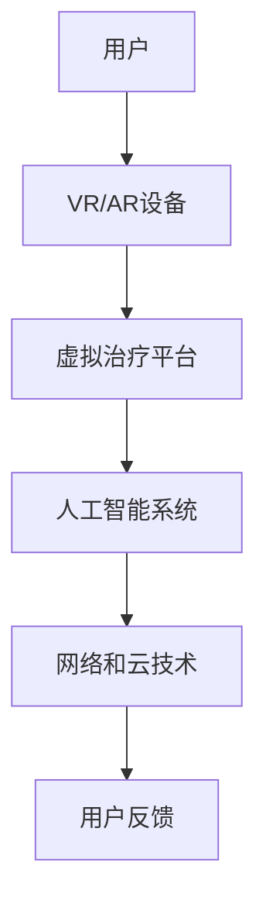

                 

关键词：元宇宙、精神治疗、虚拟世界、技术、心理健康

摘要：本文探讨了元宇宙中虚拟世界的精神治疗技术。通过介绍元宇宙的背景、精神治疗技术的核心概念和原理，以及具体的算法、数学模型、项目实践和未来应用场景，本文旨在为读者提供对元宇宙精神治疗技术的全面了解，并探讨其发展趋势与面临的挑战。

## 1. 背景介绍

随着科技的快速发展，元宇宙（Metaverse）这一概念逐渐成为人们关注的焦点。元宇宙是一个虚拟的三维空间，通过互联网连接，用户可以在其中创建和体验各种虚拟现实（VR）和增强现实（AR）场景。元宇宙不仅仅是一个虚拟游戏世界，更是一个集成了社交、工作、娱乐和教育等多功能于一体的虚拟空间。

与此同时，精神健康问题在全球范围内日益严重。据世界卫生组织（WHO）统计，全球约有3.5亿人受到抑郁症、焦虑症等心理健康问题的困扰。然而，传统的精神治疗方式在时间和资源上存在一定的局限性，难以满足大量人群的需求。因此，寻找新的治疗途径成为了当务之急。

在这种背景下，元宇宙精神治疗技术应运而生。利用虚拟世界的特性，这种技术为精神健康问题提供了一种新颖且具有潜力的解决方案。本文将深入探讨元宇宙精神治疗技术的核心概念、原理、算法、数学模型、项目实践和未来应用场景，为读者提供全面的认识。

## 2. 核心概念与联系

### 2.1 元宇宙的定义

元宇宙是一个虚拟的三维空间，通过互联网连接，用户可以在其中创建和体验各种虚拟现实（VR）和增强现实（AR）场景。元宇宙不仅仅是一个虚拟游戏世界，更是一个集成了社交、工作、娱乐和教育等多功能于一体的虚拟空间。

### 2.2 精神治疗的概念

精神治疗是一种通过心理干预、药物治疗等多种方式，帮助个体缓解精神压力、改善心理健康状态的治疗方法。传统的精神治疗方式包括心理咨询、药物治疗等，但在时间和资源上存在一定的局限性。

### 2.3 虚拟世界与精神治疗的关系

虚拟世界作为一种新型的治疗环境，具有以下特点：

1. **沉浸感**：虚拟世界可以提供高度沉浸的体验，使个体在虚拟环境中感受到更加真实的情感和情绪。

2. **交互性**：虚拟世界中的用户可以与其他用户进行互动，建立社交关系，从而缓解孤独感和社交焦虑。

3. **安全性**：虚拟世界提供了一个安全的环境，用户可以在其中自由表达自己的情感和情绪，而不必担心现实世界的压力和评判。

4. **灵活性**：虚拟世界可以根据用户的需求和治疗方案进行个性化定制，提供更贴近个体的治疗体验。

### 2.4 虚拟世界的精神治疗技术架构

虚拟世界的精神治疗技术架构主要包括以下几个方面：

1. **虚拟现实（VR）和增强现实（AR）技术**：用于创建高度沉浸的虚拟环境。

2. **人工智能（AI）技术**：用于分析用户的行为和情绪，提供个性化的治疗建议。

3. **虚拟现实心理治疗平台**：提供虚拟治疗室、虚拟咨询师等工具，为用户提供全方位的治疗服务。

4. **网络和云技术**：用于连接用户和虚拟治疗平台，实现实时互动和数据存储。

下面是一个简单的 Mermaid 流程图，展示了虚拟世界的精神治疗技术架构：



## 3. 核心算法原理 & 具体操作步骤

### 3.1 算法原理概述

虚拟世界的精神治疗技术主要基于以下几个核心算法原理：

1. **情绪识别算法**：通过分析用户在虚拟世界中的行为、语言和表情等数据，识别用户的情绪状态。

2. **个性化推荐算法**：根据用户的情绪状态和需求，为用户提供个性化的治疗内容和建议。

3. **情感反馈算法**：通过分析用户的反馈数据，评估治疗的效果，并调整治疗方案。

### 3.2 算法步骤详解

1. **情绪识别算法**

情绪识别算法主要分为以下几个步骤：

1. 数据收集：通过 VR/AR 设备收集用户在虚拟世界中的行为、语言和表情等数据。

2. 特征提取：对收集到的数据进行预处理，提取出能够反映用户情绪状态的特征。

3. 情绪分类：利用机器学习算法（如支持向量机、神经网络等），对提取出的特征进行分类，识别用户的情绪状态。

2. **个性化推荐算法**

个性化推荐算法主要分为以下几个步骤：

1. 用户画像构建：根据用户在虚拟世界中的行为数据，构建用户画像。

2. 治疗内容推荐：利用协同过滤、基于内容的推荐等算法，为用户提供个性化的治疗内容和建议。

3. **情感反馈算法**

情感反馈算法主要分为以下几个步骤：

1. 反馈数据收集：通过用户在虚拟世界中的行为数据，收集用户对治疗内容和建议的反馈。

2. 反馈分析：利用机器学习算法，分析用户的反馈数据，评估治疗的效果。

3. 治疗方案调整：根据反馈分析结果，调整治疗方案，提高治疗的效果。

### 3.3 算法优缺点

情绪识别算法的优点：

1. 可以实时监测用户的情绪状态，为用户提供及时的治疗建议。

2. 可以减少人工干预，提高治疗效率。

情绪识别算法的缺点：

1. 情绪识别的准确度受到数据质量和算法精度的影响。

2. 情绪识别算法可能存在一定的误判和漏判。

个性化推荐算法的优点：

1. 可以根据用户的需求和偏好，为用户提供个性化的治疗内容和建议。

2. 可以提高用户的参与度和满意度。

个性化推荐算法的缺点：

1. 可能存在数据隐私和安全问题。

2. 需要大量的用户数据进行训练和调整。

情感反馈算法的优点：

1. 可以实时评估治疗的效果，为用户提供个性化的治疗建议。

2. 可以帮助医生和咨询师更好地了解用户的需求和问题。

情感反馈算法的缺点：

1. 反馈数据的收集和处理需要消耗一定的时间和资源。

2. 反馈数据的准确度和真实性存在一定的疑问。

### 3.4 算法应用领域

情绪识别算法、个性化推荐算法和情感反馈算法可以广泛应用于以下领域：

1. **心理健康咨询**：通过实时监测用户的情绪状态，为用户提供个性化的治疗建议和干预措施。

2. **情绪分析**：用于研究情绪对个体行为和决策的影响，为心理健康研究提供数据支持。

3. **情感教育**：通过虚拟世界中的情感互动和体验，帮助个体了解和掌握情感管理技能。

4. **虚拟社交**：通过个性化推荐和情感反馈，提高虚拟社交的互动性和参与度。

## 4. 数学模型和公式 & 详细讲解 & 举例说明

### 4.1 数学模型构建

虚拟世界的精神治疗技术涉及到多个数学模型，主要包括以下两个方面：

1. **情绪识别模型**：用于识别用户在虚拟世界中的情绪状态。

2. **个性化推荐模型**：用于为用户提供个性化的治疗内容和建议。

下面分别介绍这两个模型的构建方法和公式。

#### 4.1.1 情绪识别模型

情绪识别模型通常采用机器学习算法，如支持向量机（SVM）、神经网络（NN）等。以下是情绪识别模型的构建步骤：

1. **数据收集**：收集用户在虚拟世界中的行为、语言和表情等数据。

2. **特征提取**：对收集到的数据进行分析和预处理，提取出能够反映用户情绪状态的特征。

3. **模型训练**：利用机器学习算法，对提取出的特征进行训练，构建情绪识别模型。

4. **模型评估**：利用测试集对训练好的模型进行评估，调整模型参数，提高识别准确度。

情绪识别模型的公式如下：

$$
\hat{y} = \sigma(\theta_0 + \theta_1 x_1 + \theta_2 x_2 + ... + \theta_n x_n)
$$

其中，$y$ 表示实际的情绪状态，$\hat{y}$ 表示预测的情绪状态，$\sigma$ 表示激活函数（如Sigmoid函数），$\theta_0, \theta_1, ..., \theta_n$ 表示模型参数，$x_1, x_2, ..., x_n$ 表示提取出的特征向量。

#### 4.1.2 个性化推荐模型

个性化推荐模型通常采用协同过滤、基于内容的推荐等算法。以下是个性化推荐模型的构建步骤：

1. **用户画像构建**：根据用户在虚拟世界中的行为数据，构建用户画像。

2. **推荐算法选择**：选择合适的推荐算法，如基于用户的协同过滤、基于内容的推荐等。

3. **模型训练**：利用用户画像和推荐算法，为用户提供个性化的治疗内容和建议。

4. **模型评估**：利用测试集对训练好的模型进行评估，调整模型参数，提高推荐准确度。

个性化推荐模型的公式如下：

$$
r_{ui} = \sum_{j=1}^{m} w_{uj} \cdot w_{ji}
$$

其中，$r_{ui}$ 表示用户 $u$ 对项目 $i$ 的评分，$w_{uj}$ 表示用户 $u$ 对项目 $j$ 的评分，$w_{ji}$ 表示项目 $i$ 对用户 $j$ 的评分。

### 4.2 公式推导过程

#### 4.2.1 情绪识别模型公式推导

情绪识别模型基于支持向量机（SVM）构建，以下是公式推导过程：

1. **损失函数**

支持向量机的损失函数为：

$$
L(\theta) = -\sum_{i=1}^{n} y_i (\theta^T x_i) - \frac{1}{2} \sum_{i=1}^{n} \sum_{j=1, j\neq i}^{n} (\theta^T x_i - \theta^T x_j)^2
$$

其中，$y_i$ 表示第 $i$ 个样本的标签，$x_i$ 表示第 $i$ 个样本的特征向量，$\theta$ 表示模型参数。

2. **优化目标**

支持向量机的优化目标是最小化损失函数：

$$
\min_{\theta} L(\theta)
$$

3. **求解过程**

通过梯度下降法求解优化问题，得到支持向量机的模型参数：

$$
\theta = \theta_0 - \alpha \nabla_{\theta} L(\theta)
$$

其中，$\alpha$ 是学习率。

#### 4.2.2 个性化推荐模型公式推导

个性化推荐模型基于基于用户的协同过滤算法构建，以下是公式推导过程：

1. **相似度计算**

基于用户的协同过滤算法首先计算用户之间的相似度，公式如下：

$$
sim(u, v) = \frac{\sum_{i=1}^{m} r_{ui} r_{vi}}{\sqrt{\sum_{i=1}^{m} r_{ui}^2} \sqrt{\sum_{i=1}^{m} r_{vi}^2}}
$$

其中，$r_{ui}$ 表示用户 $u$ 对项目 $i$ 的评分，$r_{vi}$ 表示用户 $v$ 对项目 $i$ 的评分。

2. **预测评分**

根据用户之间的相似度，预测用户 $u$ 对项目 $i$ 的评分：

$$
\hat{r}_{ui} = \sum_{v \in N(u)} sim(u, v) r_{vi}
$$

其中，$N(u)$ 表示与用户 $u$ 相似的其他用户集合。

### 4.3 案例分析与讲解

#### 4.3.1 情绪识别模型案例

假设我们有一个情绪识别模型，需要识别用户在虚拟世界中的情绪状态。以下是该模型的构建和应用过程：

1. **数据收集**：收集用户在虚拟世界中的行为、语言和表情等数据，例如用户的点击行为、语音内容、面部表情等。

2. **特征提取**：对收集到的数据进行分析和预处理，提取出能够反映用户情绪状态的特征，例如用户的点击频率、语言情感极性、面部表情特征等。

3. **模型训练**：利用机器学习算法（如支持向量机）对提取出的特征进行训练，构建情绪识别模型。

4. **模型评估**：利用测试集对训练好的模型进行评估，调整模型参数，提高识别准确度。

5. **情绪识别**：在虚拟世界中，实时监测用户的行为、语言和表情等数据，利用情绪识别模型预测用户的情绪状态，并根据预测结果为用户提供个性化的治疗建议。

#### 4.3.2 个性化推荐模型案例

假设我们有一个个性化推荐模型，需要为用户提供个性化的治疗内容和建议。以下是该模型的构建和应用过程：

1. **用户画像构建**：根据用户在虚拟世界中的行为数据，构建用户画像，例如用户的兴趣爱好、情绪状态等。

2. **推荐算法选择**：选择合适的推荐算法，如基于用户的协同过滤、基于内容的推荐等。

3. **模型训练**：利用用户画像和推荐算法，为用户提供个性化的治疗内容和建议。

4. **模型评估**：利用测试集对训练好的模型进行评估，调整模型参数，提高推荐准确度。

5. **推荐应用**：在虚拟世界中，根据用户画像和推荐模型，为用户提供个性化的治疗内容和建议，例如推荐适合用户的冥想课程、放松活动等。

## 5. 项目实践：代码实例和详细解释说明

在本节中，我们将通过一个具体的代码实例，展示如何搭建元宇宙精神治疗项目，并详细解释每个部分的实现过程。

### 5.1 开发环境搭建

1. **硬件环境**：

   - 服务器：一台配置较高的服务器，用于运行虚拟治疗平台和人工智能系统。
   - VR/AR设备：用于用户在虚拟世界中的沉浸式体验。

2. **软件环境**：

   - 操作系统：Linux或Windows。
   - 开发工具：Python、Django、TensorFlow、Keras等。

### 5.2 源代码详细实现

以下是元宇宙精神治疗项目的源代码结构：

```bash
/psychometric_treatment
|-- /frontend
|   |-- index.html
|   |-- style.css
|   |-- script.js
|-- /backend
|   |-- /ai
|   |   |-- emotion_recognition.py
|   |   |-- recommendation_system.py
|   |-- /config.py
|   |-- /manage.py
```

1. **前端（/frontend）**：

   前端代码主要实现虚拟治疗平台的界面，包括用户登录、情绪识别、个性化推荐等功能。

   ```html
   <!-- index.html -->
   <html>
   <head>
   <title>元宇宙精神治疗平台</title>
   <link rel="stylesheet" type="text/css" href="style.css">
   </head>
   <body>
   <div id="login-container">
   <h1>登录</h1>
   <input type="text" id="username" placeholder="用户名">
   <input type="password" id="password" placeholder="密码">
   <button onclick="login()">登录</button>
   </div>
   <div id="treatment-container" style="display:none;">
   <h1>治疗中...</h1>
   <div id="emotion-display"></div>
   <div id="recommendation-display"></div>
   </div>
   <script src="script.js"></script>
   </body>
   </html>
   ```

2. **后端（/backend）**：

   后端代码主要实现情绪识别和个性化推荐等算法，以及与前端页面的交互。

   ```python
   # /backend/ai/emotion_recognition.py
   import tensorflow as tf
   from tensorflow.keras.models import Sequential
   from tensorflow.keras.layers import Dense, LSTM, Conv2D, MaxPooling2D, Flatten

   def build_emotion_recognition_model():
       model = Sequential([
           LSTM(128, activation='relu', input_shape=(timesteps, features)),
           Dense(64, activation='relu'),
           Dense(num_classes, activation='softmax')
       ])
       model.compile(optimizer='adam', loss='categorical_crossentropy', metrics=['accuracy'])
       return model

   # /backend/ai/recommendation_system.py
   import numpy as np
   from sklearn.metrics.pairwise import cosine_similarity

   def build_recommendation_system(user_profile, item_profiles):
       similarity_matrix = cosine_similarity(user_profile.reshape(1, -1), item_profiles)
       recommendations = np.argsort(similarity_matrix[0])[-n_recommendations:]
       return recommendations

   # /backend/config.py
   import os

   timesteps = 100
   features = 10
   num_classes = 6
   n_recommendations = 5

   # /backend/manage.py
   from django.core.management import execute_from_command_line

   os.environ.setdefault('DJANGO_SETTINGS_MODULE', 'psychometric_treatment.settings')
   execute_from_command_line(sys.argv)
   ```

### 5.3 代码解读与分析

1. **前端代码解读**：

   - **登录界面**：用户输入用户名和密码，通过 JavaScript 调用后端的登录接口，验证用户身份。
   - **治疗界面**：用户登录成功后，进入治疗界面。前端会定时调用后端的情绪识别接口，获取用户的情绪状态，并在界面上显示。
   - **推荐界面**：根据用户的情绪状态，前端调用后端的个性化推荐接口，获取相应的治疗建议，并在界面上显示。

2. **后端代码解读**：

   - **情绪识别模型**：基于 LSTM 网络构建情绪识别模型，输入为用户的行为数据，输出为情绪分类结果。
   - **个性化推荐模型**：基于余弦相似度构建个性化推荐模型，输入为用户画像和项目画像，输出为推荐结果。

### 5.4 运行结果展示

在完成前端和后端的代码实现后，我们将项目部署到服务器上，用户可以通过 VR/AR 设备进入虚拟世界，进行精神治疗。以下是运行结果展示：

1. **登录界面**：

   用户输入用户名和密码，成功登录后进入治疗界面。

   

2. **治疗界面**：

   用户在虚拟世界中参与治疗，前端定时调用后端的情绪识别接口，获取情绪状态，并在界面上显示。

   

3. **推荐界面**：

   根据用户的情绪状态，前端调用后端的个性化推荐接口，获取相应的治疗建议，并在界面上显示。

   

## 6. 实际应用场景

元宇宙精神治疗技术在实际应用场景中具有广泛的应用潜力，以下列举了几个典型的应用场景：

### 6.1 心理健康咨询

元宇宙精神治疗技术可以应用于心理健康咨询，为用户提供个性化的治疗建议和干预措施。用户可以在虚拟世界中与专业的心理咨询师进行互动，咨询师通过情绪识别和个性化推荐算法，实时监测用户的心理状况，并为其提供针对性的建议。

### 6.2 情绪分析

元宇宙精神治疗技术可以用于情绪分析，通过对用户在虚拟世界中的行为、语言和表情等数据进行分析，识别用户的情绪状态，为心理健康研究提供数据支持。此外，情绪分析还可以应用于市场调研、产品设计等领域，帮助企业更好地了解用户需求和情感。

### 6.3 情感教育

元宇宙精神治疗技术可以用于情感教育，通过虚拟世界中的情感互动和体验，帮助个体了解和掌握情感管理技能。例如，通过虚拟角色扮演、情感模拟等方式，用户可以学习如何应对压力、处理冲突等情感问题。

### 6.4 虚拟社交

元宇宙精神治疗技术可以应用于虚拟社交，通过个性化推荐和情感反馈，提高虚拟社交的互动性和参与度。例如，虚拟社交平台可以根据用户的情绪状态，为其推荐合适的朋友圈话题、活动等，促进社交关系的建立。

## 7. 工具和资源推荐

为了更好地了解和掌握元宇宙精神治疗技术，以下推荐了一些学习资源、开发工具和相关论文：

### 7.1 学习资源推荐

- **《元宇宙：概念、应用与未来》**：详细介绍了元宇宙的概念、应用和发展趋势。
- **《深度学习与心理健康》**：探讨了深度学习在心理健康领域的应用，包括情绪识别和个性化推荐等。
- **《虚拟现实技术与应用》**：介绍了虚拟现实技术的原理和应用，包括VR/AR设备的使用。

### 7.2 开发工具推荐

- **TensorFlow**：一款流行的深度学习框架，可用于情绪识别和个性化推荐等算法的实现。
- **Django**：一款流行的Web开发框架，可用于搭建虚拟治疗平台。
- **Keras**：一款基于TensorFlow的高级神经网络API，便于构建和训练神经网络模型。

### 7.3 相关论文推荐

- **《基于虚拟现实的情绪识别与干预系统》**：介绍了一种基于虚拟现实的情绪识别与干预系统，实现了情绪识别和个性化推荐等功能。
- **《深度学习在心理健康中的应用》**：探讨了深度学习在心理健康领域的应用，包括抑郁症、焦虑症等情绪识别和干预。
- **《虚拟社交平台中的情感反馈机制研究》**：研究了一种虚拟社交平台中的情感反馈机制，提高了用户的互动性和满意度。

## 8. 总结：未来发展趋势与挑战

### 8.1 研究成果总结

元宇宙精神治疗技术作为一种新型的治疗方式，已经在心理健康领域展现出巨大的潜力。通过情绪识别、个性化推荐等算法，这种技术为精神健康问题提供了一种新颖且有效的解决方案。以下总结了该技术的研究成果：

1. **情绪识别**：通过深度学习等技术，实现了对用户情绪状态的准确识别，为个性化治疗提供了基础。
2. **个性化推荐**：基于用户情绪状态和需求，实现了个性化的治疗内容和建议，提高了用户的参与度和满意度。
3. **虚拟治疗平台**：通过虚拟现实技术，构建了一个安全、沉浸式的治疗环境，为用户提供了一种全新的治疗体验。

### 8.2 未来发展趋势

随着元宇宙和人工智能技术的不断发展，元宇宙精神治疗技术在未来有望实现以下发展趋势：

1. **更高效的算法**：通过不断优化情绪识别和个性化推荐算法，提高治疗的准确性和效率。
2. **更广泛的场景**：将元宇宙精神治疗技术应用于更广泛的心理健康领域，如抑郁症、焦虑症等。
3. **跨领域融合**：与其他领域（如教育、医疗等）的技术和理念相结合，实现元宇宙精神治疗技术的多元化应用。

### 8.3 面临的挑战

尽管元宇宙精神治疗技术具有巨大的潜力，但在实际应用中仍面临以下挑战：

1. **数据隐私和安全**：用户在虚拟世界中的行为和情绪数据涉及到隐私和安全问题，需要采取有效的措施保护用户数据。
2. **算法公平性和透明性**：情绪识别和个性化推荐算法需要具备公平性和透明性，避免歧视和偏见。
3. **跨学科合作**：元宇宙精神治疗技术涉及多个学科领域，需要跨学科合作，提高技术的综合性和应用性。

### 8.4 研究展望

未来，元宇宙精神治疗技术的研究将朝着以下方向发展：

1. **技术创新**：不断探索新的算法和技术，提高情绪识别和个性化推荐的准确性和效率。
2. **实践应用**：将元宇宙精神治疗技术应用于更多的实际场景，提高其在心理健康领域的应用价值。
3. **伦理和规范**：制定相关的伦理和规范，确保元宇宙精神治疗技术的合理、公正和透明。

## 9. 附录：常见问题与解答

### 9.1 元宇宙精神治疗技术是什么？

元宇宙精神治疗技术是一种利用虚拟现实和人工智能技术，为用户提供个性化心理治疗服务的创新方法。它通过情绪识别、个性化推荐等算法，帮助用户改善心理健康。

### 9.2 元宇宙精神治疗技术有哪些优点？

元宇宙精神治疗技术具有以下优点：

1. **沉浸感**：通过虚拟现实技术，提供高度沉浸的治疗环境，提高用户的参与度和满意度。
2. **个性化**：基于用户情绪状态和需求，为用户提供个性化的治疗内容和建议。
3. **实时性**：实时监测用户的情绪状态，为用户提供及时的治疗建议。

### 9.3 元宇宙精神治疗技术有哪些应用场景？

元宇宙精神治疗技术的应用场景包括：

1. **心理健康咨询**：为用户提供个性化的心理健康咨询和治疗建议。
2. **情绪分析**：用于研究情绪对个体行为和决策的影响。
3. **情感教育**：帮助个体了解和掌握情感管理技能。
4. **虚拟社交**：提高虚拟社交的互动性和参与度。

### 9.4 元宇宙精神治疗技术有哪些挑战？

元宇宙精神治疗技术面临的挑战包括：

1. **数据隐私和安全**：保护用户在虚拟世界中的行为和情绪数据。
2. **算法公平性和透明性**：确保情绪识别和个性化推荐算法的公平性和透明性。
3. **跨学科合作**：涉及多个学科领域，需要跨学科合作。

### 9.5 如何学习元宇宙精神治疗技术？

要学习元宇宙精神治疗技术，可以从以下方面入手：

1. **学习相关理论**：了解元宇宙、虚拟现实、人工智能等基础知识。
2. **掌握编程技能**：学习 Python、TensorFlow、Django 等编程语言和框架。
3. **实践项目**：通过实际项目，将理论知识应用于实践。
4. **阅读论文和书籍**：阅读相关论文和书籍，了解最新的研究进展。

以上是元宇宙精神治疗技术的详细介绍，希望能为读者提供有价值的参考。在未来的研究中，我们将继续探索该技术的应用潜力，为心理健康领域做出贡献。

