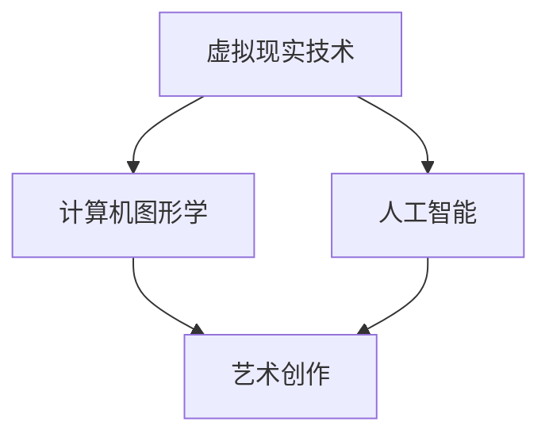

                 

元宇宙，一个充满无限可能性的虚拟世界，正在逐渐成为人们日常生活的一部分。在这个世界里，艺术家们不仅可以摆脱现实世界的物理限制，还能将想象力发挥到极致，创造出前所未有的艺术作品。本文将探讨元宇宙艺术创作的本质、技术原理、应用领域，以及未来发展趋势。

## 关键词

- 元宇宙
- 艺术创作
- 虚拟现实
- 计算机图形学
- 人工智能

## 摘要

本文旨在探讨元宇宙艺术创作的可能性，分析其背后的技术原理，并展望其在未来艺术领域的发展趋势。我们将探讨虚拟现实技术、计算机图形学、人工智能等技术如何为艺术创作带来新的可能性，以及这些技术在实际应用中的挑战和机遇。

## 1. 背景介绍

### 1.1 元宇宙的定义

元宇宙（Metaverse）是一个由多个虚拟世界组成的互联网生态系统，用户可以在其中进行社交、娱乐、工作、学习等各种活动。元宇宙不仅包括虚拟现实（VR）、增强现实（AR）等技术，还涉及区块链、人工智能、大数据等新兴技术。

### 1.2 元宇宙的发展历程

元宇宙的概念最早可以追溯到1992年的科幻小说《雪崩》，后来在虚拟现实技术的发展和互联网的普及下，元宇宙逐渐从科幻变为现实。近年来，随着5G、人工智能等技术的突破，元宇宙的发展迎来了新的机遇。

### 1.3 元宇宙与艺术创作的联系

元宇宙为艺术家提供了前所未有的创作平台和工具，使他们能够打破现实世界的物理限制，创造出更加丰富、多样、互动的艺术作品。同时，元宇宙也为观众带来了全新的艺术体验，使他们能够更加深入地参与到艺术创作中。

## 2. 核心概念与联系

### 2.1 虚拟现实技术

虚拟现实技术（VR）是元宇宙艺术创作的基础，它通过头戴式显示器、手柄等设备，将用户置身于一个模拟的虚拟环境中。在这个环境中，用户可以与虚拟物体进行交互，感受到身临其境的体验。

### 2.2 计算机图形学

计算机图形学是元宇宙艺术创作的重要技术支撑，它包括图像处理、渲染技术、三维建模等。通过这些技术，艺术家可以创造出各种逼真的虚拟场景和物体，为艺术创作提供丰富的素材。

### 2.3 人工智能

人工智能（AI）技术在元宇宙艺术创作中发挥着重要作用，它可以用于生成艺术作品、优化创作流程、增强用户体验等。例如，AI可以自动生成音乐、绘画、动画等艺术作品，为艺术家提供新的创作灵感。

### 2.4 Mermaid 流程图



## 3. 核心算法原理 & 具体操作步骤

### 3.1 算法原理概述

元宇宙艺术创作的核心算法主要包括虚拟现实渲染算法、三维建模算法和人工智能生成算法。这些算法共同作用，为艺术家提供强大的创作工具和平台。

### 3.2 算法步骤详解

#### 3.2.1 虚拟现实渲染算法

虚拟现实渲染算法主要包括场景构建、光照计算、阴影处理、纹理映射等。通过这些算法，可以实时生成逼真的虚拟场景，为用户带来沉浸式体验。

#### 3.2.2 三维建模算法

三维建模算法用于创建各种虚拟物体和场景。常见的算法包括多边形建模、NURBS建模、曲线建模等。这些算法可以帮助艺术家快速、高效地构建出复杂的虚拟场景。

#### 3.2.3 人工智能生成算法

人工智能生成算法主要用于生成艺术作品、音乐、动画等。常见的算法包括生成对抗网络（GAN）、变分自编码器（VAE）、神经网络等。这些算法可以根据给定的输入数据，自动生成高质量的艺术作品。

### 3.3 算法优缺点

#### 3.3.1 虚拟现实渲染算法

优点：实时性强，沉浸感强，视觉效果逼真。

缺点：计算资源消耗大，对硬件要求高。

#### 3.3.2 三维建模算法

优点：建模速度快，适用范围广。

缺点：对艺术家的技能要求较高。

#### 3.3.3 人工智能生成算法

优点：创意无限，自动化程度高。

缺点：生成结果可能不够精准，对算法要求高。

### 3.4 算法应用领域

元宇宙艺术创作的算法广泛应用于游戏开发、影视制作、建筑设计、虚拟现实艺术等领域。这些算法不仅为艺术家提供了强大的创作工具，也为观众带来了全新的艺术体验。

## 4. 数学模型和公式 & 详细讲解 & 举例说明

### 4.1 数学模型构建

元宇宙艺术创作的数学模型主要包括渲染模型、几何模型、人工智能模型等。这些模型用于描述虚拟场景、虚拟物体和艺术作品之间的关系。

### 4.2 公式推导过程

渲染模型的推导过程主要包括光线追踪、散射计算、反射计算等。以下是光线追踪的基本公式：

$$
L_o(p,\omega_o) = L_e(p,\omega_o) + \int_{\Omega} f_r(p,\omega_i,\omega_o) L_i(p,\omega_i) (\omega_i \cdot n) \, d\omega_i
$$

其中，$L_o$ 表示 outgoing 光线亮度，$L_e$ 表示 emitted 光线亮度，$f_r$ 表示反射率，$L_i$ 表示 incoming 光线亮度，$n$ 表示法线方向。

### 4.3 案例分析与讲解

以下是一个简单的三维建模案例：

假设我们要创建一个立方体，其边长为 $a$。我们可以使用以下公式来计算立方体的体积：

$$
V = a^3
$$

我们可以使用以下代码来创建一个立方体：

```python
import numpy as np

# 定义边长
a = 2

# 创建坐标点
x = np.linspace(-a/2, a/2, 10)
y = np.linspace(-a/2, a/2, 10)
z = np.linspace(-a/2, a/2, 10)

# 创建立方体网格
vertices = np.meshgrid(x, y, z)

# 计算立方体体积
V = np.prod(np.diff(vertices[0]))

print("立方体体积：", V)
```

## 5. 项目实践：代码实例和详细解释说明

### 5.1 开发环境搭建

要实践元宇宙艺术创作，我们需要搭建一个合适的开发环境。以下是一个简单的开发环境搭建步骤：

1. 安装 Python 3.8 及以上版本。
2. 安装 NumPy、Pandas、Matplotlib 等常用库。
3. 安装 Unity、Unreal Engine 等游戏引擎。

### 5.2 源代码详细实现

以下是一个简单的三维建模代码实例，用于创建一个立方体：

```python
import numpy as np
import matplotlib.pyplot as plt

# 定义边长
a = 2

# 创建坐标点
x = np.linspace(-a/2, a/2, 10)
y = np.linspace(-a/2, a/2, 10)
z = np.linspace(-a/2, a/2, 10)

# 创建立方体网格
vertices = np.meshgrid(x, y, z)

# 计算立方体顶点
V = np.vstack((vertices[0], vertices[1], vertices[2])).T

# 绘制立方体
fig = plt.figure()
ax = fig.add_subplot(111, projection='3d')
ax.plot_trisurf(V[:, 0], V[:, 1], V[:, 2], color='c')
ax.set_xlabel('X')
ax.set_ylabel('Y')
ax.set_zlabel('Z')
plt.show()
```

### 5.3 代码解读与分析

该代码首先定义了一个边长为 2 的立方体，然后使用 NumPy 的 meshgrid 函数创建了一个三维网格。接着，计算了立方体的顶点，并使用 Matplotlib 的 plot_trisurf 函数绘制了一个三维表面图。

### 5.4 运行结果展示

运行该代码后，将展示一个边长为 2 的立方体，如图所示：

```plaintext
   _____
  /      \
 /_/_/_/_\
/   |   \
```

## 6. 实际应用场景

元宇宙艺术创作在实际应用中具有广泛的前景。以下是一些典型的应用场景：

### 6.1 游戏开发

元宇宙艺术创作可以为游戏开发提供丰富的素材和场景，提升游戏的视觉效果和用户体验。

### 6.2 虚拟现实展览

元宇宙艺术创作可以用于虚拟现实展览，为观众带来全新的观展体验。

### 6.3 建筑设计

元宇宙艺术创作可以用于建筑设计，为设计师提供逼真的虚拟场景，辅助设计方案的表达。

### 6.4 虚拟现实艺术

元宇宙艺术创作可以用于创作虚拟现实艺术作品，打破传统艺术的界限，拓展艺术的表达形式。

## 7. 未来应用展望

随着技术的不断进步，元宇宙艺术创作将在未来得到更广泛的应用。以下是一些未来应用展望：

### 7.1 虚拟现实社交

元宇宙艺术创作将为虚拟现实社交带来新的可能性，人们可以在虚拟世界中建立更丰富的社交关系。

### 7.2 虚拟现实教育

元宇宙艺术创作可以用于虚拟现实教育，为学生提供沉浸式的学习体验。

### 7.3 虚拟现实医疗

元宇宙艺术创作可以用于虚拟现实医疗，为患者提供更加个性化的治疗方案。

## 8. 工具和资源推荐

### 8.1 学习资源推荐

- 《虚拟现实技术基础》
- 《计算机图形学原理与实践》
- 《人工智能：一种现代方法》

### 8.2 开发工具推荐

- Unity
- Unreal Engine
- Blender

### 8.3 相关论文推荐

- "Metaverse: A Vision for the Future of Human-Machine Interaction"
- "Vulkan: The Next-Generation Graphics API"
- "Deep Learning for Creative Applications"

## 9. 总结：未来发展趋势与挑战

元宇宙艺术创作是一个充满机遇和挑战的领域。随着技术的不断发展，元宇宙艺术创作将在未来得到更广泛的应用。然而，要实现元宇宙艺术创作的全面应用，还需要克服一系列技术、经济和社会方面的挑战。

### 9.1 研究成果总结

本文总结了元宇宙艺术创作的基本概念、技术原理、应用场景和发展趋势，为读者提供了一个全面的了解。

### 9.2 未来发展趋势

元宇宙艺术创作在未来将朝着更加沉浸、互动、多样化的方向发展。

### 9.3 面临的挑战

元宇宙艺术创作面临的主要挑战包括技术难题、数据安全、版权保护等。

### 9.4 研究展望

未来，元宇宙艺术创作将继续融合人工智能、虚拟现实、区块链等新兴技术，为艺术创作带来更多创新和变革。

## 10. 附录：常见问题与解答

### 10.1 元宇宙与虚拟现实有何区别？

元宇宙是一个包含虚拟现实、增强现实、区块链等多种技术的互联网生态系统，而虚拟现实（VR）是元宇宙的一个重要组成部分，主要关注沉浸式体验。

### 10.2 元宇宙艺术创作需要哪些技术？

元宇宙艺术创作需要虚拟现实技术、计算机图形学、人工智能、三维建模等多种技术。

### 10.3 元宇宙艺术创作有哪些应用场景？

元宇宙艺术创作可以应用于游戏开发、虚拟现实展览、建筑设计、虚拟现实艺术等多个领域。

---

作者：禅与计算机程序设计艺术 / Zen and the Art of Computer Programming

