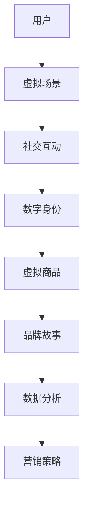

                 

关键词：元宇宙，营销，数字化品牌建设，技术趋势，用户互动，数据分析

摘要：随着元宇宙概念的普及和技术的进步，数字化品牌建设迎来了新的机遇和挑战。本文将深入探讨元宇宙营销的核心理念、技术基础、应用实践以及未来展望，旨在为企业和品牌提供数字化品牌建设的策略指引。

## 1. 背景介绍

### 元宇宙的概念普及

元宇宙（Metaverse）一词源于“Meta（超越）+ Universe（宇宙）”，它代表着一种超越现实世界的虚拟空间，一个融合了虚拟现实（VR）、增强现实（AR）、区块链、社交网络等多种技术元素的数字化世界。元宇宙不仅仅是一个技术概念，更是一个社会文化现象，它为用户提供了全新的社交、娱乐、教育和工作方式。

### 营销在元宇宙中的重要性

在元宇宙中，营销活动可以以更加沉浸和互动的方式进行，用户可以体验虚拟的产品和服务，与品牌建立深层次的连接。数字化品牌建设成为企业提升市场份额、增强用户黏性和构建品牌价值的重要手段。随着元宇宙技术的成熟，营销在元宇宙中的地位将愈发重要。

## 2. 核心概念与联系

### 元宇宙营销的核心理念

元宇宙营销的核心在于通过构建虚拟场景、创造互动体验，提升用户参与度和品牌认知度。以下是元宇宙营销的几个核心理念：

1. **沉浸式体验**：通过VR、AR技术，为用户打造身临其境的体验。
2. **社交互动**：元宇宙为用户提供了丰富的社交功能，品牌可以借助这些功能增加用户互动。
3. **数字身份**：用户在元宇宙中拥有独特的数字身份，品牌可以通过个性化的数字身份与服务进行互动。
4. **虚拟商品**：虚拟商品和货币在元宇宙中具有实际价值，品牌可以通过虚拟商品销售实现商业价值。
5. **品牌故事**：通过构建虚拟场景和故事，品牌可以更好地传递其价值观和文化。

### 元宇宙营销的技术基础

元宇宙营销依赖于多种先进技术的支持，包括：

1. **虚拟现实（VR）**：通过VR技术，用户可以进入虚拟世界，体验虚拟产品和服务。
2. **增强现实（AR）**：AR技术将虚拟内容叠加到现实世界，增强用户的感知体验。
3. **区块链**：区块链技术提供安全的数字资产管理和交易，为虚拟商品和货币的流通提供保障。
4. **社交网络**：社交网络为用户提供了互动和分享的平台，品牌可以借助这些平台进行营销传播。
5. **人工智能（AI）**：AI技术可以分析用户行为，提供个性化的营销策略和推荐。

### 架构的 Mermaid 流程图



## 3. 核心算法原理 & 具体操作步骤

### 3.1 算法原理概述

元宇宙营销的核心算法主要涉及用户行为分析、数据挖掘和个性化推荐等。以下是这些算法的基本原理：

1. **用户行为分析**：通过收集用户的交互数据，分析用户的兴趣和需求。
2. **数据挖掘**：利用机器学习和数据挖掘技术，从海量数据中提取有价值的信息。
3. **个性化推荐**：根据用户行为和兴趣，推荐个性化的产品和服务。

### 3.2 算法步骤详解

1. **数据收集**：通过用户在元宇宙中的行为记录，收集用户数据。
2. **数据预处理**：对收集到的数据进行分析和清洗，确保数据的质量。
3. **行为分析**：利用机器学习算法，分析用户的兴趣和需求。
4. **数据挖掘**：使用数据挖掘技术，提取用户行为模式和市场趋势。
5. **个性化推荐**：根据用户行为和兴趣，生成个性化的推荐列表。

### 3.3 算法优缺点

**优点**：
- 提高用户参与度和满意度。
- 增强品牌与用户的互动性。
- 提供个性化的营销策略。

**缺点**：
- 数据隐私和安全问题。
- 技术实施成本高。

### 3.4 算法应用领域

元宇宙营销算法的应用领域广泛，包括：

1. **电商**：通过个性化推荐，提高用户购买转化率。
2. **娱乐**：为用户提供定制化的娱乐内容。
3. **教育**：提供个性化的学习路径和资源。

## 4. 数学模型和公式 & 详细讲解 & 举例说明

### 4.1 数学模型构建

在元宇宙营销中，常用的数学模型包括：

1. **协同过滤模型**：用于个性化推荐。
2. **决策树模型**：用于用户行为分析。

### 4.2 公式推导过程

**协同过滤模型**：

$$
R_{ij} = \frac{q_i \cdot q_j}{\sum_{k=1}^{n} q_i \cdot q_k}
$$

其中，$R_{ij}$表示用户i对物品j的评分，$q_i$和$q_j$表示用户i和用户j的兴趣向量。

**决策树模型**：

$$
\text{Entropy}(S) = -\sum_{i=1}^{n} p_i \cdot \log_2 p_i
$$

其中，$S$表示数据集，$p_i$表示数据集中属于类别i的比例。

### 4.3 案例分析与讲解

以协同过滤模型为例，分析用户对虚拟商品的偏好：

1. **数据收集**：收集用户对虚拟商品的评分数据。
2. **数据预处理**：清洗数据，消除异常值。
3. **行为分析**：计算用户的兴趣向量。
4. **个性化推荐**：根据用户的兴趣向量，推荐符合其偏好的虚拟商品。

## 5. 项目实践：代码实例和详细解释说明

### 5.1 开发环境搭建

使用Python和Scikit-learn库进行协同过滤模型的开发。

### 5.2 源代码详细实现

```python
from sklearn.model_selection import train_test_split
from sklearn.metrics.pairwise import cosine_similarity
import numpy as np

# 数据加载与预处理
ratings = ...  # 用户对虚拟商品的评分矩阵
users, items = np.unique(ratings[:, 0], return_counts=True)
user_item = ratings[:, 1:].reshape(-1)

# 分割训练集和测试集
train_data, test_data = train_test_split(user_item, test_size=0.2)

# 计算用户和物品的相似度矩阵
similarity_matrix = cosine_similarity(train_data, train_data)

# 生成推荐列表
def predict(rating, similarity_matrix):
    return np.argmax(similarity_matrix[rating])

# 测试推荐效果
predicted_ratings = [predict(rating, similarity_matrix) for rating in test_data]
accuracy = np.mean(predicted_ratings == test_data)
print(f"Accuracy: {accuracy}")
```

### 5.3 代码解读与分析

- 数据加载与预处理：从评分矩阵中提取用户和物品的向量。
- 相似度计算：使用余弦相似度计算用户和物品之间的相似度。
- 生成推荐列表：根据用户的评分和相似度矩阵，预测用户可能喜欢的物品。

## 6. 实际应用场景

### 6.1 电商平台

通过元宇宙营销，电商平台可以提供个性化的购物体验，提高用户购买意愿。

### 6.2 教育领域

元宇宙可以为教育机构提供沉浸式的学习环境，提高学生的学习效果。

### 6.3 旅游行业

旅游品牌可以通过元宇宙展示虚拟景点，吸引更多游客。

### 6.4 未来应用展望

元宇宙营销在未来有望成为企业数字化品牌建设的重要手段，为用户提供更加丰富和个性化的体验。

## 7. 工具和资源推荐

### 7.1 学习资源推荐

- 《虚拟现实技术与应用》
- 《区块链技术指南》
- 《机器学习实战》

### 7.2 开发工具推荐

- Unity引擎：用于开发元宇宙场景和游戏。
- PyTorch：用于机器学习和深度学习。

### 7.3 相关论文推荐

- "Metaverse: A Journey to the Future of Human-Machine Interaction"
- "Blockchain in the Metaverse: Enabling Trust and Value Transfer in Virtual Worlds"
- "Deep Learning for Virtual Reality: A Survey"

## 8. 总结：未来发展趋势与挑战

### 8.1 研究成果总结

元宇宙营销在技术、应用和商业模式方面取得了显著成果，为数字化品牌建设提供了新的思路和方向。

### 8.2 未来发展趋势

- 技术将继续成熟，为元宇宙营销提供更多可能性。
- 市场将逐渐扩大，更多企业将投入元宇宙营销。

### 8.3 面临的挑战

- 数据隐私和安全问题。
- 技术门槛和成本。

### 8.4 研究展望

未来，元宇宙营销将更加注重用户体验和个性化服务，为企业和品牌提供更有效的营销手段。

## 9. 附录：常见问题与解答

### 问题1：元宇宙营销的核心是什么？

解答：元宇宙营销的核心在于通过构建虚拟场景、创造互动体验，提升用户参与度和品牌认知度。

### 问题2：元宇宙营销需要哪些技术支持？

解答：元宇宙营销需要VR、AR、区块链、社交网络和人工智能等多种技术支持。

### 问题3：元宇宙营销的应用领域有哪些？

解答：元宇宙营销的应用领域广泛，包括电商、教育、旅游等多个行业。

### 问题4：元宇宙营销有哪些优点和缺点？

解答：优点包括提高用户参与度和满意度、增强品牌与用户的互动性等；缺点主要是数据隐私和安全问题、技术实施成本高。

### 问题5：未来元宇宙营销的发展趋势是什么？

解答：未来，元宇宙营销将更加注重用户体验和个性化服务，为企业和品牌提供更有效的营销手段。

作者：禅与计算机程序设计艺术 / Zen and the Art of Computer Programming
```markdown
```

