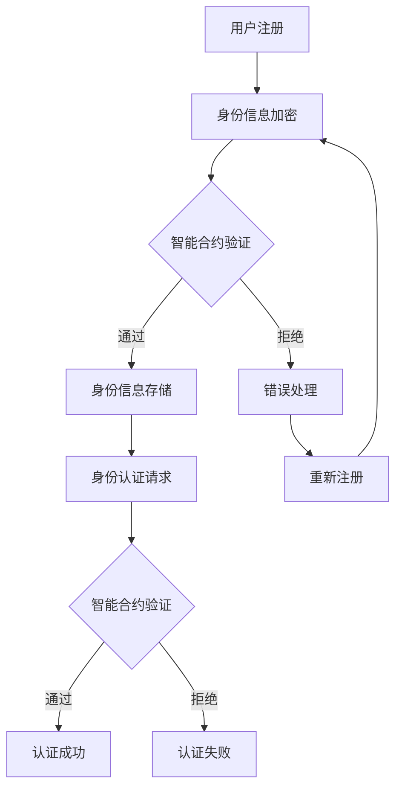

                 

关键词：元宇宙、身份认证、去中心化、信任体系、区块链、密码学、智能合约、分布式系统、DID、零知识证明

> 摘要：本文深入探讨了元宇宙中身份认证的去中心化信任体系构建，重点分析了区块链技术、密码学和智能合约在实现可信身份验证中的应用。通过对核心概念、算法原理、数学模型以及项目实践的详细解析，本文旨在为读者提供对去中心化身份认证系统的全面理解，并展望其在未来元宇宙中的广泛应用前景。

## 1. 背景介绍

随着互联网技术的飞速发展，虚拟世界——即元宇宙（Metaverse）——正逐渐成为现实。元宇宙是一个包含虚拟现实、增强现实和区块链等多种技术的融合体，用户可以在其中进行各种互动、交流和交易。然而，身份认证是元宇宙中不可或缺的一环，它确保了用户的隐私和安全，同时也是建立信任关系的基础。

传统的集中式身份认证系统依赖于中心化的服务器和数据存储，存在诸多安全风险和隐私问题。为了应对这些挑战，去中心化的身份认证系统应运而生。去中心化身份认证（Decentralized Identity, DID）是基于区块链和密码学技术的一种新型身份认证方式，旨在提供一种安全、隐私和可验证的身份认证体系。

本文将探讨元宇宙中身份认证的去中心化信任体系构建，重点分析区块链技术、密码学和智能合约在实现可信身份验证中的应用。通过详细解析核心概念、算法原理、数学模型以及项目实践，本文旨在为读者提供对去中心化身份认证系统的全面理解，并展望其在未来元宇宙中的广泛应用前景。

## 2. 核心概念与联系

### 2.1 区块链技术

区块链技术是去中心化身份认证系统的基石。它通过分布式账本技术记录和验证数据的真实性和完整性，确保了数据的透明性和不可篡改性。区块链的基本架构包括节点、区块和链，其工作原理是通过共识算法来实现数据的一致性。

在去中心化身份认证中，区块链用于存储和验证用户的身份信息。用户身份信息被加密存储在区块链上，只有授权的用户才能访问和验证这些信息。这种去中心化的存储方式避免了中心化服务器可能被攻击的风险，提高了系统的安全性。

### 2.2 密码学

密码学是保护用户隐私和确保数据安全的关键技术。在去中心化身份认证中，密码学技术用于实现数据的加密、签名和验证。常用的密码学技术包括对称加密、非对称加密、哈希函数和数字签名等。

对称加密技术如AES和DES，用于保护用户敏感信息的隐私。非对称加密技术如RSA和ECC，用于实现安全的通信和数字签名。哈希函数如SHA-256和SHA-3，用于确保数据的完整性。数字签名如ECDSA和RSA，用于验证数据的真实性和来源。

### 2.3 智能合约

智能合约是去中心化身份认证系统的核心组件。它是一种自动执行的合同，基于区块链技术，用于自动化和执行合同条款。智能合约通过预先定义的逻辑和规则，实现了身份信息的验证和授权。

智能合约在去中心化身份认证中的应用主要体现在以下几个方面：

1. **身份信息存储与验证**：智能合约可以存储和管理用户的身份信息，并实现对这些信息的验证。例如，当用户注册时，智能合约可以验证用户提供的身份信息，并确保这些信息不会被篡改。

2. **身份权限管理**：智能合约可以定义和执行用户的权限管理规则，确保只有授权的用户才能访问和修改身份信息。

3. **身份认证交易**：智能合约可以自动化和执行身份认证交易，例如验证用户的身份信息、授权访问权限等。

### 2.4 分布式系统

分布式系统是去中心化身份认证系统的运行环境。它由多个节点组成，每个节点都存储和验证部分数据。分布式系统通过共识算法来实现数据的一致性，从而保证了系统的可靠性和安全性。

在去中心化身份认证中，分布式系统用于存储和管理用户的身份信息。分布式系统的优势在于：

1. **去中心化**：分布式系统避免了中心化服务器可能被攻击的风险，提高了系统的安全性。

2. **容错性**：分布式系统具有容错性，即使某个节点出现故障，系统仍然可以正常运行。

3. **可扩展性**：分布式系统可以轻松扩展，以支持更多的用户和交易。

### 2.5 Mermaid 流程图

为了更好地展示去中心化身份认证系统的核心概念和架构，我们使用 Mermaid 流程图来描述其工作原理。



在这个流程图中，用户首先注册，然后身份信息被加密。智能合约验证身份信息，如果验证通过，则将身份信息存储在区块链上。当用户发起身份认证请求时，智能合约再次验证身份信息，如果验证通过，则认证成功。

## 3. 核心算法原理 & 具体操作步骤

### 3.1 算法原理概述

去中心化身份认证系统的核心算法主要包括加密算法、哈希算法、数字签名算法和共识算法。

1. **加密算法**：加密算法用于保护用户身份信息的隐私。常用的加密算法包括AES、RSA和ECC等。其中，AES是一种对称加密算法，RSA和ECC是非对称加密算法。

2. **哈希算法**：哈希算法用于确保数据的完整性。常用的哈希算法包括SHA-256、SHA-3和BLAKE2等。哈希算法将输入数据映射为固定长度的字符串，即使输入数据只有微小的变化，哈希值也会发生巨大的变化。

3. **数字签名算法**：数字签名算法用于验证数据的真实性和来源。常用的数字签名算法包括RSA、ECDSA和EDDSA等。数字签名算法通过公钥和私钥实现，只有拥有私钥的发送者才能生成有效的数字签名。

4. **共识算法**：共识算法用于确保区块链网络中的数据一致性。常用的共识算法包括PoW、PoS和DPoS等。共识算法通过节点间的协作和竞争，达成对数据的共识。

### 3.2 算法步骤详解

1. **用户注册**

   用户首先在去中心化身份认证系统中注册，注册过程中需要提供身份信息，如姓名、出生日期、身份证号等。用户将身份信息加密，然后生成数字签名，以证明身份信息的真实性。

2. **身份信息存储**

   用户将加密后的身份信息和数字签名提交给智能合约。智能合约验证数字签名，确保身份信息的真实性和来源。如果验证通过，智能合约将身份信息存储在区块链上。

3. **身份认证请求**

   当用户需要访问受保护的资源或进行交易时，需要发起身份认证请求。用户将身份信息加密，然后生成数字签名，以证明身份信息的真实性。

4. **智能合约验证**

   智能合约接收到身份认证请求后，首先验证数字签名，确保身份信息的真实性和来源。然后，智能合约从区块链中检索存储的身份信息，与请求中的身份信息进行比对，确保两者一致。

5. **认证结果**

   如果验证通过，智能合约返回认证成功的结果，用户可以继续进行后续操作。如果验证失败，智能合约返回认证失败的结果，用户需要重新注册或重新提供身份信息。

### 3.3 算法优缺点

1. **优点**

   - **安全性**：去中心化身份认证系统利用加密算法、哈希算法和数字签名算法，确保用户身份信息的安全和隐私。
   - **透明性**：区块链技术的分布式账本特性确保了身份认证过程的透明性和可追溯性。
   - **去中心化**：去中心化身份认证系统避免了中心化服务器的单点故障风险，提高了系统的可靠性和抗攻击能力。

2. **缺点**

   - **性能**：区块链技术的性能相对较低，去中心化身份认证系统可能会面临高并发请求的处理挑战。
   - **复杂性**：去中心化身份认证系统的设计和实现较为复杂，需要深入理解区块链技术、密码学和智能合约等相关技术。

### 3.4 算法应用领域

去中心化身份认证系统在元宇宙中的广泛应用前景包括：

- **虚拟世界中的身份认证**：用户在元宇宙中的各种虚拟活动，如游戏、社交、购物等，都需要进行身份认证，以确保安全和信任。
- **去中心化金融（DeFi）**：去中心化金融平台需要用户进行身份认证，以确保交易的安全和合规。
- **供应链管理**：在供应链管理中，去中心化身份认证系统可以用于验证供应链参与者的身份和信誉，提高供应链的透明性和可靠性。

## 4. 数学模型和公式 & 详细讲解 & 举例说明

### 4.1 数学模型构建

去中心化身份认证系统中的数学模型主要包括加密模型、签名模型和共识模型。

#### 加密模型

加密模型用于保护用户身份信息的隐私。加密模型的基本假设如下：

- **对称加密模型**：用户身份信息使用对称加密算法进行加密，加密密钥由用户保管。
- **非对称加密模型**：用户身份信息使用非对称加密算法进行加密，加密密钥分为公钥和私钥，公钥用于加密，私钥用于解密。

#### 签名模型

签名模型用于验证用户身份信息的真实性和来源。签名模型的基本假设如下：

- **数字签名模型**：用户使用私钥生成数字签名，以证明身份信息的真实性和来源。
- **验证模型**：接收者使用公钥验证数字签名，确保身份信息的真实性和来源。

#### 共识模型

共识模型用于确保区块链网络中的数据一致性。共识模型的基本假设如下：

- **PoW模型**：节点通过解决计算难题来获得记账权，确保区块链网络中的数据一致性。
- **PoS模型**：节点根据其持有的代币数量和锁定时间来获得记账权，确保区块链网络中的数据一致性。

### 4.2 公式推导过程

去中心化身份认证系统中的数学公式主要包括加密公式、签名公式和共识公式。

#### 加密公式

对称加密模型中的加密公式为：

$$ c = E_k(m) $$

其中，$c$为加密后的数据，$k$为加密密钥，$m$为明文数据。

非对称加密模型中的加密公式为：

$$ c = E_k^p(m) $$

其中，$c$为加密后的数据，$k^p$为公钥，$m$为明文数据。

#### 签名公式

数字签名模型中的签名公式为：

$$ s = S_k^p(m) $$

其中，$s$为签名，$k$为私钥，$m$为明文数据。

验证模型中的验证公式为：

$$ v = V_k^p(s, m) $$

其中，$v$为验证结果，$k^p$为公钥，$s$为签名，$m$为明文数据。

#### 共识公式

PoW模型中的共识公式为：

$$ \text{Proof of Work} = \text{Find a number } x \text{ such that } H(x) < \text{threshold} $$

其中，$H(x)$为哈希函数，$x$为待验证的数字。

PoS模型中的共识公式为：

$$ \text{Proof of Stake} = \text{Node's share of total coins} \times \text{Time locked} $$

其中，$Node's share of total coins$为节点持有的总代币数量，$Time locked$为节点锁定的时间。

### 4.3 案例分析与讲解

以一个简单的加密签名案例为例，说明去中心化身份认证系统的数学模型和公式。

#### 案例背景

假设有一个用户Alice想要在去中心化身份认证系统中注册，并提供其身份信息。身份信息包括姓名、出生日期和身份证号。Alice使用一个非对称加密算法进行身份信息加密，并生成数字签名。

#### 加密过程

1. **生成密钥对**：Alice生成一个非对称密钥对，包括私钥$K_{sk}$和公钥$K_{pk}$。
2. **加密身份信息**：Alice使用公钥$K_{pk}$加密身份信息，得到加密后的身份信息$C = E_{K_{pk}}(M)$。
3. **生成签名**：Alice使用私钥$K_{sk}$生成数字签名，得到签名$S = S_{K_{sk}}(M)$。

#### 签名验证过程

1. **验证签名**：接收者使用Alice的公钥$K_{pk}$和签名$S$，对加密后的身份信息$C$进行验证。
2. **验证结果**：如果验证结果为真，说明身份信息是真实的，否则为假。

#### 具体公式

1. **加密公式**：

   $$ C = E_{K_{pk}}(M) $$
2. **签名公式**：

   $$ S = S_{K_{sk}}(M) $$
3. **验证公式**：

   $$ \text{Result} = V_{K_{pk}}(S, C) $$

通过这个案例，我们可以看到去中心化身份认证系统中的加密和签名过程，以及如何验证签名。这为我们理解去中心化身份认证系统的数学模型和公式提供了直观的例子。

## 5. 项目实践：代码实例和详细解释说明

### 5.1 开发环境搭建

为了更好地展示去中心化身份认证系统的实现过程，我们选择以太坊区块链平台和Solidity编程语言进行开发。以下是我们需要搭建的开发环境：

1. **安装Node.js**：从[Node.js官网](https://nodejs.org/)下载并安装Node.js。
2. **安装Truffle**：在命令行中运行以下命令安装Truffle：

   ```bash
   npm install -g truffle
   ```

3. **安装Ganache**：从[Ganache官网](https://www.trufflesuite.com/ganache)下载并安装Ganache。Ganache是一个本地以太坊节点，用于开发和测试智能合约。
4. **创建Truffle项目**：在命令行中运行以下命令创建一个新的Truffle项目：

   ```bash
   truffle init
   ```

5. **安装编译器**：在项目根目录下，运行以下命令安装Solidity编译器：

   ```bash
   truffle install solc
   ```

### 5.2 源代码详细实现

下面是一个简单的去中心化身份认证系统的Solidity智能合约示例：

```solidity
// SPDX-License-Identifier: MIT
pragma solidity ^0.8.0;

contract IdentityAuthentication {
    struct Identity {
        bytes32 id;
        bytes32 name;
        bytes32 birthdate;
        bytes32 idNumber;
    }

    mapping(bytes32 => Identity) identities;
    mapping(bytes32 => bool) public isRegistered;

    event RegisterIdentity(
        bytes32 id,
        bytes32 name,
        bytes32 birthdate,
        bytes32 idNumber
    );

    function registerIdentity(
        bytes32 id,
        bytes32 name,
        bytes32 birthdate,
        bytes32 idNumber
    ) public {
        require(!isRegistered[id], "Identity already registered");
        identities[id] = Identity(id, name, birthdate, idNumber);
        isRegistered[id] = true;
        emit RegisterIdentity(id, name, birthdate, idNumber);
    }

    function getIdentity(bytes32 id) public view returns (Identity memory) {
        require(isRegistered[id], "Identity not registered");
        return identities[id];
    }
}
```

#### 代码解读

1. **结构体定义**：`Identity`结构体定义了身份信息，包括ID、姓名、出生日期和身份证号。

2. **映射定义**：`identities`映射用于存储用户的身份信息，`isRegistered`映射用于标记用户是否已注册。

3. **事件定义**：`RegisterIdentity`事件在用户注册时触发，记录注册的身份信息。

4. **`registerIdentity`函数**：这是一个公开的函数，用于注册用户身份信息。它首先检查用户是否已注册，然后存储身份信息并触发注册事件。

5. **`getIdentity`函数**：这是一个公开的视图函数，用于获取指定用户的身份信息。

### 5.3 代码解读与分析

1. **安全性**：智能合约中的所有函数都是公开的，这意味着任何用户都可以调用这些函数。为了提高安全性，我们可以使用访问控制来限制某些函数的访问。

2. **可扩展性**：当前智能合约使用映射来存储身份信息，这可能会导致性能问题，特别是在处理大量用户时。为了提高性能，我们可以使用库如OpenZeppelin的`Libraries`或`Contracts`来实现更复杂的数据结构。

3. **错误处理**：智能合约中的错误处理较为简单。在实际应用中，我们应该添加更多的错误处理逻辑，以处理各种异常情况。

### 5.4 运行结果展示

在Ganache中，我们可以通过Truffle进行智能合约的部署和交互。以下是运行结果展示的步骤：

1. **启动Ganache**：启动Ganache并创建一个新的本地以太坊网络。
2. **连接到Ganache**：在Truffle项目中，使用以下命令连接到Ganache：

   ```bash
   truffle console
   ```

3. **部署智能合约**：在Truffle控制台中，使用以下命令部署智能合约：

   ```javascript
   const IdentityAuthentication = artifacts.require("IdentityAuthentication");
   const identityAuthentication = await IdentityAuthentication.new();
   await identityAuthentication.deployed();
   ```

4. **注册身份信息**：使用以下命令注册身份信息：

   ```javascript
   const id = "123456789";
   const name = "Alice";
   const birthdate = "1990-01-01";
   const idNumber = "123456789012345678";
   await identityAuthentication.registerIdentity(id, name, birthdate, idNumber);
   ```

5. **获取身份信息**：使用以下命令获取注册的身份信息：

   ```javascript
   const identity = await identityAuthentication.getIdentity(id);
   console.log(identity);
   ```

这将输出注册的身份信息，包括ID、姓名、出生日期和身份证号。

通过以上步骤，我们可以看到去中心化身份认证系统的实现过程和运行结果。这为我们理解智能合约的开发和部署提供了实际案例。

## 6. 实际应用场景

去中心化身份认证系统在元宇宙中具有广泛的应用场景。以下是几个典型的应用实例：

### 6.1 虚拟世界中的身份认证

在元宇宙中，用户需要登录到虚拟世界中的不同平台和游戏。去中心化身份认证系统可以用于验证用户的身份，确保只有合法用户才能访问受保护的资源和内容。

### 6.2 去中心化金融（DeFi）

在DeFi领域，用户需要进行身份认证以访问受保护的金融服务和交易。去中心化身份认证系统可以确保交易的安全性和合规性，提高DeFi平台的信任度和用户体验。

### 6.3 供应链管理

在供应链管理中，去中心化身份认证系统可以用于验证供应链参与者的身份和信誉。这有助于提高供应链的透明性和可靠性，减少欺诈和假冒行为。

### 6.4 医疗保健

在医疗保健领域，去中心化身份认证系统可以用于保护患者的隐私和安全。患者的身份信息可以加密存储在区块链上，只有授权的医疗人员才能访问和验证这些信息。

### 6.5 智能合约平台

智能合约平台需要用户进行身份认证以执行特定的智能合约。去中心化身份认证系统可以确保只有合法用户才能执行智能合约，从而提高平台的信任度和安全性。

## 7. 工具和资源推荐

为了更好地了解和开发去中心化身份认证系统，以下是一些推荐的工具和资源：

### 7.1 学习资源推荐

1. **《区块链技术指南》**：这是一本关于区块链技术的全面指南，包括区块链的基础知识、应用场景和开发实践。
2. **《密码学：理论与实践》**：这是一本关于密码学的基础书籍，涵盖了密码学的基本原理、算法和应用。
3. **《智能合约开发指南》**：这是一本关于智能合约开发的实用指南，包括智能合约的设计、实现和测试。

### 7.2 开发工具推荐

1. **Truffle**：这是一个用于以太坊区块链的智能合约开发框架，提供了合同编写、编译、部署和交互的完整解决方案。
2. **Hardhat**：这是一个开源的开发环境，提供了以太坊的本地节点、合同编写和调试工具，适用于智能合约开发。
3. **Ethers.js**：这是一个用于与以太坊区块链交互的JavaScript库，提供了丰富的API和工具，用于编写和部署智能合约。

### 7.3 相关论文推荐

1. **《去中心化身份管理系统》**：这是一篇关于去中心化身份管理系统的综述文章，涵盖了去中心化身份认证的基本原理和应用。
2. **《基于区块链的身份认证方案》**：这是一篇关于基于区块链的身份认证方案的论文，分析了不同类型的身份认证方案及其优缺点。
3. **《智能合约安全指南》**：这是一篇关于智能合约安全的指南，提供了智能合约开发中常见的漏洞和解决方案。

通过使用这些工具和资源，可以更好地了解和开发去中心化身份认证系统，为元宇宙中的可信身份认证提供可靠的技术支持。

## 8. 总结：未来发展趋势与挑战

### 8.1 研究成果总结

去中心化身份认证系统作为一种新型身份认证方式，已经在元宇宙、去中心化金融、供应链管理等领域展现出巨大的应用潜力。通过结合区块链技术、密码学和智能合约，去中心化身份认证系统实现了用户身份信息的加密存储、安全验证和透明管理，有效解决了传统集中式身份认证系统的隐私和安全问题。

### 8.2 未来发展趋势

1. **性能提升**：随着区块链技术的发展，未来去中心化身份认证系统的性能将得到显著提升，以满足高并发请求的需求。
2. **跨链互操作性**：随着多个区块链平台的兴起，去中心化身份认证系统将实现跨链互操作性，允许用户在不同区块链网络之间无缝切换。
3. **隐私增强**：未来去中心化身份认证系统将采用更先进的隐私保护技术，如零知识证明、同态加密等，进一步提高用户隐私保护水平。

### 8.3 面临的挑战

1. **安全性**：去中心化身份认证系统在面临新型攻击（如51%攻击、重放攻击等）时，需要不断提升安全防护能力。
2. **用户体验**：当前的去中心化身份认证系统在用户体验方面仍有待改进，如注册和认证过程较为复杂，需要简化用户操作。
3. **法律法规**：去中心化身份认证系统在法律法规层面仍存在不确定性，需要制定相应的法规和标准，确保其合规性和可执行性。

### 8.4 研究展望

未来，去中心化身份认证系统的研究将主要集中在以下几个方面：

1. **性能优化**：通过改进共识算法、分布式存储技术和网络拓扑结构，提升去中心化身份认证系统的性能。
2. **隐私保护**：研究更先进的隐私保护技术，如联邦学习、差分隐私等，为用户提供更全面的隐私保护。
3. **合规性与标准化**：推动去中心化身份认证系统的法律法规和标准制定，确保其在全球范围内的合规性和可执行性。

通过不断的研究和技术创新，去中心化身份认证系统将在元宇宙和现实世界中发挥越来越重要的作用，为构建可信的数字身份体系提供坚实的技术支持。

## 9. 附录：常见问题与解答

### 9.1 什么是指去中心化身份认证系统？

去中心化身份认证系统是一种基于区块链技术、密码学和智能合约的新型身份认证方式。它通过分布式存储和加密技术，确保用户身份信息的隐私和安全，同时提供透明、可验证的身份验证过程。

### 9.2 去中心化身份认证系统的优点有哪些？

去中心化身份认证系统的优点包括：安全性高、隐私保护强、透明度高、去中心化、抗攻击性强等。它能够有效解决传统集中式身份认证系统的单点故障、数据泄露和安全风险问题。

### 9.3 去中心化身份认证系统如何工作？

去中心化身份认证系统通过以下几个步骤工作：

1. 用户注册：用户在系统中注册并提供身份信息，身份信息被加密存储在区块链上。
2. 身份认证请求：用户发起身份认证请求，系统使用智能合约验证用户身份。
3. 身份信息验证：智能合约验证用户身份信息，确保其真实性和完整性。
4. 认证结果：智能合约返回认证结果，用户根据认证结果进行后续操作。

### 9.4 去中心化身份认证系统有哪些潜在的安全风险？

去中心化身份认证系统可能面临的安全风险包括：

1. **51%攻击**：攻击者控制区块链网络中的超过50%的算力，可能篡改或破坏区块链上的数据。
2. **重放攻击**：攻击者拦截并重新发送已认证的请求，可能造成身份信息泄露或重复认证。
3. **智能合约漏洞**：智能合约代码可能存在漏洞，导致攻击者利用漏洞攻击系统。

### 9.5 如何提高去中心化身份认证系统的安全性？

提高去中心化身份认证系统的安全性可以从以下几个方面入手：

1. **强化共识算法**：采用更安全的共识算法，提高区块链网络的抗攻击能力。
2. **代码审计**：对智能合约代码进行审计，及时发现并修复潜在漏洞。
3. **多重身份验证**：引入多重身份验证机制，如数字签名、生物识别等，提高身份验证的可靠性。
4. **隐私保护技术**：采用先进的隐私保护技术，如零知识证明、同态加密等，提高用户隐私保护水平。

### 9.6 去中心化身份认证系统在现实世界中有哪些应用场景？

去中心化身份认证系统在现实世界中具有广泛的应用场景，包括但不限于：

1. **虚拟世界**：用户在虚拟世界中的身份认证和权限管理。
2. **去中心化金融（DeFi）**：用户在DeFi平台上的身份认证和交易管理。
3. **供应链管理**：供应链参与者的身份验证和信誉评估。
4. **医疗保健**：患者隐私保护和医疗信息的访问控制。
5. **智能合约平台**：智能合约用户的身份认证和权限管理。

通过以上常见问题与解答，我们可以更好地理解去中心化身份认证系统的基本概念、工作原理和应用场景，以及如何提高其安全性。希望这些信息对您有所帮助。作者：禅与计算机程序设计艺术 / Zen and the Art of Computer Programming。

