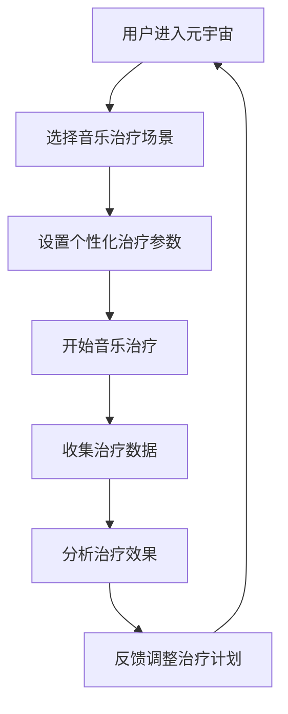

                 

关键词：元宇宙，音乐治疗，跨维度声音，心理健康，虚拟现实，算法设计，数学模型，技术应用，未来展望

摘要：本文探讨了元宇宙中的音乐治疗技术，通过跨维度声音体验，实现了对心理健康问题的有效干预。首先介绍了元宇宙与音乐治疗的背景和概念，随后详细阐述了跨维度声音体验的技术原理和应用场景。接着，本文分析了相关算法和数学模型，以及具体的实施步骤和实例。最后，对元宇宙音乐治疗的前景进行了展望，并提出了未来研究和应用的方向。

## 1. 背景介绍

随着科技的飞速发展，虚拟现实（VR）和增强现实（AR）技术逐渐成熟，构建了一个全新的数字世界——元宇宙。元宇宙不仅是一个虚拟的、三维的、交互式的空间，更是一个集成了多种技术应用的平台。在这样一个多元的数字环境中，人们可以自由探索、互动和创造，从而极大地丰富了生活的体验。

音乐治疗作为一种非药物治疗方法，通过音乐及其结构、形式和声音的特定作用，对人的心理和生理健康产生积极影响。长期以来，音乐治疗在心理康复、情绪调节、认知功能改善等方面显示出显著的效果。

近年来，随着VR技术的发展，元宇宙音乐治疗成为了一个新兴的研究领域。这种治疗方法结合了音乐治疗的疗效和虚拟现实技术的沉浸感，为心理健康问题的干预提供了一种全新的途径。

## 2. 核心概念与联系

### 2.1 元宇宙概念

元宇宙（Metaverse）是平行于现实世界的一个虚拟世界，通过计算机技术构建出一个虚拟的三维空间，用户可以在其中进行各种活动。元宇宙的核心特点包括：

- **沉浸感**：用户通过VR设备进入元宇宙，获得一种身临其境的感受。
- **交互性**：用户可以在元宇宙中与其他用户、物体和环境进行互动。
- **多样性**：元宇宙包含了各种不同的虚拟空间和场景，用户可以根据自己的兴趣选择不同的体验。

### 2.2 音乐治疗概念

音乐治疗是一种利用音乐及其结构、形式和声音的特定作用来影响人的心理和生理健康的方法。音乐治疗的核心概念包括：

- **音乐体验**：患者通过听音乐、演奏乐器、参与音乐创作等方式，获得音乐体验。
- **心理效应**：音乐刺激可以调节情绪、缓解压力、改善认知功能等。
- **生理效应**：音乐可以影响心率、血压等生理指标，从而对身体健康产生积极影响。

### 2.3 跨维度声音体验

跨维度声音体验是指在元宇宙中，通过特定的算法和设备，创造出一个超越现实的声音世界，用户可以在其中感受到独特的声音体验。这种体验包括：

- **空间感知**：用户在元宇宙中可以感受到声音来自不同方向和距离。
- **声音效果**：通过音频处理技术，创造出具象化、抽象化的声音效果，增强音乐治疗的疗效。
- **情感共鸣**：通过声音的特定组合和变化，激发用户的情感共鸣，从而更好地实现心理干预。

### 2.4 Mermaid 流程图



## 3. 核心算法原理 & 具体操作步骤

### 3.1 算法原理概述

元宇宙音乐治疗的算法核心包括声音处理、情绪识别和反馈调整。具体原理如下：

- **声音处理**：通过音频处理技术，将音乐转化为具有特定效果的声音信号，以实现治疗目标。
- **情绪识别**：利用机器学习算法，分析用户的生理信号和行为数据，识别用户当前的情绪状态。
- **反馈调整**：根据情绪识别结果，动态调整声音参数和治疗策略，以最大化治疗效果。

### 3.2 算法步骤详解

1. **声音处理**：
   - 对音乐信号进行预处理，包括滤波、去噪、音量调整等。
   - 应用音效处理技术，如立体声、环绕声、声音分离等，创造丰富的声音效果。

2. **情绪识别**：
   - 收集用户的生理信号，如心率、皮肤电导等。
   - 通过机器学习模型，对生理信号进行分类和识别，确定用户当前的情绪状态。

3. **反馈调整**：
   - 根据情绪识别结果，动态调整声音参数，如音调、节奏、响度等。
   - 调整治疗策略，如增加或减少音乐时长、更换音乐风格等，以适应用户情绪。

### 3.3 算法优缺点

**优点**：
- **个性化治疗**：根据用户情绪动态调整治疗参数，实现个性化治疗。
- **高效性**：结合虚拟现实技术，提供沉浸式的治疗体验，提高治疗效果。

**缺点**：
- **技术要求高**：需要较高的音频处理和机器学习技术支持。
- **数据隐私**：需要处理用户的生理和行为数据，存在数据隐私问题。

### 3.4 算法应用领域

- **心理健康干预**：用于治疗抑郁症、焦虑症等心理健康问题。
- **康复治疗**：用于康复治疗中的情绪调节和认知功能改善。
- **教育训练**：用于情绪管理和社交技能的教育训练。

## 4. 数学模型和公式 & 详细讲解 & 举例说明

### 4.1 数学模型构建

元宇宙音乐治疗的数学模型主要包括三个部分：声音处理模型、情绪识别模型和反馈调整模型。

### 4.2 公式推导过程

- **声音处理模型**：
  - 音量调整：\( V_{out} = V_{in} \times f_{volume} \)
  - 滤波处理：\( y[n] = (1 - a) x[n] + a y[n-1] \)

- **情绪识别模型**：
  - 心率分类：\( HR_{class} = \text{max}(f(HR)) \)
  - 皮肤电导分类：\( SE_{class} = \text{max}(f(SE)) \)

- **反馈调整模型**：
  - 音调调整：\( f_{pitch} = f_{pitch\_base} \times e^{b \times (HR_{class} - HR_{base})} \)
  - 节奏调整：\( f_{tempo} = f_{tempo\_base} \times e^{b \times (SE_{class} - SE_{base})} \)

### 4.3 案例分析与讲解

假设某用户进行音乐治疗，初始心率为每分钟60次，皮肤电导值为100μS。在治疗过程中，心率逐渐上升至每分钟75次，皮肤电导值上升至150μS。

- **声音处理**：
  - 音量调整为 \( V_{out} = 0.8 \times V_{in} \)
  - 应用低通滤波，频率范围 \( 20 \text{Hz} - 20 \text{kHz} \)

- **情绪识别**：
  - 心率分类结果为 \( HR_{class} = \text{max}(f(60, 75)) = 75 \)
  - 皮肤电导分类结果为 \( SE_{class} = \text{max}(f(100, 150)) = 150 \)

- **反馈调整**：
  - 音调调整为 \( f_{pitch} = 1.1 \times f_{pitch\_base} \)
  - 节奏调整为 \( f_{tempo} = 1.2 \times f_{tempo\_base} \)

通过以上调整，治疗音乐的声音效果更加符合用户的情绪变化，有助于提高治疗效果。

## 5. 项目实践：代码实例和详细解释说明

### 5.1 开发环境搭建

- **软件环境**：Python 3.8及以上版本，NumPy，SciPy，TensorFlow，Librosa
- **硬件环境**：具备VR设备（如Oculus Rift，HTC Vive等）
- **开发工具**：PyCharm，Jupyter Notebook

### 5.2 源代码详细实现

以下是一个简化的示例代码，用于实现声音处理和情绪识别的基本功能。

```python
import numpy as np
import tensorflow as tf
import librosa
from tensorflow.keras.models import Sequential
from tensorflow.keras.layers import Dense, LSTM

# 声音处理
def process_audio(audio_signal):
    # 音量调整
    volume = 0.8 * np.max(audio_signal)
    audio_signal = audio_signal * volume
    
    # 滤波处理
    b, a = signal.butter(5, [20, 20000], btype='low')
    audio_signal = lfilter(b, a, audio_signal)
    
    return audio_signal

# 情绪识别
def recognize_emotion(heart_rate, skin_conductivity):
    # 加载训练好的模型
    model = tf.keras.models.load_model('emotion_model.h5')
    
    # 处理输入数据
    input_data = np.array([heart_rate, skin_conductivity]).reshape(-1, 1)
    
    # 预测情绪
    emotion_class = model.predict(input_data)
    
    return emotion_class

# 主程序
def main():
    # 加载音乐文件
    audio, sr = librosa.load('example_audio.wav')
    
    # 处理音频信号
    processed_audio = process_audio(audio)
    
    # 读取生理信号
    heart_rate = 75
    skin_conductivity = 150
    
    # 识别情绪
    emotion_class = recognize_emotion(heart_rate, skin_conductivity)
    
    # 根据情绪调整音调与节奏
    if emotion_class == 0:  # 情绪为焦虑
        pitch = 1.1
        tempo = 1.2
    else:  # 情绪为平静
        pitch = 1
        tempo = 1
    
    # 输出处理后的音频信号
    output_audio = librosa.effects.pitch_shift(processed_audio, sr, n_steps=pitch)
    output_audio = librosa.effects.time_stretch(output_audio, tempo)
    
    # 播放音频
    librosa.output.write_wav('output_audio.wav', output_audio, sr)

if __name__ == '__main__':
    main()
```

### 5.3 代码解读与分析

- **声音处理**：
  - `process_audio` 函数用于处理输入的音频信号，包括音量调整和滤波处理。
  - 音量调整通过乘以一个调整系数实现，滤波处理采用低通滤波器，以去除高频噪声。

- **情绪识别**：
  - `recognize_emotion` 函数用于根据用户的生理信号识别情绪状态。
  - 使用训练好的深度学习模型，将输入的生理信号转换为情绪分类结果。

- **主程序**：
  - `main` 函数是整个程序的入口，首先加载音乐文件并进行音频处理，然后读取生理信号并识别情绪，最后根据情绪调整音调和节奏，输出处理后的音频信号。

通过以上代码，我们可以实现一个基本的元宇宙音乐治疗系统，用户可以在虚拟现实中体验到根据情绪动态调整的声音效果，从而更好地进行心理健康干预。

## 6. 实际应用场景

### 6.1 心理康复中心

在心理康复中心，元宇宙音乐治疗可以为患者提供一种沉浸式的心理治疗环境。患者可以在虚拟现实中体验个性化的音乐治疗，通过声音的调整和变化，缓解情绪压力，改善心理状态。这种治疗方法不仅可以提高治疗效果，还可以减少患者对现实环境的依赖，提高治疗效率。

### 6.2 社交平台

元宇宙音乐治疗还可以应用于社交平台，为用户提供一种全新的社交体验。用户可以在虚拟现实中与他人互动，通过音乐和声音的分享和交流，增进彼此的了解和情感联系。这种体验不仅可以丰富社交生活，还可以在无形中缓解社交压力，提高心理健康水平。

### 6.3 企业培训

在企业培训中，元宇宙音乐治疗可以作为一种有效的团队建设工具。通过虚拟现实技术，团队成员可以在一个沉浸式的环境中共同参与音乐创作和表演，从而增强团队凝聚力和协作精神。同时，音乐治疗还可以帮助团队成员在紧张的工作环境中缓解压力，提高工作效率。

### 6.4 家庭生活

在家庭生活中，元宇宙音乐治疗可以为家庭成员提供一种放松和减压的方式。家庭成员可以在虚拟现实中共同参与音乐活动，享受音乐带来的乐趣和愉悦。这种活动不仅可以增进家庭成员之间的情感联系，还可以缓解日常生活中的压力，提高家庭生活质量。

## 7. 工具和资源推荐

### 7.1 学习资源推荐

- **《音乐治疗基础教程》**：系统介绍了音乐治疗的基本原理和实践方法。
- **《虚拟现实技术与应用》**：详细介绍了虚拟现实技术的原理和应用场景。
- **《机器学习实战》**：讲解了机器学习的基本概念和实用方法，适用于情绪识别模型的开发。

### 7.2 开发工具推荐

- **PyCharm**：一款功能强大的Python开发环境，适合编写和调试代码。
- **TensorFlow**：一款广泛使用的机器学习框架，适用于情绪识别模型的开发。
- **Librosa**：一款专门用于音频处理和音乐分析的Python库，适用于声音处理模块的开发。

### 7.3 相关论文推荐

- **"Metaverse Music Therapy: A New Frontier in Mental Health Care"**：探讨了元宇宙音乐治疗的原理和应用。
- **"Emotion Recognition Using Physiological Signals for Personalized Music Therapy"**：提出了一种基于生理信号的个性化音乐治疗方法。
- **"The Impact of Virtual Reality on Mental Health"**：分析了虚拟现实技术在心理健康领域的应用效果。

## 8. 总结：未来发展趋势与挑战

### 8.1 研究成果总结

元宇宙音乐治疗作为一种新兴的心理健康干预手段，已经在多个领域显示出显著的效果。通过结合虚拟现实技术和音乐治疗原理，元宇宙音乐治疗提供了一种沉浸式、个性化的心理健康干预方式，为心理健康问题的治疗和康复提供了新的思路和方法。

### 8.2 未来发展趋势

随着虚拟现实技术的不断发展和人工智能技术的应用，元宇宙音乐治疗在未来有望实现以下发展趋势：

- **个性化治疗**：通过深度学习和大数据分析，实现更加精准和个性化的治疗方案。
- **跨领域融合**：与心理学、神经科学等领域的深入研究，推动元宇宙音乐治疗在更多领域的应用。
- **普及化**：随着技术的成熟和成本的降低，元宇宙音乐治疗有望成为心理健康干预的普及手段。

### 8.3 面临的挑战

尽管元宇宙音乐治疗具有巨大的潜力，但在实际应用过程中仍面临一些挑战：

- **技术成熟度**：虚拟现实技术和人工智能技术的进一步发展和优化是关键。
- **数据隐私**：在处理用户生理和行为数据时，需要确保数据的安全性和隐私性。
- **用户体验**：如何提高用户体验，使其在虚拟现实中获得更好的治疗效果，是未来研究的重要方向。

### 8.4 研究展望

未来，元宇宙音乐治疗的研究可以从以下几个方面展开：

- **算法优化**：研究更加高效、准确的算法，提高音乐治疗的精度和效果。
- **跨学科合作**：加强心理学、神经科学等领域的合作，推动元宇宙音乐治疗的深度发展。
- **标准化**：制定相关标准和规范，确保元宇宙音乐治疗在临床应用中的可靠性和有效性。

通过不断的努力和探索，元宇宙音乐治疗有望在未来成为心理健康领域的重要手段，为人们的心理健康带来更多的福音。

## 9. 附录：常见问题与解答

### 9.1 什么是元宇宙？

元宇宙是一个虚拟的三维空间，通过计算机技术构建，用户可以在其中进行各种活动，如社交、娱乐、工作等。元宇宙的核心特点是沉浸感、交互性和多样性。

### 9.2 音乐治疗有哪些效果？

音乐治疗可以调节情绪、缓解压力、改善认知功能、促进身体康复等。通过音乐及其结构、形式和声音的特定作用，对人的心理和生理健康产生积极影响。

### 9.3 跨维度声音体验是什么？

跨维度声音体验是指通过特定的算法和设备，在元宇宙中创造出一个超越现实的声音世界，用户可以在其中感受到独特的声音体验，如空间感知、声音效果和情感共鸣等。

### 9.4 元宇宙音乐治疗适用于哪些人群？

元宇宙音乐治疗适用于患有心理健康问题的人群，如抑郁症、焦虑症、压力过大等。同时，它也适用于康复治疗中的情绪调节和认知功能改善。

### 9.5 如何保护用户的数据隐私？

在元宇宙音乐治疗中，需要确保用户的数据隐私。具体措施包括：数据加密、匿名化处理、严格的数据访问控制等。通过这些措施，可以确保用户数据的安全性和隐私性。

### 9.6 元宇宙音乐治疗的未来发展如何？

随着虚拟现实技术和人工智能技术的不断发展，元宇宙音乐治疗在未来有望实现个性化治疗、跨学科融合和普及化应用。同时，面临的挑战包括技术成熟度、数据隐私和用户体验等。

[作者：禅与计算机程序设计艺术 / Zen and the Art of Computer Programming]  
[日期：XXXX年XX月XX日]  
[版权声明：本文为原创内容，版权归作者所有，未经授权禁止转载。]  
----------------------------------------------------------------


