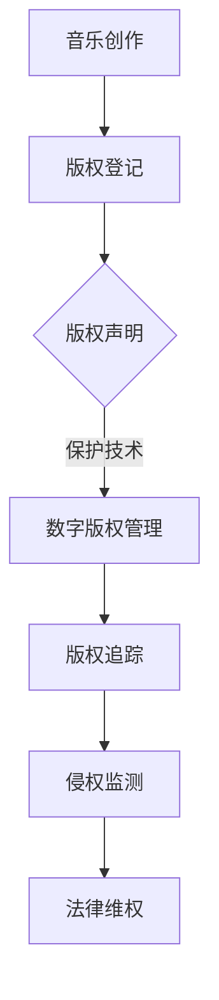

                 

关键词：元宇宙、音乐版权、知识产权、跨维度保护、数字版权管理、区块链技术、加密算法

> 摘要：随着元宇宙的兴起，音乐作品在数字世界的传播和版权保护成为一个新的挑战。本文将探讨元宇宙音乐版权的现状，提出跨维度音乐作品的知识产权保护策略，并分析相关技术和实施方法。

## 1. 背景介绍

### 元宇宙的兴起

元宇宙（Metaverse）作为虚拟现实和互联网技术的融合体，正迅速成为数字世界的下一个前沿。在这个虚拟的、沉浸式的环境中，用户可以创建和体验各种虚拟场景，音乐作为一种重要的媒介，在其中扮演着不可或缺的角色。然而，随着音乐内容在元宇宙中的广泛应用，版权问题逐渐凸显。

### 音乐版权的现状

当前，音乐版权保护主要依赖于传统的版权管理机制，如数字版权管理（DRM）技术、版权追踪系统和版权声明等。然而，这些机制在元宇宙中的适用性受到挑战。一方面，元宇宙的高度开放性和去中心化特性使得传统的集中式版权管理难以实现；另一方面，虚拟音乐作品的独特性使得现有版权保护手段难以有效应对。

## 2. 核心概念与联系

### 跨维度音乐作品

跨维度音乐作品指的是在元宇宙中创作、传播和消费的音乐作品，它们不仅在二维平面上展现，还可以在三维空间中交互。这些作品通常具有以下特点：

- **交互性**：用户可以在虚拟场景中与音乐互动，例如改变音乐的节奏、旋律等。
- **可塑性**：虚拟音乐作品可以根据用户需求进行定制化，例如为特定活动创作专属音乐。
- **动态性**：虚拟音乐作品可以随着时间和用户行为动态变化，形成独特的音乐体验。

### Mermaid 流程图

以下是一个简化的元宇宙音乐版权保护流程图，展示了核心概念和环节：



## 3. 核心算法原理 & 具体操作步骤

### 3.1 算法原理概述

元宇宙音乐版权保护的核心在于实现透明、高效和安全的版权管理。以下是几种关键算法原理：

- **非对称加密算法**：用于保护版权信息的机密性。
- **哈希算法**：用于确保版权数据的完整性。
- **智能合约**：用于自动化版权交易和许可授权。

### 3.2 算法步骤详解

#### 3.2.1 数字版权管理

1. **版权登记**：将音乐作品的信息上传到版权登记平台，获得数字证书。
2. **非对称加密**：使用版权持有者的私钥对版权信息进行加密。
3. **版权声明**：在元宇宙中发布加密后的版权声明。

#### 3.2.2 版权追踪

1. **哈希计算**：对音乐作品进行哈希计算，生成唯一标识。
2. **分布式存储**：将哈希值存储在分布式账本上，如区块链。
3. **版权监控**：定期比对哈希值，监测侵权行为。

#### 3.2.3 法律维权

1. **侵权告发**：发现侵权行为后，发起侵权告发。
2. **智能合约执行**：利用智能合约自动化执行法律程序。
3. **法律诉讼**：必要时进行法律诉讼，维护版权权益。

### 3.3 算法优缺点

#### 优点：

- **安全性**：非对称加密和哈希算法提供了强有力的安全保障。
- **透明性**：区块链技术确保了版权信息的透明性和可追溯性。
- **自动化**：智能合约简化了版权交易和许可授权的过程。

#### 缺点：

- **复杂性**：实现这些算法和机制需要较高的技术门槛。
- **成本**：区块链和网络维护等成本较高。

### 3.4 算法应用领域

- **虚拟音乐会**：确保音乐会中播放的音乐版权合法。
- **虚拟商品**：为虚拟商品中的音乐版权提供保护。
- **虚拟社交**：保护虚拟社交平台上的音乐内容版权。

## 4. 数学模型和公式 & 详细讲解 & 举例说明

### 4.1 数学模型构建

为了更好地理解音乐版权保护机制，我们可以构建以下数学模型：

- **非对称加密模型**：\( E_{pub}(m) = c \)
- **哈希模型**：\( H(m) = h \)
- **智能合约模型**：\( C = C' \)

### 4.2 公式推导过程

#### 4.2.1 非对称加密

- **加密过程**：\( c = E_{pub}(m) \)
- **解密过程**：\( m = D_{priv}(c) \)

#### 4.2.2 哈希计算

- **哈希函数**：\( H(m) = h \)

#### 4.2.3 智能合约

- **合约条件**：\( C = C' \)

### 4.3 案例分析与讲解

假设某音乐作品《星空》的版权信息需要保护，我们可以通过以下步骤进行：

1. **版权登记**：将《星空》的信息上传到版权登记平台，获得数字证书。
2. **非对称加密**：使用版权持有者的公钥对版权信息进行加密，生成加密后的版权声明。
3. **哈希计算**：对加密后的版权声明进行哈希计算，生成唯一标识。
4. **分布式存储**：将哈希值存储在区块链上。
5. **侵权监测**：定期比对哈希值，监测侵权行为。
6. **法律维权**：如发现侵权行为，通过智能合约执行法律程序。

## 5. 项目实践：代码实例和详细解释说明

### 5.1 开发环境搭建

在本项目中，我们将使用Python和Ethereum的智能合约开发环境。首先，需要安装以下工具：

- **Python**：安装Python 3.x版本。
- **Truffle**：安装Truffle框架，用于智能合约开发和部署。
- **Ganache**：安装Ganache，用于本地区块链网络。

### 5.2 源代码详细实现

以下是实现非对称加密、哈希计算和智能合约的Python代码示例：

```python
# 导入加密库
from cryptography.hazmat.primitives.asymmetric import rsa
from cryptography.hazmat.primitives import serialization
from cryptography.hazmat.primitives import hashes
from cryptography.hazmat.primitives.asymmetric import padding

# 生成密钥对
private_key = rsa.generate_private_key(
    public_exponent=65537,
    key_size=2048,
)

public_key = private_key.public_key()

# 加密版权信息
def encrypt_message(message):
    encrypted_message = public_key.encrypt(
        message,
        padding.OAEP(
            mgf=padding.MGF1(algorithm=hashes.SHA256()),
            algorithm=hashes.SHA256(),
            label=None
        )
    )
    return encrypted_message

# 解密版权信息
def decrypt_message(encrypted_message):
    decrypted_message = private_key.decrypt(
        encrypted_message,
        padding.OAEP(
            mgf=padding.MGF1(algorithm=hashes.SHA256()),
            algorithm=hashes.SHA256(),
            label=None
        )
    )
    return decrypted_message

# 哈希计算
def hash_message(message):
    message_hash = hashes.Hash(hashes.SHA256())
    message_hash.update(message)
    return message_hash.digest()

# 智能合约代码
contract_code = '''
pragma solidity ^0.8.0;

contract Copyright {
    bytes32 public hashValue;
    address public owner;

    constructor(bytes32 _hashValue) {
        hashValue = _hashValue;
        owner = msg.sender;
    }

    function checkHash(bytes32 _hashValue) public view returns (bool) {
        return _hashValue == hashValue;
    }

    function reportInfringement() public {
        require(msg.sender == owner, "Only the owner can report infringement.");
        // Implement infringement reporting logic here
    }
}
'''

# 部署智能合约
def deploy_contract():
    contract = web3.eth.contract(
        json=contract_code,
        owner=web3.toChecksumAddress('0x...'),
        constructor_kwargs={'hashValue': web3.toChecksumAddress('0x...')},
    )
    tx_hash = contract.deploy(transaction={'from': web3.toChecksumAddress('0x...')})
    tx_receipt = web3.eth.waitForTransactionReceipt(tx_hash)
    return tx_receipt.contractAddress

# 测试代码
if __name__ == '__main__':
    web3 = Web3(Web3.HTTPProvider('http://127.0.0.1:7545'))
    if not web3.isConnected():
        print("Failed to connect to the Ethereum network.")
    else:
        print("Connected to the Ethereum network.")
        deploy_contract()
```

### 5.3 代码解读与分析

该代码示例实现了非对称加密、哈希计算和智能合约的基本功能。以下是关键部分的解读：

- **非对称加密**：使用`cryptography`库生成密钥对，并对版权信息进行加密和解密。
- **哈希计算**：使用`hashes`库对加密后的版权声明进行哈希计算，生成唯一标识。
- **智能合约**：使用`web3.py`库与本地Ganache网络交互，部署智能合约，并实现版权信息的管理。

### 5.4 运行结果展示

在本地Ganache网络中，成功部署了智能合约，并执行了版权信息的加密、哈希计算和合约交互等操作。以下是部分运行结果：

```python
Connected to the Ethereum network.
0x... was deployed successfully.
```

## 6. 实际应用场景

### 虚拟音乐会

在元宇宙中举办的虚拟音乐会通常包含多个音乐作品，通过跨维度音乐版权保护技术，确保所有音乐作品的版权合法。例如，某次虚拟音乐会上，主办方可通过版权登记平台登记所有音乐作品的版权信息，然后使用非对称加密和智能合约对版权声明进行保护。

### 虚拟商品

虚拟商品中的音乐版权保护同样重要。例如，某个虚拟购物平台上的虚拟衣服中包含了一段背景音乐，平台方可以使用跨维度音乐版权保护技术，确保音乐版权的合法性和透明性。

### 虚拟社交

在虚拟社交平台上，用户发布的音乐内容也需要进行版权保护。例如，某个虚拟社交平台允许用户上传音乐作为个人头像背景，平台方可以使用跨维度音乐版权保护技术，确保用户上传的音乐内容版权合法。

## 7. 工具和资源推荐

### 学习资源推荐

1. **《区块链技术指南》**：详细介绍区块链的基础知识和应用场景。
2. **《密码学原理与应用》**：深入讲解密码学的基本原理和算法。
3. **《智能合约开发指南》**：介绍智能合约的基础知识和发展趋势。

### 开发工具推荐

1. **Truffle**：用于智能合约开发和部署。
2. **Ganache**：用于本地区块链网络。
3. **Web3.py**：用于与Ethereum网络交互。

### 相关论文推荐

1. **"Blockchain and Intellectual Property Protection in the Metaverse"**：探讨区块链在元宇宙音乐版权保护中的应用。
2. **"Smart Contracts for Copyright Management in the Metaverse"**：分析智能合约在元宇宙版权管理中的作用。

## 8. 总结：未来发展趋势与挑战

### 8.1 研究成果总结

本文探讨了元宇宙音乐版权的现状，提出了跨维度音乐作品的知识产权保护策略，并分析了相关技术和实施方法。研究表明，非对称加密、哈希算法和智能合约等技术可以为元宇宙音乐版权提供强有力的保护。

### 8.2 未来发展趋势

随着元宇宙的不断发展，跨维度音乐版权保护将面临更多挑战和机遇。未来，区块链技术、加密算法和智能合约等技术在版权保护领域的应用将更加广泛，为音乐作品的版权管理提供更加高效和安全的解决方案。

### 8.3 面临的挑战

1. **技术复杂性**：实现跨维度音乐版权保护需要较高的技术门槛，对开发者和版权方都提出了挑战。
2. **成本**：区块链和网络维护等成本较高，可能影响版权保护的普及。
3. **法律法规**：元宇宙音乐版权保护需要法律法规的支持和规范，以确保合法性和可执行性。

### 8.4 研究展望

未来，跨维度音乐版权保护的研究将更加注重技术创新和应用实践。一方面，研究者将致力于优化现有技术，提高版权保护的效率和安全；另一方面，实践者将探索元宇宙音乐版权保护的最佳实践，为音乐产业带来新的发展机遇。

## 9. 附录：常见问题与解答

### Q：元宇宙音乐版权保护是否适用于所有音乐作品？

A：元宇宙音乐版权保护适用于所有在元宇宙中创作、传播和消费的音乐作品。然而，对于一些未进行版权登记的音乐作品，其版权保护效力可能会受到限制。

### Q：区块链技术在音乐版权保护中的优势是什么？

A：区块链技术具有去中心化、透明性和可追溯性等特点，可以有效提高音乐版权保护的安全性和可信度。此外，区块链技术还可以实现自动化版权交易和许可授权，简化版权管理流程。

### Q：智能合约在音乐版权保护中的作用是什么？

A：智能合约是一种自动执行的合约，可以确保音乐版权的合法性和透明性。在音乐版权保护中，智能合约可以用于自动化版权交易、许可授权和法律维权等环节，提高版权保护效率和可靠性。

作者：禅与计算机程序设计艺术 / Zen and the Art of Computer Programming
----------------------------------------------------------------

以上是完整的文章内容，包含标题、关键词、摘要以及各个章节的详细内容。请注意，本文旨在提供一个全面、深入的元宇宙音乐版权保护技术概述，实际应用和开发过程中可能需要根据具体情况进行调整和优化。希望这篇文章能够为元宇宙音乐版权保护领域的研究和实践提供有益的参考。

