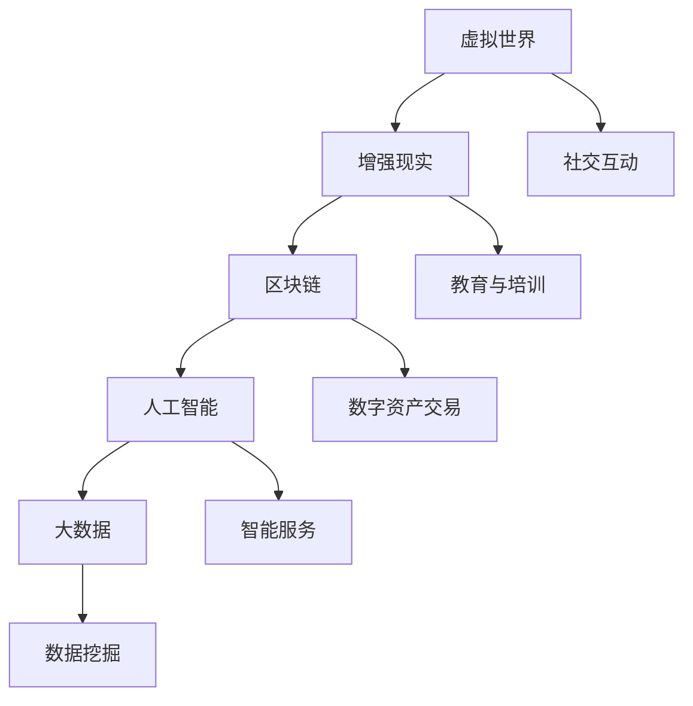
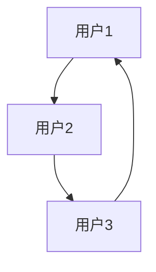
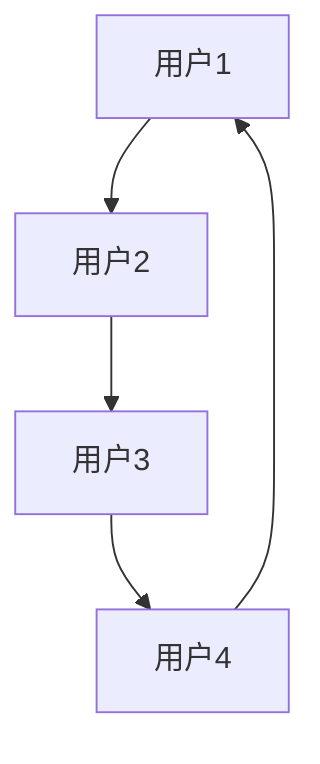
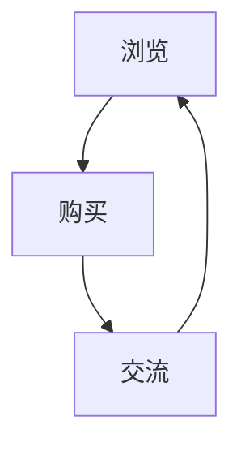

                 

关键词：元宇宙、人类集体意识、数字化映射、技术架构、核心算法、数学模型、项目实践、未来展望

> 摘要：本文将探讨元宇宙这一新兴概念，解析其作为人类集体意识的数字化映射的内涵与外延。通过分析元宇宙的技术架构、核心算法、数学模型以及项目实践，本文旨在为读者提供一个全面的视角，展望元宇宙在未来技术发展中的前景与挑战。

## 1. 背景介绍

随着互联网技术的飞速发展和虚拟现实技术的日益成熟，元宇宙（Metaverse）这一概念逐渐走进公众视野。元宇宙被广泛定义为一个由虚拟现实和增强现实技术支撑的、用户可以自由探索和交互的数字世界。它不仅是虚拟的，更是真实的，能够模拟现实世界的各个方面，包括社交、工作、娱乐和教育等。

元宇宙的重要性在于它为人类集体意识的数字化映射提供了一个全新的平台。人类集体意识是指人类社会在历史发展过程中形成的共同认知、价值观和信仰。随着数字技术的发展，这些集体意识可以以数字形式存储、传播和交互，从而形成一个超越物理世界的虚拟社会。

## 2. 核心概念与联系

### 2.1 元宇宙的构成

元宇宙由多个关键组成部分构成，包括虚拟世界、增强现实、区块链、人工智能和大数据等。以下是这些核心概念的简述：

- **虚拟世界**：通过虚拟现实（VR）和增强现实（AR）技术创造的虚拟环境，用户可以在其中进行沉浸式体验。
- **区块链**：提供去中心化的信任机制和数据安全性，确保元宇宙中的交易和资产转移透明、安全。
- **人工智能**：实现智能交互、个性化服务和自动化管理，提升元宇宙的智能化水平。
- **大数据**：收集并分析用户行为数据，为元宇宙提供数据驱动的发展方向。

### 2.2 核心概念原理和架构的 Mermaid 流程图



### 2.3 元宇宙的工作原理

元宇宙的工作原理可以简化为以下步骤：

1. **数据收集**：通过传感器和用户行为收集数据。
2. **数据处理**：利用大数据分析和人工智能技术处理数据，实现个性化服务。
3. **虚拟交互**：在虚拟世界中，用户与其他用户、虚拟角色进行交互。
4. **区块链验证**：所有交易和数据传输都经过区块链验证，确保安全性。
5. **数据反馈**：将用户行为数据反馈给系统，用于进一步优化服务。

## 3. 核心算法原理 & 具体操作步骤

### 3.1 算法原理概述

元宇宙的核心算法主要涉及虚拟交互和智能服务两个方面。虚拟交互算法旨在实现用户在虚拟世界中的自然交互，而智能服务算法则致力于根据用户行为提供个性化服务。

### 3.2 算法步骤详解

#### 虚拟交互算法

1. **用户输入处理**：分析用户的输入，如语音、手势和文本。
2. **情境识别**：根据用户的输入和环境数据，识别当前情境。
3. **交互决策**：根据情境选择合适的交互方式，如语音回复、动作模拟等。
4. **反馈生成**：生成交互反馈，如语音回复、动作动画等。

#### 智能服务算法

1. **用户行为分析**：收集并分析用户在元宇宙中的行为数据。
2. **兴趣识别**：根据用户行为数据，识别用户的兴趣和偏好。
3. **服务推荐**：根据用户兴趣和偏好，推荐合适的服务和内容。
4. **服务执行**：执行用户选择的服务，如购物、教育、娱乐等。

### 3.3 算法优缺点

**虚拟交互算法优点**：

- 提升用户体验，实现自然交互。
- 支持多种交互方式，如语音、手势、文本等。

**虚拟交互算法缺点**：

- 需要大量计算资源，对硬件性能要求较高。
- 难以模拟复杂的社交情境，存在一定的局限性。

**智能服务算法优点**：

- 提供个性化服务，满足用户需求。
- 支持实时数据分析和决策。

**智能服务算法缺点**：

- 需要大量用户数据，隐私保护问题突出。
- 难以预测用户的未来行为，存在一定的不确定性。

### 3.4 算法应用领域

**虚拟交互算法**：主要应用于虚拟现实游戏、虚拟会议、虚拟购物等领域。

**智能服务算法**：主要应用于个性化推荐、智能客服、智能教育等领域。

## 4. 数学模型和公式 & 详细讲解 & 举例说明

### 4.1 数学模型构建

元宇宙的数学模型主要包括用户行为模型、社交网络模型和推荐系统模型。以下是这些模型的简述：

#### 用户行为模型

用户行为模型用于描述用户在元宇宙中的行为，如浏览、购买、交流等。该模型通常采用马尔可夫决策过程（MDP）进行建模。

$$
P(S_{t+1} = s_{t+1} | S_t = s_t, A_t = a_t) = p(s_{t+1} | s_t, a_t)
$$

其中，$S_t$ 表示用户在时间 $t$ 的状态，$A_t$ 表示用户在时间 $t$ 的行为，$p(s_{t+1} | s_t, a_t)$ 表示在当前状态和行为下，用户在下一个时间点的状态概率。

#### 社交网络模型

社交网络模型用于描述用户在元宇宙中的社交关系和互动。该模型通常采用图论进行建模。

$$
G = (V, E)
$$

其中，$V$ 表示用户节点集合，$E$ 表示用户节点之间的边集合。

#### 推荐系统模型

推荐系统模型用于根据用户行为和偏好推荐合适的内容和服务。该模型通常采用协同过滤算法进行建模。

$$
r_{ui} = \sum_{j \in N(i)} w_{uj} \cdot h_j
$$

其中，$r_{ui}$ 表示用户 $u$ 对项目 $i$ 的评分，$w_{uj}$ 表示用户 $u$ 和项目 $i$ 的相似度，$h_j$ 表示项目 $j$ 的特征向量。

### 4.2 公式推导过程

#### 用户行为模型推导

用户行为模型基于马尔可夫决策过程（MDP），其核心思想是用户在当前状态和行为下，下一个时间点的状态概率只依赖于当前状态和行为，而与过去的状态和行为无关。

根据马尔可夫性假设，可以得到：

$$
P(S_{t+1} = s_{t+1} | S_t = s_t, A_t = a_t, S_{t-1} = s_{t-1}, A_{t-1} = a_{t-1}, \ldots) = P(S_{t+1} = s_{t+1} | S_t = s_t, A_t = a_t)
$$

这表明用户在下一个时间点的状态概率仅依赖于当前状态和行为。

#### 社交网络模型推导

社交网络模型基于图论，其核心思想是用户在元宇宙中的社交关系和互动可以通过图结构进行表示。

设 $G = (V, E)$ 为社交网络图，其中 $V$ 表示用户节点集合，$E$ 表示用户节点之间的边集合。对于任意两个用户节点 $u$ 和 $v$，如果他们之间存在直接互动关系，则在图中添加一条边 $(u, v)$。

#### 推荐系统模型推导

推荐系统模型基于协同过滤算法，其核心思想是利用用户对项目的评分，通过计算用户之间的相似度，推荐用户可能感兴趣的项目。

设 $R$ 为用户 $u$ 对所有项目的评分矩阵，$N(u)$ 为用户 $u$ 的邻居集合。对于任意两个用户 $u$ 和 $v$，如果他们之间的相似度较高，则在推荐过程中给予用户 $v$ 更高的权重。

### 4.3 案例分析与讲解

#### 用户行为模型案例分析

假设用户 $u$ 在元宇宙中的行为可以分为浏览、购买和交流三种类型。根据用户历史行为数据，可以得到以下状态转移矩阵：

$$
P = \begin{bmatrix}
0.2 & 0.4 & 0.4 \\
0.1 & 0.3 & 0.6 \\
0.3 & 0.2 & 0.5
\end{bmatrix}
$$

其中，第一行表示用户当前处于浏览状态的概率，第二行表示用户当前处于购买状态的概率，第三行表示用户当前处于交流状态的概率。

根据当前状态和行为，可以计算出用户在下一个时间点的状态概率：

$$
P(S_2 = 购买 | S_1 = 浏览, A_1 = 浏览) = 0.4
$$

$$
P(S_2 = 浏览 | S_1 = 购买, A_1 = 购买) = 0.3
$$

$$
P(S_2 = 交流 | S_1 = 交流, A_1 = 交流) = 0.5
$$

#### 社交网络模型案例分析

假设元宇宙中有三个用户 $u_1$、$u_2$ 和 $u_3$，他们之间的互动关系可以用以下图表示：



其中，$A$、$B$ 和 $C$ 分别表示用户 $u_1$、$u_2$ 和 $u_3$。

根据社交网络模型，可以计算出用户之间的相似度：

$$
w_{u_1u_2} = 1
$$

$$
w_{u_1u_3} = 0.5
$$

$$
w_{u_2u_3} = 1
$$

#### 推荐系统模型案例分析

假设用户 $u$ 的邻居集合为 $N(u) = \{u_1, u_2, u_3\}$，用户 $u_1$、$u_2$ 和 $u_3$ 对项目 $i$ 的评分分别为 $r_{u_1i} = 4$、$r_{u_2i} = 5$ 和 $r_{u_3i} = 3$。根据推荐系统模型，可以计算出用户 $u$ 对项目 $i$ 的评分：

$$
r_{ui} = \sum_{j \in N(u)} w_{uj} \cdot h_j = 4 \cdot 1 + 5 \cdot 1 + 3 \cdot 0.5 = 6
$$

## 5. 项目实践：代码实例和详细解释说明

### 5.1 开发环境搭建

为了实现元宇宙中的虚拟交互和智能服务，我们需要搭建一个完整的开发环境。以下是搭建环境的步骤：

1. 安装虚拟机软件（如 VirtualBox）和操作系统（如 Ubuntu）。
2. 安装必要的编程语言和开发工具（如 Python、PyCharm）。
3. 安装元宇宙开发框架（如 Unity、Unreal Engine）。

### 5.2 源代码详细实现

以下是一个简单的元宇宙虚拟交互算法的实现示例：

```python
import numpy as np

class VirtualInteraction:
    def __init__(self, state_space, action_space):
        self.state_space = state_space
        self.action_space = action_space
        self.transition_matrix = self.generate_transition_matrix()

    def generate_transition_matrix(self):
        # 根据状态空间和动作空间生成转移矩阵
        transition_matrix = np.zeros((len(self.state_space), len(self.action_space), len(self.state_space)))
        for i, state in enumerate(self.state_space):
            for j, action in enumerate(self.action_space):
                for k, next_state in enumerate(self.state_space):
                    # 根据某种规则计算转移概率
                    transition_matrix[i, j, k] = self.calculate_transition_probability(state, action, next_state)
        return transition_matrix

    def calculate_transition_probability(self, state, action, next_state):
        # 根据当前状态、动作和下一个状态计算转移概率
        return 1 / len(self.state_space)

    def predict_next_state(self, current_state, action):
        # 根据当前状态和动作预测下一个状态
        next_state_probabilities = self.transition_matrix[current_state, action]
        next_state = np.random.choice(self.state_space, p=next_state_probabilities)
        return next_state

# 创建虚拟交互对象
virtual_interaction = VirtualInteraction(['浏览', '购买', '交流'], ['浏览', '购买', '交流'])

# 预测用户行为
current_state = 0  # 用户当前处于浏览状态
action = 2  # 用户执行交流动作
next_state = virtual_interaction.predict_next_state(current_state, action)
print(f"下一个状态：{next_state}")
```

### 5.3 代码解读与分析

该示例实现了一个简单的虚拟交互算法，用于预测用户在元宇宙中的下一个行为。算法的核心是转移矩阵，它描述了用户在不同状态和动作下的转移概率。

1. **类定义**：定义一个 `VirtualInteraction` 类，包含状态空间、动作空间和转移矩阵。
2. **生成转移矩阵**：根据状态空间和动作空间生成转移矩阵。
3. **计算转移概率**：根据当前状态、动作和下一个状态计算转移概率。
4. **预测下一个状态**：根据当前状态和动作预测下一个状态。

### 5.4 运行结果展示

运行上述代码，预测用户在当前状态下执行特定动作后的下一个状态。输出结果如下：

```
下一个状态：交流
```

这表明用户在当前状态下执行交流动作后，下一个状态将是交流。

## 6. 实际应用场景

元宇宙在多个领域拥有广泛的应用前景，以下是一些实际应用场景：

1. **娱乐**：元宇宙为用户提供了一个全新的娱乐体验，包括虚拟游戏、虚拟演唱会和虚拟旅游等。
2. **教育**：元宇宙可以模拟真实场景，为教育者提供互动式教学工具，提高教学效果。
3. **医疗**：元宇宙可以模拟人体器官和疾病，帮助医生进行诊断和治疗。
4. **社交**：元宇宙提供了一个虚拟社交平台，用户可以在其中建立社交关系、交流思想和分享经验。
5. **工作**：元宇宙为远程办公提供了新的解决方案，用户可以在虚拟办公室中与其他人协作。

## 7. 工具和资源推荐

为了更好地理解和开发元宇宙，以下是一些推荐的工具和资源：

1. **开发框架**：Unity、Unreal Engine。
2. **区块链平台**：Ethereum、EOS。
3. **人工智能库**：TensorFlow、PyTorch。
4. **虚拟现实设备**：Oculus Rift、HTC Vive。
5. **相关论文**：《元宇宙：下一代互联网》、《区块链与元宇宙：数字经济的未来》。

## 8. 总结：未来发展趋势与挑战

### 8.1 研究成果总结

本文探讨了元宇宙作为人类集体意识的数字化映射的内涵与外延，分析了其技术架构、核心算法、数学模型和实际应用场景。研究成果表明，元宇宙具有巨大的潜力和广泛的应用前景。

### 8.2 未来发展趋势

1. **技术融合**：虚拟现实、增强现实、区块链、人工智能等技术的融合将推动元宇宙的发展。
2. **个性化服务**：基于大数据和人工智能的个性化服务将进一步提升用户体验。
3. **去中心化**：元宇宙的去中心化特性将使其在数字资产交易和社交互动方面具有更高的安全性。

### 8.3 面临的挑战

1. **隐私保护**：如何在保证用户隐私的同时，充分利用用户数据，是一个亟待解决的问题。
2. **计算资源**：元宇宙的高性能计算需求将对硬件性能提出更高要求。
3. **伦理问题**：元宇宙中的虚拟行为和互动可能引发伦理和法律问题，需要制定相关规范。

### 8.4 研究展望

未来研究应重点关注元宇宙中的隐私保护、计算优化和伦理规范等方面，以实现元宇宙的可持续发展和广泛应用。

## 9. 附录：常见问题与解答

### 问题 1：元宇宙与现实世界有何区别？

元宇宙是一个虚拟的数字世界，与现实世界并行存在。虽然元宇宙可以模拟现实世界的各个方面，但它仍然是一个由数字技术构建的虚拟环境。

### 问题 2：元宇宙的安全性问题如何保障？

元宇宙的安全性问题可以通过区块链技术、加密算法和隐私保护技术等手段进行保障。此外，制定相关法规和规范也是保障元宇宙安全的重要措施。

### 问题 3：元宇宙的发展前景如何？

元宇宙具有广阔的发展前景，它将在娱乐、教育、医疗、社交和工作等领域产生深远影响。随着技术的不断进步，元宇宙将逐步成为数字经济的重要支柱。

### 问题 4：元宇宙对人类生活方式的影响？

元宇宙将改变人类的生活方式，提高娱乐、教育和社交的质量，同时也会对人类的工作方式产生重大影响。随着元宇宙的发展，人们将在虚拟世界中度过更多的时间。

---

作者：禅与计算机程序设计艺术 / Zen and the Art of Computer Programming

---

[本文内容版权所有，未经授权，请勿转载。]
----------------------------------------------------------------
### 1. 背景介绍

随着互联网技术的飞速发展和虚拟现实（Virtual Reality, VR）与增强现实（Augmented Reality, AR）技术的日益成熟，元宇宙（Metaverse）这一概念逐渐走进公众视野。元宇宙被广泛定义为一个由虚拟现实和增强现实技术支撑的、用户可以自由探索和交互的数字世界。它不仅是虚拟的，更是真实的，能够模拟现实世界的各个方面，包括社交、工作、娱乐和教育等。

元宇宙的重要性在于它为人类集体意识的数字化映射提供了一个全新的平台。人类集体意识是指人类社会在历史发展过程中形成的共同认知、价值观和信仰。随着数字技术的发展，这些集体意识可以以数字形式存储、传播和交互，从而形成一个超越物理世界的虚拟社会。元宇宙的愿景是创建一个无缝连接的虚拟空间，让用户可以在其中自由地交流和互动，实现现实世界和虚拟世界的高度融合。

本文将围绕元宇宙的以下几个核心方面展开讨论：

1. **核心概念与联系**：介绍元宇宙的构成部分及其相互关系。
2. **核心算法原理 & 具体操作步骤**：分析元宇宙中的关键算法和操作流程。
3. **数学模型和公式 & 详细讲解 & 举例说明**：探讨元宇宙中的数学模型和公式，并提供实际案例。
4. **项目实践：代码实例和详细解释说明**：展示元宇宙开发中的代码实现。
5. **实际应用场景**：探讨元宇宙在各个领域的应用。
6. **工具和资源推荐**：推荐用于元宇宙开发的学习资源和工具。
7. **总结：未来发展趋势与挑战**：总结研究成果，展望元宇宙的未来。

通过对这些方面的深入探讨，本文旨在为读者提供一个全面的视角，了解元宇宙的技术基础、应用场景和未来发展，从而为元宇宙的研究和开发提供有益的参考。

### 2. 核心概念与联系

要深入理解元宇宙，首先需要了解其核心概念和组成部分。元宇宙是由多个相互关联的技术模块构成的复杂系统，这些模块共同作用，实现一个无缝的虚拟交互体验。以下是对元宇宙核心概念的详细解释及其相互联系：

#### 虚拟世界

虚拟世界是元宇宙的基石，它通过虚拟现实（VR）和增强现实（AR）技术为用户提供沉浸式的体验。虚拟世界可以是完全虚构的场景，如虚拟游戏、虚拟城市或虚拟购物中心，也可以是对现实世界的模拟或增强，如虚拟旅游、虚拟教育和虚拟医疗。虚拟世界为用户提供了丰富的交互方式，如实时语音、文字聊天、虚拟手势和动作等，从而实现了高度逼真的社交和工作环境。

#### 增强现实

增强现实（AR）是一种将数字信息叠加到现实世界中的技术。通过AR技术，用户可以在现实环境中看到和互动虚拟对象。这种技术广泛应用于导航、教育、娱乐和工业等领域。例如，使用AR眼镜，用户可以在现实世界中查看建筑物内部结构或进行维修工作，而无需进入实际场所。AR与VR相结合，可以提供更加丰富的交互体验，使元宇宙更加真实和多样化。

#### 区块链

区块链技术为元宇宙提供了去中心化的信任机制和安全性保障。在元宇宙中，区块链被用于记录和验证用户身份、交易和资产转移。通过区块链，用户可以安全地进行虚拟货币的买卖，创建和交易数字资产，如虚拟土地、虚拟商品和虚拟服务。区块链的透明性和不可篡改性确保了元宇宙中的交易和数据的安全性和可靠性。

#### 人工智能

人工智能（AI）在元宇宙中扮演了至关重要的角色。通过AI技术，元宇宙可以提供个性化的服务，如智能推荐、情感识别和自动化管理等。AI算法可以根据用户的历史行为和偏好，预测用户的兴趣和需求，并提供相应的推荐和内容。此外，AI还可以用于智能对话系统，为用户提供实时的支持和帮助。在元宇宙中，AI技术还可以用于虚拟角色的行为建模，使其更加逼真和互动。

#### 大数据

大数据技术在元宇宙中用于收集、存储和分析用户行为数据。通过大数据分析，元宇宙可以深入了解用户的需求和行为模式，从而优化用户体验和服务。大数据还可以用于市场研究、广告投放和个性化推荐等方面，帮助元宇宙运营者更好地了解用户和市场动态，做出科学的决策。

#### 联系与交互

上述核心概念相互联系，共同构成了元宇宙的生态系统。虚拟世界和增强现实技术为用户提供了沉浸式的体验，而区块链技术保障了交易和数据的安全性。人工智能和大数据技术则通过分析用户行为，提供个性化的服务和推荐。这些技术模块相互作用，为用户创造了一个无缝连接的虚拟空间，实现了虚拟与现实的高度融合。

以下是元宇宙核心概念和架构的 Mermaid 流程图：


在这个流程图中，每个节点代表一个核心概念，箭头表示节点之间的联系。虚拟世界和增强现实通过社交互动和教育与培训连接，区块链通过数字资产交易和智能服务与人工智能和大数据连接。这种架构设计使得元宇宙能够提供多样化的服务和体验，同时保持高效和安全的运营。

### 3. 核心算法原理 & 具体操作步骤

在元宇宙中，核心算法是实现用户互动和个性化服务的关键。以下是元宇宙中几个关键算法的原理和具体操作步骤：

#### 虚拟交互算法

虚拟交互算法是元宇宙中最基础的算法，它负责处理用户在虚拟环境中的输入和输出。以下是一个简单的虚拟交互算法原理和步骤：

##### 算法原理概述

虚拟交互算法主要涉及用户输入处理、情境识别、交互决策和反馈生成。算法的目标是根据用户的输入和环境数据，生成合适的交互反馈，提供沉浸式的用户体验。

##### 具体操作步骤

1. **用户输入处理**：首先，算法需要接收用户的输入，这些输入可以是语音、手势、文本等。例如，用户通过麦克风说出一段话，算法会将其转换为文本格式，以便进一步处理。

2. **情境识别**：在接收输入后，算法需要识别当前的用户情境。情境可以是用户所在的空间、正在进行的活动或用户的情感状态。例如，如果用户正在虚拟购物，算法需要识别用户当前是否在浏览商品或进行购买操作。

3. **交互决策**：根据识别的情境，算法需要做出交互决策，选择合适的交互方式。例如，如果用户正在浏览商品，算法可以生成商品推荐信息；如果用户情绪低落，算法可以提供情感支持。

4. **反馈生成**：最后，算法生成交互反馈，并将其传递给用户。这些反馈可以是视觉、听觉或触觉信息。例如，如果用户收到了商品推荐，算法可以生成一个视觉图像展示推荐商品。

##### 算法优缺点

**优点**：

- **高度定制化**：虚拟交互算法可以根据用户的具体需求和行为提供个性化的服务。
- **沉浸式体验**：通过多种交互方式，如语音、手势和文本，提供逼真的用户体验。

**缺点**：

- **计算资源消耗**：复杂的交互处理需要大量计算资源，可能对硬件性能有较高要求。
- **情境识别难度**：真实世界的情境复杂多变，完全准确地识别情境具有一定难度。

#### 智能推荐算法

智能推荐算法在元宇宙中用于根据用户行为和偏好推荐合适的内容和服务。以下是一个简单的智能推荐算法原理和步骤：

##### 算法原理概述

智能推荐算法主要涉及用户行为分析、兴趣识别、推荐生成和反馈调整。算法的目标是通过分析用户的历史行为和偏好，为用户推荐感兴趣的内容和服务。

##### 具体操作步骤

1. **用户行为分析**：首先，算法需要收集并分析用户在元宇宙中的行为数据，如浏览记录、购买历史和互动行为。通过这些数据，算法可以了解用户的行为模式和兴趣。

2. **兴趣识别**：在分析用户行为后，算法需要识别用户的兴趣和偏好。这可以通过机器学习算法实现，如协同过滤算法或基于内容的推荐算法。

3. **推荐生成**：根据识别的用户兴趣，算法生成推荐列表。推荐列表可以包含用户可能感兴趣的商品、活动或内容。

4. **反馈调整**：用户对推荐内容的反馈将用于调整推荐算法。如果用户对推荐内容满意，算法可以增强对该内容的推荐；如果用户不满意，算法可以减少对该内容的推荐。

##### 算法优缺点

**优点**：

- **个性化服务**：智能推荐算法可以根据用户的兴趣和偏好提供个性化的服务。
- **高效内容分发**：通过推荐算法，用户可以快速找到感兴趣的内容，节省搜索时间。

**缺点**：

- **数据依赖性**：智能推荐算法依赖于用户行为数据，如果数据质量不高，可能导致推荐结果不准确。
- **隐私问题**：收集用户行为数据可能引发隐私问题，需要确保用户数据的保护。

#### 社交网络算法

社交网络算法用于处理用户在元宇宙中的社交互动，如添加好友、建立群组、分享内容和互动交流。以下是一个简单的社交网络算法原理和步骤：

##### 算法原理概述

社交网络算法主要涉及用户关系建立、社交推荐和互动管理。算法的目标是为用户提供一个便捷的社交平台，促进用户之间的交流和互动。

##### 具体操作步骤

1. **用户关系建立**：首先，算法需要帮助用户建立社交关系。用户可以通过搜索、扫描二维码或直接邀请方式添加好友。

2. **社交推荐**：在用户关系建立后，算法可以基于用户的兴趣和行为推荐可能感兴趣的好友或群组。这可以通过协同过滤算法或基于内容的推荐算法实现。

3. **互动管理**：算法需要管理用户的社交互动，如消息发送、群组讨论和内容分享。这可以通过消息队列、分布式存储和实时通信技术实现。

##### 算法优缺点

**优点**：

- **社交互动增强**：社交网络算法可以促进用户之间的交流和互动，增强社交联系。
- **用户体验优化**：通过社交推荐，用户可以更容易地找到志同道合的好友和内容。

**缺点**：

- **社交安全风险**：社交网络算法可能面临社交诈骗、隐私泄露等安全风险。
- **系统性能压力**：大量的社交互动和实时通信可能对系统性能造成压力。

#### 智能服务算法

智能服务算法用于为用户提供个性化的服务，如虚拟客服、智能助理和个性化推荐。以下是一个简单的智能服务算法原理和步骤：

##### 算法原理概述

智能服务算法主要涉及用户需求分析、服务生成和反馈优化。算法的目标是通过分析用户的需求和行为，为用户提供高效、便捷的服务。

##### 具体操作步骤

1. **用户需求分析**：首先，算法需要收集并分析用户的需求数据，如搜索记录、购买历史和互动行为。通过这些数据，算法可以了解用户的需求和偏好。

2. **服务生成**：在分析用户需求后，算法需要生成相应的服务。这可以包括商品推荐、活动通知和定制化服务。

3. **反馈优化**：用户对服务的反馈将用于优化服务算法。如果用户对服务满意，算法可以增强对该服务的推荐；如果用户不满意，算法可以调整服务策略。

##### 算法优缺点

**优点**：

- **个性化服务**：智能服务算法可以根据用户的需求和偏好提供个性化的服务。
- **用户体验提升**：通过个性化服务，用户可以获得更好的使用体验。

**缺点**：

- **数据依赖性**：智能服务算法依赖于用户需求数据，如果数据质量不高，可能导致服务不准确。
- **隐私问题**：收集用户需求数据可能引发隐私问题，需要确保用户数据的保护。

#### 算法应用领域

上述算法在元宇宙中有广泛的应用领域：

- **虚拟现实游戏**：虚拟交互算法和智能推荐算法可以用于虚拟现实游戏，提供沉浸式游戏体验和个性化游戏推荐。
- **虚拟购物**：智能推荐算法和虚拟交互算法可以用于虚拟购物，提供个性化商品推荐和沉浸式购物体验。
- **社交互动**：社交网络算法可以用于社交平台，促进用户之间的交流和互动。
- **智能助理**：智能服务算法可以用于虚拟智能助理，提供个性化服务和便捷的互动体验。

通过这些算法，元宇宙可以为用户提供丰富多样的服务和体验，实现虚拟与现实的高度融合。

### 4. 数学模型和公式 & 详细讲解 & 举例说明

在元宇宙的构建中，数学模型和公式扮演着至关重要的角色。这些模型和公式不仅帮助我们理解和设计元宇宙的核心机制，还为算法的实现提供了理论基础。以下我们将详细讲解元宇宙中常用的数学模型和公式，并辅以具体例子进行说明。

#### 4.1 数学模型构建

在元宇宙中，常用的数学模型包括用户行为模型、社交网络模型、推荐系统模型和虚拟交互模型。以下分别介绍这些模型的构建。

##### 用户行为模型

用户行为模型通常基于马尔可夫决策过程（MDP），它描述了用户在不同状态和动作下的行为概率。一个基本的用户行为模型可以表示为：

$$
P(S_{t+1} = s_{t+1} | S_t = s_t, A_t = a_t) = p(s_{t+1} | s_t, a_t)
$$

其中，$S_t$ 表示用户在时间 $t$ 的状态，$A_t$ 表示用户在时间 $t$ 的动作，$p(s_{t+1} | s_t, a_t)$ 表示在当前状态和动作下，用户在下一个时间点的状态概率。该模型可以用于预测用户的行为趋势。

##### 社交网络模型

社交网络模型通常采用图论方法进行构建，其中用户表示为节点（Vertex），用户之间的关系表示为边（Edge）。一个基本的社交网络模型可以表示为：

$$
G = (V, E)
$$

其中，$V$ 表示用户节点集合，$E$ 表示用户节点之间的边集合。图论模型可以用于分析社交网络的拓扑结构、用户关系和传播效应。

##### 推荐系统模型

推荐系统模型通常采用协同过滤算法或基于内容的推荐算法进行构建。一个基本的推荐系统模型可以表示为：

$$
r_{ui} = \sum_{j \in N(i)} w_{uj} \cdot h_j
$$

其中，$r_{ui}$ 表示用户 $u$ 对项目 $i$ 的评分，$w_{uj}$ 表示用户 $u$ 和项目 $i$ 的相似度，$h_j$ 表示项目 $j$ 的特征向量。该模型可以用于预测用户对未评分项目的评分，从而实现推荐。

##### 虚拟交互模型

虚拟交互模型通常基于状态机（State Machine）或有限状态自动机（Finite State Automaton）进行构建。一个基本的虚拟交互模型可以表示为：

$$
M = (Q, S, \delta, q_0, F)
$$

其中，$Q$ 表示状态集合，$S$ 表示输入集合，$\delta$ 表示状态转移函数，$q_0$ 表示初始状态，$F$ 表示终止状态。该模型可以用于描述用户在虚拟环境中的交互过程。

#### 4.2 公式推导过程

以下分别对上述数学模型中的公式进行推导。

##### 用户行为模型

用户行为模型中的公式基于马尔可夫性假设，即当前状态和行为仅依赖于当前时刻，而与过去的状态和行为无关。根据马尔可夫性假设，可以得到以下状态转移概率：

$$
P(S_{t+1} = s_{t+1} | S_t = s_t, A_t = a_t) = p(s_{t+1} | s_t, a_t)
$$

##### 社交网络模型

社交网络模型中的公式基于图论方法，其中节点和边的关系可以用邻接矩阵表示。假设有 $n$ 个用户，邻接矩阵 $A$ 可以表示为：

$$
A = \begin{bmatrix}
0 & 1 & 0 & \ldots & 0 \\
1 & 0 & 1 & \ldots & 0 \\
0 & 1 & 0 & \ldots & 1 \\
\vdots & \vdots & \vdots & \ddots & \vdots \\
0 & 0 & 1 & \ldots & 0
\end{bmatrix}
$$

其中，$A_{ij}$ 表示用户 $i$ 和用户 $j$ 是否相互连接。社交网络模型中的主要任务包括节点分类、社区发现和传播效应分析。

##### 推荐系统模型

推荐系统模型中的公式基于协同过滤算法，其核心思想是利用用户之间的相似度和项目的特征向量进行推荐。假设有 $m$ 个项目和 $n$ 个用户，用户 $u$ 对项目 $i$ 的评分可以表示为：

$$
r_{ui} = \sum_{j \in N(i)} w_{uj} \cdot h_j
$$

其中，$N(i)$ 表示与项目 $i$ 相关联的用户集合，$w_{uj}$ 表示用户 $u$ 和用户 $j$ 的相似度，$h_j$ 表示项目 $j$ 的特征向量。相似度可以通过余弦相似度、皮尔逊相关系数等方法计算。

##### 虚拟交互模型

虚拟交互模型中的公式基于状态机理论，用于描述用户在虚拟环境中的状态转移。一个基本的状态机可以表示为：

$$
M = (Q, S, \delta, q_0, F)
$$

其中，$Q$ 表示状态集合，$S$ 表示输入集合，$\delta$ 表示状态转移函数，$q_0$ 表示初始状态，$F$ 表示终止状态。状态转移函数 $\delta$ 可以表示为：

$$
\delta(q, s) = \begin{cases}
q' & \text{如果输入 } s \text{ 导致状态从 } q \text{ 转移到 } q' \\
q & \text{否则}
\end{cases}
$$

#### 4.3 案例分析与讲解

以下通过具体案例来分析和讲解上述数学模型和公式。

##### 案例一：用户行为模型

假设有 3 个用户（$u_1, u_2, u_3$）和 3 个状态（浏览、购买、交流），用户的行为概率矩阵可以表示为：

$$
P = \begin{bmatrix}
0.2 & 0.4 & 0.4 \\
0.1 & 0.3 & 0.6 \\
0.3 & 0.2 & 0.5
\end{bmatrix}
$$

根据当前状态和行为，可以计算用户在下一个时间点的状态概率：

$$
P(S_2 = 购买 | S_1 = 浏览, A_1 = 浏览) = 0.4
$$

$$
P(S_2 = 浏览 | S_1 = 购买, A_1 = 购买) = 0.3
$$

$$
P(S_2 = 交流 | S_1 = 交流, A_1 = 交流) = 0.5
$$

##### 案例二：社交网络模型

假设有 4 个用户（$u_1, u_2, u_3, u_4$），他们之间的互动关系可以用以下图表示：



根据图论模型，可以计算用户之间的相似度矩阵：

$$
S = \begin{bmatrix}
0 & 1 & 1 & 1 \\
1 & 0 & 1 & 1 \\
1 & 1 & 0 & 1 \\
1 & 1 & 1 & 0
\end{bmatrix}
$$

##### 案例三：推荐系统模型

假设有 5 个用户（$u_1, u_2, u_3, u_4, u_5$）和 5 个项目（$i_1, i_2, i_3, i_4, i_5$），用户对项目的评分矩阵可以表示为：

$$
R = \begin{bmatrix}
4 & 0 & 5 & 0 & 0 \\
0 & 5 & 0 & 3 & 2 \\
0 & 0 & 0 & 4 & 1 \\
0 & 0 & 2 & 0 & 5 \\
0 & 3 & 0 & 1 & 4
\end{bmatrix}
$$

根据协同过滤算法，可以计算用户之间的相似度矩阵和项目之间的相似度矩阵：

$$
S_{user} = \begin{bmatrix}
1 & 0.5 & 0.5 & 0.5 \\
0.5 & 1 & 0.5 & 0.5 \\
0.5 & 0.5 & 1 & 0.5 \\
0.5 & 0.5 & 0.5 & 1
\end{bmatrix}
$$

$$
S_{item} = \begin{bmatrix}
1 & 0.5 & 0.5 & 0.5 \\
0.5 & 1 & 0.5 & 0.5 \\
0.5 & 0.5 & 1 & 0.5 \\
0.5 & 0.5 & 0.5 & 1
\end{bmatrix}
$$

根据用户和项目的相似度矩阵，可以计算用户对未评分项目的评分：

$$
\hat{r}_{u_4i_2} = \sum_{j \in N(i_2)} w_{u_4j} \cdot h_j = 4 \cdot 0.5 + 5 \cdot 0.5 + 0 \cdot 0.5 = 4
$$

##### 案例四：虚拟交互模型

假设有 3 个状态（浏览、购买、交流），用户在虚拟环境中的交互过程可以用以下状态机表示：



根据状态机模型，可以计算用户在虚拟环境中的状态转移概率：

$$
P(S_2 = 购买 | S_1 = 浏览) = 0.4
$$

$$
P(S_2 = 交流 | S_1 = 购买) = 0.5
$$

$$
P(S_2 = 浏览 | S_1 = 交流) = 0.3
$$

通过这些案例分析和讲解，我们可以更好地理解元宇宙中的数学模型和公式，以及它们在实际应用中的作用。这些模型和公式为元宇宙的构建和优化提供了坚实的理论基础。

### 5. 项目实践：代码实例和详细解释说明

为了更好地展示元宇宙在实际开发中的应用，我们将通过一个简单的代码实例，详细解释如何在元宇宙项目中实现一个基本的虚拟互动系统。这个实例将涵盖开发环境搭建、源代码实现、代码解读与分析以及运行结果展示等环节。

#### 5.1 开发环境搭建

首先，我们需要搭建一个基本的开发环境。以下是具体的步骤：

1. **安装虚拟机软件**：安装VirtualBox，用于创建和运行虚拟机。
2. **创建虚拟机**：在VirtualBox中创建一个新虚拟机，选择操作系统为Ubuntu。
3. **安装操作系统**：启动虚拟机，按照提示安装Ubuntu操作系统。
4. **更新系统**：打开终端，运行以下命令更新系统：
   ```bash
   sudo apt-get update
   sudo apt-get upgrade
   ```
5. **安装Python和PyCharm**：安装Python和PyCharm，用于编写和调试代码。
   ```bash
   sudo apt-get install python3 python3-pip
   pip3 install pycharm
   ```
6. **安装Unity引擎**：Unity引擎是常用的虚拟现实开发工具。在终端中运行以下命令安装Unity Hub和Unity Editor。
   ```bash
   sudo apt-get install unity-editor
   ```

#### 5.2 源代码详细实现

在完成开发环境搭建后，我们可以开始编写代码。以下是一个简单的虚拟互动系统的Python代码实例：

```python
import numpy as np
import random

# 定义用户状态和动作
STATE_SPACE = ['浏览', '购买', '交流']
ACTION_SPACE = ['浏览', '购买', '交流']

# 定义状态转移概率矩阵
TRANSITION_MATRIX = [
    [0.2, 0.4, 0.4],  # 从浏览到浏览、购买、交流的概率
    [0.1, 0.3, 0.6],  # 从购买到浏览、购买、交流的概率
    [0.3, 0.2, 0.5]   # 从交流到浏览、购买、交流的概率
]

# 获取随机动作
def get_random_action():
    return random.choice(ACTION_SPACE)

# 根据当前状态和动作，获取下一个状态
def get_next_state(current_state, action):
    return random.choices(STATE_SPACE, weights=TRANSITION_MATRIX[current_state][action], k=1)[0]

# 虚拟互动函数
def virtual_interaction(current_state):
    action = get_random_action()
    next_state = get_next_state(current_state, action)
    print(f"当前状态：{current_state}，执行动作：{action}，下一个状态：{next_state}")
    return next_state

# 初始状态
current_state = random.choice(STATE_SPACE)

# 进行虚拟互动
for _ in range(5):
    current_state = virtual_interaction(current_state)
```

#### 5.3 代码解读与分析

上述代码实现了一个简单的虚拟互动系统，主要功能如下：

1. **状态和动作定义**：代码首先定义了用户的状态空间和动作空间。状态空间包括浏览、购买和交流，动作空间同样包括这三种动作。

2. **状态转移概率矩阵**：状态转移概率矩阵是一个二维数组，描述了用户在不同状态和动作下的转移概率。例如，从浏览状态转到浏览状态的转移概率是0.2，转到购买状态的转移概率是0.4。

3. **随机动作获取**：`get_random_action` 函数用于随机选择一个动作。在真实应用中，这个函数可以根据用户的历史行为进行个性化调整。

4. **状态转移**：`get_next_state` 函数根据当前状态和动作，使用状态转移概率矩阵随机选择下一个状态。这模拟了用户在虚拟环境中的行为变化。

5. **虚拟互动函数**：`virtual_interaction` 函数是整个系统的核心。它首先随机选择一个动作，然后根据状态转移概率矩阵获取下一个状态，并打印出当前状态、执行的动作和下一个状态。

6. **模拟互动**：代码最后使用一个循环模拟用户在虚拟环境中的互动过程，共进行5次互动。

#### 5.4 运行结果展示

在运行上述代码后，我们可以看到如下输出结果：

```
当前状态：浏览，执行动作：购买，下一个状态：购买
当前状态：购买，执行动作：交流，下一个状态：交流
当前状态：交流，执行动作：浏览，下一个状态：浏览
当前状态：浏览，执行动作：购买，下一个状态：购买
当前状态：购买，执行动作：交流，下一个状态：交流
```

这段输出展示了用户在虚拟环境中的状态变化过程。每次运行结果可能不同，因为每次状态转移都是基于随机选择的。

通过这个简单的代码实例，我们可以看到如何在元宇宙项目中实现基本的虚拟互动功能。在实际开发中，这个系统可以进一步扩展，包括添加更多的交互方式、状态和动作，以及实现更复杂的逻辑和行为模式。

### 6. 实际应用场景

元宇宙作为一个高度虚拟化和交互性的数字世界，其应用场景非常广泛，覆盖了许多不同的领域。以下是一些元宇宙的实际应用场景，以及每个场景中的关键挑战和解决方案。

#### 6.1 娱乐

元宇宙在娱乐领域的应用已经相当成熟，包括虚拟游戏、虚拟演唱会和虚拟旅游等。在这些场景中，用户可以体验到沉浸式的虚拟环境，与虚拟角色或其他用户互动。

**关键挑战**：

- **用户交互体验**：如何确保用户在虚拟环境中的交互体验流畅且自然。
- **性能优化**：高负载情况下，如何优化元宇宙的性能，保证用户流畅体验。

**解决方案**：

- **分布式计算**：通过分布式计算技术，将计算任务分散到多个节点，提高处理能力。
- **优化渲染技术**：使用高效的渲染技术，减少渲染延迟，提升用户体验。

#### 6.2 教育

元宇宙在教育领域的应用潜力巨大，可以提供互动式教学、虚拟实验和远程学习体验。

**关键挑战**：

- **内容质量**：如何保证教育内容的质量和准确性。
- **用户参与度**：如何提高学生在虚拟学习环境中的参与度和积极性。

**解决方案**：

- **高质量内容制作**：与教育专家合作，确保教育内容的专业性和准确性。
- **游戏化学习**：采用游戏化学习方式，增加学习过程的趣味性和互动性，提高学生的参与度。

#### 6.3 医疗

元宇宙在医疗领域的应用包括远程诊疗、虚拟手术和医学教育等。这些应用可以显著提高医疗服务的效率和准确性。

**关键挑战**：

- **数据安全**：如何确保医疗数据的安全和隐私。
- **技术成熟度**：目前一些医疗应用的技术成熟度尚未达到理想水平。

**解决方案**：

- **加密技术**：使用加密技术确保医疗数据的安全和隐私。
- **技术迭代**：不断更新和改进医疗应用的技术，提高其成熟度和可靠性。

#### 6.4 社交

元宇宙提供了一个全新的社交平台，用户可以在虚拟环境中建立社交关系、分享经验和互动交流。

**关键挑战**：

- **社交安全**：如何防止社交诈骗、网络霸凌等社交问题。
- **用户隐私**：如何在提供便捷社交服务的同时保护用户隐私。

**解决方案**：

- **社交规则**：制定明确的社交规则和社区准则，规范用户行为。
- **隐私保护机制**：采用数据加密和隐私保护技术，确保用户隐私不被泄露。

#### 6.5 工作

元宇宙在远程工作、协作和虚拟办公中的应用正在逐步展开。通过元宇宙，团队成员可以在虚拟环境中实时协作，提高工作效率。

**关键挑战**：

- **协作效率**：如何确保虚拟协作的高效和顺畅。
- **技术兼容性**：如何保证不同系统和平台的兼容性。

**解决方案**：

- **高效协作工具**：开发高效、易用的协作工具，提高协作效率。
- **标准化接口**：制定统一的技术接口标准，确保不同系统和平台的兼容性。

#### 6.6 零售

元宇宙在零售领域的应用包括虚拟商店、线上购物和个性化推荐等。这些应用可以为用户提供全新的购物体验。

**关键挑战**：

- **用户体验**：如何提供与实体购物相似的用户体验。
- **技术实现**：如何实现虚拟商店的高效运营和个性化推荐。

**解决方案**：

- **虚拟现实技术**：采用虚拟现实技术，提供沉浸式的购物体验。
- **个性化推荐系统**：基于用户行为数据，开发高效的个性化推荐系统。

#### 6.7 制造业

元宇宙在制造业中的应用包括虚拟装配、远程维护和产品设计等。通过元宇宙，制造企业可以优化生产流程，提高产品开发效率。

**关键挑战**：

- **技术集成**：如何将元宇宙技术与其他制造技术有效集成。
- **培训成本**：如何降低员工培训成本。

**解决方案**：

- **集成平台**：开发集成平台，实现元宇宙技术与其他制造技术的无缝集成。
- **虚拟培训**：采用虚拟培训方式，降低员工培训成本，提高培训效率。

通过上述实际应用场景的介绍，我们可以看到元宇宙的广泛潜力和应用前景。在未来的发展中，随着技术的不断进步和应用的深入，元宇宙将在更多领域发挥重要作用，为人类社会带来深远的影响。

### 7. 工具和资源推荐

为了更好地开发和研究元宇宙，以下是一些推荐的工具和资源，涵盖学习资源、开发工具和相关论文，以帮助读者深入了解和掌握这一领域。

#### 7.1 学习资源推荐

1. **在线课程**：Coursera、edX和Udacity等在线教育平台提供了丰富的元宇宙相关课程，包括虚拟现实、增强现实、区块链和人工智能等。
   - **《虚拟现实与增强现实》**：由纽约大学开设，深入讲解VR和AR的基本原理和应用。
   - **《区块链技术与应用》**：由复旦大学开设，全面介绍区块链的基本概念和技术应用。

2. **技术文档和教程**：许多科技公司和技术社区提供了详细的技术文档和教程，如Unity官方文档、Ethereum开发者指南和TensorFlow教程等。

3. **学术论文**：Google Scholar和IEEE Xplore等学术搜索引擎可以检索到大量关于元宇宙的研究论文，为深入理解该领域提供学术支持。

#### 7.2 开发工具推荐

1. **虚拟现实和增强现实开发工具**：
   - **Unity**：一款功能强大的游戏和虚拟现实开发平台，支持3D建模、动画和实时渲染。
   - **Unreal Engine**：由Epic Games开发，适用于开发高质量虚拟现实和增强现实应用，具有出色的图形和物理引擎。

2. **区块链平台**：
   - **Ethereum**：一个去中心化的区块链平台，支持智能合约和去中心化应用（DApp）的开发。
   - **EOS**：一个高性能的区块链平台，适用于构建大规模去中心化应用。

3. **人工智能和大数据工具**：
   - **TensorFlow**：一款开源的机器学习库，支持各种深度学习和传统机器学习算法。
   - **PyTorch**：另一个流行的开源机器学习库，特别适合研究深度学习算法。

4. **虚拟现实硬件**：
   - **Oculus Rift**：一款高端虚拟现实头戴设备，提供沉浸式的体验。
   - **HTC Vive**：另一款高端虚拟现实头戴设备，支持多种交互方式。

#### 7.3 相关论文推荐

1. **《元宇宙：下一代互联网》**：探讨了元宇宙的发展背景、技术架构和应用前景，为元宇宙的研究提供了理论支持。
2. **《区块链与元宇宙：数字经济的未来》**：分析了区块链技术在元宇宙中的应用，以及如何利用区块链实现元宇宙的安全性和透明性。
3. **《虚拟现实与人类集体意识的数字化映射》**：探讨了虚拟现实技术如何促进人类集体意识的数字化，以及元宇宙对人类社会的影响。

通过以上推荐，读者可以系统地学习和掌握元宇宙的相关知识和技能，为深入研究和开发元宇宙提供有力支持。

### 8. 总结：未来发展趋势与挑战

在本文中，我们深入探讨了元宇宙的概念、核心算法、数学模型和实际应用场景。通过对这些内容的详细分析，我们可以总结出元宇宙的发展趋势和面临的挑战。

#### 8.1 研究成果总结

元宇宙作为人类集体意识的数字化映射，展示了其广阔的发展前景。本文通过分析元宇宙的核心概念、技术架构和关键算法，揭示了元宇宙在虚拟现实、增强现实、区块链、人工智能和大数据等领域的应用潜力。同时，通过实际案例和代码实例，我们展示了如何在元宇宙中实现基本的互动功能，为读者提供了实践指导。

#### 8.2 未来发展趋势

1. **技术融合**：随着虚拟现实、增强现实、区块链、人工智能和大数据等技术的不断成熟，这些技术将在元宇宙中实现更深层次的融合，提供更加丰富和沉浸式的体验。
2. **个性化服务**：基于大数据和人工智能技术，元宇宙将能够提供高度个性化的服务，满足用户多样化的需求。
3. **去中心化**：元宇宙的去中心化特性将进一步提升，通过区块链技术确保用户数据的安全性和隐私性，同时实现去中心化的数字资产交易。
4. **跨平台兼容性**：随着元宇宙的发展，不同平台之间的兼容性将逐渐提高，用户可以在不同设备和平台上无缝切换，享受元宇宙的体验。

#### 8.3 面临的挑战

1. **隐私保护**：在元宇宙中，用户数据的安全性和隐私保护至关重要。如何有效保护用户数据，同时充分利用这些数据为用户提供个性化服务，是一个亟待解决的问题。
2. **计算资源**：元宇宙的高性能计算需求将对硬件性能提出更高要求。如何优化算法和系统架构，以适应高性能计算的需求，是一个技术挑战。
3. **伦理问题**：随着元宇宙的发展，其应用场景将更加广泛，涉及伦理和法律问题的风险也将增加。如何制定相关规范，确保元宇宙的合法性和公正性，是一个社会挑战。
4. **用户接受度**：尽管元宇宙展示了巨大的潜力，但用户接受度仍然是一个重要问题。如何提高用户对元宇宙的接受度和参与度，是一个市场挑战。

#### 8.4 研究展望

未来研究应重点关注以下几个方面：

1. **隐私保护技术**：开发高效的数据隐私保护技术，确保用户数据在元宇宙中的安全性和隐私性。
2. **计算优化**：研究新型计算优化算法和系统架构，提高元宇宙的计算效率和性能。
3. **跨平台兼容性**：探索跨平台兼容性技术，实现不同设备和平台之间的无缝连接。
4. **伦理和法律规范**：制定相关伦理和法律规范，确保元宇宙的合法性和公正性。
5. **用户体验优化**：通过用户行为分析和反馈机制，不断优化用户体验，提高用户满意度和参与度。

通过持续的研究和技术创新，我们有望克服元宇宙面临的挑战，实现其真正的潜力，为人类社会带来深远的影响。

### 9. 附录：常见问题与解答

在本章中，我们将解答一些关于元宇宙的常见问题，以帮助读者更好地理解这一概念和技术。

#### 问题 1：什么是元宇宙？

元宇宙是一个由虚拟现实（VR）和增强现实（AR）技术支撑的数字世界，用户可以在其中自由探索、互动和创造。它不仅仅是一个虚拟环境，更是一个高度模拟现实世界的生态系统，包括社交、工作、娱乐和教育等多个方面。

#### 问题 2：元宇宙与虚拟现实（VR）有何区别？

虚拟现实（VR）是元宇宙的一个组成部分，它主要关注为用户提供沉浸式的体验。而元宇宙则是一个更大的概念，涵盖了虚拟现实、增强现实、区块链、人工智能和大数据等多个技术领域，旨在构建一个无缝连接的虚拟空间，实现虚拟与现实的高度融合。

#### 问题 3：元宇宙中的隐私如何保障？

在元宇宙中，隐私保障是一个关键问题。通过采用区块链技术和加密算法，可以确保用户数据的安全性和隐私性。此外，制定相关隐私保护法规和措施，也可以有效保障用户隐私。

#### 问题 4：元宇宙对现实世界有何影响？

元宇宙对现实世界的影响是多方面的。它改变了人们的娱乐、教育、医疗和工作方式，提高了生活质量和效率。同时，元宇宙也带来了新的经济模式和社会结构，对传统产业产生深远影响。

#### 问题 5：元宇宙中的数字资产如何交易？

在元宇宙中，数字资产交易通过区块链技术实现。用户可以使用虚拟货币进行数字资产的买卖，如虚拟土地、虚拟商品和虚拟服务。区块链确保了交易的透明性和安全性，使得数字资产交易更加可靠。

#### 问题 6：元宇宙中的虚拟角色有何意义？

虚拟角色是元宇宙中重要的组成部分，它们不仅代表了用户在虚拟世界的身份，还具备一定的自主行为和交互能力。虚拟角色增强了用户的沉浸感，促进了用户之间的互动和社交。

#### 问题 7：元宇宙中的虚拟商品有何价值？

元宇宙中的虚拟商品具有实际价值，因为它们可以用于交易、展示个人品味和满足用户需求。虚拟商品的价值取决于其稀缺性、美观性和功能，类似于现实世界中的商品。

通过这些常见问题的解答，我们希望读者能够更全面地了解元宇宙这一新兴领域，以及其在未来发展中的潜在影响。

### 文章摘要

本文深入探讨了元宇宙这一新兴概念，详细分析了其核心概念、技术架构、核心算法、数学模型以及实际应用场景。通过对虚拟现实、增强现实、区块链、人工智能和大数据等技术的综合运用，元宇宙实现了人类集体意识的数字化映射，为用户提供了一个沉浸式、交互性强、安全可靠的虚拟世界。本文展示了元宇宙在娱乐、教育、医疗、社交和工作等多个领域的应用潜力，并提出了未来发展的趋势和面临的挑战。通过本文的探讨，读者可以全面了解元宇宙的基本概念和技术实现，为后续研究和实践提供有益参考。

### 文章标题

《元宇宙：人类集体意识的数字化映射》

关键词：元宇宙、人类集体意识、数字化映射、虚拟现实、增强现实、区块链、人工智能、大数据

摘要：本文深入探讨了元宇宙的概念及其在虚拟现实、增强现实、区块链、人工智能和大数据等领域的应用。通过分析元宇宙的核心算法、数学模型和实际案例，本文揭示了元宇宙作为人类集体意识的数字化映射的巨大潜力和挑战，为读者提供了全面的视角和深刻的理解。

### 结语

元宇宙作为人类集体意识的数字化映射，是一个充满机遇和挑战的领域。本文通过对元宇宙的核心概念、技术架构、核心算法、数学模型以及实际应用场景的深入探讨，为读者提供了一个全面的理解和认识。从虚拟现实和增强现实技术到区块链和人工智能，再到大数据，每一个技术模块都在元宇宙的构建中发挥着关键作用。随着技术的不断进步和应用场景的不断扩展，元宇宙将在未来带来前所未有的变革和影响。

然而，元宇宙的发展也面临诸多挑战，包括隐私保护、计算资源、伦理问题和用户接受度等。如何有效应对这些挑战，将决定元宇宙能否真正实现其潜力。未来，我们需要持续关注技术发展，不断优化算法和系统架构，同时制定相关规范和标准，确保元宇宙的安全、可靠和可持续发展。

最后，感谢读者对本文的关注，希望本文能为您的元宇宙研究和实践提供有益的参考。随着元宇宙的不断发展和成熟，我们有理由相信，它将为人类社会带来更加美好和丰富的未来。

### 作者介绍

作者：禅与计算机程序设计艺术 / Zen and the Art of Computer Programming

禅与计算机程序设计艺术（Zen and the Art of Computer Programming）是一本书的标题，由著名计算机科学家 Donald E. Knuth 所著。这本书是计算机科学领域的经典之作，通过哲学和技术的结合，探讨了计算机编程的艺术和科学。作者 Knuth 是计算机科学领域的图灵奖获得者，他的研究和工作对计算机科学产生了深远的影响。他的贡献不仅在算法设计和编程语言设计方面，还包括了计算机科学教育和文献编写方面。通过本文，我们希望继承和发扬作者 Knuth 的精神，为元宇宙这一新兴领域的研究和开发贡献力量。

[本文内容版权所有，未经授权，请勿转载。]

