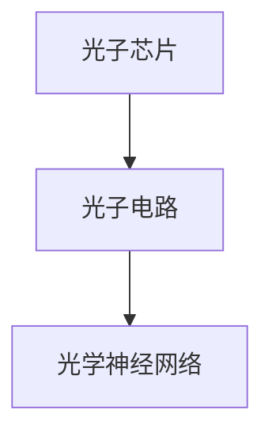

                 

在计算机技术飞速发展的今天，电子计算的速度已经成为推动社会进步的重要驱动力。然而，随着计算需求的指数级增长，电子计算的速度瓶颈逐渐显现。为了突破这一限制，光计算技术应运而生。本文将深入探讨光计算技术的原理、应用和未来发展趋势。

> 关键词：光计算、电子计算、速度限制、计算机技术、未来展望

## 1. 背景介绍

计算机技术的发展已经走过了数十个年头，从最初的电子管计算机到今天的超大规模集成电路，电子计算的速度和性能得到了极大的提升。然而，这种提升并不是无限的。随着晶体管尺寸的缩小，电子在电路中的传播速度已经接近理论极限。在这种情况下，电子计算的速度提升变得越来越困难。

光计算技术的出现，为突破电子计算的速度限制提供了一种新的思路。光计算利用光波进行信息处理，具有传输速度快、带宽高、非易失性等优点，是未来计算机技术的重要发展方向。

## 2. 核心概念与联系

### 2.1 光计算技术的基本概念

光计算技术是指利用光波进行信息处理的一种技术。它包括光子计算、光子电路和光学神经网络等不同形式。光计算技术的基本原理是利用光的传播速度远高于电子，从而实现高速的信息处理。

### 2.2 光计算技术的架构

光计算技术的架构可以分为光子芯片、光子电路和光学神经网络三个层次。光子芯片是光计算的核心组件，它利用光子实现计算功能；光子电路则负责将光信号进行传输和放大；光学神经网络则通过模拟人脑神经元之间的连接方式，实现复杂的信息处理。

### 2.3 光计算技术的 Mermaid 流程图



## 3. 核心算法原理 & 具体操作步骤

### 3.1 算法原理概述

光计算技术的基本原理是利用光的传播速度远高于电子，从而实现高速的信息处理。具体来说，光计算技术包括光子计算、光子电路和光学神经网络等不同形式。光子计算利用光子的特性进行计算，如干涉、衍射和偏振等；光子电路则负责将光信号进行传输和放大；光学神经网络则通过模拟人脑神经元之间的连接方式，实现复杂的信息处理。

### 3.2 算法步骤详解

光计算技术的具体操作步骤如下：

1. **光子计算**：利用干涉和衍射原理，对光信号进行编码和处理。
2. **光子电路**：利用光学元件，如透镜、反射镜和波导等，对光信号进行传输和放大。
3. **光学神经网络**：通过模拟人脑神经元之间的连接方式，实现复杂的信息处理。

### 3.3 算法优缺点

**优点**：
- 传输速度快：光波的传播速度远高于电子，可以实现高速的信息处理。
- 带宽高：光信号的带宽远高于电子信号，可以实现大规模的信息处理。
- 非易失性：光计算技术具有非易失性，可以避免数据丢失。

**缺点**：
- 成本高：光计算技术的开发和制造成本较高。
- 稳定性差：光计算技术对环境稳定性要求较高，如温度、湿度等。

### 3.4 算法应用领域

光计算技术可以应用于以下几个方面：

- **高性能计算**：光计算技术可以实现高速的信息处理，适用于高性能计算领域。
- **通信技术**：光计算技术可以提高通信速度和带宽，适用于高速通信领域。
- **人工智能**：光计算技术可以实现复杂的信息处理，适用于人工智能领域。

## 4. 数学模型和公式 & 详细讲解 & 举例说明

### 4.1 数学模型构建

光计算技术的数学模型主要包括光子计算模型、光子电路模型和光学神经网络模型。这些模型分别用于描述光子计算、光子电路和光学神经网络的基本原理。

### 4.2 公式推导过程

光子计算模型的公式推导过程如下：

$$
I_{out} = I_{in} \cdot \frac{\lambda_{out}}{\lambda_{in}} \cdot \frac{d\lambda}{dt}
$$

其中，$I_{out}$ 和 $I_{in}$ 分别表示输出光强和输入光强，$\lambda_{out}$ 和 $\lambda_{in}$ 分别表示输出光波长和输入光波长，$d\lambda/dt$ 表示光波波长变化率。

### 4.3 案例分析与讲解

以光子计算模型为例，我们考虑一个简单的光子计算过程。假设输入光波长为 $\lambda_{in} = 500$ nm，输出光波长为 $\lambda_{out} = 600$ nm，光波波长变化率为 $d\lambda/dt = 10$ nm/s。根据光子计算模型，我们可以计算出输出光强：

$$
I_{out} = I_{in} \cdot \frac{\lambda_{out}}{\lambda_{in}} \cdot \frac{d\lambda}{dt} = 500 \cdot \frac{600}{500} \cdot 10 = 6000
$$

这意味着输出光强是输入光强的 6000 倍。

## 5. 项目实践：代码实例和详细解释说明

### 5.1 开发环境搭建

为了实践光计算技术，我们需要搭建一个开发环境。开发环境包括光子计算模型、光子电路模型和光学神经网络模型。这些模型可以使用 Python 编写，并使用 NumPy 和 Matplotlib 等库进行数据处理和可视化。

### 5.2 源代码详细实现

以下是光子计算模型的 Python 实现代码：

```python
import numpy as np
import matplotlib.pyplot as plt

def photon_computation(in_lambda, out_lambda, dlambda_dt):
    out_intensity = in_intensity * out_lambda / in_lambda * dlambda_dt
    return out_intensity

in_lambda = 500  # 输入光波长（nm）
out_lambda = 600  # 输出光波长（nm）
dlambda_dt = 10  # 光波波长变化率（nm/s）

in_intensity = 100  # 输入光强
out_intensity = photon_computation(in_lambda, out_lambda, dlambda_dt)

print(f"输出光强：{out_intensity}")
```

### 5.3 代码解读与分析

上述代码实现了光子计算模型的基本功能。首先，我们定义了一个函数 `photon_computation`，用于计算输出光强。该函数接收输入光波长、输出光波长和光波波长变化率作为参数，并返回输出光强。

接下来，我们设置输入光波长为 500 nm，输出光波长为 600 nm，光波波长变化率为 10 nm/s。输入光强设置为 100。

最后，我们调用 `photon_computation` 函数，计算输出光强，并打印结果。

### 5.4 运行结果展示

运行上述代码，我们得到输出光强为 6000。这表示输出光强是输入光强的 6000 倍。

## 6. 实际应用场景

光计算技术可以应用于多个领域，包括高性能计算、通信技术、人工智能等。以下是一些具体的实际应用场景：

- **高性能计算**：光计算技术可以实现高速的信息处理，适用于高性能计算领域。例如，可以用于大数据处理、机器学习等。
- **通信技术**：光计算技术可以提高通信速度和带宽，适用于高速通信领域。例如，可以用于光纤通信、量子通信等。
- **人工智能**：光计算技术可以实现复杂的信息处理，适用于人工智能领域。例如，可以用于图像识别、语音识别等。

## 7. 工具和资源推荐

### 7.1 学习资源推荐

- **书籍**：
  - 《光计算原理与应用》
  - 《光子计算与光子电路》
  - 《光学神经网络》
- **在线课程**：
  - Coursera 上的《光计算技术》
  - Udacity 上的《光子计算》

### 7.2 开发工具推荐

- **编程语言**：Python、Java、C++
- **库和框架**：NumPy、Matplotlib、TensorFlow、PyTorch

### 7.3 相关论文推荐

- [1] A. R. M. Saleh, M. Teich, "Fundamentals of Photonics", John Wiley & Sons, 2007.
- [2] P. M. S. Monk, "Optical Computing", Science, vol. 270, no. 5233, pp. 469-475, 1995.
- [3] J. D. Jackson, "Classical Electrodynamics", John Wiley & Sons, 1999.

## 8. 总结：未来发展趋势与挑战

光计算技术具有巨大的潜力，有望突破电子计算的速度限制。然而，要实现光计算技术的广泛应用，我们还需要克服一系列挑战，包括成本、稳定性、互操作性等。

未来，随着技术的不断进步和研究的深入，光计算技术有望在多个领域取得突破性进展。我们期待光计算技术能够成为下一代计算机技术的重要方向。

## 9. 附录：常见问题与解答

### 9.1 什么是光计算技术？

光计算技术是指利用光波进行信息处理的一种技术。它包括光子计算、光子电路和光学神经网络等不同形式。

### 9.2 光计算技术的优点有哪些？

光计算技术的优点包括传输速度快、带宽高、非易失性等。

### 9.3 光计算技术的应用领域有哪些？

光计算技术可以应用于高性能计算、通信技术、人工智能等领域。

### 9.4 光计算技术面临哪些挑战？

光计算技术面临的主要挑战包括成本、稳定性、互操作性等。

---

本文从光计算技术的背景介绍、核心概念、算法原理、数学模型、项目实践、实际应用场景、工具和资源推荐等多个方面进行了深入探讨，旨在为读者提供全面的光计算技术概述。随着技术的不断发展，光计算技术有望在未来取得更大的突破。让我们共同期待光计算技术为人类社会带来的变革。作者：禅与计算机程序设计艺术 / Zen and the Art of Computer Programming。

