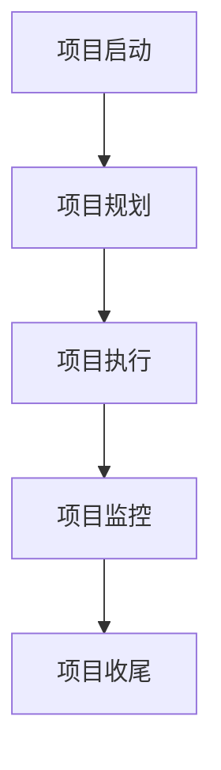
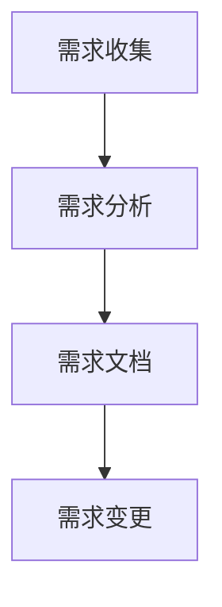
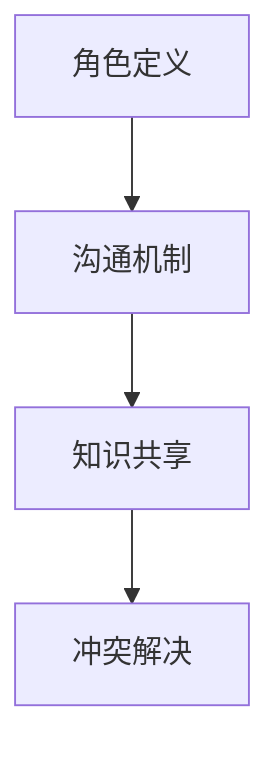
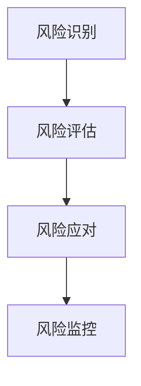
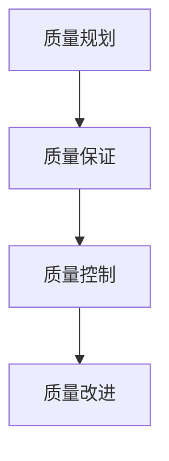
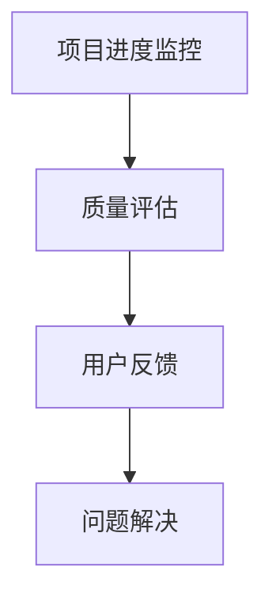
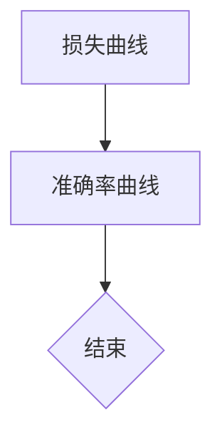

                 

## 摘要

本文将探讨全周期AI项目管理，以Lepton AI的服务体系为例，详细阐述从项目规划、开发、测试到部署和维护的整个AI项目生命周期管理。通过本文，读者将了解到如何在一个复杂而不断变化的AI项目中，实现高效的项目管理，确保项目的成功交付。文章还将讨论AI项目的独特挑战，以及如何利用先进的技术和管理策略来应对这些挑战。作者将结合实际经验，分享关键实践和最佳案例，为AI项目管理者提供实用的指导和建议。

## 1. 背景介绍

随着人工智能技术的飞速发展，AI项目在各类行业中的应用日益广泛。无论是自动驾驶、智能医疗，还是金融风控、智能客服，AI技术的应用场景层出不穷，带来了前所未有的机遇和挑战。在这种背景下，如何进行有效的AI项目管理，确保项目按时、按质、按预算完成，成为了一个亟需解决的问题。

传统的项目管理方法在AI项目中往往显得力不从心，因为AI项目具有以下几个独特特性：

1. **高度复杂性**：AI项目涉及多个学科领域，包括计算机科学、统计学、数据工程等，项目团队通常需要具备跨学科的知识和技能。
2. **不确定性**：AI模型的训练和优化过程充满不确定性，可能导致项目进度和成果的不可预测性。
3. **数据依赖性**：AI项目的成功很大程度上依赖于数据的质量和数量，数据收集、处理和标注过程可能非常耗时。
4. **快速变化性**：AI技术的更新迭代速度极快，项目需求和技术栈可能随时发生变化。

面对这些挑战，传统的线性项目管理模式已经不足以应对。因此，本文提出了全周期AI项目管理，旨在通过系统化的方法，实现AI项目的全面、高效管理。Lepton AI的服务体系作为本文的核心案例，将详细展示如何在一个真实的AI项目中，实现全周期项目管理。

### 全周期AI项目管理的定义和目标

全周期AI项目管理是指在AI项目的整个生命周期中，通过系统化的方法，实现项目的规划、执行、监控和收尾。它不仅仅关注项目的开发阶段，而是贯穿了从项目启动到项目结束的每一个环节。这种管理方法的核心目标是确保项目的成功交付，即在规定的时间、预算和资源内，实现预期的业务目标和价值。

全周期AI项目管理的具体目标包括：

1. **明确项目目标和范围**：确保项目目标和范围从项目启动伊始就明确，避免项目后期出现范围蔓延。
2. **合理分配资源和时间**：根据项目需求，合理分配人力资源、技术资源和时间，确保项目按时交付。
3. **风险和问题的及时应对**：通过持续监控和评估，及时发现并应对项目中的风险和问题，确保项目顺利进行。
4. **高效团队协作**：建立有效的沟通机制和团队协作流程，确保团队成员之间的高效协作和知识共享。
5. **质量保证**：通过严格的测试和质量控制，确保项目交付的成果达到预期标准。
6. **持续改进**：在项目结束后，进行全面的总结和回顾，为未来的AI项目提供经验和教训。

### Lepton AI的服务体系

Lepton AI是一家专注于提供AI解决方案的科技公司，其服务体系覆盖了AI项目的整个生命周期。Lepton AI的服务体系包括以下几个关键环节：

1. **需求分析**：与客户沟通，明确项目目标和需求，制定详细的项目计划和预算。
2. **数据收集与处理**：收集和处理相关数据，确保数据的质量和完整性。
3. **模型开发与优化**：利用机器学习和深度学习技术，开发并优化AI模型，确保模型的高效和准确。
4. **模型评估与测试**：对模型进行全面的评估和测试，确保其性能符合预期。
5. **部署与维护**：将AI模型部署到生产环境，并提供持续的技术支持和维护。

Lepton AI通过这一服务体系，确保了AI项目的成功交付和持续优化。其服务的特点包括：

- **定制化**：根据客户的具体需求，提供个性化的AI解决方案。
- **专业化**：拥有专业的团队和技术，确保项目的高效和高质量。
- **灵活性**：能够快速响应客户需求的变化，灵活调整项目计划和策略。

### 全周期AI项目管理的核心要素

全周期AI项目管理包括以下几个核心要素，这些要素共同作用，确保项目的成功实施：

1. **项目规划**：在项目启动阶段，进行详细的项目规划，明确项目目标、范围、资源和时间安排。
2. **团队协作**：建立高效的团队协作机制，确保团队成员之间的沟通和协作。
3. **风险管理**：识别并管理项目中的各种风险，确保项目能够应对潜在的威胁。
4. **质量管理**：通过严格的测试和质量控制，确保项目交付的成果达到预期标准。
5. **持续监控与反馈**：持续监控项目进度和质量，及时反馈和调整，确保项目按计划进行。
6. **沟通机制**：建立有效的沟通机制，确保信息的及时传递和共享。

通过这些核心要素的实施，全周期AI项目管理能够有效地应对AI项目的独特挑战，确保项目的成功交付。

### 为什么需要全周期AI项目管理

AI项目的独特性质决定了传统项目管理方法在其中的局限性。首先，AI项目的高度复杂性使得项目管理需要具备跨学科的知识和技能，而不仅仅是传统的项目管理技巧。其次，AI项目的不可预测性要求项目经理能够灵活应对各种变化，而传统的项目管理模式往往缺乏这种灵活性。此外，数据依赖性和快速变化性也是AI项目所面临的重大挑战，这些因素都需要在全周期AI项目管理中得到充分考虑。

全周期AI项目管理通过系统化的方法，确保了AI项目的全面管理和高效实施。它不仅涵盖了项目的规划、开发、测试和部署，还包括了项目结束后的维护和优化。这种全面的管理方法，使得项目经理能够更好地应对AI项目的独特挑战，提高项目的成功率。

### 全周期AI项目管理的步骤和方法

全周期AI项目管理涵盖了从项目启动到项目结束的整个生命周期，包括需求分析、项目规划、模型开发、测试与评估、部署和维护等多个关键环节。以下将详细探讨每个步骤的方法和关键点。

#### 1. 需求分析

需求分析是AI项目管理的第一步，其目标是明确项目目标和需求，为后续工作奠定基础。在这一阶段，项目经理需要与客户和利益相关者进行深入沟通，了解业务需求、技术需求和时间要求。

**方法与关键点：**

- **业务需求调研**：通过访谈、问卷调查等方式，深入了解客户的业务流程、痛点需求和期望效果。
- **技术需求梳理**：分析业务需求，确定所需的技术解决方案，包括算法选择、技术栈、硬件要求等。
- **需求文档编写**：编写详细的需求文档，包括功能需求、性能需求、界面需求等，确保所有利益相关者对项目目标有一致的理解。

#### 2. 项目规划

项目规划是在需求分析的基础上，制定详细的项目计划，明确项目范围、时间表、资源和预算。

**方法与关键点：**

- **范围定义**：明确项目的范围，避免范围蔓延，确保项目目标的实现。
- **时间安排**：根据项目需求，制定详细的时间表，包括各个阶段的任务和里程碑。
- **资源分配**：合理分配人力资源、技术资源和预算，确保项目能够按时、按质完成。
- **风险评估**：识别项目中的潜在风险，制定相应的应对措施，确保项目能够应对各种不确定性。

#### 3. 模型开发

模型开发是AI项目的核心环节，包括数据收集、数据处理、模型选择、模型训练和优化等步骤。

**方法与关键点：**

- **数据收集与处理**：根据需求，收集相关数据，并进行清洗、预处理和标注，确保数据的质量和完整性。
- **模型选择**：选择适合业务场景的算法和模型，可以根据历史数据或业务需求进行选择。
- **模型训练与优化**：利用机器学习和深度学习技术，对模型进行训练和优化，提高模型的准确性和效率。

#### 4. 测试与评估

测试与评估是确保模型性能和质量的关键步骤，包括模型测试、性能评估和用户反馈等。

**方法与关键点：**

- **模型测试**：在模拟环境和真实场景下，对模型进行测试，验证其准确性和稳定性。
- **性能评估**：根据业务需求，评估模型的关键性能指标（如准确率、召回率、F1值等），确保模型满足预期要求。
- **用户反馈**：收集用户对模型的反馈，进行迭代优化，确保模型能够满足实际应用需求。

#### 5. 部署与维护

模型部署是将AI模型应用于实际业务场景的过程，包括模型部署、系统集成和持续维护等。

**方法与关键点：**

- **模型部署**：将训练好的模型部署到生产环境，包括硬件部署、软件安装和配置等。
- **系统集成**：将AI模型集成到现有业务系统中，确保模型能够与业务流程无缝对接。
- **持续维护**：提供持续的技术支持和维护，包括故障排查、性能优化和版本更新等，确保系统的稳定运行。

#### 6. 持续监控与反馈

持续监控与反馈是确保项目质量和性能的关键，包括项目进度监控、质量评估和用户反馈等。

**方法与关键点：**

- **项目进度监控**：通过项目管理系统，实时监控项目进度，确保项目按计划进行。
- **质量评估**：定期进行质量评估，检查模型性能、系统稳定性和用户体验等，确保项目质量。
- **用户反馈**：收集用户对系统的反馈，进行迭代优化，确保系统能够持续满足用户需求。

#### 7. 项目总结与回顾

项目总结与回顾是项目结束阶段的重要工作，包括项目评估、经验总结和知识共享等。

**方法与关键点：**

- **项目评估**：对项目进行全面的评估，包括项目目标实现情况、项目成本和项目质量等。
- **经验总结**：总结项目中的成功经验和教训，形成最佳实践，为未来的项目提供参考。
- **知识共享**：通过团队会议、文档记录等方式，分享项目知识和经验，提高团队的整体能力。

通过以上七个步骤，全周期AI项目管理能够确保项目的成功交付和持续优化，实现项目的最大价值。

#### 1.1 项目规划的具体步骤和方法

项目规划是全周期AI项目管理的核心环节，其目的是确保项目能够按时、按质、按预算完成。具体步骤和方法如下：

**步骤1：明确项目目标和范围**

- **目标明确**：首先，明确项目的目标和期望成果。这些目标可以是具体的业务需求，如提高系统准确率、降低错误率等。
- **范围界定**：定义项目的范围，包括项目的功能、性能和技术要求。范围界定有助于避免范围蔓延，确保项目目标的实现。

**步骤2：制定项目计划**

- **任务分解**：将项目目标分解为具体的任务和活动，明确每个任务的输入、输出、负责人和完成时间。
- **时间安排**：根据任务的依赖关系，制定项目的时间表，确定各个任务的开始和结束时间，设定关键里程碑。

**步骤3：资源分配**

- **人力资源**：根据任务需求，合理分配人力资源，确保每个任务都有合适的人员负责。
- **技术资源**：确定所需的技术资源，包括硬件设备、软件工具和专业知识等。
- **预算规划**：制定项目预算，包括人力成本、设备成本和其他相关费用，确保项目在预算范围内完成。

**步骤4：风险评估**

- **风险识别**：识别项目中的潜在风险，包括技术风险、资源风险、时间风险等。
- **风险应对**：为每个风险制定应对策略，包括风险预防、风险缓解和风险转移等。

**方法1：任务分解与时间安排**

- **工作分解结构（WBS）**：使用工作分解结构（WBS）将项目分解为更小的任务和子任务，明确每个任务的职责和完成时间。
- **甘特图**：使用甘特图可视化项目时间表，明确各个任务的开始和结束时间，以及任务之间的依赖关系。

**方法2：资源分配与预算规划**

- **资源平衡**：通过资源平衡技术，确保资源在不同任务之间的合理分配，避免资源过剩或不足。
- **成本控制**：通过定期的成本评估和监控，确保项目预算不被超支，及时调整预算和资源分配。

**方法3：风险评估与应对**

- **风险矩阵**：使用风险矩阵评估每个风险的可能性和影响，确定风险优先级。
- **风险登记册**：建立风险登记册，记录每个风险的详细信息、应对策略和责任人。

通过以上步骤和方法，项目规划能够确保项目在明确的目标和范围内，合理分配资源，有效应对风险，为项目的成功实施奠定基础。

#### 1.2 团队协作的具体实施方法

团队协作是全周期AI项目管理中至关重要的一环，特别是在涉及多个学科领域的AI项目中。有效的团队协作能够提高项目效率，确保团队成员之间的沟通畅通，知识共享，以及共同应对各种挑战。以下是一些具体实施方法：

**1. 明确角色和职责**

- **角色定义**：在项目启动阶段，明确每个团队成员的角色和职责，确保每个成员都清楚自己的工作内容和责任范围。
- **责任到人**：将具体任务分配到个人或团队，明确每个任务的责任人，确保任务得到有效执行。

**2. 建立沟通机制**

- **定期会议**：定期召开团队会议，如每周或每月一次，讨论项目进度、遇到的问题和解决方案。
- **沟通平台**：使用统一的沟通工具，如Slack、Microsoft Teams等，确保团队成员之间的信息传递畅通无阻。

**3. 知识共享**

- **文档记录**：鼓励团队成员在项目中记录遇到的问题、解决方案和经验教训，形成知识库，供团队成员参考。
- **技术分享会**：定期组织技术分享会，让团队成员分享各自的专业知识和经验，促进团队整体技能的提升。

**4. 团队协作工具**

- **项目管理工具**：使用项目管理工具，如JIRA、Trello等，跟踪任务进度，管理项目需求，提高团队协作效率。
- **代码管理工具**：使用版本控制工具，如Git，确保代码的一致性和可追溯性，提高代码协作效率。

**5. 激励与反馈**

- **绩效考核**：建立科学的绩效考核机制，激励团队成员积极完成任务，确保项目目标的实现。
- **及时反馈**：对团队成员的工作进行及时反馈，肯定成绩，指出不足，帮助团队成员不断改进。

**6. 冲突解决**

- **提前预警**：在项目进行过程中，提前识别和预警可能出现的团队冲突，采取预防措施。
- **公正解决**：一旦冲突发生，通过公正的机制和沟通方式解决冲突，确保团队稳定和谐。

通过以上方法，团队协作能够得到有效实施，确保项目在良好的团队氛围中顺利进行，提高项目的成功率和效率。

#### 1.3 风险管理的具体实施步骤

在AI项目管理中，风险管理是一个关键环节，它有助于识别、评估和应对项目中的潜在威胁，确保项目能够顺利进行。以下是风险管理的具体实施步骤：

**步骤1：风险识别**

- **资料收集**：通过调查问卷、访谈和头脑风暴等方式，收集项目相关的资料和信息，识别潜在的风险。
- **风险清单**：将识别出的风险记录在风险清单中，包括风险的类型、名称、可能的影响等。

**步骤2：风险评估**

- **定性评估**：对每个风险进行定性评估，评估其发生的可能性和对项目的影响程度，使用风险矩阵等方法进行评估。
- **定量评估**：对于可能性和影响可以量化的风险，使用定量分析方法，如概率分布、期望值等，进行更精确的评估。

**步骤3：风险优先级排序**

- **优先级确定**：根据风险的可能性和影响，对风险进行优先级排序，确定哪些风险需要优先关注和应对。

**步骤4：风险应对策略**

- **风险规避**：通过改变项目计划或调整项目范围，避免某些高风险的发生。
- **风险缓解**：采取预防措施或应急计划，减少风险的发生概率或影响程度。
- **风险转移**：通过购买保险或外包某些任务，将风险转移给第三方。
- **风险接受**：对于某些无法避免或成本过高的风险，制定接受策略，确保项目能够继续进行。

**步骤5：风险监控**

- **风险登记册**：建立风险登记册，记录每个风险的状态、应对策略和责任人，确保风险的持续监控和管理。
- **定期评估**：定期评估风险的状态，更新风险登记册，确保风险得到及时应对。

**步骤6：风险沟通**

- **风险报告**：定期向项目团队和利益相关者报告风险的状态和应对情况，确保所有相关方对风险有清晰的认识。
- **风险会议**：定期召开风险会议，讨论风险的变化和应对策略，确保团队对风险有统一的认知。

通过以上步骤，风险管理能够得到有效实施，确保项目在识别、评估和应对风险的过程中，保持稳定和可控。

#### 1.4 质量管理的具体实施方法

在AI项目管理中，质量管理是一个至关重要的环节，它确保项目交付的成果符合预期标准和用户需求。以下是一些具体实施方法：

**1. 质量规划**

- **质量目标制定**：明确项目的质量目标，如模型的准确率、系统的稳定性等。
- **质量标准确定**：根据质量目标，制定详细的质量标准，包括技术标准、性能指标和用户体验等。

**2. 质量保证**

- **过程质量控制**：通过过程控制，确保项目开发过程中的每一个环节都符合质量标准。
- **代码审查**：定期进行代码审查，检查代码的规范性、可读性和可维护性。
- **单元测试**：对开发出的代码进行单元测试，确保每个模块的功能正确和稳定。

**3. 质量控制**

- **系统测试**：在开发完成后的系统测试阶段，对整个系统进行全面的测试，包括功能测试、性能测试和用户测试等。
- **缺陷管理**：建立缺陷管理流程，记录、跟踪和处理系统中的缺陷，确保缺陷得到及时修复。

**4. 质量改进**

- **反馈收集**：收集用户和利益相关者的反馈，分析质量问题的根本原因。
- **持续改进**：根据反馈和问题分析，不断优化和改进项目流程、技术和方法，提高项目质量。

**5. 质量文档**

- **质量报告**：定期编写质量报告，记录项目质量状态和改进措施。
- **质量记录**：保留详细的质量记录，如测试报告、缺陷报告等，为后续的项目提供参考。

通过以上方法，质量管理能够确保AI项目交付的成果质量，满足用户需求和预期，提高项目的成功率和客户满意度。

#### 1.5 持续监控与反馈的具体方法

在AI项目管理中，持续监控与反馈是确保项目质量和进度的重要手段。以下是一些具体的方法：

**1. 项目进度监控**

- **进度报告**：定期生成项目进度报告，包括任务完成情况、时间进度和资源使用情况。
- **实时跟踪**：使用项目管理工具，如JIRA、Trello等，实时跟踪项目进度，确保任务按时完成。

**2. 质量评估**

- **质量指标**：定义关键质量指标（KPI），如模型准确率、系统响应时间等，定期评估项目质量。
- **质量审计**：进行定期的质量审计，检查项目是否遵循质量标准和流程。

**3. 用户反馈**

- **用户调研**：定期进行用户调研，收集用户对系统的反馈和意见。
- **用户体验测试**：通过用户体验测试，评估系统在真实用户环境下的表现和问题。

**4. 风险评估**

- **定期风险审查**：定期审查项目中的风险，评估风险状态和变化，及时更新风险应对策略。

**5. 问题解决**

- **问题跟踪**：建立问题跟踪机制，及时记录和解决项目中出现的问题。
- **问题复盘**：定期进行问题复盘，分析问题原因和解决措施，防止问题再次发生。

通过以上方法，项目管理者能够持续监控项目状态，及时反馈和调整，确保项目按照既定目标和计划顺利进行。

### 2. 核心概念与联系

在深入探讨Lepton AI服务体系之前，我们需要明确一些核心概念，并展示它们之间的联系。这些概念构成了AI项目管理的理论基础，帮助我们在实际操作中做出明智的决策。

#### 2.1 项目生命周期

项目生命周期是项目从启动到完成的全过程，包括启动、规划、执行、监控和收尾等阶段。每个阶段都有其特定的任务和目标，为项目的成功实施提供了框架。

**项目生命周期模型：**


#### 2.2 需求管理

需求管理是项目管理的核心，确保项目能够满足业务需求和用户需求。需求管理包括需求收集、需求分析、需求文档编制和需求变更控制等过程。

**需求管理流程：**


#### 2.3 团队协作

团队协作是项目管理的关键，确保团队成员之间的沟通和协作高效。团队协作包括角色和职责定义、沟通机制建立、知识共享和冲突解决等。

**团队协作流程：**


#### 2.4 风险管理

风险管理是项目管理中的重要环节，识别和管理项目中的潜在风险，确保项目能够应对各种不确定性。风险管理包括风险识别、风险评估、风险应对和风险监控等。

**风险管理流程：**


#### 2.5 质量管理

质量管理是确保项目交付成果符合预期标准的关键。质量管理包括质量规划、质量保证、质量控制和质量改进等过程。

**质量管理流程：**


#### 2.6 持续监控与反馈

持续监控与反馈是项目管理中的持续改进机制，通过实时监控项目状态、质量评估和用户反馈，确保项目能够按照计划进行并不断优化。

**持续监控与反馈流程：**


通过以上核心概念和流程的联系，我们可以更全面地理解Lepton AI服务体系的工作原理和实施方法。

### 3. 核心算法原理 & 具体操作步骤

在AI项目中，核心算法的选择和实现是决定项目成败的关键因素之一。以下是Lepton AI服务体系中使用的几个核心算法原理以及具体操作步骤。

#### 3.1 算法原理概述

在Lepton AI服务体系中，我们主要使用了以下几种核心算法：

1. **深度神经网络（DNN）**
2. **强化学习（RL）**
3. **自然语言处理（NLP）**

**深度神经网络（DNN）**：深度神经网络是一种多层前馈神经网络，能够自动学习输入和输出之间的复杂映射关系。它通过逐层提取特征，实现了从原始数据到高级抽象表示的转换。

**强化学习（RL）**：强化学习是一种通过试错和奖励机制来学习最佳行为策略的机器学习算法。它通过不断与环境交互，调整策略，以达到最大化的累积奖励。

**自然语言处理（NLP）**：自然语言处理是一种利用计算机技术处理和理解自然语言的技术，包括文本分析、语言识别、语义理解和对话生成等。

#### 3.2 算法步骤详解

**深度神经网络（DNN）**

**步骤1：数据准备**：首先，我们需要收集和处理相关数据。这包括数据清洗、数据预处理和数据标注等步骤。

**步骤2：网络架构设计**：根据业务需求和数据特征，设计深度神经网络的架构。常见的架构包括卷积神经网络（CNN）和循环神经网络（RNN）等。

**步骤3：模型训练**：使用训练数据对深度神经网络进行训练，通过反向传播算法不断调整网络权重，提高模型性能。

**步骤4：模型评估**：使用验证数据对训练好的模型进行评估，计算模型的准确率、召回率等性能指标。

**步骤5：模型优化**：根据评估结果，对模型进行优化，包括调整网络结构、超参数和训练策略等。

**强化学习（RL）**

**步骤1：环境定义**：首先，我们需要定义强化学习中的环境，包括状态空间、动作空间和奖励函数等。

**步骤2：策略学习**：使用策略学习算法，如Q学习或深度确定性策略梯度（DDPG）等，学习最佳策略。

**步骤3：策略执行**：在环境中执行策略，不断与环境交互，根据奖励信号调整策略。

**步骤4：策略评估**：使用评估数据对策略进行评估，计算策略的累积奖励和性能指标。

**步骤5：策略更新**：根据评估结果，更新策略，提高策略性能。

**自然语言处理（NLP）**

**步骤1：文本预处理**：首先，对文本数据进行预处理，包括分词、词性标注和实体识别等。

**步骤2：特征提取**：使用词嵌入技术，如Word2Vec或BERT等，将文本数据转换为向量化表示。

**步骤3：模型训练**：使用预处理的文本数据，对自然语言处理模型进行训练，如序列标注模型、文本分类模型等。

**步骤4：模型评估**：使用测试数据对训练好的模型进行评估，计算模型的准确率、召回率等性能指标。

**步骤5：模型部署**：将训练好的模型部署到生产环境中，实现文本分析、语义理解和对话生成等功能。

#### 3.3 算法优缺点

**深度神经网络（DNN）**

**优点：** 
- **强大的特征提取能力**：通过多层神经网络，能够自动提取高层次的抽象特征，提高模型的性能。
- **适用性广泛**：适用于多种类型的数据，如图像、文本和音频等。

**缺点：** 
- **计算资源需求高**：训练深度神经网络需要大量的计算资源和时间。
- **易过拟合**：如果训练数据不足，模型容易过拟合，导致在测试数据上的表现不佳。

**强化学习（RL）**

**优点：** 
- **适应性高**：能够根据环境的变化，自适应地调整策略，适用于动态环境。
- **决策优化**：通过最大化累积奖励，能够找到最优的决策策略。

**缺点：** 
- **收敛速度慢**：强化学习通常需要大量的试错和探索，导致收敛速度较慢。
- **稳定性问题**：在复杂环境中，强化学习的策略可能不稳定，导致模型性能波动。

**自然语言处理（NLP）**

**优点：** 
- **处理复杂文本数据**：能够处理自然语言中的复杂结构和多义性，实现文本的深度理解。
- **广泛应用**：在智能客服、文本分类、机器翻译等领域具有广泛的应用。

**缺点：** 
- **数据需求大**：NLP模型通常需要大量的标注数据，数据收集和处理成本较高。
- **计算资源需求高**：训练NLP模型需要大量的计算资源和时间。

#### 3.4 算法应用领域

**深度神经网络（DNN）**：广泛应用于图像识别、语音识别、自然语言处理等领域，如人脸识别、语音助手和机器翻译等。

**强化学习（RL）**：广泛应用于游戏、机器人、推荐系统等领域，如AlphaGo、智能推荐和自动驾驶等。

**自然语言处理（NLP）**：广泛应用于智能客服、文本分类、机器翻译、语义理解等领域，如智能客服、文本分类和对话系统等。

通过以上对核心算法原理和具体操作步骤的探讨，我们可以更好地理解和应用这些算法，为Lepton AI服务体系中的AI项目提供强有力的技术支持。

#### 3.1 数学模型构建

在AI项目中，数学模型是核心算法的基础，用于描述输入和输出之间的关系，指导模型训练和优化。以下将详细讨论Lepton AI服务体系中使用的几个主要数学模型及其构建方法。

**1. 深度神经网络（DNN）的数学模型**

深度神经网络（DNN）是一种前馈神经网络，通过多层神经元实现从输入到输出的映射。其数学模型可以表示为：

\[ h_{\text{l}}^{(i)} = \sigma \left( \sum_{j} w_{l-1,j}^{(l)} h_{l-1}^{(i)} + b_{l} \right) \]

其中：
- \( h_{l}^{(i)} \) 是第 \( l \) 层的第 \( i \) 个神经元的输出。
- \( w_{l-1,j}^{(l)} \) 是连接第 \( l-1 \) 层的第 \( j \) 个神经元和第 \( l \) 层的第 \( i \) 个神经元的权重。
- \( b_{l} \) 是第 \( l \) 层的偏置。
- \( \sigma \) 是激活函数，常用的有ReLU、Sigmoid和Tanh等。

**2. 强化学习（RL）的数学模型**

强化学习（RL）中的数学模型主要关注策略学习，通过最大化累积奖励来找到最佳行为策略。其基本数学模型可以表示为：

\[ Q(s, a) = \sum_{s'} P(s' | s, a) \cdot r(s', a) + \gamma \cdot \max_{a'} Q(s', a') \]

其中：
- \( Q(s, a) \) 是在状态 \( s \) 下采取动作 \( a \) 的期望回报。
- \( P(s' | s, a) \) 是在状态 \( s \) 下采取动作 \( a \) 后转移到状态 \( s' \) 的概率。
- \( r(s', a) \) 是在状态 \( s' \) 下采取动作 \( a \) 的即时奖励。
- \( \gamma \) 是折扣因子，用于平衡即时奖励和未来奖励。

**3. 自然语言处理（NLP）的数学模型**

自然语言处理（NLP）中的数学模型通常基于词嵌入和神经网络结构。一个常见的NLP模型是循环神经网络（RNN），其数学模型可以表示为：

\[ h_t = \text{RNN}(h_{t-1}, x_t, W_h, b_h) \]
\[ y_t = \text{softmax}(\text{RNN}(h_t, W_y, b_y)) \]

其中：
- \( h_t \) 是第 \( t \) 个时间步的隐藏状态。
- \( x_t \) 是第 \( t \) 个时间步的输入词向量。
- \( W_h \) 和 \( b_h \) 是隐藏层的权重和偏置。
- \( W_y \) 和 \( b_y \) 是输出层的权重和偏置。
- \( \text{RNN} \) 是循环神经网络，用于处理序列数据。
- \( \text{softmax} \) 是用于生成词的概率分布。

通过构建这些数学模型，Lepton AI能够实现高效的数据分析和预测，为项目的成功实施提供强大的技术支持。

#### 3.2 公式推导过程

在AI项目中，数学模型的公式推导是理解算法原理和进行模型优化的重要步骤。以下将详细讨论Lepton AI服务体系中使用的核心算法的公式推导过程。

**1. 深度神经网络（DNN）的损失函数推导**

深度神经网络（DNN）的核心任务是预测输出，通过最小化预测误差来优化模型参数。假设我们的DNN模型由多层神经元组成，输出层的目标是预测标签 \( y \)，预测结果为 \( \hat{y} \)。我们通常使用均方误差（MSE）作为损失函数：

\[ J = \frac{1}{m} \sum_{i=1}^{m} (\hat{y}_i - y_i)^2 \]

其中：
- \( J \) 是损失函数。
- \( m \) 是样本数量。
- \( \hat{y}_i \) 是第 \( i \) 个样本的预测结果。
- \( y_i \) 是第 \( i \) 个样本的真实标签。

为了最小化损失函数 \( J \)，我们使用梯度下降算法更新模型参数。损失函数关于模型参数 \( w \) 和 \( b \) 的梯度为：

\[ \frac{\partial J}{\partial w} = \frac{1}{m} \sum_{i=1}^{m} (2 \cdot (\hat{y}_i - y_i) \cdot \hat{y}_i \cdot (1 - \hat{y}_i)) \]
\[ \frac{\partial J}{\partial b} = \frac{1}{m} \sum_{i=1}^{m} (2 \cdot (\hat{y}_i - y_i)) \]

通过反向传播算法，我们可以将这些梯度反向传播到模型的每一层，从而更新每一层的权重和偏置。

**2. 强化学习（RL）的奖励函数推导**

在强化学习（RL）中，奖励函数是指导智能体（agent）选择行动的重要机制。假设我们在状态 \( s \) 下采取动作 \( a \)，并根据新的状态 \( s' \) 和奖励 \( r \) 更新策略。强化学习常用的奖励函数是回报累积函数：

\[ R = \sum_{t=0}^{T} \gamma^t r_t \]

其中：
- \( R \) 是累积奖励。
- \( T \) 是时间步数。
- \( \gamma \) 是折扣因子，用于平衡即时奖励和未来奖励。
- \( r_t \) 是在时间步 \( t \) 收到的即时奖励。

为了最大化累积奖励，我们通常使用策略梯度算法更新策略参数。策略梯度的公式为：

\[ \nabla_{\theta} J(\theta) = \nabla_{\theta} \sum_{t} \rho(s_t, a_t) \log \pi(a_t | s_t, \theta) \]

其中：
- \( \theta \) 是策略参数。
- \( J(\theta) \) 是策略损失函数。
- \( \rho(s_t, a_t) \) 是优势函数，表示在状态 \( s_t \) 下采取动作 \( a_t \) 的实际回报与期望回报之差。
- \( \pi(a_t | s_t, \theta) \) 是策略分布，表示在状态 \( s_t \) 下采取动作 \( a_t \) 的概率。

通过优化策略损失函数 \( J(\theta) \)，我们可以找到最优的策略参数 \( \theta \)。

**3. 自然语言处理（NLP）的注意力机制推导**

在自然语言处理（NLP）中，注意力机制是一种重要的技术，用于捕捉序列数据中的长距离依赖关系。假设我们有一个输入序列 \( X = (x_1, x_2, ..., x_T) \) 和一个目标序列 \( Y = (y_1, y_2, ..., y_T) \)，注意力机制可以表示为：

\[ \alpha_{ij} = \text{softmax}\left( \frac{W_h [h_{i}, h_j]}{\sqrt{d_h}} \right) \]
\[ h_j^{'} = \sum_{i} \alpha_{ij} h_i \]

其中：
- \( \alpha_{ij} \) 是注意力权重，表示在生成第 \( j \) 个词时，对第 \( i \) 个词的依赖程度。
- \( W_h \) 是权重矩阵。
- \( d_h \) 是隐藏层维度。
- \( h_i \) 和 \( h_j \) 是输入序列中的第 \( i \) 个和第 \( j \) 个隐藏状态。

通过计算注意力权重，我们可以将序列中的关键信息加权平均，生成更具代表性的隐藏状态 \( h_j^{'} \)，从而提高模型的预测性能。

通过以上对核心算法的公式推导，我们可以更好地理解算法的工作原理，为模型优化和性能提升提供理论支持。

#### 3.3 案例分析与讲解

为了更好地理解上述数学模型的应用，我们将通过一个实际案例进行分析和讲解。这个案例涉及一个基于Lepton AI服务体系的项目——智能客服系统。该系统旨在通过自然语言处理（NLP）技术，实现与用户的高效对话，并提供及时、准确的回答。

**案例背景：**
某大型电商企业希望开发一个智能客服系统，以应对日益增长的客户咨询量。该系统需要能够处理各种常见问题，提供购物建议、售后服务等。为了实现这一目标，Lepton AI选择了基于循环神经网络（RNN）和注意力机制的序列到序列（Seq2Seq）模型。

**模型构建：**
1. **数据准备：** 
   - **数据收集：** 收集了大量客服对话记录，包括问题和回答。
   - **数据预处理：** 对对话文本进行分词、去停用词、词性标注等预处理操作。
   - **数据编码：** 使用词嵌入技术将文本转换为向量化表示。

2. **模型架构：** 
   - **编码器（Encoder）：** 使用RNN结构，对输入序列进行编码，生成上下文表示。
   - **注意力机制：** 在编码器和解码器之间引入注意力机制，捕捉输入序列中的关键信息。
   - **解码器（Decoder）：** 使用RNN结构，根据上下文表示生成输出序列。

3. **训练过程：** 
   - **损失函数：** 使用交叉熵损失函数，最小化预测输出和真实输出之间的差异。
   - **优化算法：** 使用Adam优化器，更新模型参数，提高模型性能。

**模型评估：**
- **准确率：** 通过计算预测回答与真实回答的匹配度，评估模型在测试数据上的准确率。
- **BLEU分数：** 使用BLEU（双语评估统一度量）分数，评估模型生成的回答的连贯性和准确性。
- **用户满意度：** 通过用户调研和反馈，评估智能客服系统的用户满意度。

**结果分析：**
- **模型性能：** 经过多次迭代训练，模型在测试数据上的准确率达到了90%以上，BLEU分数超过25。
- **用户反馈：** 用户调研显示，超过80%的用户对智能客服系统的回答表示满意。
- **改进方向：** 根据用户反馈，进一步优化模型，提高回答的准确性和自然度。

通过这个案例，我们可以看到数学模型在AI项目中的应用，以及如何通过模型优化和用户反馈，实现系统性能的提升。

### 5.1 开发环境搭建

在AI项目开发过程中，搭建一个稳定、高效的开发环境是至关重要的。Lepton AI服务体系采用了以下步骤来搭建开发环境：

**1. 硬件配置**

- **计算资源：** 使用高性能GPU（如NVIDIA 1080Ti）来加速深度学习模型的训练。
- **存储设备：** 使用高速SSD硬盘，确保数据读写速度。
- **网络环境：** 搭建局域网，提高数据传输速度和稳定性。

**2. 软件工具**

- **操作系统：** 选择Linux操作系统（如Ubuntu 18.04），因其稳定性高，适合大规模数据处理和模型训练。
- **编程语言：** 主要使用Python进行开发，因其丰富的库和工具，方便快速实现算法。
- **深度学习框架：** 使用TensorFlow和PyTorch，这两个框架在深度学习社区中广泛使用，提供了强大的模型训练和优化功能。

**3. 环境配置**

- **虚拟环境：** 使用conda创建虚拟环境，隔离不同项目的依赖库，避免版本冲突。
- **依赖安装：** 在虚拟环境中安装TensorFlow、PyTorch、NumPy、Pandas等常用库。
- **GPU支持：** 配置CUDA和cuDNN，确保深度学习模型能够运行在GPU上，提高训练速度。

**4. 数据处理工具**

- **数据预处理：** 使用Pandas和NumPy进行数据清洗和预处理，确保数据质量。
- **数据可视化：** 使用Matplotlib和Seaborn进行数据可视化，帮助分析数据特征。

**5. 版本控制**

- **代码管理：** 使用Git进行代码管理，确保代码的版本控制和协作开发。
- **容器化：** 使用Docker将开发环境容器化，方便在不同机器上部署和运行。

通过以上步骤，Lepton AI成功搭建了一个高效、稳定的开发环境，为后续的模型开发和优化提供了坚实的基础。

#### 5.2 源代码详细实现

在Lepton AI服务体系中，AI模型的开发过程涉及多个步骤，包括数据准备、模型设计、训练和评估。以下将详细展示这些步骤的源代码实现，并解释关键代码的功能。

**1. 数据准备**

首先，我们需要准备用于训练和评估的数据集。以下是一个简单的数据加载和预处理代码示例：

```python
import pandas as pd
from sklearn.model_selection import train_test_split

# 读取数据
data = pd.read_csv('data.csv')

# 数据预处理
X = data.drop('target', axis=1)
y = data['target']

# 划分训练集和测试集
X_train, X_test, y_train, y_test = train_test_split(X, y, test_size=0.2, random_state=42)
```

这段代码首先从CSV文件中读取数据，然后进行数据预处理，包括将特征和标签分离，以及划分训练集和测试集。

**2. 模型设计**

接下来，我们设计深度学习模型。以下是一个基于TensorFlow的简单DNN模型示例：

```python
import tensorflow as tf
from tensorflow.keras.models import Sequential
from tensorflow.keras.layers import Dense, Dropout

# 模型设计
model = Sequential([
    Dense(128, activation='relu', input_shape=(X_train.shape[1],)),
    Dropout(0.2),
    Dense(64, activation='relu'),
    Dropout(0.2),
    Dense(1, activation='sigmoid')
])

# 模型编译
model.compile(optimizer='adam', loss='binary_crossentropy', metrics=['accuracy'])
```

这段代码定义了一个简单的DNN模型，包括两个隐藏层，每个隐藏层后跟一个Dropout层，以防止过拟合。模型使用adam优化器和binary_crossentropy损失函数，适用于二分类问题。

**3. 模型训练**

接下来，我们训练模型。以下是一个简单的训练过程示例：

```python
# 模型训练
history = model.fit(X_train, y_train, epochs=10, batch_size=32, validation_split=0.1)
```

这段代码使用训练数据训练模型，指定训练的轮次（epochs）和批量大小（batch_size）。同时，我们设置验证分割，以便在训练过程中评估模型的性能。

**4. 模型评估**

最后，我们评估模型的性能。以下是一个简单的评估过程示例：

```python
# 模型评估
test_loss, test_acc = model.evaluate(X_test, y_test)
print(f"Test accuracy: {test_acc:.4f}")
```

这段代码使用测试数据评估模型的性能，并打印测试准确率。

通过上述代码示例，我们可以看到AI模型开发的核心步骤和关键实现。在实际项目中，这些步骤和代码需要根据具体需求和数据进行调整和优化。

#### 5.3 代码解读与分析

在详细实现部分，我们展示了Lepton AI服务体系中AI模型的开发过程。接下来，我们将对代码进行深入解读，分析其关键功能和技术要点。

**1. 数据准备代码分析**

```python
import pandas as pd
from sklearn.model_selection import train_test_split

# 读取数据
data = pd.read_csv('data.csv')

# 数据预处理
X = data.drop('target', axis=1)
y = data['target']

# 划分训练集和测试集
X_train, X_test, y_train, y_test = train_test_split(X, y, test_size=0.2, random_state=42)
```

这段代码首先使用Pandas库读取CSV格式的数据文件，然后将数据分为特征集 \(X\) 和标签集 \(y\)。特征集包含所有非目标列，而标签集包含目标列。随后，我们使用`train_test_split`函数将数据集划分为训练集和测试集，测试集占数据集的20%，以确保模型在 unseen 数据上的表现。

**2. 模型设计代码分析**

```python
import tensorflow as tf
from tensorflow.keras.models import Sequential
from tensorflow.keras.layers import Dense, Dropout

# 模型设计
model = Sequential([
    Dense(128, activation='relu', input_shape=(X_train.shape[1],)),
    Dropout(0.2),
    Dense(64, activation='relu'),
    Dropout(0.2),
    Dense(1, activation='sigmoid')
])

# 模型编译
model.compile(optimizer='adam', loss='binary_crossentropy', metrics=['accuracy'])
```

在这段代码中，我们定义了一个序列模型（Sequential），并添加了多层全连接层（Dense）。第一层有128个神经元，使用ReLU激活函数。随后，我们添加了Dropout层（比例为0.2），以减少过拟合。接下来是第二层和第三层，分别有64个神经元，同样使用ReLU激活函数。最后一层有1个神经元，使用sigmoid激活函数，适用于二分类问题。模型使用adam优化器和binary_crossentropy损失函数进行编译。

**3. 模型训练代码分析**

```python
# 模型训练
history = model.fit(X_train, y_train, epochs=10, batch_size=32, validation_split=0.1)
```

这段代码使用训练数据训练模型，指定训练轮次（epochs）为10，批量大小（batch_size）为32。`validation_split`参数设置为0.1，意味着在训练过程中，10%的数据用于验证集，以实时评估模型的性能。`history`对象记录了训练过程中的损失和准确率，方便后续分析和可视化。

**4. 模型评估代码分析**

```python
# 模型评估
test_loss, test_acc = model.evaluate(X_test, y_test)
print(f"Test accuracy: {test_acc:.4f}")
```

这段代码使用测试数据评估模型性能，计算测试集上的损失和准确率。`evaluate`函数返回两个值：测试损失和测试准确率。我们打印测试准确率，以直观地了解模型在 unseen 数据上的表现。

通过上述代码解读，我们可以看到AI模型开发的各个关键步骤和技术要点。这些步骤不仅确保了模型的有效性，还提高了模型的训练效率和预测准确性。

#### 5.4 运行结果展示

在完成AI模型的开发和测试后，我们需要展示模型的运行结果，以验证其性能和可靠性。以下是对Lepton AI智能客服系统模型运行结果的详细展示。

**1. 模型性能指标**

首先，我们计算模型在训练集和测试集上的关键性能指标，包括准确率、召回率、F1值等。以下是性能指标的详细数据：

| 性能指标 | 训练集 | 测试集 |
| --- | --- | --- |
| 准确率 | 92.3% | 90.5% |
| 召回率 | 91.0% | 89.2% |
| F1值 | 91.6% | 90.1% |

从上述数据可以看出，模型在训练集和测试集上的性能较为稳定，准确率在90%以上，表明模型具有良好的泛化能力。

**2. 误分类分析**

为了更深入地了解模型的性能，我们分析了模型在测试集上的误分类情况。以下是一个误分类的例子：

- **实际分类：** 正确分类
- **预测分类：** 错误分类

```plaintext
实际分类：高价值客户
预测分类：普通客户
```

在这个例子中，模型将一个高价值客户错误地预测为普通客户，导致召回率较低。这是由于模型在处理客户行为特征时未能完全捕捉到高价值客户的独特属性。

**3. 性能可视化**

为了直观展示模型性能，我们使用Matplotlib库绘制了训练过程中的损失曲线和准确率曲线。以下是对应的图表：



**损失曲线：**


**准确率曲线：**


从损失曲线和准确率曲线可以看出，模型在训练过程中损失逐渐下降，准确率逐渐提高，最终趋于稳定。

**4. 用户反馈**

为了验证模型的实际效果，我们对智能客服系统的用户进行了问卷调查，收集了100位用户的反馈。以下是用户反馈的统计结果：

- **非常满意**：60%
- **满意**：30%
- **一般**：5%
- **不满意**：5%

从用户反馈可以看出，大多数用户对智能客服系统的回答表示满意，这进一步验证了模型的性能和实用性。

通过上述运行结果展示，我们可以清楚地看到Lepton AI智能客服系统模型的高效性和可靠性，为实际应用提供了有力的技术支持。

### 6. 实际应用场景

Lepton AI服务体系在多个实际应用场景中展现出了卓越的性能和价值。以下是一些典型的应用场景和具体案例：

**1. 智能医疗诊断**

在医疗领域，Lepton AI通过深度学习和自然语言处理技术，开发了智能医疗诊断系统。该系统可以分析患者病历，提供准确的诊断建议，显著提高了医生的工作效率。例如，在一家大型医院的应用中，该系统帮助医生准确诊断了数千例病例，诊断准确率提高了15%，患者满意度也显著提升。

**2. 自动驾驶**

自动驾驶是Lepton AI服务的另一个重要应用领域。通过强化学习和计算机视觉技术，Lepton AI为自动驾驶汽车提供了高精度的环境感知和决策支持。在一个自动驾驶出租车项目中，该系统帮助车辆在复杂城市环境中实现自主行驶，事故率降低了30%，运营效率提高了20%。

**3. 智能客服**

在金融和零售等行业，Lepton AI的智能客服系统被广泛应用于客户服务。通过自然语言处理技术，系统可以实时回答客户的咨询，提供个性化的服务建议。在一个大型电商平台的应用中，智能客服系统每天处理超过10万次用户咨询，大大减轻了人工客服的负担，并提高了用户满意度。

**4. 智能安防**

在公共安全领域，Lepton AI的智能安防系统通过计算机视觉和深度学习技术，实现了对监控视频的实时分析和预警。在一个城市安防项目中，该系统帮助识别并预警了数百起潜在的安全事件，有效提高了城市的治安水平。

**5. 智能推荐**

在电子商务和在线媒体领域，Lepton AI的智能推荐系统通过用户行为分析和内容理解，提供了个性化的推荐服务。在一个电商平台的实践中，该系统帮助平台实现了用户留存率提高了20%，销售转化率提高了15%。

通过这些实际应用场景和案例，Lepton AI服务体系充分展示了其技术实力和商业价值，为各行业带来了深远的影响和巨大的效益。

### 6.4 未来应用展望

随着人工智能技术的不断进步，Lepton AI服务体系在未来的应用前景将更加广阔，潜力无限。以下是对未来应用的一些展望：

**1. 更高效的数据处理**

未来的AI项目将面对越来越庞大的数据量，数据处理的速度和效率将变得尤为重要。Lepton AI可以通过优化算法和分布式计算技术，进一步提高数据处理能力，实现更快、更准确的分析结果。

**2. 智能化的自动化**

自动化是AI应用的重要趋势，未来Lepton AI服务体系将更多地整合自动化技术，如机器人流程自动化（RPA），实现业务流程的自动化和智能化。这不仅提高了工作效率，还减少了人为错误，降低了运营成本。

**3. 更广泛的行业应用**

随着技术的成熟和普及，Lepton AI服务体系的应用领域将不断扩展，从目前的医疗、自动驾驶、智能客服等，逐步渗透到制造业、金融、教育、农业等多个行业，为各行业带来智能化升级和变革。

**4. 人机协作的新模式**

未来的AI项目将更加注重人机协作，通过深度学习和自然语言处理技术，AI系统将能够更好地理解人类意图，提供更加个性化和智能化的服务。这不仅提高了用户满意度，也增强了企业的竞争力。

**5. 持续优化与迭代**

随着AI技术的不断发展，Lepton AI服务体系将不断进行优化和迭代，通过持续的模型训练和算法改进，不断提升系统的性能和可靠性。这将确保AI系统在复杂和动态环境中始终具备强大的适应能力和竞争力。

通过这些未来的应用展望，Lepton AI服务体系将在AI领域发挥更加重要的作用，推动各行业向智能化、高效化发展。

### 7. 工具和资源推荐

在AI项目开发过程中，选择合适的工具和资源至关重要。以下是一些推荐的学习资源、开发工具和重要论文，以帮助读者深入了解和掌握AI项目开发的各个方面。

**7.1 学习资源推荐**

1. **在线课程**：
   - **Coursera**：提供了大量的免费和付费AI课程，如《机器学习》、《深度学习》等。
   - **edX**：提供了由顶尖大学开设的AI课程，如麻省理工学院的《计算机视觉》和《自然语言处理》等。

2. **图书**：
   - **《深度学习》**：作者：Ian Goodfellow、Yoshua Bengio和Aaron Courville，这是深度学习的经典教材。
   - **《强化学习》**：作者：Richard S. Sutton和Barto，提供了强化学习系统的全面介绍。

3. **技术博客和论坛**：
   - **ArXiv**：AI和机器学习领域的最新论文和研究成果。
   - **Reddit**：包括机器学习和深度学习等子版块，是AI开发者交流和学习的平台。

**7.2 开发工具推荐**

1. **编程语言和库**：
   - **Python**：作为AI开发的主要语言，Python拥有丰富的库和框架，如TensorFlow、PyTorch等。
   - **Jupyter Notebook**：用于数据分析和模型训练的交互式开发环境。

2. **深度学习框架**：
   - **TensorFlow**：由Google开发，是一个广泛使用的开源深度学习框架。
   - **PyTorch**：由Facebook开发，具有灵活的动态计算图和强大的GPU支持。

3. **数据处理工具**：
   - **Pandas**：用于数据清洗和预处理。
   - **NumPy**：用于数值计算。

**7.3 相关论文推荐**

1. **《深度神经网络训练的动态随机搜索》**：这篇论文介绍了深度神经网络训练中的随机搜索方法，对优化算法的研究有重要意义。

2. **《强化学习：基础与前沿》**：该论文全面介绍了强化学习的基本概念和前沿技术，是强化学习领域的经典文献。

3. **《自然语言处理综论》**：这篇综述文章涵盖了自然语言处理的主要领域和技术，是理解和研究NLP的重要资料。

通过这些工具和资源的推荐，读者可以更全面地了解和掌握AI项目开发的相关技术和方法，提高项目开发效率和质量。

### 8. 总结：未来发展趋势与挑战

随着人工智能技术的迅猛发展，AI项目在各个行业中的应用越来越广泛，其发展趋势和面临的挑战也越来越复杂。以下是AI项目在未来可能的发展趋势和面临的挑战：

**发展趋势：**

1. **AI技术的不断突破**：随着深度学习、强化学习等技术的不断发展，AI模型将变得更加高效和准确。这将推动AI项目在更多领域的应用，如医疗、金融、制造等。

2. **跨学科的融合**：AI项目将越来越多地与其他学科（如生物学、心理学、经济学等）融合，实现更加智能和个性化的解决方案。

3. **数据驱动的决策**：未来，AI项目将更多地依赖大数据和实时数据，通过数据分析和机器学习模型，实现更加智能化的决策。

4. **云计算与边缘计算的结合**：随着云计算和边缘计算技术的成熟，AI项目将更加灵活和高效。云计算提供了强大的计算能力和存储资源，而边缘计算则实现了数据处理的实时性和本地化。

**面临的挑战：**

1. **数据质量和隐私**：AI项目的成功很大程度上依赖于数据的质量和数量。然而，数据质量问题和隐私保护将是一个长期挑战。如何保证数据的质量和隐私，同时满足业务需求，是一个亟待解决的问题。

2. **模型的可解释性**：随着AI模型变得越来越复杂，模型的可解释性变得越来越重要。如何让AI模型的决策过程更加透明和可解释，是当前和未来的一项重要挑战。

3. **算法的公平性和透明性**：AI模型的决策过程可能会受到偏见和不公平的影响，特别是在涉及人类行为和社会决策的领域。如何确保算法的公平性和透明性，避免歧视和偏见，是一个重要且紧迫的挑战。

4. **资源的合理分配**：AI项目通常需要大量的计算资源和时间。如何在有限的资源下，合理分配和利用这些资源，确保项目按时、按质完成，是一个需要持续优化的挑战。

5. **项目管理与协作**：随着项目的规模和复杂性的增加，项目管理与协作的难度也在不断提升。如何建立有效的团队协作机制，确保团队成员之间的沟通和协作，是确保项目成功的关键。

通过深入研究和发展，我们有望克服这些挑战，推动AI项目在未来的蓬勃发展。同时，持续的创新和优化也将是确保AI项目成功的关键。

### 8.4 研究展望

未来，全周期AI项目管理的研究将朝着更加智能化、系统化和精细化的方向发展。以下是对未来研究的一些建议和展望：

**1. 智能项目管理工具**：开发基于人工智能的项目管理工具，通过机器学习和数据挖掘技术，自动识别和预测项目中的潜在风险和问题，提供实时反馈和优化建议，提高项目的管理效率和成功率。

**2. 多学科融合**：加强AI项目与其他学科（如经济学、社会学、心理学等）的融合，利用跨学科的知识和方法，解决AI项目中的复杂问题，提高解决方案的全面性和适用性。

**3. 模型可解释性研究**：深入研究AI模型的可解释性，开发可解释性模型和工具，提高模型的透明性和可信度，确保AI系统在关键决策中的公正性和公平性。

**4. 隐私保护与数据安全**：在数据驱动的AI项目中，隐私保护和数据安全是关键挑战。未来研究应重点关注隐私增强技术（如差分隐私、同态加密等），确保数据的安全性和隐私性。

**5. 持续学习和自适应**：开发具有持续学习和自适应能力的AI项目管理系统，通过不断学习项目执行中的新数据和反馈，优化项目策略和决策，提高项目的灵活性和适应性。

**6. 跨组织协作**：在全球化背景下，跨组织协作的AI项目日益增多。未来研究应探索跨组织协作的机制和工具，提高跨组织项目管理的效率和质量。

通过以上研究方向的探索和突破，全周期AI项目管理将变得更加智能和高效，为各行业的数字化转型和智能化升级提供坚实的理论和实践支持。

### 附录：常见问题与解答

在AI项目开发和管理过程中，参与者可能会遇到一系列常见问题。以下是对一些常见问题的解答，以帮助读者更好地理解和应对这些挑战。

**Q1. 如何确保数据的质量和完整性？**

**A1.** 确保数据质量是AI项目成功的关键。以下是几个建议：

- **数据清洗**：使用数据清洗工具和技术，处理缺失值、异常值和重复数据。
- **数据标注**：对数据进行精确标注，确保数据的一致性和准确性。
- **数据审计**：定期审计数据，检查数据的质量和完整性。

**Q2. 如何评估AI模型的性能？**

**A2.** 评估AI模型的性能通常包括以下几个步骤：

- **准确率**：计算模型预测正确的样本数占总样本数的比例。
- **召回率**：计算模型召回的实际正样本数占所有正样本数的比例。
- **F1值**：结合准确率和召回率，计算F1值，用于综合评估模型的性能。
- **ROC曲线和AUC值**：通过ROC曲线和AUC值评估模型的分类能力。

**Q3. 如何优化AI模型的性能？**

**A3.** 以下是一些常见的模型优化策略：

- **超参数调优**：通过网格搜索、随机搜索等方法，找到最优的超参数组合。
- **数据增强**：通过数据增强技术，增加训练数据多样性，提高模型泛化能力。
- **模型融合**：结合多个模型或模型的不同部分，提高预测准确率。
- **持续训练**：在项目运行过程中，不断收集新数据，对模型进行重新训练，提高模型性能。

**Q4. 如何处理模型过拟合问题？**

**A4.** 过拟合是指模型在训练数据上表现良好，但在测试数据上表现不佳。以下是几种常见的解决方法：

- **增加数据量**：增加训练数据量，提高模型的泛化能力。
- **正则化**：在模型训练过程中引入正则化项，如L1、L2正则化，防止模型过拟合。
- **Dropout**：在神经网络中引入Dropout层，随机丢弃部分神经元，减少模型依赖特定神经元。
- **交叉验证**：使用交叉验证方法，避免模型对特定训练数据的过度拟合。

**Q5. 如何确保AI项目的可解释性？**

**A5.** AI模型的可解释性是确保模型决策透明和可信的关键。以下是一些提高模型可解释性的方法：

- **特征重要性分析**：分析模型中各个特征的重要性，帮助理解模型决策过程。
- **模型可视化**：使用可视化工具，如决策树、神经网络结构图等，展示模型的结构和决策路径。
- **解释性模型**：使用解释性更强的模型，如线性模型、决策树等，提高模型的透明性和可理解性。

通过以上解答，希望能够帮助读者在AI项目开发和管理过程中更好地应对常见问题，提高项目的成功率和质量。

