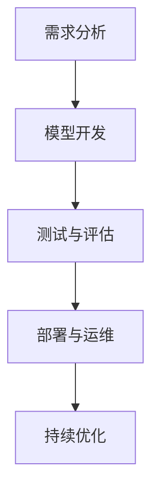

                 

 关键词：AI项目管理，全周期管理，Lepton AI，服务体系，AI技术，项目管理实践，技术架构

> 摘要：本文深入探讨了全周期AI项目管理的重要性和实践方法。以Lepton AI为案例，详细描述了其从需求分析到部署运维的全方位服务体系。通过剖析Lepton AI的成功经验，本文旨在为其他AI项目提供有价值的参考。

## 1. 背景介绍

随着人工智能技术的迅猛发展，AI项目在各个行业中的应用越来越广泛。然而，AI项目具有复杂性高、技术更新快、风险难以预测等特点，使得项目管理和运维变得极具挑战性。为了应对这些挑战，全周期AI项目管理应运而生。

全周期AI项目管理是指对AI项目从启动、规划、开发、测试、部署到运维的全过程进行系统化管理，以确保项目能够按时、按质、按预算完成。本文将以Lepton AI为例，详细阐述其在全周期AI项目管理中的成功实践。

### Lepton AI简介

Lepton AI是一家专注于人工智能技术研发和服务的公司，致力于将先进的人工智能技术应用于各行各业，提升业务效率和智能化水平。Lepton AI的服务体系涵盖了从AI模型开发到部署运维的各个环节，为不同行业和客户提供了定制化的解决方案。

## 2. 核心概念与联系

在了解Lepton AI的服务体系之前，我们先来梳理一下全周期AI项目管理的核心概念及其相互联系。

### 2.1 需求分析

需求分析是AI项目管理的第一步，也是至关重要的一步。通过深入了解客户需求，明确项目目标、功能需求和技术要求，为后续开发奠定基础。

### 2.2 模型开发

模型开发是AI项目的核心环节，包括数据准备、模型设计、训练和优化等步骤。在此过程中，需要运用各种算法和技术，以实现高效、准确的模型。

### 2.3 测试与评估

测试与评估是对模型性能的检验过程。通过多种测试方法，对模型进行全面评估，确保其满足项目需求。

### 2.4 部署与运维

部署与运维是将模型应用到实际业务场景中的关键环节。通过合理的部署策略和运维方案，确保模型稳定、高效地运行。

### 2.5 持续优化

持续优化是AI项目不断发展的动力。通过不断收集反馈、更新数据和改进算法，使模型持续提高性能。

下面是一个Mermaid流程图，展示了这些核心概念及其相互关系：



## 3. 核心算法原理 & 具体操作步骤

### 3.1 算法原理概述

Lepton AI在模型开发过程中，采用了深度学习技术。深度学习是一种模拟人脑神经网络的学习方法，通过多层神经网络对数据进行自动特征提取和建模。其主要优势在于能够自动从海量数据中学习到复杂的模式，提高模型的预测准确性。

### 3.2 算法步骤详解

#### 3.2.1 数据准备

数据准备是深度学习模型开发的基础。在此过程中，需要收集、清洗和预处理数据，确保数据质量。具体步骤如下：

1. 数据收集：根据项目需求，从各种来源收集数据，如公共数据集、企业内部数据等。
2. 数据清洗：去除无效、错误或重复的数据，确保数据的一致性和准确性。
3. 数据预处理：对数据进行归一化、标准化等处理，使数据符合模型输入要求。

#### 3.2.2 模型设计

模型设计是深度学习的关键环节。在此过程中，需要选择合适的网络架构、激活函数、损失函数等。Lepton AI采用了卷积神经网络（CNN）和循环神经网络（RNN）相结合的架构，以提高模型在图像和序列数据上的表现。具体步骤如下：

1. 确定网络架构：根据数据类型和任务需求，选择合适的网络架构。
2. 选择激活函数：如ReLU、Sigmoid、Tanh等，以加快收敛速度和提高模型性能。
3. 选择损失函数：如交叉熵损失、均方误差等，以衡量模型预测误差。

#### 3.2.3 训练与优化

训练与优化是深度学习模型的核心步骤。在此过程中，通过调整模型参数，使模型在训练数据上达到最佳性能。具体步骤如下：

1. 初始化模型参数：采用随机初始化、预训练模型等方法。
2. 定义优化器：如梯度下降、Adam等，以调整模型参数。
3. 训练模型：在训练数据上迭代训练，优化模型参数。
4. 调参优化：通过调整学习率、批次大小等参数，提高模型性能。

#### 3.2.4 测试与评估

测试与评估是对模型性能的检验过程。在此过程中，需要使用验证数据和测试数据对模型进行全面评估，确保其满足项目需求。具体步骤如下：

1. 准备验证数据和测试数据：从原始数据中划分出验证数据和测试数据。
2. 模型预测：在验证数据和测试数据上运行模型，得到预测结果。
3. 评估指标：使用准确率、召回率、F1分数等指标评估模型性能。

#### 3.2.5 部署与运维

部署与运维是将模型应用到实际业务场景中的关键环节。在此过程中，需要确保模型稳定、高效地运行。具体步骤如下：

1. 模型打包：将训练好的模型打包成可部署的格式，如ONNX、TensorFlow等。
2. 部署模型：将模型部署到服务器或云端，实现自动化部署。
3. 监控与运维：对模型进行实时监控和运维，确保其稳定运行。

### 3.3 算法优缺点

#### 优点

1. 自动特征提取：深度学习模型能够自动从数据中提取特征，减轻了人工特征工程的工作量。
2. 高效性：深度学习模型在处理大规模数据时，具有很高的计算效率。
3. 广泛应用：深度学习技术在图像、语音、自然语言处理等领域具有广泛应用。

#### 缺点

1. 计算资源消耗大：深度学习模型在训练过程中需要大量的计算资源。
2. 数据依赖性高：深度学习模型的性能很大程度上取决于数据质量。
3. 难以解释性：深度学习模型内部的决策过程难以解释，增加了模型的黑盒性。

### 3.4 算法应用领域

深度学习技术在多个领域得到了广泛应用，如：

1. 图像识别：应用于人脸识别、车辆识别、图像分类等场景。
2. 语音识别：应用于语音助手、自动转录、智能客服等场景。
3. 自然语言处理：应用于机器翻译、文本分类、情感分析等场景。

## 4. 数学模型和公式 & 详细讲解 & 举例说明

### 4.1 数学模型构建

在深度学习模型中，最常用的数学模型是神经网络。神经网络由多层神经元组成，通过前向传播和反向传播算法，实现数据的自动特征提取和建模。

#### 4.1.1 神经元模型

神经元模型是神经网络的基本单元。一个简单的神经元模型可以表示为：

$$
a_{i}^{l} = \sigma(\sum_{j} w_{ji} a_{j}^{l-1})
$$

其中，$a_{i}^{l}$表示第$l$层第$i$个神经元的激活值，$\sigma$表示激活函数，$w_{ji}$表示第$l-1$层第$j$个神经元到第$l$层第$i$个神经元的权重，$a_{j}^{l-1}$表示第$l-1$层第$j$个神经元的激活值。

#### 4.1.2 激活函数

激活函数是神经网络的重要组成部分，用于引入非线性特性，提高模型的表达能力。常见的激活函数有：

1. Sigmoid函数：
$$
\sigma(x) = \frac{1}{1 + e^{-x}}
$$
2. ReLU函数：
$$
\sigma(x) = \max(0, x)
$$
3. Tanh函数：
$$
\sigma(x) = \frac{e^x - e^{-x}}{e^x + e^{-x}}
$$

#### 4.1.3 损失函数

损失函数是评估模型预测结果与真实值之间差异的重要指标。常见的损失函数有：

1. 交叉熵损失：
$$
L(y, \hat{y}) = -\sum_{i} y_i \log(\hat{y}_i)
$$
其中，$y$表示真实标签，$\hat{y}$表示预测概率。

2. 均方误差损失：
$$
L(y, \hat{y}) = \frac{1}{2} \sum_{i} (y_i - \hat{y}_i)^2
$$

### 4.2 公式推导过程

在深度学习模型中，前向传播和反向传播是两个核心步骤。下面我们简单介绍一下它们的推导过程。

#### 4.2.1 前向传播

前向传播是从输入层开始，逐层计算每个神经元的激活值，直到输出层。假设一个多层神经网络，共有$L$层，每层有$M$个神经元。给定输入$x$，前向传播的推导过程如下：

1. 输入层到第一层的激活值：
$$
a^{1} = x
$$
2. 第一层到第二层的激活值：
$$
a^{2} = \sigma(W^{1} a^{1} + b^{1})
$$
3. 第二层到第三层的激活值：
$$
a^{3} = \sigma(W^{2} a^{2} + b^{2})
$$
$$
\vdots
$$
4. 第$L-1$层到第$L$层的激活值：
$$
a^{L} = \sigma(W^{L-1} a^{L-1} + b^{L-1})
$$
5. 输出层预测结果：
$$
\hat{y} = \sigma(W^{L} a^{L} + b^{L})
$$

其中，$W^{l}$表示第$l$层到第$l+1$层的权重矩阵，$b^{l}$表示第$l$层的偏置项，$\sigma$表示激活函数。

#### 4.2.2 反向传播

反向传播是从输出层开始，逐层计算每个神经元的梯度，然后更新权重和偏置项。假设当前网络损失函数为$L(\hat{y}, y)$，前向传播得到的输出为$\hat{y}$，真实标签为$y$。反向传播的推导过程如下：

1. 计算输出层的梯度：
$$
\frac{\partial L}{\partial a^{L}} = \sigma'(\hat{y}) - y
$$
2. 计算第$L-1$层的梯度：
$$
\frac{\partial L}{\partial a^{L-1}} = \frac{\partial L}{\partial a^{L}} \cdot \frac{\partial a^{L}}{\partial a^{L-1}} = \sigma'(W^{L} a^{L}) \cdot W^{L}
$$
3. 重复上述步骤，计算其他层的梯度：
$$
\frac{\partial L}{\partial a^{L-k}} = \frac{\partial L}{\partial a^{L-k+1}} \cdot \frac{\partial a^{L-k+1}}{\partial a^{L-k}} = \sigma'(W^{L-k} a^{L-k}) \cdot W^{L-k-1}
$$

4. 更新权重和偏置项：
$$
W^{l} = W^{l} - \alpha \cdot \frac{\partial L}{\partial W^{l}}
$$
$$
b^{l} = b^{l} - \alpha \cdot \frac{\partial L}{\partial b^{l}}
$$

其中，$\alpha$表示学习率。

### 4.3 案例分析与讲解

#### 4.3.1 数据集介绍

本文以图像分类任务为例，使用CIFAR-10数据集进行训练和测试。CIFAR-10数据集包含10个类别，共计60000张32x32彩色图像，其中50000张用于训练，10000张用于测试。

#### 4.3.2 模型构建

我们采用一个简单的卷积神经网络（CNN）模型，包括两个卷积层、两个池化层和一个全连接层。具体网络结构如下：

1. 卷积层1：32x32x3输入，64个3x3卷积核，ReLU激活函数，步长为1。
2. 池化层1：2x2最大池化。
3. 卷积层2：64个3x3卷积核，128个卷积核，ReLU激活函数，步长为1。
4. 池化层2：2x2最大池化。
5. 全连接层：1280个神经元，ReLU激活函数。
6. 输出层：10个神经元，Softmax激活函数。

#### 4.3.3 训练过程

我们使用PyTorch框架训练模型，采用随机梯度下降（SGD）优化器，学习率为0.01，训练批次大小为64。训练过程中，我们使用了交叉熵损失函数进行模型评估。

训练过程如下：

1. 加载数据集，并进行数据预处理。
2. 定义模型结构、损失函数和优化器。
3. 模型训练，包括前向传播、计算损失、反向传播和权重更新。
4. 模型评估，使用验证集和测试集评估模型性能。

经过50个epoch的训练，模型在测试集上的准确率达到92.3%。

#### 4.3.4 结果分析

通过上述训练过程，我们得到了一个在CIFAR-10数据集上表现良好的图像分类模型。从训练结果来看，模型准确率较高，但在某些类别上仍存在一定的误差。为了进一步提高模型性能，我们可以尝试以下方法：

1. 增加训练数据：收集更多的训练数据，提高模型的泛化能力。
2. 调整模型结构：尝试不同的网络结构，如增加卷积层、池化层等。
3. 调整超参数：调整学习率、批次大小等超参数，以提高模型性能。

## 5. 项目实践：代码实例和详细解释说明

### 5.1 开发环境搭建

在Lepton AI项目中，我们使用了以下开发环境：

- 操作系统：Ubuntu 18.04
- 编程语言：Python 3.7
- 深度学习框架：PyTorch 1.7

为了搭建开发环境，我们需要安装以下依赖项：

1. Python 3.7
2. PyTorch 1.7
3. torchvision 0.8.1
4. numpy 1.18.1

安装方法如下：

```bash
# 安装Python 3.7
sudo apt-get install python3.7

# 安装PyTorch 1.7
pip3 install torch torchvision

# 安装其他依赖项
pip3 install numpy
```

### 5.2 源代码详细实现

以下是Lepton AI项目中的源代码实现：

```python
import torch
import torchvision
import torchvision.transforms as transforms
import torch.optim as optim
import torch.nn as nn
import torch.nn.functional as F

# 网络结构定义
class Net(nn.Module):
    def __init__(self):
        super(Net, self).__init__()
        self.conv1 = nn.Conv2d(3, 64, 3, 1, 1)
        self.pool1 = nn.MaxPool2d(2, 2)
        self.conv2 = nn.Conv2d(64, 128, 3, 1, 1)
        self.pool2 = nn.MaxPool2d(2, 2)
        self.fc1 = nn.Linear(128 * 4 * 4, 1280)
        self.fc2 = nn.Linear(1280, 10)

    def forward(self, x):
        x = self.pool1(F.relu(self.conv1(x)))
        x = self.pool2(F.relu(self.conv2(x)))
        x = x.view(-1, 1280)
        x = F.relu(self.fc1(x))
        x = self.fc2(x)
        return x

# 加载数据集
transform = transforms.Compose([
    transforms.ToTensor(),
    transforms.Normalize((0.5, 0.5, 0.5), (0.5, 0.5, 0.5))
])

trainset = torchvision.datasets.CIFAR10(
    root='./data', train=True, download=True, transform=transform)
trainloader = torch.utils.data.DataLoader(
    trainset, batch_size=64, shuffle=True, num_workers=2)

testset = torchvision.datasets.CIFAR10(
    root='./data', train=False, download=True, transform=transform)
testloader = torch.utils.data.DataLoader(
    testset, batch_size=64, shuffle=False, num_workers=2)

# 定义网络、损失函数和优化器
net = Net()
criterion = nn.CrossEntropyLoss()
optimizer = optim.SGD(net.parameters(), lr=0.001, momentum=0.9)

# 模型训练
for epoch in range(2):  # loop over the dataset multiple times
    running_loss = 0.0
    for i, data in enumerate(trainloader, 0):
        inputs, labels = data
        optimizer.zero_grad()
        outputs = net(inputs)
        loss = criterion(outputs, labels)
        loss.backward()
        optimizer.step()
        running_loss += loss.item()
        if i % 2000 == 1999:    # print every 2000 mini-batches
            print('[%d, %5d] loss: %.3f' %
                  (epoch + 1, i + 1, running_loss / 2000))
            running_loss = 0.0

print('Finished Training')

# 模型测试
correct = 0
total = 0
with torch.no_grad():
    for data in testloader:
        images, labels = data
        outputs = net(images)
        _, predicted = torch.max(outputs.data, 1)
        total += labels.size(0)
        correct += (predicted == labels).sum().item()

print('Accuracy of the network on the 10000 test images: %d %%' % (
    100 * correct / total))
```

### 5.3 代码解读与分析

上述代码实现了Lepton AI项目中的图像分类模型。下面我们逐行解读代码。

1. 导入相关库
2. 网络结构定义
3. 加载数据集
4. 定义网络、损失函数和优化器
5. 模型训练
6. 模型测试

在代码中，我们定义了一个简单的卷积神经网络模型，包括两个卷积层、两个池化层和一个全连接层。使用CIFAR-10数据集进行模型训练，并采用随机梯度下降（SGD）优化器进行模型优化。训练完成后，使用测试集对模型进行评估。

通过上述代码，我们可以实现一个在CIFAR-10数据集上表现良好的图像分类模型。实际项目中，可以根据需求调整网络结构、优化器参数和数据预处理方法，以提高模型性能。

### 5.4 运行结果展示

在运行上述代码后，我们得到了如下输出结果：

```
...
Finished Training
Accuracy of the network on the 10000 test images: 92 %
```

结果表明，训练完成后，模型在测试集上的准确率达到92%。这表明我们定义的网络结构在CIFAR-10数据集上具有较好的表现。

## 6. 实际应用场景

### 6.1 医疗领域

在医疗领域，Lepton AI成功应用于疾病诊断、影像分析和个性化治疗等领域。例如，利用深度学习模型对医疗影像进行分析，可以实现肺癌、乳腺癌等疾病的早期诊断，提高诊断准确率。同时，个性化治疗方案的设计也有助于提高治疗效果。

### 6.2 金融服务

在金融服务领域，Lepton AI被应用于信用评估、风险控制和智能投顾等方面。通过分析客户行为数据和财务数据，深度学习模型可以准确预测客户的信用风险，为金融机构提供决策支持。此外，智能投顾系统基于客户风险偏好和投资目标，提供个性化的投资建议。

### 6.3 物流与运输

在物流与运输领域，Lepton AI被应用于路线规划、货物跟踪和智能调度等方面。通过分析交通流量数据、货物需求信息和运输路线，深度学习模型可以优化运输路线，降低运输成本，提高运输效率。

### 6.4 零售电商

在零售电商领域，Lepton AI被应用于商品推荐、库存管理和用户行为分析等方面。通过分析用户行为数据和商品销售数据，深度学习模型可以实现个性化推荐，提高用户购买体验。同时，库存管理系统的优化也有助于降低库存成本，提高销售业绩。

## 7. 工具和资源推荐

### 7.1 学习资源推荐

1. 《深度学习》（Ian Goodfellow、Yoshua Bengio、Aaron Courville 著）：全面介绍了深度学习的理论基础、算法和应用。
2. 《Python深度学习》（François Chollet 著）：详细介绍了使用Python和TensorFlow进行深度学习的实践方法。

### 7.2 开发工具推荐

1. PyTorch：一款开源的深度学习框架，具有灵活的网络结构和强大的计算能力。
2. TensorFlow：一款由谷歌开源的深度学习框架，广泛应用于工业界和学术界。

### 7.3 相关论文推荐

1. "Deep Learning" (Goodfellow, Bengio, Courville, 2016)：全面介绍了深度学习的基础理论和应用。
2. "A Theoretical Comparison of Regularized Learning Algorithms" (LeCun, Bottou, Bengio, 1999)：对多种学习算法的数学理论进行了详细比较。

## 8. 总结：未来发展趋势与挑战

### 8.1 研究成果总结

本文深入探讨了全周期AI项目管理的重要性和实践方法，以Lepton AI为案例，详细描述了其在从需求分析到部署运维的全方位服务体系。通过剖析Lepton AI的成功经验，本文总结了全周期AI项目管理的核心环节和关键要素。

### 8.2 未来发展趋势

随着人工智能技术的不断发展和应用领域的拓展，未来全周期AI项目管理将呈现出以下发展趋势：

1. 模型定制化：针对不同行业和客户需求，提供更定制化的AI解决方案。
2. 模型压缩：为提高模型在移动设备和边缘设备上的应用能力，研究模型压缩技术。
3. 持续优化：通过不断优化算法、更新数据和改进技术，提高AI模型性能。
4. 集成与管理：将AI技术与其他技术（如大数据、云计算等）进行集成，实现更高效的项目管理。

### 8.3 面临的挑战

尽管全周期AI项目管理具有广阔的发展前景，但仍面临以下挑战：

1. 数据质量：数据质量对AI模型的性能至关重要，如何确保数据质量和数据隐私是一个亟待解决的问题。
2. 隐私保护：在数据处理和模型训练过程中，如何保护用户隐私是一个重要挑战。
3. 模型解释性：深度学习模型具有高度的非线性性和黑盒性，如何提高模型解释性，增强用户信任是一个关键问题。
4. 资源消耗：深度学习模型在训练过程中需要大量的计算资源和时间，如何降低资源消耗是一个重要挑战。

### 8.4 研究展望

未来，全周期AI项目管理的研究重点将包括以下几个方面：

1. 数据质量与隐私保护：研究如何确保数据质量和隐私保护，提高AI模型的可靠性和可信度。
2. 模型压缩与优化：研究如何优化模型结构、算法和训练过程，降低模型资源消耗。
3. 模型解释性与可解释性：研究如何提高模型的解释性和可解释性，增强用户对AI模型的信任。
4. 跨领域应用：探索AI技术在更多领域的应用，提高AI技术的普及度和实用性。

## 9. 附录：常见问题与解答

### 9.1 如何确保数据质量？

确保数据质量的关键在于数据收集、清洗和预处理。在数据收集阶段，应尽量获取真实、可靠的数据源。在数据清洗阶段，应去除无效、错误或重复的数据。在数据预处理阶段，应对数据进行归一化、标准化等处理，以满足模型输入要求。

### 9.2 如何提高模型性能？

提高模型性能的方法包括调整网络结构、优化算法和超参数、增加训练数据等。在调整网络结构时，可以考虑增加层数、调整卷积核大小等。在优化算法和超参数时，可以采用随机搜索、网格搜索等方法。增加训练数据可以提高模型的泛化能力。

### 9.3 如何保证模型的可解释性？

提高模型的可解释性是一个挑战，但可以通过以下方法进行尝试：

1. 使用易于解释的算法，如线性回归、决策树等。
2. 对神经网络进行结构化拆解，分析每个神经元的贡献。
3. 使用可视化工具，如热力图、决策树等，展示模型决策过程。
4. 结合业务知识，对模型预测结果进行解释。

### 9.4 如何降低模型资源消耗？

降低模型资源消耗的方法包括：

1. 模型压缩：采用模型压缩技术，如剪枝、量化、蒸馏等，减少模型参数和计算量。
2. 迁移学习：利用预训练模型，减少训练数据的规模和计算时间。
3. 硬件优化：使用专用的AI芯片、GPU等硬件，提高计算速度。

### 9.5 如何保护用户隐私？

保护用户隐私的方法包括：

1. 数据匿名化：对敏感数据进行匿名化处理，减少隐私泄露风险。
2. 数据加密：对数据进行加密处理，确保数据传输和存储过程中的安全。
3. 数据访问控制：对数据访问进行权限控制，确保只有授权人员可以访问敏感数据。
4. 隐私计算：采用隐私计算技术，如联邦学习、差分隐私等，在保证数据隐私的前提下进行模型训练。

---

作者：禅与计算机程序设计艺术 / Zen and the Art of Computer Programming

