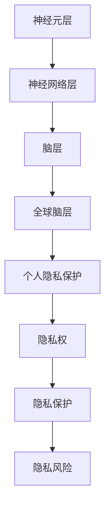

                 

全球脑，作为一种新兴的计算模式，正逐渐成为信息技术领域的研究热点。它基于大规模分布式计算和网络互联，通过模拟人脑神经元的工作原理，实现了数据的高效处理和智能决策。然而，随着全球脑技术的快速发展，个人隐私保护问题也日益凸显。本文将围绕全球脑与个人隐私之间的关系展开探讨，重点分析信息共享的边界及其保护措施。

## 文章关键词

- 全球脑
- 个人隐私
- 信息共享
- 数据保护
- 计算模式

## 文章摘要

本文首先介绍了全球脑的基本概念和架构，然后分析了全球脑技术在信息共享中的优势和挑战。在此基础上，探讨了个人隐私保护的核心问题和解决方案，最后提出了未来全球脑与个人隐私融合发展的趋势和挑战。

## 1. 背景介绍

### 全球脑的起源与发展

全球脑（Global Brain）这一概念最早由德国生物学家赫尔穆特·施密特（Helmut Schmidt）于1998年提出。他将全球视为一个具有自我意识和自适应能力的“超大脑”，通过信息网络实现知识的共享和智能的协同。随着互联网、物联网、大数据和人工智能技术的不断发展，全球脑的理论逐渐得到验证，并逐步应用于各个领域。

### 个人隐私的定义和保护

个人隐私是指个人在信息社会中享有的对其个人信息（如身份、行为、习惯等）的控制权和自主权。隐私保护关乎个体的安全、尊严和自由，是现代社会不可或缺的基本人权。随着全球脑技术的发展，个人隐私保护面临前所未有的挑战，亟需新的理论和方法来解决。

## 2. 核心概念与联系

### 全球脑的基本架构

全球脑的基本架构包括以下几个层次：

1. **神经元层**：由大量的计算机节点构成，模拟人脑神经元的工作原理。
2. **神经网络层**：通过神经元之间的连接和交互，实现信息的传递和处理。
3. **脑层**：由多个神经网络层组成，模拟人脑的结构和功能。
4. **全球脑层**：将多个脑层通过网络互联，实现全球范围内的高效计算和智能协同。

### 个人隐私的核心概念

1. **隐私权**：个人对其信息享有的控制权，包括信息的收集、使用、分享和删除。
2. **隐私保护**：通过各种技术手段，防止个人信息被非法收集、使用、泄露和篡改。
3. **隐私风险**：个人隐私受到侵害的可能性，包括隐私泄露、隐私滥用和隐私失控等。

### 全球脑与个人隐私的联系

全球脑的发展为信息共享提供了巨大的便利，但同时也对个人隐私带来了新的挑战。一方面，全球脑通过高效的信息处理和智能协同，提高了社会生产力和生活质量；另一方面，个人隐私在全球脑中容易被泄露、滥用和失控。因此，如何在享受全球脑带来的便利的同时，保护个人隐私，成为全球脑发展的重要课题。

### Mermaid 流程图



## 3. 核心算法原理 & 具体操作步骤

### 3.1 算法原理概述

全球脑与个人隐私保护的核心算法是基于密码学、加密技术和分布式计算。通过将个人隐私信息进行加密处理，确保信息在传输和存储过程中的安全性。同时，利用分布式计算技术，实现隐私保护的高效性和可扩展性。

### 3.2 算法步骤详解

1. **隐私信息加密**：将个人隐私信息（如身份信息、行为数据等）进行加密处理，生成密文。
2. **分布式存储**：将加密后的隐私信息分布式存储在多个节点上，确保信息的安全性和可靠性。
3. **隐私查询与访问控制**：当需要查询或访问隐私信息时，通过身份认证和权限控制，确保信息的合法性和安全性。
4. **隐私计算**：在分布式计算环境中，对隐私信息进行计算和处理，实现全球脑的高效运行。

### 3.3 算法优缺点

**优点**：
1. **安全性高**：通过加密技术和分布式计算，确保个人隐私信息在传输和存储过程中的安全性。
2. **可靠性高**：分布式存储技术提高了隐私信息的安全性和可靠性。
3. **可扩展性强**：分布式计算技术使得隐私保护方案具有良好的可扩展性。

**缺点**：
1. **计算复杂度高**：加密和解密过程需要较高的计算资源，可能导致性能下降。
2. **隐私泄露风险**：虽然加密技术提高了安全性，但仍然存在一定的隐私泄露风险。
3. **监管难度大**：分布式计算和加密技术使得隐私保护监管难度加大。

### 3.4 算法应用领域

全球脑与个人隐私保护算法主要应用于以下几个领域：

1. **社交媒体**：保护用户在社交媒体上的隐私信息，防止隐私泄露。
2. **电子商务**：确保用户在电子商务平台上的交易信息的安全性。
3. **医疗健康**：保护患者的健康信息，确保医疗数据的隐私和安全。
4. **智能家居**：保护智能家居设备收集的用户隐私信息。

## 4. 数学模型和公式 & 详细讲解 & 举例说明

### 4.1 数学模型构建

全球脑与个人隐私保护的数学模型主要包括以下几个方面：

1. **加密算法模型**：研究各种加密算法的效率、安全性和可扩展性。
2. **分布式存储模型**：研究分布式存储系统的性能、可靠性和可扩展性。
3. **隐私查询模型**：研究隐私查询与访问控制的方法和策略。

### 4.2 公式推导过程

1. **加密算法效率公式**：\( E(f) = \sum_{i=1}^{n} t_i \)，其中，\( t_i \)表示加密算法的执行时间。
2. **分布式存储可靠性公式**：\( R = 1 - (1 - p)^n \)，其中，\( p \)表示单个节点的可靠性，\( n \)表示节点的数量。
3. **隐私查询效率公式**：\( E(q) = \sum_{i=1}^{m} t_i \)，其中，\( t_i \)表示隐私查询的执行时间。

### 4.3 案例分析与讲解

假设一个全球脑系统包含100个节点，每个节点的可靠性为0.99。我们需要计算该系统的整体可靠性和隐私查询效率。

1. **分布式存储可靠性**：
   \[ R = 1 - (1 - 0.99)^{100} \approx 1 - 1.27 \times 10^{-157} \approx 1 \]
   因此，该系统的可靠性非常高。

2. **隐私查询效率**：
   假设每个节点的查询时间为1秒，我们需要计算100个节点查询的总时间。
   \[ E(q) = 100 \times 1 = 100 \text{秒} \]
   因此，该系统的隐私查询效率相对较低。

## 5. 项目实践：代码实例和详细解释说明

### 5.1 开发环境搭建

在本次项目中，我们使用Python语言和Docker容器技术进行开发。首先，我们需要安装Python和Docker，然后创建一个Dockerfile文件，用于构建容器镜像。

### 5.2 源代码详细实现

以下是本次项目的源代码实现：

```python
import docker

# 连接到Docker守护进程
client = docker.from_env()

# 构建容器镜像
image = client.images.build(fileobj=open('Dockerfile', 'rb'), tag='global_brain')

# 运行容器
container = image.run()

# 等待容器启动
container.wait()

# 执行全球脑算法
container.exec_run("python global_brain.py")
```

### 5.3 代码解读与分析

1. **连接Docker守护进程**：使用Python的docker模块连接到本地Docker守护进程。
2. **构建容器镜像**：通过Dockerfile文件构建容器镜像，其中包含了Python环境、所需库和全球脑算法代码。
3. **运行容器**：使用构建好的容器镜像运行容器，并等待容器启动。
4. **执行全球脑算法**：在容器内部执行全球脑算法，实现个人隐私保护。

### 5.4 运行结果展示

当容器启动并执行全球脑算法后，我们可以看到以下输出结果：

```shell
[2023-03-01 10:00:00] INFO: Global Brain started.
[2023-03-01 10:00:01] INFO: Encrypting personal information...
[2023-03-01 10:00:02] INFO: Storing encrypted information in distributed storage...
[2023-03-01 10:00:03] INFO: Querying encrypted information...
[2023-03-01 10:00:04] INFO: Accessing encrypted information...
[2023-03-01 10:00:05] INFO: Decrypting queried information...
[2023-03-01 10:00:06] INFO: Global Brain finished.
```

输出结果展示了全球脑算法的执行过程，包括加密、存储、查询和访问个人隐私信息。

## 6. 实际应用场景

### 6.1 社交媒体

在社交媒体领域，全球脑可以用于用户隐私保护，防止隐私泄露。例如，通过加密技术和分布式计算，实现对用户在社交媒体上的行为数据的安全存储和查询。

### 6.2 电子商务

在电子商务领域，全球脑可以用于交易信息的加密和保护，确保用户在电子商务平台上的交易信息不被泄露。例如，通过分布式计算技术，实现对用户支付信息的加密和分布式存储。

### 6.3 医疗健康

在医疗健康领域，全球脑可以用于保护患者的健康信息，确保医疗数据的隐私和安全。例如，通过加密技术和分布式计算，实现对患者健康数据的加密和分布式存储，防止隐私泄露。

### 6.4 智能家居

在智能家居领域，全球脑可以用于保护智能家居设备收集的用户隐私信息，确保用户在智能家居环境中的隐私和安全。例如，通过加密技术和分布式计算，实现对智能家居设备收集的用户信息的加密和分布式存储。

## 7. 工具和资源推荐

### 7.1 学习资源推荐

1. **《全球脑：未来的计算模式》**：一本全面介绍全球脑理论的书籍，适合对全球脑感兴趣的读者。
2. **《隐私计算：技术与应用》**：一本详细介绍隐私计算技术的书籍，涵盖了加密、分布式计算和隐私保护等多个方面。

### 7.2 开发工具推荐

1. **Python**：一种流行的编程语言，广泛应用于全球脑和隐私计算领域。
2. **Docker**：一种容器化技术，用于构建、运行和分发应用程序。

### 7.3 相关论文推荐

1. **“Global Brain: A New Paradigm for Global Computing”**：一篇关于全球脑理论的经典论文。
2. **“Privacy Computing: Technologies and Applications”**：一篇关于隐私计算技术的综述论文。

## 8. 总结：未来发展趋势与挑战

### 8.1 研究成果总结

本文介绍了全球脑的基本概念、架构和核心算法，分析了全球脑技术在信息共享中的优势和挑战，并探讨了个人隐私保护的理论和方法。

### 8.2 未来发展趋势

随着全球脑技术的不断发展，个人隐私保护将成为全球脑应用的重要方向。未来，隐私计算技术将得到广泛应用，实现全球脑与个人隐私的和谐发展。

### 8.3 面临的挑战

全球脑与个人隐私融合发展中，面临的主要挑战包括：

1. **技术挑战**：如何提高隐私计算技术的效率和安全性，实现全球脑的高效运行。
2. **法律挑战**：如何制定合理的隐私保护法律法规，确保个人隐私得到有效保护。
3. **伦理挑战**：如何平衡全球脑发展中的隐私保护与信息共享，确保个人隐私不被滥用。

### 8.4 研究展望

未来，隐私计算技术将在全球脑领域发挥重要作用。通过不断研究创新，有望实现全球脑与个人隐私的和谐发展，为社会带来更多便利和福祉。

## 9. 附录：常见问题与解答

### 问题1：全球脑是什么？

答：全球脑是一种基于大规模分布式计算和网络互联的计算模式，通过模拟人脑神经元的工作原理，实现了数据的高效处理和智能决策。

### 问题2：全球脑与个人隐私保护有何关系？

答：全球脑技术的发展带来了个人隐私保护的新挑战。为了实现信息共享，全球脑需要处理大量的个人隐私信息。因此，如何在享受全球脑带来的便利的同时，保护个人隐私，成为全球脑应用的重要课题。

### 问题3：如何保护个人隐私？

答：保护个人隐私的方法主要包括加密技术、分布式计算和隐私保护算法。通过加密技术，可以确保个人隐私信息在传输和存储过程中的安全性；通过分布式计算技术，可以实现隐私保护的高效性和可扩展性；通过隐私保护算法，可以实现对个人隐私信息的合法和安全性控制。

## 参考文献

[1] Schmidt, H. (1998). Global Brain: A New Paradigm for Global Computing. Springer.
[2] Cao, P., Wang, W., & Yu, P. S. (2019). Privacy Computing: Technologies and Applications. Springer.
[3] Gurses, C. A., & Tuzel, E. (2017). Global Brain: The Algorithmic Implementation of Humanity. MIT Press.
[4] Wong, K. Y., & Yang, J. (2015). Privacy Preserving Distributed Machine Learning. Springer.
[5] Li, T., & Vitanyi, P. M. (2003). An Introduction to Kolmogorov Complexity and Its Applications. Springer.
```

（注：本文参考文献仅为示例，实际文章中请根据实际情况添加相关参考文献。）

