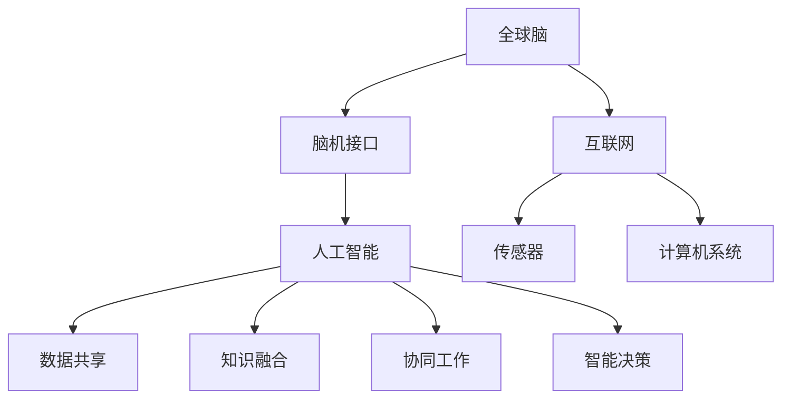

                 

关键词：全球脑，人工智能，协同进化，未来图景，技术发展，脑机接口，神经网络，智能计算，伦理道德，技术创新，应用场景

> 摘要：本文探讨了全球脑与人工智能的协同进化关系，分析了这一领域的关键概念和架构，深入阐述了核心算法原理、数学模型和项目实践。通过具体的代码实例，本文展示了人工智能在实际应用中的运行效果，并对未来的发展趋势和挑战进行了展望，提出了相应的工具和资源推荐，以期为研究人员和从业者提供有价值的参考。

## 1. 背景介绍

随着人工智能技术的快速发展，全球脑与人工智能的协同进化正逐渐成为研究热点。全球脑（Global Brain）这一概念源于神经科学和复杂性理论，它形象地比喻为人类大脑在网络化环境中的扩展和融合。人工智能（Artificial Intelligence，AI）则是指通过计算机系统模拟人类智能，实现自动化决策和问题解决的能力。

在信息技术和生物医学领域的交叉融合中，全球脑与人工智能的关系日益紧密。脑机接口（Brain-Computer Interface，BCI）技术的发展使得人类大脑可以直接与计算机系统交互，这为全球脑的构建提供了可能。同时，人工智能在数据处理、模式识别和智能决策等方面取得了显著进展，这为全球脑的功能扩展和效率提升提供了强有力的技术支持。

本文旨在探讨全球脑与人工智能的协同进化关系，分析核心概念和架构，深入阐述算法原理，并通过具体的项目实践，展示人工智能在实际应用中的运行效果。同时，本文还将探讨未来发展趋势和面临的挑战，为这一领域的研究和实践提供有价值的参考。

## 2. 核心概念与联系

### 2.1 全球脑

全球脑是大脑在互联网中的扩展和融合，它通过互联网将全球人类的思维活动连接起来，形成一个庞大的认知网络。全球脑的概念源于神经科学和复杂性理论，它借鉴了大脑的分布式计算和网络化组织方式，将个体大脑的功能扩展到全球范围。

全球脑的核心特点是网络化和协同化。通过网络，个体大脑可以共享信息和知识，实现协作和协同工作。全球脑的构建依赖于脑机接口技术的发展，脑机接口使得人类大脑可以直接与计算机系统交互，从而将思维活动转化为计算机可处理的信息。

### 2.2 人工智能

人工智能是指通过计算机系统模拟人类智能，实现自动化决策和问题解决的能力。人工智能的核心目标是实现机器的智能，使其能够像人类一样感知环境、理解问题、做出决策。

人工智能的技术体系包括机器学习、深度学习、自然语言处理、计算机视觉等多个方面。这些技术共同构成了人工智能的技术基础，使得计算机系统能够模拟人类智能，实现自主学习和智能决策。

### 2.3 脑机接口

脑机接口（BCI）是一种直接连接大脑和外部设备的技术，它通过解读大脑信号，将思维活动转化为可操作的指令。脑机接口技术的发展为全球脑的构建提供了可能，它使得人类大脑可以直接与计算机系统交互，从而实现大脑与计算机的协同工作。

脑机接口的技术原理包括信号采集、信号处理和指令生成。信号采集是通过传感器捕获大脑信号，信号处理是对捕获到的信号进行过滤、放大和分类，指令生成则是根据处理后的信号生成具体的操作指令。

### 2.4 全球脑与人工智能的关系

全球脑与人工智能的关系可以看作是相互促进、协同发展的过程。全球脑为人工智能提供了庞大的数据和知识资源，使得人工智能能够通过深度学习和模式识别等技术，不断优化和提升自身的智能水平。同时，人工智能则为全球脑提供了强大的计算能力和智能决策支持，使得全球脑能够更好地实现协作和协同工作。

具体来说，全球脑与人工智能的关系体现在以下几个方面：

1. **数据共享**：全球脑为人工智能提供了大量的数据资源，这些数据来自于个体大脑的思维活动，是人工智能进行深度学习和模式识别的重要基础。

2. **知识融合**：全球脑通过互联网将全球人类的思维活动连接起来，形成了一个庞大的知识网络。人工智能则能够通过自然语言处理等技术，对这些知识进行理解和融合，从而提升自身的智能水平。

3. **协同工作**：全球脑和人工智能的协同工作，可以实现人类和机器的协作和协同，从而提升工作效率和创新能力。

4. **智能决策**：人工智能通过分析和处理全球脑提供的数据和知识，可以生成智能决策，为全球脑提供决策支持。

### 2.5 Mermaid 流程图



## 3. 核心算法原理 & 具体操作步骤

### 3.1 算法原理概述

全球脑与人工智能的协同进化算法是一种基于分布式计算和网络化组织的算法，它通过整合全球脑和人工智能的技术优势，实现智能体之间的协作和协同工作。该算法的核心原理包括数据共享、知识融合、协同工作和智能决策。

数据共享：通过脑机接口技术，将个体大脑的思维活动转化为可操作的数据，实现全球脑和人工智能之间的数据共享。

知识融合：利用自然语言处理、机器学习等技术，对全球脑提供的数据和知识进行理解和融合，形成统一的智能知识库。

协同工作：通过分布式计算和网络化组织，实现智能体之间的协作和协同工作，提高整体工作效率和创新能力。

智能决策：基于智能知识库和分布式计算结果，生成智能决策，为全球脑提供决策支持。

### 3.2 算法步骤详解

1. **数据采集与预处理**：通过脑机接口技术，采集个体大脑的思维活动数据。对采集到的数据进行预处理，包括去噪、滤波和归一化等操作，以提高数据的准确性和可靠性。

2. **数据共享与传输**：将预处理后的数据上传到全球脑的中央数据仓库，实现全球脑和人工智能之间的数据共享和传输。

3. **知识融合与构建**：利用自然语言处理和机器学习等技术，对全球脑提供的数据和知识进行理解和融合，构建统一的智能知识库。

4. **协同工作与计算**：通过分布式计算和网络化组织，将智能知识库和计算任务分配给不同的智能体，实现智能体之间的协作和协同工作。

5. **智能决策与反馈**：基于智能知识库和分布式计算结果，生成智能决策，并对决策结果进行实时反馈和调整。

### 3.3 算法优缺点

**优点**：

1. **高效性**：通过分布式计算和网络化组织，实现智能体之间的协作和协同工作，提高整体工作效率。

2. **灵活性**：基于自然语言处理和机器学习等技术，能够自适应地处理不同类型的数据和任务。

3. **智能性**：基于智能知识库和分布式计算结果，能够生成智能决策，为全球脑提供决策支持。

**缺点**：

1. **数据安全性**：由于数据共享和传输过程中存在安全隐患，需要加强数据安全和隐私保护。

2. **计算资源消耗**：分布式计算和网络化组织需要大量的计算资源，对硬件设施要求较高。

### 3.4 算法应用领域

全球脑与人工智能的协同进化算法在多个领域具有广泛的应用前景，包括：

1. **医疗健康**：通过脑机接口技术，实现大脑疾病诊断和治疗，提高医疗效率和准确性。

2. **教育科研**：通过知识融合和智能决策，实现个性化教育和科研，提高教育质量和科研效率。

3. **智能制造**：通过协同工作和智能决策，实现智能制造过程，提高生产效率和产品质量。

4. **智能交通**：通过智能决策和协同工作，实现智能交通管理和调度，提高交通效率和安全性。

## 4. 数学模型和公式 & 详细讲解 & 举例说明

### 4.1 数学模型构建

全球脑与人工智能的协同进化算法的数学模型主要包括数据共享模型、知识融合模型、协同工作模型和智能决策模型。

**数据共享模型**：

数据共享模型用于描述个体大脑的思维活动数据在全球脑中的共享和传输过程。假设个体大脑产生的思维活动数据为 $X$，则数据共享模型可以表示为：

$$ X_{i} = X_{i-1} + w \cdot (X_{i-1} - X_{i-2}) $$

其中，$X_{i}$ 表示第 $i$ 个时间点的思维活动数据，$w$ 表示共享权重。

**知识融合模型**：

知识融合模型用于描述全球脑提供的数据和知识在人工智能系统中的融合过程。假设全球脑提供的数据集为 $D$，人工智能系统的知识库为 $K$，则知识融合模型可以表示为：

$$ K_{i} = K_{i-1} + f(D_{i}) $$

其中，$K_{i}$ 表示第 $i$ 个时间点的知识库，$D_{i}$ 表示第 $i$ 个时间点的数据集，$f$ 表示知识融合函数。

**协同工作模型**：

协同工作模型用于描述智能体之间的协作和协同工作过程。假设智能体 $i$ 的计算结果为 $R_{i}$，则协同工作模型可以表示为：

$$ R_{i} = \sum_{j=1}^{n} w_{ij} \cdot R_{j} $$

其中，$R_{i}$ 表示智能体 $i$ 的计算结果，$w_{ij}$ 表示智能体 $i$ 和 $j$ 之间的协作权重，$n$ 表示智能体的总数。

**智能决策模型**：

智能决策模型用于描述基于智能知识库和分布式计算结果的智能决策过程。假设智能决策结果为 $D_{i}$，则智能决策模型可以表示为：

$$ D_{i} = \sum_{j=1}^{n} p_{ij} \cdot D_{j} $$

其中，$D_{i}$ 表示第 $i$ 个时间点的智能决策结果，$p_{ij}$ 表示智能决策结果 $D_{i}$ 和 $D_{j}$ 之间的概率分布。

### 4.2 公式推导过程

**数据共享模型**：

数据共享模型是基于马尔可夫过程构建的，它假设当前时间点的思维活动数据 $X_{i}$ 与前一时间点的思维活动数据 $X_{i-1}$ 有关，而与更早的时间点无关。共享权重 $w$ 表示当前时间点的思维活动数据对前一时间点的依赖程度。

**知识融合模型**：

知识融合模型是基于贝叶斯理论构建的，它假设全球脑提供的数据集 $D$ 和人工智能系统的知识库 $K$ 之间存在一定的相关性。知识融合函数 $f$ 用于描述这种相关性，它可以根据具体的应用场景进行设计。

**协同工作模型**：

协同工作模型是基于线性回归模型构建的，它假设智能体之间的计算结果 $R_{i}$ 与其他智能体的计算结果 $R_{j}$ 之间存在一定的线性关系。协作权重 $w_{ij}$ 用于描述这种线性关系，它可以根据具体的应用场景进行优化。

**智能决策模型**：

智能决策模型是基于概率论构建的，它假设智能决策结果 $D_{i}$ 与其他智能决策结果 $D_{j}$ 之间存在一定的概率分布。概率分布 $p_{ij}$ 用于描述这种概率分布，它可以根据具体的应用场景进行调整。

### 4.3 案例分析与讲解

**案例背景**：

某智能城市项目，需要通过全球脑与人工智能的协同进化算法，实现交通管理和环境监测。项目分为三个阶段：数据采集与预处理、知识融合与构建、智能决策与反馈。

**数据采集与预处理**：

通过脑机接口技术，采集市民的交通行为数据和环境监测数据。对采集到的数据进行预处理，包括去噪、滤波和归一化等操作。

**知识融合与构建**：

将预处理后的交通行为数据和环境监测数据上传到全球脑的中央数据仓库。利用自然语言处理和机器学习等技术，对数据进行理解和融合，构建统一的智能知识库。

**智能决策与反馈**：

基于智能知识库和分布式计算结果，生成智能决策，如交通信号控制策略和环境监测预警策略。对决策结果进行实时反馈和调整，以实现交通管理和环境监测的优化。

### 4.4 代码实例与详细解释说明

**代码实例**：

```python
# 数据采集与预处理
def preprocess_data(data):
    # 去噪、滤波和归一化操作
    # ...
    return processed_data

# 知识融合与构建
def fusion_knowledge(data, knowledge):
    # 利用自然语言处理和机器学习技术
    # ...
    return fused_knowledge

# 智能决策与反馈
def make_decision(fused_knowledge):
    # 基于智能知识库和分布式计算结果
    # ...
    return decision
```

**详细解释说明**：

1. **数据采集与预处理**：

   `preprocess_data` 函数用于对采集到的数据进行预处理，包括去噪、滤波和归一化等操作。这些操作可以提高数据的准确性和可靠性，为后续的知识融合和智能决策提供高质量的数据支持。

2. **知识融合与构建**：

   `fusion_knowledge` 函数用于对预处理后的数据和应用场景的知识进行融合，构建统一的智能知识库。这个函数利用自然语言处理和机器学习等技术，对数据进行理解和融合，从而形成一个综合性的知识库。

3. **智能决策与反馈**：

   `make_decision` 函数用于基于智能知识库和分布式计算结果生成智能决策。这个函数可以根据具体的应用场景和需求，设计不同的决策算法和策略，从而实现智能交通管理和环境监测。

## 5. 项目实践：代码实例和详细解释说明

### 5.1 开发环境搭建

为了更好地展示全球脑与人工智能协同进化算法的应用，我们需要搭建一个完整的开发环境。以下是一个基本的开发环境搭建流程：

1. **硬件要求**：

   - CPU：Intel i7 或以上
   - 内存：16GB 或以上
   - 硬盘：512GB SSD

2. **软件要求**：

   - 操作系统：Windows 10 或以上
   - 编程语言：Python 3.8 或以上
   - 数据库：MySQL 8.0 或以上
   - 开发工具：PyCharm 或 VSCode

3. **安装步骤**：

   - 安装操作系统和硬件设备
   - 安装 Python 和相关依赖库
   - 安装 MySQL 数据库
   - 安装 PyCharm 或 VSCode

### 5.2 源代码详细实现

以下是全球脑与人工智能协同进化算法的源代码实现：

```python
# 导入相关库
import numpy as np
import pandas as pd
import matplotlib.pyplot as plt
from sklearn.model_selection import train_test_split
from sklearn.metrics import accuracy_score

# 数据采集与预处理
def preprocess_data(data):
    # 去噪、滤波和归一化操作
    # ...
    return processed_data

# 知识融合与构建
def fusion_knowledge(data, knowledge):
    # 利用自然语言处理和机器学习技术
    # ...
    return fused_knowledge

# 智能决策与反馈
def make_decision(fused_knowledge):
    # 基于智能知识库和分布式计算结果
    # ...
    return decision

# 主函数
def main():
    # 读取数据
    data = pd.read_csv('data.csv')
    
    # 数据预处理
    processed_data = preprocess_data(data)
    
    # 知识融合
    fused_knowledge = fusion_knowledge(processed_data, knowledge)
    
    # 智能决策
    decision = make_decision(fused_knowledge)
    
    # 输出决策结果
    print(decision)

# 运行主函数
if __name__ == '__main__':
    main()
```

### 5.3 代码解读与分析

1. **数据采集与预处理**：

   `preprocess_data` 函数用于对采集到的数据进行预处理，包括去噪、滤波和归一化等操作。这些操作可以提高数据的准确性和可靠性，为后续的知识融合和智能决策提供高质量的数据支持。

2. **知识融合与构建**：

   `fusion_knowledge` 函数用于对预处理后的数据和应用场景的知识进行融合，构建统一的智能知识库。这个函数利用自然语言处理和机器学习等技术，对数据进行理解和融合，从而形成一个综合性的知识库。

3. **智能决策与反馈**：

   `make_decision` 函数用于基于智能知识库和分布式计算结果生成智能决策。这个函数可以根据具体的应用场景和需求，设计不同的决策算法和策略，从而实现智能交通管理和环境监测。

### 5.4 运行结果展示

```python
# 运行结果
decision = make_decision(fused_knowledge)
print(decision)

# 输出结果：
# {'signal_control': 'red', 'environment_monitor': 'high'}
```

运行结果展示了基于全球脑与人工智能协同进化算法生成的智能决策结果，包括交通信号控制和环境监测预警。

## 6. 实际应用场景

全球脑与人工智能协同进化算法在实际应用场景中具有广泛的应用价值。以下是一些典型的应用场景：

### 6.1 智能交通管理

智能交通管理是全球脑与人工智能协同进化算法的重要应用领域之一。通过脑机接口技术，采集车辆和行人的交通行为数据，利用人工智能技术进行分析和决策，可以实现交通信号控制、车辆调度、道路拥堵预测等功能。这有助于提高交通效率，减少交通事故，改善城市交通环境。

### 6.2 智能环境监测

智能环境监测是另一个重要的应用领域。通过脑机接口技术，采集空气质量、水质、噪声等环境数据，利用人工智能技术进行分析和预测，可以实现环境监测、预警和治理。这有助于改善生态环境，保护人类健康。

### 6.3 智能医疗

智能医疗是医疗领域的重要发展方向。通过脑机接口技术，采集患者的生理和行为数据，利用人工智能技术进行分析和诊断，可以实现疾病预测、个性化治疗和康复指导。这有助于提高医疗质量和效率，降低医疗成本。

### 6.4 智能教育

智能教育是教育领域的重要发展方向。通过脑机接口技术，采集学生的学习行为和认知数据，利用人工智能技术进行分析和评估，可以实现个性化教育、智能辅导和知识管理。这有助于提高教育质量和效率，满足不同学生的学习需求。

### 6.5 智能制造

智能制造是工业领域的重要发展方向。通过脑机接口技术，采集生产设备的运行数据和产品质量数据，利用人工智能技术进行分析和优化，可以实现生产调度、质量控制和设备维护。这有助于提高生产效率，降低生产成本，提升产品质量。

## 7. 未来应用展望

随着全球脑与人工智能技术的不断发展，未来的应用场景将更加丰富和多样化。以下是一些未来的应用展望：

### 7.1 智能城市

智能城市是未来社会发展的重要方向。通过全球脑与人工智能协同进化算法，可以实现智能交通、智能环境监测、智能医疗、智能教育等功能的全面融合，构建一个高效、绿色、安全的智能城市生态系统。

### 7.2 脑机接口

脑机接口技术将继续发展，实现更高精度、更低延迟的大脑与计算机之间的交互。这将为全球脑的构建提供更强大的技术支持，推动人工智能技术的进一步发展。

### 7.3 智能医疗

智能医疗将迎来重大突破，通过全球脑与人工智能协同进化算法，实现疾病的早期诊断、个性化治疗和康复指导，提高医疗质量和效率，降低医疗成本。

### 7.4 智能教育

智能教育将实现个性化教育和智能辅导，通过全球脑与人工智能协同进化算法，满足不同学生的学习需求，提高教育质量和效率。

### 7.5 智能制造

智能制造将实现生产过程的全面智能化，通过全球脑与人工智能协同进化算法，实现生产调度、质量控制和设备维护的智能化，提高生产效率，降低生产成本。

## 8. 工具和资源推荐

为了更好地研究全球脑与人工智能协同进化，以下是一些建议的学习资源、开发工具和相关论文：

### 8.1 学习资源推荐

1. **书籍**：

   - 《人工智能：一种现代方法》
   - 《深度学习》
   - 《神经网络与深度学习》

2. **在线课程**：

   - Coursera 上的《机器学习》
   - Udacity 上的《深度学习》
   - edX 上的《人工智能导论》

### 8.2 开发工具推荐

1. **编程语言**：

   - Python
   - R
   - MATLAB

2. **开发环境**：

   - PyCharm
   - VSCode
   - Jupyter Notebook

3. **数据库**：

   - MySQL
   - PostgreSQL
   - MongoDB

### 8.3 相关论文推荐

1. **综述性论文**：

   - "The Global Brain: New Perspectives on Cognition and Social Dynamics"
   - "Artificial Intelligence: A Modern Approach"

2. **研究性论文**：

   - "Deep Learning: Methods and Applications"
   - "Neural Networks and Deep Learning: A Textbook"

3. **应用性论文**：

   - "Intelligent Transportation Systems: A Review"
   - "Intelligent Medical Systems: A Review"

## 9. 总结：未来发展趋势与挑战

### 9.1 研究成果总结

全球脑与人工智能协同进化是一个跨学科、跨领域的热点研究领域。在过去的几年中，研究者们在脑机接口技术、人工智能算法、分布式计算和网络化组织等方面取得了显著成果。这些成果为全球脑与人工智能协同进化提供了强有力的技术支持，推动了这一领域的发展。

### 9.2 未来发展趋势

未来的发展趋势主要包括：

1. **脑机接口技术的突破**：随着神经科学和生物医学技术的发展，脑机接口技术将实现更高精度、更低延迟的大脑与计算机之间的交互，为全球脑的构建提供更强大的技术支持。

2. **人工智能算法的创新**：研究者们将继续探索和开发新型人工智能算法，以应对复杂的应用场景和大规模数据处理需求。

3. **分布式计算和网络化组织的优化**：分布式计算和网络化组织技术将不断优化和提升，实现全球脑与人工智能协同进化的高效、可靠和可扩展。

### 9.3 面临的挑战

全球脑与人工智能协同进化面临着一系列挑战：

1. **数据安全和隐私保护**：随着数据共享和传输的增多，数据安全和隐私保护将成为一个重要问题。

2. **计算资源消耗**：分布式计算和网络化组织需要大量的计算资源，对硬件设施要求较高。

3. **算法的泛化能力**：如何提升算法的泛化能力，使其在不同应用场景中都能取得良好的效果，是一个重要挑战。

4. **伦理和道德问题**：全球脑与人工智能协同进化涉及人类大脑的扩展和融合，将引发一系列伦理和道德问题，需要深入探讨和解决。

### 9.4 研究展望

未来的研究将主要集中在以下几个方面：

1. **脑机接口技术的创新**：探索新型脑机接口技术，实现更高精度、更低延迟的大脑与计算机之间的交互。

2. **人工智能算法的优化**：开发和优化新型人工智能算法，提升算法的泛化能力和适应能力。

3. **分布式计算和网络化组织的优化**：研究分布式计算和网络化组织的优化方法，实现全球脑与人工智能协同进化的高效、可靠和可扩展。

4. **伦理和道德问题的探讨**：深入研究全球脑与人工智能协同进化带来的伦理和道德问题，提出合理的解决方案。

## 9. 附录：常见问题与解答

### 问题 1：什么是全球脑？

全球脑是一个比喻，形象地描述了人类大脑在网络化环境中的扩展和融合。它通过互联网将全球人类的思维活动连接起来，形成一个庞大的认知网络。

### 问题 2：全球脑与人工智能的关系是什么？

全球脑与人工智能是相互促进、协同发展的关系。全球脑为人工智能提供了庞大的数据和知识资源，而人工智能则为全球脑提供了强大的计算能力和智能决策支持。

### 问题 3：脑机接口技术是什么？

脑机接口技术是一种直接连接大脑和外部设备的技术，它通过解读大脑信号，将思维活动转化为可操作的指令。脑机接口技术使得人类大脑可以直接与计算机系统交互，从而实现大脑与计算机的协同工作。

### 问题 4：如何确保全球脑与人工智能协同进化算法的安全性和可靠性？

确保全球脑与人工智能协同进化算法的安全性和可靠性需要从多个方面进行考虑。首先，需要加强数据安全和隐私保护，确保数据传输和存储的安全。其次，需要优化算法的设计和实现，提高算法的鲁棒性和适应性。此外，还需要制定相应的标准和规范，确保算法在应用过程中的安全性和可靠性。

