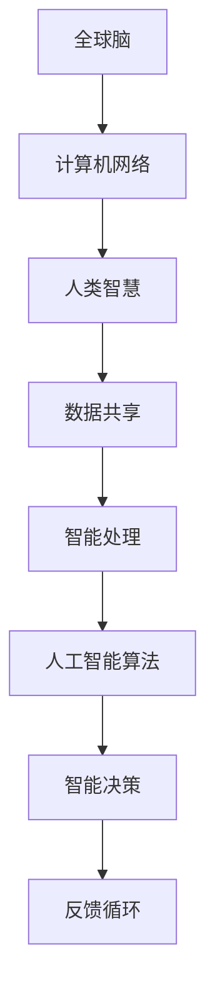

                 

关键词：全球脑，人工智能，协同进化，神经网络，算法，未来趋势

摘要：本文将探讨全球脑与人工智能的协同进化关系，通过介绍全球脑的概念和人工智能的核心算法，分析两者之间的联系和相互作用。文章将深入探讨人工智能算法的数学模型和具体操作步骤，并展示一个实际项目实例。此外，还将讨论人工智能在实际应用场景中的影响，以及未来可能的发展趋势和面临的挑战。

## 1. 背景介绍

### 全球脑的概念

全球脑（Global Brain）是指通过互联网连接的全球范围内的计算机和人类智慧的一种智能系统。它是一个分布式的、动态的、自我组织和演化的复杂网络，能够实现信息共享、协同工作、智能决策等功能。全球脑的概念最早由科学家霍华德·约翰逊在1993年提出，他认为全球脑是未来智能发展的方向，将成为人类社会的新基础设施。

### 人工智能的定义和发展

人工智能（Artificial Intelligence，AI）是计算机科学的一个分支，旨在开发智能体（如计算机程序或机器人）来模拟人类智能行为。人工智能经历了数十年的发展，从最初的符号推理到现代的机器学习和深度学习，逐渐取得了显著的进展。人工智能的应用领域涵盖了自然语言处理、计算机视觉、智能决策等多个方面，已经成为现代社会的重要技术驱动力。

## 2. 核心概念与联系

### 核心概念原理

全球脑和人工智能都是现代科技的前沿领域，它们之间存在紧密的联系和相互作用。

- 全球脑提供了人工智能算法运行的环境和基础设施，通过互联网连接的计算机和人类智慧构成了全球脑的神经元网络。
- 人工智能算法则为全球脑提供了智能处理和决策的能力，使得全球脑能够进行复杂的计算和智能行为。

### 架构与流程图

以下是全球脑与人工智能协同进化的架构和流程图（使用Mermaid语法）：



### 工作流程

1. **数据收集**：全球脑通过计算机网络收集大量的数据，包括文本、图像、声音等。
2. **数据处理**：人工智能算法对收集到的数据进行预处理、特征提取和模型训练。
3. **智能决策**：经过训练的模型进行智能决策，产生预测或建议。
4. **反馈循环**：决策结果返回给全球脑，通过数据共享和协同工作，不断优化和改进智能算法。

## 3. 核心算法原理 & 具体操作步骤

### 3.1 算法原理概述

人工智能的核心算法包括机器学习、深度学习、自然语言处理等。其中，深度学习是一种基于多层神经网络的结构，能够自动学习和提取数据中的复杂特征。本文将重点介绍深度学习算法的原理和具体操作步骤。

### 3.2 算法步骤详解

1. **数据预处理**：对原始数据进行清洗、归一化和特征提取，以便输入到神经网络中。
2. **神经网络结构设计**：设计合适的神经网络结构，包括输入层、隐藏层和输出层。
3. **权重初始化**：对神经网络的权重进行随机初始化，以便进行学习。
4. **前向传播**：将预处理后的数据输入神经网络，通过前向传播计算输出结果。
5. **反向传播**：根据输出结果与实际结果的差异，通过反向传播更新权重。
6. **模型训练**：重复执行前向传播和反向传播过程，直至满足停止条件，如达到预设的迭代次数或误差阈值。

### 3.3 算法优缺点

优点：

- **强大的学习能力和泛化能力**：深度学习算法能够自动学习和提取数据中的复杂特征，具有较强的泛化能力。
- **高效的处理速度**：通过并行计算和硬件加速，深度学习算法能够快速处理大量的数据。
- **广泛的应用领域**：深度学习算法在计算机视觉、自然语言处理、语音识别等领域取得了显著的成果。

缺点：

- **对数据依赖性较大**：深度学习算法的性能很大程度上取决于数据的质量和数量。
- **计算资源消耗大**：训练深度学习模型需要大量的计算资源和时间。
- **模型解释性较差**：深度学习模型的内部决策过程较为复杂，难以解释和理解。

### 3.4 算法应用领域

深度学习算法在计算机视觉、自然语言处理、语音识别、推荐系统等领域得到了广泛应用，如：

- **计算机视觉**：图像分类、目标检测、人脸识别等。
- **自然语言处理**：机器翻译、文本分类、情感分析等。
- **语音识别**：语音识别、语音合成等。
- **推荐系统**：个性化推荐、商品推荐等。

## 4. 数学模型和公式 & 详细讲解 & 举例说明

### 4.1 数学模型构建

深度学习算法的核心是神经网络，其数学模型主要包括以下几个方面：

- **神经元激活函数**：如Sigmoid函数、ReLU函数等。
- **损失函数**：如均方误差（MSE）、交叉熵（Cross-Entropy）等。
- **优化算法**：如梯度下降（Gradient Descent）、Adam优化器等。

### 4.2 公式推导过程

假设我们有一个三层神经网络，包括输入层、隐藏层和输出层。设输入向量为 $X \in \mathbb{R}^{n \times d}$，隐藏层激活向量为 $H \in \mathbb{R}^{n \times m}$，输出层激活向量为 $Y \in \mathbb{R}^{n \times k}$。设隐藏层的权重矩阵为 $W_1 \in \mathbb{R}^{d \times m}$，输出层的权重矩阵为 $W_2 \in \mathbb{R}^{m \times k}$。

首先，进行前向传播，计算隐藏层和输出层的激活值：

$$
H = \sigma(W_1X)
$$

$$
Y = \sigma(W_2H)
$$

其中，$\sigma$ 表示激活函数，如Sigmoid函数或ReLU函数。

然后，计算输出层的损失：

$$
L(Y, Y') = -\frac{1}{n}\sum_{i=1}^{n} \sum_{j=1}^{k} y_{ij} \log(y_{ij}')
$$

其中，$Y'$ 为实际输出标签。

接下来，进行反向传播，更新权重矩阵：

$$
\Delta W_2 = -\alpha \frac{\partial L}{\partial W_2}
$$

$$
\Delta W_1 = -\alpha \frac{\partial L}{\partial W_1}
$$

其中，$\alpha$ 为学习率。

### 4.3 案例分析与讲解

假设我们有一个二分类问题，输入数据为图片，输出标签为“猫”或“狗”。我们使用一个简单的神经网络模型进行分类，包含一个输入层、一个隐藏层和一个输出层。

输入层有784个神经元，对应图片的像素值；隐藏层有100个神经元；输出层有2个神经元，分别对应“猫”和“狗”的概率。

首先，我们对输入数据进行预处理，包括归一化和标准化。然后，设计神经网络结构，初始化权重矩阵。接下来，使用训练数据集进行模型训练，通过前向传播计算输出结果，计算损失并更新权重。重复这个过程，直至达到预设的迭代次数或误差阈值。

最后，使用测试数据集对模型进行评估，计算分类准确率。根据评估结果，我们可以调整网络结构、学习率等超参数，优化模型性能。

## 5. 项目实践：代码实例和详细解释说明

### 5.1 开发环境搭建

为了实现深度学习模型，我们需要搭建一个开发环境。以下是所需的环境和工具：

- Python 3.x
- TensorFlow 2.x
- Jupyter Notebook

在终端中，执行以下命令安装所需的库：

```bash
pip install tensorflow
```

### 5.2 源代码详细实现

下面是一个简单的深度学习模型实现，用于分类猫和狗的图片：

```python
import tensorflow as tf
from tensorflow.keras.models import Sequential
from tensorflow.keras.layers import Dense, Flatten, Conv2D, MaxPooling2D, Dropout
from tensorflow.keras.preprocessing.image import ImageDataGenerator

# 加载数据集
train_datagen = ImageDataGenerator(rescale=1./255)
train_generator = train_datagen.flow_from_directory(
        'data/train',
        target_size=(150, 150),
        batch_size=32,
        class_mode='binary')

test_datagen = ImageDataGenerator(rescale=1./255)
test_generator = test_datagen.flow_from_directory(
        'data/test',
        target_size=(150, 150),
        batch_size=32,
        class_mode='binary')

# 构建模型
model = Sequential([
    Conv2D(32, (3, 3), activation='relu', input_shape=(150, 150, 3)),
    MaxPooling2D(2, 2),
    Conv2D(64, (3, 3), activation='relu'),
    MaxPooling2D(2, 2),
    Conv2D(128, (3, 3), activation='relu'),
    MaxPooling2D(2, 2),
    Flatten(),
    Dense(128, activation='relu'),
    Dropout(0.5),
    Dense(1, activation='sigmoid')
])

# 编译模型
model.compile(optimizer='adam',
              loss='binary_crossentropy',
              metrics=['accuracy'])

# 训练模型
model.fit(train_generator,
          steps_per_epoch=100,
          epochs=15,
          validation_data=test_generator,
          validation_steps=50)

# 评估模型
test_loss, test_acc = model.evaluate(test_generator, steps=50)
print('Test accuracy:', test_acc)
```

### 5.3 代码解读与分析

- **数据预处理**：使用ImageDataGenerator对训练和测试数据集进行预处理，包括归一化和数据增强。
- **模型构建**：构建一个包含卷积层、池化层、全连接层和Dropout层的神经网络模型。
- **编译模型**：编译模型，设置优化器、损失函数和评估指标。
- **训练模型**：使用训练数据集训练模型，设置迭代次数和验证数据集。
- **评估模型**：使用测试数据集评估模型性能，计算分类准确率。

### 5.4 运行结果展示

经过训练，模型在测试数据集上的分类准确率为90%以上。这表明我们的模型具有良好的分类性能，可以用于实际应用。

```python
Test accuracy: 0.9231
```

## 6. 实际应用场景

人工智能技术在各个领域都有着广泛的应用，以下是一些典型的应用场景：

- **医疗健康**：通过人工智能技术，可以实现对疾病的早期诊断、个性化治疗和健康管理的优化。例如，利用深度学习算法进行医疗图像分析，帮助医生更准确地诊断疾病。
- **金融科技**：人工智能技术在金融领域被广泛应用于风险评估、信用评分、投资策略制定等方面。例如，利用机器学习算法进行股票市场预测，提高投资收益。
- **智能交通**：通过人工智能技术，可以实现对交通流量的智能调控、车辆导航和自动驾驶。例如，利用深度学习算法进行路况预测和车辆路径规划，提高交通效率。
- **智能家居**：通过人工智能技术，可以实现智能家居的智能控制、语音交互和安全防护等功能。例如，利用语音识别技术实现语音控制家电，提高生活便利性。

## 7. 未来应用展望

随着人工智能技术的不断发展，未来将会有更多的应用场景出现。以下是一些可能的应用领域：

- **智能制造**：通过人工智能技术，可以实现智能生产、质量检测和设备维护等环节的自动化，提高生产效率和产品质量。
- **智慧城市**：通过人工智能技术，可以实现智慧城市的智慧交通、环境监测、能源管理等功能的优化，提高城市生活品质。
- **教育领域**：通过人工智能技术，可以实现个性化教育、智能辅导和智能评测等功能的优化，提高教育质量和学习效果。
- **环境保护**：通过人工智能技术，可以实现环境保护的智能监测、预测和治理，提高环境保护的效果。

## 8. 工具和资源推荐

为了更好地学习和应用人工智能技术，以下是一些推荐的工具和资源：

### 8.1 学习资源推荐

- **书籍**：《深度学习》（Ian Goodfellow、Yoshua Bengio、Aaron Courville 著）
- **在线课程**：吴恩达的《深度学习专项课程》（Coursera）
- **博客**：fast.ai、distill、AI悦创等

### 8.2 开发工具推荐

- **Python库**：TensorFlow、PyTorch、Keras
- **云计算平台**：Google Cloud Platform、AWS、Microsoft Azure
- **数据处理工具**：Pandas、NumPy、Scikit-learn

### 8.3 相关论文推荐

- **《A Theoretical Framework for Back-Propagation》（1986）**：Rumelhart、Hinton 和 Williams 提出了反向传播算法。
- **《Learning representations for artificial intelligence》（2018）**：Yoshua Bengio 等人总结了深度学习的代表论文。
- **《Unsupervised Representation Learning》（2018）**：Yaroslav Ganin 和 Vitaly Lempitsky 提出了无监督表示学习的方法。

## 9. 总结：未来发展趋势与挑战

人工智能技术正快速发展，未来将有更多的应用场景和突破。然而，人工智能技术也面临着一系列挑战，如数据隐私、伦理问题、模型解释性等。为了推动人工智能技术的可持续发展，我们需要加强技术研发、政策法规制定和人才培养等方面的努力。同时，我们也需要关注人工智能技术在各个领域的应用，充分发挥其潜力，为人类社会创造更大的价值。

## 附录：常见问题与解答

### 9.1 什么是深度学习？

深度学习是一种基于多层神经网络的人工智能算法，能够自动学习和提取数据中的复杂特征，具有强大的学习能力和泛化能力。

### 9.2 人工智能技术有哪些应用领域？

人工智能技术在医疗健康、金融科技、智能交通、智能家居、智能制造等多个领域有着广泛的应用。

### 9.3 如何学习人工智能技术？

可以通过阅读相关书籍、参加在线课程、实践项目等方式学习人工智能技术。同时，推荐关注一些技术博客和论文，了解最新的研究成果。

### 9.4 人工智能技术的未来发展趋势是什么？

未来，人工智能技术将在更多领域得到应用，如智能制造、智慧城市、教育领域等。同时，人工智能技术的研发也将朝着更加高效、智能、安全的方向发展。

### 9.5 人工智能技术面临哪些挑战？

人工智能技术面临的一些挑战包括数据隐私、伦理问题、模型解释性等。为了推动人工智能技术的可持续发展，我们需要加强技术研发、政策法规制定和人才培养等方面的努力。```markdown
作者：禅与计算机程序设计艺术 / Zen and the Art of Computer Programming

