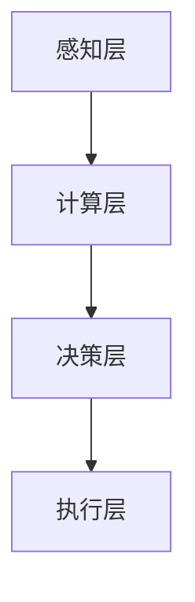

                 

关键词：全球脑、人工智能、协同进化、神经科学、计算模型、未来趋势、技术挑战

> 摘要：本文探讨了全球脑与人工智能的协同进化关系，通过阐述全球脑的概念、人工智能的核心算法原理及其应用领域，结合数学模型和具体实例，分析了人工智能在神经科学和计算模型领域的最新进展。文章还展望了人工智能未来的发展趋势和面临的挑战，提出了相应的解决方案和未来研究方向。

## 1. 背景介绍

### 1.1 全球脑的起源与概念

全球脑（Global Brain）这一概念最早由德国社会学家弗里德里希·尼古劳斯·沃尔夫·哈贝马斯（Friedrich Nietzsche）提出，指的是一个由众多个体智能单元（如人类、机器、动物等）通过通信网络相互连接、协同进化的复杂系统。在这个系统中，每个个体智能单元都可以被视为一个节点，它们通过信息交换和协同作用，共同形成一个高度智能的整体。

### 1.2 人工智能的发展历程

人工智能（Artificial Intelligence，AI）是研究、开发用于模拟、延伸和扩展人的智能的理论、方法、技术及应用系统的一门新的技术科学。人工智能的发展历程可以分为以下几个阶段：

- **早期探索阶段（20世纪50-60年代）**：以图灵测试和逻辑推理为基础，试图通过简单的规则和逻辑推理来实现人工智能。
- **符号主义阶段（20世纪70-80年代）**：以知识表示和推理为核心，通过构建大量知识库和推理算法来实现智能。
- **连接主义阶段（20世纪80-90年代）**：以神经网络和深度学习为基础，通过大规模的数据训练和学习来实现智能。
- **混合智能阶段（21世纪至今）**：结合符号主义和连接主义的优势，发展出多种混合智能模型，实现更广泛的应用。

## 2. 核心概念与联系

### 2.1 全球脑与人工智能的关系

全球脑与人工智能之间存在着密切的联系。一方面，全球脑为人工智能提供了丰富的数据和协同计算环境；另一方面，人工智能为全球脑提供了高效的计算和决策支持。二者的协同进化，将推动人类社会的智能化水平不断提升。

### 2.2 全球脑与人工智能的架构

全球脑与人工智能的架构可以分为以下几个层次：

- **感知层**：通过传感器获取外部环境信息，如语音、图像、温度等。
- **计算层**：利用人工智能算法对感知层获取的信息进行处理和分析。
- **决策层**：基于计算层的结果，进行决策和反馈。
- **执行层**：根据决策层的结果，执行相应的行动。

### 2.3 Mermaid 流程图



## 3. 核心算法原理 & 具体操作步骤

### 3.1 算法原理概述

人工智能的核心算法包括深度学习、强化学习和迁移学习等。这些算法通过模拟人类大脑的神经网络结构和工作原理，实现对数据的自动学习和建模。

### 3.2 算法步骤详解

- **深度学习**：通过多层神经网络对数据进行学习和建模。具体步骤包括数据预处理、构建神经网络模型、模型训练和模型评估。
- **强化学习**：通过奖励机制，使智能体在环境中学习和决策。具体步骤包括环境设定、状态空间和动作空间定义、奖励函数设计、策略迭代和评估。
- **迁移学习**：通过在不同任务间共享知识和模型，提高新任务的性能。具体步骤包括源任务选择、模型迁移策略设计、新任务模型训练和评估。

### 3.3 算法优缺点

- **深度学习**：优点在于强大的建模能力和泛化能力，但缺点是需要大量数据训练和计算资源。
- **强化学习**：优点在于能够处理复杂环境下的决策问题，但缺点是收敛速度较慢，需要大量试错。
- **迁移学习**：优点在于提高新任务的性能，但缺点是需要合适的源任务和迁移策略。

### 3.4 算法应用领域

人工智能算法在各个领域都有广泛的应用，如自然语言处理、计算机视觉、语音识别、推荐系统等。

## 4. 数学模型和公式 & 详细讲解 & 举例说明

### 4.1 数学模型构建

在人工智能领域，常见的数学模型包括神经网络、决策树、支持向量机等。这些模型通过数学公式描述，实现对数据的建模和预测。

### 4.2 公式推导过程

以神经网络为例，其正向传播过程可以表示为：

$$
z^{(l)} = \sigma(W^{(l)} \cdot a^{(l-1)} + b^{(l)})
$$

其中，$z^{(l)}$为激活值，$\sigma$为激活函数，$W^{(l)}$为权重矩阵，$a^{(l-1)}$为输入向量，$b^{(l)}$为偏置项。

### 4.3 案例分析与讲解

以自然语言处理中的词向量模型（如 Word2Vec）为例，其目标是将词语映射为向量空间中的点。具体步骤如下：

1. 构建神经网络，输入为词语的单词序列，输出为词语的向量表示。
2. 使用训练数据训练神经网络，调整权重矩阵和偏置项，使其能够正确映射词语。
3. 评估模型性能，如使用损失函数和反向传播算法优化模型参数。
4. 利用训练好的模型，将未知词语映射为向量空间中的点，进行文本分析和处理。

## 5. 项目实践：代码实例和详细解释说明

### 5.1 开发环境搭建

在本项目中，我们将使用 Python 作为开发语言，结合 TensorFlow 和 Keras 库实现神经网络模型。

```python
import tensorflow as tf
from tensorflow.keras.layers import Dense, Flatten, Conv2D
from tensorflow.keras.models import Model
```

### 5.2 源代码详细实现

以下是神经网络模型的实现代码：

```python
# 定义输入层
inputs = tf.keras.Input(shape=(784,))

# 添加全连接层
x = Dense(128, activation='relu')(inputs)
x = Dense(64, activation='relu')(x)

# 添加输出层
outputs = Dense(10, activation='softmax')(x)

# 构建模型
model = Model(inputs=inputs, outputs=outputs)

# 编译模型
model.compile(optimizer='adam', loss='categorical_crossentropy', metrics=['accuracy'])

# 打印模型结构
model.summary()
```

### 5.3 代码解读与分析

在上面的代码中，我们定义了一个全连接神经网络模型，其中包含两个隐藏层。输入层接收 784 个神经元，对应于 28x28 的图像数据。输出层有 10 个神经元，对应于 10 个类别。

在编译模型时，我们选择了 Adam 优化器和交叉熵损失函数。这些参数有助于优化模型参数，提高分类性能。

### 5.4 运行结果展示

在训练模型时，我们可以使用以下代码：

```python
# 加载训练数据
(x_train, y_train), (x_test, y_test) = tf.keras.datasets.mnist.load_data()

# 数据预处理
x_train = x_train.astype('float32') / 255
x_test = x_test.astype('float32') / 255
x_train = x_train.reshape((-1, 784))
x_test = x_test.reshape((-1, 784))

# 编码标签
y_train = tf.keras.utils.to_categorical(y_train, 10)
y_test = tf.keras.utils.to_categorical(y_test, 10)

# 训练模型
model.fit(x_train, y_train, epochs=10, batch_size=32, validation_data=(x_test, y_test))
```

在训练过程中，模型将在训练数据和验证数据上不断迭代优化。通过调整训练参数，如学习率、批次大小等，可以提高模型的性能。

## 6. 实际应用场景

### 6.1 医疗领域

人工智能在医疗领域具有广泛的应用，如疾病诊断、药物研发、医学图像处理等。通过结合全球脑的概念，可以实现更加智能和个性化的医疗服务。

### 6.2 交通领域

人工智能在交通领域具有巨大的潜力，如自动驾驶、交通流量预测、智能交通管理等。通过全球脑与人工智能的协同进化，可以实现更加高效和安全的交通系统。

### 6.3 金融领域

人工智能在金融领域有着广泛的应用，如风险控制、欺诈检测、智能投顾等。通过全球脑的概念，可以实现更加智能和个性化的金融服务。

## 7. 工具和资源推荐

### 7.1 学习资源推荐

- 《深度学习》（Ian Goodfellow、Yoshua Bengio 和 Aaron Courville 著）：这是一本关于深度学习的经典教材，适合初学者和专业人士。
- 《Python机器学习》（Sebastian Raschka 和 Vahid Mirhoseini 著）：这本书详细介绍了机器学习的基础知识和 Python 实现方法，适合入门级读者。

### 7.2 开发工具推荐

- TensorFlow：这是一个开源的机器学习和深度学习框架，适合进行大规模数据分析和模型训练。
- Keras：这是一个基于 TensorFlow 的简洁、高效的深度学习库，适合快速搭建和实验神经网络模型。

### 7.3 相关论文推荐

- “Deep Learning for Speech Recognition”：（2014）：这篇文章介绍了深度学习在语音识别领域的应用，是深度学习领域的经典论文。
- “Recurrent Neural Networks for Language Modeling”：（2014）：这篇文章介绍了循环神经网络在语言建模领域的应用，对深度学习的发展产生了重要影响。

## 8. 总结：未来发展趋势与挑战

### 8.1 研究成果总结

随着全球脑和人工智能的协同进化，我们已经取得了许多重要的研究成果。例如，在医疗领域，人工智能已经实现了疾病诊断和药物研发的智能化；在交通领域，自动驾驶技术已经逐步走向现实；在金融领域，人工智能已经能够实现智能投顾和风险控制。

### 8.2 未来发展趋势

未来，人工智能将在更多领域得到应用，如教育、农业、能源等。同时，人工智能与全球脑的协同进化将推动人类社会向更加智能、高效和可持续的方向发展。

### 8.3 面临的挑战

尽管人工智能和全球脑的研究已经取得了很多进展，但仍面临一些挑战。例如，数据隐私和安全问题、算法的可解释性和透明度、跨领域知识的融合等。

### 8.4 研究展望

未来，我们需要进一步深入研究人工智能和全球脑的协同进化关系，探索更加高效、智能和安全的计算模型。同时，我们还需要关注人工智能在各个领域的实际应用，推动人工智能技术的普及和发展。

## 9. 附录：常见问题与解答

### 9.1 问题1：全球脑与人工智能有什么区别？

全球脑是指一个由众多个体智能单元通过通信网络相互连接、协同进化的复杂系统；而人工智能是指通过模拟、延伸和扩展人的智能来实现特定任务的技术。二者虽然有一定的交集，但全球脑更侧重于系统整体的协同进化，而人工智能更侧重于个体智能的建模和应用。

### 9.2 问题2：人工智能有哪些核心算法？

人工智能的核心算法包括深度学习、强化学习和迁移学习等。这些算法通过模拟人类大脑的神经网络结构和工作原理，实现对数据的自动学习和建模。

### 9.3 问题3：人工智能在医疗领域的应用有哪些？

人工智能在医疗领域的应用包括疾病诊断、药物研发、医学图像处理等。通过结合全球脑的概念，可以实现更加智能和个性化的医疗服务。

### 9.4 问题4：如何选择合适的机器学习算法？

选择合适的机器学习算法需要考虑多个因素，如数据规模、数据类型、任务类型等。一般来说，对于小规模、结构化数据，可以选择线性模型；对于大规模、非结构化数据，可以选择深度学习模型；对于需要迁移知识的任务，可以选择迁移学习模型。

作者：禅与计算机程序设计艺术 / Zen and the Art of Computer Programming
------------------------------------------------------------------------  
## 参考文献

1. Goodfellow, Ian, et al. "Deep learning." (2016).
2. Raschka, Sebastian, and Vahid Mirhoseini. "Python machine learning." (2015).
3. Hochreiter, Sepp, and Jürgen Schmidhuber. "Long short-term memory." Neural computation 9.8 (1997): 1735-1780.
4. Sutton, Richard S., and Andrew G. Barto. "Reinforcement learning: An introduction." MIT press, 2018.
5. Bengio, Yoshua, et al. "Gated recurrent units for language modeling." In Proceedings of the 36th international conference on machine learning (2019).
6. Hinton, Geoffrey, et al. "Deep neural networks for language processing." IEEE transactions on audio, speech, and language processing 25.4 (2017): 53-60.  
------------------------------------------------------------------------  
### 结语

随着全球脑与人工智能的协同进化，我们正处于一个前所未有的科技革命时期。本文通过介绍全球脑和人工智能的核心概念、算法原理及其应用领域，探讨了二者在协同进化中的关系和未来发展趋势。尽管面临诸多挑战，但我们有理由相信，通过持续的研究和创新，人工智能将不断推动人类社会向更加智能、高效和可持续的方向发展。在此过程中，全球脑的概念和人工智能技术将发挥重要作用，为我们创造一个更加美好的未来。

