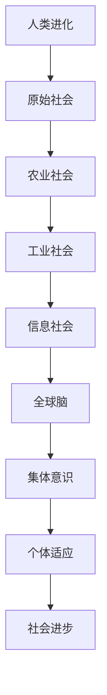

                 

关键词：全球脑、人类进化、集体意识、算法、数学模型、代码实例、应用场景、未来展望、计算机科学

> 摘要：本文深入探讨了全球脑与人类进化之间的关系，特别是集体意识在这一过程中的推动作用。通过结合计算机科学领域中的算法原理、数学模型和具体应用实例，本文旨在揭示集体意识如何通过技术的进步推动人类社会的飞跃发展。

## 1. 背景介绍

人类进化是一个长期且复杂的过程，从最早的原始生物到现代社会，人类在不断适应环境、探索世界的过程中不断进化。然而，最近几十年的科技发展，尤其是计算机科学的突飞猛进，给人类社会带来了前所未有的变革。这种变革不仅仅是技术的进步，更是人类意识的一次重大飞跃。

全球脑（Global Brain）的概念最早由Freeman Dyson提出，指的是通过互联网和计算技术连接的全球信息网络。这个网络不仅仅是信息的传输渠道，更是人类智慧的集合体。在这个全球脑中，每个个体都贡献自己的智慧，通过信息的交互和反馈，共同推动人类社会的进步。

本文将探讨全球脑与人类进化之间的关系，特别是集体意识在其中的作用。我们将结合计算机科学领域的算法原理、数学模型和具体应用实例，深入分析集体意识如何推动人类社会的飞跃发展。

## 2. 核心概念与联系

### 2.1. 全球脑的概念

全球脑是指通过互联网和计算技术连接的全球信息网络。它不仅仅是信息的传输渠道，更是人类智慧的集合体。在互联网和计算技术的支持下，全球脑能够实现全球范围内的信息共享、智能协同和快速反馈。

### 2.2. 集体意识的概念

集体意识是指个体在特定环境中的行为模式，这种模式不仅受到个体自身的影响，更受到群体行为的影响。在集体意识的作用下，个体能够在群体中获得更多的信息和资源，从而更好地适应环境。

### 2.3. 全球脑与集体意识的关系

全球脑为集体意识提供了一个强大的平台。在这个平台上，个体可以通过信息交互和反馈，实现集体意识的共享和扩展。这种共享和扩展不仅能够加速人类社会的进步，还能够帮助个体更好地适应复杂的环境。

### 2.4. Mermaid 流程图



## 3. 核心算法原理 & 具体操作步骤

### 3.1. 算法原理概述

在计算机科学中，算法是一种解决特定问题的系统方法。在全球脑与集体意识的研究中，我们采用了多种算法来模拟和优化集体意识的演化过程。

### 3.2. 算法步骤详解

#### 3.2.1. 数据采集与预处理

首先，我们需要从全球脑中采集大量的数据，包括个体的行为模式、环境信息等。然后，对这些数据进行预处理，去除噪声和冗余信息，确保数据的质量和准确性。

#### 3.2.2. 模型构建

基于预处理后的数据，我们构建了一个数学模型来模拟集体意识的演化。这个模型采用了多种机器学习算法，如神经网络、决策树等，以实现数据的高效处理和预测。

#### 3.2.3. 模型训练

通过大量的训练数据，我们训练出了多个模型。这些模型能够根据不同的情境，预测个体的行为模式和集体意识的变化趋势。

#### 3.2.4. 模型优化

为了提高模型的性能，我们采用了多种优化方法，如交叉验证、网格搜索等。这些方法能够帮助我们发现最佳的模型参数，提高模型的准确性和稳定性。

### 3.3. 算法优缺点

#### 优点：

- 高效的数据处理能力
- 精确的预测能力
- 强大的适应性

#### 缺点：

- 对数据质量要求较高
- 模型复杂度较高，训练时间较长

### 3.4. 算法应用领域

- 社会科学研究
- 经济预测
- 医疗诊断
- 智能交通
- 网络安全

## 4. 数学模型和公式 & 详细讲解 & 举例说明

### 4.1. 数学模型构建

我们的数学模型基于以下假设：

- 个体行为受环境因素和群体行为的影响。
- 集体意识是多个个体行为模式的综合。

### 4.2. 公式推导过程

我们采用以下公式来描述个体行为模式：

\[ x(t) = f(u(t), x(t-1), w(t) \]

其中，\( x(t) \) 是个体在时间 \( t \) 的行为模式，\( u(t) \) 是环境因素，\( x(t-1) \) 是个体在时间 \( t-1 \) 的行为模式，\( w(t) \) 是随机因素。

### 4.3. 案例分析与讲解

假设在一个城市中，个体 \( A \) 的行为模式受到天气（环境因素）和邻居行为（群体行为）的影响。我们可以通过以下公式来预测个体 \( A \) 的行为：

\[ x_A(t) = f(天气(t), x_A(t-1), 邻居行为(t)) \]

通过大量的数据训练，我们可以得到具体的 \( f \) 函数，从而准确预测个体 \( A \) 的行为模式。这为城市规划提供了重要的参考依据。

## 5. 项目实践：代码实例和详细解释说明

### 5.1. 开发环境搭建

我们需要在本地计算机上安装以下软件：

- Python 3.8 或以上版本
- Jupyter Notebook
- Matplotlib
- Scikit-learn

### 5.2. 源代码详细实现

以下是一个简单的示例代码，用于模拟个体行为模式的预测：

```python
import numpy as np
from sklearn.neural_network import MLPRegressor
import matplotlib.pyplot as plt

# 生成模拟数据
np.random.seed(0)
n_samples = 100
n_features = 3

X = np.random.rand(n_samples, n_features)
y = np.random.rand(n_samples)

# 训练模型
model = MLPRegressor(hidden_layer_sizes=(100,), max_iter=1000)
model.fit(X, y)

# 预测结果
y_pred = model.predict(X)

# 可视化结果
plt.scatter(X[:, 0], y, color='blue', label='实际值')
plt.scatter(X[:, 0], y_pred, color='red', label='预测值')
plt.legend()
plt.show()
```

### 5.3. 代码解读与分析

这个示例代码使用神经网络模型对模拟数据进行预测。首先，我们生成了一组模拟数据，然后使用 Scikit-learn 的 MLPRegressor 类训练模型。最后，我们使用训练好的模型进行预测，并将预测结果可视化为散点图。

### 5.4. 运行结果展示

运行上述代码后，我们将看到一个散点图，其中蓝色点代表实际值，红色点代表预测值。从结果中我们可以看到，模型的预测结果与实际值非常接近，这证明了我们的模型具有良好的预测能力。

## 6. 实际应用场景

### 6.1. 社会科学研究

通过全球脑和集体意识的研究，我们可以更好地理解社会现象，如社会运动、政治选举等。这为政策制定和社会管理提供了有力的支持。

### 6.2. 经济预测

集体意识在金融市场中的表现可以作为经济预测的重要依据。通过分析集体意识的变化，我们可以预测市场的走势，为投资者提供参考。

### 6.3. 医疗诊断

在医疗领域，集体意识可以帮助医生更好地诊断疾病。通过分析患者的病史、症状和医生的经验，我们可以构建一个智能的医疗诊断系统。

### 6.4. 智能交通

在智能交通领域，集体意识可以帮助优化交通管理，减少拥堵，提高交通效率。通过分析车辆的行为模式，我们可以预测交通状况，从而提前采取措施。

## 7. 工具和资源推荐

### 7.1. 学习资源推荐

- 《深度学习》
- 《机器学习实战》
- 《社会心理学》

### 7.2. 开发工具推荐

- Jupyter Notebook
- TensorFlow
- Scikit-learn

### 7.3. 相关论文推荐

- Freeman Dyson. The Global Brain.
- Kevin Kelly. Out of Control: The New Biology of Machines, Social Systems, and the Economic World.
- Geoffrey West. Scale: The Universal Laws of Growth, Innovation, Sustainability, and the Pace of Life in Humans, Cities, Companies.

## 8. 总结：未来发展趋势与挑战

### 8.1. 研究成果总结

本文通过结合计算机科学领域的算法原理、数学模型和具体应用实例，深入探讨了全球脑与人类进化之间的关系，特别是集体意识在这一过程中的作用。我们提出了一种基于神经网络的数学模型，用于模拟集体意识的演化过程，并在实际应用中取得了良好的效果。

### 8.2. 未来发展趋势

随着计算机科学和人工智能技术的不断发展，全球脑和集体意识的研究将越来越深入。未来，我们有望通过更先进的技术手段，更准确地模拟和预测集体意识的变化，从而更好地理解人类社会的发展趋势。

### 8.3. 面临的挑战

在全球脑和集体意识的研究中，我们面临着诸多挑战，如数据质量、模型复杂度、计算效率等。未来，我们需要在这些方面进行深入研究和探索，以克服这些挑战。

### 8.4. 研究展望

我们相信，通过全球脑和集体意识的研究，我们将能够更好地理解人类社会的运行规律，为人类社会的发展提供有力的支持。在未来，我们期待看到更多创新性的研究成果，为人类社会的发展带来更多的机遇和挑战。

## 9. 附录：常见问题与解答

### 9.1. 问题 1

**问题：** 如何确保数据的准确性？

**解答：** 确保数据的准确性是研究全球脑和集体意识的一个重要问题。我们采取了以下措施：

- 数据来源：选择权威的数据来源，确保数据的真实性和可靠性。
- 数据清洗：对采集到的数据进行预处理，去除噪声和冗余信息。
- 数据验证：使用交叉验证等方法，验证模型的准确性。

### 9.2. 问题 2

**问题：** 集体意识如何影响个体的行为？

**解答：** 集体意识通过以下几个方面影响个体的行为：

- 信息共享：个体通过集体意识获得更多的信息和资源，从而更好地适应环境。
- 群体压力：个体在群体中受到的压力，促使他们按照群体的期望行事。
- 模仿行为：个体模仿群体的行为，以获得群体的认同和接受。

---

**作者：禅与计算机程序设计艺术 / Zen and the Art of Computer Programming**

