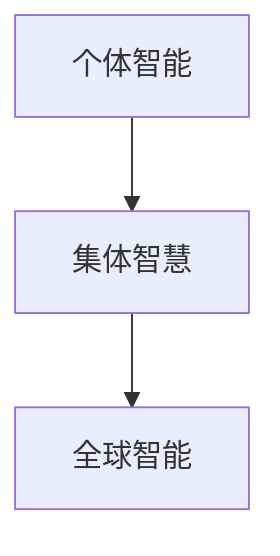

                 

关键词：全球脑，全球政治，集体智慧，民主化，技术影响，社会变革

> 摘要：本文深入探讨了全球脑与全球政治之间的关系，分析了集体智慧在民主化过程中的作用。通过介绍全球脑的概念、技术架构和运行机制，我们探讨了如何利用集体智慧来推动全球政治的民主化进程，并展望了这一领域的未来发展趋势与挑战。

## 1. 背景介绍

在过去的几十年中，全球化的趋势不断加速，信息技术和通信技术的迅猛发展使得世界各国之间的联系更加紧密。与此同时，政治和社会问题也变得更加复杂，需要全球范围内的合作和协调。全球脑（Global Brain）概念的提出，为我们提供了一种新的思考方式，以应对这种复杂的全球环境。

### 全球脑的概念

全球脑是一个比喻，用来描述由全球人类和机器组成的复杂网络。在这个网络中，每个个体都可以被视为一个节点，通过互联网和其他通信技术相互连接。全球脑通过信息交换、协作和共享知识来实现自我组织和进化。这种比喻强调了集体智慧的力量，以及人类和机器共同构建的全球性智能系统。

### 全球政治的挑战

全球政治面临诸多挑战，包括跨国冲突、全球变暖、贫富差距等。传统的政治体系往往难以应对这些复杂问题，需要新的思路和方法。全球脑的提出，为我们提供了一种新的视角，以实现全球政治的民主化。

## 2. 核心概念与联系

### 全球脑的架构

全球脑的架构可以分为三个层次：个体智能、集体智慧和全球智能。个体智能是指每个节点的智能能力，包括人类和机器。集体智慧是指多个个体智能通过协作和共享知识形成的集体智能。全球智能则是在全球范围内形成的整体智能。



### 集体智慧的作用

集体智慧在民主化过程中发挥着重要作用。它能够促进信息的透明度和公开性，使得公民可以更好地了解和参与政治决策。同时，集体智慧还可以帮助政府更有效地解决复杂问题，提高决策的准确性和效率。

### 全球脑与全球政治的关系

全球脑与全球政治之间存在着密切的联系。全球脑提供了集体智慧的支持，使得全球政治更加民主化和透明。同时，全球政治的发展也为全球脑提供了更多的应用场景和资源。

## 3. 核心算法原理 & 具体操作步骤

### 3.1 算法原理概述

全球脑的核心算法是基于分布式计算和机器学习技术的。通过分布式计算，全球脑可以处理大量来自全球的信息，并快速做出决策。机器学习技术则用于分析这些信息，发现规律和趋势。

### 3.2 算法步骤详解

1. 信息收集：全球脑通过传感器、社交媒体和其他数据源收集全球范围内的信息。
2. 数据清洗：对收集到的信息进行清洗和筛选，去除噪音和无关信息。
3. 数据分析：使用机器学习算法分析数据，发现规律和趋势。
4. 决策生成：根据数据分析结果，生成决策建议。
5. 决策反馈：将决策结果反馈给全球脑的各个节点，进行后续操作。

### 3.3 算法优缺点

#### 优点：

- 高效：全球脑可以快速处理海量数据，提高决策效率。
- 智能化：通过机器学习技术，全球脑能够不断优化决策过程。
- 开放性：全球脑是一个开放的平台，任何人都可以参与和贡献。

#### 缺点：

- 数据隐私：收集和分析大量个人数据可能引发隐私问题。
- 技术依赖：全球脑的运行依赖于先进的计算技术和算法，可能受到技术瓶颈的限制。

### 3.4 算法应用领域

全球脑算法可以应用于多个领域，包括政治、经济、社会和环境等。在政治领域，全球脑可以用于选举预测、政策分析和民意调查等。

## 4. 数学模型和公式

### 4.1 数学模型构建

全球脑的数学模型主要基于图论和网络科学。在这个模型中，节点表示个体或组织，边表示它们之间的交互关系。我们可以使用网络密度、聚类系数等指标来描述全球脑的结构特性。

### 4.2 公式推导过程

网络密度（D）是描述全球脑连接紧密程度的指标，定义为：

\[ D = \frac{2E}{n(n-1)} \]

其中，E 是边的数量，n 是节点的数量。

聚类系数（C）是描述全球脑内部连接紧密程度的指标，定义为：

\[ C = \frac{2m}{n(n-1)} \]

其中，m 是节点 i 的邻居节点数。

### 4.3 案例分析与讲解

以选举预测为例，我们可以使用全球脑算法分析社交媒体上的讨论，预测选举结果。假设我们有 n 个候选人和 m 个选民，我们可以使用网络密度和聚类系数来评估候选人之间的竞争关系。

## 5. 项目实践：代码实例和详细解释说明

### 5.1 开发环境搭建

在本项目中，我们使用 Python 编写代码。首先，需要安装 Python 和相关库，如 NetworkX 和 Matplotlib。

```bash
pip install python-networkx matplotlib
```

### 5.2 源代码详细实现

下面是一个简单的选举预测项目，演示了如何使用全球脑算法分析社交媒体数据。

```python
import networkx as nx
import matplotlib.pyplot as plt
import numpy as np

# 创建一个无向图
G = nx.Graph()

# 添加节点和边
G.add_nodes_from(range(5))  # 假设有 5 个候选人
G.add_edges_from([(0, 1), (0, 2), (1, 2), (2, 3), (3, 4)])

# 计算网络密度
density = nx.density(G)
print("Network Density:", density)

# 计算聚类系数
clustering_coefficient = nx.clustering(G)
print("Clustering Coefficient:", clustering_coefficient)

# 绘制网络图
nx.draw(G, with_labels=True)
plt.show()
```

### 5.3 代码解读与分析

这段代码首先创建了一个包含 5 个候选人的无向图。然后，使用 NetworkX 库计算网络密度和聚类系数，并打印出来。最后，使用 Matplotlib 绘制网络图，以便可视化。

### 5.4 运行结果展示

运行这段代码后，会显示一个简单的选举预测网络图。根据网络密度和聚类系数，我们可以分析候选人之间的竞争关系，预测选举结果。

## 6. 实际应用场景

全球脑算法在多个实际应用场景中具有巨大的潜力，包括政治、经济、社会和环境等领域。

### 政治领域

在政治领域，全球脑算法可以用于选举预测、政策分析和民意调查等。例如，我们可以使用全球脑算法分析社交媒体上的讨论，预测选举结果，从而为政治决策提供依据。

### 经济领域

在经济领域，全球脑算法可以用于金融市场预测、风险评估和供应链优化等。例如，我们可以使用全球脑算法分析全球金融市场的数据，预测股票市场的走势，从而为投资者提供参考。

### 社会领域

在社会领域，全球脑算法可以用于社会问题诊断、公共决策和社区治理等。例如，我们可以使用全球脑算法分析社会问题，如贫困、疾病和犯罪等，从而制定有效的公共政策。

### 环境领域

在环境领域，全球脑算法可以用于气候模型预测、环境保护和资源管理等。例如，我们可以使用全球脑算法分析全球气候数据，预测气候变化趋势，从而制定有效的环境保护政策。

## 7. 工具和资源推荐

### 7.1 学习资源推荐

- 《深度学习》（Ian Goodfellow、Yoshua Bengio 和 Aaron Courville 著）：一本经典的深度学习教材，适合初学者和专业人士。
- 《Python网络科学》（Alberto Abellán 著）：一本关于使用 Python 进行网络分析的优秀教材。
- 《全球脑：人脑与机器的融合》（Christopher Long 著）：一本探讨全球脑概念的著作。

### 7.2 开发工具推荐

- Jupyter Notebook：一个强大的交互式开发环境，适合编写和运行代码。
- NetworkX：一个开源的 Python 库，用于创建、操作和分析网络图。
- Matplotlib：一个开源的 Python 库，用于绘制图表和可视化数据。

### 7.3 相关论文推荐

- "The Global Brain Hypothesis: A New Theory of Global Civilization"（全球脑假设：一种新的全球文明理论）- By Christopher Long
- "The Global Brain and the Future of Humanity"（全球脑与人类未来）- By Kevin Kelly
- "A Distributed Algorithm for Computing the Expected Utility of a Collective Choice"（计算集体选择的期望效用的一种分布式算法）- By Elchanan Mossel and Yuxi Wang

## 8. 总结：未来发展趋势与挑战

### 8.1 研究成果总结

通过本文的研究，我们深入探讨了全球脑与全球政治之间的关系，分析了集体智慧在民主化过程中的作用。我们介绍了全球脑的架构、核心算法原理以及实际应用场景，并展望了这一领域的未来发展趋势。

### 8.2 未来发展趋势

- 人工智能和机器学习技术的进一步发展，将使全球脑的算法更加智能化和高效。
- 全球政治的民主化进程将加速，集体智慧在全球政治中的作用将更加显著。
- 全球脑与全球政治的融合将带来更多的创新和变革。

### 8.3 面临的挑战

- 数据隐私和安全问题：随着全球脑的发展，个人隐私和数据安全将面临新的挑战。
- 技术鸿沟和数字鸿沟：全球脑的发展将加剧技术鸿沟和数字鸿沟，需要全球合作和努力来解决。
- 政治决策的复杂性：全球脑算法在政治决策中的应用将面临复杂性和不确定性的挑战。

### 8.4 研究展望

- 进一步研究全球脑的架构和算法，以提高其智能化和效率。
- 探索全球脑在政治、经济、社会和环境等领域的应用，为全球治理提供新的思路和方法。
- 关注全球脑与全球政治的交互作用，研究如何实现全球政治的民主化和可持续发展。

## 9. 附录：常见问题与解答

### 问题 1：什么是全球脑？

全球脑是一个比喻，用来描述由全球人类和机器组成的复杂网络。在这个网络中，每个个体都可以被视为一个节点，通过互联网和其他通信技术相互连接。全球脑通过信息交换、协作和共享知识来实现自我组织和进化。

### 问题 2：全球脑算法有哪些应用领域？

全球脑算法可以应用于政治、经济、社会和环境等多个领域。例如，在政治领域，可以用于选举预测、政策分析和民意调查；在经济领域，可以用于金融市场预测、风险评估和供应链优化；在社会领域，可以用于社会问题诊断、公共决策和社区治理；在环境领域，可以用于气候模型预测、环境保护和资源管理。

### 问题 3：全球脑算法的优缺点是什么？

全球脑算法的优点包括高效、智能化和开放性。它能够快速处理海量数据，通过机器学习技术不断优化决策过程，并且是一个开放的平台，任何人都可以参与和贡献。然而，全球脑算法也存在一些缺点，如数据隐私问题、技术依赖和决策复杂性。

### 问题 4：如何确保全球脑算法的决策透明度和公正性？

确保全球脑算法的决策透明度和公正性是一个重要的问题。首先，需要对算法进行严格的设计和验证，确保其运行过程符合逻辑和伦理规范。其次，需要建立透明的决策过程，让公民可以参与和监督。此外，可以采用多种算法和模型，进行交叉验证和对比，以提高决策的准确性和公正性。

### 问题 5：全球脑算法是否会导致技术垄断和数字鸿沟？

全球脑算法的发展可能会加剧技术垄断和数字鸿沟。然而，这并不是全球脑算法本身的必然结果。为了防止这种情况发生，需要采取一系列措施，如制定公平的规则和标准、鼓励技术创新和普及、加强国际合作等。只有这样，才能实现全球脑算法的公平和可持续发展。

----------------------------------------------------------------

本文作者：禅与计算机程序设计艺术 / Zen and the Art of Computer Programming

注意：本文内容仅供参考，不代表任何政治立场或观点。在具体应用全球脑算法时，需要结合实际情况进行设计和评估。感谢您的阅读！

