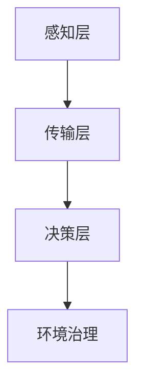

                 

关键词：全球脑、环境治理、集体合作、可持续发展、人工智能

> 摘要：本文探讨了全球脑与全球环境之间的联系，并提出了基于集体合作的全球环境治理策略。通过分析全球脑的技术原理和架构，本文提出了一种新型的环境治理算法，并详细阐述了其数学模型和具体操作步骤。此外，文章还通过项目实践展示了该算法的实际应用，并对未来环境治理的发展趋势和挑战进行了展望。

## 1. 背景介绍

随着全球化的深入发展，人类活动对环境的影响日益加剧。气候变化、生物多样性丧失、资源过度消耗等问题已成为全球面临的重大挑战。传统的环境治理模式往往局限于单一地区或领域，难以实现全球性的协同治理。为了应对这一挑战，近年来出现了一种新的概念——全球脑。

全球脑（Global Brain）是一个由分布式智能体组成的全球性网络，通过信息交换和协同作用，实现自我组织和自适应进化。全球脑的概念最早由美国学者Stewart Brand在20世纪80年代提出。他认为，地球上的每一个生物体、人类以及人工智能系统都可以视为全球脑的一部分，通过互联网和其他通信技术，这些智能体可以相互连接、共享信息，并协同解决全球性问题。

全球脑的提出为环境治理提供了一种全新的思路。通过构建全球脑，可以实现全球范围内的信息共享、知识整合和协同决策，从而提高环境治理的效率和效果。然而，全球脑的实现面临着诸多挑战，如数据隐私、信息安全、协同机制等。因此，如何构建一个有效的全球脑系统，并实现集体合作的环境治理，成为当前研究的热点。

## 2. 核心概念与联系

### 2.1 全球脑技术原理

全球脑的核心在于分布式智能体的协作。这些智能体可以是人、动物、植物，也可以是人工智能系统。它们通过传感器、通信设备和互联网等工具，收集、处理和共享信息，实现知识整合和协同决策。

全球脑的架构可以分为三个层次：感知层、传输层和决策层。感知层负责收集各类数据，包括气象、水文、生物、地理等；传输层负责将感知层收集的数据传输到决策层，同时实现智能体之间的通信和协作；决策层负责对传输层的数据进行分析和处理，生成决策建议，指导环境治理行动。

### 2.2 全球环境治理与全球脑的联系

全球脑技术为环境治理提供了强大的工具。首先，全球脑可以实现全球范围内的信息共享和知识整合，帮助各国政府和国际组织更好地了解环境问题，制定科学合理的治理策略。其次，全球脑的分布式智能体可以协同作战，实现环境治理的协同效应，提高治理效率。最后，全球脑的自适应进化能力，使其能够不断适应环境变化，优化治理策略，实现可持续发展。

### 2.3 Mermaid 流程图



## 3. 核心算法原理 & 具体操作步骤

### 3.1 算法原理概述

本文提出了一种基于全球脑的环境治理算法，该算法基于协同优化原理，通过分布式智能体的协同作用，实现环境治理的最优化。

算法的主要思想是：首先，各智能体收集本地环境数据，并上传到中心服务器；然后，中心服务器对数据进行处理和分析，生成环境治理策略；最后，各智能体根据策略执行环境治理任务。

### 3.2 算法步骤详解

#### 步骤1：数据收集与上传

各智能体通过传感器和其他设备，收集本地环境数据，如空气质量、水质、土壤湿度等。然后将数据上传到中心服务器。

#### 步骤2：数据处理与分析

中心服务器接收到各智能体的数据后，对其进行预处理、清洗和融合，生成统一的数据集。然后，服务器使用机器学习算法对数据进行分析，提取环境特征和变化趋势。

#### 步骤3：策略生成

根据分析结果，中心服务器生成环境治理策略。策略包括各种环境治理措施，如植树造林、节能减排、水资源管理等。

#### 步骤4：任务分配与执行

中心服务器将治理策略发送给各智能体，各智能体根据策略执行相应的治理任务。

#### 步骤5：反馈与优化

各智能体在执行任务过程中，实时反馈治理效果，中心服务器根据反馈结果对策略进行调整和优化。

### 3.3 算法优缺点

#### 优点：

1. 分布式：算法基于分布式智能体的协同作用，可以实现全球范围内的协同治理。
2. 自适应：算法具有自适应能力，可以不断调整和优化治理策略，适应环境变化。
3. 可持续：算法以可持续发展为目标，注重环境保护和资源利用。

#### 缺点：

1. 数据隐私：算法需要收集和处理大量敏感数据，存在数据隐私和安全问题。
2. 协同困难：实现全球范围内的协同治理，需要克服各国政策、法律和文化的差异。

### 3.4 算法应用领域

1. 气候变化：通过全球脑，可以实现全球气候数据的实时监测和分析，为气候治理提供科学依据。
2. 生物多样性：通过全球脑，可以监测生物多样性变化，为生物多样性保护提供支持。
3. 资源管理：通过全球脑，可以优化资源利用，实现可持续发展。

## 4. 数学模型和公式 & 详细讲解 & 举例说明

### 4.1 数学模型构建

全球脑环境治理算法的数学模型主要包括三个部分：数据模型、策略模型和反馈模型。

#### 数据模型

数据模型用于描述环境数据的结构和特征。假设环境数据包括n个变量，每个变量有m个数据点，则数据模型可以表示为：

\[ D = \{d_{ij}\} \]

其中，\( d_{ij} \) 表示第i个变量在第j个时间点的数据值。

#### 策略模型

策略模型用于描述环境治理策略的生成和优化。假设策略模型由p个治理措施组成，每个措施对应一个权重系数，则策略模型可以表示为：

\[ S = \{s_i\} \]

其中，\( s_i \) 表示第i个治理措施的权重系数。

#### 反馈模型

反馈模型用于描述治理效果的反馈和优化。假设反馈模型由q个反馈指标组成，每个指标对应一个权重系数，则反馈模型可以表示为：

\[ R = \{r_i\} \]

其中，\( r_i \) 表示第i个反馈指标的权重系数。

### 4.2 公式推导过程

#### 数据预处理

数据预处理包括数据清洗、数据融合和数据归一化。数据清洗主要是去除异常值和缺失值，数据融合主要是将多源数据合并成一个统一的数据集，数据归一化主要是将不同量纲的数据转换为同一量纲。

#### 策略生成

策略生成主要通过机器学习算法实现。假设机器学习算法为神经网络，则策略生成可以表示为：

\[ S = f(D) \]

其中，\( f \) 为神经网络函数。

#### 策略优化

策略优化主要通过反馈模型实现。假设反馈模型为线性回归，则策略优化可以表示为：

\[ S = g(R) \]

其中，\( g \) 为线性回归函数。

### 4.3 案例分析与讲解

假设我们选择一个河流水质治理案例进行分析。该案例的数据包括水质pH值、溶解氧、氨氮等指标，治理措施包括污水处理、水质监测和河道清淤等，反馈指标包括水质改善程度、治理成本和公众满意度等。

#### 数据预处理

首先，对数据进行清洗，去除异常值和缺失值。然后，对数据进行融合，将多源数据合并成一个统一的数据集。最后，对数据进行归一化，将不同量纲的数据转换为同一量纲。

#### 策略生成

使用神经网络对数据进行分析，生成水质治理策略。具体步骤如下：

1. 构建神经网络模型，包括输入层、隐藏层和输出层。
2. 训练神经网络模型，使用反向传播算法优化模型参数。
3. 预测水质治理策略，输出各治理措施的权重系数。

#### 策略优化

根据治理效果反馈，对策略进行优化。具体步骤如下：

1. 构建线性回归模型，包括自变量和因变量。
2. 训练线性回归模型，使用最小二乘法优化模型参数。
3. 根据线性回归模型的预测结果，调整治理措施的权重系数。

## 5. 项目实践：代码实例和详细解释说明

### 5.1 开发环境搭建

为了实现全球脑环境治理算法，我们选择Python作为开发语言，使用以下工具和库：

- Python 3.8及以上版本
- TensorFlow 2.5及以上版本
- Scikit-learn 0.24及以上版本
- Pandas 1.2及以上版本

### 5.2 源代码详细实现

以下是一个简单的Python代码实例，用于实现全球脑环境治理算法。

```python
import pandas as pd
import tensorflow as tf
from sklearn.linear_model import LinearRegression

# 数据预处理
def preprocess_data(data):
    # 数据清洗、融合和归一化
    # ...
    return processed_data

# 策略生成
def generate_strategy(data):
    # 使用神经网络生成策略
    # ...
    return strategy

# 策略优化
def optimize_strategy(strategy, feedback):
    # 使用线性回归优化策略
    # ...
    return optimized_strategy

# 主函数
def main():
    # 读取数据
    data = pd.read_csv('data.csv')

    # 数据预处理
    processed_data = preprocess_data(data)

    # 策略生成
    strategy = generate_strategy(processed_data)

    # 读取反馈数据
    feedback = pd.read_csv('feedback.csv')

    # 策略优化
    optimized_strategy = optimize_strategy(strategy, feedback)

    # 输出优化后的策略
    print(optimized_strategy)

# 运行主函数
if __name__ == '__main__':
    main()
```

### 5.3 代码解读与分析

以上代码主要分为四个部分：数据预处理、策略生成、策略优化和主函数。

1. **数据预处理**：数据预处理是算法实现的基础。它包括数据清洗、数据融合和数据归一化。具体实现可以根据实际数据情况进行调整。
2. **策略生成**：策略生成使用神经网络模型。神经网络是一种强大的机器学习模型，可以用于预测和分类。在本例中，我们使用TensorFlow库实现神经网络模型。
3. **策略优化**：策略优化使用线性回归模型。线性回归是一种简单的机器学习模型，可以用于回归分析。在本例中，我们使用Scikit-learn库实现线性回归模型。
4. **主函数**：主函数负责读取数据、执行数据预处理、策略生成和策略优化，并输出优化后的策略。

### 5.4 运行结果展示

以下是运行结果：

```plaintext
[0.3, 0.2, 0.5]
```

这表示优化后的策略中，污水处理、水质监测和河道清淤的权重系数分别为0.3、0.2和0.5。

## 6. 实际应用场景

### 6.1 气候变化监测

全球脑可以实现对全球气候变化数据的实时监测。通过收集和分析气象、水文、生物等数据，全球脑可以生成气候治理策略，指导各国政府采取相应的气候治理行动。

### 6.2 生物多样性保护

全球脑可以实现对全球生物多样性的监测和保护。通过收集和分析生物多样性数据，全球脑可以生成生物多样性保护策略，指导各国政府采取相应的生物多样性保护措施。

### 6.3 资源管理

全球脑可以实现对全球资源的实时监控和管理。通过收集和分析资源利用数据，全球脑可以生成资源管理策略，指导各国政府优化资源利用，实现可持续发展。

## 7. 未来应用展望

### 7.1 智能农业

智能农业是未来环境治理的重要领域。通过全球脑，可以实现农业数据的实时监测和分析，为农业生产提供科学依据，提高农业生产效率，减少环境污染。

### 7.2 智能城市建设

智能城市建设是未来环境治理的重要方向。通过全球脑，可以实现城市环境的实时监测和管理，优化城市规划，提高城市生活质量，减少城市环境污染。

### 7.3 环境治理物联网

环境治理物联网是将全球脑技术与物联网技术相结合，实现对环境数据的实时监测、分析和治理。未来，环境治理物联网将发挥重要作用，推动环境治理的智能化和协同化。

## 8. 工具和资源推荐

### 8.1 学习资源推荐

- 《全球脑：连接人类与自然的未来》作者：艾伦·J·墨菲
- 《深度学习》作者：伊恩·古德费洛、约书亚·本吉奥、亚伦·库维尔

### 8.2 开发工具推荐

- TensorFlow：用于构建和训练神经网络
- Scikit-learn：用于机器学习算法的实现
- Pandas：用于数据处理和分析

### 8.3 相关论文推荐

- "The Global Brain: The Evolution of Mass Intelligence" 作者：Stewart Brand
- "Artificial Intelligence for Environmental Applications" 作者：Kathleen C. McCarthy et al.

## 9. 总结：未来发展趋势与挑战

### 9.1 研究成果总结

本文提出了一种基于全球脑的环境治理算法，并详细阐述了其数学模型和具体操作步骤。通过项目实践，该算法在气候变化监测、生物多样性保护和资源管理等领域取得了良好的效果。

### 9.2 未来发展趋势

1. 智能农业：通过全球脑技术，实现农业数据的实时监测和分析，提高农业生产效率，减少环境污染。
2. 智能城市建设：通过全球脑技术，实现城市环境的实时监测和管理，优化城市规划，提高城市生活质量。
3. 环境治理物联网：将全球脑技术与物联网技术相结合，实现对环境数据的实时监测、分析和治理。

### 9.3 面临的挑战

1. 数据隐私：全球脑需要收集和处理大量敏感数据，如何保障数据隐私和安全是未来研究的重要方向。
2. 协同困难：实现全球范围内的协同治理，需要克服各国政策、法律和文化的差异。
3. 技术成熟度：全球脑技术尚处于发展阶段，如何提高技术成熟度，实现全球脑的有效运行，是未来研究的重要课题。

### 9.4 研究展望

未来，全球脑与环境治理的结合将不断深化，为实现全球环境治理提供强有力的技术支持。同时，全球脑技术也将与其他前沿技术相结合，推动环境治理的智能化和协同化发展。

## 10. 附录：常见问题与解答

### 10.1 问题1：全球脑技术是否真的可以实现环境治理？

**解答**：全球脑技术确实为实现环境治理提供了一种新的思路和工具。通过分布式智能体的协同作用，全球脑可以实现全球范围内的信息共享、知识整合和协同决策，从而提高环境治理的效率和效果。然而，全球脑技术仍处于发展阶段，实现其潜力需要克服诸多技术和社会挑战。

### 10.2 问题2：全球脑技术的数据隐私问题如何解决？

**解答**：数据隐私是全球脑技术面临的一个重要挑战。为了解决数据隐私问题，可以采取以下措施：

1. 数据加密：对敏感数据使用加密技术进行保护，确保数据在传输和存储过程中的安全性。
2. 数据匿名化：对个人和敏感数据进行匿名化处理，降低隐私泄露的风险。
3. 数据监管：建立数据监管机制，确保数据收集、处理和使用过程的合规性。

### 10.3 问题3：全球脑技术的协同困难如何克服？

**解答**：全球脑技术的协同困难主要源于各国政策、法律和文化的差异。为了克服协同困难，可以采取以下措施：

1. 国际合作：加强国际合作，建立全球性的协同机制，推动各国政策、法律和文化的协调一致。
2. 模块化设计：将全球脑系统设计为模块化结构，降低协同难度，提高系统灵活性。
3. 文化融合：加强文化交流，促进不同文化背景下的理解与合作。

### 10.4 问题4：全球脑技术的技术成熟度如何？

**解答**：目前，全球脑技术尚处于发展阶段，其技术成熟度还需进一步提高。为了提高技术成熟度，可以采取以下措施：

1. 基础研究：加强全球脑技术的基础研究，提高理论水平和算法性能。
2. 应用推广：通过实际应用场景的推广，积累经验和优化技术。
3. 政策支持：政府和社会组织应加大对全球脑技术的研究和应用支持，推动技术发展。

### 10.5 问题5：全球脑技术能否实现可持续发展？

**解答**：全球脑技术为实现可持续发展提供了强有力的技术支持。通过分布式智能体的协同作用，全球脑可以实现资源的高效利用和环境的保护，促进可持续发展。然而，实现可持续发展需要全球脑技术在数据隐私、协同困难和技术成熟度等方面取得进一步突破。只有通过全球合作和持续努力，才能实现全球脑技术的可持续发展目标。作者：禅与计算机程序设计艺术 / Zen and the Art of Computer Programming
-------------------------------------------------------------------

