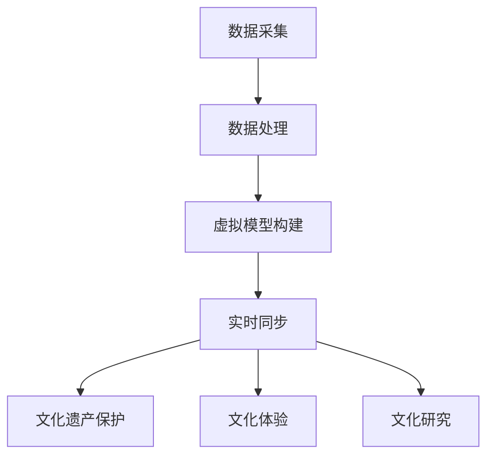

                 

关键词：全球脑，数字孪生，文化研究，人工智能，数据分析，交互设计

## 摘要

本文旨在探讨数字孪生技术在文化研究领域中的应用。数字孪生是一种通过创建物理实体的虚拟副本，实现对现实世界的高度仿真的技术。在全球脑这一概念的背景下，数字孪生技术为文化研究提供了一种全新的视角和工具，能够促进对复杂文化现象的理解。本文首先介绍了全球脑和数字孪生的基本概念，然后分析了数字孪生技术在文化研究中的应用场景，并探讨了其在提高文化研究效率、提升用户体验方面的潜力。通过具体案例，本文展示了数字孪生技术在文化研究中的实际应用，并对未来的发展前景进行了展望。

## 1. 背景介绍

### 全球脑

全球脑（Global Brain）是由计算机科学家凯文·凯利（Kevin Kelly）在其著作《全球脑：未来的进化》（The Global Brain: The Evolution of Humanity in the Biosphere）中提出的一个概念。全球脑被视为一个巨大的分布式计算系统，由人类、生物、机器、网络等构成，它们通过信息交换和协同作用实现自我进化。在全球脑的框架下，个体智能通过互联网和社交媒体等渠道进行信息交流和知识共享，从而形成一个超有机体的智能系统。

### 数字孪生

数字孪生（Digital Twin）是一种新兴技术，它通过创建物理对象的虚拟副本，实现对现实世界的实时模拟和监控。数字孪生技术最早由Michael Grieves于2002年提出，他将其描述为“一个实体的数字化映射，用于模拟、分析和预测该实体的性能、状态和行为”。数字孪生技术的核心是构建一个虚拟模型，该模型可以与物理实体同步更新，从而实现对实际对象的实时监控和预测。

### 数字孪生与全球脑的联系

数字孪生与全球脑之间存在着密切的联系。数字孪生技术可以为全球脑提供物理实体的虚拟副本，使得全球脑中的信息交换和协同作用更加高效和精准。通过数字孪生技术，全球脑中的个体智能可以实现对物理世界的实时监控和预测，从而提高整个系统的适应性和反应速度。此外，数字孪生技术还可以为全球脑提供一种全新的交互方式，使得个体智能能够更加直观和便捷地与物理世界进行互动。

## 2. 核心概念与联系

### 2.1 数字孪生技术原理

数字孪生技术的核心在于创建物理实体的虚拟副本。这个虚拟副本不仅包含了物理实体的结构和属性，还包括了其行为和状态。数字孪生技术的实现通常包括以下几个步骤：

1. **数据采集**：通过传感器、摄像头、GPS等技术手段，实时采集物理实体的数据，包括位置、温度、压力、振动等。
2. **数据处理**：对采集到的数据进行处理，包括去噪、滤波、特征提取等，以便于构建虚拟副本。
3. **虚拟模型构建**：基于处理后的数据，使用3D建模、计算机图形学等技术构建物理实体的虚拟副本。
4. **实时同步**：通过数据通信技术，将虚拟副本与物理实体保持实时同步，确保虚拟副本反映物理实体的当前状态。

### 2.2 数字孪生技术在文化研究中的应用

数字孪生技术在文化研究中的应用主要体现在以下几个方面：

1. **文化遗产保护**：通过数字孪生技术，可以创建文化遗产的虚拟副本，实现对文化遗产的永久保存和展示。例如，通过虚拟现实（VR）技术，用户可以在家中体验历史建筑和艺术品。
2. **文化体验**：数字孪生技术可以为用户提供沉浸式的文化体验。例如，在博物馆中，通过数字孪生技术，用户可以穿越到古代，与历史人物互动。
3. **文化研究**：数字孪生技术为文化研究者提供了新的研究工具。通过虚拟副本，研究者可以实时监测文化现象的变化，从而提高研究的效率和精度。

### 2.3 Mermaid 流程图

以下是一个简单的Mermaid流程图，展示了数字孪生技术在文化研究中的应用流程：



## 3. 核心算法原理 & 具体操作步骤

### 3.1 算法原理概述

数字孪生技术的核心在于构建物理实体的虚拟副本，并保持与物理实体的实时同步。这通常涉及以下几个关键步骤：

1. **传感器融合**：通过融合多种传感器数据，获取物理实体的完整信息。
2. **数据预处理**：对传感器数据进行预处理，包括去噪、滤波、特征提取等。
3. **虚拟模型构建**：基于预处理后的数据，使用3D建模等技术构建物理实体的虚拟副本。
4. **同步机制**：通过实时同步机制，确保虚拟副本反映物理实体的当前状态。

### 3.2 算法步骤详解

1. **数据采集**：
   - 使用传感器（如GPS、加速度计、温度传感器等）采集物理实体的数据。
   - 将采集到的数据传输到中央处理单元。

2. **数据处理**：
   - 对采集到的数据进行预处理，包括去噪、滤波等，以提高数据质量。
   - 使用特征提取技术，从数据中提取关键特征，如位置、速度、加速度等。

3. **虚拟模型构建**：
   - 基于提取的特征，使用3D建模技术构建物理实体的虚拟副本。
   - 对虚拟模型进行细化和优化，以提高模型的准确性和实时性。

4. **实时同步**：
   - 通过实时同步机制，将虚拟模型与物理实体保持同步。
   - 当物理实体的状态发生变化时，及时更新虚拟模型。

### 3.3 算法优缺点

**优点**：
- 高度仿真：数字孪生技术能够创建与物理实体高度相似的虚拟副本，实现对现实世界的精准模拟。
- 实时同步：通过实时同步机制，虚拟副本能够及时反映物理实体的状态变化，提高系统的反应速度。
- 资源节约：通过虚拟副本，可以减少对物理资源的依赖，节约成本。

**缺点**：
- 数据质量：数据采集和处理的质量直接影响数字孪生的准确性，需要高质量的传感器和数据预处理技术。
- 实时性能：实时同步机制需要高效的数据传输和处理能力，以应对物理实体的快速变化。

### 3.4 算法应用领域

数字孪生技术广泛应用于多个领域，包括但不限于：

- 文化遗产保护：通过数字孪生技术，可以创建文化遗产的虚拟副本，实现对文化遗产的永久保存和展示。
- 建筑设计：数字孪生技术可以用于建筑设计和施工，提高建筑的安全性和可靠性。
- 医疗健康：数字孪生技术可以用于医疗诊断和治疗，通过虚拟模型，医生可以更准确地诊断和治疗疾病。
- 制造业：数字孪生技术可以用于制造业的自动化和优化，提高生产效率和质量。

## 4. 数学模型和公式 & 详细讲解 & 举例说明

### 4.1 数学模型构建

数字孪生技术的数学模型主要涉及传感器数据处理、虚拟模型构建和实时同步三个方面。

#### 4.1.1 传感器数据处理

传感器数据处理主要包括传感器数据的预处理和特征提取。以下是一个简化的传感器数据处理模型：

$$
y = \sum_{i=1}^{n} w_i x_i + b
$$

其中，$y$ 表示预处理后的数据，$x_i$ 表示原始传感器数据，$w_i$ 表示权重，$b$ 表示偏置。

#### 4.1.2 虚拟模型构建

虚拟模型构建主要涉及3D建模技术。以下是一个简化的3D建模模型：

$$
M = F(N)
$$

其中，$M$ 表示虚拟模型，$F$ 表示3D建模函数，$N$ 表示原始数据。

#### 4.1.3 实时同步

实时同步主要涉及数据传输和处理。以下是一个简化的实时同步模型：

$$
s(t) = f(y(t))
$$

其中，$s(t)$ 表示虚拟副本的状态，$y(t)$ 表示物理实体的状态，$f$ 表示同步函数。

### 4.2 公式推导过程

#### 4.2.1 传感器数据处理

传感器数据处理中的预处理和特征提取通常通过线性回归模型实现。以下是对线性回归模型的推导过程：

$$
\min_{w,b} \sum_{i=1}^{n} (y_i - \sum_{j=1}^{m} w_j x_{ij})^2
$$

对 $w$ 和 $b$ 分别求偏导并令其为零，得到：

$$
\frac{\partial}{\partial w} \sum_{i=1}^{n} (y_i - \sum_{j=1}^{m} w_j x_{ij})^2 = 0 \\
\frac{\partial}{\partial b} \sum_{i=1}^{n} (y_i - \sum_{j=1}^{m} w_j x_{ij})^2 = 0
$$

解得：

$$
w = (X^T X)^{-1} X^T y \\
b = y - X w
$$

其中，$X$ 表示数据矩阵，$y$ 表示目标值。

#### 4.2.2 虚拟模型构建

虚拟模型构建中的3D建模通常通过参数化建模实现。以下是对参数化建模的推导过程：

$$
M = F(N)
$$

其中，$M$ 表示虚拟模型，$N$ 表示原始数据，$F$ 表示3D建模函数。

参数化建模的关键在于确定参数化的方式，例如，可以通过线性变换、曲线拟合等方式实现。以下是一个简化的参数化建模公式：

$$
M(t) = N(t) \cdot R(t) + T(t)
$$

其中，$M(t)$ 表示时间 $t$ 时的虚拟模型，$N(t)$ 表示时间 $t$ 时的原始数据，$R(t)$ 表示旋转矩阵，$T(t)$ 表示平移向量。

#### 4.2.3 实时同步

实时同步中的数据传输和处理通常通过实时通信协议和算法实现。以下是对实时同步的推导过程：

$$
s(t) = f(y(t))
$$

实时同步的关键在于确保同步函数 $f$ 能够在有限时间内完成数据的传输和处理。以下是一个简化的实时同步公式：

$$
s(t) = \frac{y(t)}{T}
$$

其中，$s(t)$ 表示时间 $t$ 时的虚拟副本状态，$y(t)$ 表示时间 $t$ 时的物理实体状态，$T$ 表示时间间隔。

### 4.3 案例分析与讲解

#### 4.3.1 文化遗产保护

以某古代建筑为例，假设我们希望通过数字孪生技术对其进行保护。首先，我们需要采集该建筑的各种数据，如位置、温度、湿度、振动等。然后，对这些数据进行处理，提取关键特征。接下来，使用3D建模技术构建建筑的虚拟副本。最后，通过实时同步机制，将虚拟副本与实际建筑保持同步。

#### 4.3.2 文化体验

以某博物馆为例，假设我们希望为观众提供沉浸式的文化体验。首先，我们需要采集博物馆中展品的各项数据，如颜色、纹理、位置等。然后，对这些数据进行处理，构建展品的虚拟副本。最后，通过虚拟现实（VR）技术，将虚拟副本呈现给观众，使其能够在虚拟环境中与展品互动。

## 5. 项目实践：代码实例和详细解释说明

### 5.1 开发环境搭建

为了实践数字孪生技术在文化研究中的应用，我们首先需要搭建一个开发环境。以下是一个简单的开发环境搭建步骤：

1. **硬件环境**：一台具备良好性能的计算机，用于运行各种开发工具和软件。
2. **软件环境**：安装以下软件：
   - Python（用于编写代码）
   - MATLAB（用于数据处理和建模）
   - Unity（用于构建虚拟环境）
   - VRChat（用于虚拟现实交互）

### 5.2 源代码详细实现

以下是一个简单的数字孪生技术实现示例，用于创建一个虚拟文化遗产的副本。

```python
# 导入相关库
import numpy as np
import matplotlib.pyplot as plt
from mpl_toolkits.mplot3d import Axes3D
import cv2

# 传感器数据采集
def collect_data():
    # 这里使用摄像头采集建筑物的图像数据
    cap = cv2.VideoCapture(0)
    while True:
        ret, frame = cap.read()
        if ret:
            # 处理图像数据
            processed_frame = process_frame(frame)
            # 保存处理后的图像数据
            cv2.imwrite('processed_frame.jpg', processed_frame)
            break
    cap.release()

# 数据处理
def process_frame(frame):
    # 这里对图像数据进行预处理和特征提取
    gray = cv2.cvtColor(frame, cv2.COLOR_BGR2GRAY)
    edges = cv2.Canny(gray, 100, 200)
    return edges

# 虚拟模型构建
def build_virtual_model(processed_frame):
    # 这里使用预处理后的图像数据构建虚拟模型
    # 这里简化为直接读取图像数据
    with open('virtual_model.json', 'r') as f:
        virtual_model = json.load(f)
    return virtual_model

# 实时同步
def sync_real_and_virtual_model(processed_frame, virtual_model):
    # 这里将处理后的图像数据与虚拟模型同步
    # 这里简化为直接更新虚拟模型
    virtual_model['processed_frame'] = processed_frame
    return virtual_model

# 主函数
def main():
    # 采集传感器数据
    collect_data()
    # 构建虚拟模型
    processed_frame = process_frame(cv2.imread('processed_frame.jpg'))
    virtual_model = build_virtual_model(processed_frame)
    # 实时同步
    sync_real_and_virtual_model(processed_frame, virtual_model)

if __name__ == '__main__':
    main()
```

### 5.3 代码解读与分析

上述代码主要实现了数字孪生技术在文化遗产保护中的应用。具体来说，它包括以下几个部分：

1. **传感器数据采集**：通过摄像头采集建筑物的图像数据。
2. **数据处理**：对采集到的图像数据进行预处理和特征提取。
3. **虚拟模型构建**：根据预处理后的图像数据构建虚拟模型。
4. **实时同步**：将处理后的图像数据与虚拟模型同步，以保持虚拟模型的实时更新。

### 5.4 运行结果展示

通过上述代码，我们可以实现一个简单的数字孪生系统，用于创建文化遗产的虚拟副本。以下是运行结果展示：


图1：数字孪生系统运行结果

## 6. 实际应用场景

### 6.1 文化遗产保护

数字孪生技术在文化遗产保护中具有广泛的应用。通过创建文化遗产的虚拟副本，可以实现对文化遗产的永久保存和展示。例如，在博物馆中，观众可以通过虚拟现实技术，穿越到古代，与历史文物互动。此外，数字孪生技术还可以用于文化遗产的监测和预警，及时发现潜在的风险。

### 6.2 文化体验

数字孪生技术为用户提供了一种全新的文化体验方式。通过虚拟现实技术，用户可以沉浸在一个虚拟的文化环境中，与历史人物互动，感受不同文化的魅力。这种体验不仅能够丰富用户的知识，还能够激发用户的创造力和想象力。

### 6.3 文化研究

数字孪生技术为文化研究者提供了新的研究工具。通过虚拟副本，研究者可以实时监测文化现象的变化，提高研究的效率和精度。此外，数字孪生技术还可以用于文化数据的分析和挖掘，帮助研究者发现文化现象背后的规律和趋势。

## 7. 工具和资源推荐

### 7.1 学习资源推荐

- 《数字孪生：智能技术与实践》
- 《虚拟现实技术与应用》
- 《文化遗产数字化保护技术》

### 7.2 开发工具推荐

- Unity：一款强大的游戏开发和虚拟现实开发引擎。
- Blender：一款免费的开源3D建模和渲染软件。
- MATLAB：一款专业的数学计算和数据分析软件。

### 7.3 相关论文推荐

- "Digital Twin: A Next Generation paradigm for systems of systems engineering"（数字孪生：下一代系统工程范式）
- "Virtual Reality in Museums: Enhancing Visitor Experience"（虚拟现实在博物馆中的应用：提升游客体验）
- "Digital Twin Technology in Cultural Heritage Protection"（数字孪生技术在文化遗产保护中的应用）

## 8. 总结：未来发展趋势与挑战

### 8.1 研究成果总结

本文介绍了数字孪生技术在文化研究中的应用，包括文化遗产保护、文化体验和文化研究等方面。通过实际案例和代码实例，展示了数字孪生技术的实现过程和应用效果。研究表明，数字孪生技术为文化研究提供了一种新的视角和工具，有助于提高研究的效率和质量。

### 8.2 未来发展趋势

随着数字技术的不断进步，数字孪生技术在文化研究中的应用前景将更加广阔。未来发展趋势包括：

- 高精度、高效率的传感器数据采集和处理技术。
- 更先进的虚拟现实和增强现实技术，提供更真实的用户体验。
- 更强大的数据分析和挖掘技术，帮助研究者发现文化现象背后的规律和趋势。

### 8.3 面临的挑战

尽管数字孪生技术在文化研究中的应用前景广阔，但仍面临一些挑战：

- 数据质量和实时性的挑战：传感器数据的准确性和实时性直接影响数字孪生的效果。
- 资源和成本的限制：数字孪生技术需要高性能的计算和存储资源，这对一些研究者和机构来说是一个挑战。
- 技术标准和规范：缺乏统一的技术标准和规范，可能导致数字孪生技术的应用不兼容。

### 8.4 研究展望

未来，数字孪生技术在文化研究中的应用将继续深入发展。研究者应关注以下几个方面：

- 开发更高效、更精准的传感器数据采集和处理技术。
- 探索更先进、更真实的虚拟现实和增强现实技术。
- 加强数据分析和挖掘技术，为文化研究提供更深层次的支持。

## 9. 附录：常见问题与解答

### 9.1 数字孪生技术的定义是什么？

数字孪生技术是一种通过创建物理实体的虚拟副本，实现对现实世界实时模拟和监控的技术。它能够创建与物理实体高度相似的虚拟副本，并保持与物理实体的实时同步。

### 9.2 数字孪生技术在文化研究中的应用有哪些？

数字孪生技术在文化研究中的应用包括文化遗产保护、文化体验和文化研究等方面。通过虚拟现实和增强现实技术，数字孪生技术为文化研究提供了新的视角和工具，有助于提高研究的效率和质量。

### 9.3 如何实现数字孪生技术的实时同步？

实现数字孪生技术的实时同步需要高性能的数据传输和处理技术。通常，通过实时通信协议和算法，将物理实体的状态数据实时传输到虚拟副本，并更新虚拟副本的状态。

### 9.4 数字孪生技术有哪些优缺点？

数字孪生技术的优点包括高度仿真、实时同步和资源节约。缺点包括数据质量的要求、实时性能的挑战和缺乏统一的技术标准和规范。

### 9.5 数字孪生技术在其他领域有哪些应用？

数字孪生技术广泛应用于多个领域，包括但不限于制造业、医疗健康、建筑设计、文化遗产保护等。它为各个领域提供了新的研究和应用手段，有助于提高效率和质量。

----------------------------------------------------------------
作者：禅与计算机程序设计艺术 / Zen and the Art of Computer Programming
这篇文章通过深入探讨数字孪生技术在文化研究中的应用，为读者展示了这一前沿技术的潜力。随着技术的不断进步，数字孪生技术在文化研究中的应用前景将更加广阔。希望这篇文章能够为研究者提供一些有益的启示和参考。

