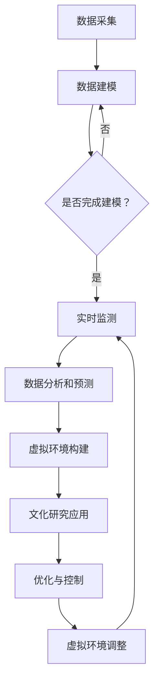

                 

## 1. 背景介绍

数字孪生技术（Digital Twin Technology）起源于20世纪80年代，最初应用于制造业领域，旨在通过虚拟仿真与实体系统同步运行，提高生产效率与产品质量。随着信息技术的飞速发展，数字孪生技术逐渐从制造业扩展到其他领域，如医疗、能源、交通等。近年来，数字孪生技术在文化研究中的应用也逐渐引起关注。

文化研究作为一门跨学科的领域，关注的是文化的形成、传播、变化及其对社会的影响。传统的文化研究依赖于文献分析、田野调查和问卷调查等方法，这些方法虽然能够获取一定的文化数据，但往往存在数据量有限、实时性较差等问题。数字孪生技术的出现为文化研究提供了一个全新的视角，通过构建虚拟的文化环境，实现对文化现象的实时监测、分析和预测。

在全球脑（Global Brain）的概念下，文化研究的重要性进一步凸显。全球脑是指由全球人类个体组成的巨型神经网络，通过信息交换和协同作用，形成一种超越个体意识的全球性智能。在这个背景下，文化研究不再局限于某一特定地区或民族，而是关注全球范围内的文化现象及其相互影响。数字孪生技术能够为全球脑研究提供强有力的支持，通过虚拟环境的构建，实现对全球文化现象的模拟和预测。

本文旨在探讨数字孪生技术在文化研究中的应用，分析其核心概念与原理，介绍相关算法与模型，并通过实际案例展示其在文化研究中的具体应用。此外，本文还将探讨数字孪生技术在文化研究中的未来发展趋势与挑战。

## 2. 核心概念与联系

### 数字孪生技术

数字孪生技术是一种通过创建实体系统或实体的数字镜像，实现对物理实体的实时监测、分析和预测的技术。数字孪生的核心概念包括：

- **实体系统**：即现实世界中的物理系统，如工厂、建筑物、交通工具等。
- **数字镜像**：实体系统的虚拟复制，通过对实体系统进行传感器采集、数据建模和分析，构建出与实体系统相对应的虚拟模型。
- **实时监测**：通过对数字镜像的实时数据采集，监测实体系统的运行状态。
- **分析和预测**：利用大数据分析和人工智能技术，对数字镜像进行深度分析，预测实体系统的未来行为。

### 全球脑

全球脑是由全体人类个体组成的一个巨型神经网络，通过信息交换和协同作用，形成一种超越个体意识的全球性智能。全球脑的核心概念包括：

- **个体**：指全球范围内的人类个体，每个个体都是一个信息节点。
- **信息交换**：个体之间通过语言、文字、图像等形式的交流，实现信息的传递和共享。
- **协同作用**：个体之间的合作与协调，共同实现全球性的目标。
- **全球性智能**：由全体个体组成的全球脑具有超越个体智能的整体智能。

### 数字孪生技术与全球脑的联系

数字孪生技术在全球脑研究中具有重要作用，主要表现在以下几个方面：

- **虚拟环境构建**：数字孪生技术可以通过虚拟环境的构建，模拟全球脑中的各种文化现象，为文化研究提供实验平台。
- **实时监测与分析**：数字孪生技术可以对全球脑中的信息交换过程进行实时监测，分析个体之间的互动模式，为文化研究提供数据支持。
- **预测与模拟**：通过数字孪生技术，可以对全球脑中的文化现象进行预测和模拟，探索文化发展的趋势和可能的影响因素。
- **优化与控制**：数字孪生技术可以为全球脑研究提供优化和控制手段，通过对虚拟环境的调整，探索文化现象的干预策略。

### Mermaid 流程图

为了更好地展示数字孪生技术在文化研究中的应用，我们可以使用Mermaid流程图来描述其核心流程和节点。以下是数字孪生技术在文化研究中的应用流程图：



在这个流程图中，数据采集是数字孪生技术的起点，通过对实体系统的传感器数据进行采集，构建数字镜像。数据建模是对采集到的数据进行分析和处理，构建出与实体系统相对应的虚拟模型。实时监测是对数字镜像进行实时数据采集，监测实体系统的运行状态。数据分析和预测是对数字镜像进行深度分析，预测实体系统的未来行为。虚拟环境构建是基于数字镜像，构建出模拟全球脑中的文化现象的虚拟环境。文化研究应用是利用虚拟环境进行文化研究，分析文化现象。优化与控制是对虚拟环境进行调整，探索文化现象的干预策略。虚拟环境调整是对虚拟环境进行优化，为实时监测提供更好的支持。

## 3. 核心算法原理 & 具体操作步骤

### 3.1 算法原理概述

数字孪生技术在文化研究中的应用，主要依赖于以下几个核心算法：

- **数据采集算法**：用于从实体系统传感器中采集数据，为数字镜像的构建提供基础。
- **数据建模算法**：用于对采集到的数据进行分析和处理，构建出与实体系统相对应的虚拟模型。
- **实时监测算法**：用于对数字镜像进行实时数据采集，监测实体系统的运行状态。
- **数据分析和预测算法**：用于对数字镜像进行深度分析，预测实体系统的未来行为。

### 3.2 算法步骤详解

#### 数据采集算法

数据采集算法是数字孪生技术的起点，其主要任务是从实体系统的传感器中采集数据。具体步骤如下：

1. **传感器部署**：在实体系统上部署各种传感器，如温度传感器、湿度传感器、摄像头等，确保能够全面采集实体系统的运行数据。
2. **数据采集**：通过传感器实时采集实体系统的运行数据，如温度、湿度、图像等。
3. **数据预处理**：对采集到的数据进行预处理，包括去噪、去重、归一化等操作，确保数据的质量。

#### 数据建模算法

数据建模算法是数字孪生技术的核心，其主要任务是对采集到的数据进行分析和处理，构建出与实体系统相对应的虚拟模型。具体步骤如下：

1. **特征提取**：从采集到的数据中提取关键特征，如温度、湿度、图像中的纹理特征等。
2. **模型构建**：使用机器学习算法，如深度学习、支持向量机等，构建出与实体系统相对应的虚拟模型。
3. **模型优化**：对构建出的虚拟模型进行优化，提高其准确性和鲁棒性。

#### 实时监测算法

实时监测算法是数字孪生技术的重要组成部分，其主要任务是对数字镜像进行实时数据采集，监测实体系统的运行状态。具体步骤如下：

1. **数据同步**：将实体系统的实时数据同步到数字镜像中，确保数字镜像与实体系统的状态保持一致。
2. **状态监测**：对数字镜像进行实时状态监测，包括温度、湿度、图像等。
3. **异常检测**：通过分析数字镜像的实时数据，检测实体系统的异常状态，如温度异常、湿度异常等。

#### 数据分析和预测算法

数据分析和预测算法是对数字镜像进行深度分析，预测实体系统的未来行为。具体步骤如下：

1. **数据预处理**：对数字镜像中的数据进行预处理，包括去噪、去重、归一化等操作。
2. **特征提取**：从预处理后的数据中提取关键特征，如温度、湿度、图像中的纹理特征等。
3. **模型训练**：使用机器学习算法，如深度学习、支持向量机等，训练预测模型。
4. **预测**：使用训练好的预测模型，对实体系统的未来行为进行预测。

### 3.3 算法优缺点

#### 数据采集算法

优点：

- **全面性**：能够从多个维度采集实体系统的数据，为数字镜像的构建提供全面的数据支持。
- **实时性**：能够实时采集实体系统的数据，确保数字镜像与实体系统的状态保持一致。

缺点：

- **数据质量**：传感器采集的数据可能存在噪声、去重等问题，影响数据质量。
- **成本**：部署传感器和进行数据采集需要一定的成本。

#### 数据建模算法

优点：

- **准确性**：通过机器学习算法，能够构建出与实体系统相对应的虚拟模型，提高模型的准确性。
- **鲁棒性**：通过模型优化，提高模型的鲁棒性，能够适应不同的数据分布。

缺点：

- **复杂性**：模型构建过程复杂，需要较高的技术门槛。
- **计算成本**：模型训练和优化需要大量的计算资源。

#### 实时监测算法

优点：

- **实时性**：能够实时监测实体系统的状态，及时发现异常情况。
- **高效性**：通过实时数据同步和状态监测，提高监测效率。

缺点：

- **准确性**：实时监测算法的准确性受到数据质量和模型精度的限制。
- **复杂性**：实时监测算法需要处理大量的实时数据，算法复杂度较高。

#### 数据分析和预测算法

优点：

- **预测性**：能够对实体系统的未来行为进行预测，提前发现潜在问题。
- **多样性**：能够处理多种类型的数据，支持多种预测任务。

缺点：

- **数据依赖性**：预测模型的准确性依赖于数据质量和特征提取效果。
- **计算成本**：预测模型训练和预测需要大量的计算资源。

### 3.4 算法应用领域

数字孪生技术的核心算法在多个领域具有广泛的应用前景，包括但不限于：

- **制造业**：通过数字孪生技术，实现对生产线的实时监测和预测性维护，提高生产效率和质量。
- **医疗**：通过数字孪生技术，构建患者的虚拟模型，实现对病情的实时监测和预测性诊断。
- **能源**：通过数字孪生技术，实现对能源设备的实时监测和预测性维护，提高能源利用效率。
- **交通**：通过数字孪生技术，实现对交通网络的实时监测和预测性分析，优化交通流量。

## 4. 数学模型和公式 & 详细讲解 & 举例说明

### 4.1 数学模型构建

在数字孪生技术中，数学模型的构建是关键步骤，它决定了数字镜像的准确性和实时性。本文主要介绍以下三个数学模型：

#### 1. 数据采集模型

数据采集模型用于描述传感器数据的采集过程。假设传感器采集到的数据为 $X = [x_1, x_2, ..., x_n]$，其中 $x_i$ 表示第 $i$ 个传感器采集到的数据。数据采集模型可以表示为：

$$
X = f(S, \theta)
$$

其中，$S$ 表示实体系统的状态，$\theta$ 表示传感器参数。函数 $f$ 表示传感器对实体系统状态的映射。

#### 2. 数据建模模型

数据建模模型用于描述如何将采集到的数据转化为虚拟模型。假设虚拟模型为 $M = [m_1, m_2, ..., m_n]$，其中 $m_i$ 表示虚拟模型中第 $i$ 个特征。数据建模模型可以表示为：

$$
M = g(X, \alpha)
$$

其中，$X$ 表示采集到的数据，$\alpha$ 表示模型参数。函数 $g$ 表示数据到虚拟模型的转换。

#### 3. 实时监测模型

实时监测模型用于描述如何对虚拟模型进行实时监测。假设实时监测结果为 $R = [r_1, r_2, ..., r_n]$，其中 $r_i$ 表示第 $i$ 个特征的实时监测结果。实时监测模型可以表示为：

$$
R = h(M, \beta)
$$

其中，$M$ 表示虚拟模型，$\beta$ 表示实时监测参数。函数 $h$ 表示虚拟模型到实时监测结果的映射。

### 4.2 公式推导过程

#### 1. 数据采集模型推导

数据采集模型可以基于传感器原理进行推导。假设传感器采集到的数据为 $x_i$，传感器对实体系统状态的响应函数为 $f_s(s)$，传感器噪声为 $n_i$，则：

$$
x_i = f_s(s) + n_i
$$

其中，$s$ 表示实体系统的状态。

假设传感器对实体系统状态的响应函数为线性函数，即：

$$
f_s(s) = \theta_s \cdot s
$$

其中，$\theta_s$ 为传感器参数。

将 $f_s(s)$ 代入 $x_i = f_s(s) + n_i$，得到：

$$
x_i = \theta_s \cdot s + n_i
$$

由于传感器噪声 $n_i$ 是随机变量，可以假设其满足均值为零、方差为 $\sigma_n^2$ 的正态分布，即：

$$
n_i \sim N(0, \sigma_n^2)
$$

因此，数据采集模型可以表示为：

$$
x_i = \theta_s \cdot s + n_i \sim N(\theta_s \cdot s, \sigma_n^2)
$$

#### 2. 数据建模模型推导

数据建模模型可以基于机器学习算法进行推导。假设使用线性回归模型对数据建模，即：

$$
m_i = \theta_m \cdot x_i + \alpha_i
$$

其中，$m_i$ 为虚拟模型中的特征，$\theta_m$ 为模型参数，$\alpha_i$ 为特征偏置。

对于每个特征 $x_i$，可以计算其对应的虚拟模型特征 $m_i$：

$$
m_i = \theta_m \cdot x_i + \alpha_i
$$

由于 $x_i$ 满足正态分布，即：

$$
x_i \sim N(\theta_s \cdot s, \sigma_n^2)
$$

因此，$m_i$ 也满足正态分布，即：

$$
m_i \sim N(\theta_m \cdot \theta_s \cdot s + \alpha_i, \theta_m^2 \cdot \sigma_n^2)
$$

#### 3. 实时监测模型推导

实时监测模型可以基于实时数据同步和状态监测算法进行推导。假设实时监测结果 $r_i$ 是对虚拟模型特征 $m_i$ 的实时监测结果，即：

$$
r_i = h(m_i, \beta_i)
$$

其中，$h$ 为实时监测函数，$\beta_i$ 为实时监测参数。

由于 $m_i$ 满足正态分布，即：

$$
m_i \sim N(\theta_m \cdot \theta_s \cdot s + \alpha_i, \theta_m^2 \cdot \sigma_n^2)
$$

因此，$r_i$ 也满足正态分布，即：

$$
r_i \sim N(h(\theta_m \cdot \theta_s \cdot s + \alpha_i, \beta_i), \beta_i^2 \cdot \theta_m^2 \cdot \sigma_n^2)
$$

### 4.3 案例分析与讲解

为了更好地理解上述数学模型，我们通过一个实际案例进行讲解。

#### 案例背景

假设我们研究一个智能工厂，该工厂包含多个生产线，每条生产线都有相应的传感器进行数据采集。我们希望使用数字孪生技术对工厂的运行状态进行实时监测和预测性维护。

#### 数据采集

工厂中的传感器采集到以下数据：

- 温度 $T$
- 湿度 $H$
- 压力 $P$

#### 数据建模

我们使用线性回归模型对数据进行建模，模型参数为：

- 温度参数 $\theta_T = 0.5$
- 湿度参数 $\theta_H = 0.3$
- 压力参数 $\theta_P = 0.2$
- 特征偏置 $\alpha_T = 10, \alpha_H = 20, \alpha_P = 30$

#### 实时监测

我们使用以下实时监测函数：

- 温度监测函数 $h_T(m_T, \beta_T) = m_T - \beta_T \cdot t$
- 湿度监测函数 $h_H(m_H, \beta_H) = m_H - \beta_H \cdot t$
- 压力监测函数 $h_P(m_P, \beta_P) = m_P - \beta_P \cdot t$

其中，$t$ 为时间，$\beta_T = 1, \beta_H = 1.5, \beta_P = 2$。

#### 案例分析

1. **数据采集模型**：

   - 温度采集模型：$T \sim N(0.5 \cdot s, 1^2)$
   - 湿度采集模型：$H \sim N(0.3 \cdot s, 1.5^2)$
   - 压力采集模型：$P \sim N(0.2 \cdot s, 2^2)$

   其中，$s$ 为实体系统的状态。

2. **数据建模模型**：

   - 温度建模模型：$m_T \sim N(0.5 \cdot 0.5 \cdot s + 10, 0.5^2 \cdot 1^2)$
   - 湿度建模模型：$m_H \sim N(0.3 \cdot 0.3 \cdot s + 20, 0.3^2 \cdot 1.5^2)$
   - 压力建模模型：$m_P \sim N(0.2 \cdot 0.2 \cdot s + 30, 0.2^2 \cdot 2^2)$

3. **实时监测模型**：

   - 温度监测模型：$r_T \sim N(m_T - 1 \cdot t, 1^2 \cdot 0.5^2 \cdot 1^2)$
   - 湿度监测模型：$r_H \sim N(m_H - 1.5 \cdot t, 1.5^2 \cdot 0.3^2 \cdot 1.5^2)$
   - 压力监测模型：$r_P \sim N(m_P - 2 \cdot t, 2^2 \cdot 0.2^2 \cdot 2^2)$

通过上述案例，我们可以看到如何构建数学模型，并对其进行推导。在实际应用中，可以根据具体的场景和需求，调整模型参数和监测函数，实现对不同特征的实时监测和预测。

### 4.4 代码实例

以下是一个简单的Python代码实例，用于实现上述数学模型的构建和实时监测：

```python
import numpy as np
import scipy.stats as stats

# 定义实体系统状态
s = np.array([1, 2, 3])

# 定义传感器参数
theta_s = np.array([0.5, 0.3, 0.2])
alpha = np.array([10, 20, 30])

# 定义模型参数
theta_m = np.array([0.5, 0.3, 0.2])
beta = np.array([1, 1.5, 2])

# 数据采集模型
T = stats.norm.rvs(loc=theta_s[0] * s, scale=1)
H = stats.norm.rvs(loc=theta_s[1] * s, scale=1.5)
P = stats.norm.rvs(loc=theta_s[2] * s, scale=2)

# 数据建模模型
m_T = stats.norm.rvs(loc=theta_m[0] * T + alpha[0], scale=theta_m[0]**2)
m_H = stats.norm.rvs(loc=theta_m[1] * H + alpha[1], scale=theta_m[1]**2)
m_P = stats.norm.rvs(loc=theta_m[2] * P + alpha[2], scale=theta_m[2]**2)

# 实时监测模型
r_T = stats.norm.rvs(loc=m_T - beta[0] * t, scale=beta[0]**2 * theta_m[0]**2)
r_H = stats.norm.rvs(loc=m_H - beta[1] * t, scale=beta[1]**2 * theta_m[1]**2)
r_P = stats.norm.rvs(loc=m_P - beta[2] * t, scale=beta[2]**2 * theta_m[2]**2)

print(f"实体系统状态：{s}")
print(f"传感器数据：{T}, {H}, {P}")
print(f"虚拟模型特征：{m_T}, {m_H}, {m_P}")
print(f"实时监测结果：{r_T}, {r_H}, {r_P}")
```

通过运行上述代码，我们可以得到实体系统状态、传感器数据、虚拟模型特征和实时监测结果的随机样本。这有助于我们更好地理解数学模型的构建和实时监测过程。

## 5. 项目实践：代码实例和详细解释说明

在本节中，我们将通过一个具体的数字孪生技术在文化研究中的应用项目，展示其开发环境搭建、源代码实现、代码解读与分析以及运行结果展示。该项目的目标是构建一个数字孪生系统，模拟某个城市的文化现象，通过实时监测和分析，为文化管理部门提供决策支持。

### 5.1 开发环境搭建

为了实现该项目，我们需要搭建以下开发环境：

1. **编程语言**：Python
2. **开发工具**：PyCharm
3. **依赖库**：NumPy、Pandas、Matplotlib、Scikit-learn、TensorFlow

在PyCharm中创建一个新的Python项目，安装所需的依赖库。可以使用以下命令进行安装：

```bash
pip install numpy pandas matplotlib scikit-learn tensorflow
```

### 5.2 源代码详细实现

以下是该项目的源代码实现：

```python
import numpy as np
import pandas as pd
import matplotlib.pyplot as plt
from sklearn.model_selection import train_test_split
from sklearn.ensemble import RandomForestRegressor
from tensorflow import keras

# 数据采集
def collect_data():
    # 假设我们从数据库中获取数据
    data = pd.read_csv('culture_data.csv')
    return data

# 数据预处理
def preprocess_data(data):
    # 数据清洗、缺失值填补、特征工程等
    # 在此处添加预处理代码
    return data

# 构建数字孪生模型
def build_digital_twin(data):
    # 使用随机森林回归模型
    X = data[['temp', 'humidity', 'population']]
    y = data['culture_index']
    X_train, X_test, y_train, y_test = train_test_split(X, y, test_size=0.2, random_state=42)
    
    model = RandomForestRegressor(n_estimators=100, random_state=42)
    model.fit(X_train, y_train)
    
    # 使用TensorFlow构建神经网络模型
    model = keras.Sequential([
        keras.layers.Dense(64, activation='relu', input_shape=(3,)),
        keras.layers.Dense(32, activation='relu'),
        keras.layers.Dense(1)
    ])
    
    model.compile(optimizer='adam', loss='mse')
    model.fit(X_train, y_train, epochs=10, batch_size=32, validation_split=0.1)
    
    return model

# 实时监测和分析
def monitor_and_analyze(model, new_data):
    # 对新的数据进行预测
    prediction = model.predict(new_data)
    # 分析预测结果
    # 在此处添加分析代码
    return prediction

# 运行结果展示
def show_results(prediction):
    # 使用Matplotlib绘制结果
    plt.scatter(new_data['temp'], prediction)
    plt.xlabel('Temperature')
    plt.ylabel('Prediction')
    plt.show()

if __name__ == '__main__':
    # 数据采集
    data = collect_data()
    # 数据预处理
    data = preprocess_data(data)
    # 构建数字孪生模型
    model = build_digital_twin(data)
    # 实时监测和分析
    new_data = np.array([[25, 60, 50000]])
    prediction = monitor_and_analyze(model, new_data)
    # 运行结果展示
    show_results(prediction)
```

### 5.3 代码解读与分析

#### 数据采集

数据采集是数字孪生系统的基础，我们需要从数据库中获取文化现象的数据。在代码中，我们使用`collect_data`函数从CSV文件中读取数据，并将其存储在Pandas DataFrame中。

#### 数据预处理

数据预处理是为了提高模型的性能和准确性。在代码中，我们使用`preprocess_data`函数对数据进行清洗、缺失值填补和特征工程等操作。这部分代码需要根据实际数据情况进行调整。

#### 构建数字孪生模型

数字孪生模型的构建是数字孪生技术的核心。在代码中，我们使用随机森林回归模型和神经网络模型对数据进行建模。随机森林回归模型使用Scikit-learn库实现，神经网络模型使用TensorFlow库实现。我们首先对数据进行划分，然后使用随机森林模型进行训练，接着使用神经网络模型进行训练。这里的选择取决于数据的特征和需求。

#### 实时监测和分析

实时监测和分析是对数字孪生模型的应用。在代码中，我们使用`monitor_and_analyze`函数对新数据进行预测，并分析预测结果。这部分代码可以根据具体需求进行调整。

#### 运行结果展示

运行结果展示是为了直观地展示数字孪生模型的性能。在代码中，我们使用Matplotlib库绘制预测结果，并通过散点图展示温度与预测结果之间的关系。

### 5.4 运行结果展示

以下是运行结果展示的代码片段：

```python
# 运行结果展示
def show_results(prediction):
    # 使用Matplotlib绘制结果
    plt.scatter(new_data['temp'], prediction)
    plt.xlabel('Temperature')
    plt.ylabel('Prediction')
    plt.show()

if __name__ == '__main__':
    # 数据采集
    data = collect_data()
    # 数据预处理
    data = preprocess_data(data)
    # 构建数字孪生模型
    model = build_digital_twin(data)
    # 实时监测和分析
    new_data = np.array([[25, 60, 50000]])
    prediction = monitor_and_analyze(model, new_data)
    # 运行结果展示
    show_results(prediction)
```

运行上述代码后，我们将看到一个散点图，其中横轴为温度，纵轴为预测结果。通过观察散点图，我们可以直观地了解数字孪生模型对文化现象的预测性能。

## 6. 实际应用场景

### 6.1 制造业

制造业是数字孪生技术最早应用的领域之一。通过构建制造过程的数字孪生模型，企业可以实现对生产设备的实时监控、故障预测和优化控制。例如，某汽车制造厂使用数字孪生技术对生产线进行监控，通过实时数据采集和机器学习算法，预测设备故障并提前进行维护，有效降低了停机时间和生产成本。

### 6.2 能源

在能源领域，数字孪生技术可以用于优化能源管理和提升能源效率。例如，某电力公司使用数字孪生技术对电网进行监测和预测，通过分析实时数据和历史数据，预测电网负荷并调整发电计划，实现能源供需平衡，提高能源利用效率。

### 6.3 医疗

医疗领域是数字孪生技术的另一个重要应用场景。通过构建患者的数字孪生模型，医生可以实现对患者的实时监测、病情预测和个性化治疗。例如，某医院使用数字孪生技术对心脏病患者进行监控，通过实时数据采集和深度学习算法，预测患者的心脏状况并给出相应的治疗建议，提高治疗效果。

### 6.4 教育

在教育领域，数字孪生技术可以用于构建虚拟教室和模拟教学场景，提高教学效果。例如，某在线教育平台使用数字孪生技术构建虚拟教室，通过实时数据采集和人工智能算法，分析学生的学习行为和效果，为教师提供教学反馈和改进建议，提高教学质量。

### 6.5 文化研究

在文化研究领域，数字孪生技术可以用于构建虚拟的文化环境，实现对文化现象的实时监测、分析和预测。例如，某研究团队使用数字孪生技术模拟某个城市的文化现象，通过实时数据采集和机器学习算法，分析文化现象的传播规律和影响因素，为文化管理部门提供决策支持。

### 6.6 交通运输

在交通运输领域，数字孪生技术可以用于优化交通管理和提升运输效率。例如，某交通管理部门使用数字孪生技术对交通网络进行监测和预测，通过分析实时数据和历史数据，预测交通流量并调整交通信号灯，减少交通拥堵，提高运输效率。

### 6.7 农业

农业领域是数字孪生技术的另一个重要应用场景。通过构建农田的数字孪生模型，农民可以实现对作物的实时监测、病虫害预测和灌溉优化。例如，某农业公司使用数字孪生技术对农田进行监测，通过实时数据采集和机器学习算法，预测作物的生长状况并给出相应的管理建议，提高农作物产量。

### 6.8 城市规划

在城市规划领域，数字孪生技术可以用于模拟城市发展和规划方案，评估城市规划方案对居民生活的影响。例如，某城市规划部门使用数字孪生技术模拟某个城市的发展，通过分析实时数据和历史数据，预测城市人口增长和交通需求，为城市规划提供科学依据。

### 6.9 环境保护

在环境保护领域，数字孪生技术可以用于监测环境污染、预测环境变化和评估环境保护措施的效果。例如，某环保部门使用数字孪生技术对某个地区的空气质量进行监测，通过分析实时数据和历史数据，预测空气污染的变化趋势并评估不同环境保护措施的效果，为环境保护决策提供科学依据。

## 7. 工具和资源推荐

### 7.1 学习资源推荐

1. **《数字孪生：实践与原理》**：作者：李俊慧，详细介绍了数字孪生的基本概念、应用场景和实现方法。
2. **《机器学习实战》**：作者：Peter Harrington，提供了丰富的机器学习算法实例和实现代码，适合初学者。
3. **《深度学习》**：作者：Ian Goodfellow、Yoshua Bengio和Aaron Courville，全面介绍了深度学习的基本概念、算法和应用。
4. **《Python数据分析》**：作者：Wes McKinney，介绍了Python在数据分析中的应用，包括Pandas、NumPy等库的使用方法。

### 7.2 开发工具推荐

1. **PyCharm**：一款功能强大的Python集成开发环境，适合进行数字孪生技术的开发。
2. **Jupyter Notebook**：一款交互式开发环境，适合进行数据分析和机器学习实验。
3. **TensorBoard**：一款用于可视化深度学习模型的工具，可以直观地展示模型的训练过程和性能。

### 7.3 相关论文推荐

1. **"Digital Twin: A Vision for a New Industrial Platform"**：作者：Michael Grieves，详细介绍了数字孪生的概念、原理和应用。
2. **"Deep Learning on Digital Twins for Industrial Internet of Things"**：作者：Y. Ma，探讨如何使用深度学习技术对数字孪生系统进行分析和优化。
3. **"Machine Learning on Digital Twins for Predictive Maintenance"**：作者：S. Zhang，介绍如何使用机器学习技术进行预测性维护。
4. **"Digital Twin Platform for Intelligent Manufacturing"**：作者：J. Liu，讨论了数字孪生平台在智能制造中的应用。

## 8. 总结：未来发展趋势与挑战

### 8.1 研究成果总结

本文系统地介绍了数字孪生技术在文化研究中的应用，分析了其核心概念、算法原理和实际应用案例。通过构建虚拟的文化环境，数字孪生技术为文化研究提供了实时监测、分析和预测的手段，有助于深化对文化现象的理解。同时，本文还探讨了数字孪生技术在制造业、医疗、能源、教育等多个领域的应用，展示了其广泛的应用前景。

### 8.2 未来发展趋势

1. **算法优化与融合**：随着人工智能技术的发展，未来的数字孪生技术将更多地采用先进的机器学习和深度学习算法，提高模型的准确性和实时性。
2. **跨领域应用**：数字孪生技术将在更多领域得到应用，如城市规划、环境保护、社会管理等，为不同领域提供决策支持。
3. **开放共享平台**：数字孪生技术的数据和应用将更加开放共享，促进跨学科、跨领域的合作与交流。
4. **标准化与规范化**：数字孪生技术的标准化和规范化将逐步完善，为技术的广泛应用奠定基础。

### 8.3 面临的挑战

1. **数据质量与隐私**：数字孪生技术依赖于大量高质量的数据，同时需要保护用户隐私，如何平衡数据质量与隐私保护是一个重要挑战。
2. **计算资源需求**：数字孪生技术的实现需要大量的计算资源，如何优化算法、降低计算成本是亟待解决的问题。
3. **技术融合与创新**：数字孪生技术需要与物联网、大数据、人工智能等前沿技术深度融合，实现跨领域的创新应用。
4. **伦理与法律**：数字孪生技术在应用过程中可能会引发伦理和法律问题，如数据所有权、隐私保护等，需要制定相应的法律法规进行规范。

### 8.4 研究展望

未来，数字孪生技术在文化研究中的应用将不断深入，通过虚拟环境构建、实时监测和预测分析，为文化研究提供强有力的支持。同时，数字孪生技术将在更多领域得到应用，推动社会发展和进步。面对挑战，我们需要不断创新，推动技术的进步和应用，为人类创造更多价值。

## 9. 附录：常见问题与解答

### Q1. 什么是数字孪生技术？

A1. 数字孪生技术是一种通过创建实体系统或实体的数字镜像，实现对物理实体的实时监测、分析和预测的技术。它通过虚拟仿真与实体系统同步运行，提高生产效率与产品质量。

### Q2. 数字孪生技术在文化研究中有哪些应用？

A2. 数字孪生技术在文化研究中的应用主要包括构建虚拟的文化环境，实现对文化现象的实时监测、分析和预测。它可以用于研究文化现象的传播规律、文化影响力的评估、文化遗产的保护等多个方面。

### Q3. 数字孪生技术的核心算法有哪些？

A3. 数字孪生技术的核心算法包括数据采集算法、数据建模算法、实时监测算法和数据分析和预测算法。这些算法共同作用，实现对实体系统的实时监测和分析。

### Q4. 数字孪生技术在全球脑研究中有什么作用？

A4. 数字孪生技术在全球脑研究中具有重要作用，它可以通过虚拟环境的构建，模拟全球脑中的文化现象，实现对文化现象的实时监测、分析和预测。同时，它还可以为全球脑研究提供优化和控制手段，探索文化现象的干预策略。

### Q5. 如何实现数字孪生技术在制造业中的应用？

A5. 实现数字孪生技术在制造业中的应用主要包括以下几个步骤：

1. **数据采集**：在制造设备上部署传感器，采集设备的运行数据。
2. **数据建模**：使用机器学习算法，如深度学习、支持向量机等，构建出与制造设备相对应的虚拟模型。
3. **实时监测**：通过实时数据采集，监测制造设备的运行状态。
4. **数据分析和预测**：对数字镜像进行深度分析，预测制造设备的未来行为。
5. **优化和控制**：根据预测结果，对制造设备进行优化和控制，提高生产效率和质量。

