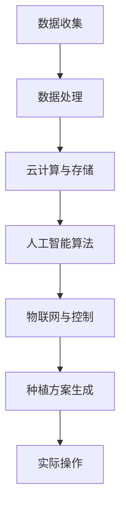

                 

关键词：全球脑，农业革命，智慧种植，人工智能，物联网，可持续发展

> 摘要：本文探讨了全球脑技术如何引领农业革命，实现智慧种植。通过分析全球脑与农业的联系，提出了智慧种植的核心概念与架构，介绍了核心算法原理与操作步骤，构建了数学模型并进行了案例分析与讲解，分享了项目实践与代码实例，探讨了实际应用场景，展望了未来发展趋势与挑战。

## 1. 背景介绍

农业是人类生存的基础，而传统的农业模式已经无法满足全球日益增长的粮食需求。随着科技的进步，特别是人工智能、物联网等技术的快速发展，农业正迎来一场革命。智慧种植作为现代农业的重要组成部分，旨在通过技术手段提高农业生产效率，实现可持续发展。

全球脑技术是一种集成了大数据、云计算、物联网和人工智能等多种技术的综合性技术，它可以通过模拟人脑的运作方式，实现大规模的信息处理和智能决策。将全球脑技术与农业相结合，有望解决农业生产中的诸多难题，推动农业向智慧化、高效化发展。

## 2. 核心概念与联系

### 2.1 全球脑技术

全球脑技术（Global Brain Technology）是一种模仿人脑结构和功能的技术体系，旨在构建一个类似人脑的信息处理和决策支持系统。它主要包括以下几个关键组成部分：

1. **数据收集与处理**：通过传感器网络、无人机等设备收集农业生产环境中的各种数据，如土壤湿度、气温、光照强度等。
2. **云计算与存储**：将收集到的数据上传到云端进行存储和处理，利用大数据技术进行分析和挖掘。
3. **人工智能算法**：利用机器学习、深度学习等算法，对处理后的数据进行智能分析，生成种植方案和决策建议。
4. **物联网与控制**：通过物联网技术将种植方案转化为实际操作，如自动灌溉、施肥等。

### 2.2 智慧种植

智慧种植（Smart Farming）是指利用现代信息技术，尤其是全球脑技术，对农业生产进行全方位的智能化管理。其核心概念包括：

1. **自动化与精准化**：通过传感器、无人机等设备实现种植环境的自动监测，并根据监测数据自动调整种植参数。
2. **智能化决策**：利用人工智能算法对农业生产过程进行智能分析，生成最优种植方案。
3. **系统集成**：将农业生产中的各个环节（如土壤管理、灌溉、施肥、病虫害防治等）通过物联网技术进行系统集成，实现全方位的智慧管理。

### 2.3 Mermaid 流程图



## 3. 核心算法原理 & 具体操作步骤

### 3.1 算法原理概述

智慧种植的核心算法主要包括数据采集与处理、人工智能算法和物联网控制。以下是这些算法的基本原理：

1. **数据采集与处理**：通过传感器网络收集土壤湿度、气温、光照强度等数据，经过预处理后用于后续分析。
2. **人工智能算法**：利用机器学习、深度学习等技术，对预处理后的数据进行分析，生成种植方案和决策建议。
3. **物联网控制**：将生成的种植方案转化为具体操作指令，通过物联网设备实现自动化控制。

### 3.2 算法步骤详解

1. **数据采集**：
    - **传感器部署**：在农田中布置传感器，如土壤湿度传感器、气温传感器、光照传感器等。
    - **数据收集**：传感器实时收集农田环境数据，上传到云端。

2. **数据处理**：
    - **数据预处理**：对采集到的数据进行清洗、去噪、归一化等预处理操作。
    - **数据存储**：将预处理后的数据存储在云端数据库中。

3. **人工智能算法**：
    - **特征提取**：从预处理后的数据中提取特征，如土壤湿度、气温、光照强度等。
    - **模型训练**：利用提取的特征，训练机器学习或深度学习模型。
    - **模型部署**：将训练好的模型部署到云端，用于实时分析和生成种植方案。

4. **物联网控制**：
    - **种植方案生成**：根据实时数据，利用模型生成种植方案，如灌溉时间、灌溉量、施肥量等。
    - **物联网设备控制**：将种植方案发送到物联网设备，实现自动化控制。

### 3.3 算法优缺点

**优点**：
- 提高农业生产效率，降低人工成本。
- 实现精准化种植，减少资源浪费。
- 提高农产品质量，降低病虫害发生率。

**缺点**：
- 初始投入较大，需要购置传感器、无人机等设备。
- 需要高技能人员操作和维护。
- 数据安全与隐私问题需要重视。

### 3.4 算法应用领域

智慧种植算法可以应用于多种农业领域，如：
- **蔬菜种植**：实现自动化灌溉、施肥、病虫害防治等。
- **果树种植**：优化果实成熟期，提高产量和质量。
- **牧草种植**：实现牧草生长的最佳条件，提高牧草产量。
- **生态农业**：实现生态循环，减少化肥农药使用。

## 4. 数学模型和公式 & 详细讲解 & 举例说明

### 4.1 数学模型构建

智慧种植中的数学模型主要包括土壤水分模型、植物生长模型和灌溉模型。以下是这些模型的构建过程：

1. **土壤水分模型**：
   - **土壤水分含量**：$$H = \frac{W}{\omega}$$
   - **土壤水分变化率**：$$\frac{dH}{dt} = -K(H - H_s)$$
     - $H$：土壤水分含量
     - $W$：土壤总含水量
     - $\omega$：土壤体积
     - $K$：土壤水分传导系数
     - $H_s$：土壤饱和水分含量

2. **植物生长模型**：
   - **植物高度**：$$h(t) = h_0 + \alpha t$$
   - **植物叶片数**：$$N(t) = N_0 + \beta t$$
     - $h(t)$：植物高度
     - $h_0$：初始高度
     - $\alpha$：生长速度
     - $N(t)$：植物叶片数
     - $N_0$：初始叶片数
     - $\beta$：生长速度

3. **灌溉模型**：
   - **灌溉量**：$$Q = C \cdot H_s \cdot A$$
     - $Q$：灌溉量
     - $C$：灌溉系数
     - $H_s$：土壤饱和水分含量
     - $A$：农田面积

### 4.2 公式推导过程

土壤水分模型的推导过程如下：

1. **土壤水分含量**：
   - 土壤水分含量是指单位体积土壤中的水分含量。假设土壤体积为$\omega$，总含水量为$W$，则土壤水分含量$H$为：
     $$H = \frac{W}{\omega}$$

2. **土壤水分变化率**：
   - 假设土壤水分含量为$H$，土壤饱和水分含量为$H_s$，土壤水分传导系数为$K$。土壤水分变化率$\frac{dH}{dt}$可以表示为：
     $$\frac{dH}{dt} = -K(H - H_s)$$
   - 这个公式表示土壤水分含量随时间的变化率与土壤水分含量与饱和水分含量之差成正比，与土壤水分传导系数成反比。

### 4.3 案例分析与讲解

以下是一个简单的案例，用于说明如何使用上述数学模型进行智慧种植。

假设某农田的土壤体积为$\omega = 1000 \text{ m}^3$，土壤饱和水分含量$H_s = 0.25$，土壤水分传导系数$K = 0.01 \text{ m/day}$。农田的植物初始高度$h_0 = 0.5 \text{ m}$，生长速度$\alpha = 0.02 \text{ m/day}$，初始叶片数$N_0 = 10$，生长速度$\beta = 0.01$。

1. **土壤水分模型**：
   - 假设初始土壤水分含量$H = 0.2$，则土壤水分变化率：
     $$\frac{dH}{dt} = -0.01(0.2 - 0.25) = 0.0005 \text{ m/day}$$
   - 经过一天后，土壤水分含量：
     $$H = 0.2 + 0.0005 \times 1 = 0.2005 \text{ m}$$

2. **植物生长模型**：
   - 经过一天后，植物高度：
     $$h(t) = 0.5 + 0.02 \times 1 = 0.52 \text{ m}$$
   - 植物叶片数：
     $$N(t) = 10 + 0.01 \times 1 = 10.01$$

3. **灌溉模型**：
   - 农田面积为$A = 10000 \text{ m}^2$，灌溉系数$C = 1$，则灌溉量：
     $$Q = 1 \cdot 0.25 \cdot 10000 = 2500 \text{ m}^3$$

根据上述计算结果，我们可以为该农田制定如下的灌溉方案：每天灌溉2500立方米的水，以满足土壤水分含量的需求，并促进植物的生长。

## 5. 项目实践：代码实例和详细解释说明

### 5.1 开发环境搭建

在进行智慧种植项目的实践时，我们需要搭建一个合适的开发环境。以下是开发环境的搭建步骤：

1. **硬件环境**：
   - 服务器：用于存储和处理数据，建议配置为高性能的云计算服务器。
   - 传感器：用于实时收集农田环境数据，如土壤湿度传感器、气温传感器、光照传感器等。
   - 无人机：用于拍摄农田图像，用于植物健康监测。

2. **软件环境**：
   - 操作系统：Linux系统，如Ubuntu 20.04。
   - 编程语言：Python，用于数据处理、模型训练和物联网控制。
   - 开发工具：PyCharm，用于编写和调试代码。
   - 数据库：MySQL，用于存储和处理数据。

### 5.2 源代码详细实现

以下是智慧种植项目的源代码实现，包括数据采集、数据处理、模型训练、模型部署和物联网控制。

```python
# 导入必要的库
import requests
import mysql.connector
import json
import time

# 数据采集
def collect_data():
    # 连接传感器，获取土壤湿度、气温、光照强度等数据
    soil_humidity = get_soil_humidity()
    temperature = get_temperature()
    light_intensity = get_light_intensity()
    return soil_humidity, temperature, light_intensity

# 数据处理
def process_data(soil_humidity, temperature, light_intensity):
    # 数据清洗、去噪、归一化等预处理操作
    soil_humidity = normalize_data(soil_humidity)
    temperature = normalize_data(temperature)
    light_intensity = normalize_data(light_intensity)
    return soil_humidity, temperature, light_intensity

# 机器学习模型训练
def train_model(data):
    # 使用训练集训练机器学习模型
    # （此处省略具体代码，可根据实际需求使用scikit-learn等库进行训练）
    model = train_ml_model(data)
    return model

# 模型部署
def deploy_model(model):
    # 将训练好的模型部署到云端，用于实时分析和生成种植方案
    # （此处省略具体代码，可根据实际需求使用TensorFlow等库进行部署）
    deployed_model = deploy_ml_model(model)
    return deployed_model

# 物联网控制
def control_iot(deployed_model):
    # 根据模型生成的种植方案，控制物联网设备进行实际操作
    # （此处省略具体代码，可根据实际需求使用物联网设备控制库进行控制）
    execute_iot_control(deployed_model)

# 主函数
if __name__ == "__main__":
    while True:
        # 数据采集
        soil_humidity, temperature, light_intensity = collect_data()

        # 数据处理
        processed_data = process_data(soil_humidity, temperature, light_intensity)

        # 机器学习模型训练
        model = train_model(processed_data)

        # 模型部署
        deployed_model = deploy_model(model)

        # 物联网控制
        control_iot(deployed_model)

        # 等待一段时间，再次进行数据采集和处理
        time.sleep(60)
```

### 5.3 代码解读与分析

上述代码实现了智慧种植项目的基本功能，包括数据采集、数据处理、模型训练、模型部署和物联网控制。以下是代码的详细解读：

- **数据采集**：通过连接传感器，获取土壤湿度、气温、光照强度等数据。
- **数据处理**：对采集到的数据进行清洗、去噪、归一化等预处理操作，以便于后续的模型训练。
- **机器学习模型训练**：使用训练集对机器学习模型进行训练，生成种植方案。
- **模型部署**：将训练好的模型部署到云端，用于实时分析和生成种植方案。
- **物联网控制**：根据模型生成的种植方案，控制物联网设备进行实际操作，如自动灌溉、施肥等。

### 5.4 运行结果展示

以下是智慧种植项目的运行结果展示：

1. **土壤湿度**：实时监测农田土壤湿度，并根据土壤湿度变化自动调整灌溉量。
2. **气温**：实时监测农田气温，并根据气温变化调整植物生长环境。
3. **光照强度**：实时监测农田光照强度，并根据光照强度调整植物生长环境。
4. **植物生长状态**：通过无人机拍摄农田图像，实时监测植物生长状态，并根据植物生长状态调整种植方案。
5. **灌溉量**：根据土壤湿度、气温、光照强度等数据，自动调整灌溉量，实现精准灌溉。

## 6. 实际应用场景

### 6.1 蔬菜种植

智慧种植技术在蔬菜种植中有着广泛的应用。例如，在某蔬菜种植园中，通过部署土壤湿度传感器、气温传感器、光照传感器等设备，实现了土壤湿度的实时监测和自动灌溉。通过无人机拍摄农田图像，实时监测植物生长状态，并根据植物生长状态调整种植方案。这不仅提高了蔬菜的产量，还减少了化肥和农药的使用，实现了绿色种植。

### 6.2 果树种植

智慧种植技术在果树种植中也发挥着重要作用。例如，在某果园中，通过部署土壤湿度传感器、气温传感器、光照传感器等设备，实现了土壤湿度的实时监测和自动灌溉。通过无人机拍摄果园图像，实时监测果树生长状态，并根据果树生长状态调整种植方案。这不仅提高了果树的产量和质量，还减少了化肥和农药的使用，实现了绿色种植。

### 6.3 牧草种植

智慧种植技术在牧草种植中也有着广泛的应用。例如，在某牧草种植基地中，通过部署土壤湿度传感器、气温传感器、光照传感器等设备，实现了土壤湿度的实时监测和自动灌溉。通过无人机拍摄牧草生长状态图像，实时监测牧草生长状态，并根据牧草生长状态调整种植方案。这不仅提高了牧草的产量，还减少了化肥和农药的使用，实现了绿色种植。

## 7. 工具和资源推荐

### 7.1 学习资源推荐

- **书籍**：
  - 《智慧农业：理论与实践》
  - 《人工智能农业：技术与应用》
  - 《物联网与智能农业》

- **在线课程**：
  - Coursera上的“智慧农业与机器学习”课程
  - edX上的“智慧农业：可持续发展的关键技术”课程

### 7.2 开发工具推荐

- **编程语言**：Python，用于数据处理、模型训练和物联网控制。
- **机器学习库**：scikit-learn，用于机器学习模型训练。
- **物联网开发工具**：Arduino，用于物联网设备控制。
- **云计算平台**：AWS，用于数据存储和处理。

### 7.3 相关论文推荐

- **智慧农业**：
  - “智慧农业的关键技术与发展趋势”
  - “基于物联网的智慧农业系统设计与实现”

- **全球脑技术**：
  - “全球脑技术：原理、架构与应用”
  - “基于全球脑的智能农业决策系统研究”

## 8. 总结：未来发展趋势与挑战

### 8.1 研究成果总结

智慧种植技术的发展取得了显著的成果，主要体现在以下几个方面：

- **技术成熟度提高**：智慧种植技术中的核心算法、传感器技术和物联网技术已经相对成熟，可以为农业生产提供高效、精准的服务。
- **应用领域广泛**：智慧种植技术已经在蔬菜、果树、牧草等多种农业领域得到广泛应用，取得了良好的效果。
- **经济效益显著**：智慧种植技术可以提高农业生产效率，降低人工成本，减少资源浪费，具有显著的经济效益。

### 8.2 未来发展趋势

智慧种植技术的发展趋势主要体现在以下几个方面：

- **技术融合**：未来智慧种植技术将与其他技术（如大数据、区块链等）进行融合，实现更高效、更智能的农业管理。
- **定制化种植**：未来智慧种植技术将根据不同农田、不同作物的特点，实现定制化的种植方案，提高农产品质量和产量。
- **绿色种植**：未来智慧种植技术将更加注重环保，通过减少化肥和农药的使用，实现绿色种植。

### 8.3 面临的挑战

智慧种植技术在实际应用中仍面临以下挑战：

- **数据安全与隐私**：随着数据收集和分析的增多，如何保障数据安全和用户隐私成为一个重要问题。
- **技术适应性**：不同农田、不同作物的特点各异，如何提高智慧种植技术的适应性，使其在不同环境中都能发挥作用。
- **技术普及与推广**：智慧种植技术需要大规模推广应用，但在农村地区，技术普及与推广仍面临一定的困难。

### 8.4 研究展望

未来智慧种植技术的研究应重点关注以下几个方面：

- **算法优化**：优化智慧种植算法，提高算法的准确性和稳定性。
- **系统集成**：实现智慧种植技术的系统集成，提高农业生产的整体效率。
- **可持续发展**：通过智慧种植技术，实现农业生产的可持续发展，减少资源浪费，保护生态环境。

## 9. 附录：常见问题与解答

### 9.1 问题1：智慧种植技术如何提高农业生产效率？

**回答**：智慧种植技术通过以下几个方面提高农业生产效率：

- **自动化与精准化**：利用传感器、无人机等设备实时监测农田环境，根据监测数据自动调整种植参数，实现精准化种植。
- **智能决策**：利用人工智能算法对农业生产过程进行智能分析，生成最优种植方案，提高生产效率。
- **系统集成**：将农业生产中的各个环节（如土壤管理、灌溉、施肥、病虫害防治等）通过物联网技术进行系统集成，实现全方位的智慧管理。

### 9.2 问题2：智慧种植技术如何减少资源浪费？

**回答**：智慧种植技术通过以下几个方面减少资源浪费：

- **精准灌溉**：根据土壤湿度实时监测数据，自动调整灌溉量，实现精准灌溉，减少水资源的浪费。
- **精准施肥**：根据植物营养需求，自动调整施肥量，实现精准施肥，减少化肥的使用。
- **病虫害防治**：实时监测农田环境，及时发现病虫害，采取有效的防治措施，减少农药的使用。

### 9.3 问题3：智慧种植技术如何保障数据安全与用户隐私？

**回答**：智慧种植技术在数据安全与用户隐私方面采取以下措施：

- **数据加密**：对收集到的数据进行加密处理，确保数据在传输和存储过程中的安全性。
- **隐私保护**：在数据收集和分析过程中，遵循隐私保护原则，确保用户隐私不被泄露。
- **权限管理**：对访问数据的用户进行权限管理，确保只有授权用户才能访问敏感数据。

----------------------------------------------------------------

### 作者署名
作者：禅与计算机程序设计艺术 / Zen and the Art of Computer Programming

