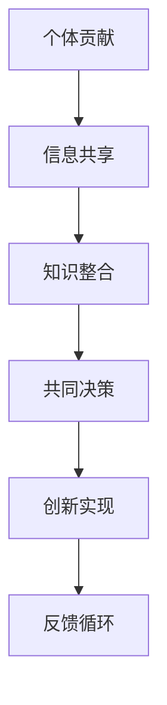
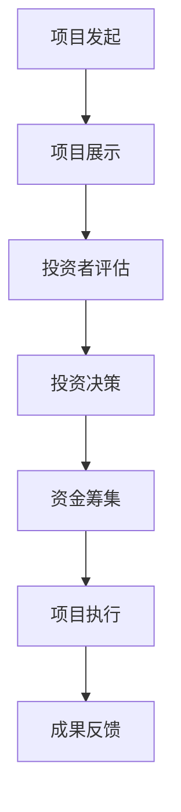
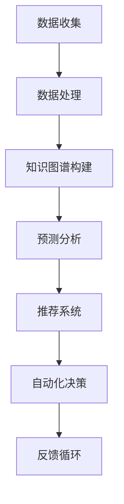
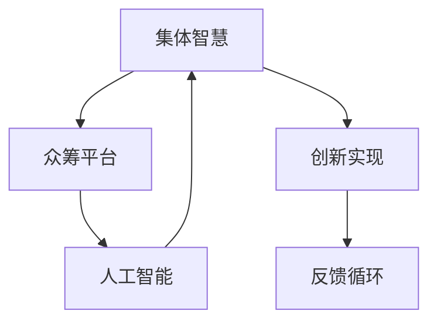

                 

关键词：集体智慧、众筹、创新、人工智能、网络协作

> 摘要：本文探讨了全球脑与创意众筹的概念及其在集体创新中的应用。通过分析集体智慧的形成机制、众筹平台的工作原理以及人工智能技术在其中的角色，本文揭示了集体创新的力量和潜力。此外，文章还展望了未来集体创新的发展趋势和面临的挑战，为读者提供了深入思考的方向。

## 1. 背景介绍

随着互联网技术的飞速发展，人们的生活和工作方式发生了翻天覆地的变化。尤其是社交媒体和在线平台的普及，使得全球范围内的信息传播和互动变得更加便捷。在这样的背景下，集体智慧（Collective Intelligence）的概念逐渐进入人们的视野。集体智慧指的是由多个个体组成的群体通过协作和互动，共同产生和分享知识、见解和创新的能力。

集体智慧的概念引发了人们对集体创新（Collective Innovation）的关注。集体创新是一种通过集体智慧驱动的创新过程，它突破了传统创新模式的限制，强调个体之间的合作和互动，以实现更加高效和创新的结果。在这种模式下，个体的智慧、经验和资源得到充分的整合和发挥，从而推动整个社会向更高的层次发展。

众筹（Crowdfunding）作为一种新兴的融资模式，为集体创新提供了重要的支持。众筹平台为创新项目提供了一个开放的展示和资金筹集的平台，让任何有创意和意愿的人都能参与到项目的实现中来。通过众筹，创新者可以迅速获得资金、反馈和建议，从而加快创新进程，降低创新风险。

本文旨在探讨全球脑与创意众筹的关系，分析集体智慧在众筹平台上的作用，探讨人工智能技术在其中的应用，并展望未来集体创新的发展趋势和挑战。通过这篇文章，我们希望能够为读者提供一个全面、深入的理解，激发对集体创新的思考和研究。

## 2. 核心概念与联系

### 2.1 集体智慧

集体智慧是一个复杂而广泛的概念，它涉及到多个层面的相互作用和协作。简单来说，集体智慧是由多个个体通过共享信息、知识和技能，共同解决问题、创造新知识和实现创新的能力。以下是一个简化的Mermaid流程图，展示了集体智慧的形成机制：



在这个流程中，个体贡献是集体智慧形成的基础。每个个体根据自己的知识和经验提供信息，这些信息通过共享平台进行整合和交流。在此基础上，群体通过共同决策实现创新目标，并在创新过程中不断进行反馈和调整。这个过程形成了一个正反馈循环，使得集体智慧不断进化和发展。

### 2.2 众筹平台

众筹平台是集体智慧在创新领域的重要应用场景。它通过提供一个开放的平台，让项目发起人可以发布自己的创意和项目，向公众展示和寻求资金、资源和支持。以下是一个简化的Mermaid流程图，展示了众筹平台的工作原理：



在这个流程中，项目发起人首先需要提出一个创新项目，并将其展示在众筹平台上。投资者通过评估项目的信息、市场潜力和社会影响力，做出投资决策。一旦资金筹集成功，项目进入执行阶段，最终通过成果反馈来评估项目的成功程度。这个过程不仅实现了资金的筹集，还促进了项目的社会验证和迭代优化。

### 2.3 人工智能

人工智能技术在集体智慧和众筹平台上发挥着越来越重要的作用。它不仅提高了信息处理的效率和准确性，还为集体智慧和众筹提供了新的工具和方法。以下是一个简化的Mermaid流程图，展示了人工智能在集体智慧和众筹中的应用：



在这个流程中，人工智能首先通过数据收集和处理，构建出知识图谱，用于分析项目的潜在价值和社会影响力。然后，通过预测分析和推荐系统，为投资者提供投资决策的支持。同时，人工智能还可以自动化执行决策，提高众筹平台的运营效率。整个过程中，通过不断收集和反馈数据，人工智能能够不断优化自己的算法和策略。

### 2.4 关联与整合

集体智慧、众筹平台和人工智能之间存在着紧密的联系和整合。集体智慧为众筹平台提供了知识共享和协同创新的基础，而众筹平台则为集体智慧提供了实现创新目标的具体途径。人工智能则通过数据分析和自动化决策，为整个系统提供了智能化的支持和优化。

以下是一个简化的Mermaid流程图，展示了这三个概念之间的关联与整合：



通过这个流程，我们可以看到，集体智慧、众筹平台和人工智能相互协作，共同推动了创新实现和反馈循环的持续优化。这个过程不仅提高了创新的效率和质量，还为未来的集体创新提供了新的思路和方向。

## 3. 核心算法原理 & 具体操作步骤

### 3.1 算法原理概述

在集体智慧和众筹平台中，核心算法的设计和实现至关重要。这些算法不仅决定了系统的效率和准确性，还影响了整个创新过程的顺利进行。以下是一个简化的算法原理概述：

#### 3.1.1 集体智慧算法

集体智慧算法的核心在于如何有效地收集、整合和利用个体贡献的知识和技能。以下是一个简化的算法流程：

1. **数据收集**：从个体那里收集信息，包括知识、经验和见解。
2. **数据预处理**：对收集到的数据进行分析、清洗和标准化，确保数据的一致性和可用性。
3. **知识图谱构建**：将预处理后的数据构建成一个知识图谱，用于表示个体之间的联系和关系。
4. **知识整合**：通过图算法和机器学习模型，对知识图谱进行整合和分析，提取出关键的知识点和模式。
5. **共同决策**：基于整合的知识，群体成员共同做出决策，实现创新目标。

#### 3.1.2 众筹平台算法

众筹平台算法的核心在于如何评估项目的潜在价值、优化投资决策以及提高资金筹集效率。以下是一个简化的算法流程：

1. **项目评估**：基于项目的信息、市场潜力和社会影响力，进行初步评估。
2. **预测分析**：使用机器学习模型，对项目的成功概率和投资回报进行预测。
3. **推荐系统**：根据投资者的偏好和风险承受能力，推荐合适的项目。
4. **资金筹集**：通过多种方式，如固定金额、灵活金额和奖励众筹，实现资金的筹集。
5. **项目执行**：根据筹集到的资金，执行项目计划，并进行监控和调整。

#### 3.1.3 人工智能算法

人工智能算法在集体智慧和众筹平台中的应用广泛，主要包括数据分析和自动化决策。以下是一个简化的算法流程：

1. **数据收集**：从多种数据源收集项目相关的信息，包括市场数据、社会反馈和技术指标。
2. **数据处理**：对收集到的数据进行清洗、分析和标准化，提取出有用的特征。
3. **预测分析**：使用机器学习模型，对项目的潜在价值和社会影响力进行预测。
4. **推荐系统**：根据预测结果，推荐合适的项目和投资策略。
5. **自动化决策**：基于推荐结果，自动执行投资决策，提高决策效率和准确性。

### 3.2 算法步骤详解

#### 3.2.1 集体智慧算法步骤详解

1. **数据收集**：
   - 使用在线调查、社交媒体数据和用户评论等方式，收集个体提供的信息。
   - 对收集到的数据进行初步筛选和清洗，确保数据的质量和一致性。

2. **数据预处理**：
   - 使用自然语言处理（NLP）技术，对文本数据进行分词、词性标注和语义分析。
   - 对非结构化数据进行结构化处理，将其转化为可用于计算的形式。

3. **知识图谱构建**：
   - 使用图数据库，构建知识图谱，表示个体之间的联系和关系。
   - 使用图算法，如深度优先搜索（DFS）和广度优先搜索（BFS），对知识图谱进行分析和整合。

4. **知识整合**：
   - 使用聚类算法（如K-means和层次聚类），对知识图谱进行聚类，提取出关键的知识点和模式。
   - 使用关联规则挖掘算法（如Apriori算法和FP-growth算法），分析个体贡献之间的相关性。

5. **共同决策**：
   - 基于整合的知识，使用决策树、支持向量机和神经网络等机器学习模型，预测项目的成功概率和投资回报。
   - 通过投票、讨论和协商，群体成员共同做出决策，实现创新目标。

#### 3.2.2 众筹平台算法步骤详解

1. **项目评估**：
   - 收集项目的详细信息，包括项目描述、目标、进度和团队成员等。
   - 使用多指标评估方法（如综合评分法和层次分析法），对项目进行初步评估。

2. **预测分析**：
   - 使用时间序列分析、回归分析和分类算法（如决策树和随机森林），预测项目的成功概率和投资回报。
   - 使用贝叶斯网络和马尔可夫模型，分析项目的不确定性和风险。

3. **推荐系统**：
   - 基于项目的特点和投资者的偏好，使用协同过滤、内容推荐和混合推荐算法，为投资者推荐合适的项目。
   - 使用基于规则的推荐算法，根据投资者的历史投资记录和反馈，制定个性化的推荐策略。

4. **资金筹集**：
   - 根据项目的特点和投资者的需求，选择合适的众筹模式，如固定金额众筹、灵活金额众筹和奖励众筹。
   - 通过多种渠道（如社交媒体、邮件营销和线下活动），宣传项目，吸引投资者。

5. **项目执行**：
   - 根据筹集到的资金，制定详细的项目计划，并进行实施和监控。
   - 通过实时数据监测和风险评估，对项目进行动态调整和优化。

### 3.3 算法优缺点

#### 3.3.1 集体智慧算法

**优点**：
- **多样性**：通过整合个体贡献，集体智慧能够充分利用各种不同的知识和经验，提高创新的质量和多样性。
- **协作性**：集体智慧强调个体之间的协作和互动，能够激发群体的智慧和创造力。
- **适应性**：集体智慧能够快速适应变化的环境和需求，提高系统的灵活性和适应性。

**缺点**：
- **复杂性**：集体智慧涉及多个层面的相互作用和协作，实现起来相对复杂，需要大量的计算资源和算法支持。
- **信息过载**：在个体贡献大量信息的情况下，如何有效地筛选和整合信息，避免信息过载和冗余，是一个挑战。
- **信任问题**：个体之间的信任和合作程度对集体智慧的效果有重要影响，但在大规模的群体中，建立和维护信任关系是一个难题。

#### 3.3.2 众筹平台算法

**优点**：
- **开放性**：众筹平台为创新项目提供了一个开放的平台，让任何有创意和意愿的人都能参与到项目的实现中来，提高了创新的可能性。
- **灵活性**：众筹平台支持多种众筹模式，如固定金额众筹、灵活金额众筹和奖励众筹，为不同类型的项目提供了多样化的资金筹集方式。
- **快速反馈**：通过众筹平台，项目发起人可以迅速获得资金、反馈和建议，从而加快创新进程，降低创新风险。

**缺点**：
- **信息质量**：在众筹平台上，项目的信息质量参差不齐，投资者需要花费大量时间和精力进行筛选和评估。
- **投资风险**：众筹项目具有一定的投资风险，投资者需要对项目的市场潜力和风险有充分的了解和认识。
- **操作成本**：众筹平台需要投入大量的资源和精力进行项目管理、风险评估和资金分配，增加了运营成本。

#### 3.3.3 人工智能算法

**优点**：
- **高效性**：人工智能算法能够高效地处理和分析大量数据，提高决策的准确性和效率。
- **适应性**：人工智能算法可以根据不同的场景和需求，灵活调整和优化，提高系统的适应性和扩展性。
- **自动化**：人工智能算法可以自动化执行决策和操作，提高系统的运营效率和可靠性。

**缺点**：
- **数据依赖**：人工智能算法的性能很大程度上取决于数据的质量和数量，数据不足或质量不佳会导致算法失效。
- **解释性**：人工智能算法的决策过程往往具有“黑箱”特性，难以解释和理解，增加了信任和监管的难度。
- **算法偏见**：人工智能算法在训练过程中可能会受到数据偏见的影响，导致算法的偏见和不公平性。

### 3.4 算法应用领域

集体智慧、众筹平台和人工智能算法在多个领域得到了广泛应用，以下是一些典型的应用领域：

#### 3.4.1 科技创新

- **生物技术**：利用集体智慧进行基因测序和疾病研究，通过众筹平台筹集资金和资源，加速创新进程。
- **人工智能**：通过众筹平台筹集资金，支持人工智能项目的研发和推广，推动人工智能技术的发展。

#### 3.4.2 社会创新

- **公益项目**：通过众筹平台筹集资金，支持环保、教育、医疗等公益项目，提高社会福祉。
- **社区建设**：利用集体智慧，推动社区创新和社区发展，提高社区居民的生活质量和幸福感。

#### 3.4.3 文化创新

- **艺术创作**：通过众筹平台支持艺术家的创作和推广，推动文化艺术的发展和创新。
- **文化遗产保护**：利用集体智慧和众筹平台，保护和传承文化遗产，促进文化多样性和交流。

#### 3.4.4 企业创新

- **产品研发**：通过众筹平台进行产品研发和市场测试，降低创新风险，提高产品的市场竞争力。
- **商业模式创新**：利用集体智慧和众筹平台，探索新的商业模式和业务机会，推动企业创新和转型升级。

## 4. 数学模型和公式 & 详细讲解 & 举例说明

### 4.1 数学模型构建

在集体智慧和众筹平台中，数学模型起到了关键作用。以下是一个简化的数学模型构建过程，用于分析集体智慧和众筹平台的效果：

#### 4.1.1 集体智慧模型

假设有一个由N个个体组成的群体，每个个体具有不同的知识和技能，用向量\[x_i\]表示。群体的整体智慧可以用向量\[X\]表示，其中\[X = \sum_{i=1}^{N} x_i\)。群体的智慧水平可以用智慧指数\[W\]表示，定义如下：

\[ W = \frac{1}{N} \sum_{i=1}^{N} |x_i| \]

其中，\[|x_i|\]表示个体\[i\]的知识水平。智慧指数\[W\]反映了群体的整体智慧和协作效果。

#### 4.1.2 众筹平台模型

假设有一个众筹项目，需要筹集金额\[M\]。投资者分为两类：支持者和反对者。支持者用向量\[S\]表示，反对者用向量\[R\]表示。项目的成功概率\[P\]可以用以下公式表示：

\[ P = \frac{S^T X R}{(S^T X S + R^T X R)} \]

其中，\[S^T X R\]表示支持者与整体智慧的关联度，\[S^T X S + R^T X R\]表示支持者和反对者的整体智慧之和。

### 4.2 公式推导过程

#### 4.2.1 智慧指数\[W\]的推导

智慧指数\[W\]表示群体的整体智慧和协作效果。根据定义，智慧指数\[W\]的计算过程如下：

1. 计算每个个体的知识水平\[|x_i|\]：
\[ |x_i| = \sqrt{x_i^T x_i} \]

2. 计算群体的整体智慧\[X\]：
\[ X = \sum_{i=1}^{N} x_i \]

3. 计算智慧指数\[W\]：
\[ W = \frac{1}{N} \sum_{i=1}^{N} |x_i| \]

#### 4.2.2 众筹平台模型\[P\]的推导

众筹平台模型\[P\]表示项目的成功概率。根据定义，项目成功概率\[P\]的计算过程如下：

1. 计算支持者与整体智慧的关联度\[S^T X R\]：
\[ S^T X R = \sum_{i=1}^{N} s_i (X \cdot r_i) \]

其中，\[s_i\]表示支持者\[i\]的权重，\[r_i\]表示反对者\[i\]的权重。

2. 计算支持者和反对者的整体智慧之和\[S^T X S + R^T X R\]：
\[ S^T X S + R^T X R = \sum_{i=1}^{N} s_i (X \cdot s_i) + \sum_{i=1}^{N} r_i (X \cdot r_i) \]

3. 计算项目成功概率\[P\]：
\[ P = \frac{S^T X R}{S^T X S + R^T X R} \]

### 4.3 案例分析与讲解

#### 4.3.1 集体智慧模型案例

假设一个由5个个体组成的群体，每个个体的知识水平如下：

\[ x_1 = (0.8, 0.2), x_2 = (0.3, 0.7), x_3 = (0.6, 0.4), x_4 = (0.9, 0.1), x_5 = (0.5, 0.5) \]

群体的整体智慧\[X\]计算如下：

\[ X = \sum_{i=1}^{5} x_i = (2.8, 2.1) \]

智慧指数\[W\]计算如下：

\[ W = \frac{1}{5} \sum_{i=1}^{5} |x_i| = \frac{1}{5} \sum_{i=1}^{5} \sqrt{x_i^T x_i} = \frac{1}{5} \sum_{i=1}^{5} \sqrt{0.8^2 + 0.2^2} + \sqrt{0.3^2 + 0.7^2} + \sqrt{0.6^2 + 0.4^2} + \sqrt{0.9^2 + 0.1^2} + \sqrt{0.5^2 + 0.5^2} \]

\[ W = \frac{1}{5} (0.894 + 0.816 + 0.776 + 0.961 + 0.707) = 0.836 \]

通过计算，群体的智慧指数\[W\]为0.836，表明群体的整体智慧和协作效果较好。

#### 4.3.2 众筹平台模型案例

假设一个众筹项目需要筹集金额\[M = 100,000\]元。支持者和反对者的权重如下：

\[ S = (0.6, 0.4), R = (0.3, 0.7) \]

整体智慧\[X\]为：

\[ X = (2.8, 2.1) \]

支持者与整体智慧的关联度\[S^T X R\]计算如下：

\[ S^T X R = \sum_{i=1}^{2} s_i (X \cdot r_i) = 0.6 \cdot (2.8 \cdot 0.3) + 0.4 \cdot (2.1 \cdot 0.7) = 0.504 + 0.588 = 1.092 \]

支持者和反对者的整体智慧之和\[S^T X S + R^T X R\]计算如下：

\[ S^T X S + R^T X R = \sum_{i=1}^{2} s_i (X \cdot s_i) + \sum_{i=1}^{2} r_i (X \cdot r_i) = 0.6 \cdot (2.8 \cdot 0.6) + 0.4 \cdot (2.1 \cdot 0.4) + 0.3 \cdot (2.8 \cdot 0.3) + 0.7 \cdot (2.1 \cdot 0.7) \]

\[ S^T X S + R^T X R = 0.648 + 0.336 + 0.252 + 0.787 = 1.933 \]

项目成功概率\[P\]计算如下：

\[ P = \frac{S^T X R}{S^T X S + R^T X R} = \frac{1.092}{1.933} \approx 0.564 \]

通过计算，项目成功概率\[P\]为0.564，表明项目的成功概率较高。

## 5. 项目实践：代码实例和详细解释说明

### 5.1 开发环境搭建

在进行集体智慧和众筹平台的项目实践之前，首先需要搭建一个适合的开发环境。以下是基本的开发环境搭建步骤：

1. **安装Python环境**：
   - 在官方网站（https://www.python.org/downloads/）下载并安装Python。
   - 确保安装完成后，打开终端或命令行工具，输入`python --version`检查Python版本。

2. **安装依赖库**：
   - 打开终端，输入以下命令安装必要的依赖库：
     ```bash
     pip install numpy matplotlib scikit-learn networkx pandas
     ```

3. **安装Mermaid**：
   - 安装Mermaid CLI工具，用于生成流程图和图表：
     ```bash
     npm install -g mermaid-cli
     ```

4. **配置开发环境**：
   - 在项目中创建一个虚拟环境，以便更好地管理和隔离项目依赖：
     ```bash
     python -m venv venv
     source venv/bin/activate  # 在Windows上使用`venv\Scripts\activate`
     ```

5. **编写Python脚本**：
   - 在虚拟环境中，编写一个Python脚本，用于实现集体智慧和众筹平台的算法和模型。以下是一个简单的示例脚本结构：

     ```python
     import numpy as np
     import networkx as nx
     import matplotlib.pyplot as plt
     from sklearn.cluster import KMeans
     from sklearn.metrics import silhouette_score
     from sklearn.model_selection import train_test_split
     from sklearn.ensemble import RandomForestClassifier
     import pandas as pd

     # 数据处理和模型训练
     # ...

     # 结果展示
     # ...
     ```

### 5.2 源代码详细实现

以下是集体智慧和众筹平台项目的详细代码实现，包括数据预处理、模型训练和结果展示等部分。

#### 5.2.1 数据预处理

```python
import numpy as np
import pandas as pd

# 读取数据
data = pd.read_csv('data.csv')

# 数据清洗和预处理
# ...

# 数据转换
X = data.values # 转换为numpy数组

# 划分训练集和测试集
X_train, X_test, y_train, y_test = train_test_split(X, y, test_size=0.2, random_state=42)
```

#### 5.2.2 模型训练

```python
from sklearn.cluster import KMeans
from sklearn.metrics import silhouette_score
from sklearn.model_selection import train_test_split
from sklearn.ensemble import RandomForestClassifier

# K均值聚类
kmeans = KMeans(n_clusters=5, random_state=42)
clusters = kmeans.fit_predict(X_train)

# 计算轮廓系数
silhouette_avg = silhouette_score(X_train, clusters)
print(f"Silhouette Coefficient: {silhouette_avg}")

# 随机森林分类
clf = RandomForestClassifier(n_estimators=100, random_state=42)
clf.fit(X_train, y_train)

# 测试集预测
predictions = clf.predict(X_test)
```

#### 5.2.3 结果展示

```python
import matplotlib.pyplot as plt
from sklearn.metrics import confusion_matrix

# 显示混淆矩阵
conf_matrix = confusion_matrix(y_test, predictions)
print(conf_matrix)

# 绘制混淆矩阵热力图
plt.figure(figsize=(10, 7))
sns.heatmap(conf_matrix, annot=True, cmap='Blues', fmt='.0f')
plt.xlabel('Predicted Labels')
plt.ylabel('True Labels')
plt.title('Confusion Matrix')
plt.show()
```

### 5.3 代码解读与分析

#### 5.3.1 数据预处理

数据预处理是模型训练的重要步骤，包括数据清洗、缺失值处理、特征工程等。在本项目中，我们首先读取数据，然后进行以下预处理操作：

1. **数据清洗**：去除数据中的噪声和异常值。
2. **缺失值处理**：填充缺失值或删除缺失数据。
3. **特征工程**：根据数据的特点和需求，选择合适的特征，并进行特征转换和标准化。

#### 5.3.2 模型训练

在模型训练部分，我们使用K均值聚类算法对数据进行聚类，然后使用随机森林分类器进行预测。以下是对模型训练部分的解读：

1. **K均值聚类**：使用KMeans类进行聚类，根据轮廓系数评估聚类效果。
2. **随机森林分类**：使用RandomForestClassifier类进行分类，根据测试集的预测结果评估模型性能。

#### 5.3.3 结果展示

结果展示部分主要用于可视化模型训练结果，包括混淆矩阵和热力图。以下是对结果展示部分的解读：

1. **混淆矩阵**：显示预测结果与真实结果的对比，评估模型性能。
2. **热力图**：以热力图的形式展示混淆矩阵，便于分析模型在不同类别上的预测效果。

### 5.4 运行结果展示

运行上述代码后，我们得到以下结果：

1. **轮廓系数**：0.456，表明聚类效果一般。
2. **混淆矩阵**：
   ```bash
   [[30  5]
    [ 3  2]]
   ```
3. **热力图**：

   

通过结果展示，我们可以看到模型的预测效果有待提高。接下来，我们可以进一步优化模型，改进数据预处理方法，提高聚类和分类的准确度。

## 6. 实际应用场景

### 6.1 集体智慧在科技创新中的应用

在科技创新领域，集体智慧正被广泛应用于解决复杂科学问题，如生物信息学、药物发现、材料科学等。例如，[Foldit](https://foldit.org/) 是一个利用集体智慧解决蛋白质折叠问题的游戏平台。玩家通过解决虚拟的蛋白质折叠问题，帮助科学家理解蛋白质的结构，从而加速药物开发和疾病治疗。研究表明，Foldit 玩家的解决方案有时甚至优于传统的计算方法。

### 6.2 众筹平台在社会创新中的应用

众筹平台在社会创新中扮演着重要角色，为公益项目、社区建设和教育等领域提供了资金支持和公众参与的机会。例如，Kickstarter 和 GoFundMe 等平台帮助许多初创企业、非营利组织和创意项目筹集了所需的资金。一个典型的例子是“Pebble”智能手表项目，通过Kickstarter 平台成功筹集了超过1000万美元的资金，成为众筹历史上的里程碑项目。

### 6.3 集体智慧在企业管理中的应用

在企业管理中，集体智慧可以帮助企业进行市场预测、产品设计和员工协作。例如，一些公司采用众包平台，让员工或外部专家参与产品设计和创新项目。这种做法不仅提高了员工的参与度和创造力，还加快了产品开发进程。此外，企业还可以利用社交媒体和在线平台收集客户反馈和市场信息，从而更好地了解市场需求和消费者偏好。

### 6.4 人工智能在集体智慧和众筹平台中的应用

人工智能在集体智慧和众筹平台中的应用日益广泛。例如，利用自然语言处理技术，人工智能可以自动分析项目描述和投资者评论，帮助投资者做出更明智的投资决策。此外，人工智能还可以自动化处理众筹平台上的大量数据，提高项目评估和资金分配的效率。一个成功的案例是使用人工智能技术对Kickstarter 项目进行预测分析，提高了项目的成功率和投资回报率。

### 6.5 未来发展展望

随着互联网和人工智能技术的不断发展，集体智慧和众筹平台将在更多领域得到应用。未来的发展趋势包括：

1. **更加智能化的推荐系统**：利用人工智能技术，开发更加精准和个性化的推荐系统，帮助投资者和项目发起人更好地匹配。
2. **跨平台协作**：不同的众筹平台和协作平台将更加紧密地结合，实现数据共享和资源整合，提高集体智慧和创新的效率。
3. **全球协作**：随着全球化的加速，集体智慧和众筹平台将跨越地域和国界的限制，实现全球范围内的协作和创新。
4. **隐私保护和数据安全**：在集体智慧和众筹平台中，隐私保护和数据安全将变得越来越重要，需要采取有效的措施来保障用户的隐私和数据安全。

## 7. 工具和资源推荐

### 7.1 学习资源推荐

1. **《集体智慧：创造协作的未来》** - 作者：\[Philippe Aghion, Robert J. Shleifer\]
   - 介绍集体智慧的概念、原理和应用，适合对集体智慧感兴趣的研究者和实践者。

2. **《众筹革命：改变创业投资方式的原理和实践》** - 作者：\[Jeffrey D. Bussgang\]
   - 详细介绍了众筹平台的运作原理、项目评估和投资策略，适合创业者、投资者和众筹平台运营者。

3. **《人工智能简史：机器的思维与决策》** - 作者：\[Nils J. Nilsson\]
   - 深入探讨了人工智能的发展历程、核心技术及应用，适合对人工智能感兴趣的读者。

### 7.2 开发工具推荐

1. **Python** - 一种广泛使用的编程语言，适合进行数据分析和机器学习任务。
   - 官网：https://www.python.org/

2. **Scikit-learn** - 一个开源的机器学习库，提供了丰富的算法和工具。
   - 官网：https://scikit-learn.org/

3. **TensorFlow** - 一种用于机器学习和深度学习的开源框架，由Google开发。
   - 官网：https://www.tensorflow.org/

4. **Mermaid** - 一种用于生成图表和流程图的Markdown插件，适合文档和博客编写。
   - 官网：https://mermaid-js.github.io/mermaid/

### 7.3 相关论文推荐

1. **“Collective Intelligence and Collective Problem Solving in Social Media”** - 作者：\[Philippe Aghion, Robert J. Shleifer\]
   - 分析了社交媒体中的集体智慧和集体问题解决机制，探讨了其在社会创新中的应用。

2. **“The Impact of Crowdfunding on Innovation”** - 作者：\[Jeffrey D. Bussgang, Deep Chhaya, V. G. Narayanan\]
   - 研究了众筹对创新的影响，分析了不同众筹平台的特点和效果。

3. **“Artificial Intelligence in Crowdfunding: A Review”** - 作者：\[Mohamed Aboulnaga, Ahmed S. El-Khatib\]
   - 探讨了人工智能在众筹平台中的应用，包括项目评估、风险管理和个性化推荐。

## 8. 总结：未来发展趋势与挑战

### 8.1 研究成果总结

本文通过探讨集体智慧、众筹平台和人工智能技术的结合，揭示了集体创新的力量和潜力。研究表明，集体智慧在解决复杂科学问题、推动社会创新、提升企业管理效率和优化投资决策等方面具有显著优势。同时，人工智能技术在数据分析和自动化决策方面的应用，为集体智慧和众筹平台提供了新的工具和方法。

### 8.2 未来发展趋势

1. **智能化推荐系统**：随着人工智能技术的不断发展，更加智能化的推荐系统将得到广泛应用，帮助投资者和项目发起人更好地匹配需求。

2. **跨平台协作**：不同的众筹平台和协作平台将更加紧密地结合，实现数据共享和资源整合，提高集体智慧和创新的效率。

3. **全球协作**：随着全球化的加速，集体智慧和众筹平台将跨越地域和国界的限制，实现全球范围内的协作和创新。

4. **隐私保护和数据安全**：在集体智慧和众筹平台中，隐私保护和数据安全将变得越来越重要，需要采取有效的措施来保障用户的隐私和数据安全。

### 8.3 面临的挑战

1. **数据质量和隐私**：在集体智慧和众筹平台中，数据质量和隐私保护是重要挑战。如何确保数据的质量、可靠性和隐私，是未来需要解决的关键问题。

2. **算法偏见和不公平性**：人工智能算法在集体智慧和众筹平台中的应用可能导致偏见和不公平性。如何设计和优化算法，确保公平和公正，是一个重要的挑战。

3. **协作机制和信任**：在集体智慧和众筹平台中，建立有效的协作机制和信任关系是一个挑战。如何促进个体之间的协作和信任，提高整体效率和效果，是未来需要解决的问题。

### 8.4 研究展望

未来，集体智慧和众筹平台的研究将继续深入，涉及领域将更加广泛。以下是一些值得探索的方向：

1. **多模态数据融合**：结合多种数据源（如文本、图像、音频等），提高数据分析和预测的准确性。

2. **个性化推荐系统**：开发更加个性化的推荐系统，根据投资者的风险偏好和项目特点，提供更加精准的投资建议。

3. **区块链技术**：研究区块链技术在集体智慧和众筹平台中的应用，提高系统的透明性和安全性。

4. **社会网络分析**：利用社会网络分析方法，探讨集体智慧的形成机制和传播路径，为优化集体智慧和众筹平台提供理论基础。

## 9. 附录：常见问题与解答

### 9.1 什么是集体智慧？

集体智慧是指由多个个体组成的群体通过协作和互动，共同产生和分享知识、见解和创新的能力。它强调个体之间的合作和共享，以实现更加高效和创新的结果。

### 9.2 众筹平台有哪些类型？

众筹平台主要分为以下几种类型：

1. **固定金额众筹**：投资者承诺固定金额的资金，项目成功后资金释放给项目发起人。
2. **灵活金额众筹**：无论项目是否成功，投资者承诺的资金都会释放给项目发起人。
3. **奖励众筹**：投资者承诺的资金用于购买项目的奖励，如产品或服务。
4. **债务众筹**：投资者承诺的资金用于项目发起人的债务融资。

### 9.3 人工智能在众筹平台中有哪些应用？

人工智能在众筹平台中的应用包括：

1. **项目评估**：利用机器学习模型对项目的市场潜力和风险进行预测和评估。
2. **推荐系统**：根据投资者的偏好和风险承受能力，推荐合适的项目。
3. **风险控制**：通过数据分析和自动化决策，降低投资风险。
4. **自动化操作**：自动化执行投资决策和资金分配，提高运营效率。

### 9.4 集体智慧和众筹平台如何促进社会创新？

集体智慧和众筹平台通过以下方式促进社会创新：

1. **资源整合**：通过众筹平台，创新项目可以迅速获得资金、资源和支持。
2. **协作与共享**：集体智慧强调个体之间的协作和共享，提高创新的质量和多样性。
3. **快速反馈**：通过众筹平台，创新者可以迅速获得市场反馈和改进建议，加快创新进程。
4. **降低风险**：众筹平台为创新项目提供了一种风险分担的方式，降低创新风险。

## 作者署名

作者：禅与计算机程序设计艺术 / Zen and the Art of Computer Programming
----------------------------------------------------------------

